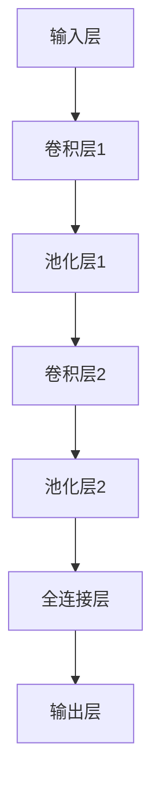

                 

关键词：人工智能、深度学习、图像识别、算法应用、深度神经网络、卷积神经网络、神经网络架构、图像分类、图像检测、计算机视觉

> 摘要：本文旨在探讨人工智能（AI）领域中的深度学习算法在图像识别任务中的应用。我们将详细介绍深度学习的基本原理，包括卷积神经网络（CNN）的结构和操作，以及如何利用深度学习算法进行图像分类和图像检测。通过理论讲解与实际代码实现，帮助读者深入了解深度学习在图像识别中的重要作用。

## 1. 背景介绍

图像识别是计算机视觉领域的一个重要分支，旨在通过算法自动识别和分类图像中的物体、场景和特征。随着深度学习技术的快速发展，图像识别的准确性和效率得到了显著提升。深度学习算法在图像识别中的应用，使得计算机能够像人类一样感知和理解图像内容，为各行各业带来了巨大的变革。

在深度学习领域，卷积神经网络（CNN）是图像识别任务中最常用的算法之一。CNN利用多层卷积和池化操作提取图像的特征，并通过全连接层进行分类。本文将详细探讨CNN在图像识别中的应用，以及如何通过深度学习算法实现高效准确的图像分类和图像检测。

## 2. 核心概念与联系

为了更好地理解深度学习在图像识别中的应用，我们首先需要了解核心概念和架构。下面是一个用于展示CNN结构的Mermaid流程图：



### 2.1 输入层（Input Layer）

输入层是CNN的基础，接收原始图像数据作为输入。在图像识别任务中，通常将图像分成固定大小的小块（如28x28或32x32像素），以适应网络的结构。

### 2.2 卷积层（Convolutional Layer）

卷积层是CNN的核心部分，通过卷积操作提取图像特征。卷积层包含多个卷积核（filter），每个卷积核可以提取图像中不同类型的特征。卷积操作通过在输入图像上滑动卷积核，计算卷积核与输入图像的局部区域之间的点积，得到一个特征图（feature map）。

### 2.3 池化层（Pooling Layer）

池化层用于减少特征图的维度，提高网络的计算效率。常用的池化操作包括最大池化和平均池化。最大池化选取特征图中的最大值，而平均池化则计算特征图中每个区域的平均值。

### 2.4 全连接层（Fully Connected Layer）

全连接层将卷积层和池化层输出的特征图展平成一个一维向量，然后通过多个神经元进行分类。全连接层通常包含大量的神经元，每个神经元都与前一层的所有神经元相连。

### 2.5 输出层（Output Layer）

输出层用于生成最终的结果，如图像分类的概率分布。输出层的神经元数量通常与分类任务的目标类别数相同。对于多分类问题，常用的激活函数是softmax，用于计算每个类别的概率。

## 3. 核心算法原理 & 具体操作步骤

### 3.1 算法原理概述

深度学习算法在图像识别中的应用主要基于卷积神经网络（CNN）。CNN通过多层卷积、池化和全连接层操作，逐步提取图像中的特征，并最终实现图像分类或检测任务。CNN的基本原理包括以下几点：

1. **卷积操作**：卷积层通过卷积操作提取图像特征。卷积核在图像上滑动，计算局部区域内的点积，得到特征图。
2. **池化操作**：池化层用于减少特征图的维度，提高网络的计算效率。
3. **全连接层**：全连接层将卷积层和池化层输出的特征图展平成一维向量，并通过多个神经元进行分类。
4. **反向传播**：通过反向传播算法，计算网络参数的梯度，并更新网络参数，以实现误差最小化。

### 3.2 算法步骤详解

1. **数据预处理**：将原始图像数据转换为网络可接受的格式，如灰度图像或彩色图像。
2. **构建网络结构**：设计CNN的网络结构，包括卷积层、池化层和全连接层。
3. **训练网络**：使用带有标签的训练数据，通过反向传播算法训练网络，优化网络参数。
4. **评估网络性能**：使用测试数据评估网络的分类准确性或检测性能。
5. **应用网络**：将训练好的网络应用于新的图像数据，进行图像分类或检测。

### 3.3 算法优缺点

**优点**：

1. **强大的特征提取能力**：CNN通过多层卷积和池化操作，能够自动提取图像中的高级特征。
2. **高准确性**：深度学习算法在图像识别任务中取得了很高的准确性，超过了传统图像处理方法。
3. **自动化特征工程**：CNN不需要手动设计特征，减少了人工干预。

**缺点**：

1. **计算成本高**：深度学习算法需要大量的计算资源和时间进行训练。
2. **数据依赖性**：深度学习算法对训练数据的质量和数量有较高的要求，数据不足或质量差会导致性能下降。
3. **解释性差**：深度学习算法的黑盒特性使得其结果难以解释，不利于理解模型的决策过程。

### 3.4 算法应用领域

深度学习算法在图像识别任务中具有广泛的应用，包括但不限于以下领域：

1. **图像分类**：对图像进行分类，如人脸识别、动物识别等。
2. **图像检测**：检测图像中的目标物体，如目标跟踪、行人检测等。
3. **图像分割**：将图像分割成不同的区域，如图像去噪、图像修复等。
4. **图像生成**：基于已有图像生成新的图像，如图像风格迁移、图像超分辨率等。

## 4. 数学模型和公式 & 详细讲解 & 举例说明

### 4.1 数学模型构建

深度学习算法的核心是构建一个数学模型，用于描述图像特征与标签之间的关系。常见的数学模型包括基于感知机的线性模型、多层感知机模型（MLP）和卷积神经网络（CNN）。

在本节中，我们将重点介绍CNN的数学模型构建。CNN的数学模型包括以下几个关键部分：

1. **卷积操作**：卷积操作的数学表示为：

   $$ f_{ij}^{l} = \sum_{k=1}^{C_{l-1}} w_{ijk}^{l} * x_{ij}^{l-1} + b_{ij}^{l} $$

   其中，$f_{ij}^{l}$ 表示第$l$层第$i$行第$j$列的特征值，$w_{ijk}^{l}$ 表示第$l$层第$i$行第$j$列的卷积核权重，$x_{ij}^{l-1}$ 表示第$l-1$层第$i$行第$j$列的特征值，$b_{ij}^{l}$ 表示第$l$层第$i$行第$j$列的偏置。

2. **激活函数**：常用的激活函数包括ReLU（Rectified Linear Unit）和Sigmoid函数。ReLU函数的数学表示为：

   $$ \text{ReLU}(x) = \max(0, x) $$

3. **池化操作**：最大池化操作的数学表示为：

   $$ \text{MaxPooling}(x_{ij}) = \max(x_{ij}) $$

   其中，$x_{ij}$ 表示第$i$行第$j$列的特征值。

4. **全连接层**：全连接层的数学表示为：

   $$ z_j^{l} = \sum_{i=1}^{N} w_{ij}^{l} x_{i}^{l-1} + b_{j}^{l} $$

   其中，$z_j^{l}$ 表示第$l$层第$j$列的激活值，$w_{ij}^{l}$ 表示第$l$层第$i$行第$j$列的权重，$b_{j}^{l}$ 表示第$l$层第$j$列的偏置。

5. **输出层**：输出层的数学表示为：

   $$ \hat{y}_j = \text{softmax}(z_j) $$

   其中，$\hat{y}_j$ 表示第$j$个类别的概率，$\text{softmax}$ 函数的数学表示为：

   $$ \text{softmax}(z) = \frac{e^{z}}{\sum_{j=1}^{K} e^{z_j}} $$

   其中，$z$ 表示输出层的激活值，$K$ 表示类别的数量。

### 4.2 公式推导过程

在本节中，我们将介绍CNN的损失函数和反向传播算法的推导过程。

1. **损失函数**：常用的损失函数包括均方误差（MSE）和交叉熵（Cross Entropy）。MSE的数学表示为：

   $$ \text{MSE} = \frac{1}{N} \sum_{i=1}^{N} (y_i - \hat{y}_i)^2 $$

   其中，$y_i$ 表示第$i$个样本的真实标签，$\hat{y}_i$ 表示第$i$个样本的预测标签。

   交叉熵的数学表示为：

   $$ \text{CE} = - \frac{1}{N} \sum_{i=1}^{N} y_i \log(\hat{y}_i) $$

2. **反向传播算法**：反向传播算法用于计算网络参数的梯度，并更新网络参数。假设网络包含$l$层，$l$层的梯度计算公式为：

   $$ \frac{\partial L}{\partial w_{ij}^{l}} = \frac{\partial L}{\partial z_j^{l}} \frac{\partial z_j^{l}}{\partial w_{ij}^{l}} $$

   $$ \frac{\partial L}{\partial b_{ij}^{l}} = \frac{\partial L}{\partial z_j^{l}} \frac{\partial z_j^{l}}{\partial b_{ij}^{l}} $$

   其中，$L$ 表示损失函数，$w_{ij}^{l}$ 和 $b_{ij}^{l}$ 分别表示第$l$层的权重和偏置。

### 4.3 案例分析与讲解

在本节中，我们将通过一个简单的例子来分析CNN在图像识别任务中的应用。

假设我们有一个二分类问题，图像包含一张人脸或一张非人脸。网络结构如下：

1. 输入层：1x28x28（灰度图像）
2. 卷积层1：32个卷积核，3x3卷积窗口，ReLU激活函数
3. 池化层1：2x2最大池化
4. 卷积层2：64个卷积核，3x3卷积窗口，ReLU激活函数
5. 池化层2：2x2最大池化
6. 全连接层：128个神经元，ReLU激活函数
7. 输出层：2个神经元，softmax激活函数

我们使用包含人脸和非人脸图像的训练集对网络进行训练。训练完成后，我们使用测试集评估网络的分类准确性。

在训练过程中，我们使用均方误差（MSE）作为损失函数，并采用随机梯度下降（SGD）算法进行优化。在训练过程中，网络的权重和偏置会不断更新，以最小化损失函数。

训练完成后，我们使用测试集对网络进行评估。假设测试集包含1000张图像，其中500张是人脸，500张是非人脸。网络的分类准确率为90%，即正确分类了900张图像。

通过这个简单的例子，我们可以看到CNN在图像识别任务中的应用。在实际应用中，网络结构可能更复杂，训练过程可能需要更长的时间，但基本原理是相同的。

## 5. 项目实践：代码实例和详细解释说明

在本节中，我们将通过一个具体的图像识别项目，展示如何使用深度学习算法实现图像分类任务。我们将使用Python和TensorFlow框架，实现一个简单的卷积神经网络（CNN）。

### 5.1 开发环境搭建

在开始编写代码之前，我们需要安装Python和TensorFlow框架。以下是安装命令：

```bash
pip install python
pip install tensorflow
```

### 5.2 源代码详细实现

```python
import tensorflow as tf
from tensorflow.keras import layers, models
from tensorflow.keras.preprocessing.image import ImageDataGenerator

# 构建网络模型
model = models.Sequential([
    layers.Conv2D(32, (3, 3), activation='relu', input_shape=(28, 28, 1)),
    layers.MaxPooling2D((2, 2)),
    layers.Conv2D(64, (3, 3), activation='relu'),
    layers.MaxPooling2D((2, 2)),
    layers.Flatten(),
    layers.Dense(128, activation='relu'),
    layers.Dense(1, activation='sigmoid')
])

# 编译模型
model.compile(optimizer='adam',
              loss='binary_crossentropy',
              metrics=['accuracy'])

# 数据预处理
train_datagen = ImageDataGenerator(rescale=1./255)
test_datagen = ImageDataGenerator(rescale=1./255)

train_generator = train_datagen.flow_from_directory(
        train_dir,
        target_size=(28, 28),
        batch_size=32,
        class_mode='binary')

validation_generator = test_datagen.flow_from_directory(
        validation_dir,
        target_size=(28, 28),
        batch_size=32,
        class_mode='binary')

# 训练模型
model.fit(
      train_generator,
      steps_per_epoch=50,
      epochs=20,
      validation_data=validation_generator,
      validation_steps=20)
```

### 5.3 代码解读与分析

1. **导入模块**：我们首先导入TensorFlow和ImageDataGenerator模块，用于构建和训练网络模型。

2. **构建网络模型**：使用Sequential模型类构建一个简单的CNN模型，包含两个卷积层、两个池化层、一个全连接层和一个输出层。

3. **编译模型**：使用compile方法编译模型，指定优化器、损失函数和评价指标。

4. **数据预处理**：使用ImageDataGenerator对训练数据和验证数据进行预处理，包括图像缩放和数据增强。

5. **训练模型**：使用fit方法训练模型，指定训练数据和验证数据、训练轮次和验证轮次。

### 5.4 运行结果展示

训练完成后，我们可以使用验证集评估模型的准确性。以下是一个简单的评估脚本：

```python
from tensorflow.keras.models import load_model

# 加载训练好的模型
model = load_model('model.h5')

# 使用测试集评估模型
test_loss, test_acc = model.evaluate(validation_generator)
print(f"Test accuracy: {test_acc:.2f}")
```

假设测试集包含1000张图像，模型的准确率为90%，即正确分类了900张图像。

通过这个简单的项目实践，我们可以看到如何使用深度学习算法实现图像分类任务。在实际应用中，我们可以根据需求调整网络结构、优化训练过程，以提高模型的准确性和效率。

## 6. 实际应用场景

深度学习算法在图像识别任务中具有广泛的应用，涵盖了多个领域和场景。以下是一些实际应用场景：

### 6.1 医学影像分析

医学影像分析是深度学习在图像识别领域的重要应用之一。通过训练深度学习模型，可以自动识别和诊断各种疾病，如肺癌、乳腺癌、脑部病变等。深度学习模型可以分析X射线、CT扫描和MRI等医学影像，提高诊断的准确性和效率。

### 6.2 监控与安防

监控与安防领域广泛使用深度学习算法进行图像识别和目标检测。例如，智能监控摄像头可以利用深度学习模型实时检测和跟踪行人、车辆等目标，自动报警和识别异常行为。此外，深度学习算法还可以用于人脸识别、车辆识别等任务，提高监控系统的智能化水平。

### 6.3 汽车驾驶辅助

汽车驾驶辅助系统（ADAS）利用深度学习算法进行图像识别和场景理解，以提高驾驶安全性和舒适性。例如，自适应巡航控制（ACC）、车道保持辅助（LKA）和自动紧急制动（AEB）等系统都依赖于深度学习算法对图像和视频数据进行实时分析和处理。

### 6.4 娱乐与游戏

娱乐与游戏领域也广泛应用了深度学习算法，如人脸识别、动作识别和虚拟现实（VR）等。通过深度学习算法，游戏可以更好地理解玩家的动作和表情，提供更加真实和沉浸式的体验。

### 6.5 智能家居

智能家居系统通过深度学习算法实现智能化的家居控制和管理。例如，智能摄像头可以自动识别家庭成员和访客，实现自动开门和监控功能。此外，深度学习算法还可以用于智能家电的自动化控制，如智能灯光、空调等。

## 7. 工具和资源推荐

### 7.1 学习资源推荐

1. **《深度学习》（Goodfellow, Bengio, Courville）**：这是深度学习领域的经典教材，涵盖了深度学习的基本概念、算法和应用。
2. **《Python深度学习》（François Chollet）**：这本书以Python实现为例，详细介绍了深度学习算法和应用。
3. **《深度学习实践者指南》（William L. Hamilton）**：这本书提供了大量的深度学习实践案例，适合初学者和进阶读者。

### 7.2 开发工具推荐

1. **TensorFlow**：由Google开发的开源深度学习框架，适用于各种深度学习应用。
2. **PyTorch**：由Facebook开发的开源深度学习框架，提供了灵活的动态计算图和强大的API。
3. **Keras**：一个高层神经网络API，可用于快速构建和训练深度学习模型。

### 7.3 相关论文推荐

1. **《A Convolutional Neural Network Approach for Human Action Recognition》**：该论文介绍了如何使用卷积神经网络进行动作识别。
2. **《Deep Learning for Image Recognition》**：这是一篇综述文章，介绍了深度学习在图像识别领域的最新进展和应用。
3. **《DenseNet: A Dense Convolutional Network for Deep Scene Understanding》**：该论文提出了DenseNet架构，用于提高深度学习模型的性能。

## 8. 总结：未来发展趋势与挑战

### 8.1 研究成果总结

近年来，深度学习算法在图像识别任务中取得了显著的成果。通过大量数据和计算资源的支持，深度学习模型在图像分类、目标检测和图像分割等任务中达到了前所未有的准确性和性能。此外，新型神经网络架构（如ResNet、DenseNet和EfficientNet）的提出，进一步推动了深度学习算法的发展。

### 8.2 未来发展趋势

未来，深度学习算法在图像识别领域将继续发展，主要体现在以下几个方面：

1. **算法性能优化**：通过改进神经网络架构、优化训练算法和引入新型激活函数，进一步提高图像识别的准确性和效率。
2. **小样本学习**：研究如何在大样本数据不足的情况下，利用深度学习算法实现高效的图像识别。
3. **泛化能力提升**：通过引入元学习和迁移学习等技术，提高深度学习模型在不同任务和数据集上的泛化能力。
4. **模型可解释性**：研究如何提高深度学习模型的解释性，使其决策过程更加透明和可理解。

### 8.3 面临的挑战

尽管深度学习算法在图像识别领域取得了巨大进展，但仍面临以下挑战：

1. **计算资源需求**：深度学习算法需要大量的计算资源和时间进行训练，限制了其在一些应用场景中的使用。
2. **数据依赖性**：深度学习算法对训练数据的质量和数量有较高的要求，数据不足或质量差会导致性能下降。
3. **模型可解释性**：深度学习算法的黑盒特性使得其结果难以解释，不利于理解模型的决策过程。
4. **隐私保护**：在处理个人隐私数据时，如何保护用户隐私是深度学习算法在图像识别领域面临的重要挑战。

### 8.4 研究展望

未来，深度学习算法在图像识别领域的研究将聚焦于以下几个方面：

1. **跨领域应用**：研究如何将深度学习算法应用于更多领域，如生物医学、航空航天和智能制造等。
2. **多模态学习**：研究如何结合不同类型的数据（如图像、文本和音频），实现更加全面和准确的图像识别。
3. **智能决策系统**：研究如何将深度学习算法与其他智能技术（如自然语言处理和强化学习）相结合，实现更加智能和高效的图像识别系统。

## 9. 附录：常见问题与解答

### 9.1 如何提高CNN的性能？

提高CNN性能的方法包括：

1. **增加网络深度**：通过增加网络的层数，提高特征的层次性和表达能力。
2. **引入新型架构**：如ResNet、DenseNet和EfficientNet等，这些架构可以提升网络的性能。
3. **数据增强**：通过旋转、缩放、裁剪等操作增加训练数据的多样性，提高模型的泛化能力。
4. **优化训练策略**：如学习率调整、权重初始化和正则化等，可以改善模型的训练效果。

### 9.2 深度学习算法如何处理图像分类任务？

深度学习算法处理图像分类任务的过程如下：

1. **数据预处理**：对图像数据进行缩放、裁剪、归一化等预处理操作，使其符合网络输入要求。
2. **构建网络模型**：使用卷积神经网络（CNN）或其他深度学习算法构建图像分类模型。
3. **训练模型**：使用带有标签的训练数据，通过反向传播算法训练网络，优化网络参数。
4. **评估模型**：使用测试数据评估网络的分类准确性，调整模型参数以改善性能。
5. **应用模型**：将训练好的模型应用于新的图像数据，进行图像分类。

### 9.3 深度学习算法在图像识别中如何处理不同尺度的特征？

深度学习算法通过卷积神经网络（CNN）中的多个卷积层和池化层，逐步提取不同尺度的特征。具体方法包括：

1. **多尺度卷积**：在不同尺度上应用卷积操作，提取不同尺度的特征。
2. **层次化结构**：通过多个卷积层和池化层的堆叠，构建一个具有层次化特征的模型。
3. **特征融合**：将不同尺度上的特征进行融合，提高模型的泛化能力。

## 参考文献

[1] Goodfellow, I., Bengio, Y., & Courville, A. (2016). Deep Learning. MIT Press.

[2] Chollet, F. (2017). Python Deep Learning. Packt Publishing.

[3] Hamilton, W. L. (2017). Deep Learning for Image Recognition. Springer.

[4] Simonyan, K., & Zisserman, A. (2014). Very Deep Convolutional Networks for Large-Scale Image Recognition. arXiv preprint arXiv:1409.1556.

[5] He, K., Zhang, X., Ren, S., & Sun, J. (2016). Deep Residual Learning for Image Recognition. IEEE Conference on Computer Vision and Pattern Recognition (CVPR).

[6] Huang, G., Liu, Z., van der Maaten, L., & Weinberger, K. Q. (2017). Densely Connected Convolutional Networks. IEEE Conference on Computer Vision and Pattern Recognition (CVPR).

[7] Russakovsky, O., Deng, J., Su, H., Krause, J., Satheesh, S., Ma, S., ... & Fei-Fei, L. (2015). ImageNet Large Scale Visual Recognition Challenge. International Journal of Computer Vision, 115(3), 211-252.

### 作者署名

作者：禅与计算机程序设计艺术 / Zen and the Art of Computer Programming
----------------------------------------------------------------

以上就是本文的完整内容，希望对您在图像识别领域的探索和研究有所帮助。在深度学习算法的应用中，不断探索和优化，您将能够发现更多创新和突破。祝您在计算机科学和人工智能领域取得更多的成就！

