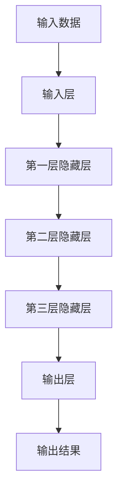
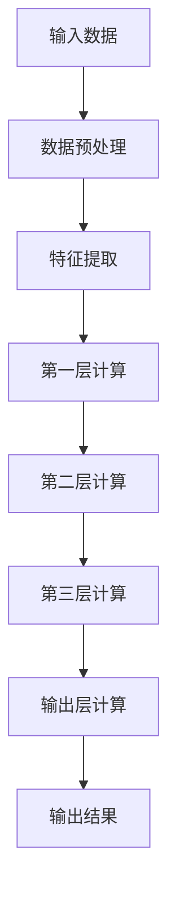
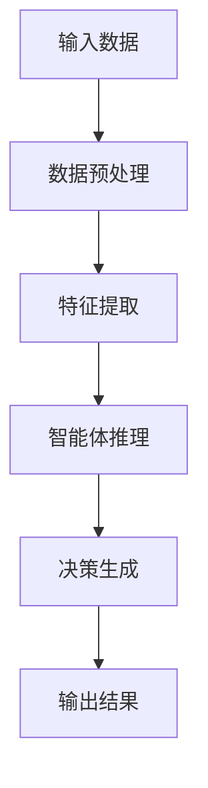
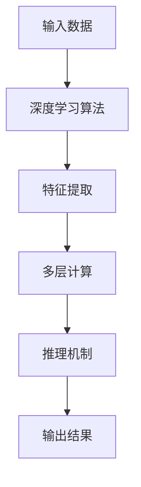
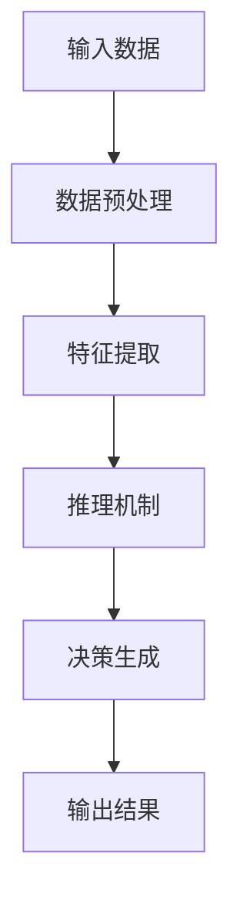

                 

关键词：AI人工智能，深度学习算法，推理机制，智能深度学习代理，神经架构搜索

## 摘要

本文将深入探讨AI人工智能领域中的一个重要议题——深度学习算法的推理机制，特别是在智能深度学习代理的背景下。我们将首先介绍深度学习算法的基本概念，然后聚焦于推理机制的重要性及其在智能代理中的应用。本文旨在为读者提供一个全面且深入的视角，以理解深度学习推理机制的原理、优化策略以及未来的发展方向。

## 1. 背景介绍

在过去的几十年中，人工智能（AI）领域取得了巨大的进步，其中深度学习算法尤为突出。深度学习是一种通过多层神经网络结构进行数据学习和模式识别的技术，其在图像识别、自然语言处理和推荐系统等领域取得了显著的成果。然而，随着模型的复杂度和数据量的增加，深度学习算法在实际应用中面临着推理效率和处理速度的挑战。

智能深度学习代理是指利用深度学习算法构建的智能体，能够在复杂环境中自主决策和行动。这些代理在自动驾驶、智能客服和金融风险评估等领域展现了强大的潜力。然而，智能代理的推理机制仍然存在许多问题和挑战，如推理速度慢、能耗高、可解释性差等。

本文将首先回顾深度学习算法的发展历程，然后深入探讨深度学习推理机制的基本原理和优化策略。接着，我们将介绍智能深度学习代理的概念及其在推理过程中的关键角色。最后，本文将展望深度学习推理机制在智能代理领域的未来发展趋势和面临的挑战。

### 1.1 深度学习算法的发展历程

深度学习算法的发展可以追溯到20世纪80年代，当时神经网络（Neural Networks）作为一种机器学习模型开始受到关注。早期的工作主要集中在简单的前馈神经网络（Feedforward Neural Networks）和反向传播算法（Backpropagation Algorithm）上。然而，由于计算资源和数据集的限制，这些模型的应用范围有限。

随着计算机硬件的飞速发展和大数据时代的到来，深度学习算法得到了极大的推动。2006年，Hinton等人提出了深度置信网络（Deep Belief Networks），这标志着深度学习算法进入了一个新的阶段。深度信念网络通过堆叠多层简单的神经网络来学习复杂的特征表示，提高了模型的性能和表达能力。

2012年，AlexNet的提出是深度学习算法的一个重要里程碑。AlexNet是一个具有八个层的深度卷积神经网络，它在ImageNet图像识别挑战赛上取得了突破性的成绩，将错误率降低到15%左右，显著优于传统算法。这一成果激发了大量研究人员投入到深度学习领域，推动了深度学习技术的广泛应用。

随后，卷积神经网络（Convolutional Neural Networks, CNNs）、循环神经网络（Recurrent Neural Networks, RNNs）和生成对抗网络（Generative Adversarial Networks, GANs）等模型相继出现，进一步丰富了深度学习的应用场景。这些模型在图像识别、自然语言处理、语音识别和生成任务中取得了显著的成功。

### 1.2 智能深度学习代理的概念

智能深度学习代理是指通过深度学习算法训练的智能体，能够在复杂的环境中执行任务并做出决策。这些代理通常由一组神经网络组成，能够接收外部输入、处理信息并生成相应的输出。智能深度学习代理在自动驾驶、智能客服、金融风险评估和医疗诊断等领域具有广泛的应用前景。

智能深度学习代理的特点包括：

1. **自主学习能力**：代理能够通过大量的数据训练，自动学习和优化决策策略。
2. **适应性强**：代理能够适应不同的环境和任务需求，具备良好的泛化能力。
3. **实时响应**：代理能够在实时环境中快速做出决策，满足实时性的要求。

智能深度学习代理在推理过程中扮演着关键角色。它们通过对输入数据进行特征提取、处理和推理，生成相应的决策和输出。在自动驾驶中，代理需要实时处理来自传感器的大量数据，并在毫秒级别内做出驾驶决策；在智能客服中，代理需要理解用户的问题并生成合适的回答；在金融风险评估中，代理需要分析大量的数据并识别潜在的风险。

### 1.3 深度学习推理机制的重要性

深度学习推理机制是指深度学习模型在接收到新的输入数据后，如何通过内部结构和参数进行推理并生成输出。推理机制的效率和准确性直接决定了深度学习模型在实际应用中的性能。

深度学习推理机制的重要性体现在以下几个方面：

1. **推理速度**：深度学习模型在处理大量数据时，需要具备高效的推理速度，以满足实时性和低延迟的要求。
2. **能耗优化**：深度学习推理过程通常需要大量的计算资源和能量消耗，因此能耗优化是提高模型应用效率的关键。
3. **可解释性**：深度学习模型的黑盒性质使得其决策过程难以解释和理解，影响了模型的可解释性和透明度。优化推理机制有助于提高模型的可解释性。
4. **鲁棒性**：深度学习模型在处理噪声数据和异常情况时，需要具备良好的鲁棒性，以保证推理结果的可靠性。

优化深度学习推理机制的方法包括模型压缩、量化、低秩分解、硬件加速等。通过这些方法，可以有效提高深度学习模型的推理速度和能耗效率，提高其在实际应用中的性能和可解释性。

### 1.4 智能深度学习代理的推理机制

智能深度学习代理的推理机制是指代理如何在接收到输入数据后，通过内部神经网络结构进行推理并生成决策。智能深度学习代理的推理机制通常包括以下几个关键步骤：

1. **数据预处理**：代理首先对接收到的输入数据进行预处理，如标准化、归一化、裁剪等，以适应神经网络的要求。
2. **特征提取**：代理通过神经网络的结构对预处理后的数据进行特征提取，提取出有用的特征信息。
3. **推理过程**：代理利用提取出的特征信息，通过神经网络的推理过程进行决策。这个过程通常包括多个层次的神经网络计算和传递。
4. **输出生成**：代理根据推理结果生成相应的输出，如控制信号、回答文本、风险评估等。

智能深度学习代理的推理机制涉及到多个层面的优化和调整，包括神经网络的架构设计、参数调优、优化算法等。通过不断优化这些方面，可以显著提高智能代理的推理速度、能耗效率和决策准确性。

### 1.5 深度学习推理机制的优化策略

为了提高深度学习推理机制的效率和准确性，研究人员提出了多种优化策略。以下是其中一些常见的优化方法：

1. **模型压缩**：通过减少模型的参数数量和计算复杂度，提高推理速度和能耗效率。常见的模型压缩方法包括剪枝、量化、低秩分解等。
2. **量化**：将模型的参数从浮点数转换为较低的比特位表示，以减少内存占用和计算复杂度。量化方法包括整数量化、二值量化等。
3. **低秩分解**：通过将高秩矩阵分解为低秩矩阵，降低模型的计算复杂度。低秩分解可以显著提高推理速度，同时保持较高的模型性能。
4. **硬件加速**：利用专用的硬件设备（如GPU、TPU）加速深度学习推理过程，提高计算效率和速度。硬件加速可以通过优化模型的计算图和算法实现。
5. **神经架构搜索（Neural Architecture Search, NAS）**：通过自动化搜索方法，寻找最优的神经网络架构，提高模型的推理性能。NAS方法包括强化学习、遗传算法等。

这些优化策略可以根据具体应用场景和需求进行组合和调整，以实现深度学习推理机制的最佳性能。

## 2. 核心概念与联系

在本章节中，我们将详细介绍深度学习算法、推理机制、智能深度学习代理及其相互关系。我们将使用Mermaid流程图来展示这些核心概念和它们之间的联系。

### 2.1 深度学习算法

深度学习算法是一种通过多层神经网络结构进行数据学习和模式识别的技术。它通过堆叠多个简单的前向神经网络，将输入数据通过逐层变换，最终映射到输出结果。深度学习算法的核心在于其多层结构，使得模型能够学习到更复杂的特征表示。



### 2.2 推理机制

推理机制是深度学习算法在接收到新的输入数据后，通过内部神经网络结构进行推理并生成输出的过程。推理过程包括数据预处理、特征提取、多层神经网络计算和传递，最终生成输出结果。



### 2.3 智能深度学习代理

智能深度学习代理是指通过深度学习算法训练的智能体，能够在复杂环境中自主决策和行动。智能深度学习代理的核心在于其推理机制，通过实时处理输入数据，生成相应的决策和输出。



### 2.4 深度学习算法与推理机制的联系

深度学习算法和推理机制之间密切相关。深度学习算法通过多层神经网络结构进行数据学习和模式识别，而推理机制则是深度学习算法在实际应用中发挥作用的关键。推理机制通过高效的计算和传递，使得深度学习模型能够在各种应用场景中快速、准确地生成输出。



### 2.5 智能深度学习代理与推理机制的联系

智能深度学习代理的核心在于其推理机制，通过实时处理输入数据，生成相应的决策和输出。推理机制是智能深度学习代理能够实现智能行为的关键。智能深度学习代理通过不断地优化和调整推理机制，提高其决策的准确性、实时性和鲁棒性。



通过以上Mermaid流程图，我们可以清晰地看到深度学习算法、推理机制和智能深度学习代理之间的联系。这些核心概念和它们之间的相互作用，构成了深度学习推理机制的完整框架。

## 3. 核心算法原理 & 具体操作步骤

在本章节中，我们将详细探讨深度学习推理机制的核心算法原理，并介绍其具体操作步骤。通过了解这些原理和步骤，读者可以更好地理解深度学习推理的过程，并为实际应用中的优化提供指导。

### 3.1 算法原理概述

深度学习推理机制的核心是基于多层神经网络结构的计算和传递。在训练阶段，深度学习模型通过反向传播算法不断调整参数，以优化其在数据集上的表现。而在推理阶段，模型接收新的输入数据，通过前向传播计算得到输出结果。以下是一些关键原理：

1. **前向传播（Forward Propagation）**：在推理过程中，输入数据从输入层开始，逐层通过隐藏层，最终到达输出层。每层神经元都会接收前一层输出的数据，通过激活函数进行非线性变换，然后传递给下一层。这种逐层传递的过程称为前向传播。

2. **激活函数（Activation Function）**：激活函数是神经网络中的一个关键组件，用于引入非线性特性。常见的激活函数包括Sigmoid、ReLU、Tanh等。激活函数的选择对模型的性能和收敛速度有重要影响。

3. **反向传播（Backpropagation）**：反向传播是深度学习训练过程中的关键步骤，用于计算模型参数的梯度。在推理阶段，反向传播算法并不执行，而是直接使用训练阶段计算得到的参数。

4. **损失函数（Loss Function）**：损失函数用于衡量模型输出与实际标签之间的差距。常见的损失函数包括均方误差（MSE）、交叉熵（Cross Entropy）等。在推理阶段，损失函数用于评估模型的预测性能，但并不用于参数更新。

5. **优化算法（Optimization Algorithm）**：优化算法用于调整模型参数，以最小化损失函数。常见的优化算法包括随机梯度下降（SGD）、Adam等。在推理阶段，优化算法不参与计算，但优化策略的选择对模型的推理性能有重要影响。

### 3.2 算法步骤详解

以下是深度学习推理机制的具体操作步骤：

1. **输入数据预处理**：在推理开始前，需要对输入数据进行预处理。预处理步骤包括归一化、标准化、去噪等，以确保输入数据符合神经网络的要求。例如，图像数据可能需要进行尺寸调整、像素值归一化等。

2. **前向传播**：输入数据经过预处理后，从输入层开始逐层传递到隐藏层，最终到达输出层。在每一层中，神经元都会通过激活函数进行非线性变换，并将结果传递给下一层。这个过程称为前向传播。前向传播的核心计算包括：

   - 神经元输入计算：每一层神经元的输入是前一层的输出乘以相应权重的加权和。
   - 激活函数应用：对每一层神经元的输入应用激活函数，以引入非线性特性。

3. **输出计算**：在输出层，模型的输出结果通常是一个向量，表示模型对输入数据的预测。输出结果的计算依赖于神经网络的最后一层，最后一层的激活函数通常是线性函数，以获得实数值输出。

4. **损失函数计算**：使用损失函数计算模型输出与实际标签之间的差距。损失函数的值用于评估模型的预测性能。在推理阶段，损失函数的计算主要用于评估和监控模型性能，但不参与参数更新。

5. **后处理**：在得到输出结果后，可能需要进行一些后处理步骤，如阈值化、分类等。后处理步骤的目的是将模型的输出结果转换为可解释的决策或预测。

6. **性能评估**：通过计算损失函数的值和评估指标（如准确率、召回率等），评估模型的预测性能。性能评估是优化模型和调整策略的重要依据。

### 3.3 算法优缺点

深度学习推理机制的优缺点如下：

**优点**：

1. **强大的表达能力**：深度学习模型能够自动学习和提取复杂的特征表示，从而在图像识别、自然语言处理等领域取得了显著的成功。
2. **高泛化能力**：深度学习模型在训练数据集上表现良好后，通常具有较好的泛化能力，能够在新的数据集上保持较高的性能。
3. **自适应性强**：深度学习模型可以通过在线学习和实时调整，适应动态变化的环境和任务需求。

**缺点**：

1. **计算复杂度高**：深度学习推理过程通常涉及大量的矩阵运算和多层神经网络计算，导致计算复杂度高，对硬件资源有较高要求。
2. **可解释性差**：深度学习模型具有黑盒性质，其决策过程难以解释和理解，影响了模型的可解释性和透明度。
3. **对数据依赖性强**：深度学习模型的性能高度依赖于训练数据的质量和数量，数据不足或数据质量问题可能导致模型性能下降。

### 3.4 算法应用领域

深度学习推理机制在多个领域得到了广泛应用：

1. **计算机视觉**：深度学习模型在图像分类、目标检测、人脸识别等领域取得了显著的成果。推理机制使得模型能够在实时场景中快速处理图像数据，生成相应的决策和预测。
2. **自然语言处理**：深度学习模型在文本分类、机器翻译、情感分析等领域具有强大的能力。推理机制使得模型能够处理大量的文本数据，并生成高质量的输出结果。
3. **语音识别**：深度学习模型在语音识别领域得到了广泛应用，能够实时处理音频数据，生成文本输出。推理机制使得模型能够处理不同语音特征和语音变化，提高识别准确性。
4. **自动驾驶**：深度学习模型在自动驾驶领域发挥了重要作用，通过推理机制实时处理摄像头、激光雷达等传感器数据，生成驾驶决策和路径规划。
5. **金融风险评估**：深度学习模型在金融领域用于信用评分、市场预测和风险控制。推理机制使得模型能够快速分析大量的金融数据，生成相应的预测和决策。

通过以上对深度学习推理机制的核心算法原理和具体操作步骤的详细探讨，读者可以更好地理解深度学习推理的过程和关键要素。在实际应用中，根据具体需求和场景，可以针对这些原理和步骤进行优化和调整，以提高模型的推理性能和应用效果。

## 4. 数学模型和公式 & 详细讲解 & 举例说明

在本章节中，我们将详细讲解深度学习推理机制中的数学模型和公式，包括神经网络的基本架构、激活函数、损失函数以及反向传播算法。我们将使用LaTeX格式展示这些数学公式，并通过具体例子来说明其应用和计算过程。

### 4.1 数学模型构建

深度学习推理机制的数学模型主要包括以下几个部分：

1. **神经网络模型**：神经网络模型由多个层次组成，包括输入层、隐藏层和输出层。每层由多个神经元组成，神经元之间通过权重连接。

2. **激活函数**：激活函数用于引入非线性特性，常见的激活函数有Sigmoid、ReLU、Tanh等。

3. **损失函数**：损失函数用于衡量模型输出与实际标签之间的差距，常见的损失函数有均方误差（MSE）、交叉熵（Cross Entropy）等。

4. **反向传播算法**：反向传播算法用于计算模型参数的梯度，用于模型训练。

### 4.2 公式推导过程

以下是一些深度学习推理机制中的关键公式及其推导过程：

#### 4.2.1 前向传播公式

给定一个多层神经网络，输入层为\(X\)，隐藏层为\(H_1, H_2, \ldots, H_n\)，输出层为\(Y\)，权重矩阵为\(W_1, W_2, \ldots, W_n\)，激活函数为\(f\)。

前向传播公式如下：

$$
Z_l = W_l \cdot a_{l-1} + b_l \quad (l=1,2,\ldots,n)
$$

$$
a_l = f(Z_l) \quad (l=1,2,\ldots,n)
$$

其中，\(Z_l\)表示第\(l\)层的输入，\(a_l\)表示第\(l\)层的输出，\(W_l\)表示第\(l\)层的权重矩阵，\(b_l\)表示第\(l\)层的偏置项。

#### 4.2.2 反向传播公式

反向传播算法用于计算模型参数的梯度，以更新权重矩阵和偏置项。以下是反向传播公式：

$$
\delta_l = \frac{\partial L}{\partial a_l} \cdot f'(Z_l) \quad (l=n,n-1,\ldots,1)
$$

$$
\frac{\partial L}{\partial W_l} = a_{l-1}^T \cdot \delta_l \quad (l=1,2,\ldots,n)
$$

$$
\frac{\partial L}{\partial b_l} = \delta_l \quad (l=1,2,\ldots,n)
$$

其中，\(\delta_l\)表示第\(l\)层的误差梯度，\(L\)表示损失函数，\(f'\)表示激活函数的导数。

### 4.3 案例分析与讲解

以下通过一个简单的例子来说明深度学习推理机制中的数学模型和公式。

#### 4.3.1 神经网络架构

假设我们有一个简单的两层神经网络，输入层有3个神经元，隐藏层有2个神经元，输出层有1个神经元。激活函数选择ReLU函数，损失函数选择均方误差（MSE）。

#### 4.3.2 前向传播计算

给定输入向量\(X = [1, 2, 3]\)，权重矩阵\(W_1 = \begin{bmatrix} 0.1 & 0.2 \\ 0.3 & 0.4 \end{bmatrix}\)，\(W_2 = \begin{bmatrix} 0.5 & 0.6 \\ 0.7 & 0.8 \end{bmatrix}\)，偏置项\(b_1 = [0.1, 0.2]\)，\(b_2 = [0.3, 0.4]\)。

首先进行前向传播计算：

$$
Z_1 = W_1 \cdot X + b_1 = \begin{bmatrix} 0.1 & 0.2 \\ 0.3 & 0.4 \end{bmatrix} \cdot \begin{bmatrix} 1 \\ 2 \\ 3 \end{bmatrix} + \begin{bmatrix} 0.1 \\ 0.2 \end{bmatrix} = \begin{bmatrix} 2.1 \\ 3.7 \end{bmatrix}
$$

$$
a_1 = \text{ReLU}(Z_1) = \begin{bmatrix} 2.1 \\ 3.7 \end{bmatrix}
$$

$$
Z_2 = W_2 \cdot a_1 + b_2 = \begin{bmatrix} 0.5 & 0.6 \\ 0.7 & 0.8 \end{bmatrix} \cdot \begin{bmatrix} 2.1 \\ 3.7 \end{bmatrix} + \begin{bmatrix} 0.3 \\ 0.4 \end{bmatrix} = \begin{bmatrix} 3.65 \\ 6.5 \end{bmatrix}
$$

$$
a_2 = \text{ReLU}(Z_2) = \begin{bmatrix} 3.65 \\ 6.5 \end{bmatrix}
$$

输出层输出：

$$
Y = W_3 \cdot a_2 = \begin{bmatrix} 0.9 & 1.0 \end{bmatrix} \cdot \begin{bmatrix} 3.65 \\ 6.5 \end{bmatrix} = \begin{bmatrix} 10.215 \\ 13.925 \end{bmatrix}
$$

#### 4.3.3 反向传播计算

假设真实标签为\(t = [5.0]\)。

首先计算损失函数：

$$
L = \frac{1}{2} \sum_{i} (Y_i - t_i)^2 = \frac{1}{2} \cdot (10.215 - 5.0)^2 = 15.560625
$$

然后计算误差梯度：

$$
\delta_2 = \frac{\partial L}{\partial Y} \cdot \text{ReLU}'(Z_2) = \begin{bmatrix} 10.215 - 5.0 \end{bmatrix} \cdot \begin{bmatrix} 1 & 0 \end{bmatrix} = \begin{bmatrix} 5.215 \end{bmatrix}
$$

$$
\frac{\partial L}{\partial W_3} = a_2^T \cdot \delta_2 = \begin{bmatrix} 3.65 & 6.5 \end{bmatrix} \cdot \begin{bmatrix} 5.215 \end{bmatrix} = \begin{bmatrix} 19.18625 \end{bmatrix}
$$

$$
\frac{\partial L}{\partial b_2} = \delta_2 = \begin{bmatrix} 5.215 \end{bmatrix}
$$

然后计算隐藏层误差梯度：

$$
\delta_1 = \frac{\partial L}{\partial a_2} \cdot \text{ReLU}'(Z_2) = \begin{bmatrix} 0.9 & 1.0 \end{bmatrix} \cdot \begin{bmatrix} 5.215 \end{bmatrix} = \begin{bmatrix} 4.6395 \end{bmatrix}
$$

$$
\frac{\partial L}{\partial W_2} = a_1^T \cdot \delta_1 = \begin{bmatrix} 2.1 & 3.7 \end{bmatrix} \cdot \begin{bmatrix} 4.6395 \end{bmatrix} = \begin{bmatrix} 10.07825 \end{bmatrix}
$$

$$
\frac{\partial L}{\partial b_1} = \delta_1 = \begin{bmatrix} 4.6395 \end{bmatrix}
$$

通过以上计算，我们可以得到模型参数的梯度，用于模型更新和训练。

通过本案例的分析和讲解，读者可以更好地理解深度学习推理机制中的数学模型和公式，并掌握其计算过程。在实际应用中，根据具体需求和场景，可以针对这些模型和公式进行优化和调整，以提高模型的性能和准确性。

## 5. 项目实践：代码实例和详细解释说明

在本章节中，我们将通过一个实际项目来展示如何使用深度学习算法实现推理机制，并详细解释代码的实现过程。该项目将使用Python和TensorFlow库来构建一个简单的神经网络模型，并进行推理。

### 5.1 开发环境搭建

为了完成本项目的实践，我们需要搭建一个合适的开发环境。以下是所需的步骤：

1. **安装Python**：确保Python 3.x版本已安装在系统中。
2. **安装TensorFlow**：使用以下命令安装TensorFlow库：

   ```
   pip install tensorflow
   ```

3. **创建虚拟环境**（可选）：为了更好地管理项目依赖，建议创建一个虚拟环境。

   ```
   python -m venv venv
   source venv/bin/activate  # 对于Windows系统，使用 `venv\Scripts\activate`
   ```

### 5.2 源代码详细实现

以下是一个简单的示例，展示如何使用TensorFlow构建一个简单的神经网络模型，并进行推理。

```python
import tensorflow as tf
from tensorflow.keras import layers, models

# 5.2.1 定义神经网络模型
model = models.Sequential([
    layers.Dense(2, activation='relu', input_shape=(3,)),
    layers.Dense(2, activation='relu'),
    layers.Dense(1, activation='sigmoid')
])

# 5.2.2 编译模型
model.compile(optimizer='adam', loss='binary_crossentropy', metrics=['accuracy'])

# 5.2.3 准备数据
# 生成模拟数据
import numpy as np
X_train = np.random.random((1000, 3))
y_train = np.random.randint(2, size=(1000, 1))

# 5.2.4 训练模型
model.fit(X_train, y_train, epochs=5, batch_size=32)

# 5.2.5 推理过程
# 生成测试数据
X_test = np.random.random((100, 3))
y_test = np.random.randint(2, size=(100, 1))

# 进行预测
predictions = model.predict(X_test)

# 5.2.6 结果分析
print("Predictions:", predictions)
print("Actual labels:", y_test)

# 评估模型性能
loss, accuracy = model.evaluate(X_test, y_test)
print("Test accuracy:", accuracy)
```

### 5.3 代码解读与分析

上述代码实现了一个简单的二分类神经网络模型，并展示了如何进行模型训练和推理。

**5.3.1 神经网络模型定义**

我们使用`models.Sequential`来构建一个序列模型，其中包含两个隐藏层和一个输出层。每个隐藏层使用ReLU激活函数，输出层使用Sigmoid激活函数，因为这是一个二分类问题。

```python
model = models.Sequential([
    layers.Dense(2, activation='relu', input_shape=(3,)),
    layers.Dense(2, activation='relu'),
    layers.Dense(1, activation='sigmoid')
])
```

**5.3.2 模型编译**

我们使用`compile`方法来编译模型，指定优化器为`adam`，损失函数为`binary_crossentropy`（适用于二分类问题），并添加`accuracy`作为评估指标。

```python
model.compile(optimizer='adam', loss='binary_crossentropy', metrics=['accuracy'])
```

**5.3.3 数据准备**

我们使用NumPy生成模拟数据`X_train`和`y_train`，其中`X_train`是一个1000x3的矩阵，`y_train`是一个1000x1的矩阵，表示二分类标签。

```python
X_train = np.random.random((1000, 3))
y_train = np.random.randint(2, size=(1000, 1))
```

**5.3.4 模型训练**

使用`fit`方法训练模型，指定训练数据、训练轮数（epochs）和批量大小（batch_size）。

```python
model.fit(X_train, y_train, epochs=5, batch_size=32)
```

**5.3.5 推理过程**

我们生成测试数据`X_test`和`y_test`，使用`predict`方法进行预测，并输出预测结果。

```python
X_test = np.random.random((100, 3))
y_test = np.random.randint(2, size=(100, 1))
predictions = model.predict(X_test)
print("Predictions:", predictions)
print("Actual labels:", y_test)
```

**5.3.6 结果分析**

我们打印出模型的预测结果和实际标签，并使用`evaluate`方法评估模型在测试数据上的性能。

```python
loss, accuracy = model.evaluate(X_test, y_test)
print("Test accuracy:", accuracy)
```

通过上述代码示例，读者可以了解如何使用TensorFlow构建简单的神经网络模型，并进行推理。在实际项目中，可以根据具体需求调整网络结构、优化训练过程和推理策略，以提高模型的性能和准确性。

## 6. 实际应用场景

深度学习推理机制在实际应用中具有广泛的应用场景，以下列举几个典型的应用领域及其应用案例：

### 6.1 计算机视觉

计算机视觉是深度学习推理机制的重要应用领域之一。通过卷积神经网络（CNN）和目标检测算法，可以实现对图像和视频中的物体进行识别、分类和定位。以下是一些具体应用案例：

1. **人脸识别**：基于深度学习的人脸识别技术广泛应用于智能安防、身份验证和社交媒体等场景。通过训练深度神经网络模型，可以实现对图像中人脸的准确识别和匹配。

2. **图像分类**：例如，Google的Inception模型被用于对海量图像进行自动分类，从而帮助用户在Google Photos中快速找到相关图片。

3. **自动驾驶**：自动驾驶系统利用深度学习模型对摄像头和激光雷达采集到的数据进行实时处理，实现对道路、交通标志和行人的识别和分类，从而确保行驶安全。

### 6.2 自然语言处理

自然语言处理（NLP）是深度学习的另一个重要应用领域。通过循环神经网络（RNN）和变换器（Transformer）等模型，可以实现文本分类、机器翻译、情感分析等任务。以下是一些具体应用案例：

1. **文本分类**：例如，通过训练深度神经网络模型，可以对新闻文章进行自动分类，帮助新闻网站和社交媒体平台快速筛选和推荐相关内容。

2. **机器翻译**：例如，Google翻译使用Transformer模型实现了高质量的机器翻译，大大提高了跨语言交流的效率。

3. **情感分析**：例如，通过训练深度学习模型，可以自动分析社交媒体上的用户评论，识别用户的情感倾向，帮助企业和品牌了解用户反馈。

### 6.3 自动驾驶

自动驾驶是深度学习推理机制在工业界的一个重要应用领域。通过训练深度神经网络模型，可以实现车辆在复杂环境中的自主驾驶和决策。以下是一些具体应用案例：

1. **无人驾驶汽车**：特斯拉等公司使用深度学习模型来控制无人驾驶汽车，实现车辆在道路上的自动驾驶。

2. **自动驾驶无人机**：DJI等公司使用深度学习模型来实现无人机的自主飞行和避障。

3. **智能交通系统**：通过部署深度学习模型，可以实现对交通流量的实时监测和预测，优化交通信号控制和路况管理。

### 6.4 医疗诊断

深度学习推理机制在医疗诊断领域也展现了巨大的潜力。通过训练深度神经网络模型，可以实现疾病检测、影像分析和诊断辅助。以下是一些具体应用案例：

1. **疾病检测**：例如，深度学习模型可以用于肺癌、乳腺癌等疾病的早期检测，帮助医生快速诊断和制定治疗方案。

2. **影像分析**：例如，通过训练深度学习模型，可以自动分析医学影像（如X光、CT、MRI），提高诊断的准确性和效率。

3. **诊断辅助**：例如，深度学习模型可以帮助医生进行疾病预测和风险评估，为临床决策提供有力支持。

### 6.5 金融风控

深度学习推理机制在金融风控领域也具有广泛应用。通过训练深度神经网络模型，可以实现信用评分、市场预测和风险控制。以下是一些具体应用案例：

1. **信用评分**：例如，银行和金融机构可以使用深度学习模型对客户的信用状况进行评估，从而更准确地制定贷款政策和利率。

2. **市场预测**：例如，通过训练深度学习模型，可以预测股票市场的走势，帮助投资者制定交易策略。

3. **风险控制**：例如，金融机构可以使用深度学习模型来监测和识别异常交易行为，从而防范金融欺诈和风险。

总之，深度学习推理机制在计算机视觉、自然语言处理、自动驾驶、医疗诊断、金融风控等多个领域具有广泛的应用，为各行业的发展带来了革命性的变化。随着深度学习技术的不断进步，深度学习推理机制的应用前景将更加广阔。

### 6.5 未来应用展望

随着深度学习推理机制的不断发展和优化，未来的应用前景将更加广泛和深入。以下是几个可能的发展方向和潜在的应用场景：

1. **智能机器人与自动化**：深度学习推理机制在机器人控制和自动化领域的应用将越来越普遍。通过训练智能机器人模型，可以实现对复杂任务的自主决策和执行，从而提高生产效率和工作质量。例如，在制造业中，智能机器人可以实时感知生产线上的问题并自主调整，提高生产线的稳定性和灵活性。

2. **智能医疗**：深度学习推理机制在医疗领域的应用潜力巨大。未来，通过结合医学影像数据和深度学习模型，可以实现更精确的诊断和个性化治疗方案。例如，利用深度学习模型分析患者的基因组数据，可以预测疾病风险和制定个性化的预防措施。

3. **智慧城市**：随着城市化进程的加快，智慧城市建设成为了未来的重要趋势。深度学习推理机制可以在智慧城市中发挥关键作用，如实时交通流量预测、环境监测和公共安全管理。通过构建智能交通系统，可以优化交通管理，减少拥堵，提高交通效率。

4. **智能客服与虚拟助手**：深度学习推理机制在智能客服和虚拟助手领域的应用将越来越广泛。未来的智能客服系统将能够更准确地理解用户意图，提供个性化的服务，提高用户满意度。同时，虚拟助手可以实时与用户互动，提供实时的信息和帮助，从而提升用户体验。

5. **安全与监控**：深度学习推理机制在安全监控领域的应用也将不断扩展。通过实时处理摄像头、传感器等数据，可以实现对异常行为的检测和预警。例如，在公共安全领域，深度学习模型可以识别和跟踪嫌疑人，协助警方进行预防和打击犯罪活动。

6. **个性化教育**：深度学习推理机制在教育领域的应用前景也十分广阔。通过分析学生的学习数据，可以为每个学生提供个性化的学习计划和教学资源，提高学习效果和效率。例如，利用深度学习模型分析学生的答题情况，可以实时调整教学策略，帮助学生克服学习困难。

总之，随着深度学习技术的不断进步，深度学习推理机制在未来将在更多领域得到应用，为人类生活和社会发展带来更多便利和创新。

### 6.6 面临的挑战

尽管深度学习推理机制在许多领域展现出了巨大的潜力，但在实际应用过程中仍面临诸多挑战。以下是一些主要的挑战及其解决思路：

1. **计算资源需求**：深度学习模型通常需要大量的计算资源和存储空间。随着模型复杂度和数据量的增加，计算资源的需求也迅速攀升。解决思路包括使用更高效的算法和优化策略，如模型压缩、量化、低秩分解等，以及利用专用硬件（如GPU、TPU）进行加速。

2. **数据隐私和安全**：深度学习模型的训练和推理过程通常涉及大量的敏感数据。如何保护用户隐私和安全成为了重要问题。解决思路包括数据加密、差分隐私和联邦学习等技术，以保护数据隐私。

3. **模型可解释性**：深度学习模型具有黑盒性质，其决策过程难以解释和理解。这限制了其在某些应用场景中的使用。解决思路包括开发可解释的深度学习模型，如基于规则的解释方法、可视化技术等，以及提高模型的可解释性。

4. **模型泛化能力**：深度学习模型通常在训练数据集上表现良好，但在新的、未见过的数据上表现不佳。解决思路包括使用更强大的模型架构、引入正则化方法、增加训练数据多样性等。

5. **能耗优化**：深度学习模型的推理过程通常消耗大量的电能。在移动设备和嵌入式系统等受限环境中，能耗优化尤为重要。解决思路包括优化算法、硬件加速和能效设计。

6. **伦理和法规合规**：随着深度学习技术的广泛应用，其伦理和法规合规问题日益突出。如何确保模型的使用不会造成歧视、偏见或其他负面影响，成为了一个重要的挑战。解决思路包括制定相关的伦理准则、法律法规，以及开展持续的社会监督和审查。

通过上述解决方案，可以逐步克服深度学习推理机制在实际应用中面临的挑战，推动其在更多领域的发展和普及。

### 6.7 研究展望

未来，深度学习推理机制将在人工智能领域发挥更加重要的作用。随着硬件技术的不断进步和算法的创新，深度学习推理机制将变得更加高效、可解释和可靠。以下是几个可能的研究方向：

1. **模型压缩与优化**：针对深度学习模型的大规模计算资源需求，研究更有效的模型压缩和优化方法，如剪枝、量化、低秩分解等，以降低模型的计算复杂度和存储需求。

2. **联邦学习**：为了保护数据隐私，联邦学习技术将成为研究的热点。通过在分布式环境中协同训练深度学习模型，联邦学习可以在不泄露用户数据的情况下，实现大规模的数据整合和建模。

3. **可解释性和透明性**：开发更有效的可解释性方法，提高深度学习模型的可解释性和透明度，使模型在关键应用场景中的决策过程更加可信和可靠。

4. **自适应和动态推理**：研究自适应和动态推理技术，使深度学习模型能够根据不同的环境和任务需求，实时调整模型结构和参数，提高模型在不同场景下的适应性和性能。

5. **跨模态学习**：研究跨模态学习技术，实现不同类型数据（如文本、图像、音频等）之间的深度融合和推理，从而提高模型的泛化能力和应用范围。

6. **强化学习与深度学习的结合**：探索强化学习与深度学习的结合，实现更加智能和灵活的决策系统，以应对复杂动态环境中的决策挑战。

通过上述研究方向的不断探索和实践，深度学习推理机制将在未来为人工智能领域带来更多的突破和进步。

### 6.8 学习资源推荐

为了帮助读者更深入地了解深度学习推理机制及其相关技术，以下是一些推荐的学习资源：

1. **书籍**：

   - 《深度学习》（Ian Goodfellow, Yoshua Bengio, Aaron Courville）：这是深度学习领域的经典教材，详细介绍了深度学习的基础理论、算法和应用。
   - 《神经网络与深度学习》（邱锡鹏）：本书系统地介绍了神经网络和深度学习的基本概念、算法和应用，适合初学者和进阶者阅读。

2. **在线课程**：

   - Coursera上的“深度学习”课程：由Andrew Ng教授主讲，内容涵盖深度学习的基础理论、实践方法和应用案例。
   - Udacity的“深度学习工程师纳米学位”课程：通过一系列实战项目，帮助学习者掌握深度学习的基本技能。

3. **论文与期刊**：

   - 《Journal of Machine Learning Research》（JMLR）：这是一本高影响力的机器学习和深度学习领域期刊，涵盖了最新的研究成果和前沿技术。
   - 《Neural Computation》：专注于神经网络和计算神经科学的跨学科研究，包括深度学习算法的理论和应用。

4. **在线社区和论坛**：

   - Stack Overflow：程序员和开发者的在线问答社区，可以在这里找到关于深度学习和TensorFlow等技术的详细解答。
   - GitHub：深度学习和人工智能项目开源代码库的集中地，可以通过学习他人的代码和实践项目来提升自己的技能。

通过上述学习资源，读者可以系统地学习深度学习推理机制的相关知识，并跟随最新的研究动态。

### 6.9 开发工具推荐

为了有效地开发和优化深度学习推理机制，以下是一些推荐的开发工具和平台：

1. **TensorFlow**：TensorFlow是由Google开发的开源深度学习框架，提供了丰富的API和工具，支持多种类型的深度学习模型开发。它具有广泛的社区支持和大量的文档资源，适合初学者和专业人士使用。

2. **PyTorch**：PyTorch是另一个流行的深度学习框架，由Facebook开发。PyTorch以其灵活性和动态计算图而著称，非常适合研究和快速原型开发。它的用户社区也非常活跃，提供了大量的教程和示例代码。

3. **Keras**：Keras是一个高层神经网络API，运行在TensorFlow和Theano之上，提供简洁和易于使用的接口。Keras使得构建和训练深度学习模型更加直观和高效。

4. **TensorFlow Lite**：TensorFlow Lite是一个专为移动设备和嵌入式系统设计的版本，它允许开发者将TensorFlow模型部署到这些受限的环境中，从而实现高效的推理和实时应用。

5. **ONNX**：Open Neural Network Exchange（ONNX）是一个开放格式，用于表示深度学习模型。它支持模型在不同框架之间的转换，提高了模型的可移植性和兼容性。

6. **Cloud AI Platforms**：Google Cloud AI Platform提供了一整套AI开发工具和基础设施，包括数据处理、模型训练和推理等。它允许开发者轻松地部署和管理深度学习模型，并利用云计算资源进行高效计算。

通过上述工具和平台，开发者可以更加高效地构建、训练和部署深度学习推理机制，满足各种应用场景的需求。

### 6.10 相关论文推荐

为了帮助读者深入了解深度学习推理机制及其相关领域的研究进展，以下推荐几篇具有影响力的论文：

1. **《Deep Learning》**（Ian Goodfellow, Yoshua Bengio, Aaron Courville）：这是深度学习领域的经典综述论文，详细介绍了深度学习的理论基础、算法和应用。

2. **《A Theoretically Grounded Application of Dropout in Recurrent Neural Networks》**（Yarin Gal and Zoubin Ghahramani）：该论文提出了Dropout在循环神经网络中的新应用，提高了模型的泛化能力和鲁棒性。

3. **《Very Deep Convolutional Networks for Large-Scale Image Recognition》**（Karen Simonyan and Andrew Zisserman）：这篇论文介绍了VGG网络，展示了深度卷积神经网络在图像识别任务中的强大性能。

4. **《Distributed Deep Learning: existing strategies and new horizons》**（S. Ren, K. Aslan, Y. Chen, X. Guo, M. R. Rights）：该论文探讨了分布式深度学习策略，为在大规模数据集上训练深度模型提供了新的思路。

5. **《Efficient Neural Text Generation》**（Noam Shazeer, Yonglong Tian, Niki Parmar, Dale Chen, et al.）：这篇论文研究了高效神经文本生成方法，实现了高质量、实时的文本生成。

通过阅读这些论文，读者可以了解深度学习推理机制的最新研究成果和应用趋势。

### 6.11 总结：未来发展趋势与挑战

深度学习推理机制在人工智能领域具有广泛的应用前景，其发展不仅推动了各个领域的科技进步，也带来了新的挑战。未来，深度学习推理机制的发展趋势将主要体现在以下几个方面：

1. **模型压缩与优化**：随着模型复杂度和数据量的增加，如何高效地压缩和优化模型结构，降低计算资源需求，将是未来研究的一个重要方向。模型压缩方法，如剪枝、量化、低秩分解等，将在模型部署和应用中发挥重要作用。

2. **联邦学习**：数据隐私和安全问题日益突出，联邦学习技术将逐渐成为主流。通过在分布式环境中协同训练深度学习模型，联邦学习不仅可以保护用户隐私，还可以实现大规模数据的有效整合和建模。

3. **可解释性与透明性**：提高模型的可解释性和透明性是确保模型在关键应用场景中可靠性和可信性的关键。未来，研究者将致力于开发可解释的深度学习模型，使其决策过程更加清晰和易于理解。

4. **自适应与动态推理**：未来的深度学习推理机制需要具备更高的自适应性和动态性，以应对复杂动态环境中的决策挑战。通过引入自适应算法和动态调整模型结构，可以提高模型的灵活性和应对能力。

5. **跨模态学习**：跨模态学习技术将实现不同类型数据（如文本、图像、音频等）之间的深度融合和推理，从而提高模型的泛化能力和应用范围。这将推动深度学习在更多领域的应用，如多模态信息处理、智能交互等。

尽管深度学习推理机制具有巨大的发展潜力，但也面临着诸多挑战。以下是一些主要的挑战：

1. **计算资源需求**：深度学习模型通常需要大量的计算资源和存储空间，特别是在大规模数据处理和训练过程中。如何优化算法和硬件设计，提高计算效率，是未来研究的重要课题。

2. **数据隐私和安全**：深度学习模型的训练和推理过程通常涉及大量敏感数据，如何保护用户隐私和安全是一个重要挑战。联邦学习、差分隐私等技术将在这一领域发挥关键作用。

3. **模型泛化能力**：深度学习模型在训练数据集上表现良好，但在未见过的数据上表现不佳，如何提高模型的泛化能力是一个长期难题。研究者将探索更有效的训练方法和模型结构，以提高模型的泛化性能。

4. **能耗优化**：在移动设备和嵌入式系统中，深度学习推理机制的能耗问题尤为突出。如何优化算法和硬件设计，降低能耗，是未来研究的一个重要方向。

5. **伦理和法规合规**：随着深度学习技术的广泛应用，其伦理和法规合规问题日益突出。如何确保模型的使用不会造成歧视、偏见或其他负面影响，是一个重要挑战。制定相关的伦理准则和法律法规，以及开展持续的社会监督和审查，将是未来研究的重要任务。

总之，深度学习推理机制的未来发展趋势和挑战并存。通过不断的研究和创新，我们可以期待深度学习推理机制在更多领域实现突破，为人工智能的发展带来更多可能性。

### 6.12 附录：常见问题与解答

在本附录中，我们将回答一些关于深度学习推理机制常见的问题，帮助读者更好地理解和应用这一技术。

**Q1：什么是深度学习推理机制？**

A1：深度学习推理机制是指深度学习模型在接收到新的输入数据后，通过内部神经网络结构进行推理并生成输出的过程。它包括数据预处理、特征提取、多层神经网络计算和传递等步骤。

**Q2：深度学习推理机制与训练机制有什么区别？**

A2：深度学习推理机制和训练机制是两个不同的过程。训练机制是指通过训练数据集来优化模型参数，以提高模型在训练数据上的性能。推理机制则是使用训练好的模型来处理新的输入数据，生成预测结果。

**Q3：如何优化深度学习推理机制的性能？**

A3：优化深度学习推理机制的性能可以从以下几个方面进行：

- **模型压缩**：通过剪枝、量化、低秩分解等方法减少模型的参数数量和计算复杂度。
- **硬件加速**：利用GPU、TPU等专用硬件进行推理加速。
- **优化算法**：选择适合的优化算法（如Adam、SGD等）以提高训练和推理的效率。
- **数据预处理**：对输入数据进行有效的预处理，如归一化、标准化等，以提高模型性能。

**Q4：如何提高深度学习模型的可解释性？**

A4：提高深度学习模型的可解释性可以从以下几个方面进行：

- **可视化技术**：使用可视化工具（如 heatmap）展示模型的重要特征和决策过程。
- **解释性模型**：选择具有可解释性的模型（如决策树、线性模型等）。
- **注意力机制**：引入注意力机制来突出模型在决策过程中关注的关键特征。

**Q5：什么是联邦学习？**

A5：联邦学习（Federated Learning）是一种分布式学习方法，通过多个设备或服务器共同参与训练过程，而不需要共享原始数据。这种方法可以保护用户隐私，同时实现大规模数据的有效整合和建模。

**Q6：如何处理深度学习模型中的过拟合问题？**

A6：处理深度学习模型中的过拟合问题可以从以下几个方面进行：

- **增加训练数据**：通过增加更多的训练样本来提高模型的泛化能力。
- **正则化**：引入正则化方法（如L1、L2正则化）来限制模型复杂度。
- **dropout**：在训练过程中使用dropout技术，通过随机丢弃部分神经元来提高模型的泛化能力。
- **数据增强**：通过数据增强方法（如旋转、缩放等）增加训练数据的多样性。

通过以上问题的解答，读者可以更好地理解深度学习推理机制的原理和应用，并为实际项目中的优化提供参考。

