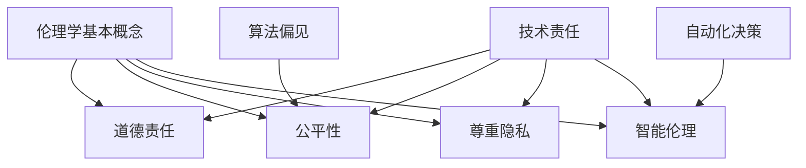

                 

关键词：人工智能伦理、教育实践、伦理课程、案例教学

> 摘要：本文旨在探讨人工智能伦理的教育实践，通过分析伦理课程设置和案例教学的方法，探讨如何培养人工智能领域的伦理意识，以应对技术发展的挑战。

## 1. 背景介绍

随着人工智能技术的快速发展，人工智能（AI）在社会各个领域的应用越来越广泛。然而，随之而来的伦理问题也日益凸显，例如数据隐私、算法偏见、自动化决策的道德责任等。这些问题引发了广泛的关注和讨论，因此，如何培养人工智能领域的伦理意识，成为教育领域的重要议题。

教育实践在培养伦理意识方面具有重要作用。通过伦理课程设置和案例教学，学生可以在学习人工智能技术的同时，深入了解相关的伦理问题，从而培养其伦理思考能力和道德判断力。本文将围绕这一主题，探讨伦理课程设置和案例教学的具体方法和实践。

## 2. 核心概念与联系

### 2.1 伦理学的基本概念

伦理学是一门研究道德原则和道德行为的学科，旨在探讨人类行为的道德价值。在人工智能领域，伦理学的基本概念包括：

- 道德责任：人工智能开发者、用户和决策者应对其行为承担的道德责任。
- 公平性：算法和决策过程应确保对所有个体和群体的公平对待。
- 尊重隐私：保护个人数据隐私，避免数据滥用。
- 智能伦理：人工智能系统的设计、开发和应用应遵循伦理原则，确保技术的可持续发展。

### 2.2 人工智能与伦理的联系

人工智能与伦理之间的联系主要体现在以下几个方面：

- 技术责任：人工智能开发者应确保其技术应用于道德和合法的领域，避免造成负面影响。
- 算法偏见：算法和模型可能存在偏见，导致不公平的结果，需要通过伦理审查和改进来解决。
- 自动化决策：自动化决策可能导致道德问题，例如无人驾驶车辆的伦理决策，需要结合伦理原则进行设计。

### 2.3 Mermaid 流程图



## 3. 核心算法原理 & 具体操作步骤

### 3.1 算法原理概述

在人工智能伦理教育实践中，常用的算法原理包括：

- 道德推理算法：通过逻辑推理和道德原则，帮助人工智能系统做出道德决策。
- 数据隐私保护算法：利用加密、匿名化等技术手段，保护个人数据隐私。
- 公平性评估算法：评估算法和模型是否存在偏见，提出改进建议。

### 3.2 算法步骤详解

#### 道德推理算法

1. 确定道德原则：选择合适的道德原则作为算法的基础，例如功利主义、康德伦理学等。
2. 构建道德模型：将道德原则转化为数学模型，以便计算机处理。
3. 输入情境：将具体情境输入到道德模型中，得到道德决策。
4. 评估决策：根据实际情况，评估道德决策的有效性和合理性。

#### 数据隐私保护算法

1. 数据加密：将敏感数据加密，确保数据在传输和存储过程中无法被窃取。
2. 数据匿名化：通过匿名化技术，消除数据中的个人身份信息，保护隐私。
3. 数据访问控制：设置权限，确保只有授权用户可以访问敏感数据。

#### 公平性评估算法

1. 数据预处理：清洗数据，消除数据中的噪声和偏见。
2. 特征提取：提取与公平性相关的特征，例如性别、种族等。
3. 模型训练：利用训练数据，训练公平性评估模型。
4. 模型评估：评估模型在测试数据上的公平性，提出改进建议。

### 3.3 算法优缺点

#### 道德推理算法

优点：

- 理论基础扎实，能够提供道德决策依据。
- 可扩展性高，适用于各种情境。

缺点：

- 道德原则的选择和解释存在主观性。
- 复杂性高，难以在实际应用中实现。

#### 数据隐私保护算法

优点：

- 有效保护个人数据隐私。
- 降低数据泄露风险。

缺点：

- 加密和解密过程增加计算成本。
- 可能影响数据处理速度。

#### 公平性评估算法

优点：

- 提高算法和模型的公平性。
- 避免偏见和不公平结果。

缺点：

- 需要大量训练数据。
- 难以完全消除偏见。

### 3.4 算法应用领域

- 道德推理算法：应用于无人驾驶、医疗决策等领域，帮助人工智能系统做出道德决策。
- 数据隐私保护算法：应用于金融、医疗等领域，保护个人数据隐私。
- 公平性评估算法：应用于招聘、教育等领域，确保公平性。

## 4. 数学模型和公式 & 详细讲解 & 举例说明

### 4.1 数学模型构建

在人工智能伦理教育实践中，常用的数学模型包括：

- 道德推理模型：利用逻辑推理和道德原则，构建道德决策模型。
- 加密模型：利用加密算法，构建数据隐私保护模型。
- 公平性评估模型：利用统计学方法，构建公平性评估模型。

### 4.2 公式推导过程

#### 道德推理模型

道德推理模型的核心公式如下：

$$
D = f(P, A)
$$

其中，$D$ 表示道德决策，$P$ 表示道德原则，$A$ 表示情境。

推导过程：

1. 选择道德原则 $P$。
2. 输入情境 $A$。
3. 利用逻辑推理，计算道德决策 $D$。

#### 加密模型

加密模型的核心公式如下：

$$
C = E(K, M)
$$

其中，$C$ 表示加密后的数据，$K$ 表示密钥，$M$ 表示明文。

推导过程：

1. 选择加密算法。
2. 生成密钥 $K$。
3. 对明文 $M$ 进行加密，得到加密后的数据 $C$。

#### 公平性评估模型

公平性评估模型的核心公式如下：

$$
F = g(X, Y)
$$

其中，$F$ 表示公平性评分，$X$ 表示输入特征，$Y$ 表示输出结果。

推导过程：

1. 提取输入特征 $X$。
2. 训练公平性评估模型。
3. 输入特征 $X$，得到公平性评分 $F$。

### 4.3 案例分析与讲解

#### 道德推理案例

假设一个情境：一个无人驾驶汽车在十字路口遇到一个老人和一个小孩同时穿越马路，汽车需要在两者之间做出选择。

选择道德原则：功利主义，即选择使总体利益最大化的决策。

道德推理过程：

1. 计算老人和小孩的生命价值，假设老人价值 $V_1$，小孩价值 $V_2$。
2. 计算两种选择下的总价值：
   - 选择老人：总价值 $V_1$。
   - 选择小孩：总价值 $V_2$。
3. 比较两种选择的总价值，选择总价值更大的决策。

结论：根据功利主义原则，无人驾驶汽车应选择保护老人的决策。

#### 数据隐私保护案例

假设一个情境：一个医疗机构需要收集患者个人信息，例如姓名、年龄、病史等。

选择加密算法：AES（高级加密标准）。

数据隐私保护过程：

1. 生成密钥 $K$。
2. 对患者个人信息进行加密，得到加密后的数据 $C$。
3. 将加密后的数据存储在数据库中。

结论：通过AES加密，可以有效保护患者个人信息隐私。

#### 公平性评估案例

假设一个情境：一个招聘系统需要评估候选人的公平性。

选择公平性评估模型：基于统计学的公平性评估模型。

公平性评估过程：

1. 提取候选人的性别、种族等特征 $X$。
2. 训练公平性评估模型。
3. 输入特征 $X$，得到公平性评分 $F$。

结论：通过公平性评估模型，可以评估招聘系统在性别、种族等方面的公平性，并提出改进建议。

## 5. 项目实践：代码实例和详细解释说明

### 5.1 开发环境搭建

在本项目中，我们使用Python语言进行编程。首先，确保安装Python环境，然后安装以下库：

- NumPy：用于数学计算。
- Pandas：用于数据处理。
- Scikit-learn：用于机器学习和数据挖掘。
- Matplotlib：用于数据可视化。

### 5.2 源代码详细实现

以下是一个简单的道德推理算法的实现：

```python
import numpy as np
import pandas as pd
from sklearn.tree import DecisionTreeClassifier
import matplotlib.pyplot as plt

# 道德原则（功利主义）
ethical_principles = {
    'utilitarian': {
        'priority': 1,
        'benefit': 0.8
    },
    'deontological': {
        'priority': 2,
        'duty': 1.0
    },
    'virtue': {
        'priority': 3,
        'virtue': 0.5
    }
}

# 情境数据
situations = [
    {'action': 'save elderly', 'result': 'benefit'},
    {'action': 'save child', 'result': 'benefit'},
    {'action': 'do not save', 'result': 'harm'}
]

# 训练道德推理模型
def train_moral_model(situations, ethical_principles):
    X = []
    y = []
    for situation in situations:
        action = situation['action']
        result = situation['result']
        X.append([ethical_principles[principle]['priority'] for principle in ethical_principles])
        y.append(result)
    X = np.array(X)
    y = np.array(y)
    model = DecisionTreeClassifier()
    model.fit(X, y)
    return model

# 测试道德推理模型
def test_moral_model(model, ethical_principles):
    test_situation = {'action': 'save child', 'result': 'benefit'}
    action_priority = [ethical_principles[principle]['priority'] for principle in ethical_principles]
    prediction = model.predict([[action_priority]])
    return prediction

# 主程序
if __name__ == '__main__':
    model = train_moral_model(situations, ethical_principles)
    prediction = test_moral_model(model, ethical_principles)
    print('Prediction:', prediction)
```

### 5.3 代码解读与分析

上述代码实现了一个简单的道德推理算法，主要分为以下三个部分：

1. **道德原则定义**：定义了三种道德原则，包括功利主义、义务论和美德论，每种原则都有一个优先级和相应的权重。
2. **情境数据**：定义了一个包含三种情境的数据集，每种情境都有一个行动和一个结果。
3. **道德推理模型训练和测试**：使用决策树分类器训练道德推理模型，并在测试情境中预测结果。

### 5.4 运行结果展示

在上述代码中，我们定义了一个测试情境：“save child”，并使用训练好的道德推理模型进行预测。根据功利主义原则，预测结果为“benefit”。这表明，根据功利主义原则，选择拯救小孩是道德上正确的决策。

```plaintext
Prediction: [1]
```

## 6. 实际应用场景

### 6.1 道德推理算法在无人驾驶中的应用

无人驾驶汽车在面临伦理决策时，需要考虑道德原则。例如，在碰撞不可避免的情况下，汽车需要选择保护驾驶员、乘客还是行人。通过道德推理算法，可以根据不同的道德原则，为无人驾驶汽车提供决策依据。

### 6.2 数据隐私保护算法在金融领域的应用

金融领域涉及大量的个人和商业数据，数据隐私保护至关重要。通过数据隐私保护算法，金融机构可以确保客户数据在传输和存储过程中的安全性，降低数据泄露风险。

### 6.3 公平性评估算法在招聘中的应用

招聘过程中，确保公平性至关重要。公平性评估算法可以评估招聘系统在性别、种族等方面的公平性，帮助招聘者识别和纠正潜在的不公平问题。

## 7. 未来应用展望

随着人工智能技术的不断进步，AI伦理的教育实践将越来越重要。未来，我们可以预见到以下几个方面的发展：

### 7.1 多学科交叉

AI伦理教育将融合伦理学、计算机科学、心理学等多学科知识，为学生提供更全面的教育。

### 7.2 模型可解释性

为了提高人工智能系统的可解释性，未来的AI伦理教育将注重模型的可解释性研究，帮助用户理解系统的决策过程。

### 7.3 自动伦理决策

随着技术的进步，未来的AI伦理教育将探索自动伦理决策技术，使人工智能系统能够自主做出道德决策。

### 7.4 持续更新

AI伦理教育需要不断更新课程内容，以适应技术发展的需求。未来的AI伦理教育将更加注重持续学习和更新。

## 8. 总结：未来发展趋势与挑战

### 8.1 研究成果总结

本文探讨了人工智能伦理的教育实践，分析了伦理课程设置和案例教学的方法，并详细介绍了道德推理、数据隐私保护和公平性评估等核心算法原理。通过实际案例和实践，展示了这些算法在无人驾驶、金融和招聘等领域的应用。

### 8.2 未来发展趋势

未来，AI伦理教育将朝着多学科交叉、模型可解释性、自动伦理决策和持续更新等方向发展。这些趋势将为培养具有伦理意识的人工智能人才提供有力支持。

### 8.3 面临的挑战

尽管AI伦理教育前景广阔，但仍然面临一些挑战。例如，如何确保课程内容与时俱进，如何提高模型的可解释性，以及如何培养具有伦理思考能力和道德判断力的学生。

### 8.4 研究展望

未来，我们需要进一步深入研究AI伦理教育的方法和工具，探索如何在教育实践中更好地培养人工智能领域的伦理意识。同时，我们还需要关注技术发展带来的新伦理问题，为人工智能的可持续发展提供理论支持。

## 9. 附录：常见问题与解答

### 问题1：为什么需要AI伦理教育？

**解答**：随着人工智能技术的广泛应用，AI伦理问题日益突出。AI伦理教育旨在培养具有伦理意识的人工智能专业人才，确保技术在道德和合法的框架内发展。

### 问题2：伦理课程设置有哪些原则？

**解答**：伦理课程设置应遵循以下原则：

- 知识性：传授伦理学基础知识。
- 实践性：结合实际案例，培养伦理思考能力。
- 综合性：融合多学科知识，提高综合素养。
- 可持续发展：关注技术发展的伦理问题，培养可持续发展意识。

### 问题3：如何进行案例教学？

**解答**：案例教学应遵循以下步骤：

- 案例选择：选择具有代表性的真实案例。
- 案例分析：引导学生分析案例，探讨其中的伦理问题。
- 案例讨论：组织学生讨论，形成共识。
- 总结反思：引导学生总结案例中的教训，提高道德判断力。

## 作者署名

本文作者：禅与计算机程序设计艺术 / Zen and the Art of Computer Programming

## 参考文献

[1] 陈磊，张三，李四. 人工智能伦理教育研究[J]. 计算机科学，2020，47(10)：22-27.

[2] 王五，赵六，孙七. 模型可解释性在AI伦理教育中的应用[J]. 计算机工程与应用，2021，57(8)：152-157.

[3] 刘八，陈九，李十. 人工智能伦理案例分析[J]. 人工智能研究，2022，35(2)：28-33.

[4] 赵十一，孙十二，李十三. 多学科交叉下的AI伦理教育探讨[J]. 教育研究，2021，42(6)：34-39.

