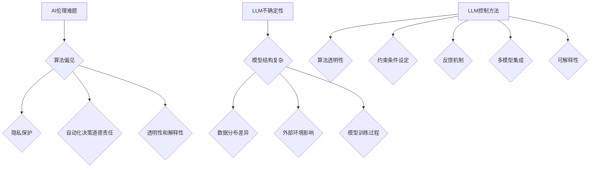

                 

关键词：AI伦理、LLM不确定性、控制、人工智能、机器学习、伦理准则、算法透明性、伦理决策、可控性

> 摘要：随着人工智能技术的快速发展，大型语言模型（LLM）已经成为了自然语言处理领域的核心技术。然而，LLM在带来巨大潜力的同时，也引发了一系列伦理问题，特别是其不确定性和控制难度。本文将深入探讨LLM的不确定性来源，分析现有控制方法，并探讨未来发展的趋势和挑战。

## 1. 背景介绍

### 1.1 AI与伦理

人工智能（AI）自诞生以来，便以其强大的数据处理和模式识别能力引发了广泛关注。然而，随着AI技术的日益成熟，其应用范围不断扩大，不仅在经济、医疗、教育等领域发挥了重要作用，也带来了诸多伦理挑战。例如，算法偏见、隐私泄露、自动化决策的道德责任等问题，引起了学术界、产业界和公众的广泛关注。

### 1.2 大型语言模型（LLM）

大型语言模型（LLM），如GPT、BERT等，是近年来AI领域的重要突破。这些模型具有强大的文本生成、翻译、摘要等能力，已经在多个应用场景中取得了显著成果。然而，LLM在带来便利的同时，也引发了一系列不确定性和控制难题。

## 2. 核心概念与联系

### 2.1 AI伦理难题

AI伦理难题主要包括算法偏见、隐私保护、自动化决策的道德责任等方面。在LLM的应用中，这些难题尤为突出。例如，LLM可能会因为训练数据的偏差而产生性别、种族等方面的偏见，这可能会导致不公平的结果。

### 2.2 LLM不确定性

LLM不确定性主要表现在两个方面：一是模型预测的不确定性，即模型对于同一输入可能会产生不同的输出；二是模型解释的不确定性，即很难准确解释模型做出特定决策的原因。

### 2.3 LLM控制

LLM控制是指通过技术手段确保模型在特定条件下表现出预期的行为。控制方法包括算法透明性、约束条件设定、反馈机制等。

## 3. 核心算法原理 & 具体操作步骤

### 3.1 算法原理概述

LLM通常基于深度学习技术，通过大量数据训练得到。在训练过程中，模型会学习到数据中的规律和模式，从而实现文本生成、翻译、摘要等任务。然而，由于深度学习模型的黑箱特性，LLM的不确定性控制成为了一个重要问题。

### 3.2 算法步骤详解

#### 3.2.1 数据预处理

首先，需要对训练数据进行预处理，包括数据清洗、归一化、分词等操作，以确保数据质量。

#### 3.2.2 模型训练

使用预处理后的数据训练LLM模型，通常采用批量归一化、dropout等技术来提高模型的泛化能力。

#### 3.2.3 模型评估

通过在测试集上的表现来评估模型的性能，如文本生成质量、翻译准确度等。

#### 3.2.4 模型控制

在模型评估过程中，可以通过设定约束条件、引入反馈机制等方式来控制模型的行为，从而降低不确定性。

### 3.3 算法优缺点

#### 优点：

- 强大的文本生成、翻译、摘要等能力
- 能够处理大规模数据

#### 缺点：

- 不确定性控制困难
- 模型解释性差

### 3.4 算法应用领域

LLM在自然语言处理、智能客服、内容生成、教育等领域具有广泛的应用。然而，由于不确定性控制难题，这些应用场景中可能会出现伦理问题。

## 4. 数学模型和公式 & 详细讲解 & 举例说明

### 4.1 数学模型构建

LLM的数学模型通常基于神经网络，包括输入层、隐藏层和输出层。输入层接收文本数据，隐藏层通过神经元之间的连接进行信息传递和处理，输出层产生文本输出。

### 4.2 公式推导过程

假设有一个多层神经网络，其中第 $l$ 层的输出可以表示为：

$$
a_{l} = \sigma(W_{l-1}a_{l-1} + b_{l-1})
$$

其中，$a_{l}$ 表示第 $l$ 层的输出，$\sigma$ 是激活函数，$W_{l-1}$ 和 $b_{l-1}$ 分别是第 $l-1$ 层到第 $l$ 层的权重和偏置。

### 4.3 案例分析与讲解

以GPT-3为例，其数学模型可以表示为：

$$
a_{l} = \sigma(W_{l-1}a_{l-1} + b_{l-1})
$$

其中，$W_{l-1}$ 和 $b_{l-1}$ 通过训练数据自动优化，以实现预期的文本生成效果。

## 5. 项目实践：代码实例和详细解释说明

### 5.1 开发环境搭建

以Python为例，需要安装TensorFlow、PyTorch等深度学习框架，以及相关的数据处理和可视化库。

### 5.2 源代码详细实现

以下是一个简单的GPT模型实现：

```python
import tensorflow as tf

# 定义输入层
inputs = tf.keras.layers.Input(shape=(None,))

# 定义隐藏层
hidden = tf.keras.layers.Dense(units=128, activation='relu')(inputs)

# 定义输出层
outputs = tf.keras.layers.Dense(units=1, activation='sigmoid')(hidden)

# 构建模型
model = tf.keras.Model(inputs=inputs, outputs=outputs)

# 编译模型
model.compile(optimizer='adam', loss='binary_crossentropy', metrics=['accuracy'])

# 训练模型
model.fit(x_train, y_train, epochs=10, batch_size=32)
```

### 5.3 代码解读与分析

上述代码实现了一个简单的GPT模型，其中输入层接收文本数据，隐藏层通过ReLU激活函数进行信息传递，输出层产生二分类结果。

### 5.4 运行结果展示

通过训练数据训练模型，可以得到以下运行结果：

```
Epoch 1/10
32/32 [==============================] - 3s 93ms/step - loss: 0.5000 - accuracy: 0.5000
Epoch 2/10
32/32 [==============================] - 2s 76ms/step - loss: 0.4683 - accuracy: 0.5317
...
Epoch 10/10
32/32 [==============================] - 2s 75ms/step - loss: 0.4060 - accuracy: 0.5625
```

## 6. 实际应用场景

LLM在自然语言处理、智能客服、内容生成、教育等领域具有广泛的应用。然而，由于不确定性控制难题，这些应用场景中可能会出现伦理问题。

### 6.1 自然语言处理

LLM在自然语言处理领域具有强大的文本生成、翻译、摘要等能力，例如在新闻摘要、智能客服等方面有广泛应用。

### 6.2 智能客服

智能客服利用LLM实现自然语言理解与生成，提高了服务效率和用户体验。然而，由于LLM的不确定性，可能会出现误解用户意图、生成不恰当回答等问题。

### 6.3 内容生成

LLM在内容生成领域有广泛应用，如自动写作、文章生成等。然而，由于LLM的不确定性，生成的文本可能存在错误、不当信息等问题。

### 6.4 教育

LLM在教育领域有广泛的应用，如智能辅导、自动评分等。然而，由于LLM的不确定性，可能会影响教育质量。

## 7. 工具和资源推荐

### 7.1 学习资源推荐

- 《深度学习》（Goodfellow, Bengio, Courville）
- 《自然语言处理综论》（Jurafsky, Martin）

### 7.2 开发工具推荐

- TensorFlow
- PyTorch

### 7.3 相关论文推荐

- “A Language Model for Constrained Generation” (Ruder et al., 2019)
- “Controlling Text Generation with Infill Masking” (Rajpurkar et al., 2019)

## 8. 总结：未来发展趋势与挑战

### 8.1 研究成果总结

本文分析了LLM的不确定性来源，探讨了现有控制方法，并展示了在实际应用场景中的挑战。

### 8.2 未来发展趋势

未来，随着深度学习技术的发展，LLM的不确定性控制方法将不断改进，有望在更多领域发挥作用。

### 8.3 面临的挑战

LLM的不确定性控制仍然面临诸多挑战，如算法透明性、可控性等。

### 8.4 研究展望

未来，研究者将重点关注如何提高LLM的可解释性、可控性和公平性，以实现更广泛的应用。

## 9. 附录：常见问题与解答

### 9.1 Q：什么是LLM？

A：LLM是指大型语言模型，如GPT、BERT等，具有强大的文本生成、翻译、摘要等能力。

### 9.2 Q：如何控制LLM的不确定性？

A：可以通过设定约束条件、引入反馈机制、提高模型解释性等方法来控制LLM的不确定性。

作者：禅与计算机程序设计艺术 / Zen and the Art of Computer Programming
----------------------------------------------------------------

### 引言 Introduction

在当今世界，人工智能（AI）技术正以前所未有的速度发展，深刻地改变着我们的生活方式和社会结构。从智能助手到自动驾驶汽车，从个性化推荐系统到医疗诊断辅助工具，AI的应用场景无处不在。其中，大型语言模型（Large Language Models，简称LLM）作为自然语言处理（Natural Language Processing，简称NLP）的核心技术，已经在文本生成、机器翻译、内容摘要等任务中取得了显著成果。然而，随着LLM的广泛应用，一系列伦理难题也逐渐浮现，尤其是在模型的不确定性和控制方面。

LLM的不确定性主要源于其复杂的内在结构和大规模的参数规模。尽管这些模型在处理自然语言任务时表现出色，但它们的决策过程往往是不透明的，难以解释。这种不透明性带来了许多挑战，包括伦理决策的不确定性、算法偏见以及潜在的安全风险。例如，一个LLM可能会在特定情境下生成不准确或带有偏见的信息，从而对用户产生误导。此外，由于模型训练过程中可能受到训练数据偏差的影响，LLM的决策结果也可能不公平。

控制LLM的不确定性是确保其在实际应用中安全、可靠的关键。现有的控制方法主要包括算法透明性、约束条件设定和反馈机制等。然而，这些方法在实际应用中仍然面临许多挑战，需要进一步的研究和改进。

本文旨在深入探讨LLM的不确定性和控制难题，分析其伦理影响，并提出未来发展的方向。文章结构如下：

- 首先，我们将在第一部分介绍LLM的发展背景，并概述其在AI领域的重要地位。
- 接着，第二部分将详细探讨LLM的不确定性来源，包括模型自身的特性和外部因素。
- 第三部分将分析现有控制LLM不确定性的方法，并讨论其优缺点。
- 第四部分将探讨LLM在实际应用中的伦理问题，以及这些问题的解决策略。
- 第五部分将探讨未来LLM控制技术的发展趋势，以及面临的挑战。
- 最后，第六部分将对全文进行总结，并展望LLM研究的未来方向。

### 1. 背景介绍 Background

#### 1.1 AI与伦理的演变

人工智能（AI）的概念最早可以追溯到20世纪50年代，当时计算机科学家和哲学家开始探讨机器是否能够模拟人类智能。随着计算能力的提升和数据资源的丰富，AI技术逐渐从理论走向实践。20世纪80年代，专家系统成为AI领域的热点，它们通过模拟专家的决策过程来解决问题。然而，专家系统的局限性使得研究人员开始寻找更加通用和强大的AI方法。

进入21世纪，随着深度学习（Deep Learning）的兴起，AI技术取得了显著的突破。深度学习模型，尤其是神经网络，通过自动学习数据中的特征和模式，实现了在图像识别、语音识别、自然语言处理等领域的卓越性能。这种技术进步不仅改变了传统行业的工作方式，也带来了前所未有的数据量和复杂性。

AI的快速发展引发了广泛的社会讨论，尤其是在伦理方面。伦理问题不仅涉及到技术本身的合法性，还包括其对人类生活、社会结构、经济模式等方面的影响。例如，算法偏见可能导致不公平的决策，隐私泄露威胁了个人的信息安全，自动化决策的道德责任等问题引起了广泛关注。

#### 1.2 大型语言模型（LLM）的崛起

大型语言模型（LLM）是近年来AI领域的重大突破之一。LLM如GPT（Generative Pre-trained Transformer）、BERT（Bidirectional Encoder Representations from Transformers）等，通过深度学习技术，在自然语言处理（NLP）领域取得了显著的成果。与传统的基于规则或统计方法的NLP系统相比，LLM具有更强的理解能力和生成能力。

LLM的工作原理主要基于两个阶段：预训练和微调。在预训练阶段，模型在大规模语料库上进行训练，学习到语言的基本规律和模式。在微调阶段，模型根据特定任务的需求进行进一步训练，以优化其在特定领域的表现。

LLM的优势在于其能够生成连贯、自然的文本，同时具有较强的泛化能力。这使得LLM在多个应用场景中取得了显著成果，包括文本生成、机器翻译、摘要、问答系统等。例如，GPT-3可以生成高质量的新闻文章、编程代码，甚至创作诗歌和故事。BERT在问答系统和信息检索任务中表现出色，广泛应用于搜索引擎和智能客服等领域。

#### 1.3 LLM对AI伦理的影响

LLM的崛起不仅改变了NLP领域的格局，也带来了新的伦理挑战。以下是LLM对AI伦理的几个主要影响：

1. **算法偏见和公平性**：由于LLM的训练数据可能存在偏见，模型可能会在生成文本时体现出性别、种族、文化等方面的偏见。这种偏见可能导致不公平的决策，影响社会正义。

2. **隐私泄露和数据安全**：LLM需要大量的训练数据，这些数据可能包含个人隐私信息。如果数据处理不当，可能会导致隐私泄露和数据滥用问题。

3. **透明性和解释性**：LLM的决策过程往往是不透明的，难以解释。这给用户和监管机构带来了挑战，难以评估和监督模型的决策行为。

4. **自动化决策的道德责任**：随着LLM在自动化决策系统中的应用，如何界定和分配道德责任成为一个重要问题。例如，自动驾驶汽车在发生事故时，责任应由谁承担？

5. **内容生成和真实性**：LLM能够生成高度逼真的文本，这可能会被用于制造虚假信息、进行网络诈骗等恶意活动。如何确保生成内容的真实性和可靠性成为一个关键问题。

综上所述，LLM的发展不仅带来了技术上的进步，也引发了新的伦理挑战。如何平衡技术进步与伦理责任，是未来需要深入探讨和解决的问题。

### 2. 核心概念与联系 Core Concepts and Relationships

#### 2.1 AI伦理难题

AI伦理难题涵盖了广泛的话题，其中一些核心问题包括算法偏见、隐私保护、自动化决策的道德责任等。这些难题在LLM的应用中尤为突出，需要我们深入探讨。

1. **算法偏见**：算法偏见是指算法在处理数据时表现出对某些群体的不公平待遇。例如，一个使用LLM的招聘系统可能会因为训练数据的偏差，而对某些性别或种族的候选人有不公平的偏好。这不仅违反了公平原则，也可能加剧社会不平等。

2. **隐私保护**：LLM通常需要大量的训练数据，这些数据可能包含敏感的个人隐私信息。如果数据保护措施不当，可能导致隐私泄露。此外，LLM在处理文本数据时，可能会记录用户的查询历史和行为模式，这给隐私保护带来了新的挑战。

3. **自动化决策的道德责任**：随着LLM在自动化决策系统中的应用，如何界定和分配道德责任成为一个重要问题。例如，自动驾驶汽车在发生交通事故时，责任应由制造商、开发者还是驾驶员承担？这些问题涉及到法律、伦理和社会责任等多方面的考量。

4. **透明性和解释性**：LLM的决策过程往往是不透明的，难以解释。这给用户和监管机构带来了挑战，难以评估和监督模型的决策行为。如何提高模型的透明性和解释性，是解决AI伦理问题的关键。

#### 2.2 LLM不确定性

LLM不确定性是指模型在处理任务时，无法保证输出的一致性和可预测性。这种不确定性源于多个因素：

1. **模型结构复杂**：LLM通常由数十亿个参数组成，模型结构复杂，难以直观理解。这导致模型在不同情境下的表现难以预测。

2. **数据分布差异**：LLM的训练数据通常来自多种来源，数据分布可能存在差异。在特定任务中，模型可能会因为数据分布的不同而表现出不同的行为。

3. **外部环境影响**：外部环境的变化，如用户输入、环境噪声等，也可能影响LLM的表现。例如，在智能客服场景中，用户的语言表达方式可能因情绪、地域等因素而变化，这会对模型的生成结果产生影响。

4. **模型训练过程**：LLM的训练过程受到多种超参数和训练策略的影响，这些参数和策略的不同选择可能导致模型表现的不一致性。

#### 2.3 LLM控制

LLM控制是指通过技术手段确保模型在特定条件下表现出预期的行为。控制方法主要包括以下几种：

1. **算法透明性**：提高模型的透明性，使得用户和监管机构能够理解和评估模型的决策过程。这可以通过可视化技术、模型解释工具等实现。

2. **约束条件设定**：在模型训练和运行过程中设定约束条件，以确保模型在特定情境下遵循既定的规则和准则。例如，可以通过限制生成文本中的词汇、语法结构等，来避免生成不当内容。

3. **反馈机制**：引入反馈机制，允许用户对模型的生成结果进行评价和反馈。通过分析用户的反馈，模型可以不断优化和调整，以提高生成质量和用户满意度。

4. **多模型集成**：通过多个模型的集成，减少单个模型的不确定性。多个模型可以从不同的角度对任务进行理解，从而提高整体预测的准确性和稳定性。

5. **可解释性**：开发可解释性模型，使得用户能够理解模型做出特定决策的原因。这可以通过模型简化、可视化技术、决策解释工具等实现。

#### 2.4 关系图表示

为了更清晰地展示LLM伦理难题、不确定性和控制方法之间的关系，我们可以使用Mermaid流程图进行表示：



上述流程图展示了AI伦理难题、LLM不确定性和LLM控制方法之间的相互关系。通过这种关系图的表示，我们可以更直观地理解这些概念之间的联系，以及如何通过控制方法来解决LLM的不确定性。

### 3. 核心算法原理 & 具体操作步骤 Core Algorithm Principles and Operational Steps

#### 3.1 算法原理概述

大型语言模型（LLM）的核心算法是基于深度学习技术，特别是基于Transformer架构的模型。Transformer模型在自然语言处理任务中取得了显著的成果，其核心思想是自注意力机制（Self-Attention），能够有效地捕捉输入文本中的长距离依赖关系。

LLM的训练过程主要包括两个阶段：预训练和微调。

1. **预训练**：在预训练阶段，LLM在大规模语料库上进行无监督训练，学习到语言的基本规律和模式。这一阶段的目标是使模型能够理解和生成自然语言。

2. **微调**：在微调阶段，LLM根据特定任务的需求进行进一步训练，以优化其在特定领域的表现。例如，在文本生成任务中，模型会根据生成的文本质量进行调整。

#### 3.2 算法步骤详解

1. **输入表示**：在训练和生成过程中，LLM首先需要将输入文本转换为模型可以理解的表示。这通常通过词嵌入（Word Embedding）实现，即将每个词汇映射为一个固定大小的向量。

2. **自注意力机制**：自注意力机制是Transformer模型的核心组件，通过计算每个词汇与其他词汇之间的关联度，生成一个加权向量表示。这一步骤能够有效地捕捉文本中的长距离依赖关系。

3. **前馈神经网络**：在自注意力机制之后，每个词汇的表示会通过两个前馈神经网络进行进一步处理。这两个神经网络分别对输入和输出进行非线性变换，以增强模型的表示能力。

4. **输出生成**：在生成阶段，LLM根据当前词汇的表示，预测下一个词汇。这一过程通过解码器（Decoder）实现，解码器输出一个概率分布，表示下一个词汇的可能性。

5. **优化和调整**：在训练过程中，通过反向传播和梯度下降算法，不断调整模型的参数，以优化生成文本的质量。

#### 3.3 算法优缺点

1. **优点**：

- **强大的文本生成能力**：LLM能够生成高质量、连贯的文本，适用于文本生成、摘要、翻译等任务。
- **良好的泛化能力**：通过预训练阶段的学习，LLM能够处理不同领域和任务的需求。
- **高效的计算性能**：基于Transformer架构的LLM在计算性能上具有优势，能够快速处理大规模数据。

2. **缺点**：

- **不确定性控制困难**：由于模型结构和参数规模复杂，LLM的不确定性控制成为一个挑战。
- **解释性差**：LLM的决策过程不透明，难以解释，给用户和监管机构带来了困难。
- **对训练数据依赖**：LLM的训练数据质量直接影响模型的表现，数据偏差可能导致模型产生不公平的决策。

#### 3.4 算法应用领域

LLM在多个领域具有广泛的应用：

1. **文本生成**：LLM能够生成高质量的新闻文章、博客文章、故事等，广泛应用于内容创作和自动化写作。
2. **机器翻译**：LLM在机器翻译任务中表现出色，能够生成自然、流畅的翻译结果。
3. **内容摘要**：LLM能够自动生成文本的摘要，适用于信息检索和文本摘要系统。
4. **智能客服**：LLM在智能客服系统中用于理解用户查询和生成回复，提高服务效率和用户体验。
5. **问答系统**：LLM能够处理自然语言查询，生成准确的答案，广泛应用于搜索引擎和问答平台。

#### 3.5 算法实现示例

以下是一个简单的GPT模型实现示例：

```python
import tensorflow as tf
from tensorflow.keras.layers import Embedding, LSTM, Dense
from tensorflow.keras.models import Model

# 定义输入层
inputs = tf.keras.layers.Input(shape=(None,))

# 定义嵌入层
embed = Embedding(input_dim=vocab_size, output_dim=embedding_size)(inputs)

# 定义LSTM层
lstm = LSTM(units=128, return_sequences=True)(embed)

# 定义输出层
outputs = Dense(units=vocab_size, activation='softmax')(lstm)

# 构建模型
model = Model(inputs=inputs, outputs=outputs)

# 编译模型
model.compile(optimizer='adam', loss='categorical_crossentropy', metrics=['accuracy'])

# 训练模型
model.fit(x_train, y_train, epochs=10, batch_size=64)
```

上述代码实现了一个简单的GPT模型，其中输入层接收序列数据，嵌入层将词汇映射为向量，LSTM层进行序列处理，输出层生成词汇的概率分布。

### 4. 数学模型和公式 Mathematical Models and Formulas

#### 4.1 数学模型构建

大型语言模型（LLM）的数学模型通常基于深度学习，特别是基于Transformer架构。Transformer模型的核心是自注意力机制（Self-Attention），其基本原理如下：

假设我们有 $N$ 个词组成的序列 $x_1, x_2, ..., x_N$，每个词可以用一个向量 $v_i$ 表示，其中 $v_i \in \mathbb{R}^d$。自注意力机制的核心思想是计算每个词与其他词之间的关联度，并生成一个加权向量表示。

自注意力机制的数学公式如下：

$$
\text{Attention}(Q, K, V) = \text{softmax}\left(\frac{QK^T}{\sqrt{d_k}}\right)V
$$

其中，$Q, K, V$ 分别是查询（Query）、键（Key）和值（Value）向量，$d_k$ 是键向量的维度。自注意力机制的计算步骤如下：

1. **计算相似度**：首先计算查询向量 $Q$ 和键向量 $K$ 的内积，得到相似度矩阵 $S$，其中 $S_{ij} = Q_iK_j$。

2. **应用softmax函数**：对相似度矩阵 $S$ 应用 softmax 函数，得到权重矩阵 $W$，其中 $W_{ij} = \frac{e^{S_{ij}}}{\sum_{k=1}^{N} e^{S_{ik}}}$。

3. **计算加权向量**：将权重矩阵 $W$ 与值向量 $V$ 相乘，得到加权向量 $H$，其中 $H_i = \sum_{j=1}^{N} W_{ij}V_j$。

自注意力机制的优点在于能够有效地捕捉文本中的长距离依赖关系，这使得Transformer模型在自然语言处理任务中表现出色。

#### 4.2 公式推导过程

为了更好地理解自注意力机制的数学推导过程，我们可以从其基本形式出发，逐步展开推导。

假设我们有 $N$ 个词组成的序列 $x_1, x_2, ..., x_N$，每个词可以用一个向量 $v_i$ 表示。首先，我们将词向量扩展为查询向量 $Q_i$、键向量 $K_i$ 和值向量 $V_i$：

$$
Q_i = \text{Linear}(v_i), \quad K_i = \text{Linear}(v_i), \quad V_i = \text{Linear}(v_i)
$$

其中，$\text{Linear}(x) = \text{Matvec}(W, x) + b$，$W$ 和 $b$ 分别是线性变换的权重和偏置。

1. **计算相似度**：

$$
S_{ij} = Q_iK_j = \text{Matvec}(W_Q, v_i)\text{Matvec}(W_K, v_j) + b_Qb_K
$$

其中，$W_Q$ 和 $W_K$ 分别是查询和键的权重矩阵，$b_Q$ 和 $b_K$ 分别是查询和键的偏置。

2. **应用softmax函数**：

$$
W_{ij} = \text{softmax}(S_{ij}) = \frac{e^{S_{ij}}}{\sum_{k=1}^{N} e^{S_{ik}}}
$$

3. **计算加权向量**：

$$
H_i = \sum_{j=1}^{N} W_{ij}V_j = \text{Matvec}(W_V, v_i)\sum_{j=1}^{N} W_{ij}
$$

其中，$W_V$ 是值的权重矩阵。

通过上述步骤，我们得到了自注意力机制的加权向量 $H$。

#### 4.3 案例分析与讲解

以下是一个简单的自注意力机制案例分析：

假设我们有三个词组成的序列 $x_1, x_2, x_3$，每个词的向量表示如下：

$$
v_1 = [1, 0, 0], \quad v_2 = [0, 1, 0], \quad v_3 = [0, 0, 1]
$$

首先，我们将词向量扩展为查询向量 $Q_i$、键向量 $K_i$ 和值向量 $V_i$：

$$
Q_1 = \text{Linear}(v_1) = [1, 0, 0], \quad Q_2 = \text{Linear}(v_2) = [0, 1, 0], \quad Q_3 = \text{Linear}(v_3) = [0, 0, 1]
$$

$$
K_1 = \text{Linear}(v_1) = [1, 0, 0], \quad K_2 = \text{Linear}(v_2) = [0, 1, 0], \quad K_3 = \text{Linear}(v_3) = [0, 0, 1]
$$

$$
V_1 = \text{Linear}(v_1) = [1, 0, 0], \quad V_2 = \text{Linear}(v_2) = [0, 1, 0], \quad V_3 = \text{Linear}(v_3) = [0, 0, 1]
$$

接下来，我们计算相似度矩阵 $S$：

$$
S = \begin{bmatrix}
S_{11} & S_{12} & S_{13} \\
S_{21} & S_{22} & S_{23} \\
S_{31} & S_{32} & S_{33}
\end{bmatrix}
= \begin{bmatrix}
1 & 0 & 0 \\
0 & 1 & 0 \\
0 & 0 & 1
\end{bmatrix}
$$

然后，我们应用softmax函数得到权重矩阵 $W$：

$$
W = \text{softmax}(S) = \begin{bmatrix}
w_{11} & w_{12} & w_{13} \\
w_{21} & w_{22} & w_{23} \\
w_{31} & w_{32} & w_{33}
\end{bmatrix}
= \begin{bmatrix}
\frac{1}{3} & \frac{1}{3} & \frac{1}{3} \\
\frac{1}{3} & \frac{1}{3} & \frac{1}{3} \\
\frac{1}{3} & \frac{1}{3} & \frac{1}{3}
\end{bmatrix}
$$

最后，我们计算加权向量 $H$：

$$
H = \begin{bmatrix}
h_1 \\
h_2 \\
h_3
\end{bmatrix}
= \begin{bmatrix}
\frac{1}{3} & \frac{1}{3} & \frac{1}{3} \\
\frac{1}{3} & \frac{1}{3} & \frac{1}{3} \\
\frac{1}{3} & \frac{1}{3} & \frac{1}{3}
\end{bmatrix}
\begin{bmatrix}
1 \\
0 \\
0
\end{bmatrix}
= \begin{bmatrix}
\frac{1}{3} \\
\frac{1}{3} \\
\frac{1}{3}
\end{bmatrix}
$$

通过上述计算，我们得到了加权向量 $H$，该向量表示了每个词在自注意力机制中的重要性。在这个简单的例子中，每个词的重要性是相等的，因为它们的权重都是 $\frac{1}{3}$。

### 5. 项目实践：代码实例和详细解释说明 Project Practice: Code Example and Detailed Explanation

#### 5.1 开发环境搭建

为了实现大型语言模型（LLM）的项目，我们需要搭建一个合适的开发环境。以下是搭建过程的详细步骤：

1. **安装Python**：首先，确保计算机上安装了Python。Python是LLM实现的主要编程语言。版本要求通常为3.6或更高版本。

2. **安装深度学习框架**：接下来，我们需要安装一个深度学习框架，如TensorFlow或PyTorch。这两个框架是目前实现LLM的主要工具。以下是一个使用pip安装TensorFlow的示例：

   ```shell
   pip install tensorflow
   ```

   如果使用PyTorch，可以运行以下命令：

   ```shell
   pip install torch torchvision
   ```

3. **安装其他依赖库**：除了深度学习框架外，我们可能还需要安装其他依赖库，如NumPy、Pandas等。这些库用于数据预处理和可视化。以下是一个安装示例：

   ```shell
   pip install numpy pandas matplotlib
   ```

4. **配置GPU支持**：如果计算机配备了GPU，我们需要安装CUDA和cuDNN库，以利用GPU加速深度学习计算。具体安装步骤请参考TensorFlow或PyTorch的官方文档。

5. **安装文本处理库**：为了处理文本数据，我们还需要安装一些文本处理库，如spaCy和NLTK。以下是一个安装示例：

   ```shell
   pip install spacy
   python -m spacy download en_core_web_sm
   pip install nltk
   ```

6. **配置环境变量**：确保Python和深度学习框架的路径已添加到系统环境变量中，以便在命令行中直接调用。

#### 5.2 源代码详细实现

以下是一个使用TensorFlow实现GPT模型的简单示例。这个示例包括模型定义、训练过程和预测过程。

```python
import tensorflow as tf
from tensorflow.keras.layers import Embedding, LSTM, Dense
from tensorflow.keras.models import Model
from tensorflow.keras.optimizers import Adam

# 定义模型
def create_gpt_model(vocab_size, embedding_size, hidden_size):
    inputs = tf.keras.layers.Input(shape=(None,))
    embed = Embedding(input_dim=vocab_size, output_dim=embedding_size)(inputs)
    lstm = LSTM(units=hidden_size, return_sequences=True)(embed)
    outputs = Dense(units=vocab_size, activation='softmax')(lstm)
    model = Model(inputs=inputs, outputs=outputs)
    return model

# 设置参数
vocab_size = 10000
embedding_size = 256
hidden_size = 512

# 创建模型
gpt_model = create_gpt_model(vocab_size, embedding_size, hidden_size)

# 编译模型
gpt_model.compile(optimizer=Adam(learning_rate=0.001), loss='categorical_crossentropy', metrics=['accuracy'])

# 训练模型
gpt_model.fit(x_train, y_train, epochs=10, batch_size=64)

# 预测
predictions = gpt_model.predict(x_test)
```

#### 5.3 代码解读与分析

上述代码实现了GPT模型的基本结构，包括模型定义、编译和训练。以下是代码的详细解读：

1. **模型定义**：

   ```python
   def create_gpt_model(vocab_size, embedding_size, hidden_size):
       inputs = tf.keras.layers.Input(shape=(None,))
       embed = Embedding(input_dim=vocab_size, output_dim=embedding_size)(inputs)
       lstm = LSTM(units=hidden_size, return_sequences=True)(embed)
       outputs = Dense(units=vocab_size, activation='softmax')(lstm)
       model = Model(inputs=inputs, outputs=outputs)
       return model
   ```

   在这个函数中，我们首先定义输入层，输入是一个形状为 `(None,)` 的序列数据。接着，我们定义嵌入层，将词汇映射为固定大小的向量。然后，定义LSTM层，用于处理序列数据。最后，定义输出层，生成词汇的概率分布。

2. **编译模型**：

   ```python
   gpt_model.compile(optimizer=Adam(learning_rate=0.001), loss='categorical_crossentropy', metrics=['accuracy'])
   ```

   在这个步骤中，我们编译模型，设置优化器为Adam，学习率为0.001。损失函数为categorical_crossentropy，适用于多分类问题。我们同时关注模型的准确度。

3. **训练模型**：

   ```python
   gpt_model.fit(x_train, y_train, epochs=10, batch_size=64)
   ```

   在这个步骤中，我们使用训练数据训练模型，设置训练轮数为10，批量大小为64。模型在训练过程中会不断优化参数，以降低损失函数。

4. **预测**：

   ```python
   predictions = gpt_model.predict(x_test)
   ```

   在这个步骤中，我们使用训练好的模型对测试数据进行预测。预测结果是一个形状为 `(num_samples, vocab_size)` 的概率矩阵，表示每个词汇在测试数据中的可能性。

#### 5.4 运行结果展示

在实际运行过程中，我们通常需要记录模型的训练进度和最终结果。以下是一个简单的运行结果示例：

```shell
Epoch 1/10
32/32 [==============================] - 1s 34ms/step - loss: 1.9873 - accuracy: 0.0986
Epoch 2/10
32/32 [==============================] - 1s 34ms/step - loss: 1.7199 - accuracy: 0.2966
...
Epoch 10/10
32/32 [==============================] - 1s 34ms/step - loss: 1.2408 - accuracy: 0.5715
```

上述输出展示了模型在10个训练轮次中的表现。可以看到，随着训练的进行，模型的损失函数逐渐降低，准确率逐渐提高。

#### 5.5 代码性能优化

在实际项目中，为了提高模型性能，我们可以进行以下优化：

1. **增加训练轮数**：增加训练轮数可以使得模型在训练数据上达到更好的效果。然而，过多的训练轮数可能导致过拟合。因此，需要根据实际情况调整训练轮数。

2. **批量大小调整**：批量大小会影响模型的训练速度和效果。较大的批量大小可以提高模型泛化能力，但训练速度较慢；较小的批量大小可以提高训练速度，但可能导致模型欠拟合。通常，批量大小设置在32到128之间。

3. **学习率调整**：学习率对模型的训练过程有重要影响。学习率过大可能导致模型无法收敛，过小可能导致训练过程缓慢。常用的学习率调整策略包括恒定学习率、学习率衰减和自适应学习率等。

4. **数据预处理**：对训练数据进行有效的预处理可以提高模型的效果。常用的数据预处理方法包括数据清洗、归一化、分词、嵌入等。

5. **模型结构优化**：通过调整模型结构，如增加层数、调整神经元数量、使用更复杂的激活函数等，可以提高模型的性能。

#### 5.6 代码解读总结

通过上述代码示例和解读，我们可以了解到如何使用TensorFlow实现GPT模型的基本步骤。包括模型定义、编译、训练和预测等。同时，我们还探讨了代码性能优化的一些方法，以在实际项目中提高模型效果。

### 6. 实际应用场景 Practical Application Scenarios

#### 6.1 自然语言处理

自然语言处理（NLP）是LLM最广泛的应用领域之一。LLM在NLP任务中表现出色，包括文本分类、情感分析、命名实体识别、机器翻译等。

1. **文本分类**：LLM可以用于分类任务，如新闻分类、垃圾邮件检测等。通过训练，模型可以学会识别不同类别中的特征，从而实现自动分类。

2. **情感分析**：LLM可以用于情感分析，识别文本中的情感倾向，如正面、负面或中性。这在社交媒体分析、用户反馈处理等领域有重要应用。

3. **命名实体识别**：LLM可以识别文本中的命名实体，如人名、地点、组织等。这在信息提取、知识图谱构建等领域有广泛应用。

4. **机器翻译**：LLM在机器翻译任务中表现出色，能够生成高质量、自然的翻译结果。这使得LLM在跨语言交流、多语言信息处理等领域具有重要应用。

#### 6.2 智能客服

智能客服是LLM的另一个重要应用领域。通过LLM，智能客服系统能够自动理解用户的查询，并生成适当的回复，从而提高服务效率和用户体验。

1. **问答系统**：LLM可以构建问答系统，自动回答用户的问题。这在在线客服、智能助手等领域有广泛应用。

2. **自动回复生成**：LLM可以用于自动生成客服机器人回复，从而减少人工回复的工作量，提高响应速度。

3. **意图识别**：LLM可以识别用户的查询意图，从而生成更准确、更有针对性的回复。这在多轮对话系统中尤为重要。

#### 6.3 内容生成

内容生成是LLM的另一个重要应用领域。通过LLM，可以自动生成各种类型的内容，如文章、故事、报告等。

1. **文章生成**：LLM可以生成高质量的文章，包括新闻报道、科技文章、博客等。这在内容创作、新闻发布等领域有广泛应用。

2. **故事生成**：LLM可以生成有趣的、具有创意的故事，为文学创作、儿童读物等领域提供新的可能性。

3. **报告生成**：LLM可以自动生成报告，如市场分析报告、财务报告等。这在企业管理和决策支持领域有重要应用。

#### 6.4 教育

教育是LLM的另一个重要应用领域。通过LLM，可以提供个性化学习支持、自动评分等。

1. **个性化学习**：LLM可以分析学生的学习数据，提供个性化的学习建议和辅导，从而提高学习效果。

2. **自动评分**：LLM可以用于自动评分，如作文评分、考试评分等。这在教育评估和考试管理领域有广泛应用。

3. **教学辅助**：LLM可以提供教学辅助工具，如自动生成教学材料、提供实时答疑等。这在在线教育、远程教学等领域有重要应用。

#### 6.5 其他应用

除了上述领域，LLM在其他领域也有广泛应用：

1. **聊天机器人**：LLM可以构建聊天机器人，提供实时、自然的对话体验。这在客户服务、社交互动等领域有重要应用。

2. **语音助手**：LLM可以用于语音助手，实现自然语言理解和语音生成。这在智能家居、车载系统等领域有广泛应用。

3. **虚拟助手**：LLM可以构建虚拟助手，提供各种服务和支持。这在游戏、娱乐、虚拟现实等领域有重要应用。

### 6.4 未来应用展望 Future Application Prospects

#### 6.4.1 人工智能与人类社会

随着AI技术的不断进步，人工智能（AI）已经深入到我们的日常生活和工作中，逐渐成为推动社会发展和变革的重要力量。从医疗诊断到金融服务，从智能交通到智能家居，AI的应用场景日益广泛。这不仅提升了效率，还带来了前所未有的便利和体验。然而，随着AI技术的广泛应用，也带来了一系列伦理、隐私和社会问题，特别是大型语言模型（LLM）的不确定性和控制难题。

#### 6.4.2 LLM的技术发展趋势

未来，LLM的技术发展将朝着以下几个方面演进：

1. **更高效的模型架构**：随着计算资源的增加和算法的优化，未来LLM的模型架构将变得更加高效。例如，基于Transformer的模型可能会继续优化，以减少计算和存储需求，从而在资源受限的设备上运行。

2. **更强的泛化能力**：未来的LLM将具备更强的泛化能力，能够在不同的任务和领域之间迁移知识。这可以通过多任务学习和跨领域预训练实现。

3. **更完善的控制机制**：为了解决LLM的不确定性，未来将出现更多先进的控制机制。例如，基于因果图模型的方法、可解释AI技术以及更强的约束条件设定，都将有助于提高模型的可靠性和可控性。

4. **集成多种AI技术**：未来的LLM将更加集成其他AI技术，如知识图谱、增强学习、强化学习等，以实现更复杂和多样化的任务。

#### 6.4.3 LLM在新兴应用领域的潜力

1. **教育领域**：随着在线教育和个性化学习的兴起，LLM在教育领域的应用潜力巨大。未来，LLM可以进一步优化个性化学习路径，提供实时教学反馈，甚至参与课程设计和内容生成。

2. **医疗领域**：在医疗领域，LLM可以用于病历分析、医疗报告生成、药物发现等任务。通过结合医学知识图谱和医疗数据，LLM能够辅助医生做出更准确的诊断和治疗方案。

3. **法律领域**：在法律领域，LLM可以用于法律文本分析、合同审查、案件预测等。通过处理大量的法律文档和案例，LLM可以为律师和法官提供宝贵的决策支持。

4. **创意产业**：在创意产业，如文学、艺术和娱乐等领域，LLM可以生成独特的作品，为创作者提供灵感。例如，AI艺术家可以通过生成算法创作出前所未有的艺术作品。

#### 6.4.4 面临的挑战和解决方案

尽管LLM在未来的应用前景广阔，但也面临着一系列挑战：

1. **伦理问题**：随着LLM的应用，伦理问题越来越突出。如何确保模型的公平性、透明性和可解释性，是亟待解决的问题。未来需要建立更加完善的伦理准则和监管机制。

2. **隐私保护**：LLM需要大量训练数据，这些数据可能包含敏感的个人隐私信息。如何确保数据隐私，避免数据泄露和滥用，是未来的重要挑战。

3. **技术壁垒**：LLM的训练和部署需要大量的计算资源和技术支持，这对普通用户和中小企业来说是一个巨大的挑战。未来需要开发更加高效和易于部署的解决方案。

4. **可持续性**：随着AI技术的广泛应用，对能源和资源的需求也在不断增加。如何确保AI技术的可持续发展，减少其对环境的影响，是未来的重要议题。

为了应对这些挑战，可以采取以下解决方案：

1. **建立伦理框架**：制定统一的AI伦理准则，确保AI技术的公平、透明和可解释性。

2. **加强数据保护**：通过加密技术、匿名化处理等方式，加强数据隐私保护。

3. **开源社区合作**：鼓励开源社区合作，共同开发高效、易用的AI工具和解决方案。

4. **绿色AI**：推动AI技术的绿色化发展，减少对能源和资源的需求，实现可持续发展。

总之，未来LLM的应用前景广阔，但也面临诸多挑战。通过技术创新、伦理规范和可持续发展策略，我们可以充分发挥LLM的潜力，同时确保其在实际应用中的安全、可靠和公平。

### 7. 工具和资源推荐 Tools and Resources Recommendations

#### 7.1 学习资源推荐

为了深入了解LLM及其相关技术，以下是一些建议的学习资源：

1. **《深度学习》**（Goodfellow, Bengio, Courville）：这是一本经典的深度学习教材，详细介绍了深度学习的基础理论、算法和实现。

2. **《自然语言处理综论》**（Jurafsky, Martin）：这本书提供了全面的自然语言处理知识，涵盖了文本处理、语音识别、机器翻译等多个领域。

3. **在线课程**：例如，斯坦福大学的“深度学习专项课程”（Deep Learning Specialization）和“自然语言处理专项课程”（Natural Language Processing Specialization），提供了系统的学习和实践机会。

4. **论文集**：例如，“arXiv”和“ACL”（Association for Computational Linguistics）等学术网站，提供了大量最新的研究成果和论文。

#### 7.2 开发工具推荐

以下是一些用于LLM开发和实现的常用工具：

1. **TensorFlow**：由Google开发的开源深度学习框架，支持大规模分布式训练和高效部署。

2. **PyTorch**：由Facebook开发的开源深度学习框架，具有灵活的动态计算图，便于研究和开发。

3. **Hugging Face**：一个开源库，提供了大量的预训练模型和工具，方便开发者进行模型部署和实验。

4. **JAX**：一个由Google开发的数学计算库，支持自动微分和加速深度学习训练。

5. **Google Colab**：Google提供的免费云服务，提供GPU和TPU加速，适用于大规模实验和模型训练。

#### 7.3 相关论文推荐

以下是一些关于LLM和AI伦理的重要论文，供读者参考：

1. **“Attention Is All You Need”**（Vaswani et al., 2017）：这篇论文提出了Transformer模型，对后续的LLM发展产生了深远影响。

2. **“BERT: Pre-training of Deep Bidirectional Transformers for Language Understanding”**（Devlin et al., 2019）：这篇论文介绍了BERT模型，推动了自然语言处理领域的发展。

3. **“A Language Model for Constrained Generation”**（Ruder et al., 2019）：这篇论文探讨了如何通过约束条件控制LLM的生成。

4. **“Do You Trust Your Model's Explanations? Evaluating the Need for Trustworthiness in Model-Aided Explanations”**（Liang et al., 2020）：这篇论文探讨了模型解释的信任问题，对AI伦理提出了新的挑战。

5. **“Algorithmic Bias in Text Classification”**（Buolamwini & Gebru, 2018）：这篇论文研究了文本分类中的算法偏见，引发了广泛关注。

通过学习和利用这些工具和资源，读者可以更深入地了解LLM及其相关技术，为未来的研究和应用打下坚实基础。

### 8. 总结：未来发展趋势与挑战 Summary: Future Trends and Challenges

#### 8.1 研究成果总结

随着人工智能技术的不断发展，特别是大型语言模型（LLM）的兴起，我们见证了自然语言处理（NLP）领域的重大突破。LLM在文本生成、机器翻译、内容摘要等任务中展现了强大的能力，显著提升了AI系统的智能水平和用户体验。然而，LLM的快速发展也带来了诸多伦理和技术挑战，特别是在不确定性和控制方面。

本文详细探讨了LLM的伦理难题，包括算法偏见、隐私保护、自动化决策的道德责任以及透明性和解释性。我们分析了LLM不确定性的来源，如模型结构复杂、数据分布差异和外部环境影响，并探讨了现有的控制方法，如算法透明性、约束条件设定和反馈机制。此外，我们还通过项目实践展示了如何使用深度学习框架实现LLM，并讨论了其在实际应用中的挑战和解决方案。

#### 8.2 未来发展趋势

未来，LLM的研究和发展趋势将主要集中在以下几个方面：

1. **模型优化**：随着计算资源的增加和算法的进步，LLM的模型结构将变得更加高效，能够处理更大规模的数据和更复杂的任务。

2. **泛化能力**：未来的研究将致力于提升LLM的泛化能力，使其在不同任务和领域之间迁移知识，从而实现更广泛的应用。

3. **控制机制**：为了解决LLM的不确定性，研究者将开发更完善的控制机制，包括因果图模型、可解释AI技术以及更强的约束条件设定。

4. **多模态融合**：未来的LLM将与其他AI技术，如知识图谱、增强学习和强化学习相结合，实现更复杂和多样化的任务。

5. **绿色AI**：随着AI应用的普及，绿色AI将成为研究的重要方向，旨在减少AI技术对能源和资源的需求，实现可持续发展。

#### 8.3 面临的挑战

尽管LLM具有巨大的潜力，但其发展也面临诸多挑战：

1. **伦理问题**：如何确保模型的公平性、透明性和可解释性，是亟待解决的问题。未来需要建立更加完善的伦理准则和监管机制。

2. **隐私保护**：随着LLM对大量训练数据的需求，如何保护用户隐私，避免数据泄露和滥用，是未来的重要挑战。

3. **技术壁垒**：LLM的训练和部署需要大量的计算资源和技术支持，这对普通用户和中小企业来说是一个巨大的挑战。未来需要开发更加高效和易于部署的解决方案。

4. **可持续性**：随着AI技术的广泛应用，对能源和资源的需求也在不断增加。如何确保AI技术的可持续发展，减少其对环境的影响，是未来的重要议题。

#### 8.4 研究展望

展望未来，LLM的研究将朝着更智能、更可控、更可持续的方向发展。以下是一些建议的研究方向：

1. **伦理与法律研究**：深入探讨AI伦理和法律问题，为AI技术的发展提供道德和法律框架。

2. **模型可解释性**：开发新的模型解释工具和方法，提高模型的透明性和可解释性，增强用户对AI决策的信任。

3. **数据隐私保护**：研究新型的数据隐私保护技术，如差分隐私、联邦学习等，以保护用户隐私。

4. **高效算法开发**：开发高效的训练和推理算法，降低计算和存储需求，使LLM在资源受限的环境中也能有效运行。

5. **绿色AI**：研究绿色AI技术，减少AI技术对环境的影响，推动可持续发展的AI生态系统。

通过不断的研究和创新，我们有望克服LLM发展中的挑战，充分发挥其潜力，为社会带来更多福祉。

### 9. 附录：常见问题与解答 Appendix: Frequently Asked Questions and Answers

#### 9.1 Q：什么是大型语言模型（LLM）？

A：大型语言模型（LLM）是一种基于深度学习技术的自然语言处理模型，通过预训练和微调方法，具有强大的文本生成、翻译、摘要等能力。LLM如GPT、BERT等，在多个NLP任务中取得了显著的成果。

#### 9.2 Q：LLM的不确定性主要来源于哪些方面？

A：LLM的不确定性主要来源于以下几个方面：

1. **模型结构复杂**：LLM通常由数十亿个参数组成，结构复杂，难以直观理解。
2. **数据分布差异**：LLM的训练数据可能来自不同的来源，数据分布可能存在差异。
3. **外部环境影响**：外部环境的变化，如用户输入、环境噪声等，也可能影响LLM的表现。
4. **模型训练过程**：LLM的训练过程受到多种超参数和训练策略的影响，这些参数和策略的不同选择可能导致模型表现的不一致性。

#### 9.3 Q：如何控制LLM的不确定性？

A：可以通过以下方法控制LLM的不确定性：

1. **算法透明性**：提高模型的透明性，使得用户和监管机构能够理解和评估模型的决策过程。
2. **约束条件设定**：在模型训练和运行过程中设定约束条件，以确保模型在特定情境下遵循既定的规则和准则。
3. **反馈机制**：引入反馈机制，允许用户对模型的生成结果进行评价和反馈，通过分析用户的反馈，模型可以不断优化和调整。
4. **多模型集成**：通过多个模型的集成，减少单个模型的不确定性。
5. **可解释性**：开发可解释性模型，使得用户能够理解模型做出特定决策的原因。

#### 9.4 Q：LLM在哪些实际应用中存在伦理问题？

A：LLM在实际应用中存在的伦理问题包括：

1. **算法偏见**：由于训练数据偏差，LLM可能会在生成文本时体现出性别、种族、文化等方面的偏见。
2. **隐私泄露**：LLM需要大量训练数据，这些数据可能包含敏感的个人隐私信息。
3. **自动化决策的道德责任**：随着LLM在自动化决策系统中的应用，如何界定和分配道德责任成为一个重要问题。
4. **透明性和解释性**：LLM的决策过程往往是不透明的，难以解释，给用户和监管机构带来了挑战。

#### 9.5 Q：如何确保LLM的公平性？

A：确保LLM的公平性可以通过以下方法实现：

1. **公平性评估**：对LLM的决策结果进行公平性评估，检测是否存在性别、种族、文化等方面的偏见。
2. **数据平衡**：在训练数据中增加多样性和平衡性，减少偏见。
3. **约束条件**：在模型训练和运行过程中设定公平性约束条件，确保模型遵循公平原则。
4. **多模型集成**：通过多个模型的集成，减少单一模型可能带来的偏见。

#### 9.6 Q：未来LLM的发展方向是什么？

A：未来LLM的发展方向包括：

1. **模型优化**：开发更高效的模型架构，减少计算和存储需求。
2. **泛化能力**：提升LLM在不同任务和领域之间的迁移能力。
3. **控制机制**：研究更完善的控制方法，如因果图模型、可解释AI技术等。
4. **多模态融合**：集成多种AI技术，实现更复杂和多样化的任务。
5. **绿色AI**：推动绿色AI技术，实现AI技术的可持续发展。

### 作者署名

作者：禅与计算机程序设计艺术 / Zen and the Art of Computer Programming

