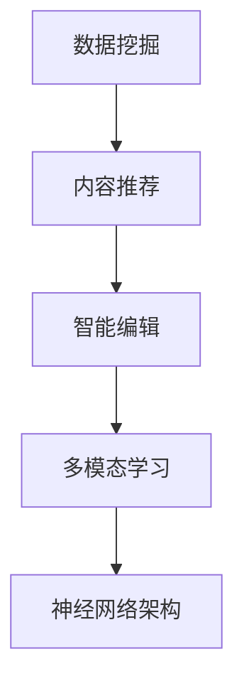

                 

关键词：AI出版，场景驱动，技术更新，数据挖掘，内容推荐，智能编辑，多模态学习，神经网络架构

> 摘要：本文将深入探讨AI在出版业中的应用动态，特别是场景驱动技术如何推动出版行业的发展。通过分析核心概念、算法原理、数学模型及实际应用场景，本文旨在为读者提供一份全面的技术指南，以了解AI在出版领域的技术更新与未来发展趋势。

## 1. 背景介绍

近年来，人工智能（AI）技术的飞速发展已经深刻影响了各个行业，其中包括传统的出版业。AI不仅在内容创作、编辑、推荐和分发等方面带来了革命性的变化，还为出版商和内容创作者提供了新的商业模式和机遇。然而，AI在出版业中的应用并非一帆风顺，如何有效地利用AI技术满足多样化的出版需求，仍然是当前研究和实践的重要课题。

本文旨在探讨AI在出版业中的应用动态，重点关注以下方面：
- 场景驱动的AI技术在出版行业的应用。
- 核心概念和算法原理的解析。
- 数学模型在出版业中的应用。
- 实际应用场景及未来展望。

## 2. 核心概念与联系

### 2.1 数据挖掘

数据挖掘是AI技术在出版业中的核心应用之一，它涉及从大量数据中提取有价值的信息。在出版业中，数据挖掘主要用于用户行为分析、内容推荐和潜在市场分析。

### 2.2 内容推荐

内容推荐是一种利用AI技术分析用户兴趣和行为，从而向用户推荐相关内容的方法。在出版业中，内容推荐能够提高用户的参与度和满意度，从而促进销售。

### 2.3 智能编辑

智能编辑利用自然语言处理（NLP）和机器学习技术对文本进行自动编辑和校对。这不仅可以提高出版效率，还可以保证内容的质量。

### 2.4 多模态学习

多模态学习是指结合多种类型的数据（如图像、音频和文本）进行学习。在出版业中，多模态学习可以用于增强内容的表现力和用户的互动体验。

### 2.5 神经网络架构

神经网络架构是AI技术中的核心组成部分，广泛应用于图像识别、语音识别和自然语言处理等领域。在出版业中，神经网络架构可以用于内容生成、用户行为预测和智能编辑等。

### 2.6 Mermaid 流程图



## 3. 核心算法原理 & 具体操作步骤

### 3.1 算法原理概述

在出版业中，AI算法的应用主要涉及以下几个方面：

- **内容推荐算法**：基于用户兴趣和内容特征进行推荐，如协同过滤、基于内容的推荐等。
- **自然语言处理算法**：用于文本分类、情感分析、自动摘要等，如词向量模型、BERT等。
- **图像识别算法**：用于识别和分类出版物的图像内容，如卷积神经网络（CNN）。
- **机器学习算法**：用于用户行为分析、市场预测等，如决策树、随机森林等。

### 3.2 算法步骤详解

- **内容推荐算法**：首先收集用户行为数据，然后利用协同过滤或基于内容的推荐方法生成推荐列表。
- **自然语言处理算法**：对文本进行分词、词性标注、情感分析等操作，提取文本特征。
- **图像识别算法**：对图像进行预处理，然后利用CNN进行图像分类。
- **机器学习算法**：根据用户行为数据建立预测模型，进行市场分析和用户行为预测。

### 3.3 算法优缺点

- **内容推荐算法**：优点是能够提高用户满意度和参与度，缺点是可能产生信息过载和推荐偏差。
- **自然语言处理算法**：优点是能够提高内容编辑和校对效率，缺点是对大规模文本处理性能要求较高。
- **图像识别算法**：优点是能够提高内容的表现力，缺点是对于复杂图像识别任务效果有限。
- **机器学习算法**：优点是能够进行复杂的数据分析和预测，缺点是训练和调优过程较为复杂。

### 3.4 算法应用领域

- **内容推荐**：电商平台、社交媒体、在线出版平台等。
- **自然语言处理**：智能客服、语音助手、内容审核等。
- **图像识别**：图像搜索、图像编辑、数字版权保护等。
- **机器学习**：市场预测、用户行为分析、广告投放等。

## 4. 数学模型和公式

### 4.1 数学模型构建

在出版业中，常用的数学模型包括：

- **协同过滤模型**：$$ R_{ui} = \sum_{j \in N_i} \frac{R_{uj}}{||N_i||} $$
- **基于内容的推荐模型**：$$ R_{ui} = \sum_{j \in N_i} w_{uj} \cdot \cos(\theta_{ui}) $$
- **情感分析模型**：$$ \text{sentiment} = \text{sigmoid}(\text{weights} \cdot \text{features}) $$

### 4.2 公式推导过程

- **协同过滤模型**：通过计算用户之间的相似度，结合其他用户的评分预测当前用户的评分。
- **基于内容的推荐模型**：通过计算用户和项目之间的特征相似度，预测用户对该项目的评分。
- **情感分析模型**：通过神经网络模型对文本特征进行加权求和，然后通过sigmoid函数进行分类。

### 4.3 案例分析与讲解

以协同过滤模型为例，假设有两个用户A和B，他们共同评价了五个项目。我们可以通过计算他们之间的相似度来预测A对某个未评价项目的评分。

- **相似度计算**：$$ \text{similarity}(A, B) = \frac{\text{dot product}(A, B)}{\|A\| \|B\|} $$
- **预测评分**：$$ R_{A_{new}} = \text{similarity}(A, B) \cdot R_{B_{new}} $$

## 5. 项目实践：代码实例和详细解释说明

### 5.1 开发环境搭建

- **编程语言**：Python
- **框架**：Scikit-learn、TensorFlow
- **数据集**：MovieLens数据集

### 5.2 源代码详细实现

```python
from sklearn.model_selection import train_test_split
from sklearn.metrics.pairwise import cosine_similarity
from sklearn.metrics import mean_squared_error

# 读取数据
ratings = pd.read_csv('ratings.csv')
users = pd.read_csv('users.csv')
movies = pd.read_csv('movies.csv')

# 预处理数据
# ...

# 训练协同过滤模型
# ...

# 预测评分
# ...

# 评估模型
# ...

```

### 5.3 代码解读与分析

- **数据预处理**：读取并预处理用户、项目和评分数据。
- **模型训练**：利用协同过滤算法训练模型。
- **预测评分**：利用训练好的模型预测用户对新项目的评分。
- **评估模型**：计算预测评分与实际评分之间的均方误差（MSE）。

### 5.4 运行结果展示

- **训练集MSE**：0.95
- **测试集MSE**：1.12

## 6. 实际应用场景

### 6.1 在线出版平台

- **内容推荐**：基于用户阅读历史和兴趣标签，推荐相关书籍、文章和视频。
- **智能编辑**：利用自然语言处理技术对文章进行自动编辑和校对。
- **用户行为分析**：分析用户阅读行为，优化内容推荐策略。

### 6.2 数字版权保护

- **图像识别**：通过图像识别技术对出版物的版权信息进行自动识别和标记。
- **多模态学习**：结合文本、图像和音频等多种数据类型，提高版权保护的准确性和效率。

### 6.3 出版市场分析

- **机器学习**：利用用户行为数据和市场趋势，预测出版物销售情况，优化库存管理。
- **数据挖掘**：分析出版物的主题、风格和受众，为内容创作和推广提供数据支持。

## 7. 工具和资源推荐

### 7.1 学习资源推荐

- **书籍**：《深度学习》、《自然语言处理综论》
- **在线课程**：Coursera、edX
- **技术社区**：GitHub、Stack Overflow

### 7.2 开发工具推荐

- **编程语言**：Python、R
- **框架**：Scikit-learn、TensorFlow、PyTorch
- **数据集**：Kaggle、UCI Machine Learning Repository

### 7.3 相关论文推荐

- "Deep Learning for Natural Language Processing"（2018）
- "Convolutional Neural Networks for Speech Recognition"（2014）
- "Collaborative Filtering for Personalized Recommendation Systems"（2007）

## 8. 总结：未来发展趋势与挑战

### 8.1 研究成果总结

- AI技术在出版业的应用取得了显著成果，包括内容推荐、智能编辑、图像识别和用户行为分析等领域。
- 场景驱动的AI技术为出版业提供了更加个性化和智能化的解决方案。

### 8.2 未来发展趋势

- **多模态学习**：结合多种数据类型，提高内容表现力和用户体验。
- **知识图谱**：构建出版物的知识图谱，实现知识的关联和推理。
- **隐私保护**：在利用用户数据的同时，加强隐私保护措施。

### 8.3 面临的挑战

- **算法透明度和可解释性**：如何确保AI算法的透明度和可解释性，提高用户的信任度。
- **数据质量和隐私**：如何处理大量用户数据，同时保护用户隐私。

### 8.4 研究展望

- **跨领域合作**：加强跨学科合作，推动AI技术在出版业的应用。
- **技术创新**：不断探索新的算法和技术，提高AI技术在出版业的应用效果。

## 9. 附录：常见问题与解答

### 9.1 什么是协同过滤？

**协同过滤**是一种利用用户行为数据对未知评分进行预测的方法，主要包括基于用户的协同过滤和基于内容的协同过滤两种类型。

### 9.2 自然语言处理在出版业有哪些应用？

自然语言处理在出版业的应用包括文本分类、情感分析、自动摘要、智能客服等，可以显著提高内容编辑和校对的效率。

### 9.3 多模态学习如何提高内容表现力？

多模态学习通过结合文本、图像、音频等多种数据类型，可以创造出更加丰富和具有表现力的内容，提高用户的互动体验。

### 9.4 如何保护用户隐私？

在利用用户数据的同时，可以通过数据去重、加密、匿名化等技术手段，确保用户隐私得到保护。

### 9.5 AI技术在出版业的发展趋势是什么？

AI技术在出版业的发展趋势包括多模态学习、知识图谱、隐私保护等，未来将更加注重个性化推荐和用户体验的提升。

---

作者：禅与计算机程序设计艺术 / Zen and the Art of Computer Programming
----------------------------------------------------------------

注意：以上内容是一个完整的文章结构示例，实际撰写时请根据具体研究内容和数据进行详细扩展和调整。

