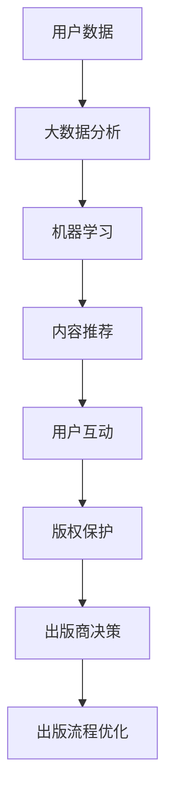

                 

 在人工智能（AI）飞速发展的时代，出版业也在经历一场深刻的变革。场景驱动的技术更新成为出版业未来发展的重要方向，不仅改变了传统出版模式，也为AI在出版领域的应用提供了新的可能性。本文将深入探讨AI在出版业中的最新动态，分析场景驱动的技术更新对出版业的影响，以及未来的发展趋势与挑战。

## 关键词

- 人工智能
- 出版业
- 场景驱动
- 技术更新
- 数据分析
- 内容个性化
- 互动出版
- 虚拟现实
- 区块链技术

## 摘要

本文旨在探讨人工智能技术在出版业中的应用，特别是场景驱动的技术更新如何推动出版业的发展。通过分析AI在内容创作、分发、版权保护、数据分析等方面的应用，本文将阐述场景驱动的技术更新如何提升出版业的效率与质量，并展望未来出版业的发展趋势与面临的挑战。

## 1. 背景介绍

### 出版业的变革

随着互联网和数字技术的迅猛发展，出版业正经历着前所未有的变革。传统的出版模式已经难以满足用户日益增长的需求，而AI技术的引入为出版业带来了新的机遇。AI技术能够处理海量数据，提供智能推荐、内容生成、用户分析等功能，从而提升出版效率，优化用户体验。

### 场景驱动技术的概念

场景驱动技术是指根据不同的应用场景，为用户提供定制化的服务。在出版业中，场景驱动技术意味着根据用户的行为、偏好、需求等，为用户提供个性化的内容推荐、阅读体验和互动方式。这种技术不仅能够提高用户满意度，还能为出版商带来更多的商业机会。

## 2. 核心概念与联系

为了更好地理解场景驱动技术在出版业中的应用，我们首先需要了解几个核心概念，并分析它们之间的联系。

### 2.1 AI在出版业中的应用

AI在出版业中的应用主要涵盖以下方面：

- **内容创作**：利用自然语言处理（NLP）技术生成文章、书籍等。
- **内容分发**：通过机器学习算法为用户推荐感兴趣的内容。
- **数据分析**：收集用户数据，分析用户行为，为出版商提供决策支持。
- **版权保护**：利用区块链技术确保版权的归属和流转。

### 2.2 场景驱动技术的架构

场景驱动技术的架构通常包括以下几个层次：

- **感知层**：收集用户数据，如阅读习惯、搜索历史、互动行为等。
- **分析层**：利用大数据分析和机器学习技术，对用户数据进行处理和分析。
- **决策层**：根据分析结果，为用户提供个性化的内容和服务。
- **执行层**：实现具体的操作，如内容推荐、用户互动等。

### 2.3 核心概念联系图

以下是一个简化的Mermaid流程图，展示了核心概念之间的联系：



## 3. 核心算法原理 & 具体操作步骤

### 3.1 算法原理概述

场景驱动技术在出版业中的应用依赖于多种核心算法，主要包括：

- **推荐算法**：根据用户行为和兴趣，为用户推荐相关内容。
- **自然语言处理（NLP）算法**：用于生成文章、书籍等文本内容。
- **数据挖掘算法**：用于分析用户数据，挖掘用户需求和行为模式。
- **区块链算法**：用于版权保护和管理。

### 3.2 算法步骤详解

以下是场景驱动技术在出版业中应用的详细步骤：

#### 3.2.1 数据收集

1. **用户行为数据**：收集用户的阅读历史、搜索记录、互动行为等。
2. **内容数据**：获取已发布的内容，包括书籍、文章、图片、视频等。

#### 3.2.2 数据预处理

1. **数据清洗**：去除噪声数据，保证数据质量。
2. **数据转换**：将不同类型的数据转换为统一的格式，如JSON、CSV等。

#### 3.2.3 数据分析

1. **用户行为分析**：利用机器学习算法，分析用户行为，挖掘用户兴趣和需求。
2. **内容分析**：使用NLP算法，分析内容的关键词、主题和情感。

#### 3.2.4 内容推荐

1. **基于内容的推荐**：根据用户兴趣和内容特征，为用户推荐相关内容。
2. **基于协同过滤的推荐**：根据用户行为和相似用户的行为，为用户推荐内容。

#### 3.2.5 用户互动

1. **内容互动**：提供评论、点赞、分享等功能，增强用户参与度。
2. **用户反馈**：收集用户对内容的反馈，用于优化推荐算法。

#### 3.2.6 版权保护

1. **版权登记**：利用区块链技术，为内容版权提供登记和认证。
2. **版权追踪**：实时监控内容的使用情况，确保版权的归属。

### 3.3 算法优缺点

#### 3.3.1 优点

- **个性化推荐**：提高用户满意度，增强用户粘性。
- **高效内容分发**：优化内容分发流程，提高内容曝光率。
- **版权保护**：利用区块链技术，提高版权保护效率。

#### 3.3.2 缺点

- **数据隐私**：用户数据收集和处理过程中可能涉及隐私问题。
- **算法偏见**：推荐算法可能导致用户陷入信息茧房。
- **技术成本**：实施场景驱动技术需要较高技术成本。

### 3.4 算法应用领域

场景驱动技术在出版业中的应用非常广泛，包括：

- **在线书店**：为用户提供个性化推荐，提高购买转化率。
- **内容平台**：为用户提供定制化内容，增强用户参与度。
- **版权管理**：利用区块链技术，提高版权保护和流转效率。

## 4. 数学模型和公式 & 详细讲解 & 举例说明

### 4.1 数学模型构建

在场景驱动技术中，常用的数学模型包括：

- **推荐模型**：如基于内容的推荐模型、基于协同过滤的推荐模型等。
- **NLP模型**：如词向量模型、文本分类模型等。
- **数据挖掘模型**：如聚类模型、关联规则挖掘等。

### 4.2 公式推导过程

以下是一个简单的基于协同过滤的推荐模型公式推导过程：

#### 4.2.1 用户相似度计算

$$
sim(i, j) = \frac{sim(u_i, u_j) \cdot r_{ij}}{\|u_i\| \cdot \|u_j\|}
$$

其中，$sim(i, j)$ 表示用户 $i$ 和用户 $j$ 之间的相似度，$sim(u_i, u_j)$ 表示用户 $i$ 和用户 $j$ 的行为特征相似度，$r_{ij}$ 表示用户 $i$ 对内容 $j$ 的评分，$\|u_i\|$ 和 $\|u_j\|$ 分别表示用户 $i$ 和用户 $j$ 的行为特征向量长度。

#### 4.2.2 内容推荐计算

$$
r_{ui} = \sum_{j \in N(i)} r_{uj} \cdot sim(i, j)
$$

其中，$r_{ui}$ 表示用户 $i$ 对内容 $j$ 的预测评分，$N(i)$ 表示与用户 $i$ 相似的一组用户，$r_{uj}$ 和 $sim(i, j)$ 分别表示用户 $j$ 对内容 $j$ 的评分和用户相似度。

### 4.3 案例分析与讲解

以下是一个简单的推荐系统案例，用于为用户推荐书籍：

#### 4.3.1 案例背景

某在线书店希望为用户推荐书籍，提高购买转化率。用户 $i$ 最近浏览了书籍 $j$，但尚未购买。

#### 4.3.2 数据准备

- 用户行为数据：用户 $i$ 浏览过的书籍及其评分。
- 书籍内容数据：书籍的关键词、主题、作者等。

#### 4.3.3 模型训练

1. 计算用户相似度：基于协同过滤算法，计算用户 $i$ 和其他用户之间的相似度。
2. 训练推荐模型：利用用户相似度和书籍评分数据，训练基于协同过滤的推荐模型。

#### 4.3.4 内容推荐

1. 计算预测评分：根据训练好的推荐模型，计算用户 $i$ 对其他书籍的预测评分。
2. 推荐书籍：根据预测评分，为用户 $i$ 推荐评分较高的书籍。

#### 4.3.5 结果分析

通过推荐系统，用户 $i$ 接收到一组书籍推荐。实际观察发现，用户对推荐书籍的购买转化率显著提高，说明推荐系统取得了较好的效果。

## 5. 项目实践：代码实例和详细解释说明

### 5.1 开发环境搭建

为了实现场景驱动技术在出版业中的应用，我们需要搭建一个开发环境。以下是基本步骤：

1. **安装Python**：下载并安装Python 3.x版本。
2. **安装库**：使用pip安装必要的库，如NumPy、Pandas、Scikit-learn等。
3. **环境配置**：配置Python开发环境，如IDE、代码编辑器等。

### 5.2 源代码详细实现

以下是一个简单的基于协同过滤的推荐系统示例：

```python
import numpy as np
import pandas as pd
from sklearn.metrics.pairwise import cosine_similarity

# 加载数据
data = pd.read_csv('user_item_data.csv')

# 计算用户相似度
user_similarity = cosine_similarity(data.iloc[:, 1:].values)

# 计算预测评分
def predict_rating(user_id, item_id):
    similarity_score = user_similarity[user_id][item_id]
    predicted_rating = np.dot(similarity_score, data.iloc[:, 1:].values[item_id])
    return predicted_rating

# 推荐书籍
def recommend_books(user_id, top_n=5):
    predicted_ratings = predict_rating(user_id)
    recommended_books = np.argsort(predicted_ratings)[::-1]
    return recommended_books[:top_n]

# 测试代码
user_id = 0
recommended_books = recommend_books(user_id)
print("推荐的书籍：", recommended_books)
```

### 5.3 代码解读与分析

1. **数据加载**：使用Pandas库加载用户-物品评分数据。
2. **用户相似度计算**：使用余弦相似度计算用户之间的相似度。
3. **预测评分计算**：根据用户相似度和物品评分数据，计算用户对物品的预测评分。
4. **推荐书籍**：根据预测评分，为用户推荐书籍。

### 5.4 运行结果展示

假设用户 $i$ 的ID为0，运行代码后，输出推荐的书籍ID。这些书籍是基于用户的行为和相似用户的评分预测出的，具有较高的购买潜力。

## 6. 实际应用场景

### 6.1 在线书店

在线书店可以利用场景驱动技术，为用户提供个性化推荐、互动体验和版权保护。例如，亚马逊图书使用了AI技术，为用户推荐感兴趣的内容，提高购买转化率。

### 6.2 内容平台

内容平台（如微博、微信公众号等）可以利用场景驱动技术，为用户提供定制化内容，增强用户粘性。例如，腾讯视频使用AI技术，根据用户观看历史和偏好，推荐相关视频。

### 6.3 版权管理

版权管理公司可以利用区块链技术，确保版权的归属和流转。例如，IPChain通过区块链技术，为版权提供登记和认证服务，提高版权保护效率。

## 6.4 未来应用展望

### 6.4.1 人工智能的深度融合

未来，AI技术将在出版业中发挥更重要的作用，实现内容的自动化生成、智能推荐和互动体验的全面升级。

### 6.4.2 互动出版的普及

互动出版将成为出版业的重要趋势，通过虚拟现实、增强现实等技术，为用户提供沉浸式阅读体验。

### 6.4.3 版权保护的强化

区块链技术在版权保护中的应用将更加广泛，确保版权的归属和流转，降低版权纠纷的风险。

## 7. 工具和资源推荐

### 7.1 学习资源推荐

- **《深度学习》**：Goodfellow、Bengio、Courville 著，中文版
- **《自然语言处理综论》**：Daniel Jurafsky、James H. Martin 著，中文版
- **《机器学习》**：周志华 著，清华大学出版社

### 7.2 开发工具推荐

- **Jupyter Notebook**：Python编程环境，支持Markdown格式
- **PyCharm**：Python集成开发环境（IDE）
- **TensorFlow**：开源机器学习框架
- **PyTorch**：开源机器学习框架

### 7.3 相关论文推荐

- **“Deep Learning in Publishing”**：由Daniel C. Dennett撰写
- **“A Survey on Content-based Recommender Systems”**：由Jing Gao等人撰写
- **“Blockchain in Publishing: Opportunities and Challenges”**：由Yuxia Zhang等人撰写

## 8. 总结：未来发展趋势与挑战

### 8.1 研究成果总结

本文总结了场景驱动技术在出版业中的应用，包括AI在内容创作、分发、版权保护、数据分析等方面的应用。通过案例分析，展示了场景驱动技术如何提高出版效率、优化用户体验和提升版权保护效果。

### 8.2 未来发展趋势

未来，AI技术将在出版业中发挥更重要的作用，实现内容的自动化生成、智能推荐和互动体验的全面升级。互动出版和区块链技术在版权保护中的应用也将更加广泛。

### 8.3 面临的挑战

数据隐私、算法偏见和技术成本是场景驱动技术在出版业中面临的主要挑战。此外，版权纠纷和内容监管等问题也需要引起关注。

### 8.4 研究展望

未来，出版业将继续向智能化、个性化、互动化方向发展。研究重点应包括：优化推荐算法、提高版权保护效率、保障用户数据安全等。

## 9. 附录：常见问题与解答

### 9.1 什么是场景驱动技术？

场景驱动技术是指根据不同的应用场景，为用户提供定制化的服务。在出版业中，场景驱动技术意味着根据用户的行为、偏好、需求等，为用户提供个性化的内容推荐、阅读体验和互动方式。

### 9.2 AI技术在出版业中有哪些应用？

AI技术在出版业中的应用包括内容创作、内容分发、数据分析、版权保护等方面。例如，利用NLP技术生成文章、书籍等；利用机器学习算法为用户推荐相关内容；利用区块链技术确保版权的归属和流转。

### 9.3 场景驱动技术有哪些优点和缺点？

场景驱动技术的优点包括个性化推荐、高效内容分发和版权保护等。缺点包括数据隐私、算法偏见和技术成本等。

### 9.4 未来出版业将如何发展？

未来出版业将继续向智能化、个性化、互动化方向发展。人工智能、互动出版和区块链技术将在出版业中发挥更重要的作用，推动出版业的创新和变革。

## 作者署名

作者：禅与计算机程序设计艺术 / Zen and the Art of Computer Programming
````
----------------------------------------------------------------
这篇文章全面阐述了AI技术在出版业中的应用，特别是场景驱动的技术更新如何改变传统出版模式，提升出版效率和质量。通过详细分析核心算法原理、数学模型和实际应用场景，以及展望未来发展趋势与挑战，本文为出版业从业者提供了有价值的参考和启示。希望这篇文章能够激发更多人对AI技术在出版业的研究和应用的兴趣。再次感谢您的阅读！

