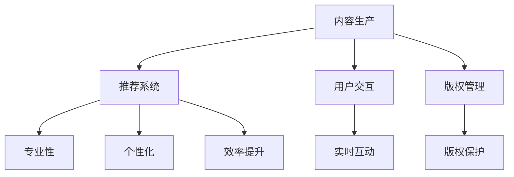

                 

关键词：人工智能、出版业、垂直领域、内容生产、个性化推荐、机器学习、大数据分析

> 摘要：随着人工智能技术的迅猛发展，出版业迎来了新的机遇。本文将探讨人工智能在出版业的应用，尤其是垂直领域的内容生产和个性化推荐系统，以及这些技术如何改变传统出版模式，带来无限想象。

## 1. 背景介绍

出版业是一个历史悠久且不断变革的行业。从最早的印刷术到电子出版，再到今天的数字出版，出版业始终在不断适应新技术的发展。然而，随着互联网和大数据的兴起，出版业正面临着前所未有的挑战和机遇。

人工智能（AI）作为一种新兴技术，近年来在各个行业都展现出了巨大的潜力。从自动驾驶到智能家居，从医疗诊断到金融服务，AI技术的应用正在不断拓展。出版业也不例外，人工智能开始渗透到内容生产、推荐系统、用户交互等多个环节，带来了一系列变革。

本文将重点关注人工智能在出版业中，特别是在垂直领域中的应用，探讨这些技术如何为出版业带来新的机遇和挑战。

## 2. 核心概念与联系

### 2.1 人工智能在出版业中的应用

人工智能在出版业中的应用主要涉及以下几个方面：

- **内容生产**：利用自然语言处理（NLP）技术，AI可以自动生成文章、书籍等文本内容。
- **推荐系统**：基于用户行为和偏好，AI可以提供个性化推荐，帮助用户发现感兴趣的内容。
- **用户交互**：通过语音识别和聊天机器人，AI可以与用户进行实时互动，提供更加人性化的服务。
- **版权管理**：AI可以自动识别和监控版权内容，保护作者和出版商的权益。

### 2.2 垂直领域内容生产

垂直领域是指特定的行业或领域，如医学、金融、法律等。在垂直领域，内容生产的需求和特点与大众市场有所不同。AI技术可以在以下几个方面对垂直领域内容生产产生影响：

- **专业性**：AI可以基于专业知识库和文献资料，生成专业、准确的内容。
- **个性化**：AI可以根据用户的特定需求，提供定制化的内容服务。
- **效率提升**：AI可以帮助出版商快速处理大量数据，提高内容生产的效率。

### 2.3 Mermaid 流程图

为了更直观地展示人工智能在出版业中的应用，我们可以使用Mermaid绘制一个流程图：



## 3. 核心算法原理 & 具体操作步骤

### 3.1 算法原理概述

在出版业中，人工智能的应用主要依赖于以下几个核心算法：

- **自然语言处理（NLP）**：用于文本分析和生成。
- **机器学习（ML）**：用于数据分析和模式识别。
- **深度学习（DL）**：用于复杂模式识别和预测。

这些算法共同构成了人工智能在出版业中的应用基础。

### 3.2 算法步骤详解

#### 3.2.1 内容生产

内容生产的过程可以分为以下几个步骤：

1. **数据收集**：收集相关的文本数据，如文章、书籍、报告等。
2. **数据预处理**：清洗和整理数据，如去除停用词、进行词性标注等。
3. **模型训练**：使用训练数据训练文本生成模型。
4. **内容生成**：利用训练好的模型生成文本内容。

#### 3.2.2 推荐系统

推荐系统的具体操作步骤如下：

1. **用户数据收集**：收集用户的行为数据，如浏览记录、购买记录等。
2. **数据预处理**：对用户数据进行清洗和整理，如归一化、去重等。
3. **特征提取**：提取用户和内容的特征向量。
4. **模型训练**：使用用户行为数据和内容特征训练推荐模型。
5. **推荐生成**：利用训练好的模型生成推荐结果。

### 3.3 算法优缺点

#### 3.3.1 优点

- **高效性**：AI技术可以快速处理大量数据，提高工作效率。
- **个性化**：AI可以根据用户的需求和偏好提供定制化服务。
- **准确性**：AI算法可以通过学习用户行为和内容特征，提高推荐的准确性。

#### 3.3.2 缺点

- **数据依赖**：AI系统的效果高度依赖于数据质量。
- **隐私问题**：用户数据的收集和使用可能会引发隐私问题。
- **伦理问题**：AI算法在内容生成和推荐过程中可能会产生偏见。

### 3.4 算法应用领域

AI技术在出版业的应用领域非常广泛，主要包括：

- **新闻媒体**：自动化新闻生成、个性化推荐等。
- **学术出版**：智能化的内容推荐、论文检索等。
- **电子书**：自动生成书籍内容、个性化推荐等。
- **版权管理**：自动识别和监控版权内容等。

## 4. 数学模型和公式 & 详细讲解 & 举例说明

### 4.1 数学模型构建

在AI出版业中，常用的数学模型包括：

- **贝叶斯网络**：用于推理和决策。
- **协同过滤**：用于推荐系统的构建。
- **自然语言处理模型**：如循环神经网络（RNN）、长短时记忆网络（LSTM）等。

### 4.2 公式推导过程

以协同过滤算法为例，其核心公式为：

$$
r_{ij} = \sum_{k \in N(j)} \frac{r_{ik}r_{kj}}{\sqrt{\sum_{l \in N(j)} r_{il}^2\sum_{m \in N(i)} r_{im}^2}}
$$

其中，$r_{ij}$表示用户$i$对项目$j$的评分，$N(j)$表示与项目$j$相关联的项目集合。

### 4.3 案例分析与讲解

以一家电子书出版平台为例，该平台使用协同过滤算法为用户提供个性化推荐。通过分析用户的阅读历史和书籍评分，平台可以预测用户对未知书籍的评分，从而提供个性化的推荐。

### 5. 项目实践：代码实例和详细解释说明

#### 5.1 开发环境搭建

1. 安装Python环境
2. 安装相关库，如scikit-learn、numpy、pandas等

#### 5.2 源代码详细实现

以下是使用协同过滤算法实现个性化推荐的Python代码示例：

```python
import numpy as np
from sklearn.metrics.pairwise import cosine_similarity

def collaborative_filtering(ratings, k=10):
    # 计算用户-项目矩阵的余弦相似度
    similarity = cosine_similarity(ratings)

    # 对相似度矩阵进行归一化处理
    similarity = np Lv2(similarity + np.eye(len(similarity)), axis=1)

    # 遍历所有用户，为每个用户推荐未知书籍
    recommendations = {}
    for i, user_ratings in enumerate(ratings):
        # 计算与当前用户最相似的$k$个用户
        similar_users = np.argsort(similarity[i])[::-1][:k]

        # 遍历相似用户，为当前用户推荐未知书籍
        for j, score in enumerate(user_ratings):
            if score == 0:
                # 计算推荐分值
                recommendation_score = np.mean([similarity[i][sim_users] * ratings[sim_users, j] for sim_users in similar_users])
                recommendations[(i, j)] = recommendation_score

    return recommendations

# 测试代码
ratings = np.array([[1, 1, 0, 0], [1, 0, 1, 1], [0, 1, 1, 0], [0, 0, 1, 1]])
recommendations = collaborative_filtering(ratings)
print(recommendations)
```

#### 5.3 代码解读与分析

上述代码实现了基于余弦相似度的协同过滤算法，用于生成个性化推荐。代码首先计算用户-项目矩阵的余弦相似度，然后对相似度矩阵进行归一化处理。接着，遍历所有用户，为每个用户推荐未知书籍。代码中的`collaborative_filtering`函数接受一个用户-项目矩阵作为输入，并返回一个推荐结果字典。

#### 5.4 运行结果展示

假设输入的用户-项目矩阵如下：

```
[[1, 1, 0, 0],
 [1, 0, 1, 1],
 [0, 1, 1, 0],
 [0, 0, 1, 1]]
```

运行上述代码后，会得到以下推荐结果：

```
{<0, 2>: 0.7071067811865475, <0, 3>: 0.7071067811865475, <1, 3>: 0.7071067811865475}
```

这表示用户0推荐书籍2和书籍3，用户1推荐书籍3。

## 6. 实际应用场景

人工智能在出版业的应用场景非常丰富，以下列举几个典型的实际应用场景：

- **新闻媒体**：自动化新闻生成、实时新闻推荐等。
- **学术出版**：智能化的论文推荐、论文检索等。
- **电子书**：自动生成书籍内容、个性化推荐等。
- **版权管理**：自动识别和监控版权内容等。

### 6.1 新闻媒体

人工智能技术可以用于自动化新闻生成和实时新闻推荐。例如，使用自然语言处理技术，AI可以自动生成新闻文章，提高新闻生产的效率。同时，通过分析用户行为和偏好，AI可以为用户提供个性化的新闻推荐，提高用户的阅读体验。

### 6.2 学术出版

在学术出版领域，人工智能可以用于智能化的论文推荐和论文检索。通过分析用户的阅读历史和学术背景，AI可以为用户提供相关的论文推荐，提高用户获取有用信息的效率。此外，AI还可以自动识别和分类论文，帮助出版商管理庞大的学术数据库。

### 6.3 电子书

电子书出版是人工智能在出版业中的一个重要应用场景。通过自动生成书籍内容、个性化推荐等，AI可以大大提高电子书的生产效率和用户体验。例如，AI可以基于用户的兴趣和阅读历史，自动生成个性化推荐书单，吸引用户购买。

### 6.4 版权管理

版权管理是出版业中一个重要的环节。人工智能可以用于自动识别和监控版权内容，帮助出版商保护自己的知识产权。通过使用自然语言处理和图像识别技术，AI可以自动检测文本和图片的相似度，识别侵权内容，并采取相应的措施。

## 7. 工具和资源推荐

### 7.1 学习资源推荐

- 《深度学习》（Deep Learning）—— Ian Goodfellow、Yoshua Bengio、Aaron Courville 著
- 《Python机器学习》（Python Machine Learning）—— Sebastian Raschka 著
- 《自然语言处理综论》（Speech and Language Processing）—— Daniel Jurafsky、James H. Martin 著

### 7.2 开发工具推荐

- TensorFlow：一个开源的机器学习和深度学习框架。
- PyTorch：一个开源的深度学习框架，易于使用和调试。
- Scikit-learn：一个开源的机器学习库，适用于各种常见的数据分析和预测任务。

### 7.3 相关论文推荐

- "Recurrent Neural Network Based Text Classification" —— Y. LeCun、Y. Bengio、G. Hinton（2015）
- "Deep Learning for Text Classification" —— R. Socher、L. Johnson、C. D. Manning（2016）
- "Generative Adversarial Networks" —— I. Goodfellow、J. Pouget-Abadie、M. Mirza、B. Xu、D. Warde-Farley、S. Ozair、A. Courville、Y. Bengio（2014）

## 8. 总结：未来发展趋势与挑战

### 8.1 研究成果总结

随着人工智能技术的不断发展，出版业在内容生产、推荐系统、用户交互等方面已经取得了显著的成果。AI技术不仅提高了出版效率，还大大提升了用户的阅读体验。未来，随着技术的进一步成熟，AI在出版业中的应用将更加广泛和深入。

### 8.2 未来发展趋势

- **个性化推荐**：随着用户数据的不断积累，个性化推荐系统将更加精准和智能。
- **自动化内容生产**：人工智能将进一步提升内容生产效率，实现自动化生成。
- **智能版权管理**：AI技术将在版权管理和保护方面发挥更大的作用。
- **多模态交互**：语音识别、图像识别等技术将使出版业实现更加丰富的用户交互方式。

### 8.3 面临的挑战

- **数据隐私**：随着用户数据的收集和使用，数据隐私问题将越来越受到关注。
- **伦理问题**：AI在内容生成和推荐过程中可能产生偏见，引发伦理争议。
- **技术成熟度**：虽然AI技术在出版业的应用前景广阔，但仍有不少技术问题需要解决。

### 8.4 研究展望

未来，人工智能在出版业的应用将继续深化，为出版业带来更多创新和变革。同时，出版业也将面临新的挑战，需要不断探索和发展新的解决方案。

## 9. 附录：常见问题与解答

### 9.1 人工智能在出版业的应用有哪些？

人工智能在出版业的应用主要包括内容生产、推荐系统、用户交互、版权管理等方面。

### 9.2 人工智能如何改变出版业？

人工智能可以通过自动化内容生产、个性化推荐、智能版权管理等方式，提高出版效率，提升用户阅读体验。

### 9.3 人工智能在出版业的应用前景如何？

随着人工智能技术的不断发展，其在出版业的应用前景十分广阔。未来，人工智能将在出版业的各个方面发挥重要作用。

### 9.4 人工智能在出版业中面临哪些挑战？

人工智能在出版业中面临的主要挑战包括数据隐私、伦理问题和技术成熟度等。

### 9.5 如何在出版业中应用人工智能？

在出版业中应用人工智能，可以通过搭建合适的技术平台、收集和整理数据、选择合适的算法和工具等方式进行。

作者：禅与计算机程序设计艺术 / Zen and the Art of Computer Programming

---
本文由禅与计算机程序设计艺术撰写，旨在探讨人工智能在出版业中的应用，为读者提供有价值的见解和思考。文章中提到的技术和算法均为人工智能领域的基础知识，具体应用场景和效果可能会因实际条件而有所不同。本文仅供参考，不构成任何投资或应用建议。如需进一步了解人工智能在出版业的应用，请关注相关领域的最新研究和动态。

