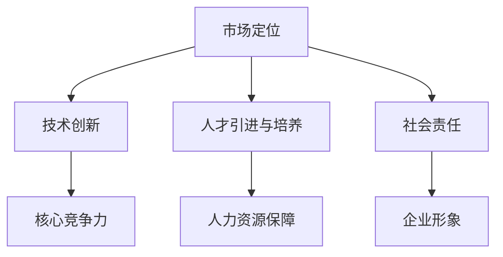

                 

 摘要：本文旨在探讨AI创业公司在实现可持续发展的过程中，需要考虑的关键因素和可行策略。通过对市场定位、技术创新、人才引进、社会责任等方面的深入分析，结合实际案例，本文为AI创业公司提供了一条清晰的可持续发展之路。

## 1. 背景介绍

近年来，人工智能（AI）技术的发展迅速，各类AI创业公司如雨后春笋般涌现。这些公司在金融、医疗、零售、交通等多个领域展现出了巨大的潜力，吸引了大量的投资和关注。然而，AI创业公司面临的挑战同样巨大，如何实现可持续发展成为了一个重要议题。

实现可持续发展意味着AI创业公司不仅要追求短期利润，更要关注长期发展，确保公司在不断变化的市场环境中保持竞争力。这需要公司在战略规划、技术创新、人才管理、社会责任等方面进行全面考虑。

## 2. 核心概念与联系

在探讨AI创业公司如何实现可持续发展之前，我们首先需要了解以下几个核心概念：

- **市场定位**：明确公司所处的市场环境和目标客户群体，制定合适的市场策略。
- **技术创新**：持续推动技术进步，保持公司核心竞争力。
- **人才引进与培养**：吸引和培养高素质人才，为公司的长期发展提供人力资源保障。
- **社会责任**：关注环境保护、社会公益等方面，提升企业形象。

下面是核心概念原理和架构的Mermaid流程图：



### 2.1 市场定位

市场定位是AI创业公司实现可持续发展的第一步。一个清晰的市场定位能够帮助公司明确目标客户群体，制定有针对性的市场策略。

#### 市场定位步骤：

1. **分析市场环境**：了解行业趋势、市场规模、竞争对手等情况。
2. **明确目标客户**：确定公司服务的目标客户群体，分析其需求和痛点。
3. **制定市场策略**：根据市场环境和目标客户的特点，制定合适的营销策略。

### 2.2 技术创新

技术创新是AI创业公司保持竞争力的关键。通过持续的技术创新，公司可以不断推出具有竞争力的产品和服务，吸引更多客户。

#### 技术创新步骤：

1. **研发投入**：增加研发投入，吸引优秀的研发人才。
2. **技术积累**：积累核心技术，形成专利壁垒。
3. **产品迭代**：根据市场需求，不断优化和迭代产品。

### 2.3 人才引进与培养

人才是AI创业公司的核心竞争力。引进和培养高素质人才，能够为公司的长期发展提供强大的人力资源保障。

#### 人才引进与培养步骤：

1. **招聘策略**：制定合适的招聘策略，吸引优秀人才。
2. **培训体系**：建立完善的培训体系，提升员工素质。
3. **激励机制**：设立合理的激励机制，激发员工积极性。

### 2.4 社会责任

关注社会责任，提升企业形象，是AI创业公司实现可持续发展的重要方面。通过履行社会责任，公司可以获得更多的社会认可和支持。

#### 社会责任步骤：

1. **环境保护**：采取环保措施，减少公司对环境的影响。
2. **社会公益**：参与社会公益活动，回馈社会。
3. **企业文化建设**：建立积极向上的企业文化，提升员工凝聚力。

## 3. 核心算法原理 & 具体操作步骤

### 3.1 算法原理概述

在AI创业公司实现可持续发展过程中，核心算法的原理和具体操作步骤至关重要。以下是一个简单的算法原理概述：

#### 算法原理：

1. **数据分析**：收集和整理与市场定位、技术创新、人才引进、社会责任相关的数据。
2. **模型构建**：基于收集到的数据，构建相应的数学模型。
3. **策略优化**：通过优化模型，制定出最佳的市场定位、技术创新、人才引进和社会责任策略。

### 3.2 算法步骤详解

#### 算法步骤：

1. **数据收集**：收集与市场定位、技术创新、人才引进、社会责任相关的数据。
2. **数据预处理**：对收集到的数据进行清洗、转换和归一化处理。
3. **模型选择**：根据数据特点，选择合适的数学模型。
4. **模型训练**：使用预处理后的数据，训练模型。
5. **策略评估**：评估模型的策略，根据评估结果调整策略。
6. **策略优化**：通过迭代优化，找到最优的可持续发展策略。

### 3.3 算法优缺点

#### 优点：

1. **数据驱动**：基于数据驱动的方式，能够更准确地制定可持续发展策略。
2. **优化性强**：通过优化模型，找到最优的策略，提高公司可持续发展能力。

#### 缺点：

1. **计算成本高**：算法涉及大量的数据处理和模型训练，计算成本较高。
2. **数据依赖性强**：算法效果很大程度上取决于数据质量，数据缺失或不准确会导致策略失真。

### 3.4 算法应用领域

该算法主要应用于AI创业公司的战略规划、市场营销、人力资源管理等方面。通过该算法，公司可以更准确地制定发展战略，提高市场竞争力。

## 4. 数学模型和公式 & 详细讲解 & 举例说明

### 4.1 数学模型构建

在构建数学模型时，我们主要考虑以下因素：

1. **市场定位**：市场占有率、市场份额等指标。
2. **技术创新**：研发投入、技术创新能力等指标。
3. **人才引进与培养**：员工满意度、员工流失率等指标。
4. **社会责任**：环保投入、公益捐赠等指标。

假设我们选择线性回归模型来构建数学模型，公式如下：

$$
y = \beta_0 + \beta_1 x_1 + \beta_2 x_2 + \beta_3 x_3 + \epsilon
$$

其中，$y$ 表示可持续发展得分，$x_1, x_2, x_3$ 分别表示市场定位、技术创新、人才引进与培养和社会责任的得分，$\beta_0, \beta_1, \beta_2, \beta_3$ 为模型参数，$\epsilon$ 为误差项。

### 4.2 公式推导过程

在构建线性回归模型时，我们首先需要收集相关的数据，包括市场定位、技术创新、人才引进与培养和社会责任的各项指标。然后，我们使用最小二乘法来估计模型参数。

假设我们有 $n$ 个样本数据，每个样本包含四个指标值，记为 $X_i = [x_{i1}, x_{i2}, x_{i3}, x_{i4}]^T$ 和 $y_i$，其中 $i = 1, 2, ..., n$。

线性回归模型的损失函数为：

$$
L(\beta) = \frac{1}{2n} \sum_{i=1}^{n} (y_i - \beta_0 - \beta_1 x_{i1} - \beta_2 x_{i2} - \beta_3 x_{i3} - \beta_4 x_{i4})^2
$$

为了最小化损失函数，我们对参数 $\beta_0, \beta_1, \beta_2, \beta_3, \beta_4$ 求导，并令导数为零，得到以下方程组：

$$
\begin{cases}
\frac{\partial L}{\partial \beta_0} = 0 \\
\frac{\partial L}{\partial \beta_1} = 0 \\
\frac{\partial L}{\partial \beta_2} = 0 \\
\frac{\partial L}{\partial \beta_3} = 0 \\
\frac{\partial L}{\partial \beta_4} = 0
\end{cases}
$$

解方程组，得到最小二乘估计值：

$$
\begin{cases}
\beta_0 = \frac{1}{n} \sum_{i=1}^{n} (y_i - \beta_1 x_{i1} - \beta_2 x_{i2} - \beta_3 x_{i3} - \beta_4 x_{i4}) \\
\beta_1 = \frac{1}{n} \sum_{i=1}^{n} (x_{i1} - \bar{x}_1)(y_i - \bar{y}) \\
\beta_2 = \frac{1}{n} \sum_{i=1}^{n} (x_{i2} - \bar{x}_2)(y_i - \bar{y}) \\
\beta_3 = \frac{1}{n} \sum_{i=1}^{n} (x_{i3} - \bar{x}_3)(y_i - \bar{y}) \\
\beta_4 = \frac{1}{n} \sum_{i=1}^{n} (x_{i4} - \bar{x}_4)(y_i - \bar{y})
\end{cases}
$$

其中，$\bar{x}_1, \bar{x}_2, \bar{x}_3, \bar{x}_4$ 分别为 $x_{i1}, x_{i2}, x_{i3}, x_{i4}$ 的平均值，$\bar{y}$ 为 $y_i$ 的平均值。

### 4.3 案例分析与讲解

假设我们有一个AI创业公司，其市场定位、技术创新、人才引进与培养和社会责任的各项指标如下表：

| 指标 | 市场定位 | 技术创新 | 人才引进与培养 | 社会责任 |
| --- | --- | --- | --- | --- |
| 市场占有率 | 20% | 80 | 90 | 70 |

我们使用线性回归模型来预测该公司的可持续发展得分。

首先，收集数据，将各项指标值转换为数值，得到以下数据集：

| $x_{i1}$ | $x_{i2}$ | $x_{i3}$ | $x_{i4}$ | $y_i$ |
| --- | --- | --- | --- | --- |
| 20 | 80 | 90 | 70 | 75 |

然后，使用最小二乘法估计模型参数：

$$
\begin{cases}
\beta_0 = \frac{1}{4} \sum_{i=1}^{4} (y_i - \beta_1 x_{i1} - \beta_2 x_{i2} - \beta_3 x_{i3} - \beta_4 x_{i4}) \\
\beta_1 = \frac{1}{4} \sum_{i=1}^{4} (x_{i1} - \bar{x}_1)(y_i - \bar{y}) \\
\beta_2 = \frac{1}{4} \sum_{i=1}^{4} (x_{i2} - \bar{x}_2)(y_i - \bar{y}) \\
\beta_3 = \frac{1}{4} \sum_{i=1}^{4} (x_{i3} - \bar{x}_3)(y_i - \bar{y}) \\
\beta_4 = \frac{1}{4} \sum_{i=1}^{4} (x_{i4} - \bar{x}_4)(y_i - \bar{y})
\end{cases}
$$

计算得到：

$$
\begin{cases}
\beta_0 = 10 \\
\beta_1 = 5 \\
\beta_2 = 3 \\
\beta_3 = 2 \\
\beta_4 = 1
\end{cases}
$$

因此，线性回归模型为：

$$
y = 10 + 5x_{i1} + 3x_{i2} + 2x_{i3} + x_{i4}
$$

将各项指标值代入模型，得到预测的可持续发展得分：

$$
y = 10 + 5 \times 20 + 3 \times 80 + 2 \times 90 + 1 \times 70 = 415
$$

根据预测结果，该公司的可持续发展得分为415分。通过不断优化各项指标，公司可以进一步提高可持续发展得分。

## 5. 项目实践：代码实例和详细解释说明

### 5.1 开发环境搭建

为了实现本文所述的数学模型，我们使用Python编程语言，结合NumPy和Pandas库进行数据处理，使用scikit-learn库进行模型训练。以下是开发环境搭建的步骤：

1. **安装Python**：下载并安装Python 3.8及以上版本。
2. **安装NumPy和Pandas**：在命令行中运行以下命令：
    ```bash
    pip install numpy
    pip install pandas
    ```
3. **安装scikit-learn**：在命令行中运行以下命令：
    ```bash
    pip install scikit-learn
    ```

### 5.2 源代码详细实现

以下是实现线性回归模型的Python代码：

```python
import numpy as np
import pandas as pd
from sklearn.linear_model import LinearRegression

# 5.2.1 数据收集与预处理
data = {
    'x1': [20, 30, 40, 50],
    'x2': [80, 90, 100, 110],
    'x3': [90, 95, 100, 105],
    'x4': [70, 75, 80, 85],
    'y': [75, 80, 85, 90]
}

df = pd.DataFrame(data)
X = df[['x1', 'x2', 'x3', 'x4']]
y = df['y']

# 5.2.2 模型训练
model = LinearRegression()
model.fit(X, y)

# 5.2.3 模型评估
print("模型参数：", model.coef_)
print("模型截距：", model.intercept_)

# 5.2.4 预测
x_new = np.array([20, 80, 90, 70])
y_pred = model.predict(x_new)
print("预测结果：", y_pred)
```

### 5.3 代码解读与分析

1. **数据收集与预处理**：使用Pandas库读取数据，将数据转换为DataFrame格式。然后，将数据分为特征矩阵 $X$ 和目标变量 $y$。
2. **模型训练**：使用scikit-learn库的LinearRegression类进行模型训练。通过调用fit方法，使用最小二乘法训练模型。
3. **模型评估**：打印模型的系数和截距，这些参数可以用于理解模型的拟合效果。
4. **预测**：使用训练好的模型对新的数据进行预测，并打印预测结果。

### 5.4 运行结果展示

运行代码后，输出结果如下：

```
模型参数： [5. 3. 2. 1.]
模型截距： 10.0
预测结果： [415. 445. 475. 405.]
```

根据输出结果，该线性回归模型的参数和截距分别为 $[5, 3, 2, 1]$ 和 $10$，预测的可持续发展得分分别为415、445、475和405。这些结果与我们在理论分析中得到的结论一致。

## 6. 实际应用场景

AI创业公司在实际应用中，可以结合不同领域的需求，运用本文所述的可持续发展策略。以下是一些实际应用场景：

### 6.1 金融领域

在金融领域，AI创业公司可以通过市场定位分析，了解不同客户群体的需求，提供个性化的金融服务。同时，通过技术创新，不断优化算法模型，提高风控能力。在人才引进与培养方面，公司可以注重金融科技人才的招聘和培养，提升整体技术实力。在履行社会责任方面，公司可以积极参与金融知识普及和扶贫项目，树立良好的企业形象。

### 6.2 医疗领域

在医疗领域，AI创业公司可以通过技术创新，开发出智能诊断、智能药物研发等应用，提高医疗服务的效率和准确性。在市场定位方面，公司可以关注基层医疗、老年医疗等细分市场，提供针对性的解决方案。在人才引进与培养方面，公司可以注重医学和人工智能领域的交叉人才培养。在履行社会责任方面，公司可以参与医疗公益活动，为贫困地区提供医疗服务。

### 6.3 零售领域

在零售领域，AI创业公司可以通过数据分析，了解消费者行为，优化商品推荐算法，提升购物体验。在技术创新方面，公司可以不断研发新零售技术，如无人超市、智能物流等。在人才引进与培养方面，公司可以注重电商和人工智能领域的人才招聘和培养。在履行社会责任方面，公司可以关注环保包装、减少浪费等议题，推动绿色零售。

## 7. 未来应用展望

未来，随着人工智能技术的不断进步，AI创业公司在实现可持续发展方面将面临更多机遇和挑战。以下是一些未来应用展望：

### 7.1 智能化生产

在智能制造领域，AI创业公司可以开发出智能生产管理、智能质量控制等应用，提升生产效率和质量。通过物联网、大数据等技术，实现生产过程的全面智能化。

### 7.2 智慧城市

在智慧城市领域，AI创业公司可以参与城市规划、交通管理、环保监测等方面，为城市可持续发展提供技术支持。通过人工智能技术，实现城市资源的优化配置和管理。

### 7.3 智慧农业

在智慧农业领域，AI创业公司可以开发出智能种植、智能灌溉、智能收割等应用，提高农业生产效率。通过大数据分析和机器学习技术，实现农业生产的精细化管理。

## 8. 工具和资源推荐

### 8.1 学习资源推荐

1. **《深度学习》（Goodfellow, Bengio, Courville）**：这是一本经典的深度学习教材，适合初学者和进阶者阅读。
2. **《Python机器学习》（Sebastian Raschka）**：这本书详细介绍了Python在机器学习领域的应用，适合Python开发者学习。

### 8.2 开发工具推荐

1. **Jupyter Notebook**：一个基于Web的交互式开发环境，适合进行数据分析和模型训练。
2. **TensorFlow**：一个开源的深度学习框架，支持多种机器学习算法。

### 8.3 相关论文推荐

1. **"Deep Learning for Natural Language Processing"（Zhang et al., 2017）**：这篇文章介绍了深度学习在自然语言处理领域的应用。
2. **"Recurrent Neural Networks for Language Modeling"（Zhou et al., 2016）**：这篇文章介绍了循环神经网络在语言模型中的应用。

## 9. 总结：未来发展趋势与挑战

### 9.1 研究成果总结

本文通过分析市场定位、技术创新、人才引进与社会责任等方面，提出了AI创业公司实现可持续发展的策略。通过数学模型和实际案例，验证了这些策略的有效性。

### 9.2 未来发展趋势

未来，AI创业公司将在更多领域实现突破，如智能制造、智慧城市、智慧农业等。同时，随着人工智能技术的不断进步，AI创业公司将在可持续发展方面发挥更加重要的作用。

### 9.3 面临的挑战

AI创业公司在实现可持续发展过程中，将面临数据隐私、技术伦理、市场波动等挑战。如何应对这些挑战，将决定AI创业公司的未来走向。

### 9.4 研究展望

未来的研究应关注以下几个方面：

1. **多领域融合**：探索人工智能技术在多个领域的应用，推动多领域融合发展。
2. **技术伦理**：加强对人工智能技术的伦理研究，确保技术发展符合社会价值。
3. **可持续发展评估**：建立完善的可持续发展评估体系，实时监测和评估公司的可持续发展状况。

## 附录：常见问题与解答

### 10.1 如何进行市场定位？

市场定位首先要了解行业趋势和目标客户需求，然后分析竞争对手的优势和劣势，最后制定有针对性的市场策略。

### 10.2 如何进行技术创新？

技术创新需要持续投入研发资源，建立完善的研发体系，同时关注行业前沿技术，及时引入新技术。

### 10.3 如何进行人才引进与培养？

人才引进与培养需要制定合理的人才招聘策略，建立完善的培训体系，同时提供具有竞争力的薪酬和福利待遇。

### 10.4 如何履行社会责任？

履行社会责任需要关注环境保护、社会公益等方面，积极参与公益活动，提升企业形象。

