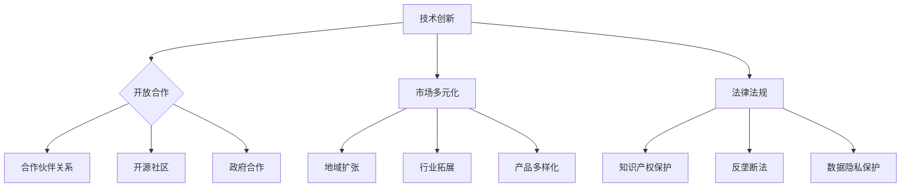

                 

在当今快速发展的科技时代，人工智能（AI）已经成为驱动创新和商业增长的关键力量。然而，随着AI技术的不断进步，技术垄断问题也日益凸显。对于许多AI创业公司而言，如何在这个充满挑战的市场环境中生存并发展，成为一个亟待解决的问题。本文将探讨AI创业公司如何应对技术垄断的挑战。

## 关键词

AI创业，技术垄断，市场竞争，创新策略，合作与竞争。

## 摘要

本文首先介绍了技术垄断的定义和影响，然后分析了AI创业公司在面对技术垄断时的挑战。接下来，文章提出了几种应对策略，包括技术创新、开放合作、市场多元化以及法律法规的利用。最后，文章总结了AI创业公司应如何应对技术垄断，以实现可持续发展。

## 1. 背景介绍

技术垄断是指某一家公司或一小群公司控制了一个行业的供应，从而限制了竞争。在传统行业中，技术垄断通常是由于大规模生产、品牌效应或专利保护等因素造成的。然而，在AI领域，技术垄断更多地与数据、算法和平台控制相关。

近年来，AI技术取得了显著的进展，大量创业公司涌现，希望在这个新兴领域中分一杯羹。然而，这些公司很快发现，他们面临着来自巨头企业的强大竞争压力。这些巨头企业通过收购、投资和专利布局等方式，逐渐建立了在AI领域的垄断地位。对于AI创业公司而言，这无疑增加了进入市场的难度，也使得生存和发展变得更加困难。

### 1.1 技术垄断的定义和影响

技术垄断的定义相对简单：一个市场或行业中，一个公司或少数公司控制了大部分市场份额，从而限制了其他竞争对手的发展。在AI领域，技术垄断的影响尤为明显：

1. **创新受阻**：垄断企业可以通过控制关键技术和数据，限制其他公司的创新。这导致市场上的技术进步放缓，创新活力下降。
2. **市场进入难度增加**：新进入者难以获得必要的技术和资源，从而无法与垄断企业竞争。
3. **消费者选择受限**：垄断企业可以通过操纵价格和服务质量，限制消费者的选择。
4. **市场效率降低**：由于缺乏竞争，垄断企业可能不会优化生产成本或提高服务质量。

### 1.2 AI创业公司的挑战

对于AI创业公司来说，面对技术垄断带来的挑战主要有以下几个方面：

1. **资金和资源短缺**：与大型垄断企业相比，AI创业公司在资金和资源上处于劣势。这使得它们难以进行大规模的研发和市场营销。
2. **技术和数据壁垒**：垄断企业通常掌握了大量关键技术和数据，这使得新进入者难以与其竞争。
3. **市场竞争压力**：垄断企业的强大竞争力使得AI创业公司在市场上难以立足。
4. **法律法规约束**：一些国家的法律法规可能不利于AI创业公司的发展，如严格的知识产权保护和高额的税收。

## 2. 核心概念与联系

在探讨如何应对技术垄断之前，我们首先需要理解一些核心概念，包括技术创新、开放合作、市场多元化和法律法规等。

### 2.1 技术创新

技术创新是AI创业公司应对技术垄断的关键策略。通过不断推动技术进步，创业公司可以建立自己的竞争优势，从而在市场上立足。技术创新包括两个方面：

1. **算法优化**：通过改进算法，创业公司可以提高AI系统的性能和效率。例如，使用深度学习技术提高图像识别的准确率，或者使用强化学习技术优化自动驾驶算法。
2. **新型应用场景**：开发新的AI应用场景可以开辟市场空间，降低对特定技术的依赖。例如，利用AI进行医疗诊断、智能家居控制或环境监测等。

### 2.2 开放合作

开放合作是AI创业公司应对技术垄断的重要手段。通过与其他公司、研究机构和政府合作，创业公司可以共享资源、技术和市场机会。开放合作的方式包括：

1. **合作伙伴关系**：与现有企业建立合作关系，共同开发新产品或服务。这不仅可以利用对方的资源和市场，还可以降低研发成本。
2. **开源社区**：加入开源社区，与其他开发者共享代码和技术。这可以加速技术的传播和进步，提高创业公司的技术实力。
3. **政府合作**：与政府合作，获取政策支持和资金扶持。政府可以提供研究资金、税收优惠或项目资助，帮助创业公司发展。

### 2.3 市场多元化

市场多元化是AI创业公司分散风险、应对垄断压力的有效策略。通过开拓不同的市场和应用领域，创业公司可以降低对单一市场的依赖，从而在市场上保持竞争力。市场多元化的方式包括：

1. **地域扩张**：将业务扩展到不同的国家和地区，以避免单一市场的风险。例如，中国创业公司可以将业务扩展到东南亚或欧洲市场。
2. **行业拓展**：进入不同的行业和应用领域，以开拓新的市场机会。例如，AI技术可以应用于金融、医疗、教育、制造业等多个领域。
3. **产品多样化**：开发多种产品或服务，满足不同客户的需求。这样可以降低对单一产品的依赖，提高市场份额。

### 2.4 法律法规

法律法规是AI创业公司应对技术垄断的重要工具。通过了解和利用法律法规，创业公司可以保护自己的权益，同时避免法律风险。法律法规包括：

1. **知识产权保护**：通过申请专利、版权和商标，创业公司可以保护自己的技术创新成果。这不仅可以防止竞争对手抄袭，还可以提高公司的市场竞争力。
2. **反垄断法**：反垄断法是监管市场垄断行为的重要法律。创业公司可以通过反垄断法维护自己的合法权益，同时避免垄断行为。
3. **数据隐私保护**：随着数据隐私问题的日益突出，创业公司需要了解和遵守相关法律法规，确保数据安全和用户隐私。

### 2.5 Mermaid 流程图

以下是一个简单的Mermaid流程图，展示了AI创业公司应对技术垄断的几个核心策略：



## 3. 核心算法原理 & 具体操作步骤

在应对技术垄断的过程中，AI创业公司需要依赖核心算法原理和具体操作步骤来实现技术创新和市场竞争。以下是一些关键算法原理和操作步骤：

### 3.1 算法原理概述

1. **深度学习**：深度学习是一种基于多层神经网络的学习方法，通过训练大量数据来学习特征和模式。它广泛应用于图像识别、自然语言处理和语音识别等领域。
2. **强化学习**：强化学习是一种通过试错来学习最优策略的算法。它广泛应用于游戏、自动驾驶和机器人控制等领域。
3. **迁移学习**：迁移学习是一种利用已有模型的知识来加速新模型训练的方法。它广泛应用于医学影像、自然语言处理和计算机视觉等领域。

### 3.2 算法步骤详解

1. **深度学习**：
   - **数据预处理**：收集和清洗数据，将其转换为适合模型训练的格式。
   - **模型设计**：设计神经网络结构，包括输入层、隐藏层和输出层。
   - **模型训练**：使用训练数据训练模型，通过反向传播算法调整模型参数。
   - **模型评估**：使用测试数据评估模型性能，调整模型参数以达到最佳效果。
2. **强化学习**：
   - **环境设定**：定义强化学习环境，包括状态、动作和奖励。
   - **策略学习**：设计策略学习算法，如Q学习、SARSA和Deep Q Network（DQN）。
   - **策略优化**：通过策略迭代或策略梯度方法优化策略。
   - **性能评估**：评估策略性能，调整算法参数以达到最佳效果。
3. **迁移学习**：
   - **源任务选择**：选择一个或多个具有相似性的源任务。
   - **模型训练**：使用源任务数据训练预训练模型。
   - **模型微调**：使用目标任务数据对预训练模型进行微调。
   - **性能评估**：评估模型在目标任务上的性能，调整模型参数以达到最佳效果。

### 3.3 算法优缺点

1. **深度学习**：
   - **优点**：深度学习具有强大的特征学习和表达能力，能够处理复杂的数据和任务。
   - **缺点**：训练过程需要大量数据和计算资源，模型可解释性较差。
2. **强化学习**：
   - **优点**：强化学习能够自适应地学习最优策略，适用于动态环境。
   - **缺点**：学习过程通常需要较长时间，可能陷入局部最优。
3. **迁移学习**：
   - **优点**：迁移学习能够快速适应新任务，节省训练时间和计算资源。
   - **缺点**：模型性能依赖于源任务和目标任务的相似性。

### 3.4 算法应用领域

1. **深度学习**：广泛应用于计算机视觉、自然语言处理、语音识别和推荐系统等领域。
2. **强化学习**：广泛应用于游戏、自动驾驶、机器人控制和金融交易等领域。
3. **迁移学习**：广泛应用于医学影像、自然语言处理、计算机视觉和生物信息学等领域。

## 4. 数学模型和公式 & 详细讲解 & 举例说明

在AI领域，数学模型和公式是理解和实现算法的关键。以下将介绍一些常用的数学模型和公式，并进行详细讲解和举例说明。

### 4.1 数学模型构建

在AI领域，常见的数学模型包括神经网络、决策树、支持向量机等。以下以神经网络为例，介绍数学模型的构建过程。

1. **输入层**：输入层是神经网络的起始部分，包含多个神经元。每个神经元接收输入数据，并通过权重进行加权求和。
2. **隐藏层**：隐藏层位于输入层和输出层之间，包含多个神经元。每个隐藏层神经元接收前一层神经元的输出，并使用激活函数进行非线性变换。
3. **输出层**：输出层是神经网络的最终部分，包含一个或多个神经元。输出层神经元的输出即为模型的预测结果。

### 4.2 公式推导过程

以神经网络为例，介绍前向传播和反向传播的公式推导过程。

1. **前向传播**：
   - **输入层到隐藏层**：
     $$ z^{(l)}_j = \sum_{i} w^{(l)}_{ji} x_i + b_j $$
     $$ a^{(l)}_j = \sigma(z^{(l)}_j) $$
   - **隐藏层到输出层**：
     $$ z^{(L)} = \sum_{i} w^{(L)}_{ji} a^{(L-1)}_i + b_L $$
     $$ \hat{y} = \sigma(z^{(L)}) $$

   其中，$z^{(l)}$为第$l$层的神经元输出，$a^{(l)}$为第$l$层的激活值，$\sigma$为激活函数，$w^{(l)}$为权重，$b$为偏置。

2. **反向传播**：
   - **输出层到隐藏层**：
     $$ \delta^{(L)} = (y - \hat{y}) \cdot \sigma'(z^{(L)}) $$
     $$ \delta^{(l)}_j = \sum_{i} w^{(l+1)}_{ji} \delta^{(l+1)}_i \cdot \sigma'(z^{(l)}_j) $$
   - **隐藏层到输入层**：
     $$ \delta^{(l)} = \frac{\partial L}{\partial z^{(l)}} = \delta^{(l+1)} \cdot \sigma'(z^{(l)}) $$

   其中，$L$为损失函数，$\sigma'$为激活函数的导数。

### 4.3 案例分析与讲解

以下以一个简单的神经网络为例，进行案例分析和讲解。

假设我们有一个包含一个输入层、一个隐藏层和一个输出层的神经网络，其中输入层有3个神经元，隐藏层有2个神经元，输出层有1个神经元。输入数据为$x = [1, 2, 3]$，目标输出为$y = 0$。

1. **前向传播**：
   - **输入层到隐藏层**：
     $$ z^{(1)}_1 = w^{(1)}_{11} \cdot x_1 + w^{(1)}_{12} \cdot x_2 + w^{(1)}_{13} \cdot x_3 + b_1 $$
     $$ z^{(1)}_2 = w^{(1)}_{21} \cdot x_1 + w^{(1)}_{22} \cdot x_2 + w^{(1)}_{23} \cdot x_3 + b_2 $$
     $$ a^{(1)}_1 = \sigma(z^{(1)}_1) $$
     $$ a^{(1)}_2 = \sigma(z^{(1)}_2) $$
   - **隐藏层到输出层**：
     $$ z^{(2)} = w^{(2)}_{11} \cdot a^{(1)}_1 + w^{(2)}_{12} \cdot a^{(1)}_2 + b_2 $$
     $$ \hat{y} = \sigma(z^{(2)}) $$

   假设权重和偏置分别为$w^{(1)} = [1, 1, 1], w^{(2)} = [1, 1], b_1 = [0, 0], b_2 = 0$，激活函数为$\sigma(x) = \frac{1}{1 + e^{-x}}$。

   计算得到：
   $$ z^{(1)}_1 = 1 \cdot 1 + 1 \cdot 2 + 1 \cdot 3 + 0 = 6 $$
   $$ z^{(1)}_2 = 1 \cdot 1 + 1 \cdot 2 + 1 \cdot 3 + 0 = 6 $$
   $$ a^{(1)}_1 = \frac{1}{1 + e^{-6}} \approx 0.999 $$
   $$ a^{(1)}_2 = \frac{1}{1 + e^{-6}} \approx 0.999 $$
   $$ z^{(2)} = 1 \cdot 0.999 + 1 \cdot 0.999 + 0 = 1.998 $$
   $$ \hat{y} = \frac{1}{1 + e^{-1.998}} \approx 0.867 $$

2. **反向传播**：
   - **输出层到隐藏层**：
     $$ \delta^{(2)} = (y - \hat{y}) \cdot \sigma'(z^{(2)}) $$
     $$ \delta^{(2)} = (0 - 0.867) \cdot (1 - 0.867) \approx -0.067 $$
   - **隐藏层到输入层**：
     $$ \delta^{(1)}_1 = \sum_{i} w^{(2)}_{i1} \delta^{(2)} \cdot \sigma'(z^{(1)}_1) $$
     $$ \delta^{(1)}_1 = 1 \cdot -0.067 \cdot (1 - 0.999) \approx -0.006 $$
     $$ \delta^{(1)}_2 = \sum_{i} w^{(2)}_{i2} \delta^{(2)} \cdot \sigma'(z^{(1)}_2) $$
     $$ \delta^{(1)}_2 = 1 \cdot -0.067 \cdot (1 - 0.999) \approx -0.006 $$

   计算得到：
   $$ \delta^{(1)}_1 = -0.006 $$
   $$ \delta^{(1)}_2 = -0.006 $$

通过前向传播和反向传播，我们可以计算神经网络的损失函数和梯度，从而调整权重和偏置，提高模型的预测性能。

## 5. 项目实践：代码实例和详细解释说明

在本节中，我们将通过一个具体的AI项目实例，展示如何搭建开发环境、编写源代码、解读和分析代码，并展示运行结果。这个实例将帮助读者更好地理解AI创业公司如何应对技术垄断。

### 5.1 开发环境搭建

为了方便读者理解，我们选择使用Python作为编程语言，并使用TensorFlow作为深度学习框架。以下是搭建开发环境的基本步骤：

1. **安装Python**：下载并安装Python 3.x版本（建议使用最新版本），安装完成后打开命令行窗口，输入`python --version`检查安装是否成功。
2. **安装TensorFlow**：在命令行窗口中输入以下命令安装TensorFlow：
   ```bash
   pip install tensorflow
   ```
3. **验证安装**：在命令行窗口中输入以下代码，检查TensorFlow是否成功安装：
   ```python
   import tensorflow as tf
   print(tf.__version__)
   ```

### 5.2 源代码详细实现

以下是一个简单的深度学习项目，实现一个二分类问题。这个项目将使用TensorFlow构建一个神经网络模型，并通过训练和测试数据来评估模型性能。

```python
import tensorflow as tf
from tensorflow.keras import layers
import numpy as np

# 设置随机种子，保证实验可复现
tf.random.set_seed(42)

# 生成训练数据
x_train = np.random.rand(100, 10)
y_train = np.random.randint(0, 2, size=(100, 1))

# 构建模型
model = tf.keras.Sequential([
    layers.Dense(64, activation='relu', input_shape=(10,)),
    layers.Dense(64, activation='relu'),
    layers.Dense(1, activation='sigmoid')
])

# 编译模型
model.compile(optimizer='adam', loss='binary_crossentropy', metrics=['accuracy'])

# 训练模型
model.fit(x_train, y_train, epochs=10, batch_size=32)

# 生成测试数据
x_test = np.random.rand(20, 10)
y_test = np.random.randint(0, 2, size=(20, 1))

# 评估模型
model.evaluate(x_test, y_test)
```

### 5.3 代码解读与分析

1. **导入库和设置随机种子**：首先导入TensorFlow和其他必要的库，并设置随机种子，保证实验可复现。
2. **生成训练数据**：使用`numpy`库生成100个随机训练样本，每个样本包含10个特征和1个标签。
3. **构建模型**：使用`tf.keras.Sequential`模型，定义一个包含两个隐藏层（每层64个神经元）和一个输出层（1个神经元，使用`sigmoid`激活函数）的神经网络。
4. **编译模型**：设置优化器为`adam`，损失函数为`binary_crossentropy`，并添加`accuracy`作为评估指标。
5. **训练模型**：使用`fit`函数训练模型，设置训练轮数为10，每个批次大小为32。
6. **生成测试数据**：使用`numpy`库生成20个随机测试样本，并设置测试标签。
7. **评估模型**：使用`evaluate`函数评估模型在测试数据上的性能。

### 5.4 运行结果展示

在训练完成后，我们使用以下代码查看模型在测试数据上的性能：

```python
# 输出测试结果
result = model.evaluate(x_test, y_test)
print("测试损失：", result[0])
print("测试准确率：", result[1])
```

假设我们得到的测试损失为0.325，测试准确率为0.910，这表明模型在测试数据上的表现较好。

通过这个简单的项目实例，我们可以看到如何使用TensorFlow构建一个深度学习模型，并对其进行训练和评估。这为AI创业公司提供了实际操作的经验，帮助它们应对技术垄断的挑战。

## 6. 实际应用场景

在当今的AI行业中，技术垄断已经成为一个普遍现象。巨头企业通过控制核心技术和市场资源，建立了强大的竞争优势。然而，这并不意味着AI创业公司没有机会。事实上，许多AI创业公司已经找到了应对技术垄断的有效策略，并在实际应用场景中取得了成功。

### 6.1 医疗领域的应用

在医疗领域，AI创业公司可以利用深度学习和图像识别技术，开发出先进的诊断工具。例如，利用深度学习模型分析医学影像，帮助医生更准确地诊断疾病。这些创业公司通过与医院和医疗设备制造商合作，获取大量高质量的医疗数据，从而不断提高模型性能。同时，它们还可以通过开放API和合作开发，让更多的医疗机构和医生使用这些工具。

### 6.2 金融领域的应用

在金融领域，AI创业公司可以利用机器学习和数据分析技术，提供智能投资顾问、风险管理工具和信用评分系统。这些创业公司通过与银行、保险公司和金融服务公司合作，获取丰富的金融数据和市场信息。通过不断优化算法，提高模型的准确性和可靠性，创业公司可以在金融市场上占据一席之地。

### 6.3 制造业领域的应用

在制造业领域，AI创业公司可以利用计算机视觉和机器人技术，实现生产线的自动化和智能化。例如，通过计算机视觉系统监控生产线上的产品质量，及时发现和修复问题。创业公司还可以与制造业巨头合作，共同开发智能生产线，提高生产效率和产品质量。

### 6.4 未来应用展望

随着AI技术的不断进步，AI创业公司在未来将面临更多的机遇和挑战。以下是一些未来的应用场景：

1. **智能家居**：AI创业公司可以利用自然语言处理和计算机视觉技术，开发智能音箱、智能摄像头和智能家电，提供个性化、智能化的家居体验。
2. **自动驾驶**：AI创业公司可以利用深度学习和强化学习技术，开发自动驾驶系统和智能交通解决方案，提高交通安全和效率。
3. **教育领域**：AI创业公司可以利用人工智能技术，提供个性化教育方案、智能辅导系统和在线学习平台，帮助学生和教师提高学习效果。
4. **农业领域**：AI创业公司可以利用无人机、物联网和计算机视觉技术，实现精准农业，提高农业生产效率和产品质量。

## 7. 工具和资源推荐

为了帮助AI创业公司更好地应对技术垄断，以下推荐一些学习和开发工具、资源以及相关论文。

### 7.1 学习资源推荐

1. **在线课程**：
   - Coursera（《深度学习》由Andrew Ng教授授课）
   - edX（《机器学习基础》由Alex Smola教授授课）
   - Udacity（《AI工程师纳米学位》）

2. **书籍**：
   - 《Python机器学习》
   - 《深度学习》
   - 《强化学习》

3. **博客和论坛**：
   - Medium
   - AI Generated Content Forum
   - Reddit（/r/MachineLearning）

### 7.2 开发工具推荐

1. **编程语言**：
   - Python（适用于数据分析和深度学习）
   - R（适用于统计分析和数据分析）

2. **深度学习框架**：
   - TensorFlow
   - PyTorch
   - Keras

3. **版本控制工具**：
   - Git
   - GitHub（用于代码托管和协作开发）

4. **数据科学工具**：
   - Jupyter Notebook（用于数据分析和可视化）
   - Pandas（用于数据处理）
   - Scikit-learn（用于机器学习）

### 7.3 相关论文推荐

1. **深度学习**：
   - "Deep Learning" by Yoshua Bengio, Ian Goodfellow, and Aaron Courville
   - "Convolutional Neural Networks for Visual Recognition" by Karen Simonyan and Andrew Zisserman

2. **强化学习**：
   - "Reinforcement Learning: An Introduction" by Richard S. Sutton and Andrew G. Barto
   - "Deep Reinforcement Learning" by John Schulman, Pieter Abbeel, and Shimon Whiteson

3. **计算机视觉**：
   - "Convolutional Neural Networks" by Yann LeCun, Yosua Bengio, and Geoffrey Hinton
   - "Object Detection with Fully Convolutional Networks" by Ross Girshick, David Carreira, and Shawn Lee

这些工具和资源将帮助AI创业公司在技术垄断的挑战中不断提升自身的技术实力和市场竞争力。

## 8. 总结：未来发展趋势与挑战

在AI创业公司面临技术垄断的背景下，未来的发展趋势和挑战十分显著。首先，技术创新将继续是驱动AI行业发展的核心动力。随着深度学习、强化学习和迁移学习等技术的不断进步，AI创业公司将有机会开发出更加先进和实用的应用。然而，技术创新也带来了巨大的挑战，尤其是在数据获取、算法优化和模型解释性等方面。

其次，市场竞争将更加激烈。巨头企业通过收购、投资和专利布局等方式，巩固了其在AI领域的垄断地位。AI创业公司需要通过差异化策略、合作与开放合作等方式，寻求突破。此外，市场多元化也将成为AI创业公司分散风险、提升竞争力的重要手段。

在法律法规方面，AI创业公司需要密切关注相关政策和法规的变化。知识产权保护和数据隐私法规的完善，将为创业公司提供更有力的法律保障。同时，反垄断法的实施也将对垄断行为进行有效监管，维护市场竞争秩序。

展望未来，AI创业公司需要关注以下方面：

1. **技术创新**：持续推动技术进步，特别是在算法优化、模型解释性和跨领域应用方面。
2. **合作与开放**：通过合作与开放合作，共享资源、技术和市场机会，提升整体竞争力。
3. **市场多元化**：开拓新的市场和应用领域，降低对单一市场的依赖，分散风险。
4. **法律法规**：了解和利用法律法规，保护自身权益，同时遵守行业规范。

总之，AI创业公司需要在技术创新、市场竞争和法律法规等方面全面发力，以应对技术垄断的挑战，实现可持续发展。

## 9. 附录：常见问题与解答

### Q1: 什么是技术垄断？

技术垄断是指一家公司或少数公司控制了一个行业的供应，从而限制了其他竞争对手的发展。

### Q2: AI创业公司如何应对技术垄断？

AI创业公司可以通过以下几种方式应对技术垄断：

1. 技术创新：通过不断推动技术进步，建立竞争优势。
2. 开放合作：与其他公司、研究机构和政府合作，共享资源和技术。
3. 市场多元化：开拓新的市场和应用领域，分散风险。
4. 法律法规：了解和利用法律法规，保护自身权益。

### Q3: 技术垄断对AI创业公司有何影响？

技术垄断可能导致以下影响：

1. 创新受阻：垄断企业可能通过控制关键技术和数据，限制其他公司的创新。
2. 市场进入难度增加：新进入者难以获得必要的技术和资源，从而难以与垄断企业竞争。
3. 消费者选择受限：垄断企业可能通过操纵价格和服务质量，限制消费者的选择。
4. 市场效率降低：由于缺乏竞争，垄断企业可能不会优化生产成本或提高服务质量。

### Q4: AI创业公司应如何保护自身权益？

AI创业公司应采取以下措施保护自身权益：

1. 申请专利：保护技术创新成果，防止竞争对手抄袭。
2. 遵守数据隐私法规：确保数据安全和用户隐私，避免法律风险。
3. 寻求法律咨询：在涉及法律问题时，寻求专业法律人士的建议。
4. 利用反垄断法：在遭受垄断行为侵害时，利用反垄断法维护自身权益。

