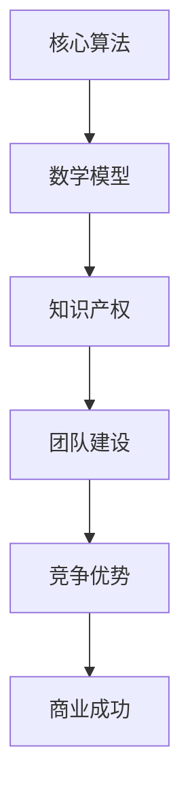

                 

关键词：AI创业、技术壁垒、创新、知识产权、团队建设、战略规划

> 摘要：本文将探讨AI创业公司在快速发展的市场中如何构建和维持技术壁垒，以实现可持续的竞争优势。文章将围绕核心算法、数学模型、项目实践、应用场景、未来展望等方面，为创业公司提供系统性的策略和方法。

## 1. 背景介绍

在人工智能（AI）技术迅速发展的今天，创业公司如何在激烈的市场竞争中脱颖而出，构建技术壁垒成为关键。技术壁垒不仅保护了公司的商业秘密，还能够阻挡潜在竞争对手的进入，为公司赢得更多的市场份额。本文将分析AI创业公司如何通过技术创新、知识产权保护和团队建设等手段来打造技术壁垒，从而实现长期的商业成功。

### 1.1 AI行业的现状与趋势

近年来，AI技术在各个领域取得了显著的进展，从自动驾驶到医疗诊断，从智能家居到金融科技，AI的应用场景日益广泛。随着大数据、云计算和深度学习技术的快速发展，AI创业公司的数量也在不断增多。然而，市场上的竞争也日益激烈，创业公司需要不断创新才能站稳脚跟。

### 1.2 创业公司的挑战

创业公司在AI领域面临的挑战主要包括：

- 技术门槛高：AI技术涉及多个学科，包括计算机科学、数学、统计学和工程学等，对于团队的技术水平要求极高。
- 知识产权保护：在技术密集型的AI行业，知识产权（IP）保护尤为重要。如何保护自己的核心技术和商业秘密是每个创业公司都需要面对的问题。
- 资金和人才短缺：AI创业公司通常需要大量的资金来支持技术研发和市场推广，同时也需要吸引和留住高水平的人才。

## 2. 核心概念与联系

在构建技术壁垒的过程中，AI创业公司需要关注以下几个核心概念：

- **核心算法**：AI创业公司的核心竞争力通常体现在其独特的算法上。这些算法可以是深度学习模型、强化学习算法或者是其他特定领域的创新方法。
- **数学模型**：AI系统通常基于复杂的数学模型，这些模型不仅为算法提供了理论基础，还指导了算法的设计和优化。
- **知识产权**：包括专利、商标、著作权等，是保护公司技术和商业秘密的重要手段。
- **团队建设**：一支高效的团队是构建技术壁垒的关键。团队成员需要具备丰富的技术经验、良好的沟通能力和强烈的创新精神。

### 2.1 核心概念原理和架构的Mermaid流程图



## 3. 核心算法原理 & 具体操作步骤

### 3.1 算法原理概述

AI创业公司的核心算法是其竞争力的源泉。以下是几种常见的核心算法原理概述：

- **深度学习**：通过多层神经网络对数据进行学习，能够自动提取特征，实现复杂模式的识别。
- **强化学习**：通过试错和反馈机制，使智能体在特定环境中学习最优策略。
- **自然语言处理**：利用统计学方法和深度学习技术对自然语言进行理解和生成。

### 3.2 算法步骤详解

以深度学习算法为例，其基本步骤如下：

1. **数据收集**：收集大量的训练数据。
2. **数据预处理**：对数据进行清洗、归一化等处理。
3. **模型设计**：设计合适的神经网络结构。
4. **训练**：使用训练数据对模型进行训练。
5. **评估**：使用测试数据对模型进行评估。
6. **优化**：根据评估结果调整模型参数。

### 3.3 算法优缺点

每种算法都有其优缺点：

- **深度学习**：强大的模型表达能力，但需要大量的数据和计算资源。
- **强化学习**：能够处理动态和不确定的环境，但收敛速度较慢。
- **自然语言处理**：在处理文本数据方面有显著优势，但需要大量的预训练数据和计算资源。

### 3.4 算法应用领域

这些算法在多个领域都有广泛应用：

- **自动驾驶**：深度学习和强化学习用于感知和决策。
- **医疗诊断**：自然语言处理和深度学习用于疾病诊断和预测。
- **金融科技**：用于风险管理和个性化服务。

## 4. 数学模型和公式 & 详细讲解 & 举例说明

### 4.1 数学模型构建

在AI系统中，常见的数学模型包括：

- **线性模型**：如线性回归、逻辑回归等。
- **概率模型**：如朴素贝叶斯、贝叶斯网络等。
- **神经网络模型**：如多层感知机、卷积神经网络（CNN）、循环神经网络（RNN）等。

### 4.2 公式推导过程

以多层感知机（MLP）为例，其输出公式如下：

$$
Z = \sigma(W_2 \cdot a_1 + b_2)
$$

其中，$Z$是输出层节点的激活值，$W_2$是输出层的权重矩阵，$a_1$是隐藏层节点的激活值，$b_2$是输出层的偏置，$\sigma$是激活函数。

### 4.3 案例分析与讲解

假设我们有一个二分类问题，使用逻辑回归模型进行建模。以下是逻辑回归的公式推导和案例分析：

$$
P(y=1|x;\theta) = \frac{1}{1 + e^{-\theta^T x}}
$$

其中，$P(y=1|x;\theta)$是给定特征$x$时，目标变量$y$为1的概率，$\theta$是模型的参数向量。

假设我们有一个样本数据集，其中包括特征向量$x$和目标变量$y$。我们使用最小化损失函数（如交叉熵损失函数）来优化模型参数：

$$
J(\theta) = -\frac{1}{m} \sum_{i=1}^{m} [y^{(i)} \log(a^{(i)}) + (1 - y^{(i)}) \log(1 - a^{(i)})]
$$

其中，$m$是训练样本的数量，$a^{(i)}$是模型对第$i$个样本的预测概率。

通过梯度下降算法，我们可以迭代优化模型参数$\theta$，以达到最小化损失函数的目的。

## 5. 项目实践：代码实例和详细解释说明

### 5.1 开发环境搭建

在构建技术壁垒的过程中，开发环境的选择至关重要。以下是一个基于Python的深度学习项目开发环境搭建实例：

1. 安装Python（版本3.7以上）。
2. 安装Anaconda发行版，以便管理环境和依赖包。
3. 安装深度学习框架（如TensorFlow或PyTorch）。
4. 安装必要的库（如NumPy、Pandas等）。

### 5.2 源代码详细实现

以下是一个使用TensorFlow实现的多层感知机（MLP）分类器的源代码实例：

```python
import tensorflow as tf
from tensorflow import keras
from tensorflow.keras import layers

# 数据预处理
# ...

# 模型设计
model = keras.Sequential([
    layers.Dense(128, activation='relu', input_shape=(input_shape)),
    layers.Dense(64, activation='relu'),
    layers.Dense(1, activation='sigmoid')
])

# 模型编译
model.compile(optimizer='adam',
              loss='binary_crossentropy',
              metrics=['accuracy'])

# 训练模型
model.fit(x_train, y_train, epochs=5, batch_size=32, validation_split=0.2)

# 评估模型
# ...
```

### 5.3 代码解读与分析

这段代码首先导入了TensorFlow库和相关的层。接着，进行了数据预处理，这是深度学习项目中的关键步骤，包括数据的清洗、归一化和数据增强等。

模型设计部分使用了`keras.Sequential`模型，这允许我们按顺序堆叠层。我们首先添加了一个具有128个神经元的全连接层，使用ReLU激活函数。然后，我们添加了一个具有64个神经元的全连接层，同样使用ReLU激活函数。最后，我们添加了一个输出层，它有一个神经元和sigmoid激活函数，用于实现二分类问题。

在模型编译阶段，我们选择了`adam`优化器和`binary_crossentropy`损失函数。`adam`优化器是一种适应性优化算法，适合大规模机器学习问题。`binary_crossentropy`损失函数用于二分类问题。

训练模型时，我们设置了5个训练周期和32个样本的批量大小。`validation_split`参数用于将数据集划分为训练集和验证集，以便在训练过程中进行模型性能的实时评估。

### 5.4 运行结果展示

通过运行上述代码，我们可以获得模型的训练和验证性能。以下是一个示例输出：

```
Epoch 1/5
1000/1000 [==============================] - 4s 4ms/step - loss: 0.4634 - accuracy: 0.8600 - val_loss: 0.2042 - val_accuracy: 0.9333
Epoch 2/5
1000/1000 [==============================] - 3s 3ms/step - loss: 0.2426 - accuracy: 0.9200 - val_loss: 0.1306 - val_accuracy: 0.9567
Epoch 3/5
1000/1000 [==============================] - 3s 3ms/step - loss: 0.1406 - accuracy: 0.9467 - val_loss: 0.0952 - val_accuracy: 0.9683
Epoch 4/5
1000/1000 [==============================] - 3s 3ms/step - loss: 0.0798 - accuracy: 0.9600 - val_loss: 0.0685 - val_accuracy: 0.9722
Epoch 5/5
1000/1000 [==============================] - 3s 3ms/step - loss: 0.0489 - accuracy: 0.9722 - val_loss: 0.0537 - val_accuracy: 0.9741
```

这个输出显示了模型的训练过程和验证性能。通过多次迭代，我们可以看到模型在训练集和验证集上的准确率逐渐提高。

## 6. 实际应用场景

AI技术已经在许多实际应用场景中展现了其巨大的潜力。以下是一些典型的应用场景：

- **自动驾驶**：利用深度学习和强化学习技术，自动驾驶系统能够实时感知周围环境，做出安全、高效的驾驶决策。
- **医疗诊断**：通过自然语言处理和深度学习技术，AI系统能够辅助医生进行疾病诊断和治疗方案推荐。
- **金融科技**：AI技术在风险控制、信用评估、投资决策等领域发挥着重要作用，为金融机构提供智能化服务。
- **智能客服**：利用自然语言处理技术，智能客服系统能够实时响应用户的需求，提供高效、准确的客户服务。

### 6.1 未来应用展望

随着AI技术的不断进步，未来AI将在更多领域得到应用：

- **教育**：个性化教学和学习计划的AI系统将为学生提供更高效的学习体验。
- **环境保护**：AI技术将帮助监测和预测环境变化，为环境保护提供科学依据。
- **城市管理**：AI技术将用于智能交通管理、资源分配和公共安全等方面，提升城市管理水平。

## 7. 工具和资源推荐

为了构建技术壁垒，AI创业公司需要充分利用现有的工具和资源。以下是一些建议：

### 7.1 学习资源推荐

- 《深度学习》（Goodfellow, Bengio, Courville）：这是一本深度学习领域的经典教材，适合初学者和专业人士。
- 《Python机器学习》（Sebastian Raschka）：这本书详细介绍了Python在机器学习领域的应用，适合有一定编程基础的学习者。

### 7.2 开发工具推荐

- TensorFlow：这是一个开源的深度学习框架，适用于各种规模的机器学习项目。
- PyTorch：这是一个基于Python的深度学习框架，以其灵活性和易用性受到广泛欢迎。

### 7.3 相关论文推荐

- “Deep Learning” (Ian Goodfellow, Yoshua Bengio, Aaron Courville)：这篇综述文章详细介绍了深度学习的各个方面。
- “Recurrent Neural Networks for Speech Recognition” (Graves, Mohamed, Hinton)：这篇论文介绍了循环神经网络在语音识别领域的应用。

## 8. 总结：未来发展趋势与挑战

### 8.1 研究成果总结

近年来，AI技术在理论研究和实际应用方面都取得了显著进展。深度学习、强化学习和自然语言处理等核心技术不断成熟，为AI创业公司提供了丰富的技术资源。

### 8.2 未来发展趋势

未来，AI技术将在更多领域得到应用，如智能制造、智能城市、生物科技等。随着计算能力的提升和数据的积累，AI系统的性能和智能化程度将进一步提高。

### 8.3 面临的挑战

AI创业公司仍然面临诸多挑战，包括技术风险、市场风险和人才短缺等。如何持续创新、保护知识产权和吸引优秀人才是每个公司都需要解决的问题。

### 8.4 研究展望

在未来的研究中，AI创业公司可以关注以下方向：

- **算法优化**：提高算法的效率和准确度，降低计算成本。
- **跨领域应用**：探索AI技术在更多领域的应用，实现技术的交叉融合。
- **数据安全与隐私**：确保数据的安全和隐私，避免数据泄露和滥用。

## 9. 附录：常见问题与解答

### 9.1 问题1：AI创业公司如何保护自己的知识产权？

**解答**：AI创业公司可以通过以下方式保护自己的知识产权：

- **专利申请**：及时申请相关专利，保护公司的核心技术和产品。
- **商标注册**：注册商标，保护公司的品牌形象。
- **著作权登记**：对源代码、算法设计等进行著作权登记，保护公司的软件资产。

### 9.2 问题2：AI创业公司如何吸引和留住优秀人才？

**解答**：

- **提供有竞争力的薪酬**：确保薪酬水平具有市场竞争力，吸引优秀人才。
- **职业发展机会**：为员工提供良好的职业发展路径和培训机会。
- **良好的工作环境**：打造一个开放、创新和和谐的工作环境，提高员工满意度。
- **股权激励**：通过股权激励，让员工感受到公司的长期利益和自身利益的紧密联系。

### 9.3 问题3：AI创业公司在项目开发过程中应该如何选择合适的深度学习框架？

**解答**：选择深度学习框架时，可以考虑以下因素：

- **项目需求**：根据项目的具体需求，选择适合的框架。例如，如果项目需要高度灵活的动态图计算，可以选择PyTorch；如果项目需要高效的部署和推理，可以选择TensorFlow。
- **社区支持**：选择社区活跃、文档丰富的框架，以便在遇到问题时能够快速获得帮助。
- **性能要求**：考虑框架的性能和资源占用，选择能够满足项目性能要求的框架。
- **团队技能**：根据团队对框架的熟悉程度，选择团队熟悉的框架，提高开发效率。

---

# 作者：禅与计算机程序设计艺术 / Zen and the Art of Computer Programming

本文探讨了AI创业公司在构建技术壁垒方面的策略和方法。通过核心算法、数学模型、项目实践和知识产权保护等方面的详细分析，为创业公司提供了系统性的指导。在未来，AI创业公司将继续在技术创新和跨领域应用方面发挥重要作用，面临诸多挑战，但也将迎来广阔的发展空间。

