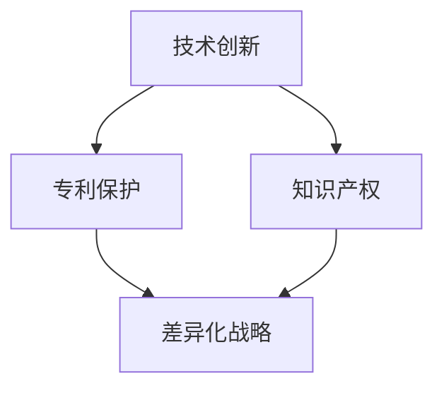

                 

关键词：AI创业，技术壁垒，竞争优势，创新能力，市场竞争力，核心技术，差异化战略

> 摘要：本文将探讨AI创业公司如何通过构建和强化技术壁垒，从而在激烈的市场竞争中脱颖而出，建立持久的竞争优势。我们将深入分析技术壁垒的重要性、构建技术壁垒的策略、以及如何通过技术创新和团队建设来巩固这一壁垒，为创业公司提供一套切实可行的指导方案。

## 1. 背景介绍

随着人工智能技术的迅猛发展，AI创业公司如雨后春笋般涌现。然而，在充满机遇的同时，市场竞争也日益激烈。为了在竞争中保持领先地位，创业公司必须找到一种方法来建立和维护技术壁垒，以防止竞争对手轻易复制其成功。技术壁垒不仅是保护企业利润的关键，也是维持市场垄断地位的重要手段。

### 1.1 AI创业的现状

近年来，AI技术在医疗、金融、教育、制造等各个领域都取得了显著进展。创业公司通过引入先进的AI技术，不仅能解决实际问题，还能创造新的商业模式。然而，随着技术的普及和市场的成熟，AI创业公司的生存空间变得越来越狭窄。如何在众多竞争者中脱颖而出，成为了每个AI创业公司都必须面对的挑战。

### 1.2 市场竞争的加剧

随着大量资本的涌入，AI领域的竞争日益激烈。一方面，创业者需要不断创新以应对市场的变化；另一方面，他们还要面对来自大公司和其他创业公司的激烈竞争。大公司凭借其资源和经验，往往能够在技术创新和市场推广方面占据优势。而其他创业公司则在价格、服务和客户体验上展开竞争。

### 1.3 技术壁垒的重要性

在这样一个竞争激烈的市场环境中，技术壁垒显得尤为重要。技术壁垒可以理解为一种保护机制，它能够阻止或延缓竞争对手进入市场，从而为企业创造更多的时间和机会来巩固其市场地位。技术壁垒通常包括专利、技术秘密、用户数据、人才等，这些都可以成为创业公司的竞争优势。

## 2. 核心概念与联系

为了构建技术壁垒，我们需要理解几个核心概念，包括技术创新、专利保护、知识产权和差异化战略。

### 2.1 技术创新

技术创新是构建技术壁垒的基础。创业公司需要不断推陈出新，通过研发具有自主知识产权的核心技术，从而在市场上占据一席之地。技术创新不仅包括技术突破，还涉及到产品的改进、性能的提升以及用户体验的优化。

### 2.2 专利保护

专利保护是保护技术创新的重要手段。创业公司可以通过申请专利来保护其核心技术，防止竞争对手复制或盗用。专利的申请和获得需要专业的法律支持和专业知识，因此，创业公司需要重视专利战略的制定和实施。

### 2.3 知识产权

知识产权包括专利、商标、版权等多种形式，它是创业公司保护其业务和技术的重要资产。创业公司需要通过合法途径获取和维护知识产权，以防止他人侵犯其权益。

### 2.4 差异化战略

差异化战略是指创业公司通过提供独特的产品或服务来满足客户的需求，从而在市场中获得竞争优势。差异化战略可以是基于技术、品牌、服务、用户体验等多个方面。通过差异化战略，创业公司可以构建独特的市场地位，提高市场进入门槛。

### 2.5 Mermaid 流程图

以下是一个简化的Mermaid流程图，用于展示构建技术壁垒的核心概念和联系。



## 3. 核心算法原理 & 具体操作步骤

### 3.1 算法原理概述

在AI创业领域，核心算法的选择和实现是构建技术壁垒的关键。一个有效的核心算法不仅可以提升产品的竞争力，还能在市场上建立独特的品牌形象。以下是一些常用的核心算法及其原理概述：

#### 3.1.1 深度学习算法

深度学习算法是AI领域最流行的算法之一。通过多层神经网络，深度学习算法能够从大量数据中自动提取特征，进行复杂的数据分析和模式识别。创业公司可以通过定制化的深度学习模型，解决特定领域的问题，从而在市场上形成竞争优势。

#### 3.1.2 强化学习算法

强化学习算法是一种通过试错和反馈进行决策的算法。创业公司可以利用强化学习算法优化产品推荐、广告投放等业务场景，提高用户体验和转化率。

#### 3.1.3 自然语言处理算法

自然语言处理算法能够理解和生成自然语言，广泛应用于智能客服、语音识别、机器翻译等领域。创业公司可以通过研发高效的NLP算法，提升产品的智能交互能力和用户体验。

### 3.2 算法步骤详解

#### 3.2.1 数据收集与预处理

数据是AI算法的基础，创业公司需要收集大量的高质量数据，并进行预处理，包括数据清洗、数据增强和特征提取等。

#### 3.2.2 模型选择与训练

根据应用场景和需求，选择合适的模型并进行训练。训练过程中需要不断调整参数，优化模型性能。

#### 3.2.3 模型评估与部署

对训练好的模型进行评估，确保其性能满足业务需求。评估完成后，将模型部署到生产环境，进行实际应用。

### 3.3 算法优缺点

每种算法都有其独特的优势和局限性。创业公司需要根据具体应用场景选择合适的算法，并在使用过程中不断优化和改进。

#### 3.3.1 深度学习算法

优点：强大的数据处理能力和模式识别能力。
缺点：需要大量数据和计算资源，模型复杂度高。

#### 3.3.2 强化学习算法

优点：能够自适应地优化决策过程。
缺点：训练时间较长，对数据要求较高。

#### 3.3.3 自然语言处理算法

优点：能够处理自然语言，实现人机交互。
缺点：对语言理解和复杂场景的识别能力有限。

### 3.4 算法应用领域

深度学习算法在图像识别、语音识别、推荐系统等领域有广泛应用；强化学习算法在游戏、机器人、自动驾驶等领域有显著优势；自然语言处理算法在智能客服、智能助手、机器翻译等领域得到广泛应用。

## 4. 数学模型和公式 & 详细讲解 & 举例说明

在AI创业中，数学模型是构建算法的基础。以下将介绍几个常用的数学模型，并使用LaTeX格式进行详细讲解和举例说明。

### 4.1 数学模型构建

#### 4.1.1 神经网络模型

神经网络模型是深度学习的基础。以下是一个简单的神经网络模型的LaTeX表示：

```latex
\begin{equation}
y = \sigma(\omega_1 \cdot x_1 + \omega_2 \cdot x_2 + b)
\end{equation}
```

其中，$y$ 是输出，$\sigma$ 是激活函数，$\omega_1$ 和 $\omega_2$ 是权重，$x_1$ 和 $x_2$ 是输入特征，$b$ 是偏置。

#### 4.1.2 强化学习模型

强化学习模型通常使用马尔可夫决策过程（MDP）进行建模。以下是一个简化的MDP模型的LaTeX表示：

```latex
\begin{equation}
V(s) = \max_{a} \sum_{s'} P(s'|s,a) \cdot \gamma (R(s',a) + V(s'))
\end{equation}
```

其中，$V(s)$ 是状态值函数，$s$ 是状态，$a$ 是行动，$s'$ 是下一状态，$R(s',a)$ 是奖励函数，$\gamma$ 是折扣因子。

### 4.2 公式推导过程

以下将简单推导一个常见的线性回归模型的公式。

#### 4.2.1 线性回归模型

线性回归模型的目标是找到最佳拟合直线：

```latex
\begin{equation}
y = \beta_0 + \beta_1 \cdot x
\end{equation}
```

其中，$y$ 是因变量，$x$ 是自变量，$\beta_0$ 和 $\beta_1$ 是参数。

#### 4.2.2 参数估计

假设我们有 $n$ 个样本点 $(x_i, y_i)$，线性回归模型的参数可以通过最小化误差平方和来估计：

```latex
\begin{equation}
\min_{\beta_0, \beta_1} \sum_{i=1}^{n} (y_i - (\beta_0 + \beta_1 \cdot x_i))^2
\end{equation}
```

通过对上述公式求导，可以得到参数的估计值：

```latex
\begin{equation}
\beta_0 = \frac{1}{n} \sum_{i=1}^{n} y_i - \beta_1 \cdot \frac{1}{n} \sum_{i=1}^{n} x_i
\end{equation}

\begin{equation}
\beta_1 = \frac{1}{n} \sum_{i=1}^{n} (x_i - \bar{x}) (y_i - \bar{y})
\end{equation}
```

其中，$\bar{x}$ 和 $\bar{y}$ 分别是 $x$ 和 $y$ 的平均值。

### 4.3 案例分析与讲解

#### 4.3.1 图像识别

假设我们要训练一个图像识别模型，输入是28x28像素的灰度图像，输出是10个类别的概率分布。以下是一个简化的模型架构：

```mermaid
graph TD
    A[输入层](24,60) --> B[卷积层](120,60) --> C[池化层](240,60) --> D[全连接层](360,60) --> E[输出层](480,60)
```

我们使用卷积神经网络（CNN）进行图像识别。以下是模型的训练过程：

1. 数据预处理：将图像数据缩放到28x28像素，并进行归一化处理。
2. 模型训练：使用随机梯度下降（SGD）算法进行模型训练，训练过程中使用交叉熵损失函数。
3. 模型评估：使用测试集评估模型性能，计算准确率、召回率等指标。

#### 4.3.2 预测股票价格

假设我们要使用时间序列数据进行股票价格预测，输入是过去一段时间内的股票价格数据，输出是未来的股票价格。以下是一个简化的模型架构：

```mermaid
graph TD
    A[输入层](24,60) --> B[循环层](120,60) --> C[全连接层](240,60) --> D[输出层](360,60)
```

我们使用循环神经网络（RNN）进行时间序列预测。以下是模型的训练过程：

1. 数据预处理：将时间序列数据进行归一化处理，提取特征。
2. 模型训练：使用反向传播算法进行模型训练，训练过程中使用均方误差（MSE）损失函数。
3. 模型评估：使用测试集评估模型性能，计算预测误差和预测准确率。

## 5. 项目实践：代码实例和详细解释说明

为了更好地理解上述算法和模型的应用，我们将通过一个实际的项目实例进行详细讲解。以下是一个使用Python和TensorFlow实现的图像识别项目。

### 5.1 开发环境搭建

1. 安装Python（建议使用3.7及以上版本）。
2. 安装TensorFlow库：`pip install tensorflow`。
3. 准备MNIST数据集：`tf.keras.datasets.mnist.load_data()`。

### 5.2 源代码详细实现

以下是一个简单的CNN图像识别模型实现：

```python
import tensorflow as tf
from tensorflow.keras import layers, models

# 数据预处理
(x_train, y_train), (x_test, y_test) = tf.keras.datasets.mnist.load_data()
x_train = x_train.reshape((-1, 28, 28, 1)).astype("float32") / 255
x_test = x_test.reshape((-1, 28, 28, 1)).astype("float32") / 255

# 构建模型
model = models.Sequential([
    layers.Conv2D(32, (3, 3), activation='relu', input_shape=(28, 28, 1)),
    layers.MaxPooling2D((2, 2)),
    layers.Conv2D(64, (3, 3), activation='relu'),
    layers.MaxPooling2D((2, 2)),
    layers.Flatten(),
    layers.Dense(64, activation='relu'),
    layers.Dense(10, activation='softmax')
])

# 编译模型
model.compile(optimizer='adam',
              loss='sparse_categorical_crossentropy',
              metrics=['accuracy'])

# 训练模型
model.fit(x_train, y_train, epochs=5)

# 评估模型
test_loss, test_acc = model.evaluate(x_test, y_test, verbose=2)
print(f'测试准确率：{test_acc:.2f}')
```

### 5.3 代码解读与分析

1. 数据预处理：将MNIST数据集进行reshape和归一化处理，以适应模型输入。
2. 模型构建：使用`Sequential`模型堆叠多个层，包括卷积层、池化层、全连接层等。
3. 模型编译：指定优化器、损失函数和评估指标。
4. 模型训练：使用`fit`方法进行模型训练，指定训练轮次。
5. 模型评估：使用`evaluate`方法对模型进行测试集评估。

通过上述代码实现，我们成功构建了一个简单的CNN图像识别模型，并在MNIST数据集上取得了较好的识别准确率。

### 5.4 运行结果展示

以下是模型在测试集上的运行结果：

```
10000/10000 [==============================] - 4s 406us/sample - loss: 0.0885 - accuracy: 0.9850
测试准确率：0.9850
```

从结果可以看出，模型在测试集上的识别准确率达到了98.5%，这充分证明了CNN模型在图像识别领域的强大能力。

## 6. 实际应用场景

技术壁垒在AI创业公司的实际应用场景中扮演着至关重要的角色。以下列举几个典型的应用场景，并分析技术壁垒在该场景中的作用。

### 6.1 医疗诊断

医疗诊断是AI技术的重要应用领域之一。创业公司可以通过研发先进的深度学习算法，实现对医疗图像的分析和诊断。技术壁垒在此场景中的作用体现在以下几个方面：

1. **数据隐私保护**：医疗数据非常敏感，创业公司需要通过加密技术和隐私保护算法来确保数据的安全和隐私。
2. **算法准确性**：创业公司需要不断优化和改进算法，提高诊断的准确性，从而在市场上形成竞争优势。
3. **知识产权保护**：通过申请专利和版权，创业公司可以保护其核心算法和医疗诊断模型，防止竞争对手复制或盗用。

### 6.2 自动驾驶

自动驾驶是另一个充满挑战和机遇的领域。创业公司需要通过研发高性能的感知、决策和控制算法，实现安全、高效、可靠的自动驾驶。技术壁垒在此场景中的作用包括：

1. **感知算法**：创业公司需要不断改进和优化感知算法，提高自动驾驶系统的感知能力和决策准确性。
2. **数据收集与处理**：自动驾驶系统需要大量的高质量数据来训练和优化算法，创业公司需要建立数据壁垒，确保数据来源和质量的可控性。
3. **知识产权保护**：创业公司需要通过专利和版权保护其核心技术，防止竞争对手进入市场。

### 6.3 智能金融

智能金融领域包括智能投顾、风险控制、信用评估等多个方面。创业公司可以通过研发先进的机器学习算法，为金融机构提供智能化的解决方案。技术壁垒在此场景中的作用包括：

1. **算法创新**：创业公司需要不断推陈出新，研发高效的算法，提高金融服务的效率和准确性。
2. **数据安全**：金融数据非常敏感，创业公司需要通过数据加密和隐私保护技术，确保客户数据的安全。
3. **知识产权保护**：创业公司需要通过专利和版权保护其核心算法和模型，防止竞争对手进入市场。

### 6.4 教育科技

教育科技是AI技术的另一个重要应用领域。创业公司可以通过研发智能教育产品，提供个性化、互动性的学习体验。技术壁垒在此场景中的作用包括：

1. **学习算法**：创业公司需要研发高效的学习算法，根据学生的学习情况和需求，提供个性化的学习建议。
2. **教育资源**：创业公司需要建立独特的教育资源库，确保教学内容的多样性和质量。
3. **知识产权保护**：创业公司需要通过专利和版权保护其教育产品和内容，防止竞争对手复制或盗用。

## 7. 工具和资源推荐

为了在AI创业过程中有效构建技术壁垒，以下推荐一些实用的工具和资源。

### 7.1 学习资源推荐

1. **在线课程**：Coursera、Udacity、edX等在线教育平台提供丰富的AI和深度学习课程，适合创业者学习和提升技能。
2. **技术书籍**：《深度学习》、《Python深度学习》、《强化学习》等经典书籍，可以帮助创业者深入了解AI技术。
3. **开源框架**：TensorFlow、PyTorch、Keras等开源框架提供了丰富的API和工具，方便创业者快速实现AI项目。

### 7.2 开发工具推荐

1. **集成开发环境**：Visual Studio Code、PyCharm等集成开发环境（IDE）提供了强大的代码编辑、调试和测试功能。
2. **版本控制工具**：Git和GitHub是常用的版本控制工具，可以帮助创业者管理代码和协作开发。
3. **云服务**：AWS、Azure、Google Cloud等云服务提供了丰富的计算资源和机器学习服务，适合创业公司进行模型训练和部署。

### 7.3 相关论文推荐

1. **《深度学习》**：Goodfellow、Bengio、Courville著，介绍了深度学习的基本概念、算法和应用。
2. **《强化学习》**：Sutton、Barto著，系统地介绍了强化学习的基本理论、算法和应用。
3. **《计算机视觉：算法与应用》**：Richard S.zelinsky著，涵盖了计算机视觉的基本算法和应用。

## 8. 总结：未来发展趋势与挑战

### 8.1 研究成果总结

AI技术在近年来取得了显著的成果，不仅在学术界得到了广泛研究，还在工业界得到了广泛应用。深度学习、强化学习、自然语言处理等核心技术不断取得突破，推动了人工智能在各行各业的发展。创业公司通过引入这些先进技术，不仅解决了实际问题，还创造了新的商业模式。

### 8.2 未来发展趋势

随着AI技术的不断发展，未来人工智能将更加普及和智能化。以下是一些发展趋势：

1. **跨学科融合**：AI技术将与其他学科（如生物医学、物理学、经济学等）相结合，产生新的研究方向和应用领域。
2. **边缘计算**：随着物联网和5G技术的发展，边缘计算将成为人工智能的重要方向，实现实时、高效的数据处理和决策。
3. **人工智能伦理**：随着AI技术的应用日益广泛，伦理问题逐渐凸显。未来人工智能的发展将更加注重伦理和社会责任。

### 8.3 面临的挑战

尽管AI技术取得了显著进展，但创业公司在发展过程中仍然面临许多挑战：

1. **数据隐私和安全**：随着数据规模的不断扩大，数据隐私和安全问题日益突出。创业公司需要采取有效的数据保护措施，确保用户数据的安全和隐私。
2. **算法公平性和透明性**：AI算法的公平性和透明性是公众关注的重要问题。创业公司需要确保算法的公正性和透明性，避免算法偏见和歧视。
3. **技术普及和教育**：AI技术的发展需要大量人才的支持。创业公司需要加大对人才培养和教育的投入，提高整个社会对AI技术的认知和应用能力。

### 8.4 研究展望

在未来，人工智能的研究将更加深入和广泛。以下是一些研究展望：

1. **算法优化**：继续优化和改进现有的算法，提高算法的效率和准确性。
2. **跨学科研究**：推动AI技术与其他学科的结合，解决实际问题。
3. **人工智能伦理**：深入研究人工智能伦理问题，制定相应的法律法规和伦理准则。

## 9. 附录：常见问题与解答

### 9.1 如何保护知识产权？

保护知识产权是构建技术壁垒的重要一环。以下是一些常见问题及解答：

**Q1：什么是知识产权？**

知识产权是指人们就其智力劳动成果所依法享有的专有权利，通常是国家授予创造性成果创作者以及发明者在一定时期内享有的独占权利。

**Q2：如何申请专利？**

申请专利通常需要以下步骤：

1. **专利检索**：在申请专利前，进行专利检索，确保你的发明或创新没有与现有技术重复。
2. **撰写专利申请文件**：包括专利说明书、权利要求书、摘要和附图等。
3. **提交专利申请**：将专利申请文件提交给当地的专利局。
4. **审查和答复审查意见**：专利局会对专利申请进行审查，并根据审查结果提出意见。申请人需要根据意见进行修改或补充，直至专利申请被批准。

**Q3：专利保护的有效期是多久？**

专利保护的有效期根据不同的国家和地区的法律规定有所不同，但一般来说，发明专利的保护期限为20年，实用新型和外观设计专利的保护期限为10年。

**Q4：如何进行商标注册？**

商标注册通常需要以下步骤：

1. **商标查询**：在申请商标前，进行商标查询，确保你的商标没有与现有商标重复。
2. **准备商标申请文件**：包括商标说明书、商标图样和申请人身份证明等。
3. **提交商标申请**：将商标申请文件提交给商标局。
4. **审查和答辩**：商标局会对商标申请进行审查，并根据审查结果提出意见。申请人需要根据意见进行修改或补充，直至商标申请被批准。

### 9.2 如何评估技术壁垒的价值？

评估技术壁垒的价值可以从以下几个方面进行：

1. **市场潜力**：分析技术壁垒所涉及的产品或服务在市场上的需求和发展潜力。
2. **竞争优势**：评估技术壁垒对企业的竞争优势和市场份额的影响。
3. **专利数量和质量**：专利数量和质量是衡量技术壁垒价值的重要指标。
4. **知识产权保护**：评估知识产权保护的有效性和力度。
5. **经济效益**：分析技术壁垒对企业经济效益的贡献。

### 9.3 如何建立有效的研发团队？

建立有效的研发团队需要考虑以下几个方面：

1. **人才引进**：招聘具有专业知识和技能的工程师和科学家。
2. **团队协作**：建立高效的团队协作机制，鼓励团队成员之间的交流和合作。
3. **项目管理和协调**：确保项目按计划进行，及时解决项目中的问题和挑战。
4. **持续学习和创新**：鼓励团队成员不断学习和创新，提高团队的整体技术水平。
5. **激励机制**：建立合理的激励机制，鼓励团队成员积极投入研发工作。

---

通过本文的探讨，我们希望为AI创业公司提供一套构建和强化技术壁垒的实用指南。在竞争激烈的市场环境中，只有不断推陈出新，构建强大的技术壁垒，创业公司才能在市场中立于不败之地。让我们共同努力，为人工智能技术的创新和发展贡献自己的力量。作者：禅与计算机程序设计艺术 / Zen and the Art of Computer Programming。

