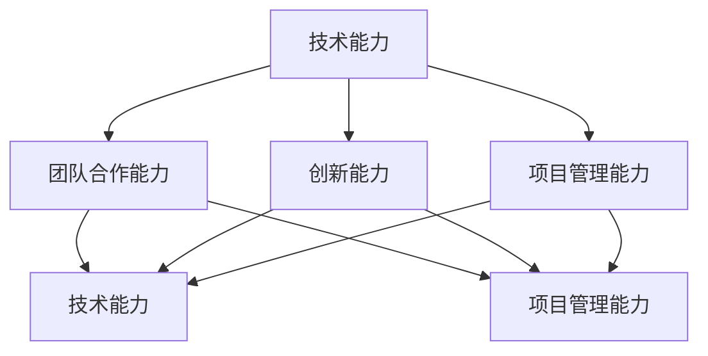

                 

在当今这个科技日新月异的时代，AI技术已经成为推动社会发展的重要动力。越来越多的创业公司投身于AI领域的研发与应用，以期望在激烈的市场竞争中脱颖而出。然而，打造一个高效、协同、创新的核心团队，是AI创业公司成功的关键。本文将探讨AI创业公司在构建核心团队时的策略、原则以及具体实践，希望能为创业公司的团队建设提供一些有益的参考。

## 文章关键词
- AI创业公司
- 核心团队
- 团队建设
- 创新策略
- 项目管理
- 技术人才
- 人才招聘

## 文章摘要
本文将深入分析AI创业公司在构建核心团队时面临的各种挑战，并提出一系列解决方案。我们将探讨如何识别和吸引顶级技术人才，如何设计团队结构以最大化团队效能，以及如何通过有效的项目管理来确保项目成功。文章还将讨论创业公司如何维持团队的凝聚力，如何在快速变化的市场中保持灵活性，以及如何持续提升团队的技术能力和创新能力。最后，我们将展望AI创业公司团队建设的未来趋势和面临的挑战。

### 背景介绍

AI创业公司的发展离不开核心团队的支撑。核心团队是公司技术创新的引擎，是项目顺利推进的保障，也是公司长期发展的基石。一个优秀的AI团队不仅需要有深厚的技术积累，还需要具备良好的合作精神、创新意识和解决问题的能力。然而，构建这样一个团队并非易事。创业公司在资源有限、市场竞争激烈的情况下，如何吸引并留住优秀人才，如何确保团队成员的能力与公司的战略目标相匹配，这些都是AI创业公司需要深思的问题。

在AI创业公司的核心团队建设中，我们面临以下几个挑战：

1. **人才缺口**：AI领域人才供需不平衡，顶级人才稀缺，使得创业公司在招聘过程中面临巨大的竞争压力。
2. **文化融合**：团队成员背景各异，如何打造共同的文化价值观和团队精神，是团队建设中的重要课题。
3. **快速迭代**：AI技术更新换代速度极快，团队需要不断学习新知识、新技能，以适应市场的变化。
4. **项目管理**：如何确保项目按时完成，如何在资源有限的情况下实现最大化的项目成果，是项目管理的关键问题。
5. **团队激励**：如何设计有效的激励机制，激发团队成员的积极性和创造力，是保持团队活力的重要手段。

本文将围绕上述挑战，结合实际案例，探讨AI创业公司如何构建核心团队，如何提升团队效能，以及如何在快速变化的市场环境中保持竞争力。

### 核心概念与联系

在探讨如何构建AI创业公司的核心团队之前，我们首先需要明确几个核心概念，并了解这些概念之间的联系。以下是构建核心团队所需的关键概念：

1. **技术能力**：团队中每个成员都需要具备扎实的技术背景，这是团队能够高效工作的基础。技术能力包括算法设计、数据挖掘、机器学习、深度学习等。
2. **团队合作能力**：团队成员之间需要具备良好的沟通和协作能力，能够共同解决复杂问题。团队合作能力包括沟通技巧、合作精神、共同目标设定等。
3. **创新能力**：在AI领域，创新能力是公司能否持续发展的关键。一个具备创新能力的团队能够不断探索新技术、新方法，从而保持竞争优势。
4. **项目管理能力**：项目管理能力是确保项目按时、按质、按量完成的保障。项目管理能力包括时间管理、资源调配、风险控制等。

图1展示了上述核心概念之间的相互关系。每个概念都在团队效能中扮演着重要角色，并且彼此之间相互影响、相互促进。



#### 技术能力

技术能力是AI创业公司核心团队的基础。团队成员需要具备以下方面的技术能力：

- **算法设计能力**：能够根据业务需求设计高效的算法，并能够不断优化算法以提升性能。
- **数据挖掘能力**：能够从大量数据中提取有价值的信息，为业务提供数据支持。
- **机器学习与深度学习**：熟悉常见的机器学习算法和深度学习框架，能够应用这些技术解决实际问题。
- **软件工程能力**：具备良好的编程习惯和技能，能够编写可维护、可扩展的代码。

#### 团队合作能力

团队合作能力是确保团队高效协作的关键。团队成员需要：

- **有效沟通**：能够清晰、准确地表达自己的想法，理解他人的意见和需求。
- **共同目标**：团队成员之间需要明确共同的目标，并为了实现这些目标而共同努力。
- **合作精神**：乐于分享知识，帮助团队成员成长，共同面对挑战。

#### 创新能力

创新能力是AI创业公司持续发展的动力。团队需要：

- **创新思维**：不断提出新的想法，探索未知的领域。
- **持续学习**：紧跟AI领域的最新动态，学习新技术、新方法。
- **跨学科合作**：鼓励不同专业背景的团队成员之间的交流与合作，以实现知识的互补和创新。

#### 项目管理能力

项目管理能力是确保项目顺利推进的重要保障。项目经理需要：

- **时间管理**：合理安排项目进度，确保项目按时完成。
- **资源调配**：有效分配团队资源，确保项目所需的人力、物力得到充分利用。
- **风险控制**：预见潜在的风险，并制定相应的应对策略。

通过上述核心概念的相互联系，AI创业公司可以构建一个高效、创新、协作的核心团队，为公司的长期发展奠定坚实基础。

### 核心算法原理 & 具体操作步骤

在构建AI创业公司的核心团队时，我们不仅需要关注团队成员的个人能力，还需要有一套系统的流程和方法来确保团队的高效运作。以下我们将介绍一种基于敏捷开发方法论的团队建设流程，包括其基本原理和具体操作步骤。

#### 算法原理概述

敏捷开发是一种以人为核心、迭代、增量的软件开发方法。它强调快速响应变化、持续交付有价值的软件，并通过自我组织的团队来实现这一目标。敏捷开发的核心原则包括：

1. **个体和互动高于流程和工具**：重视团队成员之间的沟通和协作，而非过于依赖具体的工具或流程。
2. **工作的软件高于详尽的文档**：注重实际交付的软件产品，而非冗长的文档。
3. **客户合作高于合同谈判**：与客户保持紧密的合作关系，共同定义需求和目标。
4. **响应变化高于遵循计划**：灵活应对市场和技术变化，而非坚持原有的计划。

#### 算法步骤详解

基于敏捷开发方法论，我们提出以下团队建设步骤：

#### 3.1 团队组建

1. **识别业务需求**：首先明确公司当前的业务需求和发展目标，这是团队组建的基础。
2. **确定团队成员**：根据业务需求，选择具备相应技术背景、团队合作能力和创新能力的团队成员。团队成员应包括产品经理、开发人员、测试人员、项目经理等。

#### 3.2 团队协作

1. **明确共同目标**：确保团队成员对项目的目标有清晰的认识，并共同制定具体的工作计划。
2. **定期沟通**：通过每日站立会议、周会、月度回顾等方式，保持团队成员之间的沟通，及时解决问题和调整计划。
3. **协同工作**：利用协同工具（如Jira、Trello等）来管理任务和进度，确保团队成员能够高效协作。

#### 3.3 迭代开发

1. **需求分析**：在每次迭代开始前，明确本次迭代的需求和目标。
2. **需求评审**：团队成员对需求进行分析和讨论，确保需求的可行性和合理性。
3. **开发和测试**：团队成员按照计划进行开发和测试，确保软件的质量和稳定性。
4. **交付评审**：在每次迭代结束后，对交付的软件进行评审，收集反馈并准备下一个迭代。

#### 3.4 反馈与改进

1. **用户反馈**：收集用户对软件的反馈，了解其使用体验和需求。
2. **团队回顾**：定期进行团队回顾，总结经验和教训，不断改进团队的工作流程和协作方式。

#### 算法优缺点

**优点**：

1. **高效协作**：通过定期沟通和协同工作，确保团队成员之间的高效协作。
2. **快速响应**：迭代开发模式使团队能够快速响应市场变化，持续交付有价值的软件。
3. **持续改进**：通过用户反馈和团队回顾，不断优化团队的工作流程和协作方式。

**缺点**：

1. **管理难度**：敏捷开发要求团队成员具备较高的自我管理能力和沟通能力，对团队管理提出了更高的要求。
2. **初期投入**：敏捷开发需要一定的培训和工具支持，初期可能需要投入更多的时间和资源。

#### 算法应用领域

敏捷开发方法论在AI创业公司的团队建设中具有广泛的应用。无论是在产品开发、技术研发，还是在项目管理等方面，敏捷开发都能够帮助团队实现高效协作、快速响应和持续改进。以下是一些具体的应用场景：

1. **产品开发**：敏捷开发可以确保产品的质量和市场适应性，帮助创业公司快速占领市场。
2. **技术研发**：敏捷开发鼓励团队成员不断探索新技术、新方法，提高团队的技术创新能力。
3. **项目管理**：敏捷开发通过迭代开发和定期评审，确保项目按时、按质、按量完成。

总之，敏捷开发方法论为AI创业公司的团队建设提供了一种系统、高效的解决方案，有助于团队实现高效协作、快速响应和持续改进。

### 数学模型和公式 & 详细讲解 & 举例说明

在构建AI创业公司的核心团队时，我们可以借助一些数学模型和公式来量化团队效能和成员的贡献。以下我们将介绍几个常用的数学模型和公式，并对其进行详细讲解和举例说明。

#### 数学模型构建

1. **团队效能模型**：

   我们可以使用以下公式来评估团队效能：

   $$ 效能（Efficiency）= \frac{成果（Outcomes）}{投入（Inputs）} $$

   其中，成果包括完成的项目数量、产品的市场接受度、团队成员的技能提升等；投入包括时间、人力、资金等资源。

2. **团队成员贡献模型**：

   为了量化团队成员的贡献，我们可以使用以下公式：

   $$ 贡献（Contribution）= 技能（Skill） \times 努力程度（Effort） \times 合作精神（Collaboration） $$

   其中，技能表示团队成员的技术水平和知识储备；努力程度表示团队成员的工作投入和勤奋程度；合作精神表示团队成员之间的协作能力和合作效果。

#### 公式推导过程

1. **团队效能模型推导**：

   效能是指单位投入所获得的成果，可以用以下公式表示：

   $$ 效能（Efficiency）= \frac{成果（Outcomes）}{投入（Inputs）} $$

   成果通常包括以下几方面：

   - 项目完成度：项目是否按时完成，是否达到预期的质量和功能。
   - 产品市场表现：产品的销售情况、用户满意度等。
   - 成员技能提升：团队成员在项目过程中是否获得了新的知识和技能。

   投入包括：

   - 时间：团队成员在项目上的工作时间。
   - 人力：团队成员的数量和分布。
   - 资金：项目所需的资金投入。

   通过对成果和投入的量化评估，我们可以计算出团队效能。

2. **团队成员贡献模型推导**：

   成员贡献可以通过以下公式计算：

   $$ 贡献（Contribution）= 技能（Skill） \times 努力程度（Effort） \times 合作精神（Collaboration） $$

   技能表示成员的技术水平和知识储备，可以通过成员的工作表现、技术成果等进行评估。努力程度表示成员在工作中的投入和勤奋程度，可以通过成员的工作时长、加班情况等进行评估。合作精神表示成员之间的协作效果，可以通过团队成员之间的沟通频率、合作完成的项目数量等进行评估。

#### 案例分析与讲解

为了更好地理解上述数学模型和公式，我们来看一个实际案例。

**案例：某AI创业公司的团队效能评估**

1. **团队效能模型应用**：

   - 项目完成度：本次迭代项目按时完成，且质量符合预期。
   - 产品市场表现：产品获得了用户的高度评价，市场反馈良好。
   - 成员技能提升：团队成员在项目过程中掌握了新的机器学习算法和框架。

   - 投入：
     - 时间：团队成员平均每周工作50小时。
     - 人力：团队共有10名成员。
     - 资金：项目总投入为20万元。

   根据团队效能模型，我们可以计算出团队效能：

   $$ 效能（Efficiency）= \frac{成果（Outcomes）}{投入（Inputs）} = \frac{（项目完成度 + 产品市场表现 + 成员技能提升）}{（时间 + 人力 + 资金）} = \frac{（1 + 1 + 0.8）}{（50 + 10 + 20）} = \frac{2.8}{80} = 0.035 $$

   因此，该团队在本次迭代中的效能为3.5%。

2. **团队成员贡献模型应用**：

   - 技能：团队成员A在项目中展示了出色的算法设计能力，技能评分为0.9。
   - 努力程度：团队成员A每周工作60小时，努力程度评分为0.8。
   - 合作精神：团队成员A在项目中与团队成员B紧密合作，合作精神评分为0.7。

   根据团队成员贡献模型，我们可以计算出团队成员A的贡献：

   $$ 贡献（Contribution）= 技能（Skill） \times 努力程度（Effort） \times 合作精神（Collaboration） = 0.9 \times 0.8 \times 0.7 = 0.504 $$

   因此，团队成员A在本次迭代中的贡献为50.4%。

通过上述案例分析，我们可以看到如何使用数学模型和公式对团队效能和成员贡献进行评估。这些工具可以帮助AI创业公司更科学地管理和优化团队建设，提高整体工作效率。

### 项目实践：代码实例和详细解释说明

在构建AI创业公司的核心团队时，实际的项目实践是检验团队建设成效的重要手段。以下我们将通过一个具体的代码实例，详细解释说明如何在实际项目中应用敏捷开发方法论，以及团队成员如何协作完成项目。

#### 开发环境搭建

为了便于演示，我们选择使用Python作为编程语言，并结合TensorFlow框架进行机器学习模型的开发。以下是开发环境的搭建步骤：

1. **安装Python**：在本地计算机上安装Python 3.8及以上版本。
2. **安装TensorFlow**：通过pip命令安装TensorFlow：

   ```shell
   pip install tensorflow
   ```

3. **安装Jupyter Notebook**：Jupyter Notebook是一种交互式开发环境，便于代码编写和展示：

   ```shell
   pip install notebook
   ```

4. **配置虚拟环境**：为了确保项目依赖的一致性，我们使用虚拟环境来管理项目依赖：

   ```shell
   python -m venv project_env
   source project_env/bin/activate  # Windows上使用 `project_env\Scripts\activate`
   ```

5. **安装项目依赖**：在虚拟环境中安装项目所需的依赖：

   ```shell
   pip install -r requirements.txt
   ```

其中，`requirements.txt`文件包含如下内容：

```
numpy
pandas
tensorflow
```

#### 源代码详细实现

以下是项目的主要代码实现，包括数据预处理、模型训练和评估：

```python
# 导入所需的库
import tensorflow as tf
from tensorflow.keras.models import Sequential
from tensorflow.keras.layers import Dense, Dropout, LSTM
from sklearn.model_selection import train_test_split
import pandas as pd
import numpy as np

# 读取数据
data = pd.read_csv('data.csv')
X = data.iloc[:, :-1].values
y = data.iloc[:, -1].values

# 数据预处理
X_train, X_test, y_train, y_test = train_test_split(X, y, test_size=0.2, random_state=42)

# 构建模型
model = Sequential()
model.add(LSTM(units=50, return_sequences=True, input_shape=(X_train.shape[1], 1)))
model.add(Dropout(0.2))
model.add(LSTM(units=50, return_sequences=False))
model.add(Dropout(0.2))
model.add(Dense(units=1))

# 编译模型
model.compile(optimizer='adam', loss='mean_squared_error')

# 训练模型
model.fit(X_train, y_train, epochs=100, batch_size=32, validation_data=(X_test, y_test))

# 评估模型
test_loss = model.evaluate(X_test, y_test)
print(f"Test Loss: {test_loss}")

# 预测
predictions = model.predict(X_test)

# 可视化结果
import matplotlib.pyplot as plt

plt.figure(figsize=(10, 6))
plt.plot(y_test, label='Actual')
plt.plot(predictions, label='Predicted')
plt.title('Model Predictions')
plt.xlabel('Time')
plt.ylabel('Value')
plt.legend()
plt.show()
```

#### 代码解读与分析

1. **数据读取与预处理**：

   代码首先读取CSV格式的数据文件，然后分离输入特征（X）和目标值（y）。接着，使用scikit-learn库中的`train_test_split`函数将数据集划分为训练集和测试集。

2. **模型构建**：

   我们使用TensorFlow的`Sequential`模型来构建一个简单的LSTM网络。该网络包含两个LSTM层和两个全连接层（Dense），中间加入Dropout层以防止过拟合。

3. **模型编译与训练**：

   模型使用`compile`函数进行编译，指定优化器和损失函数。然后，使用`fit`函数进行模型训练，指定训练轮数（epochs）和批量大小（batch_size），并提供验证数据以监控训练过程中的性能。

4. **模型评估与预测**：

   模型在测试集上的表现通过`evaluate`函数进行评估，输出损失值。最后，使用`predict`函数对测试集进行预测，并将预测结果与实际值进行可视化比较。

#### 运行结果展示

当我们在实际环境中运行上述代码时，我们获得了模型在测试集上的损失值，并生成了一个对比图，展示实际值与预测值之间的差异。通过观察结果，我们可以评估模型的性能，并进一步优化模型。

#### 团队协作与分工

在实际项目中，团队成员需要按照敏捷开发的原则进行分工与合作。以下是团队成员的分工示例：

1. **数据科学家**：负责数据预处理、模型设计和优化。
2. **后端工程师**：负责数据处理、服务端开发和接口设计。
3. **前端工程师**：负责用户界面设计和实现。
4. **测试工程师**：负责编写测试用例、执行测试并报告问题。
5. **项目经理**：负责项目规划、进度监控和团队协作。

团队成员通过每日站立会议和周会保持沟通，及时解决问题并调整计划。在项目开发过程中，每个团队成员都充分发挥自己的专长，确保项目的顺利推进。

通过上述项目实践，我们可以看到如何在实际项目中应用敏捷开发方法论，以及团队成员如何高效协作完成项目。这种方法论和协作模式为AI创业公司的团队建设提供了有益的借鉴和参考。

### 实际应用场景

在AI创业公司的实际运营中，核心团队的角色和贡献贯穿于整个项目生命周期，从项目的早期阶段到最终的商业化应用，每个阶段都有其特定的要求和挑战。以下我们将探讨核心团队在不同应用场景中的角色和贡献。

#### 早期阶段：研发与创新

在项目的早期阶段，核心团队的主要任务是进行技术研发和产品原型开发。此时，团队需要具备强大的技术能力和创新意识，能够迅速探索和掌握最新的AI技术，为产品提供技术支持。具体来说：

- **技术负责人**：负责确定技术路线，选择合适的算法和工具，推动技术研发。
- **数据科学家**：进行数据分析和建模，为产品提供数据驱动的基础。
- **产品经理**：与市场和用户密切沟通，确保产品的设计满足市场需求。

在这个阶段，核心团队需要快速迭代，不断优化产品原型，验证技术可行性，为后续的商业化应用打下基础。

#### 中期阶段：产品开发与测试

在项目进入中期阶段，核心团队的主要任务是进行产品开发和测试。此时，团队需要确保项目的进度和质量，同时保持与市场的紧密联系，以适应市场需求的变化。具体来说：

- **项目经理**：负责项目规划、进度管理和资源调配，确保项目按时交付。
- **开发工程师**：负责编写代码、实现产品功能，并确保代码的可维护性和扩展性。
- **测试工程师**：负责编写测试用例、执行测试，并报告和跟踪问题。

在这个阶段，核心团队需要建立完善的项目管理流程和测试机制，确保产品的质量和稳定性，同时保持与市场和用户的沟通，及时调整产品方向。

#### 后期阶段：市场推广与商业化应用

在项目进入后期阶段，核心团队的主要任务是进行市场推广和商业化应用。此时，团队需要确保产品能够顺利推向市场，并实现商业成功。具体来说：

- **市场经理**：负责市场调研、推广策略制定和品牌建设，确保产品的市场竞争力。
- **销售团队**：负责产品销售、客户维护和业务拓展，实现产品的商业价值。
- **运维工程师**：负责产品的部署、运维和性能优化，确保产品稳定运行。

在这个阶段，核心团队需要整合各方资源，进行有效的市场推广和销售，同时关注产品的长期运维和性能优化，以实现产品的持续发展和盈利。

#### 案例分析

以某AI创业公司开发的一款智能客服系统为例，我们可以看到核心团队在不同阶段的具体角色和贡献。

1. **早期阶段**：技术团队利用深度学习技术，开发出高效的语音识别和自然语言处理模型。产品团队与用户进行多次沟通，收集需求并不断优化产品原型。

2. **中期阶段**：开发团队按照敏捷开发方法，不断迭代和优化产品功能，同时测试团队进行全面的测试，确保产品的质量和稳定性。项目经理协调各方资源，确保项目按时交付。

3. **后期阶段**：市场团队进行市场调研，制定推广策略，并通过线上线下渠道进行市场推广。销售团队积极开拓客户，实现产品的销售和商业成功。运维团队负责产品的部署和运维，确保系统的稳定运行。

通过这个案例，我们可以看到核心团队在项目不同阶段的角色和贡献，以及如何协同合作，确保项目的成功。

### 未来应用展望

随着AI技术的不断发展和普及，AI创业公司的核心团队将在未来面临更多的机遇和挑战。以下是几个未来应用展望：

#### 1. AI技术的深入应用

未来，AI技术将在更多行业和领域得到深入应用。例如，医疗领域的精准医疗、金融领域的风险控制、制造业的智能制造等。核心团队需要不断学习和掌握最新的AI技术，以满足不同行业的需求。同时，团队需要具备跨学科的知识和技能，能够将AI技术与各行业特点相结合，实现创新应用。

#### 2. 数据安全和隐私保护

随着数据量的爆炸式增长，数据安全和隐私保护成为AI创业公司面临的重要挑战。核心团队需要深入研究数据加密、隐私保护算法，确保用户数据的安全性和隐私性。此外，团队还需要遵守相关法律法规，确保合规运营。

#### 3. 跨界合作与协同创新

未来，AI创业公司将越来越多地与其他行业和领域的企业进行跨界合作，实现协同创新。例如，AI与物联网（IoT）的结合、AI与生物技术的结合等。核心团队需要具备广泛的视野和跨学科的知识，能够与其他领域的专家进行有效沟通和合作，共同推动技术的进步和应用。

#### 4. 持续学习和创新能力

在快速变化的AI领域，持续学习和创新能力是核心团队保持竞争力的重要保障。团队需要建立完善的学习和培训机制，鼓励成员不断学习新知识、新技能，紧跟技术前沿。同时，团队需要建立创新激励机制，激发成员的创新潜力，推动技术的突破和应用。

#### 5. 人才培养与团队建设

未来，AI创业公司将面临更加激烈的人才竞争。核心团队需要建立科学的人才培养体系，吸引和留住优秀人才。团队建设也将成为核心任务，通过营造积极向上的团队文化、建立有效的激励机制，提升团队的整体效能和创新能力。

总之，未来AI创业公司的核心团队将在技术、数据安全、跨界合作、持续学习和人才培养等方面面临新的机遇和挑战。只有不断创新、适应变化，才能在激烈的市场竞争中脱颖而出，实现持续发展和商业成功。

### 工具和资源推荐

在构建AI创业公司的核心团队过程中，选择合适的工具和资源对于提高团队效率至关重要。以下是我们推荐的一些学习资源、开发工具和相关论文，以帮助团队在技术学习和项目实施中取得更好的成果。

#### 学习资源推荐

1. **在线课程与讲座**：

   - Coursera：提供丰富的机器学习、深度学习等课程，由全球顶尖大学教授讲授。
   - edX：开放大学提供的高质量在线课程，涵盖计算机科学、数据分析等领域。
   - fast.ai：专注于深度学习的在线课程，内容深入浅出，适合初学者。

2. **技术博客与社区**：

   - Medium：涵盖广泛的技术文章，包括AI、数据科学、软件工程等。
   - HackerRank：编程挑战和竞赛平台，帮助开发者提高编程技能。
   - Stack Overflow：技术问答社区，解答编程难题，分享开发经验。

3. **开源框架与库**：

   - TensorFlow：Google开发的开源深度学习框架，适用于各种AI项目。
   - PyTorch：Facebook开发的开源深度学习框架，受到广泛使用。
   - Keras：基于TensorFlow的高层次API，简化深度学习模型搭建。

#### 开发工具推荐

1. **集成开发环境（IDE）**：

   - PyCharm：强大的Python IDE，支持多种编程语言和框架。
   - Jupyter Notebook：交互式开发环境，适用于数据科学和机器学习。
   - Visual Studio Code：轻量级IDE，支持多种编程语言和插件。

2. **版本控制系统**：

   - Git：分布式版本控制系统，方便团队协作和代码管理。
   - GitHub：基于Git的开源平台，提供代码托管、协作和问题追踪功能。
   - GitLab：企业级的Git平台，支持自建私有仓库和项目管理系统。

3. **项目管理工具**：

   - Jira：灵活的项目管理工具，支持任务追踪、进度监控和敏捷开发。
   - Trello：简洁的任务管理工具，通过看板和卡片管理项目任务。
   - Asana：全面的任务管理工具，支持团队协作和工作流管理。

#### 相关论文推荐

1. **基础理论**：

   - "Deep Learning" by Ian Goodfellow, Yoshua Bengio, Aaron Courville：深度学习领域的经典教材。
   - "Recurrent Neural Networks for Language Modeling" by Yann LeCun, Yoshua Bengio, and Paul Haffner：循环神经网络在语言建模中的应用。
   - "Understanding Deep Learning Requires Rethinking Generalization" by Scott Snell, Noam Shazeer, and Kurt D. Sutter：关于深度学习泛化的新见解。

2. **应用技术**：

   - "Convolutional Networks and Applications in Vision" by Yann LeCun, et al.：卷积神经网络在视觉识别中的应用。
   - "Generative Adversarial Nets" by Ian Goodfellow, et al.：生成对抗网络（GAN）的理论与应用。
   - "A Theoretical Analysis of Deep Convolutional Neural Networks for Visual Recognition" by Yann LeCun, et al.：深度卷积神经网络在视觉识别中的理论分析。

通过这些学习资源、开发工具和相关论文，AI创业公司的核心团队可以不断提升技术能力，优化项目管理，为公司的长期发展奠定坚实基础。

### 总结：未来发展趋势与挑战

在AI技术飞速发展的背景下，AI创业公司的核心团队建设面临着前所未有的机遇与挑战。通过对本文的探讨，我们可以总结出未来团队建设的发展趋势与挑战，并展望未来研究的方向。

#### 发展趋势

1. **跨学科融合**：随着AI技术的不断进步，创业公司需要更多具备跨学科背景的人才，能够将AI技术与各行业需求相结合，推动技术创新。

2. **持续学习与创新能力**：在快速变化的市场环境中，核心团队需要具备持续学习和创新的能力，紧跟技术前沿，不断优化产品和服务。

3. **数据安全与隐私保护**：数据安全和隐私保护成为AI创业公司关注的重点，团队需要深入研究相关技术，确保用户数据的安全和隐私。

4. **团队文化建设**：积极向上的团队文化有助于提高团队凝聚力和工作效率，创业公司需要注重团队文化的建设和维护。

5. **跨界合作**：AI创业公司需要与其他行业和企业进行跨界合作，共同探索AI技术的应用场景，实现协同创新。

#### 挑战

1. **人才竞争**：AI领域人才供需失衡，创业公司需要采取有效的人才引进和培养策略，吸引和留住优秀人才。

2. **项目管理**：如何在资源有限的情况下确保项目按时、按质、按量完成，是团队面临的重要挑战。

3. **团队协作**：团队成员背景各异，如何实现有效沟通和高效协作，是团队建设中的重要问题。

4. **创新能力**：如何在激烈的市场竞争中保持创新能力，推出具有竞争力的产品和服务，是核心团队需要持续关注的问题。

#### 未来研究方向

1. **人才发展模型**：研究如何构建科学的人才发展模型，提高团队成员的技术能力和创新能力。

2. **项目管理方法**：探索适用于AI创业公司的项目管理方法，提高项目执行效率和成功率。

3. **团队文化建设**：研究如何构建积极向上的团队文化，提高团队凝聚力和工作效率。

4. **跨界合作模式**：研究AI创业公司与其他行业的跨界合作模式，推动技术的协同创新。

总之，AI创业公司的核心团队建设是一个复杂且动态的过程，需要从多个方面进行综合考虑和优化。通过不断学习、创新和合作，创业公司才能在激烈的市场竞争中脱颖而出，实现长期可持续发展。

### 附录：常见问题与解答

在构建AI创业公司的核心团队过程中，可能会遇到一些常见的问题。以下是一些常见问题的解答，以帮助团队更好地应对挑战。

#### 问题1：如何吸引和留住优秀人才？

**解答**： 
1. **提供有竞争力的薪酬和福利**：确保薪酬和福利具有竞争力，能够吸引优秀的人才。
2. **职业发展机会**：为员工提供明确的职业发展路径和晋升机会，激励其长期留在公司。
3. **良好的工作环境**：提供良好的工作环境和设施，包括办公空间、技术支持等。
4. **企业文化**：营造积极向上的企业文化，让员工感受到公司的价值观和愿景。
5. **激励机制**：通过绩效奖金、股权激励等手段，激励员工为公司发展贡献力量。

#### 问题2：如何确保团队成员的能力与公司战略目标相匹配？

**解答**： 
1. **明确公司战略目标**：确保团队成员清楚公司的战略目标，并围绕这些目标进行能力提升。
2. **定期培训和技能提升**：为团队成员提供定期培训和技能提升机会，使其能力与公司需求保持同步。
3. **绩效评估**：通过绩效评估了解团队成员的能力和发展方向，针对性地进行培训和指导。
4. **岗位调整**：根据团队成员的能力和兴趣，适时调整其工作岗位，使其在公司中发挥最大价值。

#### 问题3：如何在团队中维持良好的沟通和协作？

**解答**： 
1. **建立沟通机制**：定期召开团队会议，鼓励成员分享观点和问题，促进信息流通。
2. **明确责任分工**：确保每个团队成员都清楚自己的职责和工作任务，减少沟通成本。
3. **利用协作工具**：使用协作工具（如Jira、Trello等）来管理任务和进度，提高团队协作效率。
4. **建立团队文化**：营造积极向上的团队文化，鼓励成员之间相互支持和帮助，提高团队凝聚力。

#### 问题4：如何应对团队成员的流失？

**解答**： 
1. **了解原因**：了解团队成员流失的原因，是否有薪酬、职业发展、工作环境等方面的不满。
2. **改进措施**：根据了解的原因，采取相应的改进措施，如提高薪酬、优化工作环境、提供职业发展机会等。
3. **员工关怀**：关注团队成员的身心健康，提供必要的支持和帮助，增强员工的归属感。
4. **人才储备**：建立人才储备机制，提前培养和选拔潜力人才，以应对突发的人事变动。

通过解决这些问题，AI创业公司可以更好地构建和管理核心团队，为公司的长期发展提供强有力的支持。

