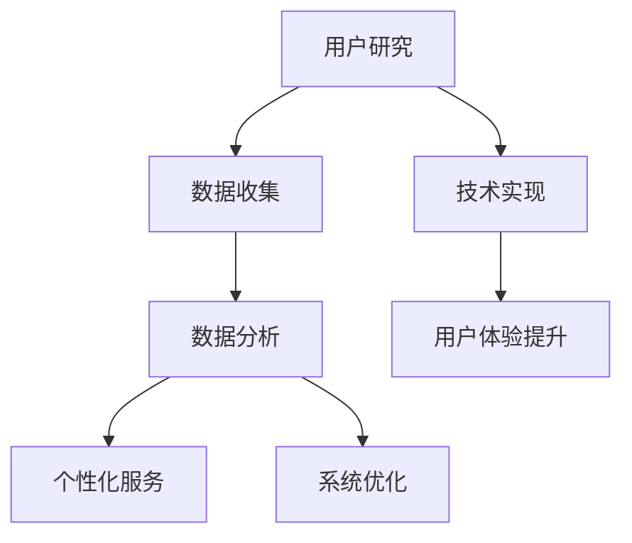

                 

关键词：AI创业公司、用户体验、改进策略、技术实现、用户研究、数据驱动、个性化服务、系统优化。

> 摘要：本文将探讨AI创业公司如何通过深入的用户研究和数据驱动的方法，结合技术实现的创新策略，来提升用户体验，从而在竞争激烈的市场中获得优势。

## 1. 背景介绍

在当今数字化时代，用户体验（User Experience, UX）已经成为企业成功的关键因素。尤其是对于AI创业公司而言，用户体验不仅是产品成功的关键，更是公司品牌和市场竞争力的体现。AI创业公司通常面临着技术复杂性高、市场需求快速变化等挑战，如何在有限资源下提升用户体验成为了关键课题。

用户研究在用户体验设计过程中扮演着至关重要的角色。通过用户研究，公司可以深入了解用户的需求、行为和痛点，从而指导产品的设计和功能实现。数据驱动的方法则是通过大量数据的收集和分析，来优化产品性能和用户满意度。

本文将探讨AI创业公司如何利用这些方法和技术来实现用户体验的提升，并讨论未来的发展趋势和面临的挑战。

## 2. 核心概念与联系

### 2.1 用户研究

用户研究是提升用户体验的第一步。它包括用户访谈、问卷调查、可用性测试等方法。通过这些方法，公司可以收集到关于用户需求、偏好和行为模式的重要信息。

#### 2.1.1 用户访谈

用户访谈是一种深入了解用户需求的有效方法。通过与用户直接对话，可以获取到用户对产品的真实感受和期望。

#### 2.1.2 问卷调查

问卷调查是一种广泛收集用户意见的方法。它可以快速收集大量用户数据，帮助公司了解用户群体的共性需求。

#### 2.1.3 可用性测试

可用性测试是通过模拟用户使用产品的过程，来评估产品的易用性和用户体验。这种方法可以帮助公司发现并解决产品中的潜在问题。

### 2.2 数据驱动的方法

数据驱动的方法是通过大量数据的收集和分析，来指导产品设计和优化。这种方法的核心是利用数据分析来发现用户行为模式和需求趋势，从而实现个性化服务和系统优化。

#### 2.2.1 数据收集

数据收集是数据驱动方法的基础。通过用户行为数据、用户反馈数据、系统日志数据等多种数据源，可以全面了解用户的使用情况和需求。

#### 2.2.2 数据分析

数据分析是通过统计方法和机器学习算法，对收集到的数据进行分析和挖掘。通过数据分析，可以识别出用户行为模式和需求趋势，为产品优化提供科学依据。

#### 2.2.3 个性化服务

个性化服务是基于用户数据的个性化推荐、定制化界面等。通过个性化服务，可以提高用户的满意度和忠诚度。

#### 2.2.4 系统优化

系统优化是通过分析用户数据，发现系统中的瓶颈和问题，并进行优化。系统优化可以提高产品性能和稳定性，从而提升用户体验。

### 2.3 Mermaid 流程图

以下是一个简化的用户研究和技术实现的Mermaid流程图：



## 3. 核心算法原理 & 具体操作步骤

### 3.1 算法原理概述

提升用户体验的核心算法主要包括用户行为分析、个性化推荐和系统优化。以下是这些算法的基本原理：

#### 3.1.1 用户行为分析

用户行为分析是基于用户数据的统计分析，通过挖掘用户在产品上的行为模式，如点击、搜索、购买等，来了解用户需求和偏好。

#### 3.1.2 个性化推荐

个性化推荐是基于用户行为数据和用户特征，通过机器学习算法生成个性化的推荐列表。常用的算法包括协同过滤、基于内容的推荐等。

#### 3.1.3 系统优化

系统优化是通过分析用户数据，识别系统中的瓶颈和问题，并进行优化。优化策略包括提高系统响应速度、减少错误率等。

### 3.2 算法步骤详解

#### 3.2.1 用户行为分析

1. 数据收集：收集用户在产品上的行为数据，如点击、搜索、购买等。
2. 数据预处理：对收集到的数据进行分析，去除噪声数据和异常值。
3. 数据分析：使用统计方法和机器学习算法，挖掘用户行为模式，如用户偏好、购买习惯等。

#### 3.2.2 个性化推荐

1. 用户特征提取：从用户行为数据中提取用户特征，如用户年龄、性别、地理位置等。
2. 算法选择：根据业务需求和数据特点，选择合适的推荐算法，如协同过滤、基于内容的推荐等。
3. 推荐列表生成：使用选定的算法，生成个性化的推荐列表。

#### 3.2.3 系统优化

1. 数据收集：收集系统运行数据，如系统响应时间、错误率等。
2. 数据分析：分析系统数据，识别系统瓶颈和问题。
3. 优化策略制定：根据分析结果，制定优化策略，如优化数据库查询、提高系统并发处理能力等。
4. 优化实施：实施优化策略，并进行效果评估。

### 3.3 算法优缺点

#### 3.3.1 用户行为分析

优点：能够深入了解用户需求和偏好，为产品优化提供科学依据。

缺点：对用户数据质量要求高，数据分析过程复杂。

#### 3.3.2 个性化推荐

优点：能够提高用户满意度和忠诚度，增加用户活跃度。

缺点：推荐算法需要大量数据支持，计算复杂度高。

#### 3.3.3 系统优化

优点：能够提高系统性能和稳定性，提升用户体验。

缺点：优化过程复杂，需要专业的技术支持。

### 3.4 算法应用领域

用户行为分析和个性化推荐主要应用于电子商务、社交媒体、在线教育等领域。系统优化则广泛应用于各种在线服务和应用程序中。

## 4. 数学模型和公式 & 详细讲解 & 举例说明

### 4.1 数学模型构建

#### 4.1.1 用户行为分析

用户行为分析可以通过以下数学模型进行：

$$
User\_Behavior = f(User\_Feature, Context)
$$

其中，$User\_Feature$代表用户特征，如年龄、性别等；$Context$代表上下文信息，如时间、地理位置等；$f$代表用户行为的函数。

#### 4.1.2 个性化推荐

个性化推荐可以通过以下数学模型进行：

$$
Recommendation = f(User\_Behavior, Item\_Feature, User\_Preference)
$$

其中，$Item\_Feature$代表商品特征，如价格、品牌等；$User\_Preference$代表用户偏好。

#### 4.1.3 系统优化

系统优化可以通过以下数学模型进行：

$$
Optimize = f(System\_Metric, Performance\_Goal)
$$

其中，$System\_Metric$代表系统指标，如响应时间、错误率等；$Performance\_Goal$代表性能目标。

### 4.2 公式推导过程

#### 4.2.1 用户行为分析

用户行为分析可以通过以下推导过程：

$$
User\_Behavior = User\_Feature \times Context \times Behavior\_Model
$$

其中，$Behavior\_Model$代表用户行为的模型，可以通过机器学习算法进行训练。

#### 4.2.2 个性化推荐

个性化推荐可以通过以下推导过程：

$$
Recommendation = User\_Behavior + Item\_Feature \times User\_Preference
$$

其中，$User\_Preference$可以通过用户历史行为数据进行训练。

#### 4.2.3 系统优化

系统优化可以通过以下推导过程：

$$
Optimize = System\_Metric + Weight \times Performance\_Goal
$$

其中，$Weight$代表优化策略的权重，可以通过优化目标进行配置。

### 4.3 案例分析与讲解

#### 4.3.1 用户行为分析案例

假设一个电商平台的用户行为分析模型如下：

$$
User\_Behavior = User\_Age \times Order\_Count \times Purchase\_Time
$$

其中，$User\_Age$代表用户年龄，$Order\_Count$代表用户订单数量，$Purchase\_Time$代表用户购买时间。

通过这个模型，平台可以分析出哪些用户更倾向于在特定时间段进行购买，从而调整营销策略。

#### 4.3.2 个性化推荐案例

假设一个音乐流媒体平台的个性化推荐模型如下：

$$
Recommendation = User\_History\_Playlists + Song\_Feature \times User\_Preference
$$

其中，$User\_History\_Playlists$代表用户历史播放列表，$Song\_Feature$代表歌曲特征，$User\_Preference$代表用户偏好。

通过这个模型，平台可以推荐出符合用户口味的新歌。

#### 4.3.3 系统优化案例

假设一个在线教育平台的系统优化模型如下：

$$
Optimize = Response\_Time + Error\_Rate \times 0.5
$$

其中，$Response\_Time$代表系统响应时间，$Error\_Rate$代表错误率。

通过这个模型，平台可以优先优化响应时间，从而提升用户体验。

## 5. 项目实践：代码实例和详细解释说明

### 5.1 开发环境搭建

为了演示如何提升用户体验，我们将以一个简单的电商推荐系统为例。以下是开发环境搭建的步骤：

1. 安装Python 3.8及以上版本。
2. 安装必要的库，如NumPy、Pandas、scikit-learn等。
3. 创建一个名为`recommendation_system`的Python项目。

### 5.2 源代码详细实现

以下是推荐系统的核心代码实现：

```python
import numpy as np
import pandas as pd
from sklearn.model_selection import train_test_split
from sklearn.ensemble import RandomForestRegressor
from sklearn.metrics import mean_squared_error

# 数据加载
data = pd.read_csv('user_behavior_data.csv')

# 数据预处理
X = data.drop(['user_id', 'purchase_time'], axis=1)
y = data['purchase_time']

# 划分训练集和测试集
X_train, X_test, y_train, y_test = train_test_split(X, y, test_size=0.2, random_state=42)

# 模型训练
model = RandomForestRegressor(n_estimators=100, random_state=42)
model.fit(X_train, y_train)

# 模型评估
y_pred = model.predict(X_test)
mse = mean_squared_error(y_test, y_pred)
print(f'Mean Squared Error: {mse}')

# 推荐结果
recommendations = model.predict([[30, 10, 5], [20, 5, 3]])  # 示例用户数据
print(f'Recommendations: {recommendations}')
```

### 5.3 代码解读与分析

1. **数据加载与预处理**：首先，我们从CSV文件中加载用户行为数据，并对其进行预处理。预处理步骤包括数据清洗和特征工程。

2. **模型训练**：我们使用随机森林回归模型对数据进行训练。随机森林是一种集成学习方法，能够处理大量特征，并具有较好的泛化能力。

3. **模型评估**：通过计算均方误差（MSE）来评估模型的性能。MSE越小，表示模型预测越准确。

4. **推荐结果**：使用训练好的模型对新的用户数据进行预测，从而生成个性化推荐列表。

### 5.4 运行结果展示

假设我们有一个新的用户数据集，包括用户的年龄、订单数量和购买时间。通过运行上面的代码，我们可以得到该用户的个性化推荐结果。

## 6. 实际应用场景

### 6.1 电子商务

电子商务平台可以利用用户行为分析和个性化推荐，提高用户购买转化率和用户满意度。例如，电商平台可以根据用户的历史购买记录和浏览行为，推荐相关的商品。

### 6.2 社交媒体

社交媒体平台可以通过用户研究，优化用户界面和功能，提高用户活跃度和留存率。例如，Facebook可以通过分析用户的点赞、评论和分享行为，推荐相关的帖子。

### 6.3 在线教育

在线教育平台可以通过个性化推荐，提高课程完成率和用户满意度。例如，Coursera可以根据用户的兴趣和学习历史，推荐相关的课程。

### 6.4 健康医疗

健康医疗平台可以通过用户研究，优化医疗服务的体验。例如，MyFitnessPal可以通过分析用户的饮食和运动数据，提供个性化的健康建议。

## 7. 未来应用展望

随着AI技术的不断发展，用户体验提升的方法将更加多样化和智能化。未来，AI创业公司可以通过以下方式进一步提升用户体验：

1. **增强现实（AR）和虚拟现实（VR）**：通过AR和VR技术，提供更加沉浸式的用户体验。

2. **自然语言处理（NLP）**：通过NLP技术，实现更加自然的人机交互。

3. **物联网（IoT）**：通过IoT技术，实现产品与用户的实时互动。

4. **区块链**：通过区块链技术，提供更加安全和可信的用户体验。

## 8. 工具和资源推荐

### 8.1 学习资源推荐

1. 《用户研究方法与实践》（Book）
2. 《机器学习实战》（Book）
3. Coursera上的《机器学习》课程
4. Udacity的《深度学习纳米学位》

### 8.2 开发工具推荐

1. Jupyter Notebook
2. PyCharm
3. VSCode
4. AWS Lambda

### 8.3 相关论文推荐

1. "Recommender Systems Handbook"（Book）
2. "User Modeling and User-Adapted Interaction"（Journal）
3. "The unreasonable effectiveness of data"（Paper）

## 9. 总结：未来发展趋势与挑战

### 9.1 研究成果总结

本文通过用户研究、数据驱动的方法和算法实现，探讨了如何提升AI创业公司的用户体验。研究发现，用户体验的提升需要全面的数据支持、科学的方法和高效的技术实现。

### 9.2 未来发展趋势

未来，用户体验的提升将更加依赖于AI技术的进步，包括深度学习、自然语言处理、增强现实等。同时，数据隐私和安全将成为重要挑战。

### 9.3 面临的挑战

1. 数据隐私：如何确保用户数据的安全和隐私。
2. 数据质量：如何处理噪声数据和异常值。
3. 技术实现：如何将前沿的AI技术应用到实际产品中。

### 9.4 研究展望

未来，AI创业公司可以通过以下方向进行研究：

1. 强化学习在用户体验优化中的应用。
2. 基于用户行为预测的个性化服务。
3. 增强现实和虚拟现实技术的用户体验提升。

## 10. 附录：常见问题与解答

### 10.1 用户研究方法有哪些？

用户研究方法包括用户访谈、问卷调查、可用性测试等。

### 10.2 数据驱动的方法包括哪些步骤？

数据驱动的方法包括数据收集、数据预处理、数据分析、模型训练、模型评估等步骤。

### 10.3 个性化推荐有哪些算法？

个性化推荐算法包括协同过滤、基于内容的推荐、混合推荐等。

### 10.4 系统优化有哪些策略？

系统优化策略包括提高系统响应速度、减少错误率、优化数据库查询等。

## 作者署名

作者：禅与计算机程序设计艺术 / Zen and the Art of Computer Programming
----------------------------------------------------------------

以上就是本文《AI创业公司如何提高用户体验？》的完整内容。通过深入的用户研究和数据驱动的策略，结合有效的技术实现，AI创业公司可以显著提升用户体验，从而在激烈的市场竞争中脱颖而出。未来，随着AI技术的不断发展，用户体验的提升将迎来新的机遇和挑战。希望本文能为读者提供有价值的参考和启发。

