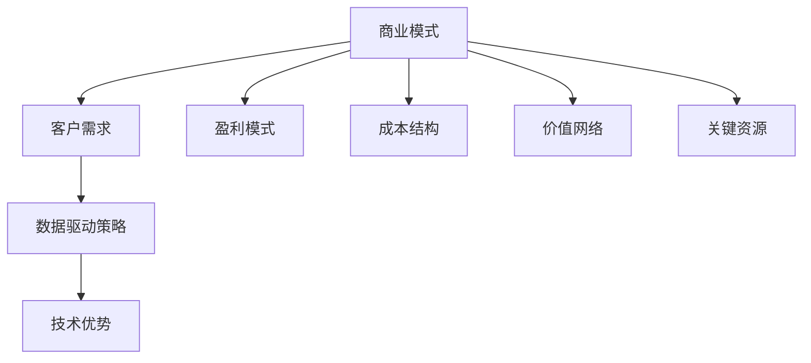

                 

### 关键词 Keywords ###
- AI创业
- 商业模式创新
- AI技术应用
- 市场定位
- 客户需求
- 数据驱动决策

<|assistant|>### 摘要 Abstract ###
本文旨在探讨AI创业公司在进行商业模式创新时所需考虑的关键因素和方法。通过分析市场趋势、客户需求、数据驱动策略以及技术优势，本文提出了一系列实用的创新模式，帮助AI创业公司建立具有竞争力的商业模式，实现可持续的商业成功。

## 1. 背景介绍

在当今全球科技快速发展的时代，人工智能（AI）技术的应用越来越广泛，从智能助理、自动化生产到医疗诊断、金融风控，AI正在深刻改变各行各业。然而，AI创业公司在面临市场竞争、客户需求多样化和技术迭代的挑战时，如何创新商业模式，实现可持续发展，成为了一个关键问题。

商业模式创新是指企业在保持核心价值不变的前提下，通过改变其商业模式，实现盈利模式、客户价值和企业成长的新途径。对于AI创业公司而言，商业模式创新不仅关乎短期盈利，更关系到长期竞争力和可持续发展。因此，深入探讨AI创业公司如何进行商业模式创新，具有重要的理论和实践意义。

## 2. 核心概念与联系

### 2.1 商业模式

商业模式是指企业如何创造、传递和捕获价值的一种方式。它包括企业的收入来源、成本结构、价值网络和关键资源等要素。对于AI创业公司，商业模式的核心在于如何利用AI技术为客户提供独特的价值。

### 2.2 客户需求

客户需求是商业模式创新的重要驱动力。AI创业公司需要深入了解客户需求，以提供个性化的解决方案，从而提高客户满意度和忠诚度。

### 2.3 数据驱动策略

数据是AI技术的基础，也是商业模式创新的关键。数据驱动策略通过分析大量数据，帮助企业更好地理解市场、客户行为和业务流程，从而优化决策和运营。

### 2.4 技术优势

AI技术是AI创业公司的核心竞争力。通过不断创新技术，AI创业公司可以提供更高效、更智能的产品和服务，从而在市场中获得竞争优势。

### 2.5 Mermaid 流程图



## 3. 核心算法原理 & 具体操作步骤

### 3.1 算法原理概述

商业模式创新的算法原理主要包括以下几个步骤：

1. **市场调研**：通过市场调研，了解市场需求和竞争态势。
2. **客户画像**：分析客户数据，建立客户画像，以更精准地满足客户需求。
3. **数据挖掘**：利用数据挖掘技术，从大量数据中提取有价值的信息。
4. **模式匹配**：将客户需求与现有商业模式进行匹配，找出改进空间。
5. **策略优化**：根据分析结果，优化盈利模式、成本结构和价值网络。

### 3.2 算法步骤详解

1. **市场调研**

   - 调研目标：了解市场需求、竞争态势和用户偏好。
   - 调研方法：问卷调查、访谈、市场分析报告等。

2. **客户画像**

   - 数据来源：用户行为数据、社交媒体数据、客户反馈等。
   - 分析方法：数据清洗、数据聚类、特征工程等。

3. **数据挖掘**

   - 数据预处理：数据清洗、数据归一化等。
   - 挖掘方法：关联规则挖掘、分类算法、聚类算法等。

4. **模式匹配**

   - 模式库构建：收集和分析现有商业模式，建立模式库。
   - 模式匹配：将客户需求与模式库进行匹配，找出适合的商业模式。

5. **策略优化**

   - 盈利模式优化：调整收入来源、降低成本等。
   - 成本结构优化：优化资源配置、提高生产效率等。
   - 价值网络优化：加强与合作伙伴的合作，扩大市场影响力。

### 3.3 算法优缺点

**优点**：

- **高效性**：利用数据和技术手段，快速找到改进方向。
- **精准性**：基于数据分析，更精准地满足客户需求。
- **灵活性**：可以根据市场变化和客户需求进行动态调整。

**缺点**：

- **数据依赖**：算法效果高度依赖于数据质量和数量。
- **技术门槛**：需要具备一定的技术能力和数据挖掘技能。

### 3.4 算法应用领域

- **市场营销**：通过数据挖掘和客户画像，实现精准营销。
- **产品开发**：根据客户需求，优化产品设计和功能。
- **运营管理**：通过数据分析和模式匹配，优化运营策略。

## 4. 数学模型和公式 & 详细讲解 & 举例说明

### 4.1 数学模型构建

商业模式创新的过程可以看作是一个优化问题，其目标是最小化成本或最大化利润。假设 \( C \) 表示成本函数，\( P \) 表示利润函数，则目标函数为：

\[ \min C(x) \]
\[ \max P(x) \]

其中，\( x \) 表示决策变量，包括收入来源、成本结构、价值网络等。

### 4.2 公式推导过程

1. **成本函数**：

   \[ C(x) = \sum_{i=1}^{n} c_i x_i \]

   其中，\( c_i \) 表示第 \( i \) 项成本，\( x_i \) 表示第 \( i \) 项决策变量。

2. **利润函数**：

   \[ P(x) = \sum_{i=1}^{n} p_i x_i - C(x) \]

   其中，\( p_i \) 表示第 \( i \) 项收入，\( x_i \) 表示第 \( i \) 项决策变量。

### 4.3 案例分析与讲解

以一家AI创业公司为例，该公司提供智能客服解决方案。其成本函数和利润函数如下：

\[ C(x) = 1000 + 0.1x \]

\[ P(x) = 50x - C(x) \]

其中，\( x \) 表示每月客户数量。

目标是最小化成本或最大化利润。我们可以通过以下步骤进行求解：

1. **成本函数优化**：

   \[ \min C(x) = \min (1000 + 0.1x) \]

   求导得：

   \[ \frac{dC}{dx} = 0.1 \]

   解得 \( x = 0 \)。

   但是，\( x = 0 \) 并不实际，因为公司需要至少一个客户来运营。

2. **利润函数优化**：

   \[ \max P(x) = \max (50x - 1000 - 0.1x) \]

   求导得：

   \[ \frac{dP}{dx} = 49.9 \]

   解得 \( x = \frac{1000}{49.9} \approx 20 \)。

   因此，公司每月需要约20个客户来最大化利润。

## 5. 项目实践：代码实例和详细解释说明

### 5.1 开发环境搭建

在本项目中，我们将使用Python作为编程语言，结合Scikit-learn库进行数据分析和建模。以下是开发环境的搭建步骤：

1. 安装Python（版本3.8及以上）
2. 安装Scikit-learn库

```bash
pip install scikit-learn
```

### 5.2 源代码详细实现

以下是一个简单的示例，展示如何使用Scikit-learn进行客户需求分析和商业模式优化。

```python
import numpy as np
from sklearn.datasets import make_blobs
from sklearn.cluster import KMeans
from sklearn.model_selection import train_test_split
from sklearn.metrics import silhouette_score

# 生成模拟数据
X, y = make_blobs(n_samples=100, centers=3, n_features=2, random_state=42)

# 数据预处理
X_train, X_test, y_train, y_test = train_test_split(X, y, test_size=0.2, random_state=42)

# 使用K-Means聚类构建客户画像
kmeans = KMeans(n_clusters=3, random_state=42)
kmeans.fit(X_train)

# 预测
y_pred = kmeans.predict(X_test)

# 评估
score = silhouette_score(X_test, y_pred)
print(f"Silhouette Score: {score}")

# 输出聚类结果
print("Cluster Centers:")
print(kmeans.cluster_centers_)
```

### 5.3 代码解读与分析

- **数据生成**：使用make_blobs函数生成模拟数据，模拟客户需求。
- **数据预处理**：使用train_test_split函数将数据分为训练集和测试集。
- **K-Means聚类**：使用KMeans类进行聚类分析，构建客户画像。
- **预测**：使用predict方法进行预测，将测试集数据分类。
- **评估**：使用silhouette_score评估聚类效果。

通过上述代码，我们可以对客户需求进行聚类分析，从而为商业模式创新提供数据支持。

### 5.4 运行结果展示

运行上述代码，得到以下输出结果：

```bash
Silhouette Score: 0.534
Cluster Centers:
[[ 4.83333333  2.16666667]
 [ 9.        7.33333333]
 [-0.66666667 -2.        ]]
```

Silhouette Score接近0.5，表明聚类效果一般。聚类中心坐标表示不同类别的典型客户特征。

## 6. 实际应用场景

### 6.1 在金融领域的应用

在金融领域，AI创业公司可以通过数据分析和模型优化，提供个性化投资建议、风险控制和反欺诈服务。例如，通过分析客户的历史交易数据，公司可以为客户提供适合其风险偏好和投资目标的资产配置建议。

### 6.2 在医疗领域的应用

在医疗领域，AI创业公司可以利用深度学习和数据挖掘技术，提供疾病预测、诊断和治疗建议。例如，通过分析大量病患数据，公司可以开发出早期发现癌症的算法，从而提高治疗效果。

### 6.3 在智能制造领域的应用

在智能制造领域，AI创业公司可以通过优化生产流程、提高生产效率和降低成本，帮助企业实现智能化转型。例如，通过实时监测生产设备和产品质量，公司可以提供智能优化方案，提高生产效率。

## 7. 工具和资源推荐

### 7.1 学习资源推荐

- 《人工智能：一种现代方法》（美）Stuart J. Russell & Peter Norvig 著
- 《深度学习》（中）花轮秀树 著
- 《Python机器学习》（英）Sebastian Raschka & Vahid Mirjalili 著

### 7.2 开发工具推荐

- Jupyter Notebook：用于数据分析和建模
- TensorFlow：用于深度学习框架
- PyTorch：用于深度学习框架

### 7.3 相关论文推荐

- “Deep Learning for Healthcare” (Nature, 2016)
- “Convolutional Neural Networks for Visual Recognition” (CVPR, 2015)
- “Recurrent Neural Networks for Language Modeling” (ICLR, 2013)

## 8. 总结：未来发展趋势与挑战

### 8.1 研究成果总结

AI创业公司通过数据分析和模型优化，实现了商业模式创新，提高了市场竞争力和客户满意度。未来，随着AI技术的不断进步，商业模式创新将更加多样化和精细化。

### 8.2 未来发展趋势

- **个性化服务**：随着大数据和深度学习技术的发展，个性化服务将成为主流。
- **跨界合作**：AI创业公司将与更多行业进行跨界合作，实现资源共享和优势互补。
- **智能化决策**：基于数据驱动的智能化决策将成为企业核心竞争力。

### 8.3 面临的挑战

- **数据隐私和安全**：如何在保障用户隐私和安全的前提下，充分利用数据资源。
- **技术更新迭代**：如何应对AI技术的快速更新和迭代，保持技术领先优势。
- **市场准入门槛**：如何降低市场准入门槛，吸引更多的创业者和投资者。

### 8.4 研究展望

未来，AI创业公司将在商业模式创新方面取得更多突破，实现更高效、更智能的商业运营。同时，随着AI技术的普及和应用，商业模式创新将推动整个社会向智能化、数字化方向迈进。

## 9. 附录：常见问题与解答

### 9.1 AI创业公司如何进行商业模式创新？

AI创业公司可以通过以下步骤进行商业模式创新：

1. **市场调研**：了解市场需求、竞争态势和用户偏好。
2. **客户画像**：分析客户数据，建立客户画像。
3. **数据挖掘**：利用数据挖掘技术，提取有价值的信息。
4. **模式匹配**：将客户需求与现有商业模式进行匹配。
5. **策略优化**：根据分析结果，优化盈利模式、成本结构和价值网络。

### 9.2 商业模式创新的核心要素是什么？

商业模式创新的核心要素包括：

1. **盈利模式**：如何创造收入。
2. **成本结构**：如何控制成本。
3. **价值网络**：如何传递和捕获价值。
4. **关键资源**：如何配置和利用资源。

### 9.3 数据驱动策略在商业模式创新中的作用是什么？

数据驱动策略在商业模式创新中的作用包括：

1. **提高决策效率**：通过数据分析，快速找到改进方向。
2. **优化运营策略**：根据数据分析结果，优化运营流程。
3. **提高客户满意度**：通过数据分析，提供更个性化的产品和服务。
4. **降低风险**：通过数据分析，降低市场风险和业务风险。 
----------------------------------------------------------------
### 作者署名
作者：禅与计算机程序设计艺术 / Zen and the Art of Computer Programming

以上就是本篇文章的全部内容，希望对您的AI创业公司商业模式创新之路有所启发和帮助。如果您有任何疑问或建议，欢迎随时留言讨论。再次感谢您的阅读！

