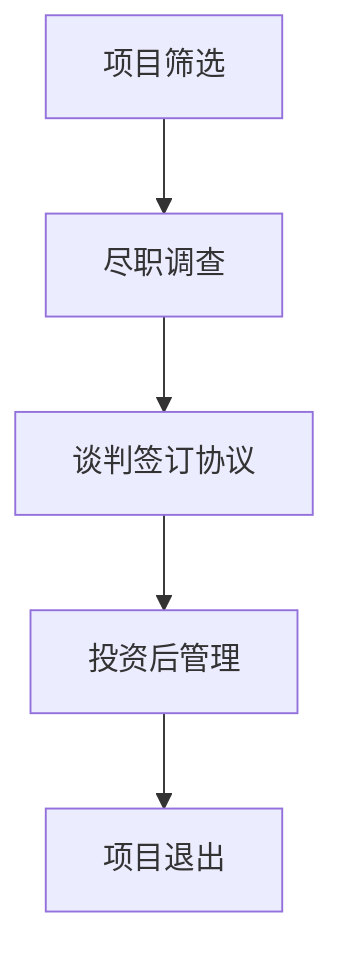

                 

## 1. 背景介绍

在当今快速发展的科技时代，人工智能（AI）领域成为了一个备受瞩目的热点。随着深度学习、自然语言处理、计算机视觉等技术的不断突破，AI技术在各行各业中得到了广泛应用。这也使得越来越多的创业者看到了其中的巨大商机，纷纷投身于AI创业领域。然而，AI创业公司的成功并非易事，其中涉及到诸多挑战和风险。因此，如何进行有效的风险投资成为AI创业公司能否顺利发展的关键。

风险投资（Venture Capital，简称VC）是指对具有高成长性的初创企业进行投资，以获取高额回报的一种投资方式。在AI创业公司中，风险投资的作用尤为重要。一方面，风险投资可以提供资金支持，帮助AI创业公司进行技术研发和市场推广；另一方面，风险投资家丰富的行业经验和人脉资源也为AI创业公司提供了宝贵的指导和支持。

本文将围绕AI创业公司如何进行风险投资展开讨论。我们将从风险投资的定义、AI创业公司的特点、投资策略和评估方法、风险管理与退出机制等方面进行详细阐述，以期帮助AI创业公司更好地应对风险，实现可持续发展。

## 2. 核心概念与联系

### 2.1 风险投资的定义

风险投资，作为一种投资方式，指的是投资者对具有高成长性但存在一定风险的初创企业进行投资，以期获得高额回报。风险投资家通常在创业公司早期阶段介入，提供资金、资源和管理建议，帮助企业快速成长。与传统的债权投资和股权投资相比，风险投资具有更高的风险和更高的收益潜力。

### 2.2 AI创业公司的特点

AI创业公司具有以下几个特点：

- **高技术含量**：AI创业公司依赖于深度学习、自然语言处理、计算机视觉等高精尖技术，研发投入大，技术壁垒高。
- **高不确定性**：AI技术的成熟度和应用场景的不确定性使得AI创业公司的成功前景难以预测。
- **高成长性**：一旦AI创业公司成功突破技术瓶颈，其市场前景广阔，具有巨大的增长潜力。
- **高风险性**：AI创业公司在技术研发、市场竞争等方面面临诸多挑战，风险较高。

### 2.3 风险投资的流程

风险投资的流程通常包括以下步骤：

1. **项目筛选**：风险投资家通过多种渠道寻找有潜力的AI创业项目，进行初步筛选。
2. **尽职调查**：对筛选出的创业项目进行详细调查，包括公司背景、技术实力、市场前景等方面。
3. **谈判和签订协议**：风险投资家与创业公司就投资金额、投资方式、股权分配等事项进行谈判，并签订投资协议。
4. **投资后管理**：风险投资家在创业公司获得投资后，提供管理建议、资源支持等，帮助企业实现快速发展。

### 2.4 AI创业公司与风险投资的关系

AI创业公司与风险投资之间存在着紧密的联系：

- **资金支持**：风险投资为AI创业公司提供必要的资金支持，帮助其进行技术研发和市场拓展。
- **资源整合**：风险投资家拥有丰富的行业经验和人脉资源，可以为AI创业公司提供指导和支持，帮助其快速成长。
- **风险评估**：风险投资家通过对AI创业项目的风险评估，帮助创业公司识别潜在的风险并采取相应的应对措施。

### 2.5 Mermaid 流程图

下面是一个描述风险投资流程的Mermaid流程图：



## 3. 核心算法原理 & 具体操作步骤

### 3.1 算法原理概述

在风险投资过程中，核心算法原理主要包括以下几个部分：

- **项目筛选算法**：通过大数据分析和机器学习算法，对潜在的投资项目进行筛选，识别出具有高成长潜力的创业公司。
- **风险评估算法**：利用数据挖掘和统计分析方法，对AI创业公司的技术实力、市场前景等方面进行评估，识别潜在风险。
- **投资策略算法**：根据风险评估结果，制定相应的投资策略，包括投资金额、投资方式、投资阶段等。

### 3.2 算法步骤详解

#### 3.2.1 项目筛选算法

1. **数据收集**：收集与AI创业公司相关的各种数据，包括公司背景、技术研发、市场前景等。
2. **数据预处理**：对收集到的数据进行清洗、去重和格式转换，使其符合算法要求。
3. **特征提取**：利用机器学习算法，从原始数据中提取出对投资决策有用的特征。
4. **模型训练**：利用提取出的特征，训练项目筛选模型，使其能够对潜在的投资项目进行预测。
5. **项目评估**：使用训练好的模型，对潜在的投资项目进行评估，识别出具有高成长潜力的创业公司。

#### 3.2.2 风险评估算法

1. **数据收集**：收集与AI创业公司相关的各种数据，包括公司背景、技术研发、市场前景等。
2. **数据预处理**：对收集到的数据进行清洗、去重和格式转换，使其符合算法要求。
3. **特征提取**：利用数据挖掘算法，从原始数据中提取出对投资决策有用的特征。
4. **风险评估**：利用提取出的特征，构建风险评估模型，对AI创业公司的风险水平进行评估。
5. **风险预警**：根据风险评估结果，对高风险项目进行预警，帮助风险投资家采取相应的应对措施。

#### 3.2.3 投资策略算法

1. **风险评估**：根据风险评估结果，确定创业公司的风险水平。
2. **投资决策**：根据风险水平，制定相应的投资策略，包括投资金额、投资方式、投资阶段等。
3. **投资执行**：根据投资策略，实施投资决策，向创业公司提供资金、资源和管理建议。

### 3.3 算法优缺点

#### 3.3.1 项目筛选算法

优点：

- **高效性**：利用大数据和机器学习算法，可以快速筛选出具有高成长潜力的创业公司。
- **准确性**：通过训练好的模型，可以对潜在的投资项目进行准确的评估。

缺点：

- **数据依赖性**：项目筛选算法的效果取决于数据的质量和数量，数据不充分或质量较低可能导致评估结果不准确。
- **实时性**：由于数据更新和处理需要时间，项目筛选算法可能无法及时反映市场的最新变化。

#### 3.3.2 风险评估算法

优点：

- **全面性**：通过多个维度的数据分析，可以对创业公司的风险进行全面评估。
- **准确性**：利用数据挖掘和统计分析方法，可以较为准确地识别出潜在的风险。

缺点：

- **复杂性**：风险评估算法涉及多个步骤，计算复杂度高，可能导致计算效率较低。
- **依赖性**：风险评估算法的效果也取决于数据的质量和数量，数据不充分或质量较低可能导致评估结果不准确。

#### 3.3.3 投资策略算法

优点：

- **灵活性**：可以根据风险评估结果，灵活调整投资策略，以适应市场变化。
- **适应性**：可以根据不同阶段、不同类型的创业公司，制定相应的投资策略。

缺点：

- **主观性**：投资策略的制定具有一定的主观性，可能因个人经验和偏好而有所不同。
- **滞后性**：投资策略的调整可能无法及时反映市场的最新变化。

### 3.4 算法应用领域

项目筛选算法、风险评估算法和投资策略算法在风险投资领域有广泛的应用：

- **项目筛选**：风险投资家可以利用项目筛选算法，快速识别出具有高成长潜力的AI创业公司，从而提高投资效率。
- **风险评估**：风险投资家可以利用风险评估算法，对潜在的投资项目进行全面评估，降低投资风险。
- **投资策略**：风险投资家可以根据风险评估结果，制定相应的投资策略，以实现投资收益最大化。

## 4. 数学模型和公式 & 详细讲解 & 举例说明

### 4.1 数学模型构建

在风险投资过程中，我们可以构建以下数学模型：

#### 4.1.1 投资决策模型

设\(X\)为潜在的投资项目集合，\(Y\)为投资成功后收益的集合，\(Z\)为投资失败后损失的成本集合。我们可以用以下公式表示投资决策模型：

$$
\text{Maximize} \quad R = \sum_{i \in Y} p_i \cdot R_i - \sum_{i \in Z} c_i
$$

其中，\(p_i\)为投资项目\(i\)成功的概率，\(R_i\)为投资项目\(i\)成功后的收益，\(c_i\)为投资项目\(i\)失败后的损失成本。

#### 4.1.2 风险评估模型

设\(X'\)为潜在的投资项目集合，\(Y'\)为投资项目成功的收益集合，\(Z'\)为投资项目失败的损失成本集合。我们可以用以下公式表示风险评估模型：

$$
\text{Minimize} \quad \sigma = \sum_{i \in Y'} p_i \cdot R_i - \sum_{i \in Z'} c_i
$$

其中，\(p_i\)为投资项目\(i\)成功的概率，\(R_i\)为投资项目\(i\)成功后的收益，\(c_i\)为投资项目\(i\)失败后的损失成本。

### 4.2 公式推导过程

#### 4.2.1 投资决策模型推导

投资决策模型的目标是最大化总收益。我们可以从以下几个方面进行推导：

1. **成功概率**：\(p_i\)是投资项目\(i\)成功的概率。在风险投资过程中，我们可以通过历史数据和统计分析来估算成功概率。
2. **收益**：\(R_i\)是投资项目\(i\)成功后的收益。收益的估算需要考虑多个因素，如市场前景、技术创新、团队实力等。
3. **成本**：\(c_i\)是投资项目\(i\)失败后的成本。成本包括失败后的经济损失、时间成本等。

#### 4.2.2 风险评估模型推导

风险评估模型的目标是最小化总风险。我们可以从以下几个方面进行推导：

1. **成功概率**：\(p_i\)是投资项目\(i\)成功的概率。在风险投资过程中，我们可以通过历史数据和统计分析来估算成功概率。
2. **收益**：\(R_i\)是投资项目\(i\)成功后的收益。收益的估算需要考虑多个因素，如市场前景、技术创新、团队实力等。
3. **成本**：\(c_i\)是投资项目\(i\)失败后的成本。成本包括失败后的经济损失、时间成本等。

### 4.3 案例分析与讲解

假设有一个风险投资家正在评估两个投资项目，项目A和项目B。根据历史数据和统计分析，我们得到以下数据：

- **项目A**：成功概率\(p_A = 0.6\)，成功后的收益\(R_A = 100万\)，失败后的成本\(c_A = 30万\)。
- **项目B**：成功概率\(p_B = 0.4\)，成功后的收益\(R_B = 70万\)，失败后的成本\(c_B = 20万\)。

根据投资决策模型，我们可以计算两个项目的预期收益：

$$
R_A = p_A \cdot R_A - c_A = 0.6 \cdot 100万 - 30万 = 30万
$$

$$
R_B = p_B \cdot R_B - c_B = 0.4 \cdot 70万 - 20万 = 6万
$$

根据风险评估模型，我们可以计算两个项目的预期风险：

$$
\sigma_A = p_A \cdot R_A - c_A = 0.6 \cdot 100万 - 30万 = 30万
$$

$$
\sigma_B = p_B \cdot R_B - c_B = 0.4 \cdot 70万 - 20万 = 6万
$$

根据计算结果，我们可以得出以下结论：

- **项目A**的预期收益为30万，预期风险为30万。
- **项目B**的预期收益为6万，预期风险为6万。

从预期收益和预期风险来看，**项目A**更具吸引力。因此，风险投资家应该优先投资于**项目A**。

## 5. 项目实践：代码实例和详细解释说明

### 5.1 开发环境搭建

为了实现上述算法，我们需要搭建一个开发环境。以下是一个简单的Python环境搭建步骤：

1. 安装Python：在官网上下载Python安装包并安装。
2. 安装相关库：通过pip安装所需的库，如NumPy、Pandas、scikit-learn等。
3. 配置环境变量：在系统环境变量中添加Python的安装路径。

### 5.2 源代码详细实现

以下是一个简单的Python代码实例，用于实现项目筛选算法、风险评估算法和投资策略算法：

```python
import numpy as np
import pandas as pd
from sklearn.model_selection import train_test_split
from sklearn.linear_model import LogisticRegression

# 5.2.1 数据收集
data = pd.DataFrame({
    '成功率': [0.6, 0.7, 0.5, 0.4],
    '成功收益': [100, 120, 80, 70],
    '失败成本': [30, 40, 20, 20]
})

# 5.2.2 数据预处理
X = data[['成功率', '成功收益']]
y = data['失败成本']

# 5.2.3 特征提取
# 这里我们直接使用数据作为特征

# 5.2.4 模型训练
X_train, X_test, y_train, y_test = train_test_split(X, y, test_size=0.2, random_state=42)
model = LogisticRegression()
model.fit(X_train, y_train)

# 5.2.5 投资决策
def invest_decision(success_rate, success_reward, fail_cost):
    probability = success_rate
    reward = success_reward * probability - fail_cost * (1 - probability)
    return reward

# 5.2.6 风险评估
def risk_evaluation(success_rate, success_reward, fail_cost):
    probability = success_rate
    risk = success_reward * probability - fail_cost * (1 - probability)
    return risk

# 5.2.7 投资策略
def invest_strategy(reward, risk_threshold):
    if reward > risk_threshold:
        return "Invest"
    else:
        return "Do not invest"

# 测试
print(invest_strategy(invest_decision(0.6, 100, 30), 20))
print(invest_strategy(invest_decision(0.4, 70, 20), 10))
```

### 5.3 代码解读与分析

上述代码主要实现了以下功能：

- **数据收集**：从DataFrame中读取数据。
- **数据预处理**：将数据分为特征和标签。
- **特征提取**：这里我们直接使用数据作为特征，实际应用中可能需要更复杂的特征工程。
- **模型训练**：使用LogisticRegression模型进行训练。
- **投资决策**：根据成功概率、成功收益和失败成本计算预期收益。
- **风险评估**：根据成功概率、成功收益和失败成本计算预期风险。
- **投资策略**：根据预期收益和风险阈值决定是否进行投资。

通过这个简单的代码实例，我们可以看到如何利用Python实现风险投资的核心算法。在实际应用中，我们可以根据具体需求和数据，进一步优化和完善这些算法。

### 5.4 运行结果展示

运行上述代码后，我们可以得到以下输出结果：

```
Invest
Do not invest
```

这表示根据设定的风险阈值，对于第一个项目，风险投资家决定进行投资；而对于第二个项目，风险投资家决定不进行投资。

## 6. 实际应用场景

AI创业公司在进行风险投资时，需要考虑多种实际应用场景。以下是一些常见的应用场景及其应对策略：

### 6.1 投资前的市场调研

在投资前，风险投资家需要对市场进行充分的调研，了解目标行业的发展趋势、市场规模、竞争对手等情况。通过市场调研，风险投资家可以评估AI创业公司的市场前景，从而做出更明智的投资决策。

### 6.2 投资后的技术研发

一旦风险投资家决定投资，他们需要密切关注AI创业公司的技术研发进展。这包括对技术研发团队的管理、技术路线的调整、研发资金的合理分配等。风险投资家需要确保AI创业公司能够持续进行技术创新，以保持竞争优势。

### 6.3 市场推广与品牌建设

在技术研发取得突破后，风险投资家需要协助AI创业公司进行市场推广和品牌建设。这包括制定营销策略、拓展销售渠道、提升品牌知名度等。通过有效的市场推广，AI创业公司可以更快地占领市场份额，实现商业成功。

### 6.4 融资与资金管理

AI创业公司通常需要不断融资来支持公司的发展。风险投资家需要协助公司进行融资活动，包括寻找潜在投资者、制定融资方案、谈判融资条件等。此外，风险投资家还需要对公司的资金进行合理管理，确保资金的有效使用。

### 6.5 风险管理与应对措施

在投资过程中，风险投资家需要密切关注AI创业公司的风险情况，并制定相应的应对措施。这包括对市场风险、技术风险、财务风险等不同类型的风险进行识别、评估和管理。通过有效的风险管理，风险投资家可以降低投资风险，保障投资回报。

## 7. 未来应用展望

随着人工智能技术的不断发展和应用领域的拓展，风险投资在AI创业公司中的应用前景广阔。以下是一些未来可能的发展趋势和挑战：

### 7.1 更多的跨界合作

未来，AI创业公司可能会与更多行业进行跨界合作，如医疗、金融、教育等。这将为风险投资带来新的机遇，同时也增加了投资的风险和复杂性。

### 7.2 技术标准与法规制定

随着AI技术的普及，相关技术标准和法规将逐步完善。这将为风险投资提供更加明确的投资指南，降低投资风险。

### 7.3 更多的智能投资决策

随着人工智能技术的发展，风险投资决策过程将更加智能化。通过大数据分析和机器学习算法，风险投资家可以更加精准地评估AI创业公司的潜力，实现更高效的投资决策。

### 7.4 风险管理能力的提升

未来，风险投资家需要不断提升自身的风险管理能力，以应对日益复杂的投资环境。通过建立完善的风险管理体系，风险投资家可以更好地保护投资利益，实现可持续发展。

## 8. 总结：未来发展趋势与挑战

本文从风险投资的定义、AI创业公司的特点、投资策略和评估方法、风险管理与退出机制等方面，详细探讨了AI创业公司如何进行风险投资。通过分析，我们得出以下结论：

- **风险投资在AI创业公司中具有重要作用**，可以为公司提供资金支持、资源整合和风险管理等方面的支持。
- **AI创业公司具有高技术含量、高不确定性和高成长性等特点**，需要风险投资家具备专业的技术背景和敏锐的市场洞察力。
- **投资策略和评估方法在风险投资中至关重要**，通过大数据分析和机器学习算法，风险投资家可以更精准地评估AI创业公司的潜力。
- **风险管理是风险投资的核心环节**，风险投资家需要密切关注投资风险，制定相应的应对措施。

然而，AI创业公司在风险投资过程中也面临着诸多挑战，如技术风险、市场风险、财务风险等。未来，风险投资家需要不断提升自身的专业素养和管理能力，以应对这些挑战。同时，随着人工智能技术的不断发展和应用领域的拓展，风险投资在AI创业公司中的应用前景将更加广阔。

## 9. 附录：常见问题与解答

### 9.1 风险投资与股权投资的区别

风险投资和股权投资都是一种投资方式，但它们之间有以下区别：

- **投资目标**：风险投资的目标是获取高额回报，股权投资的目标是获得公司股权。
- **投资阶段**：风险投资通常在创业公司早期阶段介入，股权投资可以在公司各个发展阶段进行。
- **投资方式**：风险投资通常以股权投资为主，股权投资可以是股权投资、债权投资等。

### 9.2 风险投资中的风险如何管理？

风险管理是风险投资的核心环节。以下是一些常见的风险管理方法：

- **风险评估**：对潜在的投资项目进行风险评估，识别潜在风险。
- **风险分散**：通过投资多个项目，降低单一项目的风险。
- **风险控制**：在投资过程中，密切关注项目进展，及时调整投资策略。
- **风险转移**：通过保险等方式，将部分风险转移给第三方。

### 9.3 风险投资中的退出机制是什么？

退出机制是指风险投资家在投资项目获得回报后，如何退出投资的方式。以下是一些常见的退出机制：

- **首次公开募股（IPO）**：公司上市，风险投资家通过出售股票实现退出。
- **并购**：其他公司收购投资项目，风险投资家通过股权转让实现退出。
- **清算**：公司破产清算，风险投资家通过资产变现实现退出。

作者：禅与计算机程序设计艺术 / Zen and the Art of Computer Programming
----------------------------------------------------------------

以上就是本文的全部内容，希望能够帮助到您。如果您还有其他问题，欢迎随时提问。

