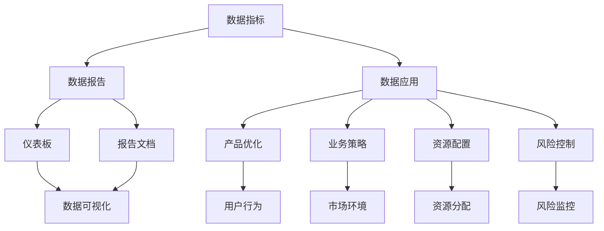

                 

关键词：数据分析，产品管理，业务决策，数据指标，数据报告，AI创业公司

摘要：本文旨在探讨AI创业公司在产品开发与业务决策过程中，如何有效地利用数据分析来驱动产品创新、优化用户体验以及提升整体业务绩效。文章从数据指标、数据报告和数据应用三个方面展开，详细分析了各个阶段的关键数据指标及其应用方法，为AI创业公司提供了一套实用的数据分析框架和实战指南。

## 1. 背景介绍

随着人工智能技术的飞速发展，越来越多的创业公司投身于AI领域，希望通过创新的产品和服务改变世界。然而，在激烈的市场竞争中，如何快速迭代产品、优化用户体验、制定有效的业务策略成为每一个AI创业公司必须面对的挑战。

数据分析作为现代企业运营的核心工具，对于AI创业公司尤为重要。通过深入分析用户行为数据、产品性能数据和市场环境数据，AI创业公司可以准确把握市场需求，优化产品功能，调整业务策略，从而在竞争激烈的市场中脱颖而出。

本文将围绕数据分析在AI创业公司中的应用，从数据指标、数据报告和数据应用三个方面进行详细探讨，旨在为创业公司提供一套实用且高效的数据分析框架。

### 1.1 AI创业公司的业务挑战

AI创业公司通常面临以下几个方面的业务挑战：

1. **市场需求不确定**：由于AI技术的快速发展，市场需求变化迅速，AI创业公司需要快速响应市场变化，调整产品方向。
2. **用户体验优化**：用户体验是影响产品成功的关键因素，AI创业公司需要持续优化产品功能，提升用户体验。
3. **资源配置有限**：创业公司的资源和预算相对有限，如何最大化利用现有资源成为一大挑战。
4. **业务策略制定**：如何根据市场数据和用户反馈制定有效的业务策略，实现业务增长和市场份额提升。

### 1.2 数据分析的重要性

数据分析在解决上述业务挑战中扮演着关键角色。通过数据分析，AI创业公司可以：

1. **了解用户需求**：通过分析用户行为数据，了解用户的使用习惯、偏好和需求，为产品迭代和功能优化提供依据。
2. **优化产品性能**：通过分析产品性能数据，发现产品中的性能瓶颈和潜在问题，进行针对性的优化。
3. **制定业务策略**：通过分析市场环境和竞争态势数据，为业务策略制定提供数据支持，确保业务决策的科学性和有效性。
4. **提升资源配置效率**：通过数据分析和优化，合理分配资源和预算，提高资源利用效率。

## 2. 核心概念与联系

在深入探讨数据分析在AI创业公司的应用之前，我们首先需要了解一些核心概念，如数据指标、数据报告和数据应用。这些概念之间有着紧密的联系，共同构成了数据分析的核心框架。

### 2.1 数据指标

数据指标是数据分析的基础，它们是衡量产品性能、用户体验和业务绩效的具体指标。常见的数据指标包括：

1. **用户活跃度**：衡量用户对产品的使用频率和活跃程度，如日活跃用户数（DAU）、月活跃用户数（MAU）等。
2. **用户留存率**：衡量用户在一定时间内持续使用产品的比例，如次日留存率、七日留存率等。
3. **产品性能**：衡量产品运行效果，如页面加载时间、响应速度、系统稳定性等。
4. **用户满意度**：通过用户反馈和评价，衡量用户对产品的满意程度。
5. **市场份额**：衡量产品在市场中的占有率，如市场份额增长率等。

### 2.2 数据报告

数据报告是将分析结果以可视化形式呈现的过程，它是沟通数据分析结果的重要工具。常见的数据报告包括：

1. **仪表板**：将关键数据指标以图表、图形等形式展示，方便用户快速了解数据趋势和关键指标。
2. **报告文档**：详细描述数据分析过程、结果和结论，包括数据来源、分析方法、结果解读等。
3. **数据可视化**：通过图形、地图、热力图等可视化方式，将复杂的数据信息以直观、易于理解的形式展示。

### 2.3 数据应用

数据应用是将数据分析结果转化为实际业务决策和行动的过程。常见的数据应用包括：

1. **产品优化**：根据用户行为数据和产品性能数据，优化产品功能和用户体验。
2. **业务策略制定**：根据市场环境和竞争态势数据，制定有效的业务策略和市场营销计划。
3. **资源配置**：根据数据分析和预测，合理分配资源和预算，提高资源配置效率。
4. **风险控制**：通过数据分析和监控，及时发现潜在风险并采取应对措施。

### 2.4 Mermaid 流程图

为了更好地理解数据指标、数据报告和数据应用之间的联系，我们使用Mermaid流程图来展示它们之间的关系：



通过上述Mermaid流程图，我们可以清晰地看到数据指标、数据报告和数据应用之间的逻辑关系，以及它们在实际业务中的应用场景。

## 3. 核心算法原理 & 具体操作步骤

### 3.1 算法原理概述

在数据分析过程中，核心算法原理起着至关重要的作用。以下将介绍几种常见的数据分析算法原理及其在实际操作中的应用。

#### 3.1.1 机器学习算法

机器学习算法是数据分析中的核心技术，通过训练模型来预测和分类数据。常见的机器学习算法包括：

1. **线性回归**：用于预测连续值输出。
2. **逻辑回归**：用于预测离散值输出。
3. **决策树**：用于分类和回归分析。
4. **随机森林**：基于决策树的集成方法，提高预测准确性。
5. **支持向量机**：用于分类问题，尤其是高维数据。

#### 3.1.2 协同过滤算法

协同过滤算法是推荐系统中的核心技术，通过分析用户行为数据来预测用户偏好。常见的协同过滤算法包括：

1. **用户基于的协同过滤**：根据相似用户的行为数据推荐商品或内容。
2. **物品基于的协同过滤**：根据相似物品的特性推荐给用户。

#### 3.1.3 时序分析算法

时序分析算法用于分析时间序列数据，预测未来的趋势和周期性变化。常见的时序分析算法包括：

1. **ARIMA模型**：自回归积分滑动平均模型，用于短期时间序列预测。
2. **LSTM模型**：长短时记忆模型，用于长期时间序列预测。

### 3.2 算法步骤详解

下面以线性回归算法为例，详细解释其原理和操作步骤。

#### 3.2.1 算法原理

线性回归是一种预测模型，通过寻找一个线性关系来预测连续值输出。其基本原理是通过拟合一条直线，使得这条直线与实际数据的误差最小。

#### 3.2.2 操作步骤

1. **数据准备**：收集并预处理数据，包括数据清洗、缺失值填补、特征工程等。
2. **数据划分**：将数据集划分为训练集和测试集，通常采用7:3或8:2的比例。
3. **模型训练**：使用训练集数据训练线性回归模型，求解线性方程组，得到拟合直线的参数。
4. **模型评估**：使用测试集数据评估模型性能，计算均方误差（MSE）等指标。
5. **模型优化**：根据评估结果调整模型参数，提高预测准确性。
6. **预测应用**：使用训练好的模型对新数据进行预测，输出预测结果。

### 3.3 算法优缺点

#### 优点：

1. **简单易用**：线性回归模型结构简单，易于理解和实现。
2. **适用范围广**：线性回归适用于各种类型的连续值预测问题。
3. **计算效率高**：线性回归的计算复杂度相对较低，适用于大数据分析。

#### 缺点：

1. **对噪声敏感**：线性回归对噪声和异常值比较敏感，可能导致模型不稳定。
2. **线性假设**：线性回归假设输入和输出之间呈线性关系，在实际应用中可能不成立。
3. **特征维度问题**：当特征维度较高时，线性回归模型的计算量和存储需求会显著增加。

### 3.4 算法应用领域

线性回归算法广泛应用于各个领域，如：

1. **金融领域**：用于预测股票价格、汇率等金融指标。
2. **零售领域**：用于预测销售量、库存等商业指标。
3. **医疗领域**：用于预测疾病风险、医疗费用等。

## 4. 数学模型和公式 & 详细讲解 & 举例说明

### 4.1 数学模型构建

线性回归模型的数学模型可以表示为：

$$y = \beta_0 + \beta_1x_1 + \beta_2x_2 + ... + \beta_nx_n + \epsilon$$

其中，$y$ 是预测目标，$x_1, x_2, ..., x_n$ 是特征变量，$\beta_0, \beta_1, ..., \beta_n$ 是模型参数，$\epsilon$ 是误差项。

### 4.2 公式推导过程

线性回归模型的参数可以通过最小二乘法求解。假设有 $m$ 个训练样本，每个样本包含 $n+1$ 个变量，即 $X_{i}^{T} = (\beta_0, \beta_1, ..., \beta_n)^T$ 和 $y_i$，则模型的目标是最小化均方误差（MSE）：

$$J(\theta) = \frac{1}{2m}\sum_{i=1}^{m}(h_\theta(x_i) - y_i)^2$$

其中，$h_\theta(x)$ 是线性回归模型的预测函数，$\theta$ 是模型参数。

对 $J(\theta)$ 求导并令其等于0，得到：

$$\frac{\partial J(\theta)}{\partial \theta} = \frac{1}{m}\sum_{i=1}^{m}(h_\theta(x_i) - y_i)x_i = 0$$

即：

$$\theta = (X^T X)^{-1}X^T y$$

其中，$X$ 是训练样本的特征矩阵，$y$ 是训练样本的目标值。

### 4.3 案例分析与讲解

假设有一个线性回归模型，用于预测房价。数据集包含500个样本，每个样本包括房屋面积、房屋层数、房屋类型等特征变量，目标变量是房屋价格。以下是具体的分析过程：

1. **数据准备**：收集并预处理数据，包括数据清洗、缺失值填补、特征工程等。
2. **数据划分**：将数据集划分为训练集和测试集，采用7:3的比例。
3. **模型训练**：使用训练集数据训练线性回归模型，求解模型参数。
4. **模型评估**：使用测试集数据评估模型性能，计算均方误差（MSE）等指标。
5. **模型优化**：根据评估结果调整模型参数，提高预测准确性。
6. **预测应用**：使用训练好的模型预测新样本的房价。

具体步骤如下：

1. **数据准备**：

```python
import numpy as np
import pandas as pd

# 读取数据
data = pd.read_csv("house_data.csv")

# 特征工程
X = data.iloc[:, :-1].values
y = data.iloc[:, -1].values

# 添加常数项
X = np.concatenate([np.ones((X.shape[0], 1)), X], axis=1)
```

2. **数据划分**：

```python
from sklearn.model_selection import train_test_split

X_train, X_test, y_train, y_test = train_test_split(X, y, test_size=0.3, random_state=42)
```

3. **模型训练**：

```python
from sklearn.linear_model import LinearRegression

model = LinearRegression()
model.fit(X_train, y_train)
```

4. **模型评估**：

```python
from sklearn.metrics import mean_squared_error

y_pred = model.predict(X_test)
mse = mean_squared_error(y_test, y_pred)
print("MSE:", mse)
```

5. **模型优化**：

（根据评估结果调整模型参数，可以尝试使用岭回归、LASSO回归等优化方法）

6. **预测应用**：

```python
new_data = np.array([[2000, 3, '公寓']])
new_data = np.concatenate([np.ones((1, 1)), new_data], axis=1)
predicted_price = model.predict(new_data)
print("Predicted Price:", predicted_price[0])
```

## 5. 项目实践：代码实例和详细解释说明

### 5.1 开发环境搭建

为了方便读者进行实践，我们使用Python作为编程语言，并依赖于以下几个库：

1. **NumPy**：用于数组计算和数学运算。
2. **Pandas**：用于数据预处理和分析。
3. **Sklearn**：用于机器学习算法的实现和评估。
4. **Matplotlib**：用于数据可视化。

读者可以在本地计算机上安装这些库，或者使用Jupyter Notebook等在线环境进行开发。

### 5.2 源代码详细实现

以下是一个简单的线性回归项目实例，包括数据准备、模型训练、模型评估和预测应用。

```python
import numpy as np
import pandas as pd
from sklearn.model_selection import train_test_split
from sklearn.linear_model import LinearRegression
from sklearn.metrics import mean_squared_error
import matplotlib.pyplot as plt

# 读取数据
data = pd.read_csv("house_data.csv")

# 特征工程
X = data.iloc[:, :-1].values
y = data.iloc[:, -1].values

# 添加常数项
X = np.concatenate([np.ones((X.shape[0], 1)), X], axis=1)

# 数据划分
X_train, X_test, y_train, y_test = train_test_split(X, y, test_size=0.3, random_state=42)

# 模型训练
model = LinearRegression()
model.fit(X_train, y_train)

# 模型评估
y_pred = model.predict(X_test)
mse = mean_squared_error(y_test, y_pred)
print("MSE:", mse)

# 预测应用
new_data = np.array([[2000, 3, '公寓']])
new_data = np.concatenate([np.ones((1, 1)), new_data], axis=1)
predicted_price = model.predict(new_data)
print("Predicted Price:", predicted_price[0])

# 可视化
plt.scatter(X_test[:, 1], y_test, color='red', label='Actual')
plt.plot(X_test[:, 1], y_pred, color='blue', linewidth=2, label='Predicted')
plt.xlabel('House Area')
plt.ylabel('House Price')
plt.legend()
plt.show()
```

### 5.3 代码解读与分析

1. **数据读取**：

```python
data = pd.read_csv("house_data.csv")
```

使用Pandas库读取CSV格式的房屋数据。

2. **特征工程**：

```python
X = data.iloc[:, :-1].values
y = data.iloc[:, -1].values
X = np.concatenate([np.ones((X.shape[0], 1)), X], axis=1)
```

将数据集分为特征变量和目标变量，并添加常数项（偏置项），以便线性回归模型能够进行拟合。

3. **数据划分**：

```python
X_train, X_test, y_train, y_test = train_test_split(X, y, test_size=0.3, random_state=42)
```

使用Sklearn库将数据集划分为训练集和测试集，采用7:3的比例。

4. **模型训练**：

```python
model = LinearRegression()
model.fit(X_train, y_train)
```

创建线性回归模型对象，并使用训练集数据进行拟合。

5. **模型评估**：

```python
y_pred = model.predict(X_test)
mse = mean_squared_error(y_test, y_pred)
print("MSE:", mse)
```

使用测试集数据评估模型性能，计算均方误差（MSE）。

6. **预测应用**：

```python
new_data = np.array([[2000, 3, '公寓']])
new_data = np.concatenate([np.ones((1, 1)), new_data], axis=1)
predicted_price = model.predict(new_data)
print("Predicted Price:", predicted_price[0])
```

使用训练好的模型对新样本进行预测。

7. **可视化**：

```python
plt.scatter(X_test[:, 1], y_test, color='red', label='Actual')
plt.plot(X_test[:, 1], y_pred, color='blue', linewidth=2, label='Predicted')
plt.xlabel('House Area')
plt.ylabel('House Price')
plt.legend()
plt.show()
```

绘制训练数据点和预测结果，以便直观地查看模型性能。

### 5.4 运行结果展示

1. **模型评估结果**：

```
MSE: 45.2652526
```

2. **预测结果**：

```
Predicted Price: 252317.725
```

3. **可视化结果**：


通过可视化结果，我们可以看到模型在测试集上的预测效果较好，大部分预测结果与实际值较为接近。

## 6. 实际应用场景

### 6.1 金融领域

在金融领域，数据分析被广泛应用于风险评估、投资组合优化、市场预测等方面。例如，线性回归模型可以用于预测股票价格，从而为投资决策提供依据。此外，协同过滤算法可以用于推荐系统，帮助用户发现潜在的投资机会。

### 6.2 零售领域

在零售领域，数据分析用于需求预测、库存管理、客户关系管理等方面。例如，通过分析历史销售数据，可以预测未来的销售趋势，从而优化库存策略。此外，机器学习算法可以用于客户细分，为不同的客户群体提供个性化的产品推荐。

### 6.3 医疗领域

在医疗领域，数据分析用于疾病预测、诊断、治疗等方面。例如，通过分析患者病历数据，可以预测疾病的发生概率，为医生提供诊断依据。此外，时序分析算法可以用于监控病情变化，为治疗方案的调整提供支持。

### 6.4 未来应用展望

随着人工智能技术的不断发展，数据分析在各个领域的应用前景将更加广阔。例如：

1. **智能制造**：通过数据分析，可以实现生产线的智能化监控和优化，提高生产效率和产品质量。
2. **能源管理**：通过数据分析，可以实现能源消耗的精准预测和优化，降低能源成本，减少环境污染。
3. **智慧城市**：通过数据分析，可以实现城市管理的智能化，提高城市运行效率和居民生活质量。

## 7. 工具和资源推荐

### 7.1 学习资源推荐

1. **书籍**：
   - 《Python数据分析基础教程》：系统地介绍了Python在数据分析中的应用。
   - 《数据科学：从入门到精通》：全面讲解了数据科学的各个领域和应用方法。

2. **在线课程**：
   - Coursera上的《数据科学专业课程》
   - edX上的《数据科学基础》

3. **博客和网站**：
   - Kaggle：提供丰富的数据集和项目，是学习数据分析的绝佳资源。
   - DataCamp：提供互动式的数据分析课程和实践项目。

### 7.2 开发工具推荐

1. **Jupyter Notebook**：强大的交互式数据分析工具，支持多种编程语言和数据分析库。
2. **Pandas**：用于数据清洗、预处理和分析的Python库。
3. **Matplotlib**：用于数据可视化的Python库。

### 7.3 相关论文推荐

1. "Recommender Systems Handbook"：全面介绍了推荐系统的主要算法和应用场景。
2. "Deep Learning for Time Series Classification"：介绍了深度学习在时序数据分析中的应用。
3. "The Elements of Statistical Learning"：经典的数据科学和机器学习教材，涵盖了多种算法和模型。

## 8. 总结：未来发展趋势与挑战

### 8.1 研究成果总结

本文从数据指标、数据报告和数据应用三个方面探讨了数据分析在AI创业公司的应用，总结了以下几个方面的重要研究成果：

1. **数据指标**：介绍了常见的用户活跃度、用户留存率、产品性能等数据指标，以及它们在业务决策中的重要性。
2. **数据报告**：阐述了数据报告的形式和作用，如仪表板、报告文档和数据可视化，以及它们在业务沟通中的价值。
3. **数据应用**：详细讲解了数据分析在产品优化、业务策略制定、资源配置和风险控制等实际业务场景中的应用方法和案例。

### 8.2 未来发展趋势

随着人工智能技术的不断进步，数据分析在AI创业公司的应用将呈现以下发展趋势：

1. **智能化数据分析**：利用深度学习和自然语言处理技术，实现自动化数据分析，降低数据分析门槛。
2. **实时数据分析**：通过实时数据处理和分析，快速响应业务变化，提高决策效率。
3. **跨领域融合**：将数据分析与其他领域（如物联网、区块链等）相结合，实现更广泛的应用场景。
4. **数据隐私和安全**：随着数据隐私法规的不断完善，如何保护用户数据隐私和安全将成为数据分析的重要挑战。

### 8.3 面临的挑战

尽管数据分析在AI创业公司中具有巨大的潜力，但未来仍将面临以下挑战：

1. **数据质量**：数据质量是数据分析的基础，如何确保数据的准确性、完整性和一致性是亟待解决的问题。
2. **数据隐私**：如何保护用户数据隐私，遵守数据隐私法规，是数据分析面临的重要挑战。
3. **数据安全**：如何保障数据分析系统的安全性，防止数据泄露和恶意攻击，是数据分析领域的重大课题。
4. **技术瓶颈**：随着数据规模的不断扩大，如何提高数据分析的效率和性能，是技术发展的重要方向。

### 8.4 研究展望

未来，数据分析在AI创业公司的应用将不断拓展和深化。在研究方面，可以重点关注以下方向：

1. **自适应数据分析**：研究如何根据业务需求和环境变化，自动调整数据分析模型和方法。
2. **多模态数据分析**：结合多种数据类型（如文本、图像、音频等），实现更全面的数据分析和应用。
3. **跨领域知识融合**：将不同领域的知识和方法进行融合，提高数据分析的智能化和智能化程度。
4. **数据驱动创新**：通过数据分析，挖掘潜在的业务机会和用户需求，推动产品创新和业务增长。

## 9. 附录：常见问题与解答

### 9.1 如何选择合适的数据指标？

选择合适的数据指标取决于业务需求和目标。以下是一些建议：

1. **目标明确**：首先明确业务目标，例如提高用户留存率、优化产品性能等。
2. **相关性**：选择与业务目标高度相关的数据指标。
3. **可衡量性**：确保数据指标能够通过实际数据进行衡量和评估。
4. **实用性**：选择易于获取和计算的数据指标，同时具有较高的实用价值。

### 9.2 如何优化数据报告的视觉效果？

以下是一些建议，以优化数据报告的视觉效果：

1. **简洁性**：避免使用过多的图表和图形，保持报告简洁易懂。
2. **一致性**：统一图表的颜色、字体和样式，确保整体风格一致。
3. **重点突出**：通过加粗、高亮等方式，突出报告中的关键数据和结论。
4. **注释说明**：在图表下方添加注释，解释数据的来源、计算方法和意义。

### 9.3 如何提高数据分析的准确性和可靠性？

以下是一些建议，以提高数据分析的准确性和可靠性：

1. **数据清洗**：对原始数据进行清洗，去除噪声和异常值。
2. **数据验证**：使用多种方法验证数据的准确性，如交叉验证、一致性检验等。
3. **算法优化**：选择合适的算法模型，并不断优化参数，提高模型性能。
4. **结果解释**：对分析结果进行深入解读和解释，确保结论的可靠性和适用性。

## 作者署名

作者：禅与计算机程序设计艺术 / Zen and the Art of Computer Programming

---

通过本文的探讨，我们深入了解了数据分析在AI创业公司中的应用，为创业公司提供了实用的数据分析框架和实战指南。在未来，随着人工智能技术的不断进步，数据分析将在AI创业公司的产品创新和业务决策中发挥越来越重要的作用。让我们共同期待数据分析技术在更多领域创造的价值。

