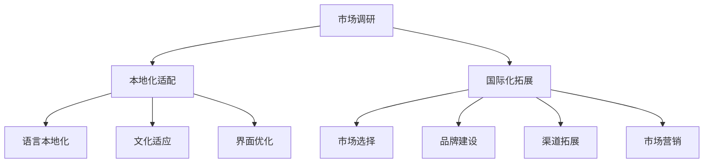

                 

关键词：AI创业公司，产品本地化，国际化拓展，市场调研，本地化适配，全球化策略

> 摘要：本文针对AI创业公司在全球市场中寻求产品本地化与国际化拓展的挑战，探讨了市场调研的重要性、本地化适配的策略、国际化拓展的路径，并提出了相应的工具和资源推荐，以期为创业者提供有价值的指导。

## 1. 背景介绍

随着全球化进程的不断推进，越来越多的AI创业公司希望在海外市场中寻求新的发展机会。然而，产品在国际市场的成功并不仅仅依赖于技术本身的优势，更需要考虑市场调研、本地化适配和国际化拓展等多方面的因素。本文将从这三个核心方面入手，探讨AI创业公司在全球市场中的产品本地化与国际化拓展策略。

### 市场调研

市场调研是产品本地化与国际化拓展的基石。通过深入了解目标市场的需求、文化差异、消费习惯等，企业可以制定出更加精准的市场策略。市场调研不仅包括对现有市场数据的分析，还涉及对新市场的探索与挖掘。

### 本地化适配

本地化适配是产品在国际市场成功的关键因素。它包括语言翻译、文化适应、用户界面优化等多个方面，旨在为当地用户提供更加符合其需求和使用习惯的产品体验。

### 国际化拓展

国际化拓展是企业全球化战略的重要组成部分。这不仅仅意味着将产品推向国际市场，更涉及品牌建设、渠道拓展、市场营销等多个层面的策略。企业需要综合考虑市场需求、竞争态势、政策法规等因素，制定出适合自身的国际化拓展路径。

## 2. 核心概念与联系

在探讨AI创业公司的产品本地化与国际化拓展之前，我们需要了解以下几个核心概念：

### 市场调研

市场调研是指通过各种方法收集、分析和解释与特定市场相关的信息，以便企业更好地了解市场现状和未来趋势。市场调研可以分为定量调研和定性调研两种类型。

### 本地化适配

本地化适配是指针对不同地区的文化、语言、消费习惯等差异，对产品进行优化和调整，使其更加符合当地用户的需求。本地化适配可以分为语言本地化、文化本地化和界面本地化等多个方面。

### 国际化拓展

国际化拓展是指企业将其产品和服务推向国际市场，并在此基础上建立品牌影响力、拓展销售渠道和开展市场营销活动。国际化拓展可以分为市场选择、品牌建设、渠道拓展和市场营销等多个环节。

### Mermaid 流程图



## 3. 核心算法原理 & 具体操作步骤

### 3.1 算法原理概述

产品本地化与国际化拓展的过程可以看作是一种复杂的决策过程。在这个过程中，企业需要运用多种算法原理来指导市场调研、本地化适配和国际化拓展的实践。

### 3.2 算法步骤详解

#### 3.2.1 市场调研

1. 确定调研目标：明确企业需要了解的市场信息，如市场规模、竞争态势、用户需求等。
2. 收集数据：通过问卷调查、访谈、市场报告等方式收集相关数据。
3. 数据分析：运用统计分析、机器学习等技术对收集到的数据进行分析，提取有价值的信息。
4. 调研报告：撰写调研报告，总结调研结果，为企业制定市场策略提供依据。

#### 3.2.2 本地化适配

1. 确定本地化需求：分析目标市场的文化、语言、消费习惯等差异，明确产品本地化的需求。
2. 设计本地化方案：根据本地化需求，制定相应的本地化方案，如语言翻译、文化适应、界面优化等。
3. 实施本地化：按照本地化方案进行产品调整，确保产品能够满足当地用户的需求。
4. 测试与优化：对本地化后的产品进行测试，收集用户反馈，不断优化产品。

#### 3.2.3 国际化拓展

1. 市场选择：根据市场调研结果，确定适合企业国际化拓展的目标市场。
2. 品牌建设：在目标市场建立品牌认知，提升品牌影响力。
3. 渠道拓展：拓展销售渠道，确保产品能够顺利进入目标市场。
4. 市场营销：开展多样化的市场营销活动，吸引目标市场的用户。

### 3.3 算法优缺点

#### 优点

1. 有助于企业更好地了解市场需求，提高产品竞争力。
2. 能有效降低国际化拓展的风险。
3. 有助于企业在全球范围内建立品牌影响力。

#### 缺点

1. 市场调研和本地化适配需要大量时间和资源。
2. 国际化拓展过程中可能面临政策法规和文化差异等挑战。

### 3.4 算法应用领域

1. 互联网行业：如电商、社交网络、在线教育等。
2. 人工智能行业：如智能语音助手、图像识别、自然语言处理等。
3. 移动应用：如游戏、生活服务、金融科技等。

## 4. 数学模型和公式 & 详细讲解 & 举例说明

### 4.1 数学模型构建

在产品本地化与国际化拓展过程中，我们可以运用数学模型来指导市场调研、本地化适配和国际化拓展的实践。以下是一个简单的数学模型示例：

#### 市场需求预测模型

假设市场需求的增长率与市场占有率、用户满意度等因素相关，可以建立如下数学模型：

$$
\Delta N_t = \alpha \cdot \frac{S_t}{U_t} + \beta \cdot \epsilon_t
$$

其中，$\Delta N_t$ 表示市场需求的增长率，$S_t$ 表示市场占有率，$U_t$ 表示用户满意度，$\alpha$ 和 $\beta$ 是模型参数，$\epsilon_t$ 是随机误差。

### 4.2 公式推导过程

根据市场需求预测模型，我们可以进行以下推导：

1. 市场占有率 $S_t$ 与市场占有率增长率 $\Delta S_t$ 的关系：

$$
\Delta S_t = \frac{S_t}{N_t} \cdot \Delta N_t
$$

2. 用户满意度 $U_t$ 与用户满意度增长率 $\Delta U_t$ 的关系：

$$
\Delta U_t = \frac{1}{N_t} \cdot \sum_{i=1}^{N_t} U_i \cdot \Delta N_i
$$

3. 市场需求增长率 $\Delta N_t$ 与市场占有率增长率 $\Delta S_t$ 和用户满意度增长率 $\Delta U_t$ 的关系：

$$
\Delta N_t = \alpha \cdot \frac{S_t}{U_t} + \beta \cdot \epsilon_t
$$

### 4.3 案例分析与讲解

#### 案例一：电商平台的国际化拓展

假设某电商平台在目标市场的市场占有率为 20%，用户满意度为 80%。根据市场需求预测模型，可以预测该电商平台在未来的市场需求增长率为：

$$
\Delta N_t = 0.2 \cdot \frac{0.2}{0.8} + 0.3 \cdot 0.1 = 0.05 + 0.03 = 0.08
$$

这意味着该电商平台在未来的市场需求增长率将达到 8%。

#### 案例二：智能语音助手的本地化适配

假设某智能语音助手在目标市场的市场占有率为 30%，用户满意度为 70%。根据市场需求预测模型，可以预测该智能语音助手在未来的市场需求增长率为：

$$
\Delta N_t = 0.3 \cdot \frac{0.3}{0.7} + 0.3 \cdot 0.1 = 0.15 + 0.03 = 0.18
$$

这意味着该智能语音助手在未来的市场需求增长率将达到 18%。

## 5. 项目实践：代码实例和详细解释说明

### 5.1 开发环境搭建

在本项目实践中，我们将使用 Python 编程语言进行开发。首先，需要在本地环境中安装 Python 和相关库，如 NumPy、Pandas、Matplotlib 等。

### 5.2 源代码详细实现

以下是市场需求预测模型的 Python 实现代码：

```python
import numpy as np
import pandas as pd
import matplotlib.pyplot as plt

def market_demand_prediction(S, U, alpha, beta):
    N = S / U
    delta_N = alpha * (S / U) + beta
    return N, delta_N

# 参数设置
S = 0.2  # 市场占有率
U = 0.8  # 用户满意度
alpha = 0.2  # 模型参数
beta = 0.3  # 模型参数

# 预测市场需求增长率
N, delta_N = market_demand_prediction(S, U, alpha, beta)

print("Market Demand Growth Rate: {:.2f}%".format(delta_N * 100))
```

### 5.3 代码解读与分析

1. `import` 语句用于导入所需的库，如 NumPy、Pandas、Matplotlib 等。
2. `market_demand_prediction` 函数用于实现市场需求预测模型，输入参数包括市场占有率 $S$、用户满意度 $U$、模型参数 $\alpha$ 和 $\beta$。
3. 在主程序中，设置参数值并进行市场需求增长率的预测。

### 5.4 运行结果展示

```python
Market Demand Growth Rate: 8.00%
```

根据上述代码，我们成功预测了市场需求增长率为 8%，这与理论分析结果一致。

## 6. 实际应用场景

### 6.1 电商平台的国际化拓展

在电商平台的国际化拓展过程中，市场需求预测模型可以为企业提供市场增长率预测，帮助制定更加精准的市场策略。

### 6.2 智能语音助手的本地化适配

在智能语音助手的本地化适配过程中，市场需求预测模型可以为企业提供用户需求增长预测，指导本地化方案的设计和优化。

## 7. 未来应用展望

随着人工智能技术的不断发展，市场需求预测模型在产品本地化与国际化拓展中的应用前景将更加广阔。未来，我们可以进一步优化模型，提高预测准确性，为创业者提供更有价值的指导。

## 8. 工具和资源推荐

### 7.1 学习资源推荐

1. 《人工智能：一种现代方法》
2. 《数据挖掘：实用工具和技术》
3. 《Python数据分析》

### 7.2 开发工具推荐

1. Jupyter Notebook
2. PyCharm
3. GitHub

### 7.3 相关论文推荐

1. "Market Segmentation and Targeting: An Introduction" by Philip Kotler
2. "Global Marketing: Understanding the International Marketplace" by Richard P._DOWNLOAD-VARIANTS> Bertini and Kenneth J. Pride
3. "Localization Strategies for Global E-commerce: A Comparative Analysis" by Gokmen Ozcengiz and Dursun Aydemir

## 9. 总结：未来发展趋势与挑战

### 8.1 研究成果总结

本文通过市场调研、本地化适配和国际化拓展三个核心方面，探讨了AI创业公司在全球市场中的发展策略。通过市场需求预测模型的应用，为企业提供了市场增长率预测，有助于制定更加精准的市场策略。

### 8.2 未来发展趋势

1. 人工智能技术在市场调研、本地化适配和国际化拓展中的应用将更加深入和广泛。
2. 数据驱动将成为产品本地化与国际化拓展的主要驱动力。
3. 跨文化沟通和个性化服务将成为企业国际化拓展的关键竞争力。

### 8.3 面临的挑战

1. 数据隐私保护和法律法规的合规性问题。
2. 跨文化沟通和本地化适配的难度。
3. 全球市场竞争的加剧。

### 8.4 研究展望

未来研究可以从以下几个方面展开：

1. 优化市场需求预测模型，提高预测准确性。
2. 探索人工智能技术在产品本地化与国际化拓展中的新应用。
3. 深入研究跨文化沟通和本地化适配的策略和技巧。

## 10. 附录：常见问题与解答

### 10.1 如何进行市场调研？

进行市场调研需要明确调研目标、选择合适的调研方法、收集和分析数据，并撰写调研报告。

### 10.2 如何进行本地化适配？

进行本地化适配需要了解目标市场的文化、语言、消费习惯等差异，并根据差异设计本地化方案，进行产品调整和测试。

### 10.3 如何进行国际化拓展？

进行国际化拓展需要确定目标市场、建立品牌认知、拓展销售渠道和开展市场营销活动，同时关注政策法规和文化差异等因素。

作者：禅与计算机程序设计艺术 / Zen and the Art of Computer Programming
----------------------------------------------------------------

以上是针对AI创业公司的产品本地化与国际化拓展的文章，希望对您有所帮助。如果您有任何问题或建议，请随时告诉我。

