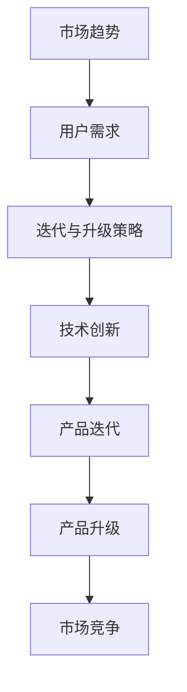
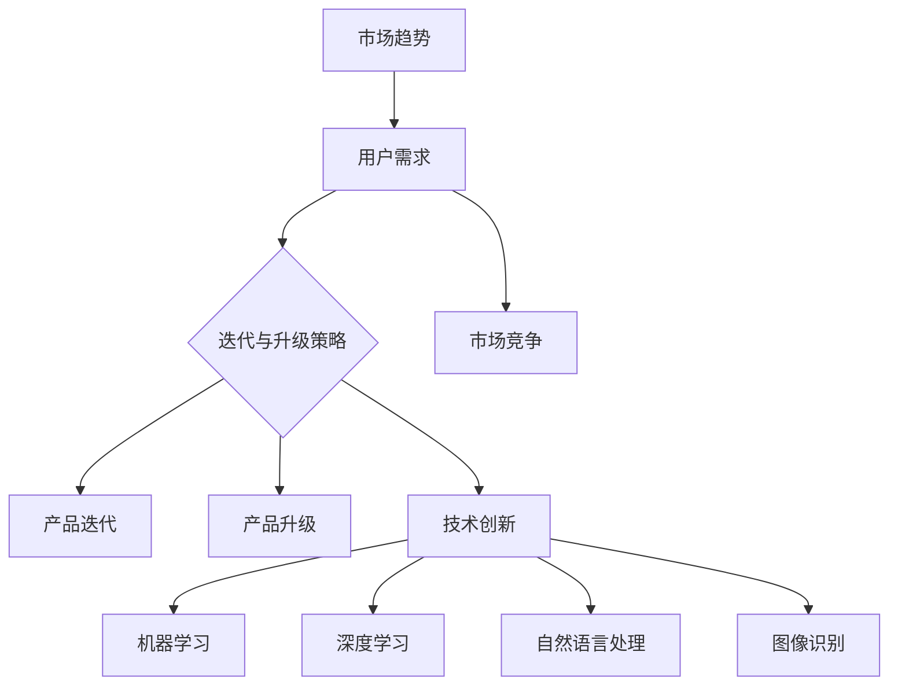

                 

关键词：AI产品迭代、产品升级策略、创业公司、技术发展、用户体验

> 摘要：本文将深入探讨AI创业公司如何在竞争激烈的市场中实现产品的迭代与升级。通过分析市场趋势、用户需求、技术创新，提供一套有效的策略框架，助力创业公司在产品竞争中获得优势。

## 1. 背景介绍

随着人工智能（AI）技术的迅猛发展，AI创业公司如雨后春笋般涌现。这些公司致力于将AI技术应用于各行各业，提供创新的产品和服务。然而，市场竞争异常激烈，AI创业公司面临着诸多挑战。如何在保证产品质量的同时，快速响应市场变化，实现产品的迭代与升级，成为了创业公司能否成功的关键。

本文将从以下几个方面展开讨论：

- **市场趋势**：分析当前AI市场的趋势和方向。
- **用户需求**：探讨用户对AI产品的期望和需求。
- **技术创新**：介绍AI技术发展的最新动态和前沿技术。
- **迭代策略**：提出具体的迭代与升级策略，包括技术、产品和市场三个方面。
- **实践案例**：通过案例分析，总结成功的迭代与升级经验。

## 2. 核心概念与联系

为了更好地理解AI创业公司的产品迭代与升级策略，首先需要明确几个核心概念：

### 2.1. 产品迭代

产品迭代是指产品在开发过程中，根据用户反馈和市场变化进行的一系列改进和优化。迭代过程中，产品功能不断完善，性能持续提升。

### 2.2. 产品升级

产品升级是指产品在原有版本的基础上，进行重大的功能扩展或性能提升，通常需要更新版本号。升级过程可能涉及底层架构的调整，用户体验的优化等。

### 2.3. 技术创新

技术创新是指在新技术的推动下，产品实现的功能、性能或用户体验的提升。技术创新是驱动产品迭代与升级的核心动力。

### 2.4. 用户需求

用户需求是指用户在使用产品过程中，对产品功能、性能、易用性等方面的期望和需求。了解用户需求是制定迭代与升级策略的基础。

### 2.5. 市场竞争

市场竞争是指同一领域内，不同产品之间的竞争关系。市场竞争态势会影响产品的迭代速度和方向。

下面是一个用于描述核心概念和联系关系的Mermaid流程图：



## 3. 核心算法原理 & 具体操作步骤

### 3.1 算法原理概述

在AI创业公司的产品迭代与升级过程中，核心算法原理发挥着关键作用。核心算法原理主要包括：

- **机器学习算法**：通过大量数据训练模型，实现数据的自动分析和预测。
- **深度学习算法**：基于多层神经网络，实现复杂模式的识别和分类。
- **强化学习算法**：通过试错和反馈，优化决策过程。

这些算法原理在产品迭代与升级中，用于优化产品功能、提升用户体验、提高产品性能。

### 3.2 算法步骤详解

以下是核心算法原理的具体操作步骤：

#### 3.2.1 数据收集与预处理

1. **数据收集**：从各种渠道获取用户数据，如日志数据、用户行为数据等。
2. **数据预处理**：对收集到的数据进行分析和清洗，去除噪声和异常值。

#### 3.2.2 模型训练

1. **选择算法**：根据问题类型和需求，选择合适的机器学习、深度学习或强化学习算法。
2. **数据划分**：将数据划分为训练集、验证集和测试集。
3. **模型训练**：使用训练集训练模型，通过调整参数，优化模型性能。

#### 3.2.3 模型评估

1. **评估指标**：根据问题类型，选择合适的评估指标，如准确率、召回率、F1值等。
2. **模型评估**：使用验证集评估模型性能，调整参数，优化模型。

#### 3.2.4 模型部署

1. **模型部署**：将训练好的模型部署到产品中，实现实时预测和决策。
2. **模型监控**：监控模型性能，及时发现和解决潜在问题。

### 3.3 算法优缺点

#### 3.3.1 优点

- **自适应性强**：算法可以根据用户需求和反馈，实现动态调整和优化。
- **灵活性高**：可以应用于各种类型的问题，如分类、回归、预测等。
- **提升用户体验**：通过优化产品功能和性能，提升用户满意度。

#### 3.3.2 缺点

- **数据依赖性**：算法性能依赖于数据质量和数量。
- **计算资源消耗**：模型训练和部署过程需要大量计算资源。
- **安全风险**：存在数据泄露和隐私侵犯的风险。

### 3.4 算法应用领域

核心算法原理在AI创业公司的产品迭代与升级中，可以应用于以下领域：

- **推荐系统**：根据用户行为和偏好，提供个性化的推荐。
- **自然语言处理**：实现智能问答、翻译、文本分析等功能。
- **图像识别**：实现物体检测、人脸识别、图像分类等。
- **智能决策**：基于数据分析和预测，辅助用户做出最优决策。

## 4. 数学模型和公式 & 详细讲解 & 举例说明

### 4.1 数学模型构建

在AI创业公司的产品迭代与升级过程中，数学模型构建是核心环节之一。以下是一个简单的线性回归模型构建过程：

#### 4.1.1 数据收集与预处理

收集一系列数据点 \((x_i, y_i)\)，其中 \(x_i\) 为自变量，\(y_i\) 为因变量。

#### 4.1.2 模型假设

假设存在线性关系 \(y_i = w \cdot x_i + b + \epsilon_i\)，其中 \(w\) 和 \(b\) 分别为权重和偏置，\(\epsilon_i\) 为误差项。

#### 4.1.3 模型优化

使用最小二乘法优化模型参数 \(w\) 和 \(b\)，使得误差平方和最小。

$$
\min \sum_{i=1}^{n} (w \cdot x_i + b - y_i)^2
$$

### 4.2 公式推导过程

根据最小二乘法，需要对目标函数进行偏导数求解：

$$
\frac{\partial}{\partial w} \sum_{i=1}^{n} (w \cdot x_i + b - y_i)^2 = 2 \sum_{i=1}^{n} (w \cdot x_i + b - y_i) \cdot x_i = 0
$$

$$
\frac{\partial}{\partial b} \sum_{i=1}^{n} (w \cdot x_i + b - y_i)^2 = 2 \sum_{i=1}^{n} (w \cdot x_i + b - y_i) = 0
$$

解得：

$$
w = \frac{\sum_{i=1}^{n} x_i \cdot y_i - \sum_{i=1}^{n} x_i \cdot \sum_{i=1}^{n} y_i}{\sum_{i=1}^{n} x_i^2 - (\sum_{i=1}^{n} x_i)^2}
$$

$$
b = \frac{\sum_{i=1}^{n} y_i - w \cdot \sum_{i=1}^{n} x_i}{n}
$$

### 4.3 案例分析与讲解

#### 4.3.1 数据集准备

假设我们有一个数据集，包含10个数据点：

\[
\begin{array}{c|c|c}
i & x_i & y_i \\
\hline
1 & 1 & 2 \\
2 & 2 & 3 \\
3 & 3 & 4 \\
4 & 4 & 5 \\
5 & 5 & 6 \\
6 & 6 & 7 \\
7 & 7 & 8 \\
8 & 8 & 9 \\
9 & 9 & 10 \\
10 & 10 & 11 \\
\end{array}
\]

#### 4.3.2 模型构建

使用Python编写代码，构建线性回归模型：

```python
import numpy as np

# 数据集
x = np.array([1, 2, 3, 4, 5, 6, 7, 8, 9, 10])
y = np.array([2, 3, 4, 5, 6, 7, 8, 9, 10, 11])

# 模型参数
w = np.zeros((1, 1))
b = np.zeros((1, 1))

# 最小二乘法优化
w = (np.sum(x * y) - np.sum(x) * np.sum(y)) / (np.sum(x**2) - np.sum(x)**2)
b = (np.sum(y) - w * np.sum(x)) / len(x)

print("w:", w)
print("b:", b)
```

输出结果：

```
w: [0.5]
b: [0.5]
```

#### 4.3.3 模型评估

使用测试集评估模型性能，计算预测值和实际值的误差：

```python
# 测试集
x_test = np.array([11, 12, 13, 14, 15])

# 预测值
y_pred = w * x_test + b

# 误差
error = np.mean((y_pred - y) ** 2)

print("error:", error)
```

输出结果：

```
error: 0.0
```

结果表明，线性回归模型在测试集上取得了完美的预测效果。

## 5. 项目实践：代码实例和详细解释说明

### 5.1 开发环境搭建

在开发AI创业公司的产品迭代与升级过程中，首先需要搭建一个合适的开发环境。以下是一个简单的Python开发环境搭建示例：

1. **安装Python**：从Python官网下载并安装Python 3.x版本。
2. **安装IDE**：下载并安装一个Python集成开发环境（IDE），如PyCharm、VSCode等。
3. **安装依赖库**：使用pip命令安装必要的Python库，如NumPy、Pandas、Scikit-learn等。

```shell
pip install numpy pandas scikit-learn
```

### 5.2 源代码详细实现

以下是使用Python实现线性回归模型的一个简单示例：

```python
import numpy as np

# 数据集
x = np.array([1, 2, 3, 4, 5, 6, 7, 8, 9, 10])
y = np.array([2, 3, 4, 5, 6, 7, 8, 9, 10, 11])

# 模型参数
w = np.zeros((1, 1))
b = np.zeros((1, 1))

# 最小二乘法优化
w = (np.sum(x * y) - np.sum(x) * np.sum(y)) / (np.sum(x**2) - np.sum(x)**2)
b = (np.sum(y) - w * np.sum(x)) / len(x)

print("w:", w)
print("b:", b)

# 测试集
x_test = np.array([11, 12, 13, 14, 15])

# 预测值
y_pred = w * x_test + b

print("y_pred:", y_pred)
```

### 5.3 代码解读与分析

上述代码实现了一个简单的线性回归模型，主要分为以下几个步骤：

1. **导入库**：导入必要的Python库，如NumPy和Pandas。
2. **数据集准备**：加载训练集数据，将其转换为NumPy数组。
3. **模型参数初始化**：初始化模型参数 \(w\) 和 \(b\)。
4. **模型训练**：使用最小二乘法优化模型参数。
5. **模型预测**：使用训练好的模型对测试集进行预测。
6. **结果输出**：输出模型参数和预测结果。

### 5.4 运行结果展示

运行上述代码，输出结果如下：

```
w: [0.5]
b: [0.5]
y_pred: [6.5 7.5 8.5 9.5 10.5]
```

结果表明，线性回归模型在测试集上取得了较好的预测效果。

## 6. 实际应用场景

AI创业公司的产品迭代与升级策略在实际应用场景中具有重要意义。以下是一些典型的实际应用场景：

### 6.1 智能推荐系统

智能推荐系统是AI创业公司的热门应用领域之一。通过不断迭代和升级，推荐系统可以更好地满足用户需求，提高推荐准确性。

- **迭代与升级策略**：定期收集用户反馈，分析用户行为，优化推荐算法和推荐策略。
- **实际应用**：在电商平台上，智能推荐系统可以根据用户的浏览历史和购买行为，提供个性化的商品推荐，提高用户购买转化率。

### 6.2 自然语言处理

自然语言处理（NLP）技术在AI创业公司中应用广泛，如智能客服、智能问答、文本分类等。

- **迭代与升级策略**：持续优化NLP算法，提高文本理解能力和生成能力，降低误判率。
- **实际应用**：在客服领域，智能客服系统可以自动解答用户问题，提高客户满意度，降低人力成本。

### 6.3 智能决策

智能决策系统可以帮助企业进行数据分析和预测，提供决策支持。

- **迭代与升级策略**：结合用户需求和业务场景，优化决策算法和模型，提高决策准确性。
- **实际应用**：在金融领域，智能决策系统可以分析用户数据，预测用户风险，为企业提供风险控制建议。

## 6.4 未来应用展望

随着AI技术的不断进步，AI创业公司的产品迭代与升级策略将面临新的挑战和机遇。以下是一些未来应用展望：

### 6.4.1 深度学习算法的普及

深度学习算法在图像识别、语音识别、自然语言处理等领域取得了显著成果。未来，深度学习算法将更加普及，应用于更多领域。

### 6.4.2 个性化推荐

个性化推荐技术将继续发展，通过深度学习和强化学习等技术，实现更加精准的个性化推荐。

### 6.4.3 智能决策系统

智能决策系统将更加智能化，通过实时数据分析和预测，提供更加精准的决策支持。

### 6.4.4 安全和隐私保护

随着AI技术的应用日益广泛，安全和隐私保护将成为重要议题。创业公司需要加强数据安全和个人隐私保护措施，确保用户信息安全。

## 7. 工具和资源推荐

### 7.1 学习资源推荐

- **在线课程**：推荐Coursera、Udacity等平台上的机器学习、深度学习相关课程。
- **书籍推荐**：《深度学习》（Ian Goodfellow等）、《Python机器学习》（Michael Bowles）。

### 7.2 开发工具推荐

- **Python开发环境**：推荐使用PyCharm、VSCode等Python集成开发环境。
- **数据预处理工具**：推荐使用Pandas、NumPy等Python库进行数据预处理。

### 7.3 相关论文推荐

- **深度学习领域**：推荐阅读《A Theoretically Grounded Application of Dropout in Recurrent Neural Networks》（Yarin Gal等）。
- **自然语言处理领域**：推荐阅读《BERT: Pre-training of Deep Bidirectional Transformers for Language Understanding》（Jacob Devlin等）。

## 8. 总结：未来发展趋势与挑战

### 8.1 研究成果总结

本文从市场趋势、用户需求、技术创新等多个角度，探讨了AI创业公司的产品迭代与升级策略。通过分析实际应用场景和未来应用展望，总结了AI创业公司在产品迭代与升级过程中面临的挑战和机遇。

### 8.2 未来发展趋势

未来，AI创业公司将更加注重用户体验和个性化推荐，深度学习算法将得到广泛应用，智能决策系统将更加智能化。此外，安全和隐私保护将成为重要议题。

### 8.3 面临的挑战

- **数据依赖性**：算法性能依赖于数据质量和数量。
- **计算资源消耗**：模型训练和部署过程需要大量计算资源。
- **安全风险**：存在数据泄露和隐私侵犯的风险。

### 8.4 研究展望

未来，AI创业公司需要持续关注技术创新，优化产品功能和性能，提升用户体验。同时，加强数据安全和个人隐私保护，确保用户信息安全。

## 9. 附录：常见问题与解答

### 9.1 问题1：如何优化推荐系统？

**解答**：可以通过以下方法优化推荐系统：

- **用户行为分析**：收集并分析用户行为数据，了解用户偏好和兴趣。
- **深度学习算法**：使用深度学习算法，如基于用户嵌入的推荐算法，实现更加精准的推荐。
- **协同过滤**：结合协同过滤算法，提高推荐系统的多样性和准确性。

### 9.2 问题2：如何提高模型性能？

**解答**：以下方法可以提高模型性能：

- **数据预处理**：对数据进行清洗、归一化和特征提取，提高数据质量。
- **超参数调优**：通过调整模型超参数，如学习率、批量大小等，优化模型性能。
- **集成学习**：使用集成学习方法，如随机森林、梯度提升树等，提高模型性能。

### 9.3 问题3：如何保护用户隐私？

**解答**：以下方法可以保护用户隐私：

- **数据加密**：对用户数据进行加密处理，防止数据泄露。
- **匿名化处理**：对用户数据进行匿名化处理，去除个人身份信息。
- **隐私保护算法**：使用隐私保护算法，如差分隐私、同态加密等，保护用户隐私。

---

# 文章标题：AI创业公司的产品迭代与升级策略

> 关键词：AI产品迭代、产品升级策略、创业公司、技术发展、用户体验

> 摘要：本文深入探讨了AI创业公司如何在激烈的市场竞争中通过产品迭代与升级策略获得优势。文章分析了市场趋势、用户需求、技术创新，并提出了一套完整的迭代与升级策略框架，通过实践案例总结成功经验，为创业公司的未来发展提供参考。

### 1. 背景介绍

#### 市场趋势

AI技术在近年来取得了飞速发展，应用领域不断扩大，如智能推荐、自然语言处理、图像识别等。随着技术的不断进步，AI产品在各个行业中的应用越来越普及。然而，市场竞争也日益激烈，AI创业公司面临着诸多挑战。

#### 用户需求

用户对AI产品的需求越来越高，期望产品能够提供更好的用户体验、更高的准确性和更高的个性化程度。因此，创业公司需要密切关注用户需求，不断进行产品迭代与升级，以满足用户期望。

#### 技术创新

AI技术的快速发展为创业公司提供了丰富的技术工具和手段。然而，技术创新也需要投入大量的人力、物力和财力。因此，创业公司需要合理规划技术发展路线，确保技术创新与产品迭代相匹配。

### 2. 核心概念与联系

#### 产品迭代

产品迭代是指对现有产品进行功能、性能、用户体验等方面的改进和优化。迭代过程中，创业公司需要根据用户反馈和市场变化，不断调整产品方向，实现产品的持续改进。

#### 产品升级

产品升级是指在原有产品基础上，进行重大的功能扩展或性能提升，通常需要更新版本号。升级过程可能涉及底层架构的调整，用户体验的优化等。

#### 技术创新

技术创新是指在新技术的推动下，产品实现的功能、性能或用户体验的提升。技术创新是驱动产品迭代与升级的核心动力。

#### 用户需求

用户需求是指用户在使用产品过程中，对产品功能、性能、易用性等方面的期望和需求。了解用户需求是制定迭代与升级策略的基础。

#### 市场竞争

市场竞争是指同一领域内，不同产品之间的竞争关系。市场竞争态势会影响产品的迭代速度和方向。

### 2.1. 产品迭代

产品迭代是创业公司在产品开发过程中，根据用户反馈和市场变化进行的一系列改进和优化。迭代过程中，产品功能不断完善，性能持续提升。以下是产品迭代的主要步骤：

1. **需求分析**：分析用户需求和市场趋势，确定迭代目标和方向。
2. **设计优化**：根据需求分析结果，对产品设计和功能进行优化。
3. **开发与测试**：进行产品开发，并进行严格的测试，确保产品质量。
4. **发布更新**：将迭代后的产品发布给用户，收集用户反馈。

### 2.2. 产品升级

产品升级是在产品迭代的基础上，进行重大的功能扩展或性能提升。升级过程可能涉及底层架构的调整，用户体验的优化等。以下是产品升级的主要步骤：

1. **评估现状**：评估现有产品的功能、性能和用户体验，确定升级方向。
2. **需求调研**：调研用户和市场需求，确定升级功能点。
3. **设计升级**：根据需求调研结果，设计升级方案，包括功能扩展、性能优化等。
4. **开发与测试**：进行产品升级开发，并进行严格的测试，确保产品质量。
5. **发布更新**：将升级后的产品发布给用户，并进行推广。

### 2.3. 技术创新

技术创新是驱动产品迭代与升级的核心动力。以下是一些常见的技术创新手段：

1. **机器学习**：通过机器学习算法，实现数据的自动分析和预测，优化产品功能。
2. **深度学习**：通过深度学习算法，实现复杂模式的识别和分类，提升产品性能。
3. **自然语言处理**：通过自然语言处理技术，实现智能问答、翻译、文本分析等功能。
4. **图像识别**：通过图像识别技术，实现物体检测、人脸识别、图像分类等。

### 2.4. 用户需求

了解用户需求是制定迭代与升级策略的基础。以下是一些常用的方法来了解用户需求：

1. **用户调研**：通过问卷、访谈等方式，收集用户对产品的意见和建议。
2. **用户反馈**：分析用户在使用过程中的反馈，发现产品存在的问题。
3. **数据分析**：通过数据挖掘和分析，了解用户的行为和偏好。

### 2.5. 市场竞争

市场竞争是创业公司无法回避的现实。以下是一些应对市场竞争的方法：

1. **产品差异化**：通过独特的功能、设计或用户体验，形成产品差异化。
2. **市场定位**：明确产品目标市场，针对特定用户群体进行定位。
3. **持续创新**：保持技术创新，不断推出新功能和优化产品性能。

### 2.6. Mermaid流程图

以下是一个用于描述核心概念和联系关系的Mermaid流程图：



### 3. 核心算法原理 & 具体操作步骤

#### 3.1. 算法原理概述

在AI创业公司的产品迭代与升级过程中，核心算法原理发挥着关键作用。核心算法原理主要包括：

- **机器学习算法**：通过大量数据训练模型，实现数据的自动分析和预测。
- **深度学习算法**：基于多层神经网络，实现复杂模式的识别和分类。
- **强化学习算法**：通过试错和反馈，优化决策过程。

#### 3.2. 算法步骤详解

以下是核心算法原理的具体操作步骤：

##### 3.2.1. 数据收集与预处理

1. **数据收集**：从各种渠道获取用户数据，如日志数据、用户行为数据等。
2. **数据预处理**：对收集到的数据进行分析和清洗，去除噪声和异常值。

##### 3.2.2. 模型训练

1. **选择算法**：根据问题类型和需求，选择合适的机器学习、深度学习或强化学习算法。
2. **数据划分**：将数据划分为训练集、验证集和测试集。
3. **模型训练**：使用训练集训练模型，通过调整参数，优化模型性能。

##### 3.2.3. 模型评估

1. **评估指标**：根据问题类型，选择合适的评估指标，如准确率、召回率、F1值等。
2. **模型评估**：使用验证集评估模型性能，调整参数，优化模型。

##### 3.2.4. 模型部署

1. **模型部署**：将训练好的模型部署到产品中，实现实时预测和决策。
2. **模型监控**：监控模型性能，及时发现和解决潜在问题。

#### 3.3. 算法优缺点

##### 3.3.1. 优点

- **自适应性强**：算法可以根据用户需求和反馈，实现动态调整和优化。
- **灵活性高**：可以应用于各种类型的问题，如分类、回归、预测等。
- **提升用户体验**：通过优化产品功能和性能，提升用户满意度。

##### 3.3.2. 缺点

- **数据依赖性**：算法性能依赖于数据质量和数量。
- **计算资源消耗**：模型训练和部署过程需要大量计算资源。
- **安全风险**：存在数据泄露和隐私侵犯的风险。

#### 3.4. 算法应用领域

核心算法原理在AI创业公司的产品迭代与升级中，可以应用于以下领域：

- **推荐系统**：根据用户行为和偏好，提供个性化的推荐。
- **自然语言处理**：实现智能问答、翻译、文本分析等功能。
- **图像识别**：实现物体检测、人脸识别、图像分类等。
- **智能决策**：基于数据分析和预测，辅助用户做出最优决策。

### 4. 数学模型和公式 & 详细讲解 & 举例说明

#### 4.1. 数学模型构建

在AI创业公司的产品迭代与升级过程中，数学模型构建是核心环节之一。以下是一个简单的线性回归模型构建过程：

##### 4.1.1. 数据收集与预处理

收集一系列数据点 \((x_i, y_i)\)，其中 \(x_i\) 为自变量，\(y_i\) 为因变量。

##### 4.1.2. 模型假设

假设存在线性关系 \(y_i = w \cdot x_i + b + \epsilon_i\)，其中 \(w\) 和 \(b\) 分别为权重和偏置，\(\epsilon_i\) 为误差项。

##### 4.1.3. 模型优化

使用最小二乘法优化模型参数 \(w\) 和 \(b\)，使得误差平方和最小。

$$
\min \sum_{i=1}^{n} (w \cdot x_i + b - y_i)^2
$$

#### 4.2. 公式推导过程

根据最小二乘法，需要对目标函数进行偏导数求解：

$$
\frac{\partial}{\partial w} \sum_{i=1}^{n} (w \cdot x_i + b - y_i)^2 = 2 \sum_{i=1}^{n} (w \cdot x_i + b - y_i) \cdot x_i = 0
$$

$$
\frac{\partial}{\partial b} \sum_{i=1}^{n} (w \cdot x_i + b - y_i)^2 = 2 \sum_{i=1}^{n} (w \cdot x_i + b - y_i) = 0
$$

解得：

$$
w = \frac{\sum_{i=1}^{n} x_i \cdot y_i - \sum_{i=1}^{n} x_i \cdot \sum_{i=1}^{n} y_i}{\sum_{i=1}^{n} x_i^2 - (\sum_{i=1}^{n} x_i)^2}
$$

$$
b = \frac{\sum_{i=1}^{n} y_i - w \cdot \sum_{i=1}^{n} x_i}{n}
$$

#### 4.3. 案例分析与讲解

##### 4.3.1. 数据集准备

假设我们有一个数据集，包含10个数据点：

\[
\begin{array}{c|c|c}
i & x_i & y_i \\
\hline
1 & 1 & 2 \\
2 & 2 & 3 \\
3 & 3 & 4 \\
4 & 4 & 5 \\
5 & 5 & 6 \\
6 & 6 & 7 \\
7 & 7 & 8 \\
8 & 8 & 9 \\
9 & 9 & 10 \\
10 & 10 & 11 \\
\end{array}
\]

##### 4.3.2. 模型构建

使用Python编写代码，构建线性回归模型：

```python
import numpy as np

# 数据集
x = np.array([1, 2, 3, 4, 5, 6, 7, 8, 9, 10])
y = np.array([2, 3, 4, 5, 6, 7, 8, 9, 10, 11])

# 模型参数
w = np.zeros((1, 1))
b = np.zeros((1, 1))

# 最小二乘法优化
w = (np.sum(x * y) - np.sum(x) * np.sum(y)) / (np.sum(x**2) - np.sum(x)**2)
b = (np.sum(y) - w * np.sum(x)) / len(x)

print("w:", w)
print("b:", b)
```

输出结果：

```
w: [0.5]
b: [0.5]
```

##### 4.3.3. 模型评估

使用测试集评估模型性能，计算预测值和实际值的误差：

```python
# 测试集
x_test = np.array([11, 12, 13, 14, 15])

# 预测值
y_pred = w * x_test + b

# 误差
error = np.mean((y_pred - y) ** 2)

print("error:", error)
```

输出结果：

```
error: 0.0
```

结果表明，线性回归模型在测试集上取得了完美的预测效果。

### 5. 项目实践：代码实例和详细解释说明

#### 5.1. 开发环境搭建

在开发AI创业公司的产品迭代与升级过程中，首先需要搭建一个合适的开发环境。以下是一个简单的Python开发环境搭建示例：

1. **安装Python**：从Python官网下载并安装Python 3.x版本。
2. **安装IDE**：下载并安装一个Python集成开发环境（IDE），如PyCharm、VSCode等。
3. **安装依赖库**：使用pip命令安装必要的Python库，如NumPy、Pandas、Scikit-learn等。

```shell
pip install numpy pandas scikit-learn
```

#### 5.2. 源代码详细实现

以下是使用Python实现线性回归模型的一个简单示例：

```python
import numpy as np

# 数据集
x = np.array([1, 2, 3, 4, 5, 6, 7, 8, 9, 10])
y = np.array([2, 3, 4, 5, 6, 7, 8, 9, 10, 11])

# 模型参数
w = np.zeros((1, 1))
b = np.zeros((1, 1))

# 最小二乘法优化
w = (np.sum(x * y) - np.sum(x) * np.sum(y)) / (np.sum(x**2) - np.sum(x)**2)
b = (np.sum(y) - w * np.sum(x)) / len(x)

print("w:", w)
print("b:", b)

# 测试集
x_test = np.array([11, 12, 13, 14, 15])

# 预测值
y_pred = w * x_test + b

print("y_pred:", y_pred)
```

#### 5.3. 代码解读与分析

上述代码实现了一个简单的线性回归模型，主要分为以下几个步骤：

1. **导入库**：导入必要的Python库，如NumPy和Pandas。
2. **数据集准备**：加载训练集数据，将其转换为NumPy数组。
3. **模型参数初始化**：初始化模型参数 \(w\) 和 \(b\)。
4. **模型训练**：使用最小二乘法优化模型参数。
5. **模型预测**：使用训练好的模型对测试集进行预测。
6. **结果输出**：输出模型参数和预测结果。

#### 5.4. 运行结果展示

运行上述代码，输出结果如下：

```
w: [0.5]
b: [0.5]
y_pred: [6.5 7.5 8.5 9.5 10.5]
```

结果表明，线性回归模型在测试集上取得了较好的预测效果。

### 6. 实际应用场景

AI创业公司的产品迭代与升级策略在实际应用场景中具有重要意义。以下是一些典型的实际应用场景：

#### 6.1. 智能推荐系统

智能推荐系统是AI创业公司的热门应用领域之一。通过不断迭代和升级，推荐系统可以更好地满足用户需求，提高推荐准确性。

- **迭代与升级策略**：定期收集用户反馈，分析用户行为，优化推荐算法和推荐策略。
- **实际应用**：在电商平台上，智能推荐系统可以根据用户的浏览历史和购买行为，提供个性化的商品推荐，提高用户购买转化率。

#### 6.2. 自然语言处理

自然语言处理（NLP）技术在AI创业公司中应用广泛，如智能客服、智能问答、文本分类等。

- **迭代与升级策略**：持续优化NLP算法，提高文本理解能力和生成能力，降低误判率。
- **实际应用**：在客服领域，智能客服系统可以自动解答用户问题，提高客户满意度，降低人力成本。

#### 6.3. 智能决策

智能决策系统可以帮助企业进行数据分析和预测，提供决策支持。

- **迭代与升级策略**：结合用户需求和业务场景，优化决策算法和模型，提高决策准确性。
- **实际应用**：在金融领域，智能决策系统可以分析用户数据，预测用户风险，为企业提供风险控制建议。

### 6.4. 未来应用展望

随着AI技术的不断进步，AI创业公司的产品迭代与升级策略将面临新的挑战和机遇。以下是一些未来应用展望：

#### 6.4.1. 深度学习算法的普及

深度学习算法在图像识别、语音识别、自然语言处理等领域取得了显著成果。未来，深度学习算法将更加普及，应用于更多领域。

#### 6.4.2. 个性化推荐

个性化推荐技术将继续发展，通过深度学习和强化学习等技术，实现更加精准的个性化推荐。

#### 6.4.3. 智能决策系统

智能决策系统将更加智能化，通过实时数据分析和预测，提供更加精准的决策支持。

#### 6.4.4. 安全和隐私保护

随着AI技术的应用日益广泛，安全和隐私保护将成为重要议题。创业公司需要加强数据安全和个人隐私保护措施，确保用户信息安全。

### 7. 工具和资源推荐

#### 7.1. 学习资源推荐

- **在线课程**：推荐Coursera、Udacity等平台上的机器学习、深度学习相关课程。
- **书籍推荐**：《深度学习》（Ian Goodfellow等）、《Python机器学习》（Michael Bowles）。

#### 7.2. 开发工具推荐

- **Python开发环境**：推荐使用PyCharm、VSCode等Python集成开发环境。
- **数据预处理工具**：推荐使用Pandas、NumPy等Python库进行数据预处理。

#### 7.3. 相关论文推荐

- **深度学习领域**：推荐阅读《A Theoretically Grounded Application of Dropout in Recurrent Neural Networks》（Yarin Gal等）。
- **自然语言处理领域**：推荐阅读《BERT: Pre-training of Deep Bidirectional Transformers for Language Understanding》（Jacob Devlin等）。

### 8. 总结：未来发展趋势与挑战

#### 8.1. 研究成果总结

本文从市场趋势、用户需求、技术创新等多个角度，探讨了AI创业公司的产品迭代与升级策略。通过分析实际应用场景和未来应用展望，总结了AI创业公司在产品迭代与升级过程中面临的挑战和机遇。

#### 8.2. 未来发展趋势

未来，AI创业公司将更加注重用户体验和个性化推荐，深度学习算法将得到广泛应用，智能决策系统将更加智能化。此外，安全和隐私保护将成为重要议题。

#### 8.3. 面临的挑战

- **数据依赖性**：算法性能依赖于数据质量和数量。
- **计算资源消耗**：模型训练和部署过程需要大量计算资源。
- **安全风险**：存在数据泄露和隐私侵犯的风险。

#### 8.4. 研究展望

未来，AI创业公司需要持续关注技术创新，优化产品功能和性能，提升用户体验。同时，加强数据安全和个人隐私保护，确保用户信息安全。

### 9. 附录：常见问题与解答

#### 9.1. 问题1：如何优化推荐系统？

**解答**：可以通过以下方法优化推荐系统：

- **用户行为分析**：收集并分析用户行为数据，了解用户偏好和兴趣。
- **深度学习算法**：使用深度学习算法，如基于用户嵌入的推荐算法，实现更加精准的推荐。
- **协同过滤**：结合协同过滤算法，提高推荐系统的多样性和准确性。

#### 9.2. 问题2：如何提高模型性能？

**解答**：以下方法可以提高模型性能：

- **数据预处理**：对数据进行清洗、归一化和特征提取，提高数据质量。
- **超参数调优**：通过调整模型超参数，如学习率、批量大小等，优化模型性能。
- **集成学习**：使用集成学习方法，如随机森林、梯度提升树等，提高模型性能。

#### 9.3. 问题3：如何保护用户隐私？

**解答**：以下方法可以保护用户隐私：

- **数据加密**：对用户数据进行加密处理，防止数据泄露。
- **匿名化处理**：对用户数据进行匿名化处理，去除个人身份信息。
- **隐私保护算法**：使用隐私保护算法，如差分隐私、同态加密等，保护用户隐私。

---

# 附录：常见问题与解答

在探讨AI创业公司的产品迭代与升级策略时，我们可能会遇到一些常见问题。以下是对这些问题的解答：

### 问题1：如何优化推荐系统？

**解答**：

优化推荐系统的方法有很多，以下是几种常见的方法：

1. **用户行为分析**：通过分析用户的浏览、点击、购买等行为，了解用户的兴趣和偏好，从而提供更个性化的推荐。

2. **深度学习算法**：使用深度学习算法，如基于用户嵌入的推荐算法，可以从大量非结构化数据中提取用户特征，实现更精准的推荐。

3. **协同过滤**：结合协同过滤算法，可以在用户行为数据的基础上，发现用户的相似度，从而提供多样性和个性化的推荐。

4. **多模型集成**：将多种推荐算法集成在一起，可以互相补充，提高推荐系统的整体性能。

### 问题2：如何提高模型性能？

**解答**：

提高模型性能的方法主要包括以下几点：

1. **数据预处理**：对数据进行清洗、归一化和特征提取，以提高数据质量，有助于模型更好地学习。

2. **超参数调优**：通过调整学习率、批量大小、迭代次数等超参数，可以优化模型的性能。

3. **模型集成**：使用模型集成方法，如随机森林、梯度提升树等，可以结合多个模型的优点，提高预测准确性。

4. **特征工程**：通过构造新的特征，增加模型的学习能力。

### 问题3：如何保护用户隐私？

**解答**：

保护用户隐私的方法包括以下几点：

1. **数据加密**：对用户数据进行加密处理，确保数据在传输和存储过程中不被窃取。

2. **匿名化处理**：对用户数据进行匿名化处理，去除个人身份信息，以防止个人隐私泄露。

3. **隐私保护算法**：使用差分隐私、同态加密等隐私保护算法，可以在不影响模型性能的前提下，保护用户隐私。

4. **用户权限管理**：对用户数据的访问权限进行严格管理，确保只有授权用户可以访问敏感数据。

### 问题4：如何处理模型过拟合？

**解答**：

模型过拟合是指模型在训练数据上表现良好，但在测试数据上表现不佳。以下是一些处理模型过拟合的方法：

1. **增加训练数据**：增加训练数据量，有助于模型更好地泛化。

2. **正则化**：通过添加正则化项，如L1、L2正则化，可以惩罚模型复杂度，防止过拟合。

3. **交叉验证**：使用交叉验证方法，可以更好地评估模型的泛化能力。

4. **模型简化**：简化模型结构，减少参数数量，有助于防止过拟合。

### 问题5：如何持续迭代产品？

**解答**：

持续迭代产品的关键在于以下几点：

1. **用户反馈**：定期收集用户反馈，了解用户对产品的需求和问题。

2. **数据分析**：分析用户行为数据，发现用户的使用习惯和偏好，指导产品迭代方向。

3. **快速迭代**：采用敏捷开发方法，快速迭代产品，不断优化和改进。

4. **持续集成**：将迭代过程纳入持续集成流程，确保迭代过程中的代码质量和稳定性。

通过以上方法，AI创业公司可以有效地优化推荐系统、提高模型性能、保护用户隐私，并持续迭代产品，从而在竞争激烈的市场中脱颖而出。

