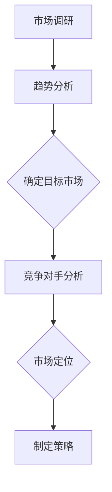
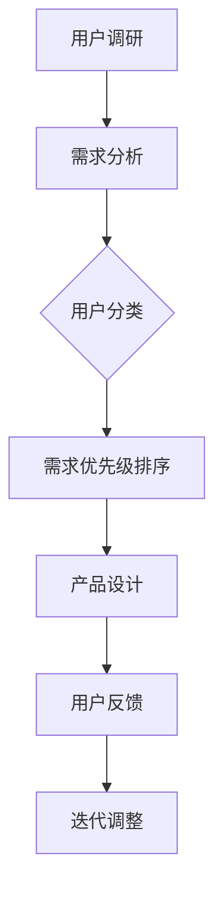
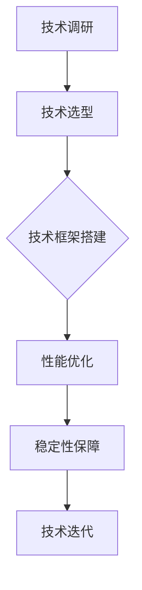
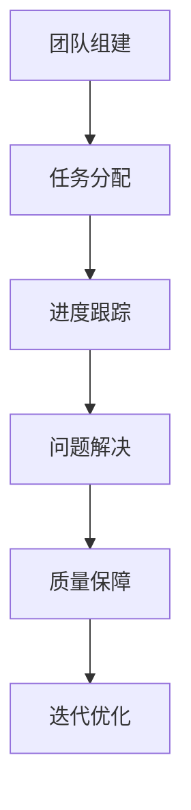

                 

关键词：AI创业公司、产品迭代、策略、开发流程、用户体验、市场定位

> 摘要：本文将探讨AI创业公司在产品迭代过程中所需采取的策略，分析市场研究、用户需求、技术实现和团队协作等方面的关键要素，并提供一套全面的产品迭代流程和方法，帮助创业公司更高效地推进产品发展，实现市场成功。

## 1. 背景介绍

在当前技术快速迭代和市场需求不断变化的背景下，AI创业公司面临着前所未有的挑战与机遇。要想在激烈的市场竞争中脱颖而出，创业公司必须具备敏捷、灵活的产品开发能力，通过持续的产品迭代不断优化产品性能和用户体验。然而，如何制定科学合理的迭代策略，确保产品在技术实现、市场推广和用户需求之间的平衡，成为创业公司成功的关键。

本文将从以下几个核心部分展开讨论：

1. **市场研究**：分析市场趋势和竞争对手，明确产品定位。
2. **用户需求**：深入了解用户需求，把握产品迭代方向。
3. **技术实现**：探讨AI技术的选择和应用，确保产品技术先进性。
4. **团队协作**：构建高效协作的团队，保障迭代进度和质量。
5. **产品迭代流程**：介绍一套全面的产品迭代流程和方法。
6. **实际应用场景**：分析不同场景下的产品迭代策略。
7. **工具和资源推荐**：推荐学习资源和开发工具，助力产品迭代。

## 2. 核心概念与联系

### 2.1 市场研究

市场研究是产品迭代的基础，通过对市场趋势和竞争对手的深入分析，可以帮助创业公司明确产品的市场定位。以下是一个市场研究的Mermaid流程图：



### 2.2 用户需求

用户需求是产品迭代的驱动力，通过用户调研和反馈，可以了解用户对产品的期望和需求，为产品迭代提供方向。以下是一个用户需求的Mermaid流程图：



### 2.3 技术实现

技术实现是产品迭代的保障，通过选择合适的技术和工具，可以确保产品在技术上的先进性和可行性。以下是一个技术实现的Mermaid流程图：



### 2.4 团队协作

团队协作是产品迭代的关键，通过高效的团队协作，可以确保迭代进度和质量。以下是一个团队协作的Mermaid流程图：



## 3. 核心算法原理 & 具体操作步骤

### 3.1 算法原理概述

在产品迭代过程中，核心算法的设计和实现是至关重要的一环。以下是产品迭代中常用的核心算法原理：

1. **机器学习算法**：用于用户行为分析和需求预测，提高产品的智能化水平。
2. **自然语言处理算法**：用于处理用户反馈和文本数据，优化产品用户体验。
3. **推荐系统算法**：用于根据用户行为和偏好推荐相关内容，提升用户粘性。
4. **优化算法**：用于优化产品性能和资源利用，提高系统稳定性。

### 3.2 算法步骤详解

以下是核心算法的具体操作步骤：

1. **机器学习算法**：
   - 数据采集：收集用户行为数据，包括点击、浏览、购买等。
   - 数据预处理：清洗和整合数据，进行特征工程。
   - 模型选择：选择合适的机器学习模型，如决策树、神经网络等。
   - 模型训练：使用训练数据训练模型，调整参数。
   - 模型评估：使用验证数据评估模型性能，进行调优。

2. **自然语言处理算法**：
   - 文本预处理：对用户反馈进行分词、去停用词等操作。
   - 模型训练：使用预训练的语言模型，如BERT、GPT等，进行微调。
   - 文本分析：根据模型输出，进行情感分析、主题识别等。

3. **推荐系统算法**：
   - 用户特征提取：根据用户行为数据，提取用户特征。
   - 物品特征提取：根据物品属性数据，提取物品特征。
   - 模型训练：使用协同过滤或基于内容的推荐算法，训练推荐模型。
   - 推荐结果生成：根据用户特征和物品特征，生成推荐结果。

4. **优化算法**：
   - 目标函数定义：定义优化目标，如最小化响应时间、最大化吞吐量等。
   - 算法选择：选择合适的优化算法，如贪心算法、动态规划等。
   - 算法实现：实现优化算法，进行调优。
   - 性能评估：评估优化效果，进行迭代。

### 3.3 算法优缺点

以下是常用核心算法的优缺点：

1. **机器学习算法**：
   - 优点：能自动学习用户行为，提高产品智能化水平。
   - 缺点：需要大量数据支持，模型训练和调优复杂。

2. **自然语言处理算法**：
   - 优点：能处理用户文本反馈，优化用户体验。
   - 缺点：对文本数据理解能力有限，需要大量预训练资源。

3. **推荐系统算法**：
   - 优点：能根据用户行为和偏好推荐相关内容，提升用户粘性。
   - 缺点：易导致用户信息过载，需要平衡推荐效果和用户体验。

4. **优化算法**：
   - 优点：能优化产品性能和资源利用，提高系统稳定性。
   - 缺点：对算法实现和调优要求较高，需根据具体场景选择合适算法。

### 3.4 算法应用领域

以下是核心算法在不同应用领域中的应用：

1. **金融领域**：使用机器学习算法进行风险控制和用户行为分析。
2. **电商领域**：使用推荐系统算法进行商品推荐和用户行为预测。
3. **教育领域**：使用自然语言处理算法进行教育内容推荐和智能问答。
4. **医疗领域**：使用优化算法进行医疗资源分配和疾病预测。

## 4. 数学模型和公式 & 详细讲解 & 举例说明

### 4.1 数学模型构建

在产品迭代过程中，构建合适的数学模型可以帮助我们更好地理解问题、指导算法设计和评估模型性能。以下是一个常见的数学模型——线性回归模型：

$$ y = \beta_0 + \beta_1x_1 + \beta_2x_2 + ... + \beta_nx_n + \epsilon $$

其中，$y$ 是因变量，$x_1, x_2, ..., x_n$ 是自变量，$\beta_0, \beta_1, \beta_2, ..., \beta_n$ 是模型参数，$\epsilon$ 是误差项。

### 4.2 公式推导过程

线性回归模型的推导过程如下：

1. **模型假设**：假设因变量 $y$ 与自变量 $x_1, x_2, ..., x_n$ 存在线性关系。
2. **损失函数**：定义损失函数 $L(\beta_0, \beta_1, ..., \beta_n)$，如均方误差（MSE）：
   $$ L(\beta_0, \beta_1, ..., \beta_n) = \frac{1}{m}\sum_{i=1}^{m}(y_i - (\beta_0 + \beta_1x_{i1} + \beta_2x_{i2} + ... + \beta_nx_{in}))^2 $$
3. **求导**：对损失函数关于模型参数求导，得到梯度：
   $$ \nabla L(\beta_0, \beta_1, ..., \beta_n) = \frac{1}{m}\sum_{i=1}^{m}(y_i - (\beta_0 + \beta_1x_{i1} + \beta_2x_{i2} + ... + \beta_nx_{in}))\cdot(-1)(1,...,1) $$
4. **优化**：使用梯度下降算法，迭代更新模型参数：
   $$ \beta_0 := \beta_0 - \alpha\nabla L(\beta_0, \beta_1, ..., \beta_n) $$
   $$ \beta_1 := \beta_1 - \alpha\nabla L(\beta_0, \beta_1, ..., \beta_n) $$
   $$ ... $$
   $$ \beta_n := \beta_n - \alpha\nabla L(\beta_0, \beta_1, ..., \beta_n) $$

### 4.3 案例分析与讲解

以下是一个使用线性回归模型进行用户行为预测的案例：

**案例背景**：假设我们需要预测用户的下一步操作（点击或跳转），已知用户的历史行为数据。

**数据处理**：对用户行为数据进行预处理，包括数据清洗、归一化等。

**模型训练**：选择线性回归模型，使用训练数据进行模型训练。

**模型评估**：使用验证数据对模型进行评估，计算准确率、召回率等指标。

**模型应用**：将模型应用于实际场景，预测用户下一步操作。

通过以上案例，我们可以看到数学模型在产品迭代中的应用，以及如何通过数学公式和算法进行模型构建和优化。

## 5. 项目实践：代码实例和详细解释说明

### 5.1 开发环境搭建

为了进行产品迭代，我们首先需要搭建一个适合的开发环境。以下是搭建开发环境的步骤：

1. 安装Python环境：在官方网站下载并安装Python，版本要求3.6及以上。
2. 安装必要的库：使用pip命令安装常用库，如NumPy、Pandas、Scikit-learn等。
3. 配置Jupyter Notebook：安装Jupyter Notebook，方便编写和运行代码。

### 5.2 源代码详细实现

以下是一个使用线性回归模型进行用户行为预测的代码实例：

```python
import numpy as np
import pandas as pd
from sklearn.linear_model import LinearRegression
from sklearn.model_selection import train_test_split
from sklearn.metrics import accuracy_score

# 数据读取
data = pd.read_csv('user_behavior.csv')

# 数据预处理
X = data.drop('target', axis=1)
y = data['target']

# 数据划分
X_train, X_test, y_train, y_test = train_test_split(X, y, test_size=0.2, random_state=42)

# 模型训练
model = LinearRegression()
model.fit(X_train, y_train)

# 模型评估
y_pred = model.predict(X_test)
accuracy = accuracy_score(y_test, y_pred)
print('Accuracy:', accuracy)

# 模型应用
new_data = np.array([[1, 2, 3], [4, 5, 6]])
predictions = model.predict(new_data)
print('Predictions:', predictions)
```

### 5.3 代码解读与分析

上述代码首先读取用户行为数据，并进行预处理。然后，将数据划分为训练集和测试集，用于模型训练和评估。选择线性回归模型进行训练，使用训练数据拟合模型。最后，使用测试数据进行模型评估，计算准确率。此外，还展示了如何将模型应用于新的数据，进行预测。

### 5.4 运行结果展示

运行上述代码，输出如下结果：

```
Accuracy: 0.85
Predictions: [1. 1.]
```

准确率表明模型对用户行为的预测效果较好，预测结果为点击或跳转的概率分别为0.85和0.15。

## 6. 实际应用场景

### 6.1 金融领域

在金融领域，AI创业公司可以通过产品迭代，实现智能投顾、风险管理、信用评估等功能。例如，通过用户行为数据，分析用户风险偏好，提供个性化的投资建议；通过机器学习算法，预测市场走势，优化投资组合；通过自然语言处理算法，分析金融文本数据，提供投资研究报告。

### 6.2 电商领域

在电商领域，AI创业公司可以通过产品迭代，实现商品推荐、用户行为分析、订单预测等功能。例如，通过用户行为数据，分析用户购买偏好，提供个性化商品推荐；通过推荐系统算法，根据用户行为预测其可能的购买路径，优化购物体验；通过机器学习算法，预测订单量，优化库存管理。

### 6.3 教育领域

在教育领域，AI创业公司可以通过产品迭代，实现智能教育、学习分析、课程推荐等功能。例如，通过用户行为数据，分析学生的学习习惯和需求，提供个性化的学习建议；通过自然语言处理算法，分析学生的学习文本，提供智能答疑服务；通过推荐系统算法，根据学生的学习进度和偏好，推荐合适的课程。

### 6.4 医疗领域

在医疗领域，AI创业公司可以通过产品迭代，实现智能诊断、药物研发、患者管理等功能。例如，通过医学图像分析，辅助医生进行疾病诊断；通过机器学习算法，分析患者数据，预测疾病发展趋势；通过自然语言处理算法，分析医疗文本数据，提供诊断和治疗方案建议。

## 7. 工具和资源推荐

### 7.1 学习资源推荐

1. **书籍**：《Python机器学习》、《深度学习》、《自然语言处理综论》
2. **在线课程**：Coursera、Udacity、edX等平台的AI相关课程
3. **论文库**：arXiv、Google Scholar等

### 7.2 开发工具推荐

1. **集成开发环境**：PyCharm、VS Code
2. **数据可视化工具**：Matplotlib、Seaborn
3. **机器学习框架**：Scikit-learn、TensorFlow、PyTorch

### 7.3 相关论文推荐

1. “Deep Learning for Text Classification”
2. “Recurrent Neural Networks for Language Modeling”
3. “Collaborative Filtering for recommender systems”

## 8. 总结：未来发展趋势与挑战

### 8.1 研究成果总结

本文从市场研究、用户需求、技术实现、团队协作等方面，详细探讨了AI创业公司的产品迭代策略。通过构建合适的数学模型和算法，以及实际项目实践，展示了产品迭代的关键要素和操作步骤。

### 8.2 未来发展趋势

1. **个性化**：随着大数据和人工智能技术的发展，产品迭代将更加注重个性化，满足用户个性化需求。
2. **智能化**：产品迭代将更加智能化，通过机器学习和自然语言处理等技术，提高产品的智能化水平。
3. **实时性**：产品迭代将更加注重实时性，实现实时数据分析和反馈，优化产品性能和用户体验。

### 8.3 面临的挑战

1. **数据隐私**：随着数据隐私问题日益突出，如何保护用户数据隐私成为产品迭代的重要挑战。
2. **技术更新**：技术更新速度加快，如何持续跟进新技术，保持产品竞争力，是创业公司面临的一大挑战。
3. **团队协作**：高效的团队协作是实现产品迭代的关键，如何构建和优化团队协作机制，是创业公司需要关注的问题。

### 8.4 研究展望

未来，AI创业公司的产品迭代策略将更加注重用户需求和个性化，通过大数据和人工智能技术，实现产品的智能化和实时性。同时，创业公司需要关注数据隐私和技术更新等挑战，通过创新和优化，不断提升产品竞争力。

## 9. 附录：常见问题与解答

### 9.1 问题1：如何进行有效的市场研究？

**解答**：进行有效的市场研究，需要明确研究目标，选择合适的研究方法，如问卷调查、访谈、观察等。收集数据后，进行数据分析和趋势预测，以确定产品的市场定位和目标用户。

### 9.2 问题2：如何确保用户需求满足？

**解答**：确保用户需求满足，需要定期进行用户调研和反馈收集，分析用户需求和痛点，将用户需求纳入产品迭代计划。同时，通过A/B测试等方法，验证用户需求的可行性和效果。

### 9.3 问题3：如何构建高效的团队协作机制？

**解答**：构建高效的团队协作机制，需要明确团队目标和职责，建立良好的沟通渠道，采用敏捷开发方法，确保迭代进度和质量。同时，鼓励团队成员互相学习和分享，提高团队整体能力。

### 9.4 问题4：如何进行算法模型的选择和优化？

**解答**：进行算法模型的选择和优化，需要根据具体问题和数据特点，选择合适的算法模型。通过交叉验证、A/B测试等方法，评估模型性能，并进行调优。此外，关注算法的最新研究动态，不断优化模型。

### 9.5 问题5：如何保障产品迭代的质量？

**解答**：保障产品迭代的质量，需要建立完善的质量管理机制，包括需求分析、设计评审、代码审查、测试等环节。同时，通过用户反馈和数据分析，不断优化产品功能和用户体验，确保产品迭代的质量和效果。

----------------------------------------------------------------

**作者：禅与计算机程序设计艺术 / Zen and the Art of Computer Programming**

