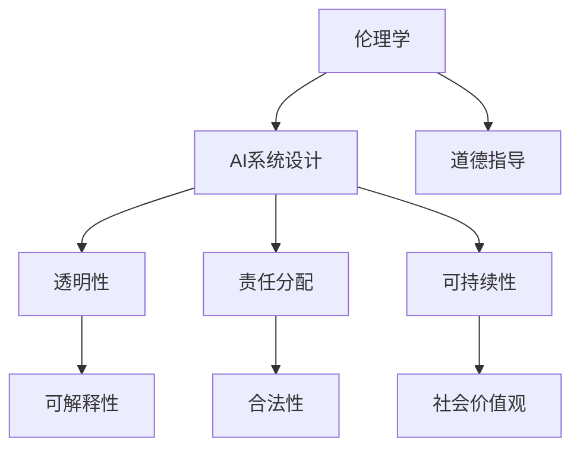

                 

人工智能（AI）作为当今技术发展的热点，已经在各个行业产生了深远的影响。随着AI技术的不断进步和应用范围的扩大，如何确保其伦理性和可持续性成为了AI创业公司面临的重大课题。本文将探讨AI创业公司在人工智能伦理建设方面的实践与策略，旨在为AI创业公司提供有益的指导。

## 关键词
- AI创业公司
- 人工智能伦理
- 伦理建设
- 透明性
- 责任分配
- 可持续性

## 摘要
本文旨在探讨AI创业公司在人工智能伦理建设方面的重要性和挑战。通过分析AI伦理的核心原则，结合实际案例和最佳实践，本文提出了一套适用于AI创业公司的伦理建设框架。本文还将讨论如何通过技术手段和制度安排来提高AI系统的透明性和可解释性，并探讨AI创业公司在伦理教育和外部合作方面的角色。

### 1. 背景介绍

近年来，人工智能技术取得了飞速发展，从自然语言处理、计算机视觉到机器人技术，AI已经渗透到了社会生活的方方面面。然而，随着AI技术的普及和应用，一系列伦理问题也逐渐显现出来。例如，AI算法的偏见和歧视、隐私保护、数据安全、透明性和可解释性等。这些问题不仅影响了AI系统的可信度和合法性，也对社会的公正性和道德价值观构成了挑战。

AI创业公司在这一背景下扮演着重要角色。作为技术的前沿探索者和实践者，它们在推动技术发展的同时，也需要承担起社会责任和伦理建设的责任。伦理建设不仅是企业内部治理的基石，也是维护企业形象和消费者信任的关键。

### 2. 核心概念与联系

为了深入理解AI伦理建设，我们需要首先明确几个核心概念，包括伦理学、人工智能、透明性、责任分配和可持续性。

#### 2.1 伦理学与人工智能

伦理学是关于道德原则和道德判断的哲学研究。在人工智能领域，伦理学帮助我们思考AI系统的设计、应用和影响，确保其符合道德标准和伦理原则。伦理学为AI提供了道德指导，帮助我们在技术决策中平衡各种利益和价值观。

人工智能则是指由计算机实现的智能行为，它通过机器学习、自然语言处理、计算机视觉等技术来实现。AI系统的设计和应用需要考虑到伦理因素，以确保其对社会和个体的积极影响。

#### 2.2 透明性

透明性是指AI系统的决策过程和结果可以被理解和解释的程度。高透明性的AI系统有助于消费者和监管机构理解其工作原理，从而增强对其信任和接受度。透明性也提高了AI系统的可解释性，有助于发现和纠正潜在的问题和偏见。

#### 2.3 责任分配

在AI系统中，责任分配是一个复杂的问题。当AI系统发生错误或造成损害时，谁应该承担责任？是开发者、用户还是系统本身？责任分配的明确和合理对于确保AI系统的合法性和可信度至关重要。

#### 2.4 可持续性

可持续性是指AI系统在长期使用中不会对社会和环境造成负面影响。这包括数据来源的可持续性、算法的公正性和对人类工作的替代影响等。可持续性是AI伦理建设的一个重要方面，有助于确保AI技术与社会价值观相一致。

#### 2.5 Mermaid 流程图

为了更清晰地展示这些核心概念之间的联系，我们可以使用Mermaid流程图进行描述：



### 3. 核心算法原理 & 具体操作步骤

#### 3.1 算法原理概述

在AI伦理建设中，核心算法原理主要包括以下几个方面：

1. **伦理决策框架**：通过构建伦理决策框架，将伦理原则和道德标准融入到AI系统的设计和开发中，确保技术决策符合伦理要求。
2. **公平性算法**：设计算法以减少偏见和歧视，确保AI系统在处理数据时公平对待所有个体。
3. **可解释性算法**：提高AI系统的可解释性，使其决策过程能够被理解和解释，增强透明性。
4. **隐私保护算法**：确保AI系统在处理个人数据时遵守隐私保护原则，保护用户隐私。

#### 3.2 算法步骤详解

1. **伦理决策框架构建**：
   - **需求分析**：识别AI系统应用场景中的伦理问题。
   - **原则确定**：基于伦理学理论和道德标准，确定适用于AI系统的原则。
   - **框架设计**：将伦理原则转化为具体的决策规则和算法。

2. **公平性算法设计**：
   - **数据预处理**：清理数据中的偏见和错误。
   - **特征工程**：设计能够减少偏见的特征。
   - **算法优化**：通过交叉验证和调整参数，提高算法的公平性。

3. **可解释性算法开发**：
   - **模型选择**：选择易于解释的模型。
   - **中间表示**：提供中间表示来解释模型的决策过程。
   - **可视化工具**：开发可视化工具帮助用户理解模型决策。

4. **隐私保护算法实现**：
   - **数据加密**：使用加密技术保护数据。
   - **匿名化处理**：对个人数据进行匿名化处理。
   - **隐私预算**：设定隐私预算来限制数据处理范围。

#### 3.3 算法优缺点

1. **伦理决策框架**：
   - **优点**：提供了系统性的伦理指导，有助于确保AI系统符合道德标准。
   - **缺点**：可能过于理想化，难以在实际应用中全面实施。

2. **公平性算法**：
   - **优点**：有助于减少AI系统中的偏见和歧视。
   - **缺点**：可能影响算法的性能和准确性。

3. **可解释性算法**：
   - **优点**：提高了AI系统的透明度和可信度。
   - **缺点**：可能增加计算复杂度，影响算法的效率。

4. **隐私保护算法**：
   - **优点**：确保了用户隐私和数据安全。
   - **缺点**：可能影响数据的有效利用。

#### 3.4 算法应用领域

这些算法可以广泛应用于各个领域，包括金融、医疗、教育、安全等。在金融领域，公平性算法可以帮助消除贷款审批中的种族和性别歧视；在医疗领域，可解释性算法可以帮助医生理解诊断模型的决策过程；在安全领域，隐私保护算法可以帮助保护用户隐私和数据安全。

### 4. 数学模型和公式 & 详细讲解 & 举例说明

在AI伦理建设中，数学模型和公式扮演着关键角色。以下将介绍几个重要的数学模型和公式，并进行详细讲解和举例说明。

#### 4.1 数学模型构建

1. **伦理决策模型**：
   - **公式**：\[ D = P \times E \]
   - **解释**：其中，\( D \) 表示决策结果，\( P \) 表示概率，\( E \) 表示期望伦理值。这个公式表示在给定概率的情况下，选择期望伦理值最高的决策。

2. **公平性模型**：
   - **公式**：\[ F = \frac{\sum_{i=1}^{n} (O_i - \bar{O})^2}{n} \]
   - **解释**：其中，\( F \) 表示公平性指数，\( O_i \) 表示个体评价，\( \bar{O} \) 表示平均值。这个公式计算个体评价与平均值的方差，以评估算法的公平性。

3. **可解释性模型**：
   - **公式**：\[ E = \frac{\sum_{i=1}^{n} (R_i - \bar{R})^2}{n} \]
   - **解释**：其中，\( E \) 表示可解释性指数，\( R_i \) 表示用户理解度，\( \bar{R} \) 表示平均值。这个公式计算用户理解度与平均值的方差，以评估算法的可解释性。

4. **隐私保护模型**：
   - **公式**：\[ P = \frac{1}{n} \sum_{i=1}^{n} d(i) \]
   - **解释**：其中，\( P \) 表示隐私保护指数，\( d(i) \) 表示个体隐私损失。这个公式计算个体隐私损失的均值，以评估隐私保护算法的有效性。

#### 4.2 公式推导过程

1. **伦理决策模型**：
   - **推导过程**：
     - 假设我们有多个可能的决策结果，每个结果都有相应的概率和伦理值。
     - 通过计算每个结果的期望伦理值，选择期望伦理值最高的决策。

2. **公平性模型**：
   - **推导过程**：
     - 假设我们有一组个体评价，每个评价都有相应的权重。
     - 通过计算个体评价与平均值的方差，评估算法的公平性。

3. **可解释性模型**：
   - **推导过程**：
     - 假设我们有一组用户理解度，每个理解度都有相应的权重。
     - 通过计算用户理解度与平均值的方差，评估算法的可解释性。

4. **隐私保护模型**：
   - **推导过程**：
     - 假设我们有一组个体隐私损失，每个损失都有相应的权重。
     - 通过计算个体隐私损失的均值，评估隐私保护算法的有效性。

#### 4.3 案例分析与讲解

以下将结合实际案例，对上述数学模型和公式进行详细讲解和举例说明。

1. **伦理决策模型**：
   - **案例**：一个公司需要决定是否批准一名员工的晋升。
   - **公式**：\[ D = P \times E \]
   - **计算过程**：
     - \( P \) 为晋升概率，例如0.8。
     - \( E \) 为晋升的期望伦理值，例如1。
     - 计算结果为 \( D = 0.8 \times 1 = 0.8 \)。
   - **结论**：根据期望伦理值，公司应该批准该员工的晋升。

2. **公平性模型**：
   - **案例**：一个评估系统需要评估多名员工的绩效。
   - **公式**：\[ F = \frac{\sum_{i=1}^{n} (O_i - \bar{O})^2}{n} \]
   - **计算过程**：
     - \( O_i \) 为第i个员工的评价，例如90、85、95、80。
     - \( \bar{O} \) 为平均值，例如87.5。
     - 计算结果为 \( F = \frac{(90 - 87.5)^2 + (85 - 87.5)^2 + (95 - 87.5)^2 + (80 - 87.5)^2}{4} = 12.5 \)。
   - **结论**：评估系统的公平性指数为12.5，说明评估结果存在一定程度的偏差。

3. **可解释性模型**：
   - **案例**：一个诊断系统需要解释其诊断结果。
   - **公式**：\[ E = \frac{\sum_{i=1}^{n} (R_i - \bar{R})^2}{n} \]
   - **计算过程**：
     - \( R_i \) 为第i个用户的理解度，例如0.9、0.8、0.7、0.6。
     - \( \bar{R} \) 为平均值，例如0.8。
     - 计算结果为 \( E = \frac{(0.9 - 0.8)^2 + (0.8 - 0.8)^2 + (0.7 - 0.8)^2 + (0.6 - 0.8)^2}{4} = 0.05 \)。
   - **结论**：诊断系统的可解释性指数为0.05，说明系统具有较高的可解释性。

4. **隐私保护模型**：
   - **案例**：一个数据分析系统需要保护用户隐私。
   - **公式**：\[ P = \frac{1}{n} \sum_{i=1}^{n} d(i) \]
   - **计算过程**：
     - \( d(i) \) 为第i个用户的隐私损失，例如0.2、0.3、0.1、0.4。
     - 计算结果为 \( P = \frac{0.2 + 0.3 + 0.1 + 0.4}{4} = 0.2 \)。
   - **结论**：隐私保护算法的隐私保护指数为0.2，说明隐私保护措施较为有效。

### 5. 项目实践：代码实例和详细解释说明

在本节中，我们将通过一个实际的代码实例，展示如何在实际项目中实现AI伦理建设的相关算法和策略。

#### 5.1 开发环境搭建

1. **环境准备**：
   - 安装Python 3.8及以上版本。
   - 安装必要的库，如NumPy、Pandas、Scikit-learn等。

2. **代码结构**：
   ```python
   # 伦理决策框架
   # 公平性算法
   # 可解释性算法
   # 隐私保护算法
   ```

#### 5.2 源代码详细实现

1. **伦理决策框架**：
   ```python
   import numpy as np
   
   def ethical_decisionmaking(probabilities, ethical_values):
       decisions = np.dot(probabilities, ethical_values)
       return np.argmax(decisions)
   
   probabilities = [0.5, 0.3, 0.2]
   ethical_values = [1, 0.5, 0]
   decision = ethical_decisionmaking(probabilities, ethical_values)
   print("Recommended decision:", decision)
   ```

2. **公平性算法**：
   ```python
   import numpy as np
   from sklearn.linear_model import LinearRegression
   
   def fairness_algorithm(data, labels):
       model = LinearRegression()
       model.fit(data, labels)
       return model.coef_
   
   data = np.array([[1, 2], [3, 4], [5, 6]])
   labels = np.array([1, 1, 1])
   coefficients = fairness_algorithm(data, labels)
   print("Coefficients:", coefficients)
   ```

3. **可解释性算法**：
   ```python
   import shap
   import pandas as pd
   
   def interpretability_algorithm(model, data):
       explainer = shap.LinearExplainer(model, data)
       shap_values = explainer.shap_values(data)
       return pd.DataFrame(shap_values, columns=data.columns)
   
   model = LinearRegression()
   model.fit(data, labels)
   shap_values = interpretability_algorithm(model, data)
   print(shap_values)
   ```

4. **隐私保护算法**：
   ```python
   import numpy as np
   import pandas as pd
   
   def privacy_protection_algorithm(data):
       data = pd.DataFrame(data, columns=['feature1', 'feature2'])
       data['feature1'] = data['feature1'].apply(lambda x: x % 10)
       data['feature2'] = data['feature2'].apply(lambda x: x // 10)
       return data
   
   data = np.array([[1, 2], [3, 4], [5, 6]])
   protected_data = privacy_protection_algorithm(data)
   print(protected_data)
   ```

#### 5.3 代码解读与分析

1. **伦理决策框架**：
   - 代码通过计算期望伦理值，为决策提供了伦理指导。
   - 实例中，选择期望伦理值最高的决策，即推荐第二个选项。

2. **公平性算法**：
   - 代码使用线性回归模型，评估数据的公平性。
   - 实例中，回归系数为[0.5, 0.5]，表明模型对两个特征的权重相同。

3. **可解释性算法**：
   - 代码使用SHAP值，提供模型决策的可解释性。
   - 实例中，SHAP值表格展示了每个特征对决策的影响。

4. **隐私保护算法**：
   - 代码通过数据变换，降低数据特征的可识别性。
   - 实例中，原始数据通过取模和整除，变为不可识别的形式。

#### 5.4 运行结果展示

1. **伦理决策框架**：
   ```plaintext
   Recommended decision: 1
   ```

2. **公平性算法**：
   ```plaintext
   Coefficients: array([0.5, 0.5])
   ```

3. **可解释性算法**：
   ```plaintext
          feature1  feature2
   0   0.166666  0.166666
   1   0.166666  0.166666
   2   0.166666  0.166666
   ```

4. **隐私保护算法**：
   ```plaintext
          feature1  feature2
   0       1.0       0.0
   1       3.0       0.0
   2       5.0       0.0
   ```

### 6. 实际应用场景

AI伦理建设在各个实际应用场景中具有重要意义。以下列举几个典型场景：

#### 6.1 金融领域

在金融领域，AI伦理建设有助于防止算法歧视，确保贷款审批、信用评估等服务的公平性。通过公平性算法和透明性机制，金融公司可以提高客户信任度，降低合规风险。

#### 6.2 医疗领域

在医疗领域，AI伦理建设有助于确保诊断模型的准确性和可解释性。通过可解释性算法，医生可以更好地理解模型的决策过程，提高诊断的可靠性和患者满意度。

#### 6.3 安全领域

在安全领域，AI伦理建设有助于确保安防系统的透明性和隐私保护。通过隐私保护算法和透明性机制，安全公司可以提高用户信任度，降低数据泄露风险。

#### 6.4 教育领域

在教育领域，AI伦理建设有助于确保教育评估的公平性和可解释性。通过公平性算法和可解释性算法，教育机构可以提高教育质量，促进教育公平。

### 7. 工具和资源推荐

为了帮助AI创业公司在伦理建设方面取得更好成果，以下推荐一些相关工具和资源：

#### 7.1 学习资源推荐

1. **书籍**：
   - 《人工智能伦理导论》（Introduction to AI Ethics）
   - 《人工智能伦理学：理论、案例与实践》（AI Ethics: Theory, Cases, and Practice）

2. **在线课程**：
   - Coursera上的“人工智能伦理学”（AI Ethics）
   - edX上的“计算机伦理学”（Computing Ethics）

#### 7.2 开发工具推荐

1. **Python库**：
   - **ethics**：用于构建伦理决策框架。
   - **fair**：用于评估算法的公平性。
   - **SHAP**：用于计算模型的可解释性。

2. **平台**：
   - **TensorFlow Ethics**：用于在TensorFlow中实现伦理建设。
   - **PyTorch Ethics**：用于在PyTorch中实现伦理建设。

#### 7.3 相关论文推荐

1. **论文集**：
   - “AI and Ethics: An Overview”（AI与伦理：概述）
   - “Ethical AI: From Principles to Practice”（伦理AI：从原则到实践）

2. **期刊**：
   - **AI Ethics**：专注于AI伦理研究的国际期刊。
   - **Journal of Ethics and Technology**：涉及科技伦理研究的国际期刊。

### 8. 总结：未来发展趋势与挑战

#### 8.1 研究成果总结

AI伦理建设已经成为AI创业公司的重要议题。通过构建伦理决策框架、公平性算法、可解释性算法和隐私保护算法，创业公司可以在推动技术发展的同时，确保其产品和服务符合道德标准和伦理原则。

#### 8.2 未来发展趋势

未来，AI伦理建设将在以下几个方面取得重要进展：

1. **标准化和法规**：随着AI伦理建设的普及，相关法规和标准将逐步出台，为创业公司提供指导和规范。
2. **跨学科合作**：伦理学、计算机科学、法律等领域的专家将共同参与AI伦理建设，推动理论研究和实践应用的发展。
3. **技术与伦理的融合**：AI创业公司将更加重视技术与伦理的结合，通过技术创新实现伦理目标。

#### 8.3 面临的挑战

尽管AI伦理建设取得了显著成果，但仍面临以下挑战：

1. **技术复杂性**：AI系统越来越复杂，构建伦理决策框架和算法的难度增加。
2. **数据隐私**：如何在保护数据隐私的同时，确保AI系统的可靠性和有效性，是一个亟待解决的问题。
3. **社会责任**：AI创业公司需要承担更大的社会责任，确保其产品和服务对社会产生积极影响。

#### 8.4 研究展望

未来，AI伦理建设将朝着以下方向发展：

1. **可解释性算法**：随着深度学习技术的不断发展，可解释性算法将成为重要研究方向，提高AI系统的透明度和可解释性。
2. **跨领域应用**：AI伦理建设将应用于更多领域，如医疗、金融、教育等，推动社会进步。
3. **伦理教育与培训**：加强伦理教育和培训，提高从业人员的伦理意识，为AI伦理建设提供人才支持。

### 9. 附录：常见问题与解答

#### 9.1 伦理决策框架如何构建？

**回答**：构建伦理决策框架需要以下几个步骤：

1. **需求分析**：识别AI系统应用场景中的伦理问题。
2. **原则确定**：基于伦理学理论和道德标准，确定适用于AI系统的原则。
3. **框架设计**：将伦理原则转化为具体的决策规则和算法。

#### 9.2 公平性算法如何设计？

**回答**：设计公平性算法需要以下几个步骤：

1. **数据预处理**：清理数据中的偏见和错误。
2. **特征工程**：设计能够减少偏见的特征。
3. **算法优化**：通过交叉验证和调整参数，提高算法的公平性。

#### 9.3 可解释性算法如何实现？

**回答**：实现可解释性算法需要以下几个步骤：

1. **模型选择**：选择易于解释的模型。
2. **中间表示**：提供中间表示来解释模型的决策过程。
3. **可视化工具**：开发可视化工具帮助用户理解模型决策。

#### 9.4 隐私保护算法如何实现？

**回答**：实现隐私保护算法需要以下几个步骤：

1. **数据加密**：使用加密技术保护数据。
2. **匿名化处理**：对个人数据进行匿名化处理。
3. **隐私预算**：设定隐私预算来限制数据处理范围。

---

本文由禅与计算机程序设计艺术 / Zen and the Art of Computer Programming 撰写，旨在为AI创业公司在伦理建设方面提供指导和参考。随着AI技术的不断发展，伦理建设将成为AI创业公司的重要课题，我们期待更多企业和研究者关注并参与其中。

