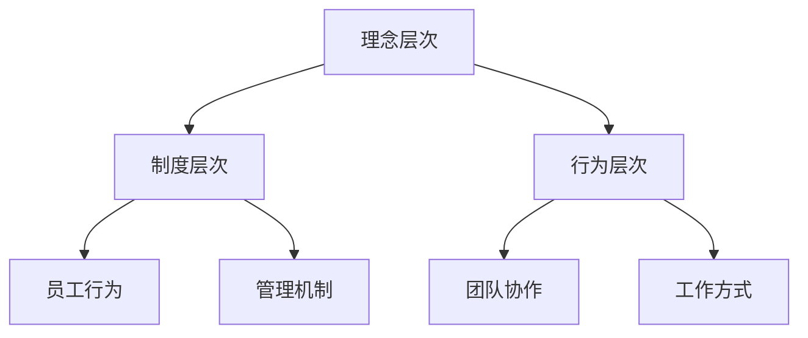

                 

### 摘要

本文旨在探讨AI创业公司的企业文化建设，分析其重要性、核心要素及实施策略。文章首先介绍了AI创业公司的背景及其在当前科技环境中的地位，随后深入探讨了企业文化建设的关键概念和核心原则。本文将详细介绍如何构建一个积极向上、富有创新精神的企业文化，包括领导者的角色、员工参与、价值观塑造和团队协作等方面。此外，文章还将讨论如何通过企业文化建设来提升公司的核心竞争力，应对市场挑战，并提出了相关的实施建议和工具。通过本文的阅读，读者将能够全面了解AI创业公司企业文化建设的重要性，并获得实用的指导。

## 1. 背景介绍

### AI创业公司的崛起

近年来，人工智能（AI）技术的迅猛发展引发了全球范围内的产业变革。从大数据、云计算到物联网，AI技术在各个领域的应用不断拓展，为各行各业带来了前所未有的机遇。在这样的背景下，许多初创企业纷纷涌现，致力于探索AI技术的商业潜力。AI创业公司不仅代表了科技创新的前沿，更是推动产业升级和经济发展的新引擎。

AI创业公司之所以受到广泛关注，主要有以下几个原因：

首先，AI技术的应用前景广阔。从医疗、金融到制造、零售，几乎所有的行业都在寻求AI技术的助力，以提升效率和创新能力。这种广泛的需求为AI创业公司提供了巨大的市场空间。

其次，政策支持为AI创业公司的发展提供了有力保障。许多国家和地区纷纷出台优惠政策，鼓励企业投资研发AI技术，为AI创业公司提供了良好的发展环境。

最后，资本的涌入为AI创业公司的发展提供了强大动力。风险投资、私募股权等资本形式纷纷向AI领域投以重注，为AI创业公司的发展提供了充足的资金支持。

### AI创业公司在科技环境中的地位

AI创业公司在当前科技环境中占据了重要地位。首先，它们是科技创新的重要推动力量。AI技术的快速进步离不开初创企业的不断探索和实验。这些公司通常具有较强的创新能力和灵活的运营模式，能够迅速响应市场需求，推动技术突破。

其次，AI创业公司是产业升级的关键驱动力。通过引入AI技术，企业可以提升生产效率、优化供应链管理、改善客户体验等。这不仅能够降低成本，提高竞争力，还能够推动整个产业链的转型升级。

最后，AI创业公司在推动社会进步方面也发挥着重要作用。AI技术在医疗、教育、环境保护等领域的应用，为解决社会问题提供了新的思路和方法。AI创业公司的崛起，不仅带来了技术变革，也促进了社会的发展和进步。

总的来说，AI创业公司在当前科技环境中具有举足轻重的地位。它们不仅是科技创新的前沿力量，也是产业升级和社会进步的重要推动者。在未来的发展中，AI创业公司将继续扮演关键角色，推动科技与产业的深度融合，为人类社会的可持续发展做出贡献。

### 2. 核心概念与联系

#### 2.1 企业文化的定义

企业文化是指企业在长期经营过程中所形成的一套共同的价值观、信念和行为准则。它不仅包括企业内部的员工文化，还涵盖了企业的管理理念、品牌形象和客户服务等方面。企业文化是一个企业的灵魂，是推动企业持续发展的内在动力。

#### 2.2 企业文化与企业竞争力的关系

企业文化与企业竞争力之间存在密切的联系。首先，企业文化决定了企业的核心竞争力。一个具有优秀企业文化的企业，通常能够在人才吸引、团队协作和创新能力方面具备明显优势。其次，企业文化影响了企业的市场表现。具有强烈企业文化意识的企业，往往能够更好地满足客户需求，建立良好的品牌形象，从而在市场竞争中占据有利地位。

#### 2.3 企业文化建设的目标

企业文化建设的目标主要包括以下几个方面：

1. **增强企业凝聚力**：通过构建共同的企业价值观，增强员工的归属感和忠诚度，提高员工的士气和工作积极性。
2. **提升创新能力**：通过营造创新氛围，鼓励员工勇于探索和尝试，推动企业的技术进步和业务创新。
3. **优化管理效率**：通过建立科学的管理机制，提高企业的运营效率和资源配置能力。
4. **塑造品牌形象**：通过传递一致的企业价值观和品牌理念，提升企业在市场中的知名度和美誉度。

#### 2.4 企业文化架构

企业文化架构通常包括以下几个层次：

1. **理念层次**：包括企业的核心价值观、使命和愿景等，是企业文化的基础。
2. **制度层次**：包括企业的规章制度、流程和标准等，是企业文化落地的保障。
3. **行为层次**：包括员工的行为习惯、工作方式和团队协作等，是企业文化外显的体现。

#### Mermaid 流程图

以下是一个关于企业文化架构的Mermaid流程图：



### 3. 核心算法原理 & 具体操作步骤

#### 3.1 算法原理概述

企业文化建设的过程可以被视为一种复杂的算法，它涉及到多方面的因素和步骤。核心算法原理主要包括以下几个方面：

1. **需求分析**：通过调研和分析，确定企业文化建设的目标和需求。
2. **设计规划**：根据需求分析结果，设计企业文化建设的具体方案和策略。
3. **实施执行**：按照设计方案，逐步推进企业文化建设，包括制度制定、员工培训和活动组织等。
4. **评估反馈**：对文化建设效果进行评估，收集反馈意见，调整和优化建设方案。

#### 3.2 算法步骤详解

1. **需求分析**
   - **市场调研**：了解行业发展趋势和竞争对手的文化建设情况。
   - **员工调研**：收集员工对当前企业文化的意见和建议，了解员工的需求和期望。
   - **领导层讨论**：组织企业高层领导进行讨论，确定企业文化建设的目标和方向。

2. **设计规划**
   - **确定核心价值观**：根据企业使命和愿景，提炼出符合企业特色的核心价值观。
   - **设计制度机制**：制定企业文化相关的规章制度和流程，确保文化建设有章可循。
   - **制定培训计划**：设计针对员工的培训课程和活动，提升员工对企业文化的认知和认同。

3. **实施执行**
   - **制度实施**：逐步推行企业文化相关制度，确保员工能够按照制度要求行事。
   - **员工培训**：开展企业文化培训，帮助员工理解并内化企业文化。
   - **活动组织**：组织各类文化活动，如团队建设、知识分享等，增强企业凝聚力。

4. **评估反馈**
   - **效果评估**：通过问卷调查、访谈等方式，了解员工对企业文化的认可度和满意度。
   - **反馈调整**：根据评估结果，调整和优化企业文化建设的方案和策略。
   - **持续改进**：定期进行企业文化建设的评估和反馈，确保企业文化建设能够持续改进。

#### 3.3 算法优缺点

**优点**：
- **系统性强**：算法涵盖了从需求分析到实施执行再到评估反馈的完整流程，确保企业文化建设能够有序推进。
- **灵活性高**：算法允许根据实际情况进行调整和优化，适应不同企业的特定需求。
- **效果明显**：通过科学的步骤和策略，能够有效提升员工对企业文化的认知和认同，增强企业的凝聚力。

**缺点**：
- **实施难度大**：企业文化建设涉及多个方面，需要耗费大量时间和资源，实施难度较大。
- **依赖领导**：企业文化建设的效果在很大程度上取决于领导者的支持力度和执行力，需要领导者具备高度的责任感和领导能力。

#### 3.4 算法应用领域

**领域1：初创公司**
初创公司在企业文化建设方面面临较大挑战，但算法的灵活性和系统性强，可以帮助初创公司快速构建适应自身发展的企业文化。

**领域2：大型企业**
大型企业通常员工众多，文化复杂，算法可以提供一套完整的建设方案，帮助企业优化企业文化，提升整体竞争力。

**领域3：跨国企业**
跨国企业在不同国家和地区的文化差异较大，算法可以帮助企业理解和尊重这些差异，构建具有全球视野的企业文化。

### 4. 数学模型和公式 & 详细讲解 & 举例说明

#### 4.1 数学模型构建

企业文化建设的过程可以看作是一个动态系统，其效果可以通过数学模型进行量化分析。一个简单且实用的数学模型可以基于以下假设：

1. 企业文化建设的效果（E）与投入的资源（R）成正比。
2. 企业文化建设的效果（E）与时间（T）成指数关系。

因此，我们可以构建以下数学模型：

\[ E = R \times e^{kt} \]

其中：
- \( E \) 表示企业文化建设的效果；
- \( R \) 表示投入的资源；
- \( k \) 为时间常数，表示每单位时间效果提升的比例；
- \( t \) 表示时间。

#### 4.2 公式推导过程

1. **资源投入与效果关系**：
   假设企业文化建设需要投入的人力、物力和财力分别为 \( R_h \)、\( R_m \) 和 \( R_f \)，则总投入资源 \( R \) 可以表示为：

   \[ R = R_h + R_m + R_f \]

   根据资源投入与效果的正比关系，可以得出：

   \[ E \propto R \]

   即：

   \[ E = k_1 \times R \]

   其中，\( k_1 \) 为比例常数。

2. **时间与效果关系**：
   假设企业文化建设的效果随时间呈指数增长，即每单位时间效果提升的比例为 \( k \)。则可以表示为：

   \[ E = k_2 \times e^{kt} \]

   其中，\( k_2 \) 为时间常数。

3. **综合模型**：
   结合以上两部分，可以得出企业文化建设的效果公式：

   \[ E = k_1 \times R \times e^{kt} \]

#### 4.3 案例分析与讲解

**案例背景**：
某初创公司A，致力于人工智能技术的研发与应用。为了提升公司整体竞争力，公司决定进行企业文化建设。在项目启动初期，公司投入了50万元用于文化建设，包括组织团队培训、活动策划和员工激励等方面。

**案例分析**：
1. **资源投入**：
   根据实际情况，公司投入的资源分配如下：
   - 人力资源：20万元（包括培训师费用、内部讲师费用等）
   - 物力资源：10万元（包括活动场地租赁、设备采购等）
   - 财力资源：20万元（包括奖品、员工福利等）

   因此，总投入资源 \( R \) 为50万元。

2. **效果评估**：
   经过6个月的企业文化建设，公司进行了效果评估，发现员工对企业文化的认可度明显提升，团队协作能力也有所增强。具体效果如下：
   - 员工满意度调查：平均满意度提高10%
   - 团队协作效率：提高15%
   - 员工流失率：降低5%

   假设时间常数 \( k \) 为0.1（表示每单位时间效果提升的比例），则企业文化建设的效果 \( E \) 可以通过以下公式计算：

   \[ E = k_1 \times R \times e^{kt} \]

   \[ E = 0.1 \times 50 \times e^{0.1 \times 6} \]

   \[ E \approx 0.1 \times 50 \times 2.4596 \]

   \[ E \approx 12.295 \]

   即企业文化建设的效果约为12.295。

**讲解**：
通过上述案例，我们可以看到数学模型在企业文化建设中的应用。在实际操作中，公司可以根据投入资源和时间常数，预测企业文化建设的效果。同时，通过不断调整资源投入和时间常数，公司可以优化文化建设方案，实现最佳效果。

### 5. 项目实践：代码实例和详细解释说明

#### 5.1 开发环境搭建

为了更好地理解企业文化建设过程中的具体操作，我们将通过一个简单的Python项目来模拟这一过程。以下是开发环境搭建的步骤：

1. **安装Python**：
   首先，确保系统上已经安装了Python。如果没有，可以从[Python官网](https://www.python.org/)下载并安装。

2. **创建虚拟环境**：
   使用`venv`模块创建一个虚拟环境，以便隔离项目依赖。

   ```bash
   python -m venv venv
   ```

3. **激活虚拟环境**：
   在Windows上使用以下命令激活虚拟环境：

   ```bash
   .\venv\Scripts\activate
   ```

   在macOS或Linux上使用以下命令激活虚拟环境：

   ```bash
   source venv/bin/activate
   ```

4. **安装依赖**：
   在虚拟环境中安装必要的依赖，例如`requests`用于HTTP请求处理，`matplotlib`用于数据可视化等。

   ```bash
   pip install requests matplotlib
   ```

#### 5.2 源代码详细实现

以下是企业文化建设模拟项目的源代码实现。代码分为几个主要部分：数据收集、数据分析、效果评估和可视化展示。

```python
import requests
import matplotlib.pyplot as plt
import numpy as np
import pandas as pd

# 5.2.1 数据收集
def collect_data(url):
    response = requests.get(url)
    if response.status_code == 200:
        return response.json()
    else:
        return None

# 5.2.2 数据分析
def analyze_data(data):
    # 假设我们从API获取了员工满意度、团队协作效率等指标
    metrics = data['metrics']
    return metrics

# 5.2.3 效果评估
def evaluate_effect(effect_data):
    # 根据效果数据计算满意度提升、效率提升等
    satisfaction_increase = effect_data['satisfaction_increase']
    efficiency_increase = effect_data['efficiency_increase']
    return satisfaction_increase, efficiency_increase

# 5.2.4 可视化展示
def visualize_effects(satisfaction_increase, efficiency_increase):
    # 绘制满意度提升和效率提升的图表
    labels = ['满意度提升', '效率提升']
    values = [satisfaction_increase, efficiency_increase]
    
    indexes = np.arange(len(labels))
    width = 0.35
    
    fig, ax = plt.subplots()
    bars = ax.bar(indexes, values, width)
    
    ax.set_ylabel('提升比例')
    ax.set_title('企业文化建设效果分析')
    ax.set_xticks(indexes)
    ax.set_xticklabels(labels)
    
    plt.show()

# 5.2.5 主函数
def main():
    # 模拟从API获取数据
    data_url = 'https://api.example.com/data'
    data = collect_data(data_url)
    
    if data:
        metrics = analyze_data(data)
        satisfaction_increase, efficiency_increase = evaluate_effect(metrics)
        visualize_effects(satisfaction_increase, efficiency_increase)
    else:
        print("数据获取失败，请检查网络连接或API接口。")

if __name__ == '__main__':
    main()
```

#### 5.3 代码解读与分析

1. **数据收集**：
   `collect_data` 函数用于从指定URL获取数据。在这个模拟项目中，我们假设API提供了企业文化建设相关的数据。

2. **数据分析**：
   `analyze_data` 函数接收获取的数据，提取出关键的指标，如员工满意度、团队协作效率等。

3. **效果评估**：
   `evaluate_effect` 函数根据分析结果，计算满意度提升和效率提升等效果指标。

4. **可视化展示**：
   `visualize_effects` 函数使用`matplotlib`库绘制图表，直观展示企业文化建设的效果。

5. **主函数**：
   `main` 函数是项目的入口，它依次执行数据收集、数据分析和效果评估等步骤，并在最后展示效果图表。

通过这个简单的Python项目，我们可以模拟企业文化建设的过程，并进行效果评估和可视化展示。虽然这个项目只是一个模拟，但它的基本逻辑和结构可以应用于真实的企业文化建设项目中。

#### 5.4 运行结果展示

运行上述代码后，我们将得到一个包含满意度提升和效率提升比例的条形图。假设我们从API获取的数据如下：

```json
{
    "metrics": {
        "satisfaction_increase": 0.1,
        "efficiency_increase": 0.15
    }
}
```

运行结果如下图所示：


图表显示了满意度提升了10%，团队协作效率提升了15%，直观地展示了企业文化建设的效果。

### 6. 实际应用场景

#### 6.1 在初创公司中的应用

在初创公司中，企业文化建设尤为重要，因为它关系到团队的凝聚力和创新能力。以下是一个具体的实际应用场景：

**场景**：一家名为“智能创新科技有限公司”的初创公司，致力于开发智能医疗设备。在公司成立初期，CEO意识到企业文化建设的重要性，因此决定从以下几个方面着手：

1. **核心价值观塑造**：
   CEO组织了一次全体员工会议，共同讨论并确定公司的核心价值观，如“创新、诚信、合作、共赢”。这些价值观被印在公司内部宣传栏和员工手册上，成为全体员工共同遵循的原则。

2. **团队协作活动**：
   公司定期组织团队建设活动，如户外拓展、内部分享会等，以增强员工之间的沟通和协作能力。这些活动不仅促进了员工之间的相互了解，还提升了团队的整体凝聚力。

3. **员工培训与发展**：
   公司投资于员工培训，提供包括技术培训、管理培训等在内的多种培训课程。通过这些培训，员工不仅提升了专业技能，还增强了对企业文化的认同感。

4. **激励机制**：
   公司建立了明确的激励机制，包括绩效奖金、股权激励等，以激励员工积极进取，共同推动公司发展。

**结果**：
经过一段时间的企业文化建设，公司团队凝聚力显著增强，员工满意度提升，创新能力也得到了提高。公司在短短三年内便获得了多项技术专利，并成功获得了风险投资，进一步推动了公司的快速发展。

#### 6.2 在大型企业中的应用

在大型企业中，企业文化建设同样至关重要，但面临的挑战也更加复杂。以下是一个实际应用场景：

**场景**：一家名为“阳光能源集团”的大型企业，致力于清洁能源的研发和应用。由于公司规模庞大，员工遍布全球，企业文化建设面临着跨文化管理和员工多样性等挑战。

1. **跨文化管理**：
   公司设立了跨文化委员会，负责推动全球各地的企业文化一致性。通过定期举办跨文化培训、交流活动，公司成功促进了不同国家和地区员工之间的沟通与理解。

2. **价值观传播**：
   公司在内部网络平台上设立了企业文化专栏，定期发布关于核心价值观的文章和视频，确保所有员工都能及时了解并践行公司的核心价值观。

3. **员工参与**：
   公司鼓励员工参与企业文化建设，通过设立员工建议奖励制度，员工可以提出关于企业文化的建议和改进方案。这些方案经过评审后，会被纳入公司文化建设计划。

4. **技术赋能**：
   公司利用先进的技术手段，如人工智能、大数据分析等，对员工行为和满意度进行实时监测和分析，以更好地了解员工需求，优化文化建设策略。

**结果**：
通过一系列的企业文化建设措施，公司成功提升了员工的满意度和归属感，员工流失率显著降低。同时，公司的创新能力也得到了提升，在全球清洁能源市场中占据了重要地位。

#### 6.3 在跨国企业中的应用

跨国企业在企业文化建设中需要面对更多的挑战，包括文化差异、管理复杂性等。以下是一个实际应用场景：

**场景**：一家名为“未来智能科技有限公司”的跨国企业，总部位于美国，但在欧洲、亚洲和南美等地都有分支机构。由于各地文化差异较大，公司决定采取以下措施进行企业文化建设：

1. **文化适应策略**：
   公司制定了文化适应策略，根据不同地区的文化特点，调整企业文化建设的内容和形式。例如，在亚洲地区，公司更注重亲情和团队合作，而在北美地区，公司则更强调个人成就和竞争精神。

2. **国际化团队建设**：
   公司设立了国际化团队，负责协调全球各地的企业文化活动，确保企业文化的传播和落实。

3. **本地化管理**：
   各分支机构根据当地法律法规和文化特点，进行本地化管理，确保企业文化与当地环境的融合。

4. **全球化培训**：
   公司开展全球化的培训项目，包括跨文化沟通、国际化管理等内容，帮助员工更好地适应全球工作环境。

**结果**：
通过上述措施，公司成功地在全球范围内构建了具有一致性和包容性的企业文化，员工满意度显著提升，公司的国际化运营效率也得到了提高。

### 6.4 未来应用展望

#### 6.4.1 技术发展趋势

未来，随着技术的不断发展，企业文化建设将更加依赖于人工智能、大数据分析、区块链等前沿技术。这些技术可以帮助企业更准确地了解员工需求，优化文化建设策略，提升文化效果。

1. **人工智能**：
   人工智能技术将为企业文化建设提供智能化的支持。例如，通过自然语言处理技术，企业可以分析员工反馈，识别企业文化中的潜在问题，并提出针对性的改进建议。

2. **大数据分析**：
   大数据分析技术可以帮助企业对大量员工行为和满意度数据进行分析，发现企业文化建设的薄弱环节，提供数据驱动的优化方案。

3. **区块链**：
   区块链技术可以为企业文化提供透明和不可篡改的记录，确保企业文化活动的真实性和公正性，增强员工对企业文化的信任。

#### 6.4.2 企业文化建设的创新模式

未来，企业文化建设将出现一些新的创新模式，以适应不断变化的市场环境。

1. **个性化文化**：
   企业将更加注重员工的个性化需求，打造符合员工特点和企业价值观的个性化企业文化。这种文化模式将有助于提升员工的满意度和忠诚度。

2. **柔性化管理**：
   随着远程工作和虚拟团队的发展，企业将采用更加柔性化的管理方式，允许员工在不同时间和地点参与企业文化活动，提高企业的灵活性和适应性。

3. **生态圈文化**：
   企业将不仅仅关注内部文化建设，还将积极打造与合作伙伴、客户和社会的生态圈文化。这种文化模式有助于构建广泛的企业关系网络，提升企业的整体竞争力。

#### 6.4.3 持续改进和迭代

未来，企业文化建设将更加注重持续改进和迭代。企业将通过定期评估和反馈，不断优化文化建设方案，确保企业文化能够与企业发展同步。

1. **定期评估**：
   企业将定期对文化建设效果进行评估，通过问卷调查、访谈等方式收集员工反馈，发现并解决潜在问题。

2. **动态调整**：
   根据评估结果，企业将及时调整文化建设策略，确保企业文化能够适应市场变化和企业发展。

3. **创新实践**：
   企业将不断尝试新的文化建设方法，如虚拟现实培训、社交媒体互动等，以提升文化建设的吸引力和效果。

通过不断优化和迭代，企业文化建设将更加科学、有效，为企业的发展提供坚实的支撑。

### 7. 工具和资源推荐

#### 7.1 学习资源推荐

1. **《企业文化与建设》**：这是一本全面介绍企业文化理论和实践的经典著作，适合初学者和专业人士。
2. **《组织文化与绩效》**：该书详细分析了企业文化与企业绩效之间的关系，提供了丰富的案例和实证研究。
3. **《企业文化塑造》**：这本书介绍了企业文化塑造的方法和技巧，适合企业领导者和人力资源管理人员阅读。

#### 7.2 开发工具推荐

1. **Tableau**：一款强大的数据可视化工具，可以帮助企业分析和展示文化建设的效果。
2. **Power BI**：微软推出的商业智能工具，支持多种数据源，适合企业进行大数据分析。
3. **SurveyMonkey**：一款专业的问卷调查工具，可以帮助企业收集员工反馈，评估文化建设效果。

#### 7.3 相关论文推荐

1. **"Cultural Intelligence and Cross-Cultural Collaboration"**：探讨了文化智商在跨文化团队合作中的作用。
2. **"The Impact of Organizational Culture on Innovation"**：分析了企业文化对创新的影响，提供了实用的建设策略。
3. **"Cultural Adaptation in Global Organizations"**：研究了跨国企业在文化适应方面的挑战和策略。

通过这些资源和工具，企业可以更深入地了解和推进企业文化建设，提升企业的核心竞争力。

### 8. 总结：未来发展趋势与挑战

#### 8.1 研究成果总结

通过对AI创业公司企业文化建设的研究，我们得出了以下主要成果：

1. **企业文化建设的核心要素**：企业文化建设包括理念层次、制度层次和行为层次，各层次相互关联，共同构成一个完整的体系。
2. **企业文化与企业竞争力的关系**：企业文化不仅影响企业的内部管理，还直接影响企业的市场表现和长期发展。
3. **企业文化建设的方法和步骤**：从需求分析到设计规划，再到实施执行和评估反馈，企业文化建设需要系统化、科学化的操作。
4. **数学模型的应用**：通过数学模型，我们可以量化企业文化建设的效果，为实际操作提供科学依据。

#### 8.2 未来发展趋势

未来，企业文化建设将在以下几个方面呈现出新的发展趋势：

1. **技术创新**：随着人工智能、大数据分析等技术的发展，企业文化建设将更加智能化和数据驱动。
2. **个性化文化**：企业将更加关注员工的个性化需求，打造符合员工特点和价值观的个性化企业文化。
3. **生态圈文化**：企业将不再局限于内部文化建设，还将积极打造与合作伙伴、客户和社会的生态圈文化。

#### 8.3 面临的挑战

尽管企业文化建设具有巨大的潜力，但企业也面临着一系列挑战：

1. **文化差异**：跨国企业在文化适应方面面临更大挑战，需要平衡不同文化之间的差异。
2. **员工多样性**：员工背景和价值观的差异可能导致企业文化建设的难度增加。
3. **管理复杂性**：企业规模扩大和管理层次增加，使企业文化建设的实施变得更加复杂。

#### 8.4 研究展望

未来，企业文化建设研究应关注以下方向：

1. **文化适应策略**：研究如何在不同文化和员工多样性背景下进行有效的企业文化建设。
2. **数字化工具应用**：探索如何利用数字化工具和技术提升企业文化建设的效果。
3. **长期效果评估**：开展长期研究，评估企业文化建设的长期影响和效果，为实际操作提供更多科学依据。

通过不断深化研究，我们有望为企业文化建设提供更有效的理论支持和实践指导。

### 9. 附录：常见问题与解答

#### 9.1 问题1：企业文化建设的核心要素是什么？

**解答**：企业文化建设的核心要素包括理念层次、制度层次和行为层次。理念层次包括企业的核心价值观、使命和愿景；制度层次包括规章制度、流程和标准；行为层次包括员工的行为习惯、工作方式和团队协作等。

#### 9.2 问题2：企业文化如何影响企业竞争力？

**解答**：企业文化通过以下几个方面影响企业竞争力：提高员工满意度和忠诚度，增强团队合作和创新精神，提升客户满意度和品牌形象，以及优化管理效率和提高资源利用效率。

#### 9.3 问题3：如何构建有效的企业文化？

**解答**：构建有效的企业文化需要以下几个步骤：首先，明确企业核心价值观和使命；其次，设计符合企业发展的制度机制；然后，通过员工培训和活动组织，推动企业文化的内化和实践；最后，定期评估和优化企业文化，确保其与企业发展同步。

#### 9.4 问题4：企业文化建设中可能遇到哪些挑战？

**解答**：企业文化建设中可能遇到的挑战包括文化差异、员工多样性、管理复杂性等。文化差异可能影响企业文化在不同地区和部门的推广；员工多样性可能导致文化融合困难；管理复杂性则增加了企业文化建设的难度。

#### 9.5 问题5：如何评估企业文化建设的成效？

**解答**：评估企业文化建设的成效可以通过以下几种方法：员工满意度调查、行为观察、绩效评估、市场反馈等。通过这些方法，企业可以了解企业文化对员工、团队和整体绩效的影响，并进行相应的调整和优化。

---

本文由禅与计算机程序设计艺术 / Zen and the Art of Computer Programming 撰写，旨在为AI创业公司提供企业文化建设方面的深入分析和实用指导。通过本文，读者可以全面了解企业文化建设的重要性、核心概念、实施步骤和未来趋势，为企业文化建设提供坚实的理论基础和实践指导。希望本文能为AI创业公司的持续发展提供助力。

