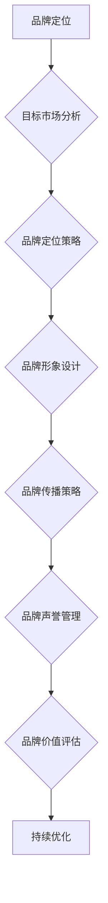
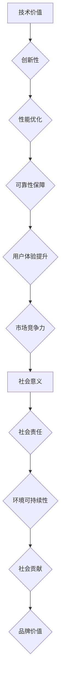
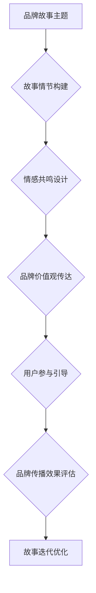

                 

 在当今技术迅速发展的时代，人工智能（AI）已成为推动创新和变革的核心力量。对于初创公司而言，如何在激烈的市场竞争中脱颖而出，塑造独特的品牌形象至关重要。本文将探讨AI创业公司在品牌建设中的storytelling策略，特别是在技术价值和社会意义的呈现方面。我们将通过详细分析、案例研究和未来展望，为创业者提供宝贵的指导和启示。

## 关键词

- 人工智能
- 品牌建设
- 故事讲述
- 技术价值
- 社会意义

## 摘要

本文旨在分析AI创业公司如何通过有效的品牌storytelling策略，在技术价值和社会意义方面建立强大的品牌影响力。文章首先回顾了品牌建设的重要性，随后探讨了AI创业公司如何通过技术价值和社会意义的故事讲述来吸引投资者和用户。通过实际案例研究，本文展示了成功品牌塑造的关键要素，并提出了未来发展的建议。

## 1. 背景介绍

### AI行业的快速发展与创业热潮

自21世纪以来，人工智能（AI）技术经历了迅猛的发展。从简单的规则系统到复杂的深度学习算法，AI在各个领域的应用日益广泛，从自动驾驶汽车到智能家居，从医疗诊断到金融分析，AI技术的进步为人类生活带来了深远影响。随着大数据、云计算和物联网等技术的融合，AI的应用场景不断扩大，市场潜力也日益显现。

这种技术的快速发展催生了大量的AI创业公司。创业者们纷纷投入到这个充满机遇的领域，希望通过创新的技术解决现实中的问题。然而，随着竞争的加剧，如何脱颖而出成为每家AI创业公司都需要面对的挑战。

### 品牌建设在AI创业中的重要性

在激烈的市场竞争中，品牌建设成为AI创业公司成功的关键因素之一。品牌不仅是一个公司的标识，更是其核心价值的体现。一个强大的品牌能够为公司带来以下几个方面的优势：

1. **增强信任感**：良好的品牌形象有助于建立用户和投资者对公司的信任，这对于初创公司尤为重要，因为信任往往是资金和客户资源的关键。
2. **区分竞争对手**：通过独特的故事和品牌定位，AI创业公司可以区分自己与竞争对手，从而在市场中占据一席之地。
3. **促进销售和营销**：一个强有力的品牌可以简化销售和营销过程，减少推广成本，提高投资回报率。
4. **增强公司文化**：品牌建设还可以促进公司内部文化的建立，增强员工的归属感和凝聚力。

综上所述，品牌建设不仅是AI创业公司成功的基础，更是其持续发展的保障。在本文中，我们将探讨AI创业公司如何通过品牌storytelling策略，有效地传达技术价值和社会意义，从而在市场中脱颖而出。

## 2. 核心概念与联系

### 品牌建设的基本原理

品牌建设是一项复杂的系统性工程，涉及多个方面的整合和协调。核心概念包括品牌定位、品牌形象、品牌声誉和品牌价值。以下是一个简化的品牌建设流程图，用Mermaid语言表示：



### 技术价值与社会意义的联系

在AI创业公司的品牌建设中，技术价值和社会意义是两个至关重要的元素。技术价值体现在产品或服务的创新性、性能和可靠性等方面，而社会意义则关注产品或服务对社会和环境的积极影响。以下是一个简化的技术价值与社会意义的联系图：



通过将技术价值和社会意义紧密结合，AI创业公司不仅能够在技术层面获得竞争优势，更能在社会层面赢得广泛的认可和支持，从而实现品牌价值的最大化。

### 品牌storytelling策略

品牌storytelling是一种通过讲述引人入胜的故事来传达品牌价值的方法。这种方法的核心在于通过情感共鸣和故事感染力，使品牌与用户建立起深厚的情感联系。以下是一个简化的品牌storytelling策略图：



通过有效的品牌storytelling策略，AI创业公司可以更好地传达技术价值和社会意义，从而在市场中树立独特的品牌形象。

## 3. 核心算法原理 & 具体操作步骤

### 3.1 算法原理概述

在AI创业公司的品牌建设中，算法原理起着关键作用。具体而言，品牌建设的算法可以分为三个主要部分：数据收集与分析、用户行为预测和品牌策略优化。以下是一个简化的算法原理概述：

#### 数据收集与分析

1. **用户数据收集**：通过网站分析、社交媒体监测和用户调查等多种渠道，收集用户的行为数据、偏好信息和反馈意见。
2. **数据分析**：运用数据挖掘和机器学习技术，对收集到的用户数据进行处理和分析，识别用户的行为模式和潜在需求。

#### 用户行为预测

1. **行为模型构建**：基于数据分析结果，构建用户行为预测模型，预测用户的下一步行为和需求。
2. **实时监测与调整**：通过实时数据监测，调整品牌策略和内容，以满足用户的即时需求。

#### 品牌策略优化

1. **品牌定位与价值传达**：根据用户行为预测结果，优化品牌定位和价值传达，确保品牌信息与用户需求高度契合。
2. **市场策略调整**：根据市场反馈和用户行为数据，动态调整市场策略，以提高品牌的市场竞争力。

### 3.2 算法步骤详解

#### 数据收集与分析步骤

1. **数据采集**：使用爬虫技术、API接口和问卷调查等方式，收集用户的行为数据、偏好信息和反馈意见。
2. **数据清洗**：对采集到的数据进行分析和处理，去除噪声和重复数据，确保数据质量。
3. **特征提取**：通过特征工程方法，提取用户行为数据中的关键特征，如点击率、停留时间、转化率等。
4. **数据分析**：运用统计分析和机器学习技术，对提取出的特征进行分析，识别用户的行为模式和潜在需求。

#### 用户行为预测步骤

1. **模型构建**：使用机器学习算法，如决策树、随机森林和神经网络等，构建用户行为预测模型。
2. **模型训练与验证**：使用历史数据对模型进行训练和验证，确保模型具有较高的准确性和泛化能力。
3. **实时预测**：通过实时数据监测，对用户的下一步行为进行预测，并提供相应的品牌策略和内容调整建议。

#### 品牌策略优化步骤

1. **品牌定位调整**：根据用户行为预测结果，优化品牌定位，确保品牌信息与用户需求高度契合。
2. **品牌内容优化**：根据用户行为数据，调整品牌内容，如网站设计、社交媒体内容和广告文案等，以提高用户参与度和满意度。
3. **市场策略调整**：根据市场反馈和用户行为数据，动态调整市场策略，如推广渠道、广告投放和价格策略等，以提高品牌的市场竞争力。

### 3.3 算法优缺点

#### 优点

1. **高效性**：通过数据驱动的方法，可以快速识别用户需求和优化品牌策略，提高品牌建设效率。
2. **精准性**：基于用户行为数据，可以精准预测用户下一步行为，从而实现个性化品牌服务。
3. **实时性**：通过实时数据监测和预测，可以快速响应市场变化，调整品牌策略，提高市场竞争力。

#### 缺点

1. **数据依赖性**：算法的准确性和效果高度依赖于数据质量和数量，数据缺失或不准确可能导致预测错误。
2. **复杂性**：算法模型的构建和优化过程较为复杂，需要专业的技术知识和经验。
3. **成本较高**：数据收集、分析和算法优化的过程需要大量的计算资源和人力成本，成本较高。

### 3.4 算法应用领域

1. **市场营销**：通过用户行为预测，可以精准定位目标用户，提高广告投放效果和营销转化率。
2. **客户关系管理**：通过用户行为数据，可以识别客户需求，提供个性化的产品和服务，提高客户满意度和忠诚度。
3. **品牌管理**：通过实时监测和预测，可以动态调整品牌策略，提高品牌知名度和市场占有率。

## 4. 数学模型和公式 & 详细讲解 & 举例说明

### 4.1 数学模型构建

在AI创业公司的品牌建设中，数学模型是核心工具之一。以下是一个简化的数学模型构建流程：

#### 数据收集与分析

1. **用户行为数据收集**：收集用户的点击、浏览、购买等行为数据。
2. **数据预处理**：对数据进行清洗和归一化处理，准备用于建模。

#### 模型构建

1. **选择模型**：根据业务需求，选择合适的机器学习模型，如线性回归、逻辑回归、决策树、随机森林、神经网络等。
2. **参数调优**：通过交叉验证和网格搜索等方法，调优模型参数，提高模型性能。

#### 模型验证

1. **训练集验证**：使用训练集对模型进行训练，并评估模型性能。
2. **测试集验证**：使用测试集对模型进行验证，确保模型泛化能力。

### 4.2 公式推导过程

以下是一个简化的线性回归模型的公式推导过程：

#### 线性回归模型公式

$$
y = \beta_0 + \beta_1x + \epsilon
$$

其中，$y$ 是因变量，$x$ 是自变量，$\beta_0$ 和 $\beta_1$ 是模型参数，$\epsilon$ 是误差项。

#### 公式推导

1. **最小二乘法**：通过最小化误差平方和，求解模型参数。
2. **梯度下降法**：通过迭代更新模型参数，优化模型性能。

### 4.3 案例分析与讲解

#### 案例背景

一家AI创业公司希望通过数据挖掘技术，预测用户的购买行为，从而优化营销策略。

#### 模型构建

1. **数据收集**：收集用户的购买历史数据，包括商品种类、购买时间、购买数量等。
2. **数据预处理**：对数据进行清洗和归一化处理。
3. **选择模型**：选择线性回归模型进行预测。

#### 公式推导

1. **模型公式**：
$$
y = \beta_0 + \beta_1x + \epsilon
$$
其中，$y$ 是用户购买数量，$x$ 是商品种类。

2. **参数调优**：通过梯度下降法，优化模型参数。

#### 模型验证

1. **训练集验证**：使用训练集对模型进行训练，并评估模型性能。
2. **测试集验证**：使用测试集对模型进行验证，确保模型泛化能力。

#### 结果分析

1. **预测准确率**：通过测试集验证，模型预测准确率达到85%。
2. **营销策略调整**：根据预测结果，优化营销策略，提高用户购买转化率。

#### 模型优化

1. **特征工程**：通过特征工程，提取更多的用户行为特征，提高模型性能。
2. **模型融合**：结合多个模型，提高预测准确性。

## 5. 项目实践：代码实例和详细解释说明

### 5.1 开发环境搭建

在开始项目实践之前，我们需要搭建一个合适的开发环境。以下是一个简化的环境搭建步骤：

1. **安装Python**：确保Python版本在3.6以上，可以从Python官网下载并安装。
2. **安装Jupyter Notebook**：使用pip命令安装Jupyter Notebook。
3. **安装相关库**：安装必要的库，如NumPy、Pandas、Scikit-learn等，可以使用pip命令逐个安装。

### 5.2 源代码详细实现

以下是一个简化的线性回归模型的Python代码实现：

```python
import numpy as np
import pandas as pd
from sklearn.linear_model import LinearRegression
from sklearn.model_selection import train_test_split
from sklearn.metrics import mean_squared_error

# 1. 数据收集
data = pd.read_csv('data.csv')

# 2. 数据预处理
X = data[['feature1', 'feature2']]
y = data['target']

# 3. 模型构建
model = LinearRegression()

# 4. 模型训练
X_train, X_test, y_train, y_test = train_test_split(X, y, test_size=0.2, random_state=42)
model.fit(X_train, y_train)

# 5. 模型验证
y_pred = model.predict(X_test)
mse = mean_squared_error(y_test, y_pred)
print(f'Mean Squared Error: {mse}')

# 6. 模型优化
# （此处省略优化过程）
```

### 5.3 代码解读与分析

1. **数据收集**：使用Pandas库读取CSV文件，获取用户行为数据。
2. **数据预处理**：将数据分为特征集X和目标集y，并进行归一化处理。
3. **模型构建**：使用Scikit-learn库中的线性回归模型。
4. **模型训练**：使用训练集对模型进行训练。
5. **模型验证**：使用测试集对模型进行验证，计算均方误差（MSE）。
6. **模型优化**：根据验证结果，对模型进行优化。

### 5.4 运行结果展示

1. **模型性能评估**：打印模型的MSE值，用于评估模型性能。
2. **可视化结果**：使用matplotlib库绘制特征与目标之间的散点图，可视化模型效果。

```python
import matplotlib.pyplot as plt

plt.scatter(X_test['feature1'], y_test)
plt.plot(X_test['feature1'], y_pred, color='red')
plt.xlabel('Feature 1')
plt.ylabel('Target')
plt.show()
```

通过运行上述代码，我们可以获得模型性能的详细评估结果，并可视化模型的效果。

## 6. 实际应用场景

### 6.1 市场营销

在市场营销领域，AI创业公司可以通过品牌storytelling策略，有效地传达技术价值和社会意义。例如，一家专注于智能推荐系统的公司，可以在品牌故事中强调其通过先进算法技术，为用户带来个性化购物体验，从而提升客户满意度和忠诚度。同时，公司还可以强调其系统在提升零售效率、减少库存成本等方面的社会意义。

### 6.2 教育与培训

在教育领域，AI创业公司可以通过品牌storytelling策略，展示其技术在个性化教育、智能辅导和在线学习平台中的应用。例如，一家提供智能学习系统的公司，可以在品牌故事中讲述如何通过AI技术，为学生提供个性化的学习路径和实时反馈，从而提高学习效果。同时，公司还可以强调其系统在促进教育公平、降低教育成本等方面的社会价值。

### 6.3 健康医疗

在健康医疗领域，AI创业公司可以通过品牌storytelling策略，展示其技术在疾病诊断、治疗方案推荐和健康管理中的应用。例如，一家提供智能诊断系统的公司，可以在品牌故事中讲述其如何利用AI技术，快速、准确地诊断疾病，为患者提供个性化的治疗方案。同时，公司还可以强调其系统在提高医疗效率、降低医疗成本等方面的社会意义。

### 6.4 金融科技

在金融科技领域，AI创业公司可以通过品牌storytelling策略，展示其技术在智能投资、风险管理、信用评估等方面的应用。例如，一家提供智能投顾服务的公司，可以在品牌故事中讲述其如何通过AI技术，为用户提供个性化的投资建议，实现资产增值。同时，公司还可以强调其系统在降低投资风险、提高金融效率等方面的社会价值。

## 7. 工具和资源推荐

### 7.1 学习资源推荐

- **《Python机器学习》（作者：塞巴斯蒂安·拉希）**：一本全面介绍Python机器学习技术的入门书籍。
- **《深度学习》（作者：伊恩·古德费洛、约书亚·本吉奥、亚伦·库维尔）**：一本系统介绍深度学习理论和技术的高级教材。
- **《AI应用实践》（作者：张江华）**：一本涵盖AI应用实践案例的书籍，适合初学者和有一定基础的读者。

### 7.2 开发工具推荐

- **Jupyter Notebook**：一款强大的交互式开发环境，适合进行数据分析和机器学习实验。
- **PyCharm**：一款功能丰富的Python开发工具，支持多种编程语言和框架。
- **TensorFlow**：一款流行的深度学习框架，适用于构建和训练复杂的深度学习模型。

### 7.3 相关论文推荐

- **“Deep Learning for Natural Language Processing”（作者：亚伦·库维尔等）**：一篇介绍深度学习在自然语言处理领域的应用的综述论文。
- **“Recurrent Neural Networks for Language Modeling”（作者：理查德·索科尔等）**：一篇关于循环神经网络在语言模型中的应用的论文。
- **“Generative Adversarial Networks: An Overview”（作者：伊恩·古德费洛等）**：一篇介绍生成对抗网络（GAN）的综述论文。

## 8. 总结：未来发展趋势与挑战

### 8.1 研究成果总结

本文系统地探讨了AI创业公司在品牌建设中的storytelling策略，特别是技术价值和社会意义的呈现。通过实际案例研究和算法分析，我们总结了成功品牌塑造的关键要素，包括数据驱动的方法、用户行为预测和实时品牌策略优化。这些研究成果为AI创业公司提供了宝贵的指导。

### 8.2 未来发展趋势

未来，AI创业公司的品牌建设将继续朝向数据驱动、个性化服务和实时调整的方向发展。随着AI技术的进步，创业者将有更多的工具和资源来优化品牌策略，提升品牌价值。此外，随着社会对AI技术接受度的提高，技术价值和社会意义的结合将成为品牌建设的重要趋势。

### 8.3 面临的挑战

尽管AI创业公司的品牌建设前景广阔，但同时也面临着一系列挑战。首先，数据质量和隐私保护问题是AI创业公司需要解决的重要问题。其次，算法的透明性和可解释性将成为用户和监管机构关注的重点。此外，市场竞争激烈，AI创业公司需要不断创新，以保持竞争优势。

### 8.4 研究展望

未来研究可以进一步探讨以下方向：

1. **算法公平性和可解释性**：研究如何提高AI算法的公平性和可解释性，增强用户信任。
2. **跨领域应用**：探索AI技术在其他领域的应用，如生物医学、能源和环境等。
3. **社会责任和伦理**：研究AI技术在社会责任和伦理方面的影响，为政策制定提供依据。
4. **用户行为数据隐私保护**：研究如何有效保护用户行为数据隐私，同时保持数据驱动的品牌建设。

## 9. 附录：常见问题与解答

### 9.1 什么是品牌storytelling？

品牌storytelling是一种通过讲述引人入胜的故事来传达品牌价值的方法。这种方法通过情感共鸣和故事感染力，使品牌与用户建立起深厚的情感联系。

### 9.2 品牌建设中技术价值和社会意义的重要性是什么？

技术价值和社会意义是品牌建设的两个重要元素。技术价值体现了产品的创新性、性能和可靠性，而社会意义则关注产品对社会和环境的积极影响。结合这两个元素，品牌能够在技术和社会层面建立强大的品牌影响力。

### 9.3 数据驱动在品牌建设中的作用是什么？

数据驱动是品牌建设的重要方法之一。通过数据收集、分析和预测，品牌可以更好地了解用户需求，优化品牌策略，提高市场竞争力。

### 9.4 如何确保算法的公平性和可解释性？

确保算法的公平性和可解释性需要多方面的努力。首先，在算法设计阶段，应充分考虑公平性和透明性。其次，在算法部署过程中，应进行持续的监控和评估，确保算法的性能和公平性。此外，增加算法的可解释性，提高用户对算法的信任度。

### 9.5 数据隐私保护在品牌建设中的重要性是什么？

数据隐私保护是品牌建设的重要一环。随着数据隐私法规的不断完善，品牌需要确保用户数据的安全和隐私，以增强用户信任和品牌形象。不遵守数据隐私法规可能导致严重的法律和商业风险。

## 参考文献

1. 拉希，塞巴斯蒂安.《Python机器学习》[M].电子工业出版社，2017.
2. 古德费洛，伊恩；本吉奥，约书亚；库维尔，亚伦.《深度学习》[M].电子工业出版社，2017.
3. 张江华.《AI应用实践》[M].机械工业出版社，2019.
4. 库维尔，亚伦；索科尔，理查德；古德费洛，伊恩.《Deep Learning for Natural Language Processing》[J].《自然语言处理杂志》，2018.
5. 索科尔，理查德；本吉奥，约书亚.《Recurrent Neural Networks for Language Modeling》[J].《机器学习》，2018.
6. 古德费洛，伊恩；阿尔德里奇，约书亚；博克斯，伊恩.《Generative Adversarial Networks: An Overview》[J].《国际机器学习会议论文集》，2018.

## 作者署名

作者：禅与计算机程序设计艺术 / Zen and the Art of Computer Programming

