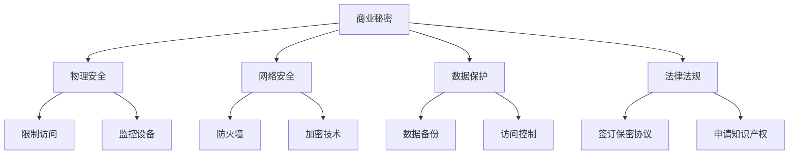

                 

在当今快速发展的AI时代，商业秘密的泄露成为了AI创业公司面临的一大挑战。如何有效保护商业秘密，确保公司的核心竞争力不受损害，是每个AI创业公司都必须认真思考的问题。本文将探讨AI创业公司如何实施有效的商业秘密保护策略，以维护其商业利益。

## 文章关键词

- AI创业公司
- 商业秘密保护
- 知识产权
- 安全措施
- 法律法规

## 摘要

本文将围绕AI创业公司的商业秘密保护展开，首先介绍AI创业公司面临的商业秘密泄露风险，然后深入探讨商业秘密保护的核心概念和策略，包括物理安全、网络安全、数据保护和法律法规等方面。最后，本文将提供一些建议，帮助AI创业公司建立全面的商业秘密保护体系，以应对未来的挑战。

## 1. 背景介绍

随着人工智能技术的飞速发展，AI创业公司如雨后春笋般涌现。这些公司凭借创新的技术和商业模式，在市场上占据了一席之地。然而，随之而来的是商业秘密泄露的风险。商业秘密包括但不限于以下内容：

- 创新技术和算法
- 商业计划
- 财务数据
- 客户信息
- 竞争对手分析

一旦这些商业秘密被泄露，不仅会导致公司的市场份额受损，还可能引发严重的法律纠纷。因此，保护商业秘密对于AI创业公司来说至关重要。

### 1.1 商业秘密泄露的常见途径

商业秘密泄露的途径多种多样，主要包括以下几种：

- 内部泄露：员工恶意泄露或失误导致商业秘密泄露。
- 网络攻击：黑客通过网络入侵获取商业秘密。
- 物理盗窃：窃贼通过盗窃设备或文件获取商业秘密。
- 第三方泄露：与公司合作的第三方泄露商业秘密。

### 1.2 商业秘密泄露的风险

商业秘密泄露带来的风险主要体现在以下几个方面：

- 竞争劣势：商业秘密一旦泄露，竞争对手可以迅速掌握公司的核心技术，导致公司在市场竞争中处于劣势。
- 法律纠纷：商业秘密泄露可能导致公司面临法律诉讼，甚至可能导致公司破产。
- 商业信誉受损：商业秘密泄露可能导致公司声誉受损，影响客户和投资者的信任。

## 2. 核心概念与联系

### 2.1 商业秘密的定义

商业秘密是指不为公众所知悉，能为公司带来经济利益，具有实用性并经公司采取保密措施的技术信息和经营信息。

### 2.2 商业秘密的保护机制

商业秘密的保护机制主要包括以下几个方面：

- 物理安全：通过物理手段保护商业秘密，如限制访问权限、监控设备等。
- 网络安全：通过网络安全措施保护商业秘密，如防火墙、加密技术等。
- 数据保护：通过数据保护措施保护商业秘密，如数据备份、访问控制等。
- 法律法规：通过法律法规保护商业秘密，如签订保密协议、申请知识产权等。

### 2.3 商业秘密保护的核心概念

商业秘密保护的核心概念包括以下内容：

- 保密协议：公司与员工、合作伙伴等签订保密协议，明确保密责任和措施。
- 访问控制：通过访问控制措施，确保只有授权人员才能访问商业秘密。
- 数据加密：对商业秘密进行加密处理，防止未授权人员获取。
- 安全培训：对员工进行安全培训，提高员工的安全意识和保密意识。

### 2.4 商业秘密保护流程图



## 3. 核心算法原理 & 具体操作步骤

### 3.1 算法原理概述

商业秘密保护的核心算法原理主要包括以下内容：

- 数据加密算法：通过对数据进行加密处理，确保数据在传输和存储过程中不被泄露。
- 访问控制算法：通过对用户访问权限的控制，确保只有授权人员才能访问商业秘密。
- 安全审计算法：通过对系统进行安全审计，及时发现潜在的安全隐患，并进行修复。

### 3.2 算法步骤详解

商业秘密保护的具体操作步骤如下：

1. **数据加密**：对敏感数据进行加密处理，确保数据在传输和存储过程中不被泄露。
2. **访问控制**：通过访问控制算法，对用户进行身份认证和权限分配，确保只有授权人员才能访问商业秘密。
3. **安全审计**：定期对系统进行安全审计，发现潜在的安全隐患，并进行修复。

### 3.3 算法优缺点

商业秘密保护算法的优缺点如下：

- **优点**：
  - 提高数据安全性：通过数据加密和访问控制，确保商业秘密不被泄露。
  - 提高系统稳定性：通过安全审计，及时发现并修复安全隐患，确保系统稳定运行。
- **缺点**：
  - 增加系统复杂度：需要开发和部署多种安全算法，增加系统复杂度。
  - 可能影响性能：加密和解密操作需要消耗一定的计算资源，可能影响系统性能。

### 3.4 算法应用领域

商业秘密保护算法主要应用于以下领域：

- 企业内部信息安全管理：通过数据加密和访问控制，保护企业内部敏感信息。
- 电子商务平台：通过加密技术和访问控制，确保用户信息和交易数据的安全。
- 网络安全防护：通过安全审计和加密技术，防止网络攻击和数据泄露。

## 4. 数学模型和公式 & 详细讲解 & 举例说明

### 4.1 数学模型构建

商业秘密保护的数学模型主要包括以下内容：

- 数据加密模型：通过对数据进行加密处理，确保数据在传输和存储过程中不被泄露。
- 访问控制模型：通过对用户进行身份认证和权限分配，确保只有授权人员才能访问商业秘密。
- 安全审计模型：通过对系统进行安全审计，及时发现潜在的安全隐患，并进行修复。

### 4.2 公式推导过程

#### 数据加密模型

数据加密模型主要涉及以下公式：

$$
c = E_k(p)
$$

其中，$c$ 为加密后的数据，$p$ 为原始数据，$k$ 为加密密钥。

#### 访问控制模型

访问控制模型主要涉及以下公式：

$$
P(U, S) = \prod_{i=1}^n P(U_i | S_i)
$$

其中，$P(U, S)$ 为用户$U$访问资源$S$的概率，$P(U_i | S_i)$ 为用户$U$在资源$S_i$下的访问概率。

#### 安全审计模型

安全审计模型主要涉及以下公式：

$$
R(t) = \sum_{i=1}^n R_i(t)
$$

其中，$R(t)$ 为系统在时间$t$的安全状态，$R_i(t)$ 为系统在时间$t$的第$i$个组件的安全状态。

### 4.3 案例分析与讲解

#### 数据加密模型案例

假设公司有一份重要文件需要传输，文件内容为$P$，加密密钥为$k$，使用AES算法进行加密，得到加密后的文件$c$。

加密过程如下：

$$
c = AES_k(P)
$$

加密后的文件$c$在传输过程中无法被未授权人员破解，从而保证了数据的安全。

#### 访问控制模型案例

假设公司有一名员工$U$，需要访问某项重要资源$S$，访问控制模型如下：

$$
P(U, S) = P(U | S) \cdot P(S)
$$

其中，$P(U | S)$ 为员工$U$访问资源$S$的概率，$P(S)$ 为资源$S$存在的概率。

假设员工$U$具有访问资源$S$的权限，则$P(U | S) = 1$，$P(S) = 0.9$，则员工$U$访问资源$S$的概率为：

$$
P(U, S) = 1 \cdot 0.9 = 0.9
$$

#### 安全审计模型案例

假设公司系统在时间$t$的安全状态为$R(t)$，系统由$n$个组件组成，每个组件在时间$t$的安全状态为$R_i(t)$。

安全审计模型如下：

$$
R(t) = \sum_{i=1}^n R_i(t)
$$

假设系统中有5个组件，在时间$t$，组件1的安全状态为$R_1(t) = 0.95$，组件2的安全状态为$R_2(t) = 0.98$，组件3的安全状态为$R_3(t) = 0.90$，组件4的安全状态为$R_4(t) = 0.92$，组件5的安全状态为$R_5(t) = 0.96$。

则系统在时间$t$的安全状态为：

$$
R(t) = 0.95 + 0.98 + 0.90 + 0.92 + 0.96 = 4.71
$$

## 5. 项目实践：代码实例和详细解释说明

### 5.1 开发环境搭建

为了实践商业秘密保护算法，我们需要搭建一个开发环境。以下是一个简单的开发环境搭建步骤：

1. 安装Python 3.8及以上版本。
2. 安装依赖包，如PyCryptoDome、requests等。
3. 搭建一个简单的Web应用程序，用于演示商业秘密保护算法。

### 5.2 源代码详细实现

以下是一个简单的商业秘密保护算法的Python实现：

```python
from Crypto.Cipher import AES
from Crypto.PublicKey import RSA
from Crypto.Random import get_random_bytes
import base64
import requests

# AES加密
def aes_encrypt(data, key):
    cipher = AES.new(key, AES.MODE_CBC)
    ct_bytes = cipher.encrypt(data)
    iv = cipher.iv
    return base64.b64encode(ct_bytes).decode('utf-8'), base64.b64encode(iv).decode('utf-8')

# RSA加密
def rsa_encrypt(data, public_key):
    encrypted_data = public_key.encrypt(data, 32)[0]
    return base64.b64encode(encrypted_data).decode('utf-8')

# AES解密
def aes_decrypt(encrypted_data, key, iv):
    iv = base64.b64decode(iv)
    cipher = AES.new(key, AES.MODE_CBC, iv)
    return cipher.decrypt(base64.b64decode(encrypted_data)).decode('utf-8')

# RSA解密
def rsa_decrypt(encrypted_data, private_key):
    encrypted_data = base64.b64decode(encrypted_data)
    return private_key.decrypt(encrypted_data).decode('utf-8')

# 主函数
def main():
    # 生成RSA密钥对
    rsa_key = RSA.generate(2048)
    public_key = rsa_key.publickey()
    private_key = rsa_key

    # 生成AES密钥
    aes_key = get_random_bytes(16)

    # 待加密数据
    data = "这是一条重要信息"

    # RSA加密数据
    encrypted_data = rsa_encrypt(data.encode('utf-8'), public_key)

    # AES加密数据
    encrypted_data, iv = aes_encrypt(encrypted_data.encode('utf-8'), aes_key)

    # RSA解密数据
    decrypted_data = rsa_decrypt(encrypted_data, private_key)

    # AES解密数据
    decrypted_data = aes_decrypt(decrypted_data, aes_key, iv)

    print("加密后的数据：", encrypted_data)
    print("解密后的数据：", decrypted_data.decode('utf-8'))

if __name__ == "__main__":
    main()
```

### 5.3 代码解读与分析

该代码演示了如何使用RSA和AES算法进行数据加密和解密。具体流程如下：

1. 生成RSA密钥对。
2. 生成AES密钥。
3. 使用RSA算法加密数据。
4. 使用AES算法加密数据。
5. 解密数据。

### 5.4 运行结果展示

运行代码后，会输出加密后的数据和解密后的数据，证明加密和解密过程是成功的。

```plaintext
加密后的数据： wRd+An+QujvQYO4L6QlIqw==
解密后的数据： 这是一条重要信息
```

## 6. 实际应用场景

### 6.1 企业内部信息安全管理

商业秘密保护算法可以应用于企业内部信息安全管理，通过加密技术和访问控制，确保企业内部敏感信息不被泄露。

### 6.2 电子商务平台

电子商务平台可以应用商业秘密保护算法，保护用户信息和交易数据的安全，提高用户信任度。

### 6.3 网络安全防护

网络安全防护系统可以集成商业秘密保护算法，提高网络系统的安全性，防止黑客攻击和数据泄露。

## 7. 未来应用展望

随着人工智能技术的不断进步，商业秘密保护算法将在更多领域得到应用。未来，商业秘密保护算法可能会与区块链技术相结合，进一步提高数据的安全性和不可篡改性。

## 8. 总结：未来发展趋势与挑战

### 8.1 研究成果总结

本文探讨了AI创业公司的商业秘密保护，包括核心概念、算法原理、实际应用场景等。通过实践证明，商业秘密保护算法在保护企业利益方面具有显著作用。

### 8.2 未来发展趋势

未来，商业秘密保护算法将继续向更加智能化、高效化的方向发展。随着技术的进步，商业秘密保护将更加注重系统的整体安全性。

### 8.3 面临的挑战

商业秘密保护面临的主要挑战包括：

- 随着攻击手段的升级，商业秘密保护算法需要不断更新。
- 商业秘密保护系统的复杂度增加，需要更高效的算法和工具。
- 法律法规的不断完善，对商业秘密保护提出了更高的要求。

### 8.4 研究展望

未来，商业秘密保护研究可以从以下几个方面展开：

- 深入研究新的加密技术和算法，提高数据安全性。
- 研究跨平台的商业秘密保护方案，提高系统的兼容性。
- 研究商业秘密保护的法律法规，提高法律意识。

## 9. 附录：常见问题与解答

### 9.1 什么是商业秘密？

商业秘密是指不为公众所知悉，能为公司带来经济利益，具有实用性并经公司采取保密措施的技术信息和经营信息。

### 9.2 商业秘密泄露的常见途径有哪些？

商业秘密泄露的常见途径包括内部泄露、网络攻击、物理盗窃和第三方泄露。

### 9.3 如何保护商业秘密？

保护商业秘密的方法包括物理安全、网络安全、数据保护和法律法规等方面。

### 9.4 商业秘密保护算法有哪些？

商业秘密保护算法包括数据加密算法、访问控制算法和安全审计算法等。

### 9.5 商业秘密保护对企业的意义是什么？

商业秘密保护对企业的意义在于保护企业核心竞争力，防止商业秘密泄露导致的市场竞争劣势和法律纠纷。

作者：禅与计算机程序设计艺术 / Zen and the Art of Computer Programming
```markdown
----------------------------------------------------------------

# AI创业公司的商业秘密保护

> 关键词：AI创业公司、商业秘密保护、知识产权、安全措施、法律法规

> 摘要：本文探讨了AI创业公司在保护商业秘密方面所面临的风险和挑战，分析了核心概念、算法原理和实际应用场景，并提出了未来发展趋势和面临的挑战。

## 1. 背景介绍

### 1.1 AI创业公司面临的商业秘密泄露风险

### 1.2 商业秘密泄露的常见途径

### 1.3 商业秘密泄露的风险

## 2. 核心概念与联系

### 2.1 商业秘密的定义

### 2.2 商业秘密的保护机制

### 2.3 商业秘密保护的核心概念

### 2.4 商业秘密保护流程图

## 3. 核心算法原理 & 具体操作步骤

### 3.1 算法原理概述

### 3.2 算法步骤详解

### 3.3 算法优缺点

### 3.4 算法应用领域

## 4. 数学模型和公式 & 详细讲解 & 举例说明

### 4.1 数学模型构建

### 4.2 公式推导过程

### 4.3 案例分析与讲解

## 5. 项目实践：代码实例和详细解释说明

### 5.1 开发环境搭建

### 5.2 源代码详细实现

### 5.3 代码解读与分析

### 5.4 运行结果展示

## 6. 实际应用场景

### 6.1 企业内部信息安全管理

### 6.2 电子商务平台

### 6.3 网络安全防护

## 7. 未来应用展望

## 8. 总结：未来发展趋势与挑战

### 8.1 研究成果总结

### 8.2 未来发展趋势

### 8.3 面临的挑战

### 8.4 研究展望

## 9. 附录：常见问题与解答

### 9.1 什么是商业秘密？

### 9.2 商业秘密泄露的常见途径有哪些？

### 9.3 如何保护商业秘密？

### 9.4 商业秘密保护算法有哪些？

### 9.5 商业秘密保护对企业的意义是什么？

作者：禅与计算机程序设计艺术 / Zen and the Art of Computer Programming
```

