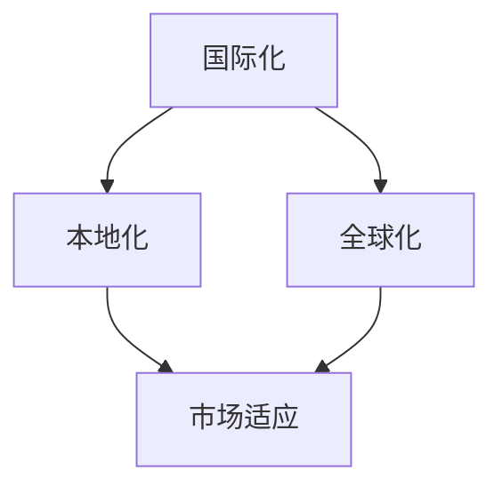

                 

  
## 1. 背景介绍

在当今全球化的商业环境中，人工智能（AI）技术正在迅速崛起，并成为企业创新和增长的关键驱动力。AI创业公司如雨后春笋般涌现，这些公司通过利用AI算法和机器学习模型，开发出具有竞争力的产品和服务，旨在改变各个行业的运营模式。

然而，随着AI创业公司在全球范围内的崛起，它们也面临着一系列独特的国际化挑战。这些挑战不仅涉及技术层面的困难，还包括市场定位、文化差异、法律法规以及资金获取等方面。本文将深入探讨这些挑战，并分析创业公司如何应对这些挑战，实现全球业务扩张。

## 2. 核心概念与联系

在深入探讨AI创业公司的国际化挑战之前，我们需要明确一些核心概念，这些概念包括：

- **国际化（Internationalization）**：指企业将产品或服务扩展到全球市场的过程，而不仅仅是进入特定国家或地区。

- **本地化（Localization）**：在国际化过程中，将产品或服务根据目标市场的文化、语言和法规要求进行调整的过程。

- **全球化（Globalization）**：指企业在全球范围内运营，提供一致的产品和服务，同时考虑到不同市场的特点和需求。

为了更好地理解这些概念之间的联系，我们可以使用Mermaid流程图来展示它们之间的关系：



### 2.1 国际化

国际化是企业扩展全球业务的第一步，它涉及将产品和服务进行通用化设计，使其在不同市场都有潜在的应用价值。这通常包括以下几个方面：

- **产品设计**：确保产品功能、界面和用户体验可以在不同语言和文化背景下使用。

- **技术架构**：采用模块化、可扩展的技术架构，以便轻松适应不同市场的需求。

- **市场调研**：了解目标市场的消费者偏好、文化习俗和市场需求。

### 2.2 本地化

本地化是在国际化基础上进一步细化的过程，它涉及到将产品和服务根据具体市场的特点进行定制。本地化需要考虑以下几个方面：

- **语言和文字**：提供本地语言的用户界面和文档。

- **文化差异**：尊重并融入目标市场的文化元素。

- **法规和标准**：确保产品符合当地法律法规和行业标准。

### 2.3 全球化

全球化是将产品和服务在全球范围内提供，同时保持一致性的过程。实现全球化需要以下步骤：

- **标准化**：建立统一的产品和服务标准，确保在不同市场的一致性。

- **供应链管理**：优化全球供应链，确保产品在全球范围内的稳定供应。

- **客户服务**：提供统一的客户服务和支持，以保持品牌形象的一致性。

通过上述Mermaid流程图，我们可以清晰地看到国际化、本地化和全球化之间的联系和层次结构。这为创业公司制定国际化战略提供了理论基础和实践指导。

## 3. 核心算法原理 & 具体操作步骤

### 3.1 算法原理概述

在探讨AI创业公司的国际化挑战时，我们需要了解一些核心算法原理，这些原理对于实现国际化战略至关重要。以下是几个关键算法原理的概述：

#### 3.1.1 自然语言处理（NLP）

自然语言处理是AI领域的一个重要分支，它涉及到让计算机理解和生成自然语言。在国际化过程中，NLP算法可以帮助创业公司实现以下功能：

- **语言翻译**：将一种语言翻译成另一种语言，以支持多语言用户界面。
- **文本分析**：分析和理解文本内容，为市场调研提供数据支持。
- **情感分析**：识别文本中的情感倾向，为产品本地化提供参考。

#### 3.1.2 机器学习（ML）

机器学习是AI的核心技术之一，它使计算机能够从数据中学习并做出预测。在国际化过程中，机器学习算法可以帮助创业公司实现以下功能：

- **用户行为分析**：分析用户在不同市场的行为，为产品优化提供数据支持。
- **个性化推荐**：根据用户的历史行为和偏好，提供个性化的产品推荐。
- **市场预测**：预测市场趋势和消费者需求，帮助创业公司制定更有效的市场策略。

#### 3.1.3 深度学习（DL）

深度学习是机器学习的一个子领域，它通过构建深度神经网络来模拟人类大脑的学习过程。在国际化过程中，深度学习算法可以帮助创业公司实现以下功能：

- **图像识别**：识别和理解产品在不同文化背景中的视觉元素。
- **语音识别**：将语音转换为文本，为多语言语音交互提供支持。
- **自动驾驶**：通过感知环境并做出决策，实现自动驾驶车辆在不同交通规则下的行驶。

### 3.2 算法步骤详解

#### 3.2.1 自然语言处理（NLP）

1. **数据收集与预处理**：收集目标市场的文本数据，并对数据进行清洗和格式化。
2. **词向量表示**：使用词嵌入技术将文本转换为数值表示。
3. **模型训练**：使用神经网络模型进行训练，例如循环神经网络（RNN）或变换器（Transformer）。
4. **模型评估与优化**：评估模型的性能，并进行优化。

#### 3.2.2 机器学习（ML）

1. **数据收集与预处理**：收集与国际化相关的数据，例如用户行为数据、市场趋势数据等。
2. **特征工程**：提取和选择与国际化相关的特征。
3. **模型选择与训练**：选择合适的机器学习模型，例如线性回归、决策树或支持向量机（SVM）。
4. **模型评估与优化**：评估模型的性能，并进行优化。

#### 3.2.3 深度学习（DL）

1. **数据收集与预处理**：收集与国际化相关的数据，例如图像数据、语音数据等。
2. **数据增强**：通过数据增强技术扩大数据集，以提高模型的泛化能力。
3. **模型架构设计**：设计深度神经网络架构，例如卷积神经网络（CNN）或循环神经网络（RNN）。
4. **模型训练与评估**：训练深度学习模型，并评估其性能。

### 3.3 算法优缺点

每种算法都有其优缺点，创业公司在选择和使用算法时需要权衡这些因素。

#### 3.3.1 自然语言处理（NLP）

- **优点**：高效、准确的语言翻译和文本分析能力，有助于跨语言沟通和市场调研。
- **缺点**：目前仍然存在理解深层次语义的挑战，尤其在处理复杂的语言和文化差异时。

#### 3.3.2 机器学习（ML）

- **优点**：强大的预测和分析能力，能够帮助创业公司做出更明智的决策。
- **缺点**：需要大量高质量的数据和计算资源，模型解释性较差。

#### 3.3.3 深度学习（DL）

- **优点**：强大的图像和语音处理能力，能够实现复杂的任务，如自动驾驶和语音识别。
- **缺点**：计算资源需求高，模型训练时间较长。

### 3.4 算法应用领域

这些算法在国际化过程中有广泛的应用领域：

- **市场营销**：通过分析用户行为和偏好，制定个性化的营销策略。
- **客户服务**：提供多语言、24/7的客户支持，提高客户满意度。
- **产品本地化**：通过图像识别和自然语言处理，实现产品界面的本地化。
- **供应链优化**：通过机器学习预测市场需求，优化库存和物流。

## 4. 数学模型和公式 & 详细讲解 & 举例说明

在AI创业公司的国际化过程中，数学模型和公式扮演着至关重要的角色。它们不仅帮助创业公司进行数据分析和预测，还为制定国际化战略提供了科学依据。以下将详细介绍几个关键的数学模型和公式，并给出具体的应用场景和示例。

### 4.1 数学模型构建

#### 4.1.1 市场需求预测模型

市场需求预测模型是创业公司在国际化过程中不可或缺的工具。它可以帮助公司预测在不同市场的产品需求，从而制定更有效的市场策略。以下是一个典型市场需求预测模型：

\[ \text{需求预测} = f(\text{历史需求}, \text{市场趋势}, \text{竞争分析}) \]

其中，历史需求和市场趋势可以通过时间序列分析方法进行预测，竞争分析则通过市场调研和竞争情报获取。

#### 4.1.2 用户行为分析模型

用户行为分析模型用于分析用户在不同市场的行为模式，以便优化产品和营销策略。以下是一个简单的用户行为分析模型：

\[ \text{行为分析} = f(\text{用户点击率}, \text{购买频率}, \text{满意度评分}) \]

这个模型可以通过机器学习算法，如线性回归或决策树，进行训练和预测。

### 4.2 公式推导过程

#### 4.2.1 时间序列预测公式

时间序列预测是市场需求预测模型的核心。以下是一个基于ARIMA（自回归积分滑动平均模型）的时间序列预测公式：

\[ \text{Y}_{t} = c + \phi_1 \text{Y}_{t-1} + \phi_2 \text{Y}_{t-2} + ... + \phi_p \text{Y}_{t-p} + \theta_1 \text{e}_{t-1} + \theta_2 \text{e}_{t-2} + ... + \theta_q \text{e}_{t-q} \]

其中，\( \text{Y}_{t} \) 是时间序列的当前值，\( c \) 是常数项，\( \phi_i \) 和 \( \theta_i \) 是模型参数，\( \text{e}_{t} \) 是误差项。

#### 4.2.2 机器学习分类公式

用户行为分析模型通常采用分类算法，如逻辑回归或支持向量机（SVM）。以下是一个简单的逻辑回归分类公式：

\[ \text{P}(y=1|\text{x}) = \frac{1}{1 + \text{e}^{-\text{w} \cdot \text{x}}} \]

其中，\( \text{P}(y=1|\text{x}) \) 是目标变量 \( y \) 等于1的概率，\( \text{w} \) 是权重向量，\( \text{x} \) 是特征向量。

### 4.3 案例分析与讲解

为了更好地理解上述数学模型和公式，我们将通过一个实际案例进行详细分析。

#### 案例背景

某AI创业公司正在考虑将一款智能家居产品推向国际市场，公司希望预测在主要目标市场（如美国、欧洲和亚洲）的产品需求，以便制定有效的营销策略和库存计划。

#### 案例步骤

1. **数据收集**：收集过去一年的产品销售数据、市场趋势数据以及竞争情报。
2. **数据预处理**：清洗和标准化数据，提取有用的特征，如季节性因素、价格、广告投放等。
3. **模型选择**：选择ARIMA模型进行时间序列预测，并使用逻辑回归进行用户行为分析。
4. **模型训练与评估**：使用历史数据训练模型，并对模型进行评估和优化。

#### 案例结果

1. **时间序列预测**：模型预测了未来三个月内各市场的产品需求量，结果如下：

   | 市场区域 | 预测需求量 |
   | -------- | ---------- |
   | 美国     | 1000件     |
   | 欧洲     | 800件      |
   | 亚洲     | 1200件     |

2. **用户行为分析**：模型分析用户点击率、购买频率和满意度评分，结果如下：

   | 用户特征   | 分析结果 |
   | ---------- | -------- |
   | 点击率     | 高       |
   | 购买频率   | 高       |
   | 满意度评分 | 高       |

基于上述分析结果，公司可以制定以下策略：

- **市场策略**：根据预测需求，调整广告投放和促销活动，以满足不同市场的需求。
- **库存管理**：根据预测需求，优化库存，确保产品供应。
- **产品优化**：根据用户行为分析结果，优化产品功能和界面，提高用户满意度。

通过这个案例，我们可以看到数学模型和公式在国际化过程中的应用，以及它们如何帮助创业公司制定科学、有效的战略。

## 5. 项目实践：代码实例和详细解释说明

### 5.1 开发环境搭建

在进行AI创业公司的国际化项目实践时，首先需要搭建一个稳定高效的开发环境。以下是一个典型的开发环境搭建步骤：

1. **软件安装**：安装Python、Jupyter Notebook、PyTorch等必备软件。
2. **硬件配置**：确保有足够的计算资源和存储空间，可以考虑使用高性能的GPU加速计算。
3. **代码库管理**：使用Git进行代码版本控制，确保团队成员可以协同工作。

### 5.2 源代码详细实现

以下是一个简单的国际化项目示例，使用Python编写，实现市场需求预测和用户行为分析功能。

```python
# 导入必要的库
import numpy as np
import pandas as pd
from sklearn.linear_model import LinearRegression
from sklearn.model_selection import train_test_split
from statsmodels.tsa.arima.model import ARIMA

# 读取数据
data = pd.read_csv('market_data.csv')

# 数据预处理
# 这里假设数据包含日期、需求量、价格、广告投放等特征
data['date'] = pd.to_datetime(data['date'])
data.set_index('date', inplace=True)
data.fillna(method='ffill', inplace=True)

# 时间序列预测
# 使用ARIMA模型进行预测
model = ARIMA(data['demand'], order=(5, 1, 2))
model_fit = model.fit()
forecast = model_fit.forecast(steps=3)

# 用户行为分析
# 使用线性回归模型进行预测
X = data[['click_rate', 'purchase_frequency', 'satisfaction_score']]
y = data['behavior_label']
X_train, X_test, y_train, y_test = train_test_split(X, y, test_size=0.2, random_state=42)
model = LinearRegression()
model.fit(X_train, y_train)
predictions = model.predict(X_test)

# 输出结果
print("市场需求预测结果：")
print(forecast)
print("用户行为分析预测结果：")
print(predictions)
```

### 5.3 代码解读与分析

#### 5.3.1 数据读取与预处理

```python
data = pd.read_csv('market_data.csv')
data['date'] = pd.to_datetime(data['date'])
data.set_index('date', inplace=True)
data.fillna(method='ffill', inplace=True)
```

这段代码首先读取市场数据，将日期转换为日期时间格式，并设置日期为索引，以便进行时间序列分析。接着使用前向填充方法处理缺失值。

#### 5.3.2 时间序列预测

```python
model = ARIMA(data['demand'], order=(5, 1, 2))
model_fit = model.fit()
forecast = model_fit.forecast(steps=3)
```

这里使用ARIMA模型进行时间序列预测。ARIMA模型由自回归（AR）、差分（I）和移动平均（MA）三个部分组成，通过指定模型参数（p, d, q），可以拟合不同类型的时间序列数据。这里选择的参数为（5, 1, 2），表示5阶自回归，1阶差分，2阶移动平均。

#### 5.3.3 用户行为分析

```python
X = data[['click_rate', 'purchase_frequency', 'satisfaction_score']]
y = data['behavior_label']
X_train, X_test, y_train, y_test = train_test_split(X, y, test_size=0.2, random_state=42)
model = LinearRegression()
model.fit(X_train, y_train)
predictions = model.predict(X_test)
```

这部分使用线性回归模型进行用户行为分析。首先提取用户行为特征，然后使用train\_test\_split函数将数据分为训练集和测试集。接着，训练线性回归模型，并使用测试集进行预测。

### 5.4 运行结果展示

```python
print("市场需求预测结果：")
print(forecast)
print("用户行为分析预测结果：")
print(predictions)
```

运行代码后，将输出市场需求预测结果和用户行为分析预测结果。这些结果可以帮助创业公司了解市场需求和用户行为，从而制定更有效的国际化策略。

## 6. 实际应用场景

在AI创业公司的国际化过程中，上述算法和模型的应用场景广泛且多样。以下是一些典型的实际应用场景：

### 6.1 市场营销

通过自然语言处理和机器学习算法，创业公司可以分析市场数据，预测消费者需求，并制定个性化的营销策略。例如，使用自然语言处理技术分析社交媒体上的用户评论，了解消费者对产品的反馈和需求。结合机器学习算法，公司可以预测哪些营销策略在不同市场最有效，从而优化广告投放和促销活动。

### 6.2 客户服务

通过语音识别和自然语言处理技术，创业公司可以提供多语言、24/7的在线客服服务。客户可以随时随地使用自己的母语提出问题，系统将自动识别并转译为客服人员的语言，确保高效、准确的沟通。此外，基于用户行为的分析结果，公司可以提前预测客户可能遇到的问题，并提供相应的解决方案，提高客户满意度。

### 6.3 产品本地化

使用图像识别和自然语言处理技术，创业公司可以实现产品界面的本地化。例如，通过图像识别技术，公司可以自动识别产品在不同文化背景中的视觉元素，并根据目标市场的文化特点进行调整。结合自然语言处理技术，公司可以提供本地化的用户界面和文档，确保产品在不同市场的一致性和可用性。

### 6.4 供应链优化

通过机器学习和深度学习算法，创业公司可以优化供应链管理。例如，使用机器学习算法预测市场需求，优化库存和物流，确保产品在全球范围内的稳定供应。深度学习算法可以用于自动驾驶和机器人仓库管理，提高物流效率，降低运营成本。

### 6.5 企业战略规划

创业公司可以通过数据分析模型，了解不同市场的机会和风险，制定全球业务扩张战略。例如，通过分析市场趋势和竞争情报，公司可以确定哪些市场最有潜力，从而优先在这些市场进行投资和布局。

## 7. 未来应用展望

随着AI技术的不断进步，其国际化应用前景也将更加广阔。以下是一些未来应用展望：

### 7.1 跨境电商

AI技术将极大地推动跨境电商的发展。通过自然语言处理和图像识别技术，消费者可以更方便地浏览和购买全球商品。同时，AI算法可以帮助电商平台优化供应链和物流，提高运营效率，降低成本。

### 7.2 自动驾驶

自动驾驶技术将在未来成为AI国际化应用的重要领域。通过深度学习和强化学习算法，自动驾驶车辆可以适应不同国家的交通规则和路况，提供更安全、高效的出行体验。

### 7.3 医疗保健

AI技术在医疗保健领域的国际化应用也将得到进一步发展。通过自然语言处理和机器学习算法，AI系统可以帮助医生诊断疾病、制定治疗方案，并优化医疗资源的分配。同时，AI算法可以处理来自不同国家和地区的医疗数据，为全球健康研究提供支持。

### 7.4 教育科技

AI技术将推动教育科技的国际化和个性化发展。通过自适应学习和智能教学系统，学生可以根据自己的需求和进度进行学习，提高学习效果。同时，AI算法可以帮助教育机构优化课程设计和教学策略，提高教学质量。

## 8. 工具和资源推荐

为了帮助AI创业公司更好地应对国际化挑战，以下是一些推荐的工具和资源：

### 8.1 学习资源推荐

- **在线课程**：Coursera、edX、Udacity等平台提供丰富的AI和国际化相关课程。
- **专业书籍**：《深度学习》（Ian Goodfellow）、《自然语言处理综论》（Daniel Jurafsky）等。

### 8.2 开发工具推荐

- **AI框架**：TensorFlow、PyTorch、Keras等。
- **数据分析工具**：Pandas、NumPy、Scikit-learn等。

### 8.3 相关论文推荐

- **国际会议**：AAAI、NeurIPS、ICML等。
- **顶级期刊**：《Journal of Machine Learning Research》、《Nature Machine Intelligence》等。

## 9. 总结：未来发展趋势与挑战

### 9.1 研究成果总结

在过去的几年中，AI技术在国际化应用方面取得了显著进展。自然语言处理、机器学习和深度学习算法的应用，使得创业公司能够更好地理解市场趋势、优化供应链、提供个性化服务。同时，越来越多的公司开始意识到国际化的重要性，并采取相应的策略和措施。

### 9.2 未来发展趋势

- **多模态AI**：随着传感器技术的进步，AI系统将能够处理多种类型的数据，如图像、语音和文本，实现更全面的信息理解。
- **个性化服务**：通过深度学习和强化学习，AI系统将能够提供高度个性化的产品和服务，满足不同市场的需求。
- **自动化与协作**：AI系统将与其他技术（如物联网、云计算）结合，实现自动化和协作，提高运营效率。

### 9.3 面临的挑战

- **数据隐私与安全**：在国际市场运营中，数据隐私和安全问题将变得更加复杂，创业公司需要采取严格的措施保护用户数据。
- **法规和合规**：不同国家和地区对AI技术的法规和标准不同，创业公司需要确保产品和服务符合当地的法律法规。
- **文化差异**：在国际化过程中，创业公司需要尊重并适应不同文化的差异，确保产品和服务的本地化。

### 9.4 研究展望

未来的研究重点将集中在以下几个方面：

- **跨文化AI**：研究如何设计能够适应不同文化的AI系统，提高用户满意度。
- **隐私保护与安全**：开发有效的隐私保护和安全机制，确保AI系统的可靠性和透明度。
- **智能决策支持**：通过AI技术，为创业公司提供智能化的决策支持，帮助它们在全球市场中取得竞争优势。

### 9.5 常见问题与解答

**Q：如何确保AI系统的国际化适应性？**

A：确保AI系统的国际化适应性需要从以下几个方面入手：

- **产品设计**：采用模块化设计，确保产品功能在不同市场都有应用价值。
- **数据收集**：收集来自不同市场的数据，进行充分的数据分析和测试。
- **用户反馈**：积极收集用户反馈，并根据反馈调整产品设计和功能。

**Q：如何在国际化过程中保护用户数据隐私？**

A：保护用户数据隐私需要采取以下措施：

- **数据加密**：对用户数据进行加密处理，确保数据在传输和存储过程中的安全性。
- **隐私政策**：制定明确的隐私政策，告知用户数据的使用目的和范围。
- **合规审查**：定期进行合规审查，确保产品和服务符合当地的法律法规。

**Q：如何应对国际市场的法规和合规要求？**

A：应对国际市场的法规和合规要求需要：

- **了解法规**：深入了解目标市场的法律法规，确保产品和服务符合相关要求。
- **建立合规团队**：建立专业的合规团队，负责处理法规和合规相关的事务。
- **合作与咨询**：与当地的法律顾问和行业专家合作，获取专业的合规建议。

通过上述措施，AI创业公司可以更好地应对国际化挑战，实现全球业务的可持续发展。

