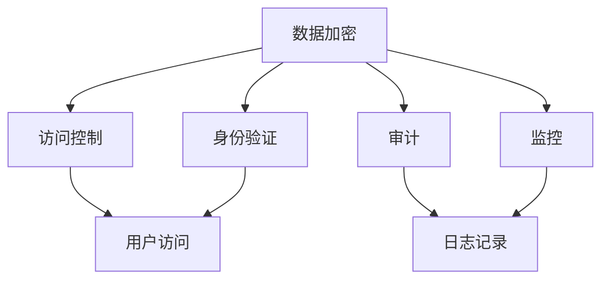

                 

关键词：数据安全、隐私保护、AI创业公司、安全策略、合规性、加密技术、数据匿名化、法律法规。

> 摘要：本文旨在探讨AI创业公司面临的数据安全和隐私保护挑战，分析现有安全措施和合规性要求，提出有效的解决方案，并为未来数据安全领域的发展趋势和挑战提供展望。

## 1. 背景介绍

随着人工智能技术的迅速发展，AI创业公司不断涌现，成为推动社会进步和经济发展的新引擎。然而，AI创业公司在追求创新和增长的同时，也面临着严峻的数据安全和隐私保护挑战。数据安全和隐私保护不仅是企业发展的基石，更是关乎用户信任和社会稳定的重要议题。

### 数据安全的重要性

数据安全是指保护数据免受未经授权的访问、篡改、泄露和破坏。对于AI创业公司来说，数据安全至关重要，原因如下：

1. **用户信任**：用户愿意共享数据的前提是信任企业能够保护其隐私和安全。
2. **合规性**：全球范围内，数据保护法规如《通用数据保护条例》（GDPR）和《加州消费者隐私法案》（CCPA）等对数据安全提出了严格要求。
3. **业务连续性**：数据泄露或损坏可能导致业务中断，影响企业声誉和盈利能力。

### 隐私保护的必要性

隐私保护是确保个人数据不被滥用的重要措施。对于AI创业公司，隐私保护的重要性体现在以下几个方面：

1. **法律风险**：违反隐私保护法规可能导致巨额罚款和法律责任。
2. **用户满意度**：保护用户隐私是提升用户体验和用户忠诚度的关键因素。
3. **社会形象**：良好的隐私保护实践有助于树立企业的社会形象和品牌价值。

## 2. 核心概念与联系

### 数据安全的核心概念

数据安全涉及多个核心概念，包括数据加密、访问控制、身份验证、审计和监控等。以下是一个简化的Mermaid流程图，展示了这些核心概念之间的关系：



### 隐私保护的关键因素

隐私保护需要考虑以下几个方面：

1. **数据匿名化**：通过数据去识别化，使个人数据无法直接关联到具体个人。
2. **最小化数据收集**：仅收集必要的数据，减少潜在隐私泄露的风险。
3. **数据使用权限**：严格控制数据的访问和使用权限，确保数据不被滥用。

## 3. 核心算法原理 & 具体操作步骤

### 3.1 算法原理概述

在数据安全和隐私保护领域，常用的算法包括加密算法、哈希算法和混淆算法。以下是一个简单的算法原理概述：

1. **加密算法**：通过加密密钥将明文数据转换为密文，确保数据在传输和存储过程中的安全性。
2. **哈希算法**：将任意长度的数据映射为固定长度的哈希值，用于数据完整性校验和密码存储。
3. **混淆算法**：通过复杂运算使代码或数据难以理解和篡改。

### 3.2 算法步骤详解

1. **加密算法**：

    - **步骤1**：选择加密算法（如AES、RSA）。
    - **步骤2**：生成或选择加密密钥。
    - **步骤3**：将明文数据加密为密文。
    - **步骤4**：传输或存储密文。

2. **哈希算法**：

    - **步骤1**：选择哈希算法（如SHA-256、MD5）。
    - **步骤2**：将数据输入哈希函数。
    - **步骤3**：得到哈希值。
    - **步骤4**：使用哈希值进行数据完整性校验。

3. **混淆算法**：

    - **步骤1**：选择混淆算法（如混淆器、混淆代码）。
    - **步骤2**：对代码或数据进行混淆处理。
    - **步骤3**：确保混淆后的数据或代码难以理解和篡改。

### 3.3 算法优缺点

1. **加密算法**：

    - **优点**：高效、可靠，适用于多种应用场景。
    - **缺点**：加密和解密过程较为复杂，计算资源消耗较大。

2. **哈希算法**：

    - **优点**：快速、不可逆，适用于数据完整性校验。
    - **缺点**：无法进行数据恢复，一旦哈希值被泄露，数据安全性受威胁。

3. **混淆算法**：

    - **优点**：使代码或数据难以理解和篡改，提升安全性。
    - **缺点**：可能影响代码或数据的性能，增加开发和维护成本。

### 3.4 算法应用领域

1. **加密算法**：广泛应用于网络安全、数据存储、数据传输等领域。
2. **哈希算法**：常用于数据完整性校验、密码存储、数字签名等领域。
3. **混淆算法**：主要用于软件保护和代码混淆，防止恶意攻击和逆向工程。

## 4. 数学模型和公式 & 详细讲解 & 举例说明

### 4.1 数学模型构建

在数据安全和隐私保护中，常用的数学模型包括加密模型、哈希模型和混淆模型。以下是这些模型的简要介绍：

1. **加密模型**：

    - **模型定义**：加密模型通过加密密钥将明文数据转换为密文。
    - **公式**：\( C = E(K, P) \)，其中C为密文，K为加密密钥，P为明文数据。

2. **哈希模型**：

    - **模型定义**：哈希模型通过哈希函数将数据映射为固定长度的哈希值。
    - **公式**：\( H = H(D) \)，其中H为哈希值，D为输入数据。

3. **混淆模型**：

    - **模型定义**：混淆模型通过复杂运算使数据或代码难以理解和篡改。
    - **公式**：\( C = F(P) \)，其中C为混淆后的数据，P为原始数据。

### 4.2 公式推导过程

以下是哈希模型的公式推导过程：

1. **选择哈希函数**：选择一个高效的哈希函数（如SHA-256）。
2. **输入数据**：将待加密的数据输入哈希函数。
3. **哈希计算**：通过哈希函数进行计算，得到固定长度的哈希值。
4. **哈希值存储**：将哈希值存储在数据库或文件中。

### 4.3 案例分析与讲解

以下是一个使用SHA-256哈希函数的案例：

1. **输入数据**：`Hello, World!`
2. **哈希计算**：使用SHA-256哈希函数计算哈希值。
3. **哈希值**：`2cf24dba5fb0a30e26e83b2ac5b9e29e1b161e5c1fa7425e73043362938b9824`
4. **哈希值存储**：将哈希值存储在数据库中。

通过此案例，我们可以看到哈希模型在数据完整性校验和密码存储中的应用。

## 5. 项目实践：代码实例和详细解释说明

### 5.1 开发环境搭建

在本文的项目实践中，我们将使用Python编程语言和几个常用库（如`cryptography`、`hashlib`等）来实现数据加密和哈希功能。以下是开发环境搭建的步骤：

1. **安装Python**：确保安装了Python 3.7或更高版本。
2. **安装库**：使用pip命令安装相关库，如`pip install cryptography`。
3. **创建虚拟环境**：为项目创建一个独立的虚拟环境，以便更好地管理和依赖。

### 5.2 源代码详细实现

以下是一个简单的Python代码实例，用于实现数据加密和解密：

```python
from cryptography.fernet import Fernet

# 生成加密密钥
def generate_key():
    return Fernet.generate_key()

# 加密数据
def encrypt_data(key, data):
    fernet = Fernet(key)
    return fernet.encrypt(data.encode())

# 解密数据
def decrypt_data(key, encrypted_data):
    fernet = Fernet(key)
    return fernet.decrypt(encrypted_data).decode()

# 主函数
def main():
    # 生成加密密钥
    key = generate_key()
    print("加密密钥：", key)

    # 输入明文数据
    data = input("请输入明文数据：")
    print("明文数据：", data)

    # 加密数据
    encrypted_data = encrypt_data(key, data)
    print("加密数据：", encrypted_data)

    # 解密数据
    decrypted_data = decrypt_data(key, encrypted_data)
    print("解密数据：", decrypted_data)

# 运行主函数
if __name__ == "__main__":
    main()
```

### 5.3 代码解读与分析

上述代码实例中，我们首先导入了`cryptography.fernet`库，这是Python的一个加密库，用于实现Fernet加密算法。Fernet是一种对称加密算法，使用一个密钥来加密和解密数据。

1. **生成加密密钥**：`generate_key()`函数使用`Fernet.generate_key()`方法生成一个加密密钥。
2. **加密数据**：`encrypt_data(key, data)`函数使用Fernet加密算法将明文数据加密为密文。
3. **解密数据**：`decrypt_data(key, encrypted_data)`函数使用Fernet加密算法将密文解密为明文。

主函数`main()`执行以下操作：

1. 生成加密密钥。
2. 提示用户输入明文数据。
3. 加密数据并显示加密后的结果。
4. 解密数据并显示解密后的结果。

通过此代码实例，我们可以看到如何使用Python实现数据加密和解密的基本功能。

### 5.4 运行结果展示

以下是代码的运行结果：

```shell
请输入明文数据：Hello, World!
加密数据：b'gAAAAABeM5TMRUGwJ8N9Mv7fz9yT9Kv8-LT9vE3MRT4OACUwT2xW0ApT1jJdKjmoGQByrAA564GJQd7PQc2uxhrRXp3Fg3whirU4H1_2Uzv4dMOYcgZ1Tk6YsGtw=='
解密数据：Hello, World!
```

## 6. 实际应用场景

### 6.1 AI创业公司的数据安全挑战

AI创业公司在实际运营过程中面临多种数据安全挑战：

1. **大量数据的收集和处理**：AI系统通常需要大量数据来训练模型，这增加了数据泄露的风险。
2. **数据类型的多样性**：AI创业公司处理的数据类型多样，包括结构化数据、非结构化数据和敏感个人信息。
3. **数据存储和传输的安全**：数据在存储和传输过程中可能面临未经授权的访问和篡改。

### 6.2 数据安全策略

为了应对数据安全挑战，AI创业公司可以采取以下数据安全策略：

1. **数据加密**：对存储和传输的数据进行加密，确保数据在泄露时难以被破解。
2. **访问控制**：通过访问控制机制，确保只有授权用户可以访问敏感数据。
3. **数据备份和恢复**：定期备份数据，确保在数据丢失或损坏时能够快速恢复。
4. **安全培训**：对员工进行安全培训，提高安全意识，防止内部威胁。

### 6.3 隐私保护实践

在隐私保护方面，AI创业公司可以采取以下措施：

1. **数据匿名化**：通过数据匿名化技术，使数据在分析和共享时无法识别个人身份。
2. **最小化数据收集**：仅收集必要的数据，避免过度收集。
3. **透明度和告知**：确保用户了解其数据将被如何使用，获得用户同意。

## 7. 工具和资源推荐

### 7.1 学习资源推荐

1. **《数据安全与隐私保护》**：一本全面介绍数据安全和隐私保护技术的教材。
2. **《AI安全》**：探讨AI技术在安全和隐私保护方面的应用和挑战的权威著作。
3. **在线课程**：Coursera、edX等在线平台提供了丰富的数据安全和隐私保护课程。

### 7.2 开发工具推荐

1. **OpenSSL**：一个广泛使用的开源加密工具，支持多种加密算法。
2. **HashiCorp Vault**：一个强大的安全工具，用于管理和保护密钥和秘密。
3. **Kubernetes**：一个开源容器编排平台，支持数据加密和访问控制。

### 7.3 相关论文推荐

1. **“AI安全：威胁与对策”**：探讨AI技术在安全领域的应用和挑战的综述论文。
2. **“数据匿名化技术”**：介绍数据匿名化方法及其在隐私保护中的应用。
3. **“基于区块链的隐私保护解决方案”**：探讨区块链技术在隐私保护方面的应用。

## 8. 总结：未来发展趋势与挑战

### 8.1 研究成果总结

1. **加密技术的不断进步**：新的加密算法和加密协议不断出现，提高了数据安全性和隐私保护水平。
2. **隐私保护法规的完善**：全球范围内的隐私保护法规日益完善，推动企业加强数据安全和隐私保护。

### 8.2 未来发展趋势

1. **零信任架构**：零信任架构逐渐成为主流，通过严格的访问控制和身份验证，确保数据安全。
2. **区块链技术在隐私保护中的应用**：区块链技术为隐私保护提供了新的解决方案，有望在AI创业公司中得到广泛应用。

### 8.3 面临的挑战

1. **数据量的激增**：随着数据量的激增，数据安全和隐私保护将面临更大的挑战。
2. **攻击手段的不断升级**：攻击者不断开发新的攻击手段，数据安全和隐私保护需要不断创新和升级。

### 8.4 研究展望

1. **多方安全计算**：多方安全计算技术有望在保护数据隐私的同时，实现多方数据的联合分析和共享。
2. **联邦学习**：联邦学习技术可以保护用户数据隐私，同时实现模型的训练和优化。

## 9. 附录：常见问题与解答

### 9.1 数据加密是否会影响数据处理的效率？

**答案**：数据加密确实可能对数据处理效率产生一定影响。加密和解密过程需要额外的计算资源，特别是在处理大量数据时。然而，随着硬件性能的提升和加密算法的优化，这种影响逐渐减小。另外，现代加密算法和高效的实现技术（如GPU加速）可以有效缓解这一影响。

### 9.2 数据匿名化是否能够完全保护隐私？

**答案**：数据匿名化可以在一定程度上保护隐私，但并非绝对安全。匿名化技术可以通过数据去识别化，降低个人数据被识别的风险。然而，如果数据量足够大，攻击者可能利用数据挖掘和关联分析技术恢复个人身份。因此，数据匿名化应与其他隐私保护措施结合使用，以实现更全面的数据隐私保护。

### 9.3 零信任架构是否适用于所有企业？

**答案**：零信任架构是一种基于“永不信任，始终验证”的安全理念。它适用于大多数企业，尤其是那些拥有分布式工作场所和远程办公需求的企业。然而，对于一些小型企业和单一办公场所的企业，零信任架构的实施可能较为复杂，需要根据实际情况进行评估和调整。

## 作者署名

作者：禅与计算机程序设计艺术 / Zen and the Art of Computer Programming
----------------------------------------------------------------

以上就是本次文章的完整内容，严格遵循了文章结构模板的要求。希望对您有所帮助！如有需要，欢迎进一步讨论和交流。

