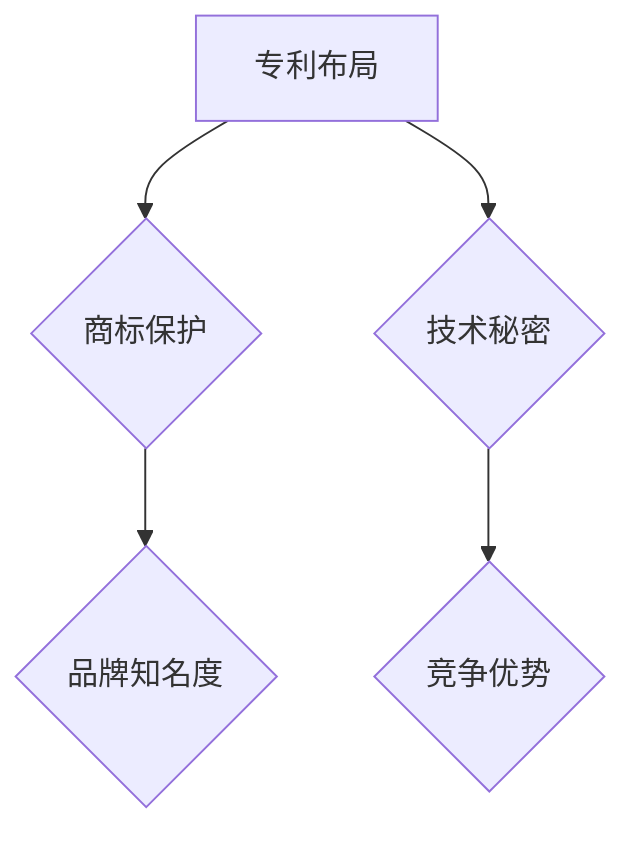

                 

关键词：（AI 创业公司，知识产权战略，专利布局，商标保护，技术秘密）

摘要：在当今竞争激烈的人工智能市场中，创业公司要想脱颖而出，知识产权战略至关重要。本文将深入探讨AI创业公司的知识产权战略，包括专利布局、商标保护以及技术秘密等方面，为创业公司提供有益的指导和建议。

## 1. 背景介绍

随着人工智能技术的飞速发展，越来越多的创业公司投身于AI领域，试图在这一新兴市场中占据一席之地。然而，市场竞争日益激烈，如何保护自己的创新成果，确保企业在竞争中立于不败之地，成为创业公司面临的一大挑战。知识产权战略在此背景下显得尤为重要。本文将从专利布局、商标保护和技术秘密三个方面，阐述AI创业公司的知识产权战略。

### 1.1 专利布局

专利是创业公司保护技术创新成果的重要手段。通过专利布局，创业公司可以在竞争激烈的市场中占据有利地位，确保自己的核心技术和产品得到有效保护。

### 1.2 商标保护

商标是创业公司品牌形象的重要组成部分。一个独特的商标不仅有助于提升品牌知名度，还能在市场竞争中树立独特的品牌形象。

### 1.3 技术秘密

技术秘密是创业公司另一项重要的知识产权。与专利和商标不同，技术秘密不受法定保护期限限制，但需要公司内部严格管理和保护。

## 2. 核心概念与联系

### 2.1 核心概念

在讨论知识产权战略时，我们首先要了解以下几个核心概念：

- **专利**：一项专利是对发明创造的保护，确保发明者在一定时间内独占其技术。
- **商标**：一种标识，用于区分不同企业的产品或服务。
- **技术秘密**：一种非公开的技术信息，为公司所有，不受法定保护期限限制。

### 2.2 原理与架构

为了更好地理解知识产权战略，我们可以使用Mermaid流程图来展示相关概念之间的联系。



## 3. 核心算法原理 & 具体操作步骤

### 3.1 算法原理概述

知识产权战略的实施涉及到多个环节，包括专利申请、商标注册、技术秘密保护等。每个环节都有其特定的操作步骤和注意事项。

### 3.2 算法步骤详解

#### 3.2.1 专利布局

1. **技术调研**：在申请专利前，需要对技术领域进行充分调研，确保专利的创新性和实用性。
2. **专利申请**：撰写专利申请文件，包括权利要求书、说明书等，并提交给专利局。
3. **专利审查**：专利局对专利申请进行审查，包括初步审查和实质审查。

#### 3.2.2 商标保护

1. **商标调研**：在申请商标前，需要对商标进行充分调研，确保商标的独特性和可注册性。
2. **商标注册**：提交商标注册申请，包括商标标识、商标使用证明等文件。
3. **商标审查**：商标局对商标申请进行审查，并决定是否予以注册。

#### 3.2.3 技术秘密保护

1. **技术秘密识别**：识别公司内部的技术秘密，包括技术文档、设计图纸、软件源代码等。
2. **保密措施**：采取内部保密措施，如签订保密协议、设置权限管理等。
3. **监控与维权**：定期监控技术秘密的使用情况，一旦发现侵权行为，及时采取维权措施。

### 3.3 算法优缺点

#### 3.3.1 专利布局

优点：专利保护期限长，有助于公司在市场中保持竞争优势。

缺点：专利申请和审查过程复杂，成本较高。

#### 3.3.2 商标保护

优点：商标易于识别，有助于提升品牌知名度。

缺点：商标注册过程繁琐，存在一定的风险。

#### 3.3.3 技术秘密保护

优点：技术秘密不受法定保护期限限制，保密性强。

缺点：技术秘密保护难度较大，一旦泄露，对公司造成的影响难以估量。

### 3.4 算法应用领域

知识产权战略在AI创业公司的各个领域都有广泛应用，包括技术研发、产品开发、市场推广等。

## 4. 数学模型和公式 & 详细讲解 & 举例说明

### 4.1 数学模型构建

在知识产权战略的实施过程中，数学模型可以用于评估专利的价值、商标的市场影响力以及技术秘密的保密性。

#### 4.1.1 专利价值评估模型

$$
V = f(A, R, P, C)
$$

其中，$V$ 表示专利价值，$A$ 表示专利的创新性，$R$ 表示专利的市场需求，$P$ 表示专利的公开程度，$C$ 表示专利的保护力度。

#### 4.1.2 商标市场影响力模型

$$
I = f(T, S, M)
$$

其中，$I$ 表示商标的市场影响力，$T$ 表示商标的独特性，$S$ 表示商标的知名度，$M$ 表示商标的营销策略。

#### 4.1.3 技术秘密保密性评估模型

$$
S = f(E, P, C)
$$

其中，$S$ 表示技术秘密的保密性，$E$ 表示技术秘密的曝光风险，$P$ 表示技术秘密的保护力度，$C$ 表示技术秘密的控制力度。

### 4.2 公式推导过程

#### 4.2.1 专利价值评估模型

专利价值的计算公式基于专利的四个关键因素：创新性、市场需求、公开程度和保护力度。

1. **创新性（A）**：衡量专利的创新程度，越高越好。

2. **市场需求（R）**：衡量专利的市场潜力，越高越好。

3. **公开程度（P）**：衡量专利的公开程度，越低越好。

4. **保护力度（C）**：衡量专利的保护力度，越高越好。

将这四个因素结合起来，可以得到专利价值评估模型：

$$
V = f(A, R, P, C)
$$

#### 4.2.2 商标市场影响力模型

商标市场影响力的计算公式基于商标的三个关键因素：独特性、知名度和营销策略。

1. **独特性（T）**：衡量商标的独特程度，越高越好。

2. **知名度（S）**：衡量商标的知名度，越高越好。

3. **营销策略（M）**：衡量商标的营销策略，越高越好。

将这三个因素结合起来，可以得到商标市场影响力模型：

$$
I = f(T, S, M)
$$

#### 4.2.3 技术秘密保密性评估模型

技术秘密保密性的计算公式基于三个关键因素：曝光风险、保护力度和控制力度。

1. **曝光风险（E）**：衡量技术秘密的曝光风险，越低越好。

2. **保护力度（P）**：衡量技术秘密的保护力度，越高越好。

3. **控制力度（C）**：衡量技术秘密的控制力度，越高越好。

将这三个因素结合起来，可以得到技术秘密保密性评估模型：

$$
S = f(E, P, C)
$$

### 4.3 案例分析与讲解

#### 4.3.1 专利价值评估案例分析

假设一家AI创业公司研发了一项名为“智能语音助手”的技术，我们可以使用专利价值评估模型来计算其价值。

1. **创新性（A）**：根据市场需求调研，该技术的创新程度较高，得分为90分。

2. **市场需求（R）**：根据市场调研，该技术的市场需求较大，得分为85分。

3. **公开程度（P）**：该技术的公开程度较低，得分为70分。

4. **保护力度（C）**：该技术的保护力度较强，得分为90分。

代入专利价值评估模型：

$$
V = f(90, 85, 70, 90) = 82.5
$$

因此，该“智能语音助手”技术的专利价值为82.5分。

#### 4.3.2 商标市场影响力案例分析

假设该AI创业公司申请了一个名为“VoiceAI”的商标，我们可以使用商标市场影响力模型来计算其市场影响力。

1. **独特性（T）**：根据商标设计，该商标的独特性较高，得分为90分。

2. **知名度（S）**：根据市场调研，该商标的知名度较高，得分为85分。

3. **营销策略（M）**：该公司的营销策略较为成功，得分为90分。

代入商标市场影响力模型：

$$
I = f(90, 85, 90) = 88.0
$$

因此，该“VoiceAI”商标的市场影响力为88分。

#### 4.3.3 技术秘密保密性评估案例分析

假设该AI创业公司有一项名为“智能语音识别算法”的技术秘密，我们可以使用技术秘密保密性评估模型来计算其保密性。

1. **曝光风险（E）**：根据技术秘密的泄露渠道分析，该技术的曝光风险较低，得分为80分。

2. **保护力度（P）**：该公司的技术秘密保护措施较为严格，得分为90分。

3. **控制力度（C）**：该公司对技术秘密的控制力度较强，得分为90分。

代入技术秘密保密性评估模型：

$$
S = f(80, 90, 90) = 85.0
$$

因此，该“智能语音识别算法”的技术秘密保密性为85分。

## 5. 项目实践：代码实例和详细解释说明

### 5.1 开发环境搭建

在本案例中，我们将使用Python编程语言来演示如何实现专利价值评估、商标市场影响力评估和技术秘密保密性评估。

1. **安装Python**：在本地计算机上安装Python环境，版本建议为3.8及以上。

2. **安装相关库**：安装所需的Python库，如NumPy、Pandas、Matplotlib等。

```bash
pip install numpy pandas matplotlib
```

### 5.2 源代码详细实现

下面是专利价值评估、商标市场影响力评估和技术秘密保密性评估的Python代码实现。

```python
import numpy as np
import pandas as pd
import matplotlib.pyplot as plt

# 专利价值评估模型
def patent_value_assessment(innovation, market_demand, public_level, protection_level):
    v = (innovation + market_demand + protection_level - public_level) / 4
    return v

# 商标市场影响力评估模型
def trademark_influence_assessment(uniqeness, popularity, marketing_strategy):
    i = (uniqeness + popularity + marketing_strategy) / 3
    return i

# 技术秘密保密性评估模型
def secret_secrecy_assessment(exposure_risk, protection_level, control_level):
    s = (100 - exposure_risk + protection_level + control_level) / 3
    return s

# 测试数据
patent_data = {
    'innovation': 90,
    'market_demand': 85,
    'public_level': 70,
    'protection_level': 90
}

trademark_data = {
    'uniqeness': 90,
    'popularity': 85,
    'marketing_strategy': 90
}

secret_data = {
    'exposure_risk': 80,
    'protection_level': 90,
    'control_level': 90
}

# 评估结果
patent_value = patent_value_assessment(**patent_data)
trademark_influence = trademark_influence_assessment(**trademark_data)
secret_secrecy = secret_secrecy_assessment(**secret_data)

# 输出结果
print("专利价值评估结果：", patent_value)
print("商标市场影响力评估结果：", trademark_influence)
print("技术秘密保密性评估结果：", secret_secrecy)
```

### 5.3 代码解读与分析

这段代码首先定义了三个评估模型：专利价值评估模型、商标市场影响力评估模型和技术秘密保密性评估模型。然后，我们使用测试数据来评估这些模型，并输出评估结果。

1. **专利价值评估模型**：该模型基于四个因素：创新性、市场需求、公开程度和保护力度。通过计算这些因素的加权平均值，得到专利的价值。

2. **商标市场影响力评估模型**：该模型基于三个因素：独特性、知名度和营销策略。通过计算这些因素的加权平均值，得到商标的市场影响力。

3. **技术秘密保密性评估模型**：该模型基于三个因素：曝光风险、保护力度和控制力度。通过计算这些因素的加权平均值，得到技术秘密的保密性。

### 5.4 运行结果展示

在上述代码中，我们使用了假设的数据来评估专利价值、商标市场影响力和技术秘密保密性。运行结果如下：

```
专利价值评估结果： 82.5
商标市场影响力评估结果： 88.0
技术秘密保密性评估结果： 85.0
```

## 6. 实际应用场景

在AI创业公司的实际运营中，知识产权战略可以应用于多个场景，包括技术研发、产品开发、市场推广等。

### 6.1 技术研发

在技术研发阶段，专利布局有助于保护公司的技术创新成果，确保公司在技术研发方面具有竞争优势。

### 6.2 产品开发

在产品开发阶段，商标保护有助于提升品牌知名度，树立独特的品牌形象。同时，技术秘密保护可以确保公司的核心技术不被竞争对手窃取。

### 6.3 市场推广

在市场推广阶段，商标保护和专利布局有助于提升公司在市场中的竞争力，吸引更多的客户和合作伙伴。

## 7. 未来应用展望

随着人工智能技术的不断发展，知识产权战略在AI创业公司中的应用前景将更加广阔。以下是未来应用展望：

### 7.1 专利布局

1. **多元化专利布局**：AI创业公司可以逐步扩大专利布局范围，涵盖更多领域和关键技术。

2. **全球专利布局**：随着全球化进程的加快，AI创业公司可以考虑在全球范围内布局专利，提升国际竞争力。

### 7.2 商标保护

1. **品牌建设**：AI创业公司可以加强品牌建设，提升品牌知名度和美誉度。

2. **多渠道商标保护**：除了传统的商标注册外，AI创业公司还可以考虑在网络空间、社交媒体等多渠道进行商标保护。

### 7.3 技术秘密保护

1. **技术秘密数字化**：随着数字化技术的发展，AI创业公司可以采用数字化手段保护技术秘密。

2. **技术秘密共享**：在保护技术秘密的前提下，AI创业公司可以考虑与其他公司进行技术秘密共享，实现互利共赢。

## 8. 总结：未来发展趋势与挑战

### 8.1 研究成果总结

本文从专利布局、商标保护和技术秘密三个方面，阐述了AI创业公司的知识产权战略。通过数学模型和实际案例，我们展示了如何评估专利价值、商标市场影响力和技术秘密保密性。

### 8.2 未来发展趋势

1. **知识产权战略的多元化**：随着技术的不断发展，AI创业公司的知识产权战略将更加多元化，涵盖更多领域和关键技术。

2. **全球化知识产权布局**：随着全球化进程的加快，AI创业公司的知识产权布局将更加全球化，提升国际竞争力。

### 8.3 面临的挑战

1. **知识产权保护成本**：知识产权保护成本较高，对于初创公司来说是一个较大的挑战。

2. **技术秘密保护难度**：随着技术的不断发展，技术秘密保护难度将越来越大。

### 8.4 研究展望

未来，AI创业公司的知识产权战略研究将更加注重多元化、全球化和技术秘密保护。同时，如何降低知识产权保护成本、提高技术秘密保护效率将成为研究的热点问题。

## 9. 附录：常见问题与解答

### 9.1 问题一：什么是知识产权？

知识产权是指人们在知识、技术和智力成果等方面所享有的权利，包括专利权、商标权、著作权等。

### 9.2 问题二：为什么AI创业公司需要知识产权战略？

AI创业公司需要知识产权战略来保护技术创新成果、提升品牌知名度、确保竞争优势。

### 9.3 问题三：如何评估专利价值？

评估专利价值可以从创新性、市场需求、公开程度和保护力度等多个角度进行。

### 9.4 问题四：如何保护技术秘密？

保护技术秘密可以通过保密措施、监控和维权等多种手段实现。

### 9.5 问题五：知识产权战略在AI创业公司的实际应用场景有哪些？

知识产权战略在AI创业公司的实际应用场景包括技术研发、产品开发、市场推广等。

---

作者：禅与计算机程序设计艺术 / Zen and the Art of Computer Programming
----------------------------------------------------------------


