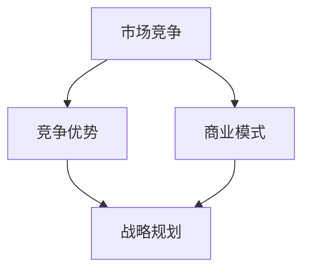

                 

关键词：人工智能、创业公司、市场竞争、策略、竞争优势、商业模式

摘要：本文旨在探讨人工智能创业公司在激烈的市场竞争中所面临的挑战，并提出一系列有效的竞争策略。通过分析行业现状、竞争对手行为以及自身优势，文章将帮助创业公司制定出适合其发展的战略规划，以实现持续增长和竞争优势。

## 1. 背景介绍

人工智能（AI）技术近年来取得了显著的进步，不仅在理论研究领域取得了突破，更在各个实际应用场景中展现出巨大的潜力。随着大数据、云计算和深度学习等技术的发展，AI创业公司如雨后春笋般涌现，旨在利用先进的技术解决实际问题，推动社会进步。

然而，市场的竞争也日益激烈。AI创业公司面临着来自各大科技巨头和传统企业的竞争压力，同时也需要面对同行业其他创业公司的竞争。如何在竞争激烈的环境中脱颖而出，实现可持续发展，是每个AI创业公司都必须思考的问题。

本文将围绕以下主题展开讨论：

- AI创业公司的市场现状及竞争格局
- 创业公司在市场竞争中的定位和优势
- 制定有效的竞争策略，实现持续增长
- 未来人工智能创业公司的发展趋势与挑战

## 2. 核心概念与联系

在探讨AI创业公司的竞争策略之前，我们首先需要了解一些核心概念，包括市场竞争、竞争优势、商业模式等。以下是一个简化的Mermaid流程图，用于展示这些概念之间的联系。



### 2.1 市场竞争

市场竞争是指企业为了争夺市场份额而进行的竞争行为。在人工智能领域，市场竞争主要表现在以下几个方面：

- 技术竞争：企业通过提升技术研发能力，争夺技术创新的领先地位。
- 价格竞争：企业通过降低产品价格，吸引更多客户，扩大市场份额。
- 服务竞争：企业通过提升服务质量，提高客户满意度，增强品牌影响力。

### 2.2 竞争优势

竞争优势是指企业在市场竞争中具有的、能够使其在竞争中脱颖而出的优势。对于AI创业公司来说，竞争优势主要包括以下几个方面：

- 技术优势：企业在技术研发方面具有领先地位，能够推出更具创新性和竞争力的产品。
- 品牌优势：企业拥有较高的品牌知名度和美誉度，能够吸引更多客户。
- 服务优势：企业能够提供优质的服务，提高客户满意度，增强客户忠诚度。

### 2.3 商业模式

商业模式是指企业通过什么方式赚钱，即企业的盈利模式。对于AI创业公司来说，常见的商业模式包括以下几种：

- 产品销售：通过销售自主研发的AI产品获取收益。
- 服务收费：通过提供AI服务（如云计算、大数据分析等）向客户收取费用。
- 广告和推广：通过为企业提供广告推广服务获取收益。

## 3. 核心算法原理 & 具体操作步骤

在讨论创业公司的竞争策略之前，我们需要先了解一些核心算法原理，这些算法对于AI创业公司来说至关重要。以下将介绍一种常用的算法——深度学习，并详细解释其原理和操作步骤。

### 3.1 算法原理概述

深度学习是一种基于人工神经网络的机器学习技术，通过模拟人脑神经网络的结构和功能，实现对数据的自动学习和处理。深度学习的核心思想是通过层层提取特征，从原始数据中自动学习出具有高层次的抽象表示。

深度学习的主要组成部分包括：

- 输入层：接收外部输入数据。
- 隐藏层：对输入数据进行处理，提取特征。
- 输出层：生成最终输出结果。

### 3.2 算法步骤详解

深度学习的具体操作步骤可以分为以下几个阶段：

1. 数据预处理：对原始数据进行清洗、归一化等处理，使其满足算法要求。
2. 构建模型：根据问题需求，设计合适的神经网络结构，包括输入层、隐藏层和输出层。
3. 训练模型：使用训练数据对模型进行训练，不断调整模型参数，使其达到最佳性能。
4. 评估模型：使用验证数据对模型进行评估，确定模型是否达到预期效果。
5. 应用模型：将训练好的模型应用于实际场景，解决实际问题。

### 3.3 算法优缺点

深度学习具有以下优点：

- 强大的学习能力和适应能力，能够处理大量复杂的数据。
- 能够自动提取特征，减轻了人工特征工程的工作负担。
- 在图像识别、语音识别、自然语言处理等领域取得了显著成果。

然而，深度学习也存在一些缺点：

- 对数据依赖性强，需要大量高质量的数据进行训练。
- 训练过程需要大量计算资源和时间，成本较高。
- 模型的解释性较差，难以理解其内部机制。

### 3.4 算法应用领域

深度学习在人工智能领域具有广泛的应用前景，主要应用领域包括：

- 图像识别：用于人脸识别、车辆检测、图像分类等。
- 语音识别：用于语音助手、自动翻译、语音合成等。
- 自然语言处理：用于文本分类、情感分析、机器翻译等。
- 游戏AI：用于棋类游戏、智能投顾等。

## 4. 数学模型和公式 & 详细讲解 & 举例说明

在深度学习中，数学模型和公式起着至关重要的作用。以下将介绍一些关键的数学模型和公式，并进行详细讲解和举例说明。

### 4.1 数学模型构建

深度学习中的数学模型主要包括以下几个部分：

1. 激活函数：用于引入非线性因素，使模型能够拟合复杂函数。常见的激活函数有ReLU、Sigmoid和Tanh等。
2. 前向传播：用于计算神经网络输出值。通过层层计算，将输入值传递到输出层，得到最终输出。
3. 反向传播：用于更新模型参数，使模型达到最佳性能。通过计算损失函数的梯度，反向传播误差，调整模型参数。
4. 损失函数：用于衡量模型输出值与实际值之间的差距。常见的损失函数有均方误差（MSE）和交叉熵（Cross-Entropy）等。

### 4.2 公式推导过程

以下是一个简单的深度学习模型的推导过程，包括前向传播和反向传播。

#### 前向传播

假设输入层、隐藏层和输出层分别为X、H和Y，激活函数为σ，则前向传播的推导如下：

$$
H = \sigma(W_1 \cdot X + b_1)
$$

$$
Y = \sigma(W_2 \cdot H + b_2)
$$

其中，$W_1$和$W_2$分别为隐藏层和输出层的权重矩阵，$b_1$和$b_2$分别为隐藏层和输出层的偏置项。

#### 反向传播

假设损失函数为L，则反向传播的推导如下：

$$
\frac{\partial L}{\partial W_2} = \frac{\partial L}{\partial Y} \cdot \frac{\partial Y}{\partial H}
$$

$$
\frac{\partial L}{\partial H} = \frac{\partial L}{\partial Y} \cdot \frac{\partial Y}{\partial H} \cdot \frac{\partial H}{\partial X}
$$

$$
\frac{\partial L}{\partial X} = \frac{\partial L}{\partial H} \cdot \frac{\partial H}{\partial X}
$$

通过以上公式，可以计算出每个参数的梯度，并使用梯度下降等方法更新模型参数。

### 4.3 案例分析与讲解

以下是一个简单的图像分类案例，用于说明深度学习模型的构建和应用。

#### 案例背景

假设我们需要构建一个图像分类模型，用于区分猫和狗。训练数据集包含1000张猫的图片和1000张狗的图片，每张图片的大小为28x28像素。

#### 模型构建

1. 输入层：接收28x28的图像数据。
2. 隐藏层：设计一个包含128个神经元的隐藏层。
3. 输出层：设计一个包含2个神经元的输出层，用于输出猫和狗的概率。

#### 训练过程

1. 数据预处理：对图像数据进行归一化处理，将像素值缩放到0-1之间。
2. 模型训练：使用训练数据集对模型进行训练，不断调整权重和偏置项，使其达到最佳性能。
3. 模型评估：使用验证数据集对模型进行评估，计算准确率。

#### 模型应用

1. 测试数据：使用100张未标注的图像作为测试数据，测试模型性能。
2. 输出结果：根据模型输出结果，判断图像中是否存在猫或狗。

## 5. 项目实践：代码实例和详细解释说明

为了更好地理解深度学习模型的应用，我们以下将介绍一个简单的图像分类项目，并详细解释代码实现过程。

### 5.1 开发环境搭建

1. 安装Python环境：Python是深度学习项目的常用语言，需要安装Python 3.x版本。
2. 安装深度学习框架：我们选择使用TensorFlow作为深度学习框架，可以通过pip命令安装。

```python
pip install tensorflow
```

3. 准备数据集：从网上下载一个包含猫和狗图片的数据集，并对图片进行预处理，将其转换为适合模型训练的格式。

### 5.2 源代码详细实现

以下是一个简单的图像分类项目的代码实现。

```python
import tensorflow as tf
from tensorflow.keras import layers
from tensorflow.keras.preprocessing.image import ImageDataGenerator

# 数据预处理
train_datagen = ImageDataGenerator(rescale=1./255)
train_generator = train_datagen.flow_from_directory(
        'train',
        target_size=(28, 28),
        batch_size=32,
        class_mode='binary')

# 构建模型
model = tf.keras.Sequential([
    layers.Conv2D(32, (3, 3), activation='relu', input_shape=(28, 28, 3)),
    layers.MaxPooling2D((2, 2)),
    layers.Conv2D(64, (3, 3), activation='relu'),
    layers.MaxPooling2D((2, 2)),
    layers.Conv2D(64, (3, 3), activation='relu'),
    layers.Flatten(),
    layers.Dense(64, activation='relu'),
    layers.Dense(1, activation='sigmoid')
])

# 编译模型
model.compile(optimizer='adam',
              loss='binary_crossentropy',
              metrics=['accuracy'])

# 训练模型
model.fit(
      train_generator,
      steps_per_epoch=100,
      epochs=15)

# 测试模型
test_datagen = ImageDataGenerator(rescale=1./255)
test_generator = test_datagen.flow_from_directory(
        'test',
        target_size=(28, 28),
        batch_size=32,
        class_mode='binary')

test_loss, test_acc = model.evaluate(test_generator)
print('Test accuracy:', test_acc)
```

### 5.3 代码解读与分析

以上代码实现了一个简单的图像分类项目，主要包括以下几个步骤：

1. 导入所需的库和模块。
2. 数据预处理：使用ImageDataGenerator对训练数据进行预处理，包括归一化和标签转换。
3. 构建模型：使用Sequential模型堆叠多层神经网络，包括卷积层、池化层和全连接层。
4. 编译模型：指定优化器、损失函数和评估指标。
5. 训练模型：使用训练数据对模型进行训练，并计算训练过程中的损失和准确率。
6. 测试模型：使用测试数据对模型进行评估，计算测试准确率。

通过以上代码，我们可以实现一个简单的猫狗分类模型，并对其性能进行评估。在实际应用中，可以根据需求进一步优化模型结构和参数，以提高分类准确率。

## 6. 实际应用场景

在当今快速发展的科技时代，人工智能技术已经渗透到了各行各业，AI创业公司的实际应用场景也越来越多样化。以下将介绍一些典型的实际应用场景，以及AI创业公司在这些场景中的竞争策略。

### 6.1 智能医疗

智能医疗是人工智能技术应用的重要领域之一，包括智能诊断、智能辅助手术、智能药物研发等。AI创业公司在智能医疗领域的竞争策略主要包括：

- 技术创新：不断研发新的算法和模型，提高诊断和辅助手术的准确性和效率。
- 数据积累：通过合作和数据共享，积累更多的医疗数据，提升模型的性能。
- 医疗资源整合：整合医院、医生和患者资源，提供一站式医疗解决方案。
- 政策和法规合规：严格遵守医疗行业的政策和法规，确保产品的安全性和合规性。

### 6.2 智能金融

智能金融是人工智能技术在金融领域的应用，包括智能投顾、智能风控、智能保险等。AI创业公司在智能金融领域的竞争策略主要包括：

- 数据驱动：通过大数据分析和机器学习，提供个性化的金融服务。
- 技术创新：研发新的算法和模型，提高投资和风控的准确性。
- 用户需求：深入了解用户需求，提供便捷、高效的金融服务。
- 风险控制：加强风险控制和合规性管理，确保金融服务的安全性。

### 6.3 智能交通

智能交通是人工智能技术在交通领域的应用，包括智能交通信号控制、智能停车场管理、智能驾驶等。AI创业公司在智能交通领域的竞争策略主要包括：

- 技术创新：研发先进的传感器和算法，提高交通系统的智能化水平。
- 数据整合：整合交通数据，提供实时交通信息和服务。
- 合作共赢：与政府、企业等各方合作，共同推进智能交通的发展。
- 安全保障：加强数据安全和隐私保护，确保智能交通系统的稳定性和安全性。

### 6.4 智能教育

智能教育是人工智能技术在教育领域的应用，包括智能课程推荐、智能学习分析、智能评测等。AI创业公司在智能教育领域的竞争策略主要包括：

- 技术创新：研发先进的教育技术，提高教学效果和学生学习体验。
- 数据分析：通过数据分析，了解学生学习情况，提供个性化的教育服务。
- 教育资源整合：整合教育资源，提供一站式教育解决方案。
- 安全保障：加强数据安全和隐私保护，确保智能教育系统的稳定性和安全性。

## 7. 工具和资源推荐

在人工智能创业过程中，选择合适的工具和资源对于项目的成功至关重要。以下将推荐一些常用的学习资源、开发工具和相关论文，以帮助AI创业公司提高研发效率和项目成功率。

### 7.1 学习资源推荐

1. **在线课程**：Coursera、edX和Udacity等平台提供丰富的深度学习和人工智能课程，适合不同层次的学员。
2. **书籍**：《深度学习》、《Python机器学习》和《模式识别与机器学习》等经典书籍，为AI创业公司提供了全面的入门和进阶知识。
3. **博客和社区**：Medium、Stack Overflow和GitHub等平台，提供丰富的技术文章、开源项目和交流机会。

### 7.2 开发工具推荐

1. **深度学习框架**：TensorFlow、PyTorch和Keras等，为AI创业公司提供了强大的深度学习开发环境。
2. **编程语言**：Python和R等，是人工智能开发的主要编程语言，具有丰富的库和工具。
3. **数据可视化工具**：Matplotlib、Seaborn和Plotly等，用于数据分析和结果展示。

### 7.3 相关论文推荐

1. **经典论文**：《A Fast Learning Algorithm for Deep Belief Nets》、《AlexNet: Image Classification with Deep Convolutional Neural Networks》等，介绍了深度学习的重要算法和模型。
2. **前沿论文**：ICLR、NeurIPS和JMLR等顶级会议和期刊，发布最新的研究成果和进展。
3. **应用论文**：针对特定领域和问题的应用研究论文，为AI创业公司提供了有益的参考。

## 8. 总结：未来发展趋势与挑战

随着人工智能技术的不断发展和普及，AI创业公司面临着前所未有的发展机遇和挑战。以下将总结未来发展趋势、面临的挑战以及研究展望。

### 8.1 研究成果总结

- 深度学习技术在图像识别、语音识别、自然语言处理等领域取得了显著成果。
- 大数据、云计算和物联网等技术的发展，为AI创业公司提供了丰富的数据资源和计算能力。
- 开源社区和学术界的合作，推动了人工智能技术的创新和发展。

### 8.2 未来发展趋势

- AI技术将更加普及和深入，应用于更多行业和场景。
- 跨学科研究将更加常见，融合计算机科学、数学、生物学等领域的知识。
- 人工智能与物联网、区块链等新兴技术的融合，将带来新的商业模式和应用场景。

### 8.3 面临的挑战

- 数据隐私和安全问题：人工智能技术的发展对数据隐私和安全提出了更高要求。
- 法律和伦理问题：人工智能的应用可能引发法律和伦理问题，需要制定相应的法规和标准。
- 技术瓶颈：现有技术仍存在一些瓶颈和挑战，需要进一步研究突破。

### 8.4 研究展望

- 强化学习：强化学习技术在游戏、自动驾驶等领域具有巨大潜力，是未来研究的重要方向。
- 量子计算：量子计算在处理大数据和复杂问题上具有优势，有望推动人工智能技术的发展。
- 人机协同：人工智能与人类的协同工作，将提高工作效率和生活质量。

## 9. 附录：常见问题与解答

### 9.1 人工智能创业公司如何选择市场方向？

选择市场方向是人工智能创业公司面临的重要决策。以下是一些建议：

- 跟踪行业趋势：关注行业发展和趋势，选择具有潜力的市场方向。
- 结合自身优势：根据团队的技术背景和资源，选择符合自身优势和竞争力的方向。
- 研究市场需求：深入了解市场需求，选择具有实际应用价值的项目。

### 9.2 人工智能创业公司如何筹集资金？

筹集资金是人工智能创业公司发展的重要保障。以下是一些建议：

- 天使投资：寻找具有行业背景和资源的天使投资者，获得资金支持和建议。
- 风险投资：联系风险投资机构，展示项目的商业价值和潜力。
- 政府资助：申请政府科技计划和企业扶持项目，获得资金和政策支持。

### 9.3 人工智能创业公司如何保护知识产权？

保护知识产权是人工智能创业公司发展的重要一环。以下是一些建议：

- 专利申请：及时申请专利，保护技术创新成果。
- 商标注册：注册商标，保护品牌形象。
- 商业秘密保护：加强内部管理，防止商业秘密泄露。

### 9.4 人工智能创业公司如何应对市场变化？

应对市场变化是人工智能创业公司必须面对的挑战。以下是一些建议：

- 快速响应：密切关注市场动态，快速调整战略和产品。
- 适应变化：根据市场需求变化，灵活调整产品方向和技术路线。
- 保持创新：持续研发新技术，保持竞争优势。

---

作者：禅与计算机程序设计艺术 / Zen and the Art of Computer Programming

以上便是本文关于AI创业公司的竞争策略的详细讨论。希望本文能为AI创业公司提供有价值的参考和启示，帮助其在激烈的市场竞争中脱颖而出。

