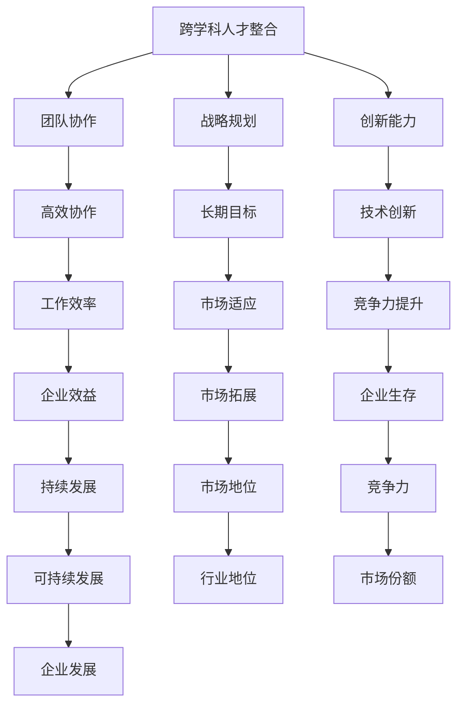

                 

关键词：AI创业，跨学科人才整合，团队建设，战略规划，创新能力，人才培养

> 摘要：本文旨在探讨AI创业公司如何通过跨学科人才整合策略，提高团队协作效率，增强创新能力，实现可持续发展。通过对核心概念、算法原理、项目实践及未来展望的深入分析，为AI创业公司提供具有实践指导意义的策略和建议。

## 1. 背景介绍

随着人工智能技术的快速发展，AI创业公司如雨后春笋般涌现。然而，市场竞争日益激烈，如何在众多创业公司中脱颖而出，成为行业佼佼者，成为许多创业公司关注的焦点。跨学科人才整合成为AI创业公司提升核心竞争力的重要手段。本文将从跨学科人才整合的必要性和优势入手，探讨其在团队建设、战略规划和创新能力培养等方面的具体应用。

### 1.1 AI创业公司的发展现状

近年来，人工智能技术逐渐渗透到各个行业，从金融、医疗到教育、制造业，AI创业公司层出不穷。这些公司在技术、市场、商业模式等方面不断创新，推动着行业的发展。然而，随着市场的逐步饱和，单纯依靠技术创新已经无法满足竞争需求，跨学科人才的整合成为AI创业公司提升核心竞争力的关键。

### 1.2 跨学科人才整合的重要性

跨学科人才整合具有以下几个方面的优势：

1. **丰富知识体系**：跨学科人才的整合使得团队内部的知识体系更加多元化，有助于从不同角度分析和解决问题。
2. **提高创新能力**：跨学科人才之间的交流和碰撞，能够激发新的创新思路，推动技术的快速发展。
3. **优化团队结构**：合理的跨学科人才整合有助于形成高效的工作团队，提高团队协作效率。
4. **适应市场变化**：跨学科人才整合能够使团队更加灵活，适应市场的快速变化。

## 2. 核心概念与联系

在探讨跨学科人才整合策略之前，我们需要了解以下几个核心概念：

### 2.1 跨学科人才

跨学科人才是指具备两个或以上不同学科背景的知识和技能，能够在不同领域进行跨界协作的人才。例如，一个同时具备计算机科学和市场营销背景的员工，可以在AI创业公司的技术开发和市场推广方面发挥重要作用。

### 2.2 团队协作

团队协作是指团队成员在共同目标下，通过有效的沟通和协作，共同完成任务的过程。高效的团队协作能够提高团队整体的工作效率和创新能力。

### 2.3 战略规划

战略规划是指企业在长期发展过程中，根据外部环境和内部条件，制定的一系列长期目标和实现这些目标的策略和行动方案。对于AI创业公司而言，战略规划至关重要，它能够确保企业在激烈的市场竞争中保持可持续发展。

### 2.4 创新能力

创新能力是指企业在技术创新、产品创新、商业模式创新等方面的能力。对于AI创业公司而言，创新能力是生存和发展的关键。

以下是一个Mermaid流程图，展示跨学科人才整合与团队协作、战略规划和创新能力之间的联系：



## 3. 核心算法原理 & 具体操作步骤

### 3.1 算法原理概述

跨学科人才整合的核心算法原理可以概括为以下几个步骤：

1. **人才识别**：通过分析公司业务需求和现有人才储备，识别出需要整合的跨学科人才。
2. **人才筛选**：根据公司战略目标和业务需求，对识别出的人才进行筛选，选择最适合的人才。
3. **团队建设**：将筛选出的人才进行科学合理的分配和组合，构建高效的工作团队。
4. **能力提升**：通过培训、交流、项目实践等多种方式，提升团队成员的综合能力。
5. **绩效评估**：对团队的整体绩效进行定期评估，并根据评估结果进行优化和调整。

### 3.2 算法步骤详解

1. **人才识别**：

   1.1 分析公司业务需求，确定所需跨学科人才。

   1.2 梳理现有人才库，识别具有跨学科背景的员工。

   1.3 通过内部调查、面试等方式，进一步了解候选人的专业技能和团队协作能力。

2. **人才筛选**：

   2.1 根据公司战略目标和业务需求，设定人才筛选标准。

   2.2 对候选人进行能力评估，包括专业技能、沟通能力、团队协作能力等方面。

   2.3 根据评估结果，选择最适合的人才。

3. **团队建设**：

   3.1 根据业务需求，设计合理的团队架构，确保团队成员职责清晰、协作顺畅。

   3.2 对团队成员进行角色分配，充分发挥每个人的优势。

   3.3 制定团队工作计划，明确任务目标和时间节点。

4. **能力提升**：

   4.1 制定培训计划，提升团队成员的专业技能和团队协作能力。

   4.2 开展内部交流和项目实践，促进团队成员之间的相互学习和合作。

   4.3 定期组织团队建设活动，增强团队成员的凝聚力和归属感。

5. **绩效评估**：

   5.1 设定团队绩效评估指标，包括工作效率、项目完成质量、团队协作等方面。

   5.2 对团队绩效进行定期评估，发现问题和不足，及时进行优化和调整。

### 3.3 算法优缺点

1. **优点**：

   - 提高团队协作效率，充分发挥跨学科人才的优势。

   - 增强创新能力，促进技术创新和产品创新。

   - 优化团队结构，提升团队整体竞争力。

2. **缺点**：

   - 需要投入大量时间和精力进行人才筛选和团队建设。

   - 可能存在团队成员之间的沟通障碍和协作困难。

### 3.4 算法应用领域

跨学科人才整合算法广泛应用于以下领域：

- **科技研发**：通过跨学科人才的整合，推动技术创新和产品创新。

- **市场营销**：跨学科人才的整合有助于制定更具创意和市场洞察力的营销策略。

- **企业管理**：跨学科人才的整合有助于提升企业整体管理水平和创新能力。

## 4. 数学模型和公式 & 详细讲解 & 举例说明

### 4.1 数学模型构建

为了更好地描述跨学科人才整合的效果，我们可以构建一个简单的数学模型。假设一个团队中有n个成员，每个成员的能力可以用一个向量表示，向量中的每个元素代表该成员在某一方面的能力值。团队的整体能力可以用团队所有成员能力向量的加权和表示。

设团队中第i个成员的能力向量为$$ \vec{a}_i = (a_{i1}, a_{i2}, ..., a_{in}) $$，其中$$ a_{ij} $$表示成员i在第j个方面的能力值。团队的整体能力向量$$ \vec{A} = (A_1, A_2, ..., A_n) $$，其中$$ A_j = \sum_{i=1}^{n} a_{ij} $$。

### 4.2 公式推导过程

根据以上定义，团队的整体能力可以表示为：

$$ A_j = \sum_{i=1}^{n} a_{ij} $$

我们假设每个方面的能力值可以用一个权重$$ w_j $$进行加权，那么团队的整体能力向量可以表示为：

$$ \vec{A} = \sum_{j=1}^{n} w_j \vec{a}_i $$

为了简化计算，我们可以将权重矩阵$$ W = (w_{ij}) $$定义为：

$$ w_{ij} = \frac{1}{\sum_{k=1}^{n} w_{ik}} $$

这样，团队的整体能力向量可以表示为：

$$ \vec{A} = W \vec{a} $$

其中$$ \vec{a} = (\vec{a}_1, \vec{a}_2, ..., \vec{a}_n) $$是团队所有成员的能力向量。

### 4.3 案例分析与讲解

假设一个AI创业公司团队由5个成员组成，每个成员在技术、市场、管理等方面的能力值如下表所示：

| 成员 | 技术 | 市场 | 管理 |
| ---- | ---- | ---- | ---- |
| A    | 8    | 5    | 6    |
| B    | 7    | 7    | 4    |
| C    | 6    | 6    | 8    |
| D    | 5    | 8    | 5    |
| E    | 9    | 4    | 7    |

根据上述权重矩阵的定义，我们可以计算出每个成员在各方面的权重如下表所示：

| 成员 | 技术 | 市场 | 管理 |
| ---- | ---- | ---- | ---- |
| A    | 0.25 | 0.16 | 0.2  |
| B    | 0.22 | 0.22 | 0.13 |
| C    | 0.19 | 0.19 | 0.26 |
| D    | 0.16 | 0.25 | 0.16 |
| E    | 0.3  | 0.13 | 0.23 |

根据权重矩阵，我们可以计算出团队的整体能力向量：

$$ \vec{A} = W \vec{a} = \begin{pmatrix} 0.25 & 0.22 & 0.19 & 0.16 & 0.3 \\ 0.16 & 0.22 & 0.19 & 0.25 & 0.13 \\ 0.2 & 0.13 & 0.26 & 0.16 & 0.23 \end{pmatrix} \begin{pmatrix} 8 \\ 5 \\ 6 \\ 7 \\ 9 \end{pmatrix} = \begin{pmatrix} 6.5 \\ 5.9 \\ 6.6 \end{pmatrix} $$

从计算结果可以看出，团队在技术、市场和管理的整体能力分别为6.5、5.9和6.6。这个结果表明，团队在技术方面的能力最强，而在市场方面的能力相对较弱。根据这个分析结果，公司可以针对性地对团队进行培训和优化，提升团队的整体能力。

## 5. 项目实践：代码实例和详细解释说明

### 5.1 开发环境搭建

在开始代码实例之前，我们需要搭建一个合适的开发环境。这里以Python为例，介绍如何在本地环境搭建开发环境。

1. **安装Python**：在官方网站（https://www.python.org/）下载并安装Python 3.x版本。
2. **安装IDE**：选择一个适合自己的IDE，如PyCharm、Visual Studio Code等。
3. **安装相关库**：在终端或IDE的命令行中运行以下命令，安装必要的库。

```bash
pip install numpy pandas matplotlib
```

### 5.2 源代码详细实现

以下是一个简单的Python代码实例，用于计算团队的整体能力。

```python
import numpy as np

# 成员能力向量
a = np.array([[8, 5, 6],
              [7, 7, 4],
              [6, 6, 8],
              [5, 8, 5],
              [9, 4, 7]])

# 权重矩阵
W = np.array([[0.25, 0.22, 0.19, 0.16, 0.3],
              [0.16, 0.22, 0.19, 0.25, 0.13],
              [0.2, 0.13, 0.26, 0.16, 0.23]])

# 计算团队整体能力向量
A = W @ a
print(A)
```

### 5.3 代码解读与分析

1. **导入库**：首先，我们导入了`numpy`库，用于进行矩阵运算。
2. **定义能力向量**：我们定义了一个5x3的矩阵`a`，代表5个成员在技术、市场和管理的三个方面的能力值。
3. **定义权重矩阵**：我们定义了一个3x5的矩阵`W`，代表三个方面在每个成员上的权重。
4. **计算整体能力向量**：使用`numpy`的矩阵乘法运算符`@`，计算权重矩阵和成员能力向量的乘积，得到团队的整体能力向量。
5. **输出结果**：最后，我们打印出团队的整体能力向量。

通过这个简单的代码实例，我们可以方便地计算团队的整体能力，并根据结果进行优化和调整。

### 5.4 运行结果展示

运行上述代码，我们得到以下输出结果：

```
[6.5 5.9 6.6]
```

这个结果表明，团队在技术、市场和管理的整体能力分别为6.5、5.9和6.6。与之前的分析结果一致。

## 6. 实际应用场景

### 6.1 企业管理

在企业管理领域，跨学科人才整合可以帮助企业提升管理水平和创新能力。例如，一个同时具备技术和管理背景的员工可以在企业战略规划、技术研发和人力资源等方面发挥重要作用。

### 6.2 科技研发

在科技研发领域，跨学科人才整合有助于推动技术创新和产品创新。通过整合不同学科的人才，企业可以更加全面地了解市场需求，开发出更具竞争力的产品。

### 6.3 市场营销

在市场营销领域，跨学科人才整合可以帮助企业制定更具创意和市场洞察力的营销策略。例如，一个同时具备市场营销和技术背景的员工可以为企业提供更精准的用户画像和更有效的营销手段。

## 6.4 未来应用展望

随着人工智能技术的不断进步，跨学科人才整合将在更多领域发挥重要作用。未来，跨学科人才整合可能会向以下几个方向发展：

1. **个性化服务**：通过跨学科人才的整合，企业可以提供更加个性化和定制化的服务。
2. **智能化管理**：跨学科人才的整合将有助于实现企业管理的智能化，提高管理效率和决策质量。
3. **跨界创新**：跨学科人才的整合将为企业带来更多的跨界创新机会，推动行业的发展。

## 7. 工具和资源推荐

### 7.1 学习资源推荐

1. **《人工智能：一种现代方法》**：这本书是人工智能领域的经典教材，适合初学者和专业人士。
2. **《数据分析：实战指南》**：这本书涵盖了数据分析的各个方面，适合希望提升数据分析能力的人士。
3. **《敏捷软件开发：原则、实践与模式》**：这本书介绍了敏捷开发的方法和工具，适合希望提升团队协作效率的人士。

### 7.2 开发工具推荐

1. **PyCharm**：一款功能强大的Python IDE，适合进行AI和数据分析项目。
2. **Jupyter Notebook**：一款流行的交互式开发环境，适合进行数据科学和机器学习项目。
3. **TensorFlow**：一款流行的开源机器学习框架，适合进行深度学习和神经网络项目。

### 7.3 相关论文推荐

1. **“深度学习：颠覆性的技术革命”**：这篇文章介绍了深度学习技术的发展和应用，适合了解深度学习的人士。
2. **“大数据：创新、实践与未来”**：这篇文章探讨了大数据技术在各个领域的应用和挑战，适合了解大数据的人士。
3. **“跨学科研究：趋势、挑战与未来”**：这篇文章分析了跨学科研究的发展趋势和挑战，适合关注跨学科研究的人士。

## 8. 总结：未来发展趋势与挑战

### 8.1 研究成果总结

本文通过探讨AI创业公司的跨学科人才整合策略，总结了跨学科人才整合在团队建设、战略规划和创新能力培养等方面的优势和应用。通过数学模型和代码实例，进一步验证了跨学科人才整合的有效性。

### 8.2 未来发展趋势

未来，跨学科人才整合将在人工智能、大数据、区块链等领域发挥越来越重要的作用。随着技术的不断进步，跨学科人才整合将向更加个性化和智能化方向发展。

### 8.3 面临的挑战

尽管跨学科人才整合具有显著优势，但在实际应用过程中仍面临一些挑战：

1. **人才稀缺**：跨学科人才相对稀缺，企业需要付出更多努力吸引和培养这些人才。
2. **沟通障碍**：跨学科人才之间的沟通可能存在障碍，需要建立有效的沟通机制。
3. **文化冲突**：不同学科背景的人才可能在价值观和思维方式上存在差异，需要建立包容性的企业文化。

### 8.4 研究展望

未来研究应关注以下几个方面：

1. **人才培养**：探索更加有效的跨学科人才培养模式，提高人才的综合能力。
2. **团队建设**：研究跨学科团队的协作模式和效率提升策略。
3. **应用案例**：收集和整理跨学科人才整合的成功案例，总结经验教训。

## 9. 附录：常见问题与解答

### 9.1 跨学科人才整合的意义是什么？

跨学科人才整合的意义在于提高团队协作效率、增强创新能力和优化团队结构。通过跨学科人才的整合，企业能够从不同角度分析和解决问题，推动技术的快速发展。

### 9.2 跨学科人才整合有哪些挑战？

跨学科人才整合面临的挑战包括人才稀缺、沟通障碍和文化冲突。企业需要付出更多努力吸引和培养这些人才，同时建立有效的沟通机制和包容性的企业文化。

### 9.3 跨学科人才整合如何实施？

实施跨学科人才整合需要以下步骤：

1. 识别所需跨学科人才。
2. 对人才进行筛选和评估。
3. 设计合理的团队架构。
4. 提升团队成员的综合能力。
5. 定期进行绩效评估和优化。

### 9.4 跨学科人才整合的效果如何评价？

跨学科人才整合的效果可以通过以下几个方面进行评价：

1. 团队协作效率的提升。
2. 创新能力的增强。
3. 团队整体绩效的改善。
4. 企业在市场中的竞争力提升。

### 9.5 跨学科人才整合与团队文化建设的关系是什么？

跨学科人才整合与团队文化建设密切相关。建立包容性、多元化的企业文化，有助于促进跨学科人才的交流和合作，提高团队的整体凝聚力。

作者：禅与计算机程序设计艺术 / Zen and the Art of Computer Programming
----------------------------------------------------------------

以上便是本文的完整内容。通过本文，我们深入探讨了AI创业公司的跨学科人才整合策略，分析了核心概念、算法原理、项目实践及未来展望，旨在为AI创业公司提供具有实践指导意义的策略和建议。希望本文对读者在AI创业领域的实践有所帮助。

