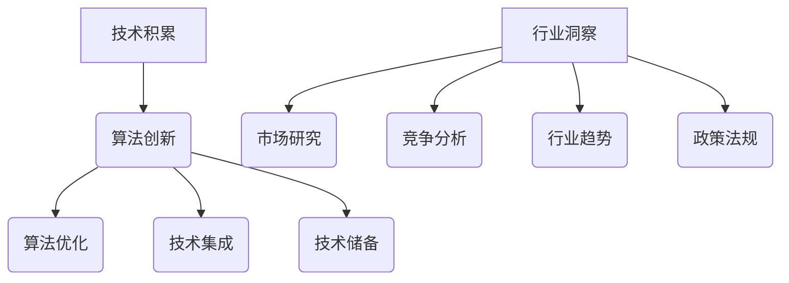

                 

关键词：AI创业、团队成长、技术积累、行业洞察、应用实践

摘要：随着人工智能技术的不断发展，越来越多的创业者投身于AI领域，打造出令人瞩目的产品。然而，如何在这竞争激烈的领域中脱颖而出，成为持续发展的成功团队，是每个创业者都面临的挑战。本文将从技术积累与行业洞察两个方面，深入探讨AI创业团队的成长之路。

## 1. 背景介绍

近年来，人工智能（AI）技术取得了飞速的发展，逐渐从理论研究走向实际应用。从智能语音助手到自动驾驶，从医疗诊断到金融风控，AI技术的应用已经渗透到各个行业。同时，AI创业也成为了科技领域的一个热门趋势。然而，如何在众多竞争者中脱颖而出，打造出成功的AI产品，是每个AI创业团队都需要思考和解决的问题。

### 1.1 AI创业的现状

据数据显示，全球范围内AI相关创业公司数量持续增长。特别是在硅谷、北京、上海等科技创新中心，AI创业公司如雨后春笋般涌现。这些创业公司涵盖了从基础算法研究到应用层解决方案的各个领域，竞争异常激烈。

### 1.2 创业团队的挑战

AI创业团队在成长过程中面临着诸多挑战：

- 技术创新：如何在现有技术的基础上实现突破，形成独特的竞争优势？
- 人才招聘：如何吸引和留住优秀的研发人才？
- 市场拓展：如何在短时间内找到目标用户，打开市场？
- 资金支持：如何获得风险投资，确保项目的持续发展？

## 2. 核心概念与联系

### 2.1 技术积累

技术积累是AI创业团队成功的关键。它包括了以下几个方面：

- 算法创新：通过深入研究，提出新的算法，提高AI模型的性能。
- 算法优化：针对现有算法，进行性能优化，提高计算效率。
- 技术集成：将多种技术进行整合，形成完整的解决方案。
- 技术储备：不断学习新的技术，为未来的项目储备技术。

### 2.2 行业洞察

行业洞察是AI创业团队了解市场需求，把握行业发展方向的重要手段。它包括了以下几个方面：

- 市场研究：通过调查和分析，了解目标用户的需求和偏好。
- 竞争分析：研究竞争对手的产品、优势和劣势，制定相应的竞争策略。
- 行业趋势：关注行业动态，把握未来发展的趋势和机遇。
- 政策法规：了解相关政策和法规，确保项目的合规性。

### 2.3 Mermaid流程图



## 3. 核心算法原理 & 具体操作步骤

### 3.1 算法原理概述

AI创业团队在技术积累方面，核心算法的研究是必不可少的。以下是一个常见的深度学习算法——卷积神经网络（CNN）的原理概述：

- 卷积操作：通过卷积核对输入数据进行卷积操作，提取特征。
- 池化操作：对卷积后的特征进行池化操作，减少数据维度。
- 激活函数：对卷积和池化后的特征进行非线性变换，引入非线性因素。
- 全连接层：将前一层特征映射到输出层，实现分类或回归任务。

### 3.2 算法步骤详解

1. 数据预处理：对原始数据进行归一化、去噪等处理，使其符合模型输入要求。
2. 构建模型：定义模型结构，包括卷积层、池化层、激活函数和全连接层。
3. 训练模型：使用训练数据对模型进行训练，通过反向传播算法调整模型参数。
4. 评估模型：使用验证集评估模型性能，调整模型参数，优化模型结构。
5. 应用模型：将训练好的模型应用于实际任务，如图像分类、目标检测等。

### 3.3 算法优缺点

优点：

- 强大的特征提取能力，适用于图像、语音等数据类型的处理。
- 能够自动学习数据中的复杂结构，减少人工设计特征的工作量。

缺点：

- 计算量大，训练时间较长。
- 对数据质量和数量有较高要求，容易过拟合。

### 3.4 算法应用领域

CNN算法在计算机视觉领域有着广泛的应用，如：

- 图像分类：识别图像中的物体类别。
- 目标检测：检测图像中的目标物体并标注位置。
- 图像分割：将图像划分为不同的区域。

## 4. 数学模型和公式 & 详细讲解 & 举例说明

### 4.1 数学模型构建

深度学习中的卷积神经网络（CNN）是基于多层感知机（MLP）构建的，其主要数学模型可以表示为：

$$
y = \sigma(\mathbf{W}^T \cdot \mathbf{a}^{[L-1]} + b^L)
$$

其中，$y$ 为输出结果，$\sigma$ 为激活函数，$\mathbf{W}^T$ 为权重矩阵，$\mathbf{a}^{[L-1]}$ 为前一层激活值，$b^L$ 为偏置项。

### 4.2 公式推导过程

1. 输入层到隐藏层的传递：
$$
\mathbf{z}^{[L]} = \mathbf{W}^{[L]} \cdot \mathbf{a}^{[L-1]} + b^{[L]}
$$
2. 激活函数的引入：
$$
\mathbf{a}^{[L]} = \sigma(\mathbf{z}^{[L]})
$$
3. 隐藏层到输出层的传递：
$$
\mathbf{z}^{[L+1]} = \mathbf{W}^{[L+1]} \cdot \mathbf{a}^{[L]} + b^{[L+1]}
$$
4. 输出结果：
$$
\mathbf{y} = \sigma(\mathbf{W}^T \cdot \mathbf{a}^{[L-1]} + b^L)
$$

### 4.3 案例分析与讲解

假设我们使用CNN模型对一张手写数字图片进行分类，输入层为28x28的像素值，隐藏层为50个神经元，输出层为10个神经元（分别表示0-9的数字）。

1. 数据预处理：对输入数据进行归一化处理，使其在[0, 1]范围内。
2. 模型构建：定义卷积层、池化层和全连接层，设置合适的参数。
3. 训练模型：使用训练数据对模型进行训练，调整权重和偏置项。
4. 评估模型：使用验证集评估模型性能，优化模型结构。
5. 应用模型：将训练好的模型应用于测试集，进行分类预测。

## 5. 项目实践：代码实例和详细解释说明

### 5.1 开发环境搭建

1. 安装Python环境，版本3.6及以上。
2. 安装TensorFlow框架，版本2.0及以上。
3. 安装NumPy、Pandas等常用库。

### 5.2 源代码详细实现

以下是一个简单的CNN模型实现，用于对MNIST手写数字数据进行分类：

```python
import tensorflow as tf
from tensorflow.keras import datasets, layers, models

# 加载数据集
(train_images, train_labels), (test_images, test_labels) = datasets.mnist.load_data()

# 数据预处理
train_images = train_images.reshape((60000, 28, 28, 1)).astype('float32') / 255
test_images = test_images.reshape((10000, 28, 28, 1)).astype('float32') / 255

# 构建模型
model = models.Sequential()
model.add(layers.Conv2D(32, (3, 3), activation='relu', input_shape=(28, 28, 1)))
model.add(layers.MaxPooling2D((2, 2)))
model.add(layers.Conv2D(64, (3, 3), activation='relu'))
model.add(layers.MaxPooling2D((2, 2)))
model.add(layers.Conv2D(64, (3, 3), activation='relu'))
model.add(layers.Flatten())
model.add(layers.Dense(64, activation='relu'))
model.add(layers.Dense(10, activation='softmax'))

# 编译模型
model.compile(optimizer='adam',
              loss='sparse_categorical_crossentropy',
              metrics=['accuracy'])

# 训练模型
model.fit(train_images, train_labels, epochs=5, batch_size=64)

# 评估模型
test_loss, test_acc = model.evaluate(test_images,  test_labels, verbose=2)
print('\nTest accuracy:', test_acc)
```

### 5.3 代码解读与分析

1. 导入TensorFlow框架和常用库。
2. 加载MNIST手写数字数据集。
3. 对数据进行预处理，包括形状变换和归一化。
4. 构建CNN模型，包括卷积层、池化层和全连接层。
5. 编译模型，设置优化器和损失函数。
6. 训练模型，设置训练轮次和批量大小。
7. 评估模型，计算测试集上的准确率。

## 6. 实际应用场景

### 6.1 智能安防

利用CNN算法对摄像头采集的视频进行分析，实现人脸识别、行为识别等功能，提高安防系统的智能化水平。

### 6.2 自动驾驶

利用CNN算法对摄像头、雷达等传感器采集的数据进行分析，实现车辆识别、路况识别等功能，提高自动驾驶系统的安全性和稳定性。

### 6.3 医疗诊断

利用CNN算法对医学影像进行分析，实现疾病检测、病灶识别等功能，辅助医生进行诊断和治疗。

### 6.4 未来应用展望

随着人工智能技术的不断发展，CNN算法将在更多领域得到应用，如自然语言处理、基因测序等。同时，深度学习模型将不断优化，训练速度和准确性将得到进一步提升。

## 7. 工具和资源推荐

### 7.1 学习资源推荐

- 《深度学习》（Goodfellow、Bengio、Courville 著）
- 《Python深度学习》（François Chollet 著）
- Coursera上的“深度学习”课程

### 7.2 开发工具推荐

- TensorFlow
- PyTorch
- Keras

### 7.3 相关论文推荐

- "A Guide to Convolutional Neural Networks for Visual Recognition"
- "Deep Learning for Computer Vision: A Review"
- "CNNs for Medical Image Analysis"

## 8. 总结：未来发展趋势与挑战

### 8.1 研究成果总结

近年来，人工智能技术取得了显著成果，特别是在深度学习领域。CNN算法在计算机视觉任务中取得了优异成绩，为AI创业团队提供了有力的技术支持。

### 8.2 未来发展趋势

随着计算能力的提升和大数据的普及，人工智能技术将不断突破，应用领域将更加广泛。深度学习模型将向更加复杂、高效的架构发展，同时，跨学科研究也将成为趋势。

### 8.3 面临的挑战

- 数据隐私和安全：如何确保用户数据的隐私和安全，是AI创业团队需要关注的重要问题。
- 模型可解释性：如何提高模型的可解释性，使其能够被用户和开发者理解和信任，是未来研究的重要方向。
- 算法公平性：如何避免算法偏见，确保算法的公平性，是每个AI创业团队都需要面对的挑战。

### 8.4 研究展望

未来，AI创业团队将在技术创新和行业洞察的指导下，不断推动人工智能技术的发展。同时，随着技术的不断成熟，AI将在更多领域发挥重要作用，为社会带来更多价值。

## 9. 附录：常见问题与解答

### 9.1 人工智能是什么？

人工智能（Artificial Intelligence，简称AI）是指使计算机系统能够模拟人类智能行为的技术。它包括机器学习、深度学习、自然语言处理等多个子领域。

### 9.2 深度学习有什么优势？

深度学习具有强大的特征提取能力和自动学习能力，能够处理大量复杂的数据，提高模型的准确性和效率。同时，它能够实现端到端的学习，减少了人工设计特征的工作量。

### 9.3 如何选择深度学习框架？

选择深度学习框架需要考虑以下因素：

- 应用场景：根据任务需求选择适合的框架。
- 学习成本：选择易于学习和使用的框架。
- 社区支持：选择具有丰富社区支持的框架，便于解决问题。

---

作者：禅与计算机程序设计艺术 / Zen and the Art of Computer Programming
```

