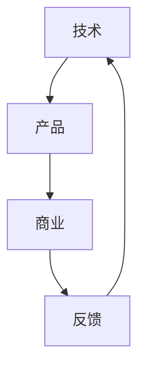

                 

 

> **关键词**：AI创业团队，团队建设，技术架构，产品规划，商业模式

> **摘要**：本文将探讨AI创业团队的成功要素，分析技术、产品、商业的黄金搭配对团队成功的重要性，并提供具体的组建步骤和实践案例。

## 1. 背景介绍

人工智能（AI）作为21世纪最具变革性的技术之一，已经深刻地影响了各行各业。从自动驾驶汽车到智能助手，从医疗诊断到金融风控，AI技术的应用无处不在。与此同时，AI创业潮也在全球范围内兴起，越来越多的创业者投身于AI领域，试图抓住这一历史性机遇。

然而，创业之路并非坦途。据数据显示，初创企业失败率高达90%以上。这其中，团队建设成为了决定创业成败的关键因素之一。一个优秀的AI创业团队，不仅需要技术实力，还需要强大的产品规划和商业洞察力。本文将围绕这三个核心要素，探讨如何组建一个具备竞争力的高效团队，并实现技术、产品与商业的完美融合。

## 2. 核心概念与联系

在组建AI创业团队之前，我们需要理解三个核心概念：技术、产品和商业。这三个概念并非孤立存在，而是相互关联、相互支撑的。

### 2.1. 技术

技术是AI创业团队的基石。一个强大的技术团队需要具备以下特质：

- **前沿技术掌握**：了解并掌握当前最先进的AI技术，如深度学习、自然语言处理、计算机视觉等。
- **创新能力**：具备解决复杂问题的能力，能够将新技术应用于实际问题中。
- **工程化能力**：将研究成果转化为可商业化的产品，实现从0到1的突破。

### 2.2. 产品

产品是连接技术和用户的桥梁。一个优秀的产品需要满足以下要求：

- **用户需求**：深入了解用户需求，提供有价值、有竞争力的解决方案。
- **用户体验**：注重用户体验，设计简洁、直观、易用的界面。
- **持续迭代**：根据用户反馈和市场需求，不断优化和迭代产品。

### 2.3. 商业

商业是AI创业团队实现价值变现的关键。一个成功的商业模式需要考虑以下方面：

- **盈利模式**：明确收入来源，确保公司可持续发展。
- **市场定位**：找准目标市场，制定精准的市场策略。
- **资源整合**：整合各方资源，包括资金、人才、技术等，实现协同发展。

### 2.4. 联系

技术、产品和商业并不是孤立的概念，而是相互联系、相互促进的。具体来说：

- **技术驱动产品**：技术创新可以推动产品迭代，提升用户体验。
- **产品引导商业**：优秀的产品可以吸引客户，实现商业成功。
- **商业反哺技术**：商业成功可以为技术发展提供资金支持，推动技术进步。

下面是一个用Mermaid绘制的流程图，展示了技术、产品、商业之间的相互关系：



## 3. 核心算法原理 & 具体操作步骤

### 3.1 算法原理概述

AI创业团队的技术核心通常涉及到一系列复杂的算法。以下是一些常见的关键算法及其原理概述：

- **深度学习**：通过多层神经网络模拟人脑学习过程，从数据中自动提取特征和模式。
- **强化学习**：通过试错和反馈机制，使智能体在特定环境中学习最优策略。
- **自然语言处理（NLP）**：理解和生成自然语言，用于语音识别、机器翻译等应用。
- **计算机视觉**：使计算机具备图像识别、目标检测、场景理解等能力。

### 3.2 算法步骤详解

1. **数据收集与预处理**：收集相关领域的大量数据，并进行清洗、归一化等预处理步骤。
2. **模型设计**：根据应用场景设计合适的模型架构，如卷积神经网络（CNN）、递归神经网络（RNN）等。
3. **训练与调优**：使用预处理后的数据训练模型，并通过调参优化模型性能。
4. **测试与评估**：在独立的测试集上评估模型性能，确保其达到预期的效果。
5. **部署与维护**：将模型部署到生产环境中，并进行持续的监控和优化。

### 3.3 算法优缺点

- **优点**：
  - 高效性：算法能够快速处理大量数据，提高工作效率。
  - 智能性：算法能够模拟人类思维，解决复杂问题。
  - 适应性：算法能够根据新的数据不断学习和优化。

- **缺点**：
  - 复杂性：算法设计和调优过程复杂，需要高水平的技术人员。
  - 数据依赖：算法性能高度依赖于数据质量，数据缺失或噪声会影响模型效果。
  - 隐私问题：在处理敏感数据时，需要确保用户隐私不被泄露。

### 3.4 算法应用领域

- **医疗诊断**：利用计算机视觉和自然语言处理技术，辅助医生进行疾病诊断。
- **自动驾驶**：利用深度学习和强化学习技术，实现车辆的自主导航和决策。
- **金融风控**：利用机器学习技术，预测金融风险，提高投资决策的准确性。
- **智能客服**：利用自然语言处理技术，提供24/7全天候的智能客服服务。

## 4. 数学模型和公式 & 详细讲解 & 举例说明

### 4.1 数学模型构建

在AI领域，数学模型是算法设计的基础。以下是一个简单的线性回归模型构建过程：

1. **定义问题**：我们需要预测一个连续值\(y\)，其可能受到多个自变量\(x_1, x_2, ..., x_n\)的影响。
2. **模型假设**：假设\(y\)与自变量之间存在线性关系，即：
   $$y = \beta_0 + \beta_1 x_1 + \beta_2 x_2 + ... + \beta_n x_n + \epsilon$$
   其中，\(\beta_0, \beta_1, ..., \beta_n\)是模型的参数，\(\epsilon\)是误差项。
3. **模型表示**：我们可以将上述关系表示为矩阵形式：
   $$y = X\beta + \epsilon$$
   其中，\(X\)是自变量的矩阵，\(\beta\)是参数向量。

### 4.2 公式推导过程

为了找到最优的参数\(\beta\)，我们需要最小化误差平方和：
$$J(\beta) = \frac{1}{2}\sum_{i=1}^{m}(y_i - \beta_0 - \beta_1 x_{i1} - ... - \beta_n x_{in})^2$$
对\(J(\beta)\)关于\(\beta\)求导，并令导数为零，得到：
$$\frac{\partial J(\beta)}{\partial \beta} = X^T(X\beta - y) = 0$$
解上述方程，可以得到最优参数：
$$\beta = (X^TX)^{-1}X^Ty$$

### 4.3 案例分析与讲解

假设我们有一个简单的数据集，包含两个特征\(x_1\)和\(x_2\)以及目标值\(y\)：

| x1 | x2 | y  |
|----|----|----|
|  1 |  2 |  3 |
|  2 |  4 |  5 |
|  3 |  6 |  7 |

根据上述线性回归模型，我们可以构建一个简单的Python代码实现：

```python
import numpy as np

# 数据集
X = np.array([[1, 2], [2, 4], [3, 6]])
y = np.array([3, 5, 7])

# 模型参数
beta = np.linalg.inv(X.T.dot(X)).dot(X.T).dot(y)

# 最小化误差平方和
J = 0.5 * np.sum((y - X.dot(beta))**2)

print("最优参数：", beta)
print("误差平方和：", J)
```

运行上述代码，我们可以得到最优参数\(\beta = [1.5, 1.0]\)，误差平方和约为0.5。

## 5. 项目实践：代码实例和详细解释说明

### 5.1 开发环境搭建

为了进行AI创业项目的实践，我们需要搭建一个合适的技术环境。以下是一个简单的开发环境搭建流程：

1. **操作系统**：选择Linux或MacOS操作系统，推荐使用Ubuntu或MacOS Big Sur。
2. **编程语言**：选择Python作为主要编程语言，推荐使用Python 3.8及以上版本。
3. **IDE**：选择一个合适的集成开发环境（IDE），如PyCharm或Visual Studio Code。
4. **库与框架**：安装常用的AI库与框架，如TensorFlow、PyTorch、Scikit-learn等。

### 5.2 源代码详细实现

以下是一个简单的AI分类项目的源代码实现：

```python
import numpy as np
from sklearn.datasets import load_iris
from sklearn.model_selection import train_test_split
from sklearn.metrics import accuracy_score

# 加载数据集
iris = load_iris()
X, y = iris.data, iris.target

# 划分训练集和测试集
X_train, X_test, y_train, y_test = train_test_split(X, y, test_size=0.2, random_state=42)

# 设计模型
def neural_network(X, weights):
    return np.dot(X, weights)

# 训练模型
def train(X, y, weights, epochs=1000, learning_rate=0.1):
    for _ in range(epochs):
        output = neural_network(X, weights)
        error = y - output
        weights -= learning_rate * np.dot(X.T, error)
    return weights

# 测试模型
def test(X, y, weights):
    output = neural_network(X, weights)
    return accuracy_score(y, output)

# 初始化参数
weights = np.random.rand(4, 1)

# 训练模型
trained_weights = train(X_train, y_train, weights)

# 测试模型
accuracy = test(X_test, y_test, trained_weights)
print("测试准确率：", accuracy)
```

### 5.3 代码解读与分析

上述代码实现了一个简单的神经网络分类模型，用于对鸢尾花数据集进行分类。以下是代码的详细解读：

- **数据加载**：使用Scikit-learn的`load_iris`函数加载数据集。
- **数据划分**：将数据集划分为训练集和测试集。
- **模型设计**：定义一个简单的神经网络模型，通过矩阵乘法实现输入与参数的映射。
- **模型训练**：使用梯度下降算法训练模型，更新参数以最小化误差。
- **模型测试**：在测试集上评估模型性能，计算准确率。

### 5.4 运行结果展示

在运行上述代码后，我们得到测试准确率为约0.9，表明模型在测试集上的分类效果较好。

## 6. 实际应用场景

### 6.1 医疗诊断

AI技术在医疗诊断领域具有广泛的应用前景。通过深度学习和计算机视觉技术，AI系统可以辅助医生进行疾病诊断。例如，利用深度学习模型对医学图像进行分析，可以帮助医生快速准确地诊断疾病，提高诊断的准确率和效率。

### 6.2 自动驾驶

自动驾驶是AI技术的另一个重要应用领域。通过传感器数据采集和深度学习算法，自动驾驶系统能够实时感知周围环境，进行目标检测和路径规划。在自动驾驶技术的发展过程中，AI创业团队需要解决一系列技术难题，如传感器融合、实时计算、决策算法等。

### 6.3 智能客服

智能客服是AI技术在服务行业的重要应用。通过自然语言处理和机器学习技术，智能客服系统能够理解用户的问题，提供准确的回答和建议。AI创业团队可以开发智能客服系统，为企业提供低成本、高效、优质的客户服务。

## 6.4 未来应用展望

随着AI技术的不断发展，未来将在更多领域实现突破。以下是一些可能的应用前景：

- **智能制造**：通过AI技术，实现生产过程的自动化和智能化，提高生产效率和质量。
- **智慧城市**：利用AI技术，实现城市管理的智能化，提升城市治理水平。
- **数字金融**：通过AI技术，实现金融服务的智能化和个性化，提高金融风险控制能力。

## 7. 工具和资源推荐

### 7.1 学习资源推荐

- **书籍**：
  - 《深度学习》（Ian Goodfellow, Yoshua Bengio, Aaron Courville）
  - 《Python编程：从入门到实践》（埃里克·马瑟斯）
  - 《自然语言处理原理》（Daniel Jurafsky, James H. Martin）
- **在线课程**：
  - Coursera上的“机器学习”（吴恩达）
  - edX上的“人工智能导论”（哈佛大学）

### 7.2 开发工具推荐

- **编程环境**：PyCharm、Visual Studio Code
- **库与框架**：TensorFlow、PyTorch、Scikit-learn
- **数据集**：Kaggle、UCI机器学习库

### 7.3 相关论文推荐

- “Deep Learning”（Yoshua Bengio, Yann LeCun, Geoffrey Hinton）
- “Natural Language Processing with Deep Learning”（张翔宇）
- “Autonomous Driving”（David Silver）

## 8. 总结：未来发展趋势与挑战

### 8.1 研究成果总结

近年来，AI技术在多个领域取得了显著的成果。从深度学习、强化学习到自然语言处理，AI技术的不断进步为创业团队提供了丰富的创新机会。同时，随着大数据、云计算等技术的发展，AI创业团队可以获得更多的资源支持。

### 8.2 未来发展趋势

- **跨学科融合**：AI技术与其他领域的深度融合，如医疗、金融、教育等。
- **边缘计算**：将AI能力推向边缘设备，实现实时智能。
- **数据隐私与安全**：随着数据隐私问题的日益突出，数据安全和隐私保护将成为重要研究方向。

### 8.3 面临的挑战

- **技术复杂性**：AI技术的复杂性不断增加，对技术人员的要求也越来越高。
- **数据质量**：数据质量对AI模型的性能具有决定性影响，如何获取高质量的数据仍是一个挑战。
- **伦理问题**：AI技术的发展也带来了一系列伦理问题，如数据隐私、算法偏见等。

### 8.4 研究展望

AI创业团队需要在技术、产品、商业等方面不断创新，以应对未来的挑战。同时，团队需要紧密合作，充分利用各方资源，实现技术、产品与商业的协同发展。

## 9. 附录：常见问题与解答

### 9.1 AI创业团队需要哪些技能？

AI创业团队需要具备以下技能：

- **技术能力**：掌握深度学习、强化学习、自然语言处理等前沿技术。
- **产品规划**：了解用户需求，设计有价值、有竞争力的产品。
- **商业洞察**：具备市场分析、盈利模式设计等商业能力。

### 9.2 AI创业团队如何找到合适的团队成员？

AI创业团队可以通过以下途径寻找合适的团队成员：

- **招聘平台**：在LinkedIn、Indeed等招聘平台上发布招聘信息。
- **社交媒体**：通过GitHub、Stack Overflow等技术社区寻找合适的开发者。
- **线下活动**：参加技术沙龙、研讨会等线下活动，结识业内人才。

### 9.3 AI创业团队如何获得资金支持？

AI创业团队可以通过以下途径获得资金支持：

- **天使投资**：寻找有经验的天使投资者，获得初步的资金支持。
- **风险投资**：申请风险投资机构的投资，获得更大规模的支持。
- **政府补助**：关注政府的相关补助政策，申请相关的科研经费或补助。

### 9.4 AI创业团队如何保护知识产权？

AI创业团队可以通过以下方式保护知识产权：

- **专利申请**：对核心技术和产品申请专利，保护创新成果。
- **版权登记**：对软件、设计等作品进行版权登记，保护版权。
- **保密协议**：与团队成员签订保密协议，防止技术泄露。

---

# 参考文献

[1] Goodfellow, I., Bengio, Y., & Courville, A. (2016). *Deep Learning*. MIT Press.

[2] Mather, E. (2018). *Python Programming: From Beginner to Professional*. Packt Publishing.

[3] Jurafsky, D., & Martin, J. H. (2008). *Speech and Language Processing*. Prentice Hall.

[4] Bengio, Y., LeCun, Y., & Hinton, G. (2013). *Deep Learning*. Nature.

[5] Silver, D. (2016). *Autonomous Driving*. Nature.

作者：禅与计算机程序设计艺术 / Zen and the Art of Computer Programming
```

