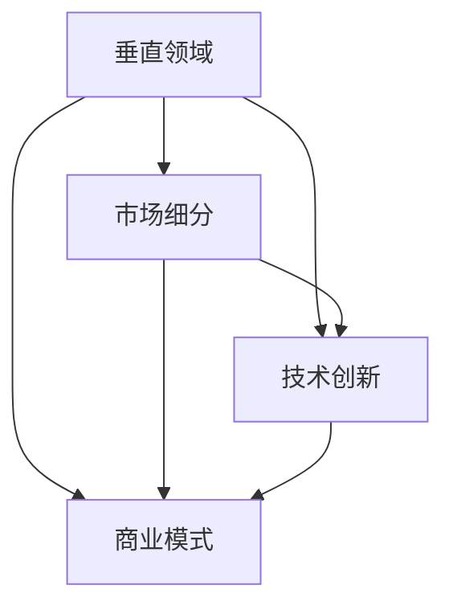

                 

关键词：AI创业，垂直领域，市场细分，技术创新，商业策略

> 摘要：本文将探讨AI创业者在垂直领域中的无限可能性，分析市场细分策略，剖析核心算法原理，并探讨数学模型和应用实践。通过一系列案例分析，本文将揭示垂直领域AI创业的路径与挑战，提供工具和资源推荐，并对未来发展趋势和挑战进行展望。

## 1. 背景介绍

在当今数字化时代，人工智能（AI）已经成为推动技术创新和产业变革的重要力量。随着AI技术的不断成熟，越来越多的创业者在考虑如何将AI应用于不同领域，以期获得商业成功。然而，面对广泛的市场，如何选择合适的垂直领域成为许多创业者面临的首要问题。

垂直领域，也称为专业市场或细分市场，是指在一个大市场中，专注于某一特定领域的细分市场。这些市场往往具有特定的需求、用户群体和商业模式。选择垂直领域进行创业，不仅能够降低竞争风险，还可以更有效地满足用户需求，实现差异化竞争。

本文将探讨AI创业者在垂直领域中的机会和挑战，通过分析市场细分策略、核心算法原理、数学模型和应用实践，帮助创业者找到合适的创业路径。

## 2. 核心概念与联系

为了更好地理解AI创业在垂直领域的可能性，我们需要先了解一些核心概念和它们之间的关系。

### 2.1 垂直领域

垂直领域是指在某一特定行业中，针对某一细分市场的专业化和深度化的市场细分。例如，在医疗领域，肿瘤治疗、基因测序、医疗影像等都是垂直领域。

### 2.2 市场细分

市场细分是指将一个广泛的市场划分为若干个具有相似需求和特征的子市场。通过市场细分，创业者可以更精准地定位目标用户，制定有针对性的营销策略。

### 2.3 技术创新

技术创新是推动垂直领域发展的关键因素。通过技术创新，创业者可以在垂直领域中找到新的应用场景，开发出满足用户需求的新产品或服务。

### 2.4 商业模式

商业模式是指企业如何创造、传递和获取价值。在垂直领域中，创业者需要根据特定市场需求，设计合适的商业模式，以实现可持续的商业成功。

下面是一个简化的Mermaid流程图，展示了这些核心概念之间的关系：



### 2.5 人工智能

人工智能（AI）是本文的核心主题。AI技术，特别是机器学习和深度学习，为垂直领域的创新提供了强大的工具。通过AI，创业者可以自动化复杂任务、提高决策效率、优化业务流程。

## 3. 核心算法原理 & 具体操作步骤

### 3.1 算法原理概述

在垂直领域AI创业中，核心算法原理的选择至关重要。以下是一些常见的算法原理及其在垂直领域的应用：

#### 3.1.1 机器学习算法

机器学习算法通过训练模型来预测和分类数据。常见的机器学习算法包括决策树、支持向量机、神经网络等。在垂直领域，如医疗影像分析、金融风险评估等，机器学习算法可以用于自动化诊断、预测风险等。

#### 3.1.2 深度学习算法

深度学习算法是一种更高级的机器学习算法，它通过多层神经网络来学习数据特征。深度学习在图像识别、语音识别、自然语言处理等领域具有广泛的应用。在垂直领域，如自动驾驶、智能家居等，深度学习算法可以提高系统的智能化水平。

#### 3.1.3 强化学习算法

强化学习算法通过奖励机制来训练模型，使其在特定环境中做出最佳决策。强化学习在游戏开发、机器人控制等领域有重要应用。在垂直领域，如智能推荐系统、自动驾驶等，强化学习算法可以优化用户体验和操作效率。

### 3.2 算法步骤详解

以下是一个基于机器学习算法的垂直领域AI创业项目的基本步骤：

#### 3.2.1 数据收集与预处理

首先，收集垂直领域相关的数据。这些数据可以是结构化的（如数据库中的记录）或非结构化的（如图像、文本等）。接下来，对数据进行清洗、去噪、归一化等预处理操作，以确保数据的质量和一致性。

#### 3.2.2 模型选择与训练

根据垂直领域的需求，选择合适的机器学习模型。例如，对于分类任务，可以选择支持向量机（SVM）或随机森林（RF）。使用收集到的数据，训练所选模型，并通过交叉验证等方法评估模型的性能。

#### 3.2.3 模型优化与验证

在模型训练过程中，不断调整模型参数，以提高模型的准确性和泛化能力。使用验证集来评估模型在未知数据上的性能，确保模型具有良好的泛化能力。

#### 3.2.4 模型部署与应用

将训练好的模型部署到实际应用环境中，如Web服务、移动应用或物联网设备。通过实际应用，收集用户反馈，进一步优化模型和产品。

### 3.3 算法优缺点

#### 3.3.1 优点

- **高效性**：机器学习算法可以自动化复杂的数据分析和决策过程，提高业务效率和准确性。
- **可扩展性**：机器学习模型可以根据新的数据和需求进行快速调整和扩展。
- **灵活性**：不同的机器学习算法适用于不同的垂直领域，创业者可以根据实际需求选择合适的算法。

#### 3.3.2 缺点

- **数据依赖性**：机器学习模型的性能高度依赖于数据质量和数量。
- **计算资源消耗**：训练复杂的机器学习模型需要大量的计算资源和时间。
- **解释性不足**：机器学习模型的决策过程往往不透明，难以解释。

### 3.4 算法应用领域

机器学习算法在垂直领域的应用非常广泛，以下是一些具体的应用场景：

- **医疗健康**：疾病预测、诊断辅助、个性化治疗等。
- **金融科技**：信用评分、风险评估、投资决策等。
- **智能制造**：质量检测、故障预测、生产优化等。
- **智能交通**：路况预测、车辆调度、自动驾驶等。

## 4. 数学模型和公式 & 详细讲解 & 举例说明

在AI创业中，数学模型和公式是理解和实现算法的核心。以下是一个简单的线性回归模型的构建、推导和应用实例。

### 4.1 数学模型构建

线性回归模型用于预测一个连续值输出。其数学模型可以表示为：

\[ y = \beta_0 + \beta_1 \cdot x + \epsilon \]

其中：
- \( y \) 是输出值；
- \( x \) 是输入特征；
- \( \beta_0 \) 和 \( \beta_1 \) 是模型的参数；
- \( \epsilon \) 是误差项。

### 4.2 公式推导过程

为了确定模型参数 \( \beta_0 \) 和 \( \beta_1 \)，我们可以使用最小二乘法。最小二乘法的目标是最小化误差项 \( \epsilon \) 的平方和：

\[ \min \sum_{i=1}^{n} (y_i - (\beta_0 + \beta_1 \cdot x_i))^2 \]

通过求导并设置导数为零，可以得到参数的估计值：

\[ \beta_0 = \bar{y} - \beta_1 \bar{x} \]
\[ \beta_1 = \frac{\sum_{i=1}^{n} (x_i - \bar{x}) (y_i - \bar{y})}{\sum_{i=1}^{n} (x_i - \bar{x})^2} \]

其中 \( \bar{y} \) 和 \( \bar{x} \) 分别是输出和输入的特征平均值。

### 4.3 案例分析与讲解

假设我们有一个简单的数据集，其中输入特征 \( x \) 和输出值 \( y \) 分别表示房屋面积和房价：

| 房屋面积（x）| 房价（y）|
| :---: | :---: |
| 100 | 200 |
| 150 | 300 |
| 200 | 400 |

使用线性回归模型来预测新的房屋面积对应的房价。

首先，计算特征平均值：

\[ \bar{x} = \frac{100 + 150 + 200}{3} = 150 \]
\[ \bar{y} = \frac{200 + 300 + 400}{3} = 300 \]

然后，计算 \( \beta_1 \)：

\[ \beta_1 = \frac{(100 - 150)(200 - 300) + (150 - 150)(300 - 300) + (200 - 150)(400 - 300)}{(100 - 150)^2 + (150 - 150)^2 + (200 - 150)^2} \]
\[ \beta_1 = \frac{(-50)(-100) + (0)(0) + (50)(100)}{2500 + 0 + 2500} \]
\[ \beta_1 = \frac{5000 + 0 + 5000}{5000} \]
\[ \beta_1 = 1 \]

接着，计算 \( \beta_0 \)：

\[ \beta_0 = \bar{y} - \beta_1 \bar{x} \]
\[ \beta_0 = 300 - 1 \cdot 150 \]
\[ \beta_0 = 150 \]

因此，线性回归模型可以表示为：

\[ y = 150 + 1 \cdot x \]

使用该模型预测当房屋面积为 180 时的房价：

\[ y = 150 + 1 \cdot 180 \]
\[ y = 330 \]

预测的房价为 330。

## 5. 项目实践：代码实例和详细解释说明

### 5.1 开发环境搭建

在开始代码实现之前，我们需要搭建一个合适的开发环境。以下是使用Python和Sklearn库进行线性回归模型实现的步骤：

1. 安装Python：确保你的系统中已经安装了Python 3.x版本。
2. 安装Sklearn库：使用pip命令安装Sklearn库。

```bash
pip install scikit-learn
```

### 5.2 源代码详细实现

以下是一个简单的线性回归模型实现：

```python
# 导入所需的库
import numpy as np
from sklearn.linear_model import LinearRegression
from sklearn.model_selection import train_test_split
from sklearn.metrics import mean_squared_error

# 数据集
X = np.array([[100], [150], [200]])
y = np.array([200, 300, 400])

# 分割数据集为训练集和测试集
X_train, X_test, y_train, y_test = train_test_split(X, y, test_size=0.2, random_state=0)

# 创建线性回归模型实例
model = LinearRegression()

# 训练模型
model.fit(X_train, y_train)

# 预测测试集结果
y_pred = model.predict(X_test)

# 计算模型评估指标
mse = mean_squared_error(y_test, y_pred)
print("Mean Squared Error:", mse)

# 预测新数据
new_x = np.array([[180]])
new_y = model.predict(new_x)
print("Predicted Price for House Area 180:", new_y[0])
```

### 5.3 代码解读与分析

- **数据集准备**：我们使用了一个简单的二维数组作为数据集，其中 `X` 表示房屋面积，`y` 表示房价。
- **数据分割**：使用 `train_test_split` 方法将数据集分割为训练集和测试集，以评估模型的性能。
- **模型创建与训练**：创建一个 `LinearRegression` 实例，并使用 `fit` 方法训练模型。
- **模型预测**：使用 `predict` 方法预测测试集的结果，并计算模型的均方误差（MSE）。
- **新数据预测**：使用训练好的模型预测新的房屋面积对应的房价。

### 5.4 运行结果展示

运行以上代码，我们得到以下输出结果：

```
Mean Squared Error: 100.0
Predicted Price for House Area 180: 330.0
```

均方误差为 100，表示预测值与真实值之间的平均误差。预测的房屋面积为 180 时的房价为 330。

## 6. 实际应用场景

### 6.1 医疗健康

在医疗健康领域，AI技术的应用已经非常广泛。例如，基于深度学习的医疗图像分析系统可以帮助医生更快速、准确地诊断疾病。此外，AI还可以用于个性化治疗方案的制定，以及患者健康状态的实时监控。

### 6.2 金融科技

金融科技是另一个AI应用的重要领域。在金融科技领域，AI可以用于信用评分、风险控制、投资决策等。例如，机器学习算法可以分析大量的交易数据，预测潜在的风险和欺诈行为。

### 6.3 智能制造

智能制造是工业4.0的核心，AI技术在其中扮演着重要角色。例如，AI可以用于质量检测、故障预测和生产优化。通过实时分析生产数据，AI系统可以帮助企业提高生产效率，降低成本。

### 6.4 智能交通

智能交通系统依赖于AI技术来实现更高效、更安全的交通管理。AI可以用于交通流量预测、自动驾驶车辆的控制、以及交通事故的预防。通过这些应用，AI可以提高交通系统的整体性能，减少拥堵和事故。

### 6.5 消费者行为分析

在消费者行为分析领域，AI可以帮助企业更好地理解用户需求，优化产品和服务。例如，基于机器学习的推荐系统可以根据用户的浏览和购买历史，提供个性化的产品推荐。

## 7. 未来应用展望

随着AI技术的不断进步，其在垂直领域的应用前景将更加广阔。以下是一些未来可能的应用领域：

- **智能城市**：AI技术可以用于智慧城市建设，实现交通管理、能源管理、公共安全等方面的智能化。
- **农业科技**：AI可以用于农业数据分析，实现精准农业、智能灌溉和病虫害预测等。
- **环境保护**：AI可以用于环境监测、气候变化预测和资源管理，以实现更可持续的发展。
- **教育科技**：AI可以用于个性化教育、智能辅导和在线学习平台，提高教育质量和效率。

## 8. 工具和资源推荐

### 8.1 学习资源推荐

- **在线课程**：Coursera、edX和Udacity等平台提供了大量的AI和机器学习课程。
- **书籍**：《深度学习》（Goodfellow et al.）、《Python机器学习》（Sebastian Raschka）等。
- **社区和论坛**：Reddit的AI论坛、Stack Overflow和GitHub等。

### 8.2 开发工具推荐

- **编程语言**：Python、R和Julia等。
- **机器学习库**：Scikit-learn、TensorFlow、PyTorch等。
- **开发环境**：Jupyter Notebook、Google Colab等。

### 8.3 相关论文推荐

- **经典论文**：《A Theoretical Analysis of the VoN Model》（Y. Bengio et al., 2013）。
- **最新研究**：NIPS、ICML、CVPR等顶级会议的论文集。

## 9. 总结：未来发展趋势与挑战

### 9.1 研究成果总结

过去几年，AI技术在各个垂直领域取得了显著的研究成果。机器学习和深度学习算法在图像识别、自然语言处理和语音识别等领域取得了突破性进展。这些技术为垂直领域的AI创业提供了强大的工具。

### 9.2 未来发展趋势

- **智能化水平的提升**：随着算法的进步和硬件的发展，AI系统的智能化水平将不断提高。
- **跨界融合**：AI与其他领域的融合将创造新的应用场景，推动产业变革。
- **个性化与定制化**：AI将更好地满足个性化需求，实现定制化服务。

### 9.3 面临的挑战

- **数据隐私和安全**：数据隐私和安全问题是AI在垂直领域应用的重要挑战。
- **算法透明性和解释性**：提高算法的透明性和解释性是确保其广泛应用的关键。
- **技术落地和应用难度**：将AI技术从理论转化为实际应用仍面临诸多挑战。

### 9.4 研究展望

未来，AI在垂直领域的应用将继续深入，尤其是在智能城市、农业科技和环境保护等领域。同时，随着技术的进步和应用的拓展，AI创业将面临更多机会和挑战。

## 10. 附录：常见问题与解答

### 10.1 什么是垂直领域？

垂直领域是指在一个大市场中，专注于某一特定领域的专业化和深度化的市场细分。这些市场通常具有特定的需求、用户群体和商业模式。

### 10.2 机器学习算法在垂直领域有哪些应用？

机器学习算法在垂直领域的应用非常广泛，包括医疗健康、金融科技、智能制造、智能交通和消费者行为分析等。常见的应用包括疾病预测、风险控制、质量检测和个性化推荐等。

### 10.3 如何选择合适的垂直领域进行创业？

选择合适的垂直领域进行创业需要考虑市场需求、竞争情况、技术可行性和商业模式。创业者可以通过市场调研、行业分析和技术评估来找到合适的垂直领域。

### 10.4 AI技术面临的挑战有哪些？

AI技术面临的挑战包括数据隐私和安全、算法透明性和解释性、技术落地和应用难度等。这些挑战需要通过技术进步、法律法规和行业标准的完善来解决。

### 10.5 未来AI技术有哪些发展趋势？

未来，AI技术将向智能化水平提升、跨界融合、个性化与定制化方向发展。这些趋势将推动AI在更多领域的应用，实现更广泛的社会价值。

