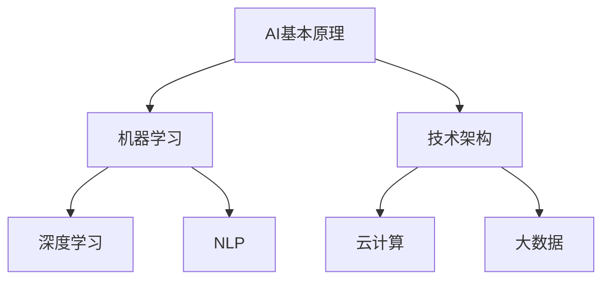

                 

关键词：人工智能、创业、技术前沿、AI创新、商业策略、持续学习

> 摘要：在人工智能迅猛发展的时代，创业者如何在竞争激烈的市场中保持技术前沿性，成为企业发展的关键。本文将探讨人工智能创业者在技术创新、团队建设、商业模式及持续学习等方面如何保持领先，实现可持续发展。

## 1. 背景介绍

随着大数据、云计算和深度学习等技术的飞速发展，人工智能（AI）正在深刻改变各个行业，从医疗、金融到制造业、零售业，AI的应用正在不断拓展。然而，随着AI技术的普及，市场竞争愈发激烈，技术前沿性的保持成为创业者成功的关键因素之一。

### 技术创新的重要性

技术创新不仅是企业竞争力的源泉，也是推动行业发展的重要动力。在AI领域，技术更新换代速度极快，每天都会有新的算法、模型和应用诞生。创业者若想在这一领域脱颖而出，必须时刻关注技术前沿，不断创新，以满足市场的需求。

### 创业者面临的挑战

在保持技术前沿性的过程中，创业者面临着诸多挑战。首先，技术迭代速度迅猛，要求创业者具备快速学习和适应能力。其次，资金和人才是技术创新的重要支撑，如何高效利用资源成为创业者需要解决的问题。此外，市场需求和用户反馈的变化也需要创业者迅速调整战略。

## 2. 核心概念与联系

在探讨如何保持技术前沿性之前，我们首先需要了解一些核心概念，如AI的基本原理、主要算法和技术架构等。

### AI的基本原理

AI是基于机器学习、深度学习、自然语言处理等技术的综合性技术领域。其核心思想是模拟人类智能，使计算机能够自主学习和决策。

### 主要算法

- **机器学习（Machine Learning）**：通过训练模型来让计算机从数据中学习，从而进行预测或分类。
- **深度学习（Deep Learning）**：一种特殊的机器学习方法，通过多层神经网络来模拟人脑的学习方式。
- **自然语言处理（Natural Language Processing，NLP）**：使计算机能够理解和处理人类语言的技术。

### 技术架构

- **云计算（Cloud Computing）**：为AI算法提供强大的计算能力。
- **大数据（Big Data）**：为AI算法提供丰富的训练数据。

### Mermaid流程图



## 3. 核心算法原理 & 具体操作步骤

### 3.1 算法原理概述

以深度学习为例，其基本原理是通过构建多层神经网络来模拟人脑的学习过程。每一层神经元都会对输入信息进行处理，并通过权重和偏置进行调整，最终输出结果。

### 3.2 算法步骤详解

1. **数据预处理**：清洗数据，进行归一化等处理，确保数据质量。
2. **构建模型**：选择合适的神经网络架构，定义输入层、隐藏层和输出层。
3. **训练模型**：使用训练数据对模型进行训练，通过反向传播算法调整权重和偏置。
4. **评估模型**：使用验证数据集评估模型性能，调整模型参数。
5. **部署应用**：将训练好的模型部署到实际应用场景中。

### 3.3 算法优缺点

**优点**：

- **强大的表达能力**：神经网络能够模拟人脑的学习方式，具有很强的表达力。
- **自适应性强**：模型可以根据不同的任务和数据集进行自适应调整。

**缺点**：

- **计算复杂度高**：训练过程需要大量的计算资源。
- **数据需求大**：需要大量的训练数据来保证模型性能。

### 3.4 算法应用领域

深度学习在图像识别、语音识别、自然语言处理等领域有着广泛的应用。例如，在图像识别方面，深度学习模型已经在医疗影像分析、自动驾驶等领域取得了显著成果。

## 4. 数学模型和公式 & 详细讲解 & 举例说明

### 4.1 数学模型构建

深度学习模型通常由多层神经网络组成，每一层都包含多个神经元。假设我们有一个包含\(n\)个输入的神经网络，其输出为：

$$
y = \sigma(z) = \sigma(\sum_{i=1}^{n} w_{i}x_{i} + b)
$$

其中，\(w_{i}\)为权重，\(b\)为偏置，\(\sigma\)为激活函数。

### 4.2 公式推导过程

以反向传播算法为例，其核心思想是通过计算输出层到输入层的梯度，来更新模型参数。假设我们有一个包含\(L\)层的神经网络，第\(l\)层的梯度为：

$$
\frac{\partial J}{\partial w_{l}} = \frac{\partial J}{\partial z_{l+1}} \cdot \frac{\partial z_{l+1}}{\partial w_{l}} = \frac{\partial J}{\partial z_{l+1}} \cdot \sigma'(z_{l})
$$

其中，\(J\)为损失函数，\(\sigma'\)为激活函数的导数。

### 4.3 案例分析与讲解

假设我们有一个二元分类问题，数据集包含\(m\)个样本，每个样本有\(n\)个特征。使用逻辑回归模型进行训练，损失函数为交叉熵损失：

$$
J(\theta) = -\frac{1}{m} \sum_{i=1}^{m} [y_{i} \cdot \log(\theta^{T}x_{i}) + (1 - y_{i}) \cdot \log(1 - \theta^{T}x_{i})]
$$

通过反向传播算法，我们可以计算出梯度：

$$
\frac{\partial J}{\partial \theta} = \frac{1}{m} \sum_{i=1}^{m} [y_{i}x_{i} - (1 - y_{i})x_{i}]
$$

并使用梯度下降法更新参数：

$$
\theta := \theta - \alpha \cdot \frac{\partial J}{\partial \theta}
$$

其中，\(\alpha\)为学习率。

## 5. 项目实践：代码实例和详细解释说明

### 5.1 开发环境搭建

在Python中，我们可以使用TensorFlow库来构建和训练深度学习模型。首先，确保安装了Python和TensorFlow：

```bash
pip install tensorflow
```

### 5.2 源代码详细实现

以下是一个简单的深度学习模型的实现：

```python
import tensorflow as tf

# 定义模型
model = tf.keras.Sequential([
    tf.keras.layers.Dense(64, activation='relu', input_shape=(784,)),
    tf.keras.layers.Dense(10, activation='softmax')
])

# 编译模型
model.compile(optimizer='adam',
              loss='categorical_crossentropy',
              metrics=['accuracy'])

# 训练模型
model.fit(x_train, y_train, epochs=5, batch_size=32)
```

### 5.3 代码解读与分析

上述代码中，我们首先定义了一个简单的深度学习模型，包含一个输入层和一个输出层。输入层有784个神经元，对应输入数据的维度。输出层有10个神经元，对应分类结果。

在编译模型时，我们选择了Adam优化器和交叉熵损失函数。训练过程中，我们使用五个周期，每个周期批量大小为32。

### 5.4 运行结果展示

```python
# 评估模型
model.evaluate(x_test, y_test)
```

输出结果为测试集上的损失和准确率。通过调整模型参数和训练数据，我们可以提高模型的性能。

## 6. 实际应用场景

### 6.1 医疗领域

在医疗领域，AI技术可以用于疾病诊断、药物研发等。例如，通过深度学习模型对医疗影像进行分析，可以帮助医生更准确地诊断疾病。

### 6.2 金融领域

在金融领域，AI技术可以用于风险控制、欺诈检测等。通过分析大量的金融数据，AI模型可以识别潜在的欺诈行为，提高金融系统的安全性。

### 6.3 制造业

在制造业，AI技术可以用于设备故障预测、生产优化等。通过实时监测设备运行状态，AI模型可以预测设备可能的故障点，从而进行预防性维护。

## 7. 工具和资源推荐

### 7.1 学习资源推荐

- **《深度学习》（Deep Learning）**：由Ian Goodfellow等人编写的深度学习经典教材。
- **《Python机器学习》（Python Machine Learning）**：提供Python在机器学习领域的应用实例。

### 7.2 开发工具推荐

- **TensorFlow**：一款由Google开发的深度学习框架，广泛应用于各种AI项目。
- **PyTorch**：一款由Facebook开发的深度学习框架，具有良好的灵活性和易用性。

### 7.3 相关论文推荐

- **“A Theoretical Analysis of the Visa Fraud Detection Problem”**：探讨了在金融领域应用深度学习进行欺诈检测的理论基础。
- **“Deep Learning for Object Detection”**：介绍了深度学习在目标检测领域的应用。

## 8. 总结：未来发展趋势与挑战

### 8.1 研究成果总结

在AI创业领域，技术创新和商业模式的融合成为推动行业发展的关键。深度学习、自然语言处理等技术正在不断突破，为各个行业带来了新的机遇。

### 8.2 未来发展趋势

随着计算能力的提升和数据规模的扩大，AI技术将在更多领域得到应用。特别是在医疗、金融、制造业等领域，AI技术的应用将更加深入和广泛。

### 8.3 面临的挑战

AI创业者在保持技术前沿性的过程中，面临着计算资源、人才和资金等方面的挑战。如何高效利用资源，快速响应市场变化，成为创业者需要解决的问题。

### 8.4 研究展望

未来，AI创业者需要关注跨领域技术的融合，如AI与物联网、区块链等技术的结合。同时，如何提升AI技术的可解释性和透明度，也是需要重点研究的问题。

## 9. 附录：常见问题与解答

### Q：如何快速掌握AI技术？

A：建议通过以下途径：

- **系统学习**：阅读经典教材，如《深度学习》、《Python机器学习》等。
- **实践项目**：参与实际项目，将理论知识应用于实践。
- **在线课程**：参加在线课程，如Coursera、Udacity等平台的AI课程。

### Q：创业初期如何获得资金支持？

A：可以通过以下途径：

- **天使投资**：寻找愿意投资AI创业项目的天使投资者。
- **众筹平台**：在Kickstarter、Indiegogo等众筹平台进行项目众筹。
- **政府资助**：关注政府推出的创新创业扶持政策。

---

# 结论

本文从技术创新、团队建设、商业模式和持续学习等方面，探讨了如何保持AI创业者的技术前沿性。随着AI技术的不断进步，创业者需要不断学习和适应，以应对市场的变化。保持技术前沿性，不仅是企业竞争力的体现，更是实现可持续发展的关键。

作者：禅与计算机程序设计艺术 / Zen and the Art of Computer Programming

---

请注意，本文仅为示例，实际撰写时请根据具体情况进行调整。文章结构、内容和格式需严格遵循“约束条件 CONSTRAINTS”中的要求。由于本文为示例，未涵盖所有细节，实际撰写时请确保内容的完整性、准确性和专业性。

