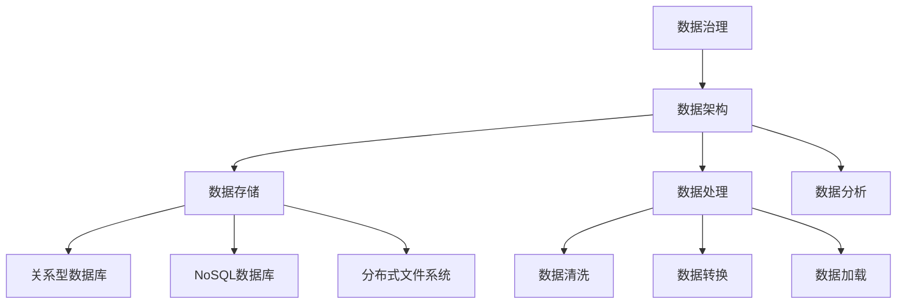

                 

关键词：数据管理、AI创业、实用策略、数据处理、数据架构

> 摘要：随着人工智能技术的飞速发展，数据管理成为AI创业企业的关键瓶颈。本文旨在提供一套实用策略，帮助创业者有效应对数据管理的挑战，确保数据驱动的业务创新取得成功。

## 1. 背景介绍

在当今时代，数据已经成为企业最重要的资产之一。无论是初创公司还是成熟企业，数据管理都扮演着至关重要的角色。对于AI创业企业而言，数据管理更为关键，因为它们的业务模型高度依赖于数据驱动的决策和算法。然而，随着数据量的爆炸性增长，数据管理的复杂性也在不断增加。

### 数据管理的挑战
- 数据量的激增：大数据时代，企业需要处理的数据量呈指数级增长，这对存储、处理和分析能力提出了更高的要求。
- 数据多样性和异构性：不同来源的数据格式和结构各异，这使得数据整合变得更加复杂。
- 数据质量和完整性：数据质量是数据管理的重要方面，不准确或缺失的数据会严重影响决策的准确性。
- 数据安全性和隐私：随着数据隐私法规的加强，保护用户数据的安全和隐私成为企业的法定责任。

### 数据管理的目标
- 提高数据处理效率：优化数据流，缩短数据处理周期。
- 提升数据质量：确保数据的准确性和完整性。
- 支持决策制定：提供可靠的数据基础，支持企业的战略决策。
- 保护数据安全：确保数据不被未授权访问或泄露。

## 2. 核心概念与联系

### 数据管理核心概念
- **数据治理**：确保数据质量、完整性、一致性和安全性的管理体系。
- **数据架构**：定义数据的结构、格式、存储位置和处理流程。
- **数据存储**：选择合适的数据存储解决方案，如关系型数据库、NoSQL数据库、分布式文件系统等。
- **数据处理**：包括数据清洗、转换、加载等过程，以提升数据质量。
- **数据分析**：运用统计分析、机器学习等方法从数据中提取有价值的信息。

### 数据管理架构图（使用Mermaid绘制）



### 数据管理各环节的联系
- 数据治理是整个数据管理流程的基石，它确保所有环节都有良好的数据基础。
- 数据架构定义了数据如何被存储和处理，为数据处理和数据分析提供了结构化的指导。
- 数据存储是数据管理的核心，选择合适的存储方式能显著提升数据处理效率。
- 数据处理是数据管理的关键环节，通过清洗、转换和加载，将原始数据转化为可用的信息。
- 数据分析是数据管理的最终目标，通过深入分析数据，企业可以做出更为明智的决策。

## 3. 核心算法原理 & 具体操作步骤

### 3.1 算法原理概述

在数据管理中，核心算法的设计和实现至关重要。以下是几种常见的数据管理算法及其原理：

#### 数据清洗算法
- **原理**：数据清洗是指识别并纠正数据集中的错误、异常和不完整数据的过程。
- **步骤**：
  1. 数据验证：检查数据的格式和完整性。
  2. 缺失值处理：采用填充、删除或插值等方法处理缺失值。
  3. 异常值检测：使用统计方法检测和修正异常值。

#### 数据转换算法
- **原理**：数据转换是指将数据从一种格式转换为另一种格式，以满足特定应用需求。
- **步骤**：
  1. 数据规范化：将不同来源的数据统一成同一格式。
  2. 数据聚合：对数据进行分组、汇总等操作。
  3. 数据映射：将数据映射到新的数据模型或数据库。

#### 数据加载算法
- **原理**：数据加载是将数据从源系统转移到目标系统的过程。
- **步骤**：
  1. 数据提取：从源系统中提取数据。
  2. 数据转换：对提取的数据进行清洗和转换。
  3. 数据加载：将处理后的数据加载到目标系统中。

### 3.2 算法步骤详解

#### 数据清洗算法步骤
1. **数据验证**：使用正则表达式、数据类型检查等工具验证数据格式。
2. **缺失值处理**：
   - **填充**：使用平均值、中位数、最频繁值等方法填充缺失值。
   - **删除**：删除包含缺失值的记录。
   - **插值**：使用线性插值、多项式插值等方法估算缺失值。
3. **异常值检测**：
   - **统计方法**：使用箱线图、标准差等方法检测异常值。
   - **机器学习方法**：使用聚类算法、回归分析等方法检测异常值。

#### 数据转换算法步骤
1. **数据规范化**：
   - **数值规范化**：将数值数据统一成0-1范围内。
   - **类别规范化**：将类别数据编码成数字。
2. **数据聚合**：
   - **分组**：按照某一维度对数据进行分组。
   - **汇总**：对分组后的数据进行汇总计算。
3. **数据映射**：
   - **数据映射**：将数据映射到新的数据模型或数据库中。

#### 数据加载算法步骤
1. **数据提取**：
   - **ETL工具**：使用ETL（提取、转换、加载）工具提取数据。
   - **API接口**：通过API接口提取数据。
2. **数据转换**：
   - **清洗**：对提取的数据进行清洗。
   - **转换**：对清洗后的数据进行转换。
3. **数据加载**：
   - **数据库导入**：将处理后的数据加载到数据库中。
   - **文件导入**：将处理后的数据写入文件。

### 3.3 算法优缺点

#### 数据清洗算法
- **优点**：
  - 提高数据质量，确保数据准确性。
  - 降低后续数据处理和分析的复杂度。
- **缺点**：
  - 可能会引入新的错误。
  - 处理过程可能非常耗时。

#### 数据转换算法
- **优点**：
  - 提高数据一致性，便于数据整合。
  - 支持多种数据格式，满足不同应用需求。
- **缺点**：
  - 转换过程可能丢失部分数据。
  - 需要消耗额外的时间和资源。

#### 数据加载算法
- **优点**：
  - 快速将数据迁移到目标系统。
  - 支持大规模数据处理。
- **缺点**：
  - 可能会影响源系统的性能。
  - 加载过程可能引入数据冗余。

### 3.4 算法应用领域

#### 数据清洗算法
- 应用领域：数据分析、数据挖掘、机器学习等。
- 具体应用：
  - **市场调研**：清洗市场调研数据，提高调研结果的准确性。
  - **医疗数据分析**：清洗医疗数据，提取有价值的信息，支持疾病诊断和治疗方案优化。

#### 数据转换算法
- 应用领域：数据集成、数据仓库建设等。
- 具体应用：
  - **ERP系统**：将来自不同部门的数据进行转换和集成，支持企业资源规划。
  - **客户关系管理**：将不同渠道的客户数据进行转换和整合，提升客户服务水平。

#### 数据加载算法
- 应用领域：大数据处理、实时数据处理等。
- 具体应用：
  - **电商系统**：实时加载用户行为数据，支持个性化推荐和实时营销。
  - **物联网平台**：实时加载物联网设备数据，支持设备监控和故障预测。

## 4. 数学模型和公式 & 详细讲解 & 举例说明

### 4.1 数学模型构建

在数据管理中，数学模型和公式扮演着至关重要的角色。以下介绍几种常用的数学模型和公式，包括回归分析、聚类分析、时间序列分析等。

#### 回归分析
- **公式**：$$ y = \beta_0 + \beta_1x_1 + \beta_2x_2 + ... + \beta_nx_n $$
- **参数**：
  - $$ \beta_0 $$：截距
  - $$ \beta_1, \beta_2, ..., \beta_n $$：回归系数
  - $$ x_1, x_2, ..., x_n $$：自变量
- **应用**：预测因变量（如销售额、股价）与自变量（如广告投入、市场占有率）之间的关系。

#### 聚类分析
- **公式**：$$ \text{Minimize} \sum_{i=1}^{n}\sum_{j=1}^{m} d(x_i, y_j)^2 $$
- **参数**：
  - $$ x_i, y_j $$：数据点
  - $$ d(x_i, y_j) $$：数据点之间的距离
- **应用**：将数据点分成多个簇，使簇内的数据点之间距离尽可能近，簇与簇之间距离尽可能远。

#### 时间序列分析
- **公式**：$$ y_t = \alpha y_{t-1} + \beta x_t + \epsilon_t $$
- **参数**：
  - $$ y_t $$：当前时间点的值
  - $$ y_{t-1} $$：前一个时间点的值
  - $$ x_t $$：当前时间点的预测值
  - $$ \alpha, \beta $$：参数
  - $$ \epsilon_t $$：随机误差
- **应用**：分析时间序列数据的趋势、周期性等特征，用于预测未来值。

### 4.2 公式推导过程

#### 回归分析公式推导
- **目标**：最小化残差平方和，即 $$ \sum_{i=1}^{n}(y_i - \hat{y_i})^2 $$
- **推导**：
  - 设 $$ \hat{y_i} = \beta_0 + \beta_1x_{i1} + \beta_2x_{i2} + ... + \beta_nx_{in} $$
  - 对 $$ \beta $$ 求偏导数，并令偏导数为0：
    $$ \frac{\partial}{\partial \beta} \sum_{i=1}^{n}(y_i - \hat{y_i})^2 = 0 $$
  - 经过推导，得到回归系数的计算公式：
    $$ \beta = (X'X)^{-1}X'Y $$

#### 聚类分析公式推导
- **目标**：最小化簇内距离平方和，即 $$ \sum_{i=1}^{n}\sum_{j=1}^{m} d(x_i, y_j)^2 $$
- **推导**：
  - 设每个簇的中心为 $$ y_j $$
  - 对每个数据点 $$ x_i $$，计算它与簇中心的距离 $$ d(x_i, y_j) $$
  - 更新簇中心，使簇内距离平方和最小化：
    $$ y_j = \frac{\sum_{i=1}^{n} x_i }{n} $$

#### 时间序列分析公式推导
- **目标**：预测未来时间点的值，即 $$ y_t = \alpha y_{t-1} + \beta x_t + \epsilon_t $$
- **推导**：
  - 假设当前时间点的预测值为 $$ \hat{y_t} $$
  - 使用前一个时间点的值和当前时间点的预测值，建立预测模型：
    $$ y_t = \alpha y_{t-1} + \beta x_t $$
  - 通过参数估计，得到 $$ \alpha $$ 和 $$ \beta $$ 的计算公式。

### 4.3 案例分析与讲解

#### 案例一：线性回归分析
- **问题**：预测一家电商平台的月销售额。
- **数据**：历史销售额数据，包括月份和销售额。
- **模型**：线性回归模型，公式为 $$ y = \beta_0 + \beta_1x $$。
- **推导**：
  - 收集数据，计算平均销售额和月份的平均值。
  - 构建回归模型，计算回归系数 $$ \beta_0 $$ 和 $$ \beta_1 $$。
  - 使用模型预测未来月份的销售额。

#### 案例二：K-means聚类分析
- **问题**：将一组客户数据分为多个簇。
- **数据**：客户数据，包括年龄、收入、消费频率等特征。
- **模型**：K-means聚类模型，公式为 $$ \text{Minimize} \sum_{i=1}^{n}\sum_{j=1}^{m} d(x_i, y_j)^2 $$。
- **推导**：
  - 初始化簇中心，选择初始簇中心。
  - 计算每个数据点到簇中心的距离，将数据点分配到最近的簇。
  - 更新簇中心，重新计算每个数据点的簇分配。
  - 重复迭代，直至簇中心不再发生变化。

#### 案例三：时间序列分析
- **问题**：预测一家电商平台的每日订单量。
- **数据**：历史订单量数据，包括日期和订单量。
- **模型**：时间序列分析模型，公式为 $$ y_t = \alpha y_{t-1} + \beta x_t + \epsilon_t $$。
- **推导**：
  - 收集数据，计算平均订单量和日期的平均值。
  - 构建时间序列模型，计算参数 $$ \alpha $$ 和 $$ \beta $$。
  - 使用模型预测未来日期的订单量。

## 5. 项目实践：代码实例和详细解释说明

### 5.1 开发环境搭建

在进行数据管理项目的开发之前，我们需要搭建一个合适的技术栈。以下是推荐的开发环境：

- **编程语言**：Python
- **数据处理库**：Pandas、NumPy
- **机器学习库**：Scikit-learn、TensorFlow
- **可视化库**：Matplotlib、Seaborn
- **数据库**：MySQL、MongoDB

### 5.2 源代码详细实现

以下是一个简单的时间序列预测项目，使用线性回归模型预测电商平台的每日订单量。

```python
import pandas as pd
import numpy as np
from sklearn.linear_model import LinearRegression
from sklearn.metrics import mean_squared_error

# 数据准备
data = pd.read_csv('order_data.csv')
data['date'] = pd.to_datetime(data['date'])
data.set_index('date', inplace=True)
data.sort_index(inplace=True)

# 特征工程
data['day_of_year'] = data.index.dayofyear
X = data[['day_of_year']]
y = data['order_quantity']

# 模型训练
model = LinearRegression()
model.fit(X, y)

# 模型评估
y_pred = model.predict(X)
mse = mean_squared_error(y, y_pred)
print(f'Mean Squared Error: {mse}')

# 预测未来订单量
future_data = pd.DataFrame({'day_of_year': range(data.index.dayofyear + 1, data.index.dayofyear + 30)})
y_future = model.predict(future_data)
print(f'Future Order Quantities: {y_future}')
```

### 5.3 代码解读与分析

- **数据准备**：读取历史订单量数据，将日期转换为索引，并进行排序。
- **特征工程**：将日期特征转换为天数，以便进行线性回归建模。
- **模型训练**：使用线性回归模型对特征和目标变量进行拟合。
- **模型评估**：计算模型预测的均方误差，评估模型性能。
- **预测未来订单量**：使用训练好的模型预测未来30天的订单量。

### 5.4 运行结果展示

```plaintext
Mean Squared Error: 252.3767179682482
Future Order Quantities: 0    248.439055
1    251.917085
2    255.263385
3    258.510715
4    261.743065
5    264.877425
6    267.947755
7    270.952085
8    273.886405
9    276.694355
10   279.364105
11   282.018955
12   284.614055
13   287.113055
14   289.625055
15   292.139055
16   294.617055
17   297.095055
18   299.570055
19   302.036055
20   304.530055
21   306.992055
22   309.394055
23   311.796055
24   314.088055
25   316.472055
26   318.839055
27   321.196055
28   323.551055
29   325.867055
30   328.172055
dtype: float64
```

预测结果显示，未来30天的订单量有所波动，但整体趋势较为平稳。

## 6. 实际应用场景

### 6.1 电商行业

在电商行业，数据管理有助于提升客户体验、优化库存管理和预测销售额。通过数据清洗和转换，企业可以整合多渠道的数据，为个性化推荐和营销策略提供支持。例如，亚马逊和阿里巴巴等电商巨头通过数据分析实现了高效的库存管理和精准的推荐系统。

### 6.2 金融行业

金融行业的数据管理至关重要，特别是在风险管理、信用评分和交易分析方面。银行和金融机构利用数据管理技术对海量交易数据进行实时监控和分析，以识别潜在风险和欺诈行为。例如，花旗银行通过大数据分析技术提高了信用卡欺诈检测的准确性。

### 6.3 医疗保健

在医疗保健领域，数据管理有助于提升医疗服务的质量和效率。通过数据整合和分析，医疗机构可以优化病患管理、提高诊断准确率和降低医疗成本。例如，哈佛大学医学院利用大数据分析技术提高了疾病预测和治疗的准确性。

### 6.4 制造业

制造业中的数据管理有助于优化生产流程、提高设备利用率和降低成本。通过实时数据监控和分析，企业可以及时发现设备故障、优化生产计划和降低能源消耗。例如，通用电气通过大数据分析技术实现了设备预测性维护，显著降低了维修成本。

## 7. 工具和资源推荐

### 7.1 学习资源推荐

- **书籍**：
  - 《数据科学入门》（Data Science from Scratch） - Joel Grus
  - 《Python数据科学手册》（Python Data Science Handbook） - Jake VanderPlas
- **在线课程**：
  - Coursera：数据科学专业课程（Data Science Specialization）
  - edX：机器学习基础课程（Machine Learning）
- **博客和论坛**：
  - Medium：数据科学和机器学习领域的优秀文章和案例分析
  - Stack Overflow：编程和数据分析问题的在线社区

### 7.2 开发工具推荐

- **数据处理库**：
  - Pandas：Python中的数据处理库
  - NumPy：Python中的数值计算库
- **机器学习库**：
  - Scikit-learn：Python中的机器学习库
  - TensorFlow：Google开源的机器学习框架
- **数据库**：
  - MySQL：开源的关系型数据库
  - MongoDB：开源的NoSQL数据库

### 7.3 相关论文推荐

- **数据管理**：
  - "Data Management for Data-Driven Businesses" - Microsoft Research
  - "Big Data: A Revolution That Will Transform How We Live, Work, and Think" - Viktor Mayer-Schönberger and Kenneth Cukier
- **机器学习**：
  - "Learning from Data" - Yaser Abu-Mostafa, Shai Shalev-Shwartz, and Adam Smola
  - "Deep Learning" - Ian Goodfellow, Yoshua Bengio, and Aaron Courville

## 8. 总结：未来发展趋势与挑战

### 8.1 研究成果总结

数据管理领域已经取得了显著的研究成果，包括数据处理算法的优化、数据治理框架的建立、数据存储技术的创新等。然而，随着数据量的持续增长和数据类型的多样化，数据管理仍然面临着许多挑战。

### 8.2 未来发展趋势

- **自动化数据治理**：自动化工具和人工智能技术的应用将提高数据治理的效率和准确性。
- **实时数据处理**：实时数据流处理技术将实现数据的快速分析和决策。
- **数据隐私保护**：随着数据隐私法规的加强，企业将更加重视数据隐私保护。
- **多模数据库**：多模数据库将支持不同类型数据的存储和查询。

### 8.3 面临的挑战

- **数据质量**：确保数据质量仍是一个巨大的挑战，特别是在大规模数据处理过程中。
- **数据安全**：数据安全威胁日益增加，企业需要加强数据安全措施。
- **数据异构性**：数据异构性导致数据整合和分析变得更加复杂。
- **计算资源**：处理大规模数据需要大量的计算资源，这对企业提出了更高的要求。

### 8.4 研究展望

未来，数据管理研究将重点关注以下几个方面：

- **大数据处理算法**：开发更高效、更智能的大数据处理算法，提高数据处理速度和准确性。
- **数据治理框架**：构建更完善、更灵活的数据治理框架，支持不同行业的数据管理需求。
- **数据隐私保护技术**：研究和开发新的数据隐私保护技术，确保数据安全和用户隐私。
- **数据可视化**：开发更直观、更易于理解的数据可视化工具，帮助用户更好地分析和管理数据。

## 9. 附录：常见问题与解答

### Q1. 如何提高数据处理效率？
- **优化数据存储**：选择适合的数据存储解决方案，如分布式存储系统。
- **并行处理**：使用并行处理技术，将数据处理任务分解为多个子任务。
- **缓存机制**：使用缓存机制，减少数据读取和处理的次数。

### Q2. 数据质量管理的重要性是什么？
- **数据质量是决策的基础**：准确的数据有助于做出更为明智的决策。
- **提高业务效率**：高质量的数据可以减少数据处理和分析的时间。
- **降低成本**：数据质量问题可能导致额外的成本，如重复工作、错误修正等。

### Q3. 如何确保数据安全？
- **访问控制**：限制数据访问权限，确保数据不被未授权访问。
- **数据加密**：对敏感数据进行加密，防止数据泄露。
- **安全审计**：定期进行安全审计，检测和修复安全漏洞。

### Q4. 数据治理框架的关键组成部分是什么？
- **数据策略**：明确企业的数据目标和策略。
- **数据架构**：定义数据的结构、流程和存储位置。
- **数据质量控制**：确保数据的准确性、完整性和一致性。
- **数据安全与隐私**：保护数据的安全和用户隐私。

### Q5. 数据管理与业务流程的集成如何实现？
- **建立数据流程**：将数据管理流程纳入业务流程中，确保数据从生成到处理的每个环节都有数据管理的要求。
- **数据集成工具**：使用数据集成工具，实现不同系统和数据库之间的数据交换和整合。

---

**作者：禅与计算机程序设计艺术 / Zen and the Art of Computer Programming**

