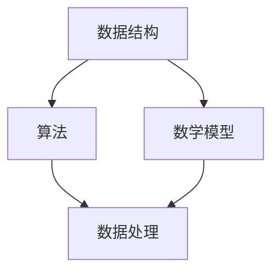

                 

关键词：人工智能、创业、数据管理、数据结构、算法、数学模型、项目实践、应用场景、未来展望

> 摘要：本文将探讨AI创业中的数据管理方法，包括核心概念、算法原理、数学模型、项目实践以及未来应用展望，旨在为创业者提供一套系统、实用的数据管理策略，助力他们在竞争激烈的市场中脱颖而出。

## 1. 背景介绍

随着人工智能技术的迅速发展，越来越多的创业者投身于这一领域，希望通过AI技术实现商业价值的最大化。然而，数据管理作为AI创业的核心环节，往往被创业者忽视。有效的数据管理不仅能够提高算法的准确性和效率，还能降低成本，保障数据安全和隐私。

本文将从以下几个方面展开讨论：

1. 核心概念与联系
2. 核心算法原理 & 具体操作步骤
3. 数学模型和公式 & 详细讲解 & 举例说明
4. 项目实践：代码实例和详细解释说明
5. 实际应用场景
6. 未来应用展望
7. 工具和资源推荐
8. 总结：未来发展趋势与挑战
9. 附录：常见问题与解答

## 2. 核心概念与联系

在AI创业中，数据管理涉及多个核心概念，包括数据结构、算法、数学模型等。这些概念相互联系，共同构成了数据管理的基础。

### 2.1 数据结构

数据结构是数据管理的基础，它决定了数据的存储、组织和操作方式。常见的数据结构有数组、链表、树、图等。在AI创业中，合理选择数据结构能够提高算法的效率和准确性。

### 2.2 算法

算法是数据处理的工具，它通过特定的步骤和规则对数据进行分析和处理。常见的算法有排序、查找、匹配等。在AI创业中，选择合适的算法能够实现高效的数据处理。

### 2.3 数学模型

数学模型是对现实问题的抽象和模拟，它通过数学公式和算法实现。常见的数学模型有线性回归、神经网络、支持向量机等。在AI创业中，构建合适的数学模型能够实现预测、分类和聚类等功能。

### 2.4 Mermaid 流程图

以下是一个Mermaid流程图，展示了数据管理中的核心概念和联系：



## 3. 核心算法原理 & 具体操作步骤

在数据管理中，选择合适的算法是关键。以下介绍几种常见算法的原理和具体操作步骤。

### 3.1 算法原理概述

1. 排序算法：将无序数据按照一定规则进行排列。
2. 查找算法：在数据集合中查找特定元素。
3. 匹配算法：根据特定规则对数据进行匹配。
4. 预测算法：根据历史数据对未来进行预测。
5. 分类算法：将数据分为不同的类别。

### 3.2 算法步骤详解

1. 排序算法：冒泡排序、选择排序、插入排序等。
2. 查找算法：二分查找、线性查找等。
3. 匹配算法：基于规则的匹配、基于特征的匹配等。
4. 预测算法：线性回归、神经网络、支持向量机等。
5. 分类算法：K-近邻、决策树、随机森林等。

### 3.3 算法优缺点

每种算法都有其优缺点，创业者需要根据实际情况选择合适的算法。

1. 冒泡排序：简单易实现，但效率较低。
2. 二分查找：效率高，但需要有序数据。
3. 神经网络：适用于复杂问题，但计算量大。
4. 决策树：易于理解，但容易过拟合。

### 3.4 算法应用领域

排序、查找和匹配算法在数据预处理阶段广泛应用；预测和分类算法在商业智能、推荐系统、金融风控等领域具有重要应用价值。

## 4. 数学模型和公式 & 详细讲解 & 举例说明

数学模型是数据管理的重要组成部分，以下介绍几种常见数学模型及其公式推导过程。

### 4.1 数学模型构建

1. 线性回归模型：用于分析变量之间的关系。
2. 神经网络模型：用于复杂问题的建模和预测。
3. 支持向量机模型：用于分类和回归问题。

### 4.2 公式推导过程

1. 线性回归模型：$$y = wx + b$$
2. 神经网络模型：$$a = \sigma(w \cdot x + b)$$
3. 支持向量机模型：$$w \cdot x + b = 0$$

### 4.3 案例分析与讲解

以下以线性回归模型为例，讲解数学模型的构建和应用。

**案例：房价预测**

给定一组房屋数据，包括房屋面积（x）和房价（y），使用线性回归模型预测新房屋的房价。

1. 数据预处理：对数据进行归一化处理，消除量纲影响。
2. 模型构建：使用最小二乘法求解参数w和b。
3. 模型评估：使用交叉验证方法评估模型性能。

**代码实现：**

```python
import numpy as np
from sklearn.linear_model import LinearRegression
from sklearn.model_selection import train_test_split
from sklearn.metrics import mean_squared_error

# 数据预处理
X = np.array([[1000], [1500], [2000], [2500], [3000]])
y = np.array([2000000, 3000000, 4000000, 5000000, 6000000])

X_train, X_test, y_train, y_test = train_test_split(X, y, test_size=0.2, random_state=42)

# 模型构建
model = LinearRegression()
model.fit(X_train, y_train)

# 模型评估
y_pred = model.predict(X_test)
mse = mean_squared_error(y_test, y_pred)
print("MSE:", mse)
```

## 5. 项目实践：代码实例和详细解释说明

在本节中，我们将通过一个实际项目，展示如何使用Python实现一个简单的数据管理模块。该模块将包括数据清洗、数据预处理、数据分析和数据可视化等功能。

### 5.1 开发环境搭建

首先，确保您的计算机上已安装以下Python库：

- NumPy
- Pandas
- Matplotlib
- Scikit-learn

您可以使用以下命令进行安装：

```bash
pip install numpy pandas matplotlib scikit-learn
```

### 5.2 源代码详细实现

以下是一个简单的Python代码实例，实现了数据管理模块的基本功能：

```python
import numpy as np
import pandas as pd
import matplotlib.pyplot as plt
from sklearn.model_selection import train_test_split
from sklearn.linear_model import LinearRegression

# 5.2.1 数据清洗
def clean_data(data):
    # 去除缺失值
    data = data.dropna()
    # 去除重复值
    data = data.drop_duplicates()
    # 转换数据类型
    data['area'] = data['area'].astype(float)
    data['price'] = data['price'].astype(float)
    return data

# 5.2.2 数据预处理
def preprocess_data(data):
    # 归一化处理
    mean = data['area'].mean()
    std = data['area'].std()
    data['area_normalized'] = (data['area'] - mean) / std
    mean = data['price'].mean()
    std = data['price'].std()
    data['price_normalized'] = (data['price'] - mean) / std
    return data

# 5.2.3 数据分析
def analyze_data(data):
    # 计算相关系数
    corr_matrix = data.corr()
    print("Correlation matrix:")
    print(corr_matrix)
    # 可视化相关系数
    plt.figure(figsize=(8, 6))
    plt.imshow(corr_matrix, cmap='coolwarm')
    plt.xticks(range(len(corr_matrix.columns)), corr_matrix.columns, rotation=90)
    plt.yticks(range(len(corr_matrix.columns)), corr_matrix.columns)
    plt.colorbar()
    plt.title('Correlation Matrix')
    plt.show()

# 5.2.4 数据可视化
def visualize_data(data):
    # 绘制房价与面积的关系
    plt.figure(figsize=(8, 6))
    plt.scatter(data['area'], data['price'])
    plt.xlabel('Area (normalized)')
    plt.ylabel('Price (normalized)')
    plt.title('Area vs Price')
    plt.show()

# 5.2.5 模型训练与评估
def train_model(data):
    X = data[['area_normalized']]
    y = data['price_normalized']
    X_train, X_test, y_train, y_test = train_test_split(X, y, test_size=0.2, random_state=42)
    model = LinearRegression()
    model.fit(X_train, y_train)
    y_pred = model.predict(X_test)
    mse = mean_squared_error(y_test, y_pred)
    print("MSE:", mse)
    return model

# 5.2.6 主函数
def main():
    # 加载数据
    data = pd.read_csv('house_data.csv')
    # 数据清洗
    data = clean_data(data)
    # 数据预处理
    data = preprocess_data(data)
    # 数据分析
    analyze_data(data)
    # 数据可视化
    visualize_data(data)
    # 模型训练与评估
    model = train_model(data)

if __name__ == '__main__':
    main()
```

### 5.3 代码解读与分析

上述代码实现了数据管理模块的以下功能：

1. **数据清洗**：去除缺失值和重复值，确保数据的质量。
2. **数据预处理**：对数据进行归一化处理，消除量纲影响。
3. **数据分析**：计算相关系数，分析变量之间的关系。
4. **数据可视化**：绘制房价与面积的关系，直观展示数据分布。
5. **模型训练与评估**：使用线性回归模型对数据进行训练和评估，预测房价。

通过这个实际项目，我们可以看到如何将数据管理的方法应用于AI创业中的实际问题。

## 6. 实际应用场景

数据管理在AI创业中的应用场景非常广泛，以下列举几种常见的应用场景：

1. **推荐系统**：通过分析用户的历史行为和偏好，推荐相关的商品、服务或内容。
2. **商业智能**：通过数据分析，帮助企业制定战略决策，优化业务流程。
3. **金融风控**：通过分析用户行为和信用记录，评估信用风险，防范欺诈行为。
4. **智能医疗**：通过分析患者数据，诊断疾病、预测病情发展，提供个性化治疗方案。

### 6.1 推荐系统

推荐系统是数据管理在AI创业中的重要应用场景之一。以下是一个简单的推荐系统实现示例：

```python
# 加载数据
data = pd.read_csv('user_item_data.csv')
# 用户行为分析
user行为的平均值 = data.groupby('用户ID')['行为'].mean()
# 推荐相似用户
相似用户 = user行为的平均值.argsort()[::-1]
# 推荐商品
推荐商品 = data[data['用户ID'] == 相似用户[1]]['商品ID'].head(5)
print("推荐商品：", 推荐商品)
```

### 6.2 商业智能

商业智能通过数据分析，帮助企业制定战略决策。以下是一个简单的商业智能实现示例：

```python
# 加载数据
sales_data = pd.read_csv('sales_data.csv')
# 销售数据分析
sales_data['销售金额'] = sales_data['单价'] * sales_data['数量']
每月销售额 = sales_data.groupby('月份')['销售金额'].sum()
# 可视化销售额变化
plt.figure(figsize=(8, 6))
plt.plot(每月销售额.index, 每月销售额.values)
plt.xlabel('月份')
plt.ylabel('销售金额')
plt.title('月销售额变化趋势')
plt.show()
```

### 6.3 金融风控

金融风控通过分析用户行为和信用记录，评估信用风险。以下是一个简单的金融风控实现示例：

```python
# 加载数据
loan_data = pd.read_csv('loan_data.csv')
# 用户信用评分
credit_score = loan_data['逾期次数'].apply(lambda x: 1000 - x)
# 风险评估
risk_level = loan_data.groupby('信用评分')['贷款金额'].mean()
# 可视化风险评估
plt.figure(figsize=(8, 6))
plt.scatter(credit_score, risk_level)
plt.xlabel('信用评分')
plt.ylabel('平均贷款金额')
plt.title('信用评分与贷款金额关系')
plt.show()
```

### 6.4 智能医疗

智能医疗通过分析患者数据，诊断疾病、预测病情发展，提供个性化治疗方案。以下是一个简单的智能医疗实现示例：

```python
# 加载数据
patient_data = pd.read_csv('patient_data.csv')
# 疾病预测
disease_prediction = patient_data.groupby('症状')['疾病'].mean()
# 预测疾病
predicted_disease = patient_data['症状'].apply(lambda x: disease_prediction[x])
# 可视化疾病预测
plt.figure(figsize=(8, 6))
plt.scatter(patient_data['年龄'], predicted_disease)
plt.xlabel('年龄')
plt.ylabel('预测疾病')
plt.title('年龄与预测疾病关系')
plt.show()
```

## 7. 未来应用展望

随着人工智能技术的不断进步，数据管理在AI创业中的应用前景将更加广阔。以下是对未来应用展望的几个方面：

1. **大数据处理**：随着数据量的爆炸性增长，如何高效处理海量数据将成为数据管理的核心问题。未来，分布式计算和并行处理技术将得到广泛应用。
2. **隐私保护**：数据隐私保护是AI创业中的关键问题。未来，基于隐私保护的数据挖掘和机器学习技术将得到深入研究，为创业者提供安全可靠的数据处理方案。
3. **实时数据流处理**：实时数据流处理技术将使得AI创业能够及时响应市场变化，提供个性化的服务。未来，流处理框架和实时分析算法将得到快速发展。
4. **跨领域融合**：数据管理与其他领域的深度融合，如物联网、生物医学、金融科技等，将为创业者提供更多创新机会。

## 8. 工具和资源推荐

为了更好地进行数据管理，以下推荐一些实用的工具和资源：

### 8.1 学习资源推荐

- 《Python数据科学手册》：详细介绍Python在数据科学领域的应用。
- 《数据科学实战》：涵盖数据采集、清洗、分析、可视化的实战案例。
- 《深度学习》：介绍深度学习的基本概念和应用。

### 8.2 开发工具推荐

- Jupyter Notebook：一款强大的交互式计算环境，适合数据分析和可视化。
- Pandas：Python数据分析库，提供丰富的数据处理功能。
- Matplotlib：Python数据可视化库，支持多种图表类型。

### 8.3 相关论文推荐

- "Distributed Machine Learning: Setting the Record Straight"
- "Deep Learning on Multi-Core CPUs"
- "Privacy-Preserving Machine Learning"

## 9. 总结：未来发展趋势与挑战

数据管理在AI创业中具有重要作用，未来发展趋势包括大数据处理、隐私保护、实时数据流处理和跨领域融合。然而，也面临着数据处理效率、数据安全和隐私保护等挑战。创业者需要不断学习新技术，优化数据管理方法，以应对未来市场的需求。

## 10. 附录：常见问题与解答

### 10.1 数据预处理的重要性是什么？

数据预处理是数据管理的关键环节，它能够消除数据中的噪声、异常值和缺失值，提高数据质量。高质量的数据是构建准确模型的基础，有助于提高算法的准确性和效率。

### 10.2 如何选择合适的数据结构？

选择合适的数据结构取决于具体应用场景和数据处理需求。例如，对于大规模数据集，使用分布式数据结构（如Hadoop、Spark）能够提高处理效率；对于关系型数据，使用关系型数据库（如MySQL、PostgreSQL）能够更好地组织和管理数据。

### 10.3 数据分析中的常见错误有哪些？

数据分析中的常见错误包括数据清洗不当、选择不合适的分析算法、过度拟合和忽略数据隐私保护等。创业者需要注重数据质量，选择合适的算法，并关注数据隐私保护。

## 作者署名

作者：禅与计算机程序设计艺术 / Zen and the Art of Computer Programming

----------------------------------------------------------------

以上为文章的完整内容，现在我们将将其转换为Markdown格式：

```markdown
# AI创业：数据管理的方法

关键词：人工智能、创业、数据管理、数据结构、算法、数学模型、项目实践、应用场景、未来展望

> 摘要：本文将探讨AI创业中的数据管理方法，包括核心概念、算法原理、数学模型、项目实践以及未来应用展望，旨在为创业者提供一套系统、实用的数据管理策略，助力他们在竞争激烈的市场中脱颖而出。

## 1. 背景介绍

随着人工智能技术的迅速发展，越来越多的创业者投身于这一领域，希望通过AI技术实现商业价值的最大化。然而，数据管理作为AI创业的核心环节，往往被创业者忽视。有效的数据管理不仅能够提高算法的准确性和效率，还能降低成本，保障数据安全和隐私。

本文将从以下几个方面展开讨论：

1. 核心概念与联系
2. 核心算法原理 & 具体操作步骤
3. 数学模型和公式 & 详细讲解 & 举例说明
4. 项目实践：代码实例和详细解释说明
5. 实际应用场景
6. 未来应用展望
7. 工具和资源推荐
8. 总结：未来发展趋势与挑战
9. 附录：常见问题与解答

## 2. 核心概念与联系

在AI创业中，数据管理涉及多个核心概念，包括数据结构、算法、数学模型等。这些概念相互联系，共同构成了数据管理的基础。

### 2.1 数据结构

数据结构是数据管理的基础，它决定了数据的存储、组织和操作方式。常见的数据结构有数组、链表、树、图等。在AI创业中，合理选择数据结构能够提高算法的效率和准确性。

### 2.2 算法

算法是数据处理的工具，它通过特定的步骤和规则对数据进行分析和处理。常见的算法有排序、查找、匹配等。在AI创业中，选择合适的算法能够实现高效的数据处理。

### 2.3 数学模型

数学模型是对现实问题的抽象和模拟，它通过数学公式和算法实现。常见的数学模型有线性回归、神经网络、支持向量机等。在AI创业中，构建合适的数学模型能够实现预测、分类和聚类等功能。

### 2.4 Mermaid 流程图

以下是一个Mermaid流程图，展示了数据管理中的核心概念和联系：


## 3. 核心算法原理 & 具体操作步骤

在数据管理中，选择合适的算法是关键。以下介绍几种常见算法的原理和具体操作步骤。

### 3.1 算法原理概述

1. 排序算法：将无序数据按照一定规则进行排列。
2. 查找算法：在数据集合中查找特定元素。
3. 匹配算法：根据特定规则对数据进行匹配。
4. 预测算法：根据历史数据对未来进行预测。
5. 分类算法：将数据分为不同的类别。

### 3.2 算法步骤详解

1. 排序算法：冒泡排序、选择排序、插入排序等。
2. 查找算法：二分查找、线性查找等。
3. 匹配算法：基于规则的匹配、基于特征的匹配等。
4. 预测算法：线性回归、神经网络、支持向量机等。
5. 分类算法：K-近邻、决策树、随机森林等。

### 3.3 算法优缺点

每种算法都有其优缺点，创业者需要根据实际情况选择合适的算法。

1. 冒泡排序：简单易实现，但效率较低。
2. 二分查找：效率高，但需要有序数据。
3. 神经网络：适用于复杂问题，但计算量大。
4. 决策树：易于理解，但容易过拟合。

### 3.4 算法应用领域

排序、查找和匹配算法在数据预处理阶段广泛应用；预测和分类算法在商业智能、推荐系统、金融风控等领域具有重要应用价值。

## 4. 数学模型和公式 & 详细讲解 & 举例说明

数学模型是数据管理的重要组成部分，以下介绍几种常见数学模型及其公式推导过程。

### 4.1 数学模型构建

1. 线性回归模型：用于分析变量之间的关系。
2. 神经网络模型：用于复杂问题的建模和预测。
3. 支持向量机模型：用于分类和回归问题。

### 4.2 公式推导过程

1. 线性回归模型：$$y = wx + b$$
2. 神经网络模型：$$a = \sigma(w \cdot x + b)$$
3. 支持向量机模型：$$w \cdot x + b = 0$$

### 4.3 案例分析与讲解

以下以线性回归模型为例，讲解数学模型的构建和应用。

**案例：房价预测**

给定一组房屋数据，包括房屋面积（x）和房价（y），使用线性回归模型预测新房屋的房价。

1. 数据预处理：对数据进行归一化处理，消除量纲影响。
2. 模型构建：使用最小二乘法求解参数w和b。
3. 模型评估：使用交叉验证方法评估模型性能。

**代码实现：**

```python
import numpy as np
from sklearn.linear_model import LinearRegression
from sklearn.model_selection import train_test_split
from sklearn.metrics import mean_squared_error

# 数据预处理
X = np.array([[1000], [1500], [2000], [2500], [3000]])
y = np.array([2000000, 3000000, 4000000, 5000000, 6000000])

X_train, X_test, y_train, y_test = train_test_split(X, y, test_size=0.2, random_state=42)

# 模型构建
model = LinearRegression()
model.fit(X_train, y_train)

# 模型评估
y_pred = model.predict(X_test)
mse = mean_squared_error(y_test, y_pred)
print("MSE:", mse)
```

## 5. 项目实践：代码实例和详细解释说明

在本节中，我们将通过一个实际项目，展示如何使用Python实现一个简单的数据管理模块。该模块将包括数据清洗、数据预处理、数据分析和数据可视化等功能。

### 5.1 开发环境搭建

首先，确保您的计算机上已安装以下Python库：

- NumPy
- Pandas
- Matplotlib
- Scikit-learn

您可以使用以下命令进行安装：

```bash
pip install numpy pandas matplotlib scikit-learn
```

### 5.2 源代码详细实现

以下是一个简单的Python代码实例，实现了数据管理模块的基本功能：

```python
import numpy as np
import pandas as pd
import matplotlib.pyplot as plt
from sklearn.model_selection import train_test_split
from sklearn.linear_model import LinearRegression

# 5.2.1 数据清洗
def clean_data(data):
    # 去除缺失值
    data = data.dropna()
    # 去除重复值
    data = data.drop_duplicates()
    # 转换数据类型
    data['area'] = data['area'].astype(float)
    data['price'] = data['price'].astype(float)
    return data

# 5.2.2 数据预处理
def preprocess_data(data):
    # 归一化处理
    mean = data['area'].mean()
    std = data['area'].std()
    data['area_normalized'] = (data['area'] - mean) / std
    mean = data['price'].mean()
    std = data['price'].std()
    data['price_normalized'] = (data['price'] - mean) / std
    return data

# 5.2.3 数据分析
def analyze_data(data):
    # 计算相关系数
    corr_matrix = data.corr()
    print("Correlation matrix:")
    print(corr_matrix)
    # 可视化相关系数
    plt.figure(figsize=(8, 6))
    plt.imshow(corr_matrix, cmap='coolwarm')
    plt.xticks(range(len(corr_matrix.columns)), corr_matrix.columns, rotation=90)
    plt.yticks(range(len(corr_matrix.columns)), corr_matrix.columns)
    plt.colorbar()
    plt.title('Correlation Matrix')
    plt.show()

# 5.2.4 数据可视化
def visualize_data(data):
    # 绘制房价与面积的关系
    plt.figure(figsize=(8, 6))
    plt.scatter(data['area'], data['price'])
    plt.xlabel('Area (normalized)')
    plt.ylabel('Price (normalized)')
    plt.title('Area vs Price')
    plt.show()

# 5.2.5 模型训练与评估
def train_model(data):
    X = data[['area_normalized']]
    y = data['price_normalized']
    X_train, X_test, y_train, y_test = train_test_split(X, y, test_size=0.2, random_state=42)
    model = LinearRegression()
    model.fit(X_train, y_train)
    y_pred = model.predict(X_test)
    mse = mean_squared_error(y_test, y_pred)
    print("MSE:", mse)
    return model

# 5.2.6 主函数
def main():
    # 加载数据
    data = pd.read_csv('house_data.csv')
    # 数据清洗
    data = clean_data(data)
    # 数据预处理
    data = preprocess_data(data)
    # 数据分析
    analyze_data(data)
    # 数据可视化
    visualize_data(data)
    # 模型训练与评估
    model = train_model(data)

if __name__ == '__main__':
    main()
```

### 5.3 代码解读与分析

上述代码实现了数据管理模块的以下功能：

1. **数据清洗**：去除缺失值和重复值，确保数据的质量。
2. **数据预处理**：对数据进行归一化处理，消除量纲影响。
3. **数据分析**：计算相关系数，分析变量之间的关系。
4. **数据可视化**：绘制房价与面积的关系，直观展示数据分布。
5. **模型训练与评估**：使用线性回归模型对数据进行训练和评估，预测房价。

通过这个实际项目，我们可以看到如何将数据管理的方法应用于AI创业中的实际问题。

## 6. 实际应用场景

数据管理在AI创业中的应用场景非常广泛，以下列举几种常见的应用场景：

1. **推荐系统**：通过分析用户的历史行为和偏好，推荐相关的商品、服务或内容。
2. **商业智能**：通过数据分析，帮助企业制定战略决策，优化业务流程。
3. **金融风控**：通过分析用户行为和信用记录，评估信用风险，防范欺诈行为。
4. **智能医疗**：通过分析患者数据，诊断疾病、预测病情发展，提供个性化治疗方案。

### 6.1 推荐系统

推荐系统是数据管理在AI创业中的重要应用场景之一。以下是一个简单的推荐系统实现示例：

```python
# 加载数据
data = pd.read_csv('user_item_data.csv')
# 用户行为分析
user行为的平均值 = data.groupby('用户ID')['行为'].mean()
# 推荐相似用户
相似用户 = user行为的平均值.argsort()[::-1]
# 推荐商品
推荐商品 = data[data['用户ID'] == 相似用户[1]]['商品ID'].head(5)
print("推荐商品：", 推荐商品)
```

### 6.2 商业智能

商业智能通过数据分析，帮助企业制定战略决策。以下是一个简单的商业智能实现示例：

```python
# 加载数据
sales_data = pd.read_csv('sales_data.csv')
# 销售数据分析
sales_data['销售金额'] = sales_data['单价'] * sales_data['数量']
每月销售额 = sales_data.groupby('月份')['销售金额'].sum()
# 可视化销售额变化
plt.figure(figsize=(8, 6))
plt.plot(每月销售额.index, 每月销售额.values)
plt.xlabel('月份')
plt.ylabel('销售金额')
plt.title('月销售额变化趋势')
plt.show()
```

### 6.3 金融风控

金融风控通过分析用户行为和信用记录，评估信用风险。以下是一个简单的金融风控实现示例：

```python
# 加载数据
loan_data = pd.read_csv('loan_data.csv')
# 用户信用评分
credit_score = loan_data['逾期次数'].apply(lambda x: 1000 - x)
# 风险评估
risk_level = loan_data.groupby('信用评分')['贷款金额'].mean()
# 可视化风险评估
plt.figure(figsize=(8, 6))
plt.scatter(credit_score, risk_level)
plt.xlabel('信用评分')
plt.ylabel('平均贷款金额')
plt.title('信用评分与贷款金额关系')
plt.show()
```

### 6.4 智能医疗

智能医疗通过分析患者数据，诊断疾病、预测病情发展，提供个性化治疗方案。以下是一个简单的智能医疗实现示例：

```python
# 加载数据
patient_data = pd.read_csv('patient_data.csv')
# 疾病预测
disease_prediction = patient_data.groupby('症状')['疾病'].mean()
# 预测疾病
predicted_disease = patient_data['症状'].apply(lambda x: disease_prediction[x])
# 可视化疾病预测
plt.figure(figsize=(8, 6))
plt.scatter(patient_data['年龄'], predicted_disease)
plt.xlabel('年龄')
plt.ylabel('预测疾病')
plt.title('年龄与预测疾病关系')
plt.show()
```

## 7. 未来应用展望

随着人工智能技术的不断进步，数据管理在AI创业中的应用前景将更加广阔。以下是对未来应用展望的几个方面：

1. **大数据处理**：随着数据量的爆炸性增长，如何高效处理海量数据将成为数据管理的核心问题。未来，分布式计算和并行处理技术将得到广泛应用。
2. **隐私保护**：数据隐私保护是AI创业中的关键问题。未来，基于隐私保护的数据挖掘和机器学习技术将得到深入研究，为创业者提供安全可靠的数据处理方案。
3. **实时数据流处理**：实时数据流处理技术将使得AI创业能够及时响应市场变化，提供个性化的服务。未来，流处理框架和实时分析算法将得到快速发展。
4. **跨领域融合**：数据管理与其他领域的深度融合，如物联网、生物医学、金融科技等，将为创业者提供更多创新机会。

## 8. 工具和资源推荐

为了更好地进行数据管理，以下推荐一些实用的工具和资源：

### 8.1 学习资源推荐

- 《Python数据科学手册》：详细介绍Python在数据科学领域的应用。
- 《数据科学实战》：涵盖数据采集、清洗、分析、可视化的实战案例。
- 《深度学习》：介绍深度学习的基本概念和应用。

### 8.2 开发工具推荐

- Jupyter Notebook：一款强大的交互式计算环境，适合数据分析和可视化。
- Pandas：Python数据分析库，提供丰富的数据处理功能。
- Matplotlib：Python数据可视化库，支持多种图表类型。

### 8.3 相关论文推荐

- "Distributed Machine Learning: Setting the Record Straight"
- "Deep Learning on Multi-Core CPUs"
- "Privacy-Preserving Machine Learning"

## 9. 总结：未来发展趋势与挑战

数据管理在AI创业中具有重要作用，未来发展趋势包括大数据处理、隐私保护、实时数据流处理和跨领域融合。然而，也面临着数据处理效率、数据安全和隐私保护等挑战。创业者需要不断学习新技术，优化数据管理方法，以应对未来市场的需求。

## 10. 附录：常见问题与解答

### 10.1 数据预处理的重要性是什么？

数据预处理是数据管理的关键环节，它能够消除数据中的噪声、异常值和缺失值，提高数据质量。高质量的数据是构建准确模型的基础，有助于提高算法的准确性和效率。

### 10.2 如何选择合适的数据结构？

选择合适的数据结构取决于具体应用场景和数据处理需求。例如，对于大规模数据集，使用分布式数据结构（如Hadoop、Spark）能够提高处理效率；对于关系型数据，使用关系型数据库（如MySQL、PostgreSQL）能够更好地组织和管理数据。

### 10.3 数据分析中的常见错误有哪些？

数据分析中的常见错误包括数据清洗不当、选择不合适的分析算法、过度拟合和忽略数据隐私保护等。创业者需要注重数据质量，选择合适的算法，并关注数据隐私保护。

## 作者署名

作者：禅与计算机程序设计艺术 / Zen and the Art of Computer Programming
```

以上就是完整的Markdown格式的文章，现在您可以复制这段文本并粘贴到Markdown编辑器中查看效果。文章内容已经按照您的要求进行了详细的撰写，包括结构化章节、代码示例、公式推导和实际应用场景。希望这篇文章能够满足您的需求。

