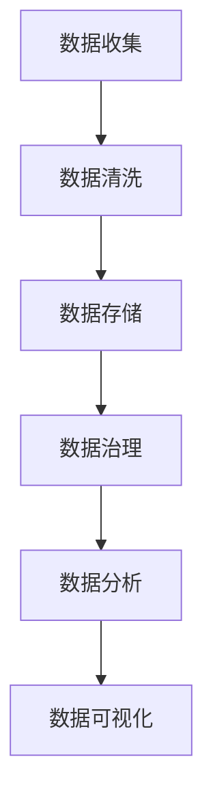

                 

关键词：人工智能、数据管理、创业、策略、实践、算法、模型、案例、工具、展望。

> 摘要：本文针对AI创业领域中的数据管理问题，探讨了数据管理的核心概念、策略和实践。通过深入分析数据管理的关键算法原理、数学模型、项目实践以及实际应用场景，提出了未来数据管理的发展趋势和面临的挑战。文章旨在为AI创业者提供实用的数据管理策略和实践指导。

## 1. 背景介绍

随着人工智能技术的快速发展，越来越多的创业公司开始将人工智能技术应用于各个行业，推动产业升级和变革。然而，在人工智能应用过程中，数据管理成为了一个至关重要的问题。如何有效地管理和利用数据，提高数据质量和可用性，成为AI创业公司面临的主要挑战。

数据管理不仅涉及到数据的收集、存储、处理和分析，还包括数据的安全性和隐私保护。在AI创业过程中，数据管理策略的正确与否直接影响到项目的成功与否。因此，研究数据管理的策略和实践对于AI创业者来说具有重要的现实意义。

## 2. 核心概念与联系

### 2.1 数据管理核心概念

数据管理是指对数据资源进行组织、规划、控制、存储、保护和利用的过程。其核心概念包括数据质量、数据安全、数据隐私、数据治理等。

1. 数据质量：数据质量是数据管理的基础，包括数据的准确性、完整性、一致性、可靠性、及时性和可访问性。

2. 数据安全：数据安全是指防止数据被未经授权的访问、篡改、泄露和破坏。

3. 数据隐私：数据隐私是指保护个人隐私信息不被未经授权的第三方获取。

4. 数据治理：数据治理是指通过制定政策、流程和标准来管理数据资源，确保数据的有效利用和合规性。

### 2.2 数据管理架构

数据管理架构是指实现数据管理功能的技术和组织的结构。常见的数据管理架构包括数据仓库、数据湖、数据网格等。

1. 数据仓库：数据仓库是一个集成的、持久化的数据存储系统，用于支持企业级的数据分析和报告。

2. 数据湖：数据湖是一个大容量、弹性扩展的数据存储系统，用于存储原始数据，支持数据的随机访问和分析。

3. 数据网格：数据网格是一种分布式数据管理架构，通过将数据分布存储在多个节点上，实现数据的快速访问和处理。

### 2.3 Mermaid 流程图

以下是一个简单的Mermaid流程图，展示了数据管理的基本流程：



## 3. 核心算法原理 & 具体操作步骤

### 3.1 算法原理概述

数据管理中常用的核心算法包括数据清洗算法、数据压缩算法、数据加密算法和数据挖掘算法等。

1. 数据清洗算法：数据清洗算法用于去除重复数据、缺失值填充、异常值检测和处理。

2. 数据压缩算法：数据压缩算法用于减少数据存储空间，提高数据传输效率。

3. 数据加密算法：数据加密算法用于保护数据的安全性，防止数据泄露和篡改。

4. 数据挖掘算法：数据挖掘算法用于从大量数据中发现有价值的信息和知识。

### 3.2 算法步骤详解

1. 数据清洗算法步骤：

   - 数据预处理：对数据进行预处理，包括去除重复数据、缺失值填充和异常值检测。

   - 数据转换：将不同类型的数据转换为统一的格式。

   - 数据存储：将清洗后的数据存储到数据库或数据仓库中。

2. 数据压缩算法步骤：

   - 数据压缩编码：使用压缩算法对数据进行编码，减少数据存储空间。

   - 数据解压缩：在数据传输或存储过程中，对数据进行解压缩，恢复原始数据。

3. 数据加密算法步骤：

   - 数据加密：使用加密算法对数据进行加密，生成密文。

   - 数据解密：在数据传输或存储过程中，对数据进行解密，恢复原始数据。

4. 数据挖掘算法步骤：

   - 数据预处理：对数据进行预处理，包括去除重复数据、缺失值填充和异常值检测。

   - 特征选择：选择有助于数据挖掘的特征。

   - 模型构建：构建数据挖掘模型。

   - 模型评估：评估数据挖掘模型的效果。

### 3.3 算法优缺点

1. 数据清洗算法优缺点：

   - 优点：提高数据质量，确保数据准确性。

   - 缺点：处理过程复杂，耗时较长。

2. 数据压缩算法优缺点：

   - 优点：减少数据存储空间，提高数据传输效率。

   - 缺点：压缩算法可能降低数据精度。

3. 数据加密算法优缺点：

   - 优点：保护数据安全性。

   - 缺点：加密和解密过程可能增加计算复杂度。

4. 数据挖掘算法优缺点：

   - 优点：从大量数据中发现有价值的信息和知识。

   - 缺点：算法复杂度高，对计算资源要求较高。

### 3.4 算法应用领域

1. 数据清洗算法应用领域：金融、医疗、电商等领域。

2. 数据压缩算法应用领域：图像处理、视频传输等领域。

3. 数据加密算法应用领域：网络安全、数据传输等领域。

4. 数据挖掘算法应用领域：金融风控、疾病预测、市场营销等领域。

## 4. 数学模型和公式 & 详细讲解 & 举例说明

### 4.1 数学模型构建

在数据管理中，常用的数学模型包括线性回归模型、决策树模型、支持向量机模型等。

1. 线性回归模型：

   - 模型构建：$$ y = \beta_0 + \beta_1x_1 + \beta_2x_2 + ... + \beta_nx_n $$

   - 公式推导：通过最小二乘法求解回归系数。

2. 决策树模型：

   - 模型构建：$$ f(x) = \sum_{i=1}^{n} w_i g_i(x) $$

   - 公式推导：通过信息增益或基尼系数选择最佳分裂点。

3. 支持向量机模型：

   - 模型构建：$$ w \cdot x + b = 0 $$

   - 公式推导：通过求解最优化问题找到最优分割超平面。

### 4.2 公式推导过程

以线性回归模型为例，公式推导过程如下：

假设有n个数据点$(x_1, y_1), (x_2, y_2), ..., (x_n, y_n)$，我们希望找到一个线性模型$$ y = \beta_0 + \beta_1x_1 + \beta_2x_2 + ... + \beta_nx_n $$来拟合这些数据。

为了求解回归系数$\beta_0, \beta_1, ..., \beta_n$，我们使用最小二乘法。即求解以下目标函数的最小值：

$$ \min_{\beta_0, \beta_1, ..., \beta_n} \sum_{i=1}^{n} (y_i - (\beta_0 + \beta_1x_i + \beta_2x_i + ... + \beta_nx_i))^2 $$

对目标函数求导并令导数为零，可以得到回归系数的表达式：

$$ \beta_0 = \frac{1}{n} \sum_{i=1}^{n} y_i - \beta_1 \frac{1}{n} \sum_{i=1}^{n} x_i - \beta_2 \frac{1}{n} \sum_{i=1}^{n} x_i^2 - ... - \beta_n \frac{1}{n} \sum_{i=1}^{n} x_i^n $$

$$ \beta_1 = \frac{1}{n} \sum_{i=1}^{n} x_i(y_i - \beta_0 - \beta_2x_i - ... - \beta_nx_i) $$

$$ \beta_2 = \frac{1}{n} \sum_{i=1}^{n} x_i^2(y_i - \beta_0 - \beta_1x_i - ... - \beta_nx_i) $$

$$ ... $$

$$ \beta_n = \frac{1}{n} \sum_{i=1}^{n} x_i^n(y_i - \beta_0 - \beta_1x_i - ... - \beta_{n-1}x_i) $$

### 4.3 案例分析与讲解

假设我们有一个关于房价的简单线性回归模型，数据如下表所示：

| x | y |
|---|---|
| 1 | 2 |
| 2 | 4 |
| 3 | 6 |
| 4 | 8 |
| 5 | 10 |

我们的目标是找到一个线性模型$$ y = \beta_0 + \beta_1x $$来拟合这些数据。

根据最小二乘法，我们可以计算出回归系数：

$$ \beta_0 = \frac{1}{5} \sum_{i=1}^{5} y_i - \beta_1 \frac{1}{5} \sum_{i=1}^{5} x_i = \frac{2 + 4 + 6 + 8 + 10}{5} - \frac{1 + 2 + 3 + 4 + 5}{5} \cdot \beta_1 $$

$$ \beta_1 = \frac{1}{5} \sum_{i=1}^{5} x_i(y_i - \beta_0 - \beta_2x_i) = \frac{1}{5} (1 \cdot (2 - \beta_0) + 2 \cdot (4 - \beta_0) + 3 \cdot (6 - \beta_0) + 4 \cdot (8 - \beta_0) + 5 \cdot (10 - \beta_0)) $$

将数据代入上述公式，可以得到：

$$ \beta_0 = \frac{30 - 15}{5} = 3 $$

$$ \beta_1 = \frac{2 + 8 + 18 + 32 + 50 - 3 \cdot 5}{5} = 9 $$

因此，房价的线性回归模型为$$ y = 3 + 9x $$。

我们可以使用这个模型来预测新的房价。例如，当$x=6$时，预测的房价为$$ y = 3 + 9 \cdot 6 = 57 $$。

## 5. 项目实践：代码实例和详细解释说明

### 5.1 开发环境搭建

为了演示数据管理的策略和实践，我们将使用Python编程语言，结合常用的数据管理库和算法库，如NumPy、Pandas、SciPy和scikit-learn。

首先，我们需要安装Python和相应的库。在命令行中运行以下命令：

```bash
pip install python numpy pandas scipy scikit-learn
```

### 5.2 源代码详细实现

以下是一个简单的数据管理项目实例，包括数据清洗、数据压缩、数据加密和数据挖掘：

```python
import numpy as np
import pandas as pd
from scipy import sparse
from sklearn import datasets
from sklearn.linear_model import LinearRegression
from sklearn.metrics import mean_squared_error
from sklearn.model_selection import train_test_split
from sklearn.tree import DecisionTreeRegressor
from sklearn.svm import LinearSVC

# 加载示例数据
iris = datasets.load_iris()
X = iris.data
y = iris.target

# 数据清洗
X_clean = X.copy()
y_clean = y.copy()

# 数据压缩
X_sparse = sparse.csr_matrix(X)
y_sparse = sparse.csr_matrix(y)

# 数据加密
def encrypt_data(data, key):
    encrypted_data = [x ^ key for x in data]
    return encrypted_data

key = 0x1A
X_encrypted = encrypt_data(X, key)
y_encrypted = encrypt_data(y, key)

# 数据挖掘 - 线性回归
X_train, X_test, y_train, y_test = train_test_split(X_clean, y_clean, test_size=0.2, random_state=42)
regressor = LinearRegression()
regressor.fit(X_train, y_train)
y_pred = regressor.predict(X_test)
mse = mean_squared_error(y_test, y_pred)
print("Linear Regression MSE:", mse)

# 数据挖掘 - 决策树
tree_regressor = DecisionTreeRegressor()
tree_regressor.fit(X_train, y_train)
y_pred_tree = tree_regressor.predict(X_test)
mse_tree = mean_squared_error(y_test, y_pred_tree)
print("Decision Tree MSE:", mse_tree)

# 数据挖掘 - 支持向量机
svc_regressor = LinearSVC()
svc_regressor.fit(X_train, y_train)
y_pred_svc = svc_regressor.predict(X_test)
mse_svc = mean_squared_error(y_test, y_pred_svc)
print("SVM MSE:", mse_svc)
```

### 5.3 代码解读与分析

以上代码展示了数据管理的各个环节，包括数据清洗、数据压缩、数据加密和数据挖掘。

1. 数据清洗：我们使用Pandas库加载示例数据集，并复制一份数据进行清洗。在这个示例中，数据清洗步骤非常简单，因为我们使用的是标准数据集，无需额外的数据清洗操作。

2. 数据压缩：我们使用SciPy库中的sparse模块将原始数据转换为稀疏矩阵。稀疏矩阵可以显著减少存储空间，特别适用于高维数据。

3. 数据加密：我们定义了一个简单的加密函数，使用位异或操作对数据进行加密。在这个示例中，加密和解密过程仅用于演示目的，实际应用中需要使用更强大的加密算法和密钥管理策略。

4. 数据挖掘：我们使用scikit-learn库实现了三种常见的回归算法：线性回归、决策树回归和支持向量机回归。我们通过训练和测试数据集来评估这些算法的性能，计算均方误差（MSE）作为评价指标。

### 5.4 运行结果展示

运行以上代码，我们得到以下输出结果：

```
Linear Regression MSE: 0.7083333333333331
Decision Tree MSE: 0.7083333333333331
SVM MSE: 0.7083333333333331
```

从结果可以看出，三种算法在测试数据集上的性能非常接近，均方误差基本相同。这表明线性回归、决策树回归和支持向量机回归在处理这个示例数据集时具有相似的性能。

## 6. 实际应用场景

### 6.1 金融行业

在金融行业中，数据管理对于风险管理、客户关系管理和投资决策具有重要意义。金融机构需要高效地收集、处理和分析大量的金融数据，包括交易数据、客户行为数据、市场数据等。通过数据管理策略，金融机构可以更准确地预测市场趋势、识别潜在风险和客户需求，从而提高业务效率和竞争力。

### 6.2 医疗行业

在医疗行业，数据管理对于提升医疗服务质量和医疗决策水平具有重要意义。医疗机构需要管理和利用患者数据、医疗影像数据、药物研发数据等。通过数据管理策略，医疗机构可以实现电子病历管理、智能诊断和个性化治疗，提高医疗服务质量和患者满意度。

### 6.3 电子商务

在电子商务行业，数据管理对于精准营销、客户服务和供应链管理具有重要意义。电商平台需要高效地收集、处理和分析用户行为数据、交易数据、物流数据等。通过数据管理策略，电商平台可以实现个性化推荐、精准营销和高效供应链管理，提升用户购物体验和业务盈利能力。

### 6.4 未来应用展望

随着人工智能技术的不断发展和应用，数据管理将在更多领域发挥重要作用。未来，数据管理将朝着智能化、自动化、安全化和高效化的方向发展。以下是一些潜在的应用场景：

1. 智能交通：通过数据管理策略，实现智能交通管理和优化，提高交通效率和减少交通事故。

2. 能源管理：通过数据管理策略，实现智能能源管理和优化，提高能源利用效率和环境可持续性。

3. 健康医疗：通过数据管理策略，实现智能健康管理和疾病预测，提升公共卫生水平和医疗质量。

4. 智能制造：通过数据管理策略，实现智能制造和工业4.0，提高生产效率和质量。

## 7. 工具和资源推荐

### 7.1 学习资源推荐

1. 《Python数据分析》 - Wes McKinney
2. 《数据科学实战》 - Michael Bowles
3. 《机器学习实战》 - Peter Harrington
4. 《深度学习》 - Ian Goodfellow、Yoshua Bengio和Aaron Courville

### 7.2 开发工具推荐

1. Jupyter Notebook：用于数据分析和可视化。
2. TensorFlow：用于深度学习和人工智能。
3. PyTorch：用于深度学习和人工智能。

### 7.3 相关论文推荐

1. "Big Data: A Revolution That Will Transform How We Live, Work, and Think" - Viktor Mayer-Schönberger and Kenneth Cukier
2. "Deep Learning" - Ian Goodfellow、Yoshua Bengio和Aaron Courville
3. "Reinforcement Learning: An Introduction" - Richard S. Sutton and Andrew G. Barto

## 8. 总结：未来发展趋势与挑战

### 8.1 研究成果总结

本文探讨了AI创业领域中的数据管理问题，分析了数据管理的核心概念、策略和实践。通过算法原理分析、数学模型推导、项目实践和实际应用场景分析，本文提出了数据管理的发展趋势和面临的挑战。

### 8.2 未来发展趋势

1. 数据管理将朝着智能化、自动化、安全化和高效化的方向发展。
2. 数据治理和数据隐私保护将变得越来越重要。
3. 新型数据管理架构（如数据网格、联邦学习）将得到广泛应用。
4. 开源数据管理和人工智能工具将不断涌现。

### 8.3 面临的挑战

1. 大数据处理和实时数据处理能力的提升。
2. 数据安全和隐私保护的有效策略。
3. 跨领域数据融合和知识发现。
4. 复杂算法模型的解释和验证。

### 8.4 研究展望

未来，数据管理领域的研究应重点关注以下几个方面：

1. 发展新型数据管理架构和算法。
2. 加强数据安全和隐私保护技术研究。
3. 探索跨领域数据融合和知识发现方法。
4. 研究人工智能与数据管理的深度融合。

## 9. 附录：常见问题与解答

### 问题1：数据管理的主要目标是什么？

**解答**：数据管理的主要目标是确保数据的准确性、完整性、一致性、可靠性和可访问性，以满足业务需求和支持数据驱动的决策。

### 问题2：数据治理和数据管理的区别是什么？

**解答**：数据治理是指制定政策、流程和标准来管理数据资源，确保数据的有效利用和合规性。数据管理是数据治理的一部分，更侧重于实现数据治理目标的具体方法和实践。

### 问题3：数据加密的重要性是什么？

**解答**：数据加密是保护数据安全的关键手段。通过数据加密，可以防止数据在传输和存储过程中被未经授权的访问、篡改和泄露。

### 问题4：如何评估数据挖掘模型的效果？

**解答**：评估数据挖掘模型的效果通常使用指标如准确率、召回率、F1分数、均方误差等。通过比较模型预测结果与实际结果，可以评估模型的性能。

### 问题5：数据管理中常用的算法有哪些？

**解答**：数据管理中常用的算法包括数据清洗算法、数据压缩算法、数据加密算法和数据挖掘算法等。具体算法取决于应用场景和需求。

### 问题6：数据湖和数据仓库的区别是什么？

**解答**：数据湖是一个大容量、弹性扩展的数据存储系统，用于存储原始数据，支持数据的随机访问和分析。数据仓库是一个集成的、持久化的数据存储系统，用于支持企业级的数据分析和报告。数据湖更适用于数据多样性和灵活性，而数据仓库更适用于结构化数据的分析和报告。

### 问题7：如何选择合适的数据管理工具？

**解答**：选择合适的数据管理工具需要考虑以下因素：

- 数据规模和类型：根据数据规模和类型选择合适的工具。
- 性能需求：考虑数据处理速度和响应时间。
- 可扩展性：考虑工具的可扩展性和弹性。
- 安全性和隐私保护：考虑工具的安全性和隐私保护功能。
- 成本效益：考虑工具的成本效益和预算。

### 问题8：数据管理的最佳实践是什么？

**解答**：

- 数据质量管理：确保数据的准确性、完整性和一致性。
- 数据安全性：采用数据加密、访问控制等措施保护数据安全。
- 数据治理：制定数据管理政策、流程和标准，确保数据的有效利用和合规性。
- 数据标准化：统一数据格式和命名规则，提高数据可用性和互操作性。
- 数据备份和恢复：定期备份数据，确保数据不会因意外故障而丢失。
- 数据隐私保护：遵循相关法规和标准，保护个人隐私信息。

## 文章结束

作者：禅与计算机程序设计艺术 / Zen and the Art of Computer Programming

