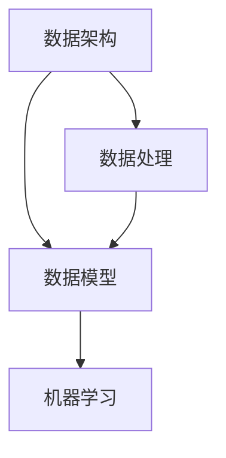

                 

 关键词：AI创业、数据管理、策略分析、对策、数据架构、机器学习

> 摘要：本文旨在探讨AI创业公司面临的数据管理挑战，包括数据策略、架构设计、算法选择等方面的关键问题。通过深入分析数据管理的核心概念和实际案例，本文为AI创业公司提供了一系列实用的策略与对策，帮助其在竞争激烈的市场中取得成功。

## 1. 背景介绍

随着人工智能技术的快速发展，越来越多的创业公司投身于AI领域的探索与竞争。然而，数据管理作为AI系统的核心组件，常常成为创业公司面临的一大挑战。从数据收集、存储到处理、分析和可视化，各个环节都需要精心设计和优化。本文将围绕AI创业公司如何有效管理数据展开讨论，提供实用的策略与对策。

## 2. 核心概念与联系

在探讨数据管理之前，我们需要理解一些核心概念，如数据架构、数据模型、机器学习等。以下是一个简化的Mermaid流程图，用于说明这些概念之间的联系。



### 2.1 数据架构

数据架构是组织和管理数据的蓝图，包括数据存储、数据流、数据访问和安全等方面的设计。一个良好的数据架构能够提高数据的可访问性、一致性和可扩展性。

### 2.2 数据模型

数据模型定义了数据如何存储、组织和操作。常见的模型包括关系型数据库、NoSQL数据库、图数据库等。选择合适的模型对数据管理的效率和效果至关重要。

### 2.3 机器学习

机器学习是人工智能的核心技术，它依赖于数据来训练模型，进而进行预测和决策。数据的质量和数量直接影响机器学习的效果。

### 2.4 数据处理

数据处理包括数据清洗、转换、聚合和分析等操作。数据处理的质量直接影响数据的价值和可用性。

## 3. 核心算法原理 & 具体操作步骤

### 3.1 算法原理概述

数据管理涉及多个核心算法，如数据清洗算法、数据聚合算法、机器学习算法等。以下是一个简要的算法原理概述。

### 3.2 算法步骤详解

#### 3.2.1 数据清洗

数据清洗包括识别和纠正数据中的错误、缺失值和处理不一致的数据格式等步骤。

#### 3.2.2 数据聚合

数据聚合是对大量数据进行汇总和归纳，以提取有价值的信息。

#### 3.2.3 机器学习

机器学习分为监督学习、无监督学习和强化学习等类型。每种类型都有其特定的算法和步骤。

### 3.3 算法优缺点

每种算法都有其优缺点，选择合适的算法需要根据具体应用场景进行权衡。

### 3.4 算法应用领域

算法在数据管理中的应用非常广泛，如推荐系统、预测模型、文本分析等。

## 4. 数学模型和公式 & 详细讲解 & 举例说明

### 4.1 数学模型构建

数学模型是数据管理的重要组成部分，如线性回归、决策树、神经网络等。

### 4.2 公式推导过程

以线性回归为例，介绍其公式推导过程。

### 4.3 案例分析与讲解

通过实际案例，讲解如何应用数学模型解决实际问题。

## 5. 项目实践：代码实例和详细解释说明

### 5.1 开发环境搭建

介绍如何搭建适合数据管理的开发环境。

### 5.2 源代码详细实现

提供数据管理项目的源代码实现，并进行详细解释。

### 5.3 代码解读与分析

分析代码的关键部分，解释其工作原理。

### 5.4 运行结果展示

展示代码的运行结果，并进行讨论。

## 6. 实际应用场景

### 6.1 案例研究

通过具体案例，展示数据管理在现实世界中的应用。

### 6.2 价值与挑战

讨论数据管理在AI创业中的价值与挑战。

### 6.3 未来应用展望

探讨数据管理在未来的发展趋势和应用场景。

## 7. 工具和资源推荐

### 7.1 学习资源推荐

推荐一些优质的学习资源和资料。

### 7.2 开发工具推荐

介绍一些实用的开发工具和平台。

### 7.3 相关论文推荐

推荐一些相关领域的经典论文。

## 8. 总结：未来发展趋势与挑战

### 8.1 研究成果总结

总结文章的主要研究成果。

### 8.2 未来发展趋势

预测数据管理的发展趋势。

### 8.3 面临的挑战

讨论数据管理在未来可能面临的挑战。

### 8.4 研究展望

展望数据管理领域的研究方向。

## 9. 附录：常见问题与解答

### 9.1 问题1

### 9.2 问题2

### 9.3 问题3

---

### 结语

本文从多个角度探讨了AI创业公司面临的数据管理挑战，并提供了一系列实用的策略与对策。希望通过本文，读者能够更好地理解和应对数据管理问题，为AI创业之路提供有力支持。

## 作者署名

作者：禅与计算机程序设计艺术 / Zen and the Art of Computer Programming
```

