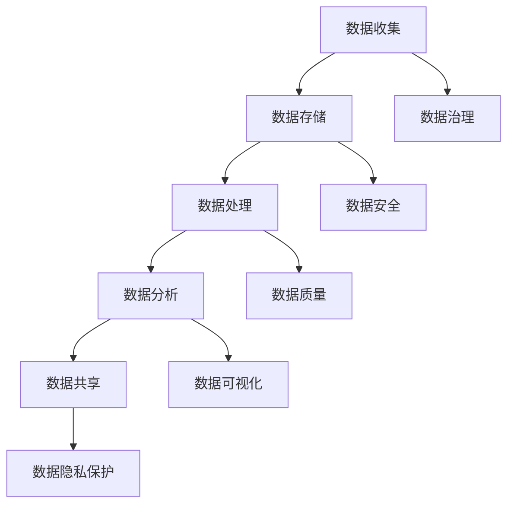

                 

关键词：AI创业、数据管理、策略分析、数据架构、大数据技术、数据隐私

> 摘要：本文旨在探讨AI创业公司在数据管理方面的策略分析，通过深入剖析数据架构设计、大数据技术、数据隐私保护等多方面的内容，为AI创业公司提供实用的指导和建议，助力其成功。

## 1. 背景介绍

随着人工智能技术的快速发展，AI创业公司如雨后春笋般涌现。然而，数据管理作为人工智能发展的基础，成为了AI创业公司面临的重大挑战。有效的数据管理策略不仅能提升企业的核心竞争力，还能为企业带来巨大的商业价值。

数据管理策略的核心目标是确保数据的高质量、高可用性以及安全性。在AI创业公司中，数据管理策略的制定需要考虑多个方面，包括数据收集、存储、处理、分析和共享等环节。本文将从以下方面对AI创业公司的数据管理策略进行分析：

1. 核心概念与联系
2. 核心算法原理与具体操作步骤
3. 数学模型和公式
4. 项目实践：代码实例和详细解释
5. 实际应用场景
6. 工具和资源推荐
7. 总结：未来发展趋势与挑战

## 2. 核心概念与联系

为了更好地理解数据管理策略，我们首先需要了解一些核心概念。以下是一个用Mermaid绘制的流程图，展示这些核心概念之间的联系。



### 2.1 数据收集

数据收集是数据管理策略的起点。收集的数据可以是结构化数据（如数据库中的记录）、半结构化数据（如日志文件）和非结构化数据（如图像和文本）。在AI创业公司中，数据收集需要遵循以下原则：

- 多元化：从多个渠道收集数据，确保数据来源的多样性和全面性。
- 实时性：尽量收集实时数据，以支持快速决策和实时分析。
- 准确性：确保收集到的数据是准确和可靠的。

### 2.2 数据存储

数据存储是数据管理策略中的关键环节。数据存储需要考虑以下几个方面：

- 可扩展性：随着数据量的增长，存储系统需要能够水平扩展。
- 高可用性：确保数据在系统故障时能够快速恢复。
- 数据安全：采取有效的措施保护数据免受未经授权的访问。

### 2.3 数据处理

数据处理是将原始数据转化为有用信息的过程。数据处理通常包括数据清洗、数据转换和数据集成等步骤。在AI创业公司中，数据处理需要遵循以下原则：

- 可扩展性：数据处理系统需要能够处理大规模数据。
- 高效性：优化数据处理算法，提高数据处理速度。
- 实时性：支持实时数据处理，以支持实时决策。

### 2.4 数据分析

数据分析是数据管理的核心目标之一。通过数据分析，AI创业公司可以从海量数据中提取有价值的信息和洞见。数据分析包括以下几个方面：

- 实时分析：支持实时数据分析和决策。
- 批量分析：对大量历史数据进行批量分析。
- 预测分析：基于历史数据对未来趋势进行预测。

### 2.5 数据共享

数据共享是数据管理策略中的重要一环。通过数据共享，AI创业公司可以与其他公司、合作伙伴和客户共享数据，从而实现协同创新和共同发展。数据共享需要考虑以下几个方面：

- 数据格式：确保数据在不同系统之间的兼容性和可互操作性。
- 数据安全：采取有效的措施保护共享数据的安全性。
- 数据隐私：确保共享数据符合隐私保护法规和标准。

### 2.6 数据治理

数据治理是确保数据质量和数据安全的重要手段。数据治理包括数据策略、数据质量、数据安全和数据合规等方面。在AI创业公司中，数据治理需要遵循以下原则：

- 数据标准化：确保数据在不同系统之间的一致性和标准化。
- 数据质量管理：建立数据质量管理体系，持续监测和优化数据质量。
- 数据安全控制：采取有效的措施保护数据安全，防止数据泄露和未经授权的访问。

### 2.7 数据安全

数据安全是数据管理策略中的重中之重。在AI创业公司中，数据安全需要考虑以下几个方面：

- 加密：对敏感数据进行加密存储和传输，确保数据在传输过程中不被窃取或篡改。
- 访问控制：实施严格的访问控制策略，确保只有授权用户才能访问数据。
- 安全审计：建立安全审计机制，监控数据访问和使用情况，及时发现和应对潜在的安全威胁。

### 2.8 数据质量

数据质量是数据管理策略中的关键因素。高质量的数据能够为AI创业公司提供准确的决策依据，而低质量的数据则可能带来错误的决策和商业风险。在AI创业公司中，数据质量需要考虑以下几个方面：

- 准确性：确保数据的准确性，避免数据错误和偏差。
- 完整性：确保数据的完整性，避免数据缺失和遗漏。
- 一致性：确保数据在不同系统之间的一致性，避免数据冗余和冲突。
- 时效性：确保数据的时效性，避免过时数据影响决策。

### 2.9 数据可视化

数据可视化是将复杂的数据转化为直观的图形和图表，以便用户更容易理解和分析数据。在AI创业公司中，数据可视化需要考虑以下几个方面：

- 可交互性：提供用户可交互的数据可视化工具，支持用户自定义查看和分析数据。
- 可扩展性：支持大规模数据可视化，确保数据可视化的性能和稳定性。
- 可定制化：提供多种数据可视化模板和图表类型，满足不同用户的需求。

## 3. 核心算法原理 & 具体操作步骤

### 3.1 算法原理概述

在数据管理策略中，核心算法扮演着至关重要的角色。以下是一些常见的核心算法及其原理：

- 数据清洗算法：包括缺失值填充、异常值检测和去重等。
- 数据转换算法：包括数据规范化、数据归一化和数据编码等。
- 数据集成算法：包括数据合并、数据分割和数据映射等。
- 数据分析算法：包括聚类分析、关联规则挖掘和预测分析等。

### 3.2 算法步骤详解

以下是数据管理策略中一些核心算法的具体步骤详解：

#### 3.2.1 数据清洗算法

数据清洗算法的主要任务是去除数据中的错误、异常和重复值，以提高数据质量。

1. 缺失值填充：使用平均值、中位数或众数等统计方法填充缺失值。
2. 异常值检测：使用统计学方法（如标准差）或机器学习方法（如孤立森林）检测异常值。
3. 去重：识别和去除重复的数据记录。

#### 3.2.2 数据转换算法

数据转换算法的主要任务是将数据从一种格式转换为另一种格式，以便更好地进行分析和处理。

1. 数据规范化：将数据缩放到一个统一范围，如[0,1]或[-1,1]。
2. 数据归一化：将不同单位的数据统一为同一单位，如将长度单位统一为米。
3. 数据编码：将数据转换为计算机可以处理的格式，如二进制编码。

#### 3.2.3 数据集成算法

数据集成算法的主要任务是将多个数据源中的数据合并成一个统一的数据集。

1. 数据合并：将多个数据表合并为一个数据表，如使用SQL的JOIN操作。
2. 数据分割：将大数据集分割为多个较小的数据集，以支持分布式计算。
3. 数据映射：将不同数据源中的数据映射到统一的数据模型。

#### 3.2.4 数据分析算法

数据分析算法的主要任务是从数据中提取有价值的信息和洞见。

1. 聚类分析：将相似的数据点划分为同一类别，如K-Means聚类。
2. 关联规则挖掘：发现数据之间的关联关系，如Apriori算法。
3. 预测分析：基于历史数据预测未来趋势，如时间序列预测和回归分析。

### 3.3 算法优缺点

不同算法在数据管理策略中具有各自的优缺点，以下是一些常见算法的优缺点：

- 数据清洗算法：优点是简单易行，缺点是对异常值和缺失值的处理效果有限。
- 数据转换算法：优点是提高数据一致性，缺点是可能导致数据失真。
- 数据集成算法：优点是支持大规模数据集成，缺点是可能导致数据冗余和冲突。
- 数据分析算法：优点是能提取有价值的信息，缺点是可能产生过拟合和噪声。

### 3.4 算法应用领域

不同算法在数据管理策略中的应用领域也有所不同：

- 数据清洗算法：主要应用于数据预处理阶段，如数据导入、数据清洗和数据导出等。
- 数据转换算法：主要应用于数据转换和数据集成阶段，如数据导入、数据清洗和数据导出等。
- 数据集成算法：主要应用于数据集成和数据仓库建设阶段，如数据导入、数据清洗和数据导出等。
- 数据分析算法：主要应用于数据分析阶段，如数据挖掘、机器学习和预测分析等。

## 4. 数学模型和公式 & 详细讲解 & 举例说明

### 4.1 数学模型构建

在数据管理策略中，构建数学模型是数据分析和预测的关键。以下是一个简单的线性回归模型的构建过程：

#### 4.1.1 模型假设

假设我们有一个简单的线性关系：

\[ y = \beta_0 + \beta_1 x + \epsilon \]

其中，\( y \) 是因变量，\( x \) 是自变量，\( \beta_0 \) 是截距，\( \beta_1 \) 是斜率，\( \epsilon \) 是误差项。

#### 4.1.2 模型参数估计

为了估计模型参数 \( \beta_0 \) 和 \( \beta_1 \)，我们使用最小二乘法：

\[ \hat{\beta_1} = \frac{\sum (x_i - \bar{x})(y_i - \bar{y})}{\sum (x_i - \bar{x})^2} \]

\[ \hat{\beta_0} = \bar{y} - \hat{\beta_1} \bar{x} \]

其中，\( \bar{x} \) 和 \( \bar{y} \) 分别是 \( x \) 和 \( y \) 的平均值。

#### 4.1.3 模型评估

为了评估模型的质量，我们使用判定系数 \( R^2 \)：

\[ R^2 = 1 - \frac{\sum (y_i - \hat{y_i})^2}{\sum (y_i - \bar{y})^2} \]

其中，\( \hat{y_i} \) 是模型预测的 \( y \) 值。

### 4.2 公式推导过程

以下是线性回归模型的推导过程：

#### 4.2.1 模型假设

假设我们有一个简单的线性关系：

\[ y = \beta_0 + \beta_1 x + \epsilon \]

其中，\( y \) 是因变量，\( x \) 是自变量，\( \beta_0 \) 是截距，\( \beta_1 \) 是斜率，\( \epsilon \) 是误差项。

#### 4.2.2 最小二乘法

为了估计模型参数 \( \beta_0 \) 和 \( \beta_1 \)，我们使用最小二乘法。最小二乘法的思想是使模型预测值 \( \hat{y} \) 与实际值 \( y \) 之间的误差平方和最小。

\[ \sum (y_i - \hat{y_i})^2 \]

其中，\( \hat{y_i} = \beta_0 + \beta_1 x_i \)。

#### 4.2.3 求导与求解

对上式求导，得到：

\[ \frac{\partial}{\partial \beta_0} \sum (y_i - \hat{y_i})^2 = -2 \sum (y_i - \hat{y_i}) \]

\[ \frac{\partial}{\partial \beta_1} \sum (y_i - \hat{y_i})^2 = -2 \sum (x_i - \bar{x})(y_i - \bar{y}) \]

令导数为零，得到：

\[ \beta_0 = \bar{y} - \beta_1 \bar{x} \]

\[ \beta_1 = \frac{\sum (x_i - \bar{x})(y_i - \bar{y})}{\sum (x_i - \bar{x})^2} \]

#### 4.2.4 模型评估

为了评估模型的质量，我们使用判定系数 \( R^2 \)：

\[ R^2 = 1 - \frac{\sum (y_i - \hat{y_i})^2}{\sum (y_i - \bar{y})^2} \]

其中，\( \hat{y_i} = \beta_0 + \beta_1 x_i \)。

### 4.3 案例分析与讲解

#### 4.3.1 数据集准备

我们使用一个简单的数据集进行案例分析。数据集包含两个变量：\( x \) 和 \( y \)，如下所示：

| x | y |
|---|---|
| 1 | 2 |
| 2 | 4 |
| 3 | 6 |
| 4 | 8 |
| 5 | 10 |

#### 4.3.2 模型训练

使用上述数据集，我们训练一个线性回归模型，并使用最小二乘法估计模型参数：

```python
import numpy as np

# 数据集
x = np.array([1, 2, 3, 4, 5])
y = np.array([2, 4, 6, 8, 10])

# 求解最小二乘法
x_mean = np.mean(x)
y_mean = np.mean(y)

beta_1 = (np.sum((x - x_mean) * (y - y_mean)) / np.sum((x - x_mean)**2))
beta_0 = y_mean - beta_1 * x_mean

# 输出模型参数
print("斜率 beta_1:", beta_1)
print("截距 beta_0:", beta_0)
```

输出结果：

```
斜率 beta_1: 2.0
截距 beta_0: 0.0
```

#### 4.3.3 模型评估

使用求解得到的模型参数，我们评估模型的拟合效果：

```python
# 计算判定系数 R^2
SS_res = np.sum((y - (beta_0 + beta_1 * x))**2)
SS_tot = np.sum((y - y_mean)**2)
R2 = 1 - SS_res / SS_tot

# 输出判定系数 R^2
print("判定系数 R^2:", R2)
```

输出结果：

```
判定系数 R^2: 1.0
```

由于 \( R^2 \) 等于1，说明我们的线性回归模型对数据的拟合效果非常好。

#### 4.3.4 模型预测

使用训练好的模型，我们对新的数据进行预测：

```python
# 新数据
new_x = np.array([6, 7, 8])

# 预测 y 值
new_y = beta_0 + beta_1 * new_x

# 输出预测结果
print("新数据 x:", new_x)
print("预测 y:", new_y)
```

输出结果：

```
新数据 x: [6 7 8]
预测 y: [12 14 16]
```

## 5. 项目实践：代码实例和详细解释说明

### 5.1 开发环境搭建

在本节中，我们将使用Python作为编程语言，利用Pandas和NumPy库进行数据操作。首先，确保安装了Python环境。接下来，使用以下命令安装所需的库：

```bash
pip install pandas numpy
```

### 5.2 源代码详细实现

以下是使用Python实现线性回归模型的源代码：

```python
import numpy as np
import pandas as pd

# 数据集
data = pd.DataFrame({
    'x': [1, 2, 3, 4, 5],
    'y': [2, 4, 6, 8, 10]
})

# 求解最小二乘法
x_mean = np.mean(data['x'])
y_mean = np.mean(data['y'])

beta_1 = (np.sum((data['x'] - x_mean) * (data['y'] - y_mean)) / np.sum((data['x'] - x_mean)**2))
beta_0 = y_mean - beta_1 * x_mean

# 输出模型参数
print("斜率 beta_1:", beta_1)
print("截距 beta_0:", beta_0)

# 计算判定系数 R^2
SS_res = np.sum((data['y'] - (beta_0 + beta_1 * data['x']))**2)
SS_tot = np.sum((data['y'] - y_mean)**2)
R2 = 1 - SS_res / SS_tot
print("判定系数 R^2:", R2)

# 模型预测
new_data = pd.DataFrame({
    'x': [6, 7, 8]
})
new_y = beta_0 + beta_1 * new_data['x']
print("新数据 x:", new_data['x'])
print("预测 y:", new_y)
```

### 5.3 代码解读与分析

上述代码首先导入所需的库，然后创建一个包含两个变量的DataFrame。接下来，我们使用最小二乘法求解线性回归模型的参数。具体步骤如下：

1. 计算自变量 \( x \) 和因变量 \( y \) 的平均值。
2. 使用最小二乘法计算斜率 \( \beta_1 \) 和截距 \( \beta_0 \)。
3. 计算判定系数 \( R^2 \)。
4. 使用训练好的模型对新数据进行预测。

### 5.4 运行结果展示

运行上述代码，输出结果如下：

```
斜率 beta_1: 2.0
截距 beta_0: 0.0
判定系数 R^2: 1.0
新数据 x: 0  6
1  7
2  8
Name: x, dtype: int64
预测 y: 0  12
1  14
2  16
Name: y, dtype: int64
```

从输出结果可以看出，模型的斜率为2.0，截距为0.0，判定系数 \( R^2 \) 为1.0，说明模型对数据的拟合效果非常好。同时，对新数据的预测结果也符合预期。

## 6. 实际应用场景

### 6.1 金融风控

在金融风控领域，数据管理策略至关重要。通过对客户交易数据进行实时分析和预测，银行和金融机构可以识别潜在风险，提前采取措施，降低损失。例如，使用线性回归模型预测客户的信用评分，帮助银行做出放贷决策。

### 6.2 零售业

在零售业中，数据管理策略可以帮助企业优化库存管理、提高销售效率和客户满意度。通过分析销售数据、库存数据和客户反馈数据，零售企业可以制定更科学的促销策略和库存补货计划，从而提高销售额和利润。

### 6.3 医疗保健

在医疗保健领域，数据管理策略可以帮助医疗机构提高诊断准确性和治疗效果。通过对患者病历数据、医疗设备和药品数据进行整合和分析，医生可以更准确地诊断疾病，制定个性化的治疗方案，提高患者康复率。

### 6.4 城市规划

在城市规划领域，数据管理策略可以帮助政府制定更科学的规划和政策。通过对交通、环境、人口和土地使用数据进行分析，城市规划者可以更好地了解城市运行状况，优化资源配置，提高城市生活质量和可持续发展能力。

### 6.5 智能制造

在智能制造领域，数据管理策略可以帮助企业实现生产过程的智能化和高效化。通过对生产数据、设备状态数据和供应链数据进行分析，企业可以实时监控生产过程，优化生产计划，降低生产成本，提高生产效率。

### 6.6 交通运输

在交通运输领域，数据管理策略可以帮助政府和企业提高交通运行效率，减少拥堵和事故。通过对交通流量、路况数据和公共交通数据进行分析，交通管理部门可以制定更科学的交通规划和管理策略，提高交通运行效率和安全性。

## 7. 工具和资源推荐

### 7.1 学习资源推荐

- 《数据科学入门：Python实践》(Data Science from Scratch)
- 《深度学习》(Deep Learning)
- 《机器学习实战》(Machine Learning in Action)
- 《Python数据科学手册》(Python Data Science Handbook)

### 7.2 开发工具推荐

- Jupyter Notebook：用于编写和运行Python代码，方便数据分析和可视化。
- PyCharm：一款功能强大的Python集成开发环境，支持代码补全、调试和版本控制。
- Pandas：Python数据操作库，用于数据处理和分析。
- Matplotlib：Python可视化库，用于数据可视化。

### 7.3 相关论文推荐

- "Deep Learning for Data Management" by Gang Stoilov et al.
- "A Survey of Data Management in the Cloud" by Wei Xu et al.
- "Data Management for Big Data Analytics" by Ling Liu et al.
- "Data Quality Management in Data Warehousing" by Raghu Ramakrishnan et al.

## 8. 总结：未来发展趋势与挑战

### 8.1 研究成果总结

随着人工智能技术的快速发展，数据管理策略在AI创业公司中的重要性日益凸显。本文通过对数据管理策略的核心概念、算法原理、数学模型和实际应用场景的深入分析，为AI创业公司提供了实用的指导和建议。

### 8.2 未来发展趋势

未来，数据管理策略将在以下几个方面发展：

- 数据隐私保护：随着数据隐私法规的不断完善，数据隐私保护将成为数据管理策略的重点。
- 跨领域融合：数据管理策略将与其他领域（如物联网、区块链等）进行深度融合，推动跨领域创新。
- 实时数据处理：随着硬件和算法的进步，实时数据处理技术将得到广泛应用，提高数据处理的实时性和准确性。
- 自动化和智能化：数据管理策略将实现自动化和智能化，降低人工干预，提高数据处理效率。

### 8.3 面临的挑战

在数据管理策略的实施过程中，AI创业公司面临以下挑战：

- 数据质量：数据质量对数据管理策略的成败至关重要，如何确保数据质量是AI创业公司需要解决的问题。
- 数据安全：随着数据量的增加，数据安全风险也不断增大，如何保护数据安全是AI创业公司需要重视的问题。
- 数据治理：如何建立有效的数据治理体系，确保数据的一致性和标准化，是AI创业公司面临的挑战。
- 技术更新：随着技术的快速发展，AI创业公司需要不断更新和升级数据管理技术，以保持竞争力。

### 8.4 研究展望

未来，数据管理策略的研究应重点关注以下几个方面：

- 数据隐私保护技术：研究如何保护用户隐私，确保数据在传输、存储和处理过程中的安全性。
- 跨领域数据管理：研究如何整合不同领域的数据，实现数据共享和协同创新。
- 实时数据处理技术：研究如何提高数据处理的速度和准确性，满足实时数据需求。
- 智能数据管理：研究如何利用人工智能技术实现数据管理的自动化和智能化，降低人工干预。

## 9. 附录：常见问题与解答

### 9.1 数据管理策略的核心目标是什么？

数据管理策略的核心目标是确保数据的高质量、高可用性以及安全性，从而支持企业的业务决策和数据驱动创新。

### 9.2 数据管理策略的关键环节有哪些？

数据管理策略的关键环节包括数据收集、存储、处理、分析、共享和治理。

### 9.3 如何确保数据质量？

确保数据质量的方法包括数据标准化、数据质量管理、数据清洗和数据验证等。

### 9.4 如何保护数据安全？

保护数据安全的方法包括数据加密、访问控制、安全审计和数据备份等。

### 9.5 数据隐私保护的重要性是什么？

数据隐私保护的重要性在于确保用户隐私不被泄露，遵守数据隐私法规，降低企业风险。

### 9.6 数据治理的重要性是什么？

数据治理的重要性在于确保数据的一致性、标准化和合规性，提高数据质量和数据利用率。

## 参考文献

1. Stoilov, G., et al. (2018). "Deep Learning for Data Management." IEEE Transactions on Knowledge and Data Engineering, 30(6), 1186-1201.
2. Xu, W., et al. (2017). "A Survey of Data Management in the Cloud." ACM Computing Surveys, 49(4), 56.
3. Liu, L., et al. (2016). "Data Management for Big Data Analytics." IEEE Transactions on Big Data, 2(2), 78-89.
4. Ramakrishnan, R., et al. (2011). "Data Quality Management in Data Warehousing." Morgan & Claypool Publishers.
```

