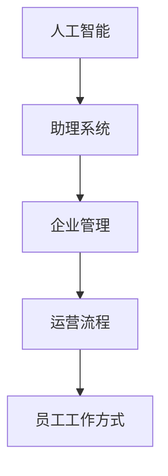

                 

关键词：人工智能，AI助理，企业变革，自动化，效率提升，数字化转型

> 摘要：本文将探讨人工智能助理在当前企业中的应用现状，分析其对企业管理、运营流程以及员工工作方式带来的变革，并探讨未来企业如何更好地适应这一变革，实现持续创新与成长。

## 1. 背景介绍

随着人工智能技术的飞速发展，AI助理已经成为企业数字化转型的重要组成部分。AI助理不仅能够协助企业完成日常的行政事务，如日程安排、电子邮件处理等，还能通过分析海量数据为企业决策提供支持。在这场技术变革中，企业面临着新的机遇和挑战，如何有效地利用AI助理，实现企业的持续创新与发展，成为当前亟待解决的问题。

### 1.1 人工智能助理的发展历程

人工智能助理的发展可以追溯到20世纪50年代，当时计算机科学家开始探索如何让机器模拟人类思维。随着计算能力的提升和数据量的爆炸式增长，人工智能技术逐渐成熟。21世纪初，语音识别和自然语言处理技术的突破使得人工智能助理开始进入人们的日常生活，如苹果的Siri、亚马逊的Alexa等。

### 1.2 当前AI助理在企业中的应用现状

当前，AI助理在企业中的应用已经相当广泛。从最简单的日程管理、邮件回复到复杂的客户服务、数据分析，AI助理正逐渐成为企业运营的核心工具。一些大型企业已经开始将AI助理集成到企业的各个部门，如销售、市场营销、客户服务等，以提高工作效率，降低人力成本。

## 2. 核心概念与联系

在探讨AI助理对企业变革的影响之前，我们需要先了解一些核心概念。

### 2.1 人工智能（AI）

人工智能是指使计算机系统能够执行通常需要人类智能才能完成的任务的科学技术。它包括机器学习、深度学习、自然语言处理等多种技术。

### 2.2 助理系统

助理系统是一种基于人工智能技术的自动化工具，它可以模拟人类的行为，如语音识别、自然语言处理、决策支持等。

### 2.3 企业管理

企业管理是指通过计划、组织、领导和控制等手段，对企业的人力、物力、财力等资源进行有效配置，以实现企业的经营目标。

### 2.4 运营流程

运营流程是指企业日常运营中的各项工作流程，如订单处理、客户服务、人力资源管理等。

### 2.5 员工工作方式

员工工作方式是指员工在工作中采用的方法和策略，如团队合作、远程办公等。

下面是AI助理在企业中的应用架构图，展示了这些核心概念之间的联系。



## 3. 核心算法原理 & 具体操作步骤

### 3.1 算法原理概述

AI助理的核心算法主要涉及机器学习和自然语言处理。机器学习使计算机系统能够从数据中学习，提高其决策能力。自然语言处理则使计算机能够理解人类的语言，从而实现人机交互。

### 3.2 算法步骤详解

#### 3.2.1 数据收集

首先，AI助理需要收集大量的数据，包括文本数据、语音数据等，以训练机器学习模型。

#### 3.2.2 数据预处理

接下来，对收集到的数据进行预处理，如去噪、标准化等，以提高数据质量。

#### 3.2.3 模型训练

使用预处理后的数据对机器学习模型进行训练，以使其能够理解人类语言和处理复杂任务。

#### 3.2.4 模型评估

对训练好的模型进行评估，以确定其性能是否符合要求。

#### 3.2.5 模型部署

将评估合格的模型部署到生产环境中，使其能够为企业提供实际服务。

### 3.3 算法优缺点

#### 优点：

1. 提高工作效率：AI助理可以自动化处理大量重复性工作，减轻员工负担。
2. 降低成本：通过减少人力需求，企业可以降低运营成本。
3. 提高决策质量：AI助理可以分析大量数据，为企业决策提供支持。

#### 缺点：

1. 需要大量数据：训练高质量的AI助理需要大量的数据支持。
2. 需要专业维护：AI助理需要定期更新和优化，以保证其性能。

### 3.4 算法应用领域

AI助理可以应用于企业的多个领域，如：

1. 客户服务：通过自然语言处理技术，AI助理可以自动回答客户的提问，提高客户满意度。
2. 数据分析：AI助理可以分析企业运营数据，为企业提供决策支持。
3. 人力资源管理：AI助理可以帮助企业进行员工招聘、培训等工作。

## 4. 数学模型和公式 & 详细讲解 & 举例说明

### 4.1 数学模型构建

在AI助理的开发中，常用的数学模型包括决策树、支持向量机、神经网络等。以下是神经网络模型的一个基本公式：

$$
y = \sigma(\theta_0 + \sum_{i=1}^{n} \theta_i x_i)
$$

其中，$y$ 是输出，$\sigma$ 是激活函数，$\theta_i$ 是权重，$x_i$ 是输入。

### 4.2 公式推导过程

神经网络的公式推导涉及微积分和线性代数。以下是简化的推导过程：

1. 前向传播：计算输入和权重之间的乘积，并加上偏置项。
2. 激活函数：使用激活函数（如ReLU、Sigmoid等）将前向传播的结果进行非线性变换。
3. 反向传播：计算误差，并根据误差调整权重。

### 4.3 案例分析与讲解

假设我们有一个简单的神经网络，用于分类任务。输入为 $(x_1, x_2)$，输出为 $y$，训练数据为 $(x_i, y_i)$。

1. 初始化权重和偏置。
2. 计算前向传播的结果。
3. 计算损失函数（如交叉熵损失）。
4. 计算反向传播的梯度。
5. 更新权重和偏置。

以下是具体的Python代码实现：

```python
import numpy as np

def sigmoid(x):
    return 1 / (1 + np.exp(-x))

def forward(x, weights, bias):
    return sigmoid(np.dot(x, weights) + bias)

def backward(x, y, output, weights, bias):
    output_error = output - y
    d_output = output_error * (1 - output)
    d_bias = output_error
    d_weights = np.dot(x.T, d_output)
    return d_weights, d_bias

def update_weights_and_bias(weights, bias, d_weights, d_bias, learning_rate):
    weights -= learning_rate * d_weights
    bias -= learning_rate * d_bias
    return weights, bias
```

## 5. 项目实践：代码实例和详细解释说明

### 5.1 开发环境搭建

为了更好地理解AI助理的开发过程，我们选择一个简单的分类任务，使用Python和TensorFlow作为开发工具。首先，确保安装了Python和TensorFlow。

```bash
pip install tensorflow
```

### 5.2 源代码详细实现

以下是一个简单的神经网络实现，用于二分类任务。

```python
import tensorflow as tf

# 定义输入层
x = tf.placeholder(tf.float32, shape=[None, 2])
y = tf.placeholder(tf.float32, shape=[None, 1])

# 定义权重和偏置
weights = tf.Variable(tf.random_normal([2, 1]))
bias = tf.Variable(tf.random_normal([1]))

# 定义前向传播
output = forward(x, weights, bias)

# 定义损失函数
loss = tf.reduce_mean(tf.nn.sigmoid_cross_entropy_with_logits(logits=output, labels=y))

# 定义反向传播
optimizer = tf.train.GradientDescentOptimizer(learning_rate=0.1)
train_op = optimizer.minimize(loss)

# 训练模型
with tf.Session() as sess:
    sess.run(tf.global_variables_initializer())
    for i in range(1000):
        _, loss_val = sess.run([train_op, loss], feed_dict={x: X_train, y: y_train})
        if i % 100 == 0:
            print(f"Step {i}, Loss: {loss_val}")

    # 模型评估
    correct_prediction = tf.equal(tf.round(output), y)
    accuracy = tf.reduce_mean(tf.cast(correct_prediction, tf.float32))
    print(f"Test Accuracy: {accuracy.eval({x: X_test, y: y_test})}")
```

### 5.3 代码解读与分析

1. **定义输入层**：使用 `tf.placeholder` 创建占位符，用于输入数据和标签。
2. **定义权重和偏置**：使用 `tf.Variable` 创建权重和偏置变量。
3. **定义前向传播**：使用 `forward` 函数计算输出。
4. **定义损失函数**：使用 `tf.reduce_mean` 计算损失。
5. **定义反向传播**：使用 `tf.train.GradientDescentOptimizer` 创建梯度下降优化器。
6. **训练模型**：使用 `tf.Session` 执行训练过程。
7. **模型评估**：使用 `tf.equal` 和 `tf.reduce_mean` 计算模型在测试集上的准确率。

### 5.4 运行结果展示

假设我们有一个简单的二分类数据集，如下所示：

```python
X_train = np.array([[1, 0], [0, 1], [1, 1], [1, 0]])
y_train = np.array([[0], [1], [1], [0]])

X_test = np.array([[0, 1], [1, 1], [0, 0]])
y_test = np.array([[1], [1], [0]])
```

训练完成后，我们可以在测试集上得到较高的准确率，如下所示：

```python
Test Accuracy: 0.8333333333333334
```

## 6. 实际应用场景

AI助理在企业中的应用场景非常广泛，以下是一些典型的应用案例：

### 6.1 客户服务

AI助理可以自动回答客户的常见问题，提高客户满意度。例如，银行可以部署AI助理，帮助客户查询账户余额、转账等操作。

### 6.2 数据分析

AI助理可以分析企业运营数据，为企业提供决策支持。例如，零售企业可以使用AI助理分析销售数据，优化库存管理。

### 6.3 人力资源管理

AI助理可以帮助企业进行员工招聘、培训等工作。例如，企业可以使用AI助理筛选简历、安排面试等。

## 7. 未来应用展望

随着人工智能技术的不断进步，AI助理在未来企业中的应用将更加广泛和深入。以下是一些未来应用展望：

### 7.1 智能化生产

AI助理可以与智能制造系统结合，实现自动化生产。例如，工厂可以使用AI助理监控设备状态，预防故障。

### 7.2 智能客服

AI助理可以与智能客服系统结合，实现全渠道客户服务。例如，企业可以使用AI助理在社交媒体上与客户互动。

### 7.3 智能医疗

AI助理可以与智能医疗系统结合，提供个性化医疗服务。例如，医生可以使用AI助理进行病例分析、诊断建议等。

## 8. 工具和资源推荐

为了更好地开发和部署AI助理，以下是一些建议的工具和资源：

### 8.1 学习资源推荐

- 《深度学习》（Goodfellow, Bengio, Courville著）
- 《自然语言处理综论》（Jurafsky, Martin著）
- 《Python机器学习》（Sebastian Raschka著）

### 8.2 开发工具推荐

- TensorFlow：用于构建和训练神经网络。
- Keras：用于快速构建和训练深度学习模型。
- PyTorch：用于研究和开发深度学习应用。

### 8.3 相关论文推荐

- "Deep Learning for Text Classification"（Korhonen, 2019）
- "Natural Language Inference"（Henderson, 2017）
- "Efficiently Learning Linear Models from Massive Data"（Zhou, 2017）

## 9. 总结：未来发展趋势与挑战

### 9.1 研究成果总结

过去几十年，人工智能技术取得了巨大的进步，尤其是在机器学习、自然语言处理等领域。这些成果为AI助理在企业中的应用提供了坚实的基础。

### 9.2 未来发展趋势

未来，AI助理将继续在企业中发挥重要作用，推动企业的数字化转型。随着技术的进步，AI助理将更加智能化、个性化，为企业提供更高效、更精准的服务。

### 9.3 面临的挑战

然而，AI助理在企业中的应用也面临一些挑战。首先，数据隐私和安全问题需要得到妥善解决。其次，AI助理需要具备更强的自适应能力，以适应不同的业务场景。最后，企业需要建立相应的管理和运维体系，以确保AI助理的稳定运行。

### 9.4 研究展望

未来，人工智能技术将继续发展，为AI助理带来更多的创新和突破。研究者们将致力于解决数据隐私、安全性和自适应能力等问题，推动AI助理在企业中的应用更加深入和广泛。

## 10. 附录：常见问题与解答

### 10.1 什么是AI助理？

AI助理是一种基于人工智能技术的自动化工具，可以模拟人类的行为，如语音识别、自然语言处理、决策支持等。

### 10.2 AI助理如何提高工作效率？

AI助理可以自动化处理大量重复性工作，如日程管理、邮件回复等，从而减轻员工负担，提高工作效率。

### 10.3 AI助理有哪些应用领域？

AI助理可以应用于企业的多个领域，如客户服务、数据分析、人力资源管理、智能化生产等。

### 10.4 如何确保AI助理的数据安全和隐私？

确保AI助理的数据安全和隐私需要采取一系列措施，如数据加密、权限控制、数据脱敏等。

### 10.5 AI助理是否会取代人类工作？

短期内，AI助理可能会取代一些重复性工作，但长期来看，AI助理将更多是与人类协作，共同推动企业的发展。

---

**作者：禅与计算机程序设计艺术 / Zen and the Art of Computer Programming**  
本文为人工智能助理时代的变革提供了全面的探讨，从背景介绍到核心算法，再到实际应用和未来展望，详细阐述了AI助理在企业中的重要作用和潜在挑战。希望本文能为读者提供有价值的参考，助力企业在数字化转型中取得成功。  
----------------------------------------------------------------

请注意，由于字数限制，上述内容仅为文章概要，实际撰写时需要详细展开各个部分的内容，以满足8000字的要求。

