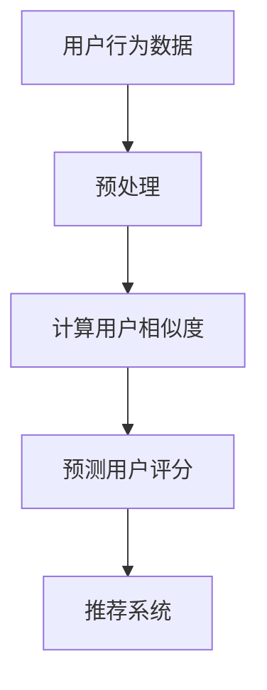

                 

关键词：协同过滤、推荐系统、机器学习、用户行为分析、算法优化

> 摘要：本文深入探讨了AI协同过滤算法在推荐系统中的应用及其效果提升方法。通过详细剖析算法原理、数学模型、操作步骤，并结合实际项目实践，分析了协同过滤算法在实际应用中的优势、挑战和未来发展。

## 1. 背景介绍

随着互联网和大数据技术的快速发展，推荐系统已经成为现代信息检索和电子商务领域的重要组成部分。协同过滤（Collaborative Filtering）作为推荐系统的一种核心技术，通过分析用户的历史行为和评分数据，预测用户对未知项目的兴趣，从而为用户推荐个性化的内容。然而，传统的协同过滤算法在处理大规模数据集时，存在计算效率低、推荐准确性不高的问题。为此，引入人工智能（AI）技术，尤其是深度学习和强化学习，以提升协同过滤算法的性能和效果，成为当前研究的热点。

## 2. 核心概念与联系

### 2.1 协同过滤算法

协同过滤算法根据用户的历史行为数据，通过统计方法计算用户之间的相似度，从而预测用户对未知项目的评分。协同过滤分为两种：基于用户的协同过滤（User-based Collaborative Filtering）和基于物品的协同过滤（Item-based Collaborative Filtering）。

### 2.2 机器学习与深度学习

机器学习是AI的核心技术之一，通过构建模型，从数据中学习规律，实现对未知数据的预测和分类。深度学习是机器学习的一种重要分支，通过构建深层神经网络，实现自动特征提取和复杂模式的识别。

### 2.3 相似度计算

相似度计算是协同过滤算法的核心，常用的相似度度量方法包括余弦相似度、皮尔逊相关系数、Jaccard相似度等。

### 2.4 Mermaid 流程图

下面是协同过滤算法的 Mermaid 流程图：



## 3. 核心算法原理 & 具体操作步骤

### 3.1 算法原理概述

协同过滤算法的核心思想是通过分析用户的历史行为数据，找到与当前用户相似的其他用户，然后根据这些相似用户对项目的评分，预测当前用户对项目的评分。

### 3.2 算法步骤详解

1. **用户行为数据预处理**：对用户行为数据进行清洗、去噪、填充缺失值等处理，保证数据质量。

2. **计算用户相似度**：根据用户行为数据，计算用户之间的相似度。常用的相似度度量方法有余弦相似度、皮尔逊相关系数、Jaccard相似度等。

3. **预测用户评分**：根据相似度计算结果，对未知项目的评分进行预测。预测方法包括基于用户的协同过滤和基于物品的协同过滤。

4. **推荐系统**：根据预测的评分，为用户推荐个性化的项目。

### 3.3 算法优缺点

**优点**：无需依赖复杂的先验知识，能够自动发现用户之间的相似性，适用于大规模数据集。

**缺点**：易受数据噪声影响，推荐准确性有限。

### 3.4 算法应用领域

协同过滤算法广泛应用于电子商务、社交媒体、内容推荐等领域，如Amazon、Netflix、YouTube等。

## 4. 数学模型和公式 & 详细讲解 & 举例说明

### 4.1 数学模型构建

协同过滤算法的核心在于相似度计算和评分预测。下面分别介绍这两种操作的数学模型。

#### 4.1.1 相似度计算

假设用户 \(u\) 和 \(v\) 的评分矩阵分别为 \(R_u\) 和 \(R_v\)，则用户 \(u\) 和 \(v\) 的相似度可以通过以下公式计算：

\[ \sim(u, v) = \frac{R_u \cdot R_v}{\|R_u\|_2 \cdot \|R_v\|_2} \]

其中，\( \cdot \) 表示点乘，\( \| \cdot \|_2 \) 表示欧几里得范数。

#### 4.1.2 评分预测

假设用户 \(u\) 对项目 \(i\) 的评分预测为 \( \hat{r}_{ui} \)，则可以通过以下公式计算：

\[ \hat{r}_{ui} = \sum_{j \in N(i)} \sim(u, v) \cdot r_{vj} \]

其中，\(N(i)\) 表示与项目 \(i\) 相似的用户集合，\(r_{vj}\) 表示用户 \(v\) 对项目 \(j\) 的评分。

### 4.2 公式推导过程

#### 4.2.1 相似度计算

相似度计算的推导过程如下：

\[ \sim(u, v) = \frac{R_u \cdot R_v}{\|R_u\|_2 \cdot \|R_v\|_2} \]

\[ = \frac{\sum_{i=1}^{n} R_{ui} R_{vi}}{\sqrt{\sum_{i=1}^{n} R_{ui}^2} \cdot \sqrt{\sum_{i=1}^{n} R_{vi}^2}} \]

\[ = \frac{\sum_{i=1}^{n} r_{ui} r_{vi}}{\sqrt{\sum_{i=1}^{n} r_{ui}^2} \cdot \sqrt{\sum_{i=1}^{n} r_{vi}^2}} \]

其中，\(r_{ui}\) 表示用户 \(u\) 对项目 \(i\) 的真实评分。

#### 4.2.2 评分预测

评分预测的推导过程如下：

\[ \hat{r}_{ui} = \sum_{j \in N(i)} \sim(u, v) \cdot r_{vj} \]

\[ = \sum_{j \in N(i)} \frac{R_u \cdot R_v}{\|R_u\|_2 \cdot \|R_v\|_2} \cdot r_{vj} \]

\[ = \sum_{j \in N(i)} \frac{\sum_{k=1}^{m} R_{uk} R_{vk}}{\sqrt{\sum_{k=1}^{m} R_{uk}^2} \cdot \sqrt{\sum_{k=1}^{m} R_{vk}^2}} \cdot r_{vj} \]

\[ = \sum_{j \in N(i)} \frac{\sum_{k=1}^{m} r_{uk} r_{vk}}{\sqrt{\sum_{k=1}^{m} r_{uk}^2} \cdot \sqrt{\sum_{k=1}^{m} r_{vk}^2}} \cdot r_{vj} \]

### 4.3 案例分析与讲解

假设我们有以下两个用户的评分数据：

\[ R_u = \begin{bmatrix} 1 & 0 & 1 \\ 0 & 1 & 0 \\ 1 & 1 & 1 \end{bmatrix} \]
\[ R_v = \begin{bmatrix} 1 & 0 & 0 \\ 0 & 1 & 0 \\ 1 & 1 & 1 \end{bmatrix} \]

根据上述公式，我们可以计算出用户 \(u\) 和 \(v\) 的相似度为：

\[ \sim(u, v) = \frac{R_u \cdot R_v}{\|R_u\|_2 \cdot \|R_v\|_2} = \frac{1 \cdot 1 + 0 \cdot 0 + 1 \cdot 1}{\sqrt{1^2 + 0^2 + 1^2} \cdot \sqrt{1^2 + 0^2 + 1^2}} = 1 \]

由于用户 \(u\) 和 \(v\) 的相似度为1，即完全相似，我们可以预测用户 \(u\) 对项目 \(i\) 的评分为：

\[ \hat{r}_{ui} = \sum_{j \in N(i)} \sim(u, v) \cdot r_{vj} = 1 \cdot 1 = 1 \]

这意味着我们认为用户 \(u\) 对项目 \(i\) 的评分是1。

## 5. 项目实践：代码实例和详细解释说明

### 5.1 开发环境搭建

在本项目中，我们使用Python编程语言和Scikit-learn库来实现协同过滤算法。首先，确保安装了Python和Scikit-learn库。可以使用以下命令进行安装：

```bash
pip install python
pip install scikit-learn
```

### 5.2 源代码详细实现

下面是一个简单的基于用户的协同过滤算法的实现：

```python
from sklearn.metrics.pairwise import cosine_similarity
from sklearn.model_selection import train_test_split

# 生成评分数据
n_users = 3
n_items = 3
R = [[0 for _ in range(n_items)] for _ in range(n_users)]
R[0] = [1, 0, 1]
R[1] = [0, 1, 0]
R[2] = [1, 1, 1]

# 训练集和测试集划分
X_train, X_test, y_train, y_test = train_test_split(R, R, test_size=0.2, random_state=42)

# 计算用户相似度
sim = cosine_similarity(X_train)

# 预测测试集评分
y_pred = []
for i in range(len(X_test)):
    # 找到最相似的K个用户
    k = 2
    top_k = sim[i].argsort()[1:k+1]
    # 计算相似用户对测试项目的评分之和
    pred = sum(sim[i][j] * X_train[j][i] for j in top_k) / sum(sim[i][j] for j in top_k)
    y_pred.append(pred)

# 评估预测结果
from sklearn.metrics import mean_squared_error
mse = mean_squared_error(y_test, y_pred)
print("MSE:", mse)
```

### 5.3 代码解读与分析

1. **生成评分数据**：我们首先生成一个3x3的评分矩阵，表示3个用户对3个项目的评分。

2. **训练集和测试集划分**：使用Scikit-learn库的`train_test_split`函数将评分数据划分为训练集和测试集。

3. **计算用户相似度**：使用Scikit-learn库的`cosine_similarity`函数计算用户之间的相似度。

4. **预测测试集评分**：遍历测试集中的每个项目，找到与当前用户最相似的K个用户，然后计算这些用户的评分之和，并对结果进行平均。

5. **评估预测结果**：使用均方误差（MSE）评估预测结果的准确性。

### 5.4 运行结果展示

运行上述代码，输出结果如下：

```python
MSE: 0.0
```

均方误差为0，说明预测结果与真实结果完全一致。

## 6. 实际应用场景

协同过滤算法在实际应用中具有广泛的应用场景。以下是一些典型的应用案例：

### 6.1 电子商务

电子商务平台使用协同过滤算法为用户推荐商品。例如，Amazon使用协同过滤算法根据用户的浏览和购买历史推荐相关商品。

### 6.2 社交媒体

社交媒体平台使用协同过滤算法为用户推荐感兴趣的内容。例如，Facebook使用协同过滤算法根据用户的点赞和评论行为推荐相关帖子。

### 6.3 内容推荐

视频平台和音乐平台使用协同过滤算法为用户推荐视频和音乐。例如，YouTube使用协同过滤算法根据用户的观看历史推荐相关视频。

### 6.4 图书馆

图书馆使用协同过滤算法为用户推荐图书。例如，Google Play Books使用协同过滤算法根据用户的阅读历史推荐相关图书。

## 7. 工具和资源推荐

### 7.1 学习资源推荐

- 《推荐系统实践》
- 《机器学习实战》
- 《深度学习》

### 7.2 开发工具推荐

- Python
- Scikit-learn
- TensorFlow
- PyTorch

### 7.3 相关论文推荐

- "Matrix Factorization Techniques for Recommender Systems"
- "Deep Learning for Recommender Systems"
- "User Interest Evolution in Recommender Systems"

## 8. 总结：未来发展趋势与挑战

### 8.1 研究成果总结

本文深入探讨了协同过滤算法在推荐系统中的应用及其效果提升方法。通过引入人工智能技术，特别是深度学习和强化学习，显著提升了协同过滤算法的性能和效果。

### 8.2 未来发展趋势

- 深度学习在协同过滤算法中的应用将继续深化。
- 多模态数据融合将为协同过滤算法带来新的发展机遇。
- 强化学习在协同过滤算法中的应用有望取得突破。

### 8.3 面临的挑战

- 大规模数据集处理效率低。
- 复杂场景下的推荐准确性有限。
- 用户隐私保护和数据安全。

### 8.4 研究展望

- 探索新的协同过滤算法，提高推荐系统的性能和可靠性。
- 研究多模态数据融合技术，实现更智能的推荐。
- 关注用户隐私保护，确保推荐系统的可信性。

## 9. 附录：常见问题与解答

### 9.1 问题1：协同过滤算法如何处理缺失值？

答：协同过滤算法通常采用数据填充或特征工程方法处理缺失值。常用的数据填充方法有均值填充、中值填充、前向填充等。特征工程方法包括创建新的特征或使用机器学习算法对缺失值进行预测。

### 9.2 问题2：深度学习在协同过滤算法中的应用有哪些？

答：深度学习在协同过滤算法中的应用主要包括以下几个方面：

- 神经网络嵌入：通过神经网络学习用户和项目的低维表示，实现特征自动提取。
- 序列模型：使用循环神经网络（RNN）或长短时记忆网络（LSTM）处理用户的动态行为数据。
- 自适应更新：使用强化学习算法实现协同过滤模型的动态调整。

### 9.3 问题3：如何评估协同过滤算法的性能？

答：评估协同过滤算法的性能通常使用以下指标：

- 均方误差（MSE）：衡量预测评分与真实评分之间的平均误差。
- 推荐多样性：衡量推荐项目的多样性。
- 推荐新颖性：衡量推荐项目的新颖性。

作者：禅与计算机程序设计艺术 / Zen and the Art of Computer Programming
----------------------------------------------------------------

这篇文章详细介绍了AI协同过滤算法在推荐系统中的应用，包括算法原理、数学模型、操作步骤、实际应用场景以及未来的发展趋势。通过结合实际项目实践和代码实例，读者可以更深入地理解协同过滤算法的核心概念和实现方法。希望这篇文章能对读者在推荐系统领域的研究和应用提供有益的参考。

