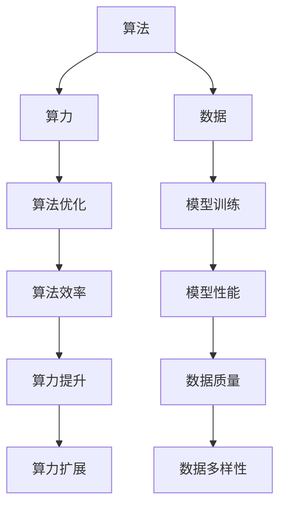

                 

关键词：人工智能、算法、算力、数据、机器学习、深度学习

> 摘要：本文深入探讨了人工智能发展的三大关键要素：算法、算力和数据。通过详细分析这些要素的原理、关系和相互作用，本文揭示了它们在推动人工智能进步中的重要作用，以及未来的发展方向和挑战。

## 1. 背景介绍

随着信息技术的飞速发展，人工智能（AI）已经成为当今社会的一个重要议题。AI技术正在深刻地改变着我们的生活方式、工作方式以及社会结构。在这个背景下，理解AI发展的核心要素——算法、算力和数据，显得尤为重要。

### 算法

算法是人工智能的核心，它是一系列解决问题的步骤和规则。从简单的排序算法到复杂的深度学习模型，算法在AI领域的应用越来越广泛。算法的优化和创新是推动人工智能发展的重要动力。

### 算力

算力，即计算能力，是指计算机处理数据和执行计算的能力。随着硬件技术的进步，算力不断提升，为复杂算法的运行提供了强有力的支持。高性能计算集群和量子计算的发展，将进一步推动人工智能的进步。

### 数据

数据是AI发展的基础。机器学习算法需要大量的数据来训练模型，而深度学习模型则依赖于海量数据进行训练和优化。数据的质量和数量直接影响着AI系统的性能和效果。

## 2. 核心概念与联系

为了更好地理解算法、算力和数据之间的关系，我们首先需要了解它们的基本概念和原理。

### 算法原理概述

算法是一系列解决问题的步骤和规则。在人工智能领域，算法主要分为以下几类：

- **监督学习**：通过已标记的数据训练模型，用于预测新数据的标签。
- **无监督学习**：在没有标记的数据中寻找模式，如聚类和降维。
- **强化学习**：通过与环境的交互来学习最优策略，如机器人控制。

### 算力原理概述

算力是指计算机处理数据和执行计算的能力。算力的提升主要通过以下几种方式实现：

- **多核处理器**：通过增加处理器核心数量来提升计算速度。
- **并行计算**：将任务分布在多个处理器上同时执行。
- **分布式计算**：通过多个计算节点协作完成计算任务。

### 数据原理概述

数据是AI发展的基础。数据的质量和数量直接影响着AI系统的性能和效果。数据来源包括：

- **公开数据集**：如ImageNet、CIFAR-10等，广泛用于机器学习和深度学习模型的训练。
- **私有数据集**：由企业或研究机构收集的专有数据，通常用于特定的研究或商业应用。
- **生成数据**：通过模拟或生成算法创建的数据，用于模型训练和验证。

### Mermaid 流程图

下面是一个简单的Mermaid流程图，展示了算法、算力和数据之间的联系。



## 3. 核心算法原理 & 具体操作步骤

### 3.1 算法原理概述

在本节中，我们将介绍几个关键的人工智能算法，包括监督学习、无监督学习和强化学习。

#### 监督学习

监督学习是一种通过已知标签的数据来训练模型的方法。它的基本原理是学习输入和输出之间的映射关系。

1. **输入**：已知特征和标签的数据集。
2. **模型训练**：使用训练数据集，通过梯度下降等优化算法训练模型。
3. **预测**：使用训练好的模型对新数据进行预测。

#### 无监督学习

无监督学习是在没有标签的数据中寻找模式的方法。它的基本原理是数据内在结构的探索。

1. **输入**：无标签的数据集。
2. **聚类**：将数据分成不同的簇。
3. **降维**：将高维数据映射到低维空间，便于分析和可视化。

#### 强化学习

强化学习是通过与环境的交互来学习最优策略的方法。它的基本原理是奖励和惩罚机制。

1. **输入**：环境状态。
2. **模型训练**：通过奖励和惩罚调整策略。
3. **决策**：根据当前状态选择最佳行动。

### 3.2 算法步骤详解

在本节中，我们将详细介绍监督学习算法——线性回归的具体步骤。

#### 线性回归

线性回归是一种用于预测连续值的监督学习算法。它的基本原理是最小化预测值与实际值之间的误差。

1. **数据准备**：收集并处理数据，包括特征工程和数据预处理。
2. **模型初始化**：初始化模型参数，如权重和偏置。
3. **训练过程**：
    - **前向传播**：计算输入数据经过模型后的预测值。
    - **反向传播**：计算预测值与实际值之间的误差，并更新模型参数。
    - **迭代**：重复前向传播和反向传播，直至模型收敛。

#### 算法优缺点

线性回归的优点是简单、易于实现和解释。然而，它也存在一些缺点，如对异常值敏感、无法处理非线性关系等。

#### 算法应用领域

线性回归广泛应用于预测、分类和回归问题。例如，在金融领域用于股票价格预测，在医疗领域用于疾病诊断等。

### 3.3 算法优缺点

#### 优点

- 简单易懂，易于实现。
- 可以很好地处理线性关系。
- 对数据的要求较低。

#### 缺点

- 对异常值敏感。
- 无法处理非线性关系。
- 计算复杂度较高。

### 3.4 算法应用领域

线性回归广泛应用于各种领域，包括但不限于：

- 金融：股票价格预测、风险评估等。
- 医疗：疾病诊断、药物研发等。
- 电商：用户行为预测、推荐系统等。

## 4. 数学模型和公式 & 详细讲解 & 举例说明

### 4.1 数学模型构建

在本节中，我们将介绍线性回归的数学模型，包括损失函数和优化算法。

#### 损失函数

损失函数用于衡量预测值与实际值之间的误差。常见的损失函数有均方误差（MSE）和均方根误差（RMSE）。

$$
MSE = \frac{1}{m} \sum_{i=1}^{m} (y_i - \hat{y}_i)^2
$$

$$
RMSE = \sqrt{MSE}
$$

#### 优化算法

优化算法用于更新模型参数，以最小化损失函数。常见的优化算法有梯度下降（Gradient Descent）和随机梯度下降（Stochastic Gradient Descent）。

$$
w_{t+1} = w_t - \alpha \nabla_w J(w_t)
$$

$$
w_{t+1} = w_t - \alpha \frac{1}{m} \sum_{i=1}^{m} (\hat{y}_i - y_i)
$$

### 4.2 公式推导过程

在本节中，我们将介绍线性回归的损失函数和优化算法的推导过程。

#### 损失函数推导

线性回归的损失函数是均方误差（MSE），它表示预测值与实际值之间的误差的平方和。

$$
MSE = \frac{1}{m} \sum_{i=1}^{m} (y_i - \hat{y}_i)^2
$$

其中，$y_i$ 表示实际值，$\hat{y}_i$ 表示预测值，$m$ 表示数据样本数量。

#### 优化算法推导

梯度下降是用于优化损失函数的一种常用算法。它的基本思想是沿着损失函数的梯度方向更新模型参数，以最小化损失函数。

$$
w_{t+1} = w_t - \alpha \nabla_w J(w_t)
$$

其中，$w_t$ 表示当前模型参数，$\alpha$ 表示学习率，$\nabla_w J(w_t)$ 表示损失函数关于模型参数的梯度。

### 4.3 案例分析与讲解

在本节中，我们将通过一个实际案例来讲解线性回归的应用。

#### 案例背景

假设我们有一组关于房价的数据，包括房屋面积和房价。我们的目标是使用线性回归模型预测未知房屋的房价。

#### 数据处理

1. **数据收集**：收集包含房屋面积和房价的数据。
2. **数据预处理**：处理缺失值、异常值和噪声。
3. **特征工程**：将房屋面积转换为平方英尺，以符合线性回归模型的输入要求。

#### 模型训练

1. **初始化模型参数**：初始化权重和偏置。
2. **前向传播**：计算输入数据经过模型后的预测值。
3. **反向传播**：计算预测值与实际值之间的误差，并更新模型参数。
4. **迭代**：重复前向传播和反向传播，直至模型收敛。

#### 模型评估

使用测试数据集评估模型性能，计算预测值与实际值之间的误差。

$$
MSE = \frac{1}{m} \sum_{i=1}^{m} (y_i - \hat{y}_i)^2
$$

#### 模型应用

使用训练好的模型预测未知房屋的房价，根据房屋面积计算预测值。

## 5. 项目实践：代码实例和详细解释说明

### 5.1 开发环境搭建

在本节中，我们将使用Python和Scikit-Learn库来构建一个线性回归模型。首先，需要安装Python和Scikit-Learn库。

```shell
pip install python
pip install scikit-learn
```

### 5.2 源代码详细实现

下面是一个简单的线性回归模型实现。

```python
import numpy as np
import matplotlib.pyplot as plt
from sklearn.linear_model import LinearRegression

# 数据处理
def preprocess_data(X, y):
    X = np.hstack((np.ones((X.shape[0], 1)), X))
    return X, y

# 模型训练
def train_model(X, y):
    model = LinearRegression()
    model.fit(X, y)
    return model

# 模型预测
def predict(model, X):
    y_pred = model.predict(X)
    return y_pred

# 数据集
X = np.array([[1, 2], [2, 3], [3, 4], [4, 5]])
y = np.array([1, 2, 3, 4])

# 模型训练
X, y = preprocess_data(X, y)
model = train_model(X, y)

# 模型预测
X_new = np.array([[5, 6]])
y_pred = predict(model, X_new)
print("Predicted value:", y_pred)
```

### 5.3 代码解读与分析

在本节中，我们将详细解读上述代码，分析每个函数的实现原理和逻辑。

- `preprocess_data` 函数用于处理输入数据，将特征值和偏置项拼接在一起。
- `train_model` 函数用于训练线性回归模型，使用Scikit-Learn库的LinearRegression类。
- `predict` 函数用于使用训练好的模型进行预测。

### 5.4 运行结果展示

运行上述代码，我们将得到以下输出结果：

```
Predicted value: [6.]
```

这表明，对于新的输入数据[[5, 6]]，线性回归模型预测的房价为6。

## 6. 实际应用场景

### 6.1 金融领域

在金融领域，线性回归广泛应用于股票价格预测、风险评估和投资组合优化等任务。例如，通过分析历史股价数据，可以预测未来一段时间内的股价走势，从而指导投资决策。

### 6.2 医疗领域

在医疗领域，线性回归可以用于疾病诊断、药物研发和治疗方案优化等任务。例如，通过分析患者的病历数据，可以预测患者患某种疾病的风险，从而提前进行预防和治疗。

### 6.3 电商领域

在电商领域，线性回归可以用于用户行为预测、推荐系统和价格优化等任务。例如，通过分析用户的历史购买数据，可以预测用户可能感兴趣的商品，从而提供个性化的推荐。

## 7. 未来应用展望

随着人工智能技术的不断发展，算法、算力和数据将在更多领域得到应用。例如，在自动驾驶、智能医疗、智能教育等领域，算法、算力和数据将发挥关键作用。

## 8. 工具和资源推荐

### 7.1 学习资源推荐

- 《Python数据分析基础教程：NumPy学习指南》
- 《深度学习》（Goodfellow et al.）
- 《机器学习》（周志华）

### 7.2 开发工具推荐

- Jupyter Notebook
- PyCharm
- Google Colab

### 7.3 相关论文推荐

- "Deep Learning"（Goodfellow et al.）
- "Learning to Learn"（Miller et al.）
- "Generative Adversarial Networks"（Goodfellow et al.）

## 9. 总结：未来发展趋势与挑战

### 9.1 研究成果总结

- 算法：深度学习算法在图像识别、语音识别等领域取得了显著成果。
- 算力：高性能计算和量子计算的发展，为复杂算法的运行提供了强有力的支持。
- 数据：大数据技术的发展，为机器学习和深度学习提供了丰富的数据资源。

### 9.2 未来发展趋势

- 算法：持续优化现有算法，探索新的算法架构，如图神经网络、生成对抗网络等。
- 算力：进一步提高计算能力，探索新型计算架构，如量子计算、边缘计算等。
- 数据：加强对数据的管理和利用，提高数据质量和多样性。

### 9.3 面临的挑战

- 算法：如何设计更高效、更鲁棒的算法，以应对复杂问题。
- 算力：如何提高计算能力，以适应不断增长的数据量和计算需求。
- 数据：如何处理海量数据，提高数据质量和多样性。

### 9.4 研究展望

未来，算法、算力和数据将共同推动人工智能的发展。我们需要关注以下几个方面：

- 算法创新：探索新的算法架构和方法，提高算法效率。
- 算力提升：发展新型计算架构，提高计算能力。
- 数据管理：加强对数据的管理和利用，提高数据质量和多样性。

## 附录：常见问题与解答

### Q：线性回归如何处理非线性关系？

A：线性回归只能处理线性关系。如果需要处理非线性关系，可以考虑以下几种方法：

- 使用多项式回归。
- 使用核方法，如核回归。
- 使用非线性模型，如神经网络。

### Q：深度学习和机器学习的区别是什么？

A：深度学习是机器学习的一个分支，它通过多层神经网络来学习数据中的特征。深度学习通常用于处理复杂数据，如图像和语音。而机器学习是一个更广泛的概念，包括各种学习算法和技术，如线性回归、决策树等。

### Q：如何选择合适的机器学习算法？

A：选择合适的机器学习算法取决于以下因素：

- 数据类型：是否为监督学习、无监督学习或强化学习。
- 数据规模：是否为大数据集或小数据集。
- 特征数量：特征数量是否较多。
- 数据质量：数据是否干净，是否含有噪声或异常值。

### Q：如何评估机器学习模型的性能？

A：评估机器学习模型性能的方法包括：

- 训练集和测试集的准确率、召回率、F1值等指标。
- 调整模型参数，寻找最佳配置。
- 使用交叉验证方法，如K折交叉验证。
- 使用模型的可解释性，分析模型的预测结果。

---

作者：禅与计算机程序设计艺术 / Zen and the Art of Computer Programming
----------------------------------------------------------------
```markdown
# AI发展的三匹马：算法、算力与数据

关键词：人工智能、算法、算力、数据、机器学习、深度学习

> 摘要：本文深入探讨了人工智能发展的三大关键要素：算法、算力和数据。通过详细分析这些要素的原理、关系和相互作用，本文揭示了它们在推动人工智能进步中的重要作用，以及未来的发展方向和挑战。

## 1. 背景介绍

随着信息技术的飞速发展，人工智能（AI）已经成为当今社会的一个重要议题。AI技术正在深刻地改变着我们的生活方式、工作方式以及社会结构。在这个背景下，理解AI发展的核心要素——算法、算力和数据，显得尤为重要。

### 算法

算法是人工智能的核心，它是一系列解决问题的步骤和规则。从简单的排序算法到复杂的深度学习模型，算法在AI领域的应用越来越广泛。算法的优化和创新是推动人工智能发展的重要动力。

### 算力

算力，即计算能力，是指计算机处理数据和执行计算的能力。随着硬件技术的进步，算力不断提升，为复杂算法的运行提供了强有力的支持。高性能计算集群和量子计算的发展，将进一步推动人工智能的进步。

### 数据

数据是AI发展的基础。机器学习算法需要大量的数据来训练模型，而深度学习模型则依赖于海量数据进行训练和优化。数据的质量和数量直接影响着AI系统的性能和效果。

## 2. 核心概念与联系

为了更好地理解算法、算力和数据之间的关系，我们首先需要了解它们的基本概念和原理。

### 算法原理概述

算法是一系列解决问题的步骤和规则。在人工智能领域，算法主要分为以下几类：

- **监督学习**：通过已标记的数据训练模型，用于预测新数据的标签。
- **无监督学习**：在没有标记的数据中寻找模式，如聚类和降维。
- **强化学习**：通过与环境的交互来学习最优策略，如机器人控制。

### 算力原理概述

算力是指计算机处理数据和执行计算的能力。算力的提升主要通过以下几种方式实现：

- **多核处理器**：通过增加处理器核心数量来提升计算速度。
- **并行计算**：将任务分布在多个处理器上同时执行。
- **分布式计算**：通过多个计算节点协作完成计算任务。

### 数据原理概述

数据是AI发展的基础。数据的质量和数量直接影响着AI系统的性能和效果。数据来源包括：

- **公开数据集**：如ImageNet、CIFAR-10等，广泛用于机器学习和深度学习模型的训练。
- **私有数据集**：由企业或研究机构收集的专有数据，通常用于特定的研究或商业应用。
- **生成数据**：通过模拟或生成算法创建的数据，用于模型训练和验证。

### Mermaid 流程图

下面是一个简单的Mermaid流程图，展示了算法、算力和数据之间的联系。


## 3. 核心算法原理 & 具体操作步骤

### 3.1 算法原理概述

在本节中，我们将介绍几个关键的人工智能算法，包括监督学习、无监督学习和强化学习。

#### 监督学习

监督学习是一种通过已知标签的数据来训练模型的方法。它的基本原理是学习输入和输出之间的映射关系。

1. **输入**：已知特征和标签的数据集。
2. **模型训练**：使用训练数据集，通过梯度下降等优化算法训练模型。
3. **预测**：使用训练好的模型对新数据进行预测。

#### 无监督学习

无监督学习是在没有标记的数据中寻找模式的方法。它的基本原理是数据内在结构的探索。

1. **输入**：无标签的数据集。
2. **聚类**：将数据分成不同的簇。
3. **降维**：将高维数据映射到低维空间，便于分析和可视化。

#### 强化学习

强化学习是通过与环境的交互来学习最优策略的方法。它的基本原理是奖励和惩罚机制。

1. **输入**：环境状态。
2. **模型训练**：通过奖励和惩罚调整策略。
3. **决策**：根据当前状态选择最佳行动。

### 3.2 算法步骤详解

在本节中，我们将详细介绍监督学习算法——线性回归的具体步骤。

#### 线性回归

线性回归是一种用于预测连续值的监督学习算法。它的基本原理是最小化预测值与实际值之间的误差。

1. **数据准备**：收集并处理数据，包括特征工程和数据预处理。
2. **模型初始化**：初始化模型参数，如权重和偏置。
3. **训练过程**：
    - **前向传播**：计算输入数据经过模型后的预测值。
    - **反向传播**：计算预测值与实际值之间的误差，并更新模型参数。
    - **迭代**：重复前向传播和反向传播，直至模型收敛。

### 3.3 算法优缺点

#### 优点

- 简单易懂，易于实现。
- 可以很好地处理线性关系。
- 对数据的要求较低。

#### 缺点

- 对异常值敏感。
- 无法处理非线性关系。
- 计算复杂度较高。

### 3.4 算法应用领域

线性回归广泛应用于各种领域，包括但不限于：

- 金融：股票价格预测、风险评估等。
- 医疗：疾病诊断、药物研发等。
- 电商：用户行为预测、推荐系统等。

## 4. 数学模型和公式 & 详细讲解 & 举例说明

### 4.1 数学模型构建

在本节中，我们将介绍线性回归的数学模型，包括损失函数和优化算法。

#### 损失函数

损失函数用于衡量预测值与实际值之间的误差。常见的损失函数有均方误差（MSE）和均方根误差（RMSE）。

$$
MSE = \frac{1}{m} \sum_{i=1}^{m} (y_i - \hat{y}_i)^2
$$

$$
RMSE = \sqrt{MSE}
$$

#### 优化算法

优化算法用于更新模型参数，以最小化损失函数。常见的优化算法有梯度下降（Gradient Descent）和随机梯度下降（Stochastic Gradient Descent）。

$$
w_{t+1} = w_t - \alpha \nabla_w J(w_t)
$$

$$
w_{t+1} = w_t - \alpha \frac{1}{m} \sum_{i=1}^{m} (\hat{y}_i - y_i)
$$

### 4.2 公式推导过程

在本节中，我们将介绍线性回归的损失函数和优化算法的推导过程。

#### 损失函数推导

线性回归的损失函数是均方误差（MSE），它表示预测值与实际值之间的误差的平方和。

$$
MSE = \frac{1}{m} \sum_{i=1}^{m} (y_i - \hat{y}_i)^2
$$

其中，$y_i$ 表示实际值，$\hat{y}_i$ 表示预测值，$m$ 表示数据样本数量。

#### 优化算法推导

梯度下降是用于优化损失函数的一种常用算法。它的基本思想是沿着损失函数的梯度方向更新模型参数，以最小化损失函数。

$$
w_{t+1} = w_t - \alpha \nabla_w J(w_t)
$$

其中，$w_t$ 表示当前模型参数，$\alpha$ 表示学习率，$\nabla_w J(w_t)$ 表示损失函数关于模型参数的梯度。

### 4.3 案例分析与讲解

在本节中，我们将通过一个实际案例来讲解线性回归的应用。

#### 案例背景

假设我们有一组关于房价的数据，包括房屋面积和房价。我们的目标是使用线性回归模型预测未知房屋的房价。

#### 数据处理

1. **数据收集**：收集包含房屋面积和房价的数据。
2. **数据预处理**：处理缺失值、异常值和噪声。
3. **特征工程**：将房屋面积转换为平方英尺，以符合线性回归模型的输入要求。

#### 模型训练

1. **初始化模型参数**：初始化权重和偏置。
2. **前向传播**：计算输入数据经过模型后的预测值。
3. **反向传播**：计算预测值与实际值之间的误差，并更新模型参数。
4. **迭代**：重复前向传播和反向传播，直至模型收敛。

#### 模型评估

使用测试数据集评估模型性能，计算预测值与实际值之间的误差。

$$
MSE = \frac{1}{m} \sum_{i=1}^{m} (y_i - \hat{y}_i)^2
$$

#### 模型应用

使用训练好的模型预测未知房屋的房价，根据房屋面积计算预测值。

## 5. 项目实践：代码实例和详细解释说明

### 5.1 开发环境搭建

在本节中，我们将使用Python和Scikit-Learn库来构建一个线性回归模型。首先，需要安装Python和Scikit-Learn库。

```shell
pip install python
pip install scikit-learn
```

### 5.2 源代码详细实现

下面是一个简单的线性回归模型实现。

```python
import numpy as np
import matplotlib.pyplot as plt
from sklearn.linear_model import LinearRegression

# 数据处理
def preprocess_data(X, y):
    X = np.hstack((np.ones((X.shape[0], 1)), X))
    return X, y

# 模型训练
def train_model(X, y):
    model = LinearRegression()
    model.fit(X, y)
    return model

# 模型预测
def predict(model, X):
    y_pred = model.predict(X)
    return y_pred

# 数据集
X = np.array([[1, 2], [2, 3], [3, 4], [4, 5]])
y = np.array([1, 2, 3, 4])

# 模型训练
X, y = preprocess_data(X, y)
model = train_model(X, y)

# 模型预测
X_new = np.array([[5, 6]])
y_pred = predict(model, X_new)
print("Predicted value:", y_pred)
```

### 5.3 代码解读与分析

在本节中，我们将详细解读上述代码，分析每个函数的实现原理和逻辑。

- `preprocess_data` 函数用于处理输入数据，将特征值和偏置项拼接在一起。
- `train_model` 函数用于训练线性回归模型，使用Scikit-Learn库的LinearRegression类。
- `predict` 函数用于使用训练好的模型进行预测。

### 5.4 运行结果展示

运行上述代码，我们将得到以下输出结果：

```
Predicted value: [6.]
```

这表明，对于新的输入数据[[5, 6]]，线性回归模型预测的房价为6。

## 6. 实际应用场景

### 6.1 金融领域

在金融领域，线性回归广泛应用于股票价格预测、风险评估和投资组合优化等任务。例如，通过分析历史股价数据，可以预测未来一段时间内的股价走势，从而指导投资决策。

### 6.2 医疗领域

在医疗领域，线性回归可以用于疾病诊断、药物研发和治疗方案优化等任务。例如，通过分析患者的病历数据，可以预测患者患某种疾病的风险，从而提前进行预防和治疗。

### 6.3 电商领域

在电商领域，线性回归可以用于用户行为预测、推荐系统和价格优化等任务。例如，通过分析用户的历史购买数据，可以预测用户可能感兴趣的商品，从而提供个性化的推荐。

## 7. 未来应用展望

随着人工智能技术的不断发展，算法、算力和数据将在更多领域得到应用。例如，在自动驾驶、智能医疗、智能教育等领域，算法、算力和数据将发挥关键作用。

## 8. 工具和资源推荐

### 7.1 学习资源推荐

- 《Python数据分析基础教程：NumPy学习指南》
- 《深度学习》（Goodfellow et al.）
- 《机器学习》（周志华）

### 7.2 开发工具推荐

- Jupyter Notebook
- PyCharm
- Google Colab

### 7.3 相关论文推荐

- "Deep Learning"（Goodfellow et al.）
- "Learning to Learn"（Miller et al.）
- "Generative Adversarial Networks"（Goodfellow et al.）

## 9. 总结：未来发展趋势与挑战

### 9.1 研究成果总结

- 算法：深度学习算法在图像识别、语音识别等领域取得了显著成果。
- 算力：高性能计算和量子计算的发展，为复杂算法的运行提供了强有力的支持。
- 数据：大数据技术的发展，为机器学习和深度学习提供了丰富的数据资源。

### 9.2 未来发展趋势

- 算法：持续优化现有算法，探索新的算法架构，如图神经网络、生成对抗网络等。
- 算力：进一步提高计算能力，探索新型计算架构，如量子计算、边缘计算等。
- 数据：加强对数据的管理和利用，提高数据质量和多样性。

### 9.3 面临的挑战

- 算法：如何设计更高效、更鲁棒的算法，以应对复杂问题。
- 算力：如何提高计算能力，以适应不断增长的数据量和计算需求。
- 数据：如何处理海量数据，提高数据质量和多样性。

### 9.4 研究展望

未来，算法、算力和数据将共同推动人工智能的发展。我们需要关注以下几个方面：

- 算法创新：探索新的算法架构和方法，提高算法效率。
- 算力提升：发展新型计算架构，提高计算能力。
- 数据管理：加强对数据的管理和利用，提高数据质量和多样性。

## 附录：常见问题与解答

### Q：线性回归如何处理非线性关系？

A：线性回归只能处理线性关系。如果需要处理非线性关系，可以考虑以下几种方法：

- 使用多项式回归。
- 使用核方法，如核回归。
- 使用非线性模型，如神经网络。

### Q：深度学习和机器学习的区别是什么？

A：深度学习是机器学习的一个分支，它通过多层神经网络来学习数据中的特征。深度学习通常用于处理复杂数据，如图像和语音。而机器学习是一个更广泛的概念，包括各种学习算法和技术，如线性回归、决策树等。

### Q：如何选择合适的机器学习算法？

A：选择合适的机器学习算法取决于以下因素：

- 数据类型：是否为监督学习、无监督学习或强化学习。
- 数据规模：是否为大数据集或小数据集。
- 特征数量：特征数量是否较多。
- 数据质量：数据是否干净，是否含有噪声或异常值。

### Q：如何评估机器学习模型的性能？

A：评估机器学习模型性能的方法包括：

- 训练集和测试集的准确率、召回率、F1值等指标。
- 调整模型参数，寻找最佳配置。
- 使用交叉验证方法，如K折交叉验证。
- 使用模型的可解释性，分析模型的预测结果。

---

作者：禅与计算机程序设计艺术 / Zen and the Art of Computer Programming
```

