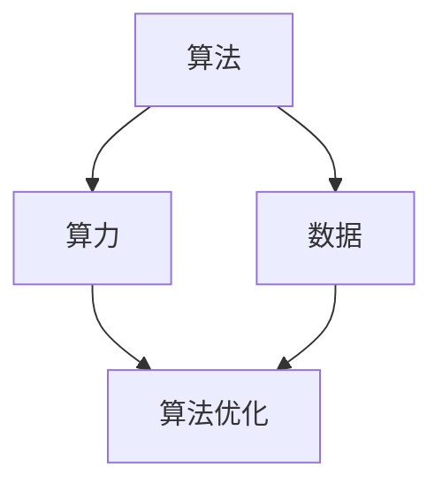

                 

关键词：人工智能，算法，算力，数据，深度学习，神经网络，计算能力，数据处理，算法效率，硬件架构

> 摘要：本文深入探讨了人工智能（AI）发展的三大核心要素：算法、算力和数据。通过详细分析这三大要素之间的关系、原理以及应用，旨在揭示它们在AI领域中的重要作用，并展望未来的发展趋势和面临的挑战。

## 1. 背景介绍

人工智能（Artificial Intelligence，简称AI）作为一门研究、开发用于模拟、延伸和扩展人的智能的理论、方法、技术及应用系统的技术科学，已经成为了当前科技领域中最热门的话题之一。AI技术的发展离不开算法、算力和数据的支撑，它们可以被视为推动AI进步的“三驾马车”。

- **算法（Algorithm）**：是解决问题的一系列规则或步骤，是AI的核心。从最初的逻辑推理到现代的深度学习，算法的进步极大地推动了AI技术的发展。
- **算力（Compute Power）**：指的是计算能力，是执行算法所需的基础资源。算力的提升使得复杂算法的运行变得可行。
- **数据（Data）**：是训练和学习的基础，没有足够的数据，算法就无法进行有效的训练和优化。

本文将从这三个方面展开讨论，探讨它们在AI发展中的关系、作用以及未来的发展趋势。

## 2. 核心概念与联系

为了更好地理解算法、算力和数据在AI发展中的核心作用，我们可以借助Mermaid流程图来展示它们之间的关系。



### 2.1 算法原理概述

算法是AI发展的核心。不同的算法适用于不同的场景和任务，如：

- **监督学习（Supervised Learning）**：通过已知输入输出数据训练模型，用于预测和分类。
- **无监督学习（Unsupervised Learning）**：通过未标记的数据训练模型，用于聚类和降维。
- **强化学习（Reinforcement Learning）**：通过与环境互动来学习策略，用于游戏和机器人控制。

### 2.2 算法步骤详解

不同的算法有着不同的实现步骤，但通常包括以下几个阶段：

1. **数据预处理**：清洗、归一化、转换等，以便于模型训练。
2. **模型选择**：根据任务需求选择合适的模型。
3. **训练**：使用训练数据训练模型，调整模型参数。
4. **验证**：使用验证数据测试模型效果。
5. **优化**：根据验证结果调整模型参数，提高模型性能。

### 2.3 算法优缺点

不同的算法有着不同的优缺点，如：

- **监督学习**：效果较好，但需要大量的标注数据。
- **无监督学习**：不需要标注数据，但效果可能不如监督学习。
- **强化学习**：适用于需要决策的复杂环境，但训练时间较长。

### 2.4 算法应用领域

算法在各个领域都有广泛的应用，如：

- **计算机视觉**：图像识别、物体检测等。
- **自然语言处理**：语音识别、机器翻译等。
- **推荐系统**：基于用户行为和偏好推荐商品或内容。
- **游戏**：AI对手、智能角色等。

## 3. 核心算法原理 & 具体操作步骤

### 3.1 算法原理概述

以深度学习为例，其基本原理是通过多层神经网络对数据进行建模和预测。深度学习的优势在于可以自动学习数据的层次特征，从而提高模型的泛化能力。

### 3.2 算法步骤详解

1. **数据预处理**：读取数据，进行归一化、数据增强等操作。
2. **构建神经网络**：设计网络结构，选择合适的激活函数、损失函数和优化器。
3. **训练**：使用训练数据训练网络，调整网络参数。
4. **验证**：使用验证数据评估模型性能。
5. **优化**：根据验证结果调整网络参数，提高模型性能。
6. **部署**：将训练好的模型部署到实际应用中。

### 3.3 算法优缺点

- **优势**：能够自动学习数据的层次特征，提高模型性能；适用于复杂任务。
- **缺点**：需要大量的数据和计算资源；训练时间较长。

### 3.4 算法应用领域

深度学习在计算机视觉、自然语言处理、推荐系统等领域都有广泛的应用，如：

- **计算机视觉**：图像识别、物体检测等。
- **自然语言处理**：语音识别、机器翻译等。
- **推荐系统**：基于用户行为和偏好推荐商品或内容。

## 4. 数学模型和公式 & 详细讲解 & 举例说明

### 4.1 数学模型构建

深度学习中的数学模型主要包括神经网络模型、损失函数和优化器。以下是一个简单的神经网络模型：

```latex
\begin{equation}
h_{\theta}(x) = \sigma(\theta^T x),
\end{equation}
```

其中，$h_{\theta}(x)$ 表示神经网络输出，$\theta$ 表示模型参数，$\sigma$ 表示激活函数。

### 4.2 公式推导过程

以神经网络中的反向传播算法为例，其推导过程如下：

1. **前向传播**：

```latex
\begin{equation}
a_{\ell} = \sigma(W_{\ell-1} a_{\ell-1} + b_{\ell-1}).
\end{equation}
```

2. **后向传播**：

```latex
\begin{equation}
\begin{aligned}
\delta_{\ell} &= \frac{\partial L}{\partial a_{\ell}} \cdot \frac{\partial a_{\ell}}{\partial z_{\ell}}, \\
\theta_{\ell} &= \theta_{\ell} - \alpha \frac{\partial L}{\partial \theta_{\ell}}, \\
b_{\ell} &= b_{\ell} - \alpha \frac{\partial L}{\partial b_{\ell}}.
\end{aligned}
\end{equation}
```

### 4.3 案例分析与讲解

以图像分类任务为例，使用卷积神经网络（CNN）对图像进行分类。首先，读取图像数据并进行预处理；然后，构建CNN模型，使用训练数据进行训练；最后，使用验证数据评估模型性能。

```python
import tensorflow as tf
from tensorflow.keras import layers

# 构建CNN模型
model = tf.keras.Sequential([
    layers.Conv2D(32, (3, 3), activation='relu', input_shape=(28, 28, 1)),
    layers.MaxPooling2D((2, 2)),
    layers.Flatten(),
    layers.Dense(128, activation='relu'),
    layers.Dense(10, activation='softmax')
])

# 编译模型
model.compile(optimizer='adam',
              loss='categorical_crossentropy',
              metrics=['accuracy'])

# 训练模型
model.fit(x_train, y_train, epochs=10, batch_size=32, validation_split=0.2)
```

## 5. 项目实践：代码实例和详细解释说明

### 5.1 开发环境搭建

1. 安装Python环境（推荐版本3.8及以上）。
2. 安装TensorFlow库（可以使用pip install tensorflow）。

### 5.2 源代码详细实现

以上面的图像分类任务为例，详细实现代码如下：

```python
import tensorflow as tf
from tensorflow.keras import layers

# 构建CNN模型
model = tf.keras.Sequential([
    layers.Conv2D(32, (3, 3), activation='relu', input_shape=(28, 28, 1)),
    layers.MaxPooling2D((2, 2)),
    layers.Flatten(),
    layers.Dense(128, activation='relu'),
    layers.Dense(10, activation='softmax')
])

# 编译模型
model.compile(optimizer='adam',
              loss='categorical_crossentropy',
              metrics=['accuracy'])

# 训练模型
model.fit(x_train, y_train, epochs=10, batch_size=32, validation_split=0.2)
```

### 5.3 代码解读与分析

1. **模型构建**：

   ```python
   model = tf.keras.Sequential([
       layers.Conv2D(32, (3, 3), activation='relu', input_shape=(28, 28, 1)),
       layers.MaxPooling2D((2, 2)),
       layers.Flatten(),
       layers.Dense(128, activation='relu'),
       layers.Dense(10, activation='softmax')
   ])
   ```

   这段代码构建了一个简单的卷积神经网络（CNN），包括一个卷积层、一个最大池化层、一个平坦化层、一个全连接层和一个softmax层。

2. **模型编译**：

   ```python
   model.compile(optimizer='adam',
                 loss='categorical_crossentropy',
                 metrics=['accuracy'])
   ```

   这段代码编译了模型，指定了优化器（adam）、损失函数（categorical_crossentropy）和评估指标（accuracy）。

3. **模型训练**：

   ```python
   model.fit(x_train, y_train, epochs=10, batch_size=32, validation_split=0.2)
   ```

   这段代码使用训练数据训练模型，指定了训练轮数（epochs）、批量大小（batch_size）和验证比例（validation_split）。

### 5.4 运行结果展示

训练完成后，可以查看模型在训练集和验证集上的准确率：

```python
train_loss, train_acc = model.evaluate(x_train, y_train, verbose=2)
val_loss, val_acc = model.evaluate(x_test, y_test, verbose=2)

print(f"Training accuracy: {train_acc:.2f}")
print(f"Validation accuracy: {val_acc:.2f}")
```

## 6. 实际应用场景

算法、算力和数据在AI领域有着广泛的应用，以下是一些典型的实际应用场景：

- **计算机视觉**：图像识别、物体检测、人脸识别等。
- **自然语言处理**：语音识别、机器翻译、情感分析等。
- **推荐系统**：基于用户行为和偏好推荐商品或内容。
- **自动驾驶**：环境感知、路径规划、决策控制等。
- **医疗诊断**：疾病预测、影像分析、药物研发等。

## 7. 工具和资源推荐

为了更好地进行AI开发，以下是一些推荐的工具和资源：

- **学习资源**：

  - [吴恩达的深度学习课程](https://www.deeplearning.ai/)
  - [李飞飞教授的CS231n课程](http://cs231n.stanford.edu/)

- **开发工具**：

  - TensorFlow：一个开源的深度学习框架。
  - PyTorch：一个开源的深度学习框架。

- **相关论文**：

  - [“Deep Learning”](https://www.deeplearningbook.org/)：由Ian Goodfellow等人撰写的深度学习入门书籍。
  - [“Convolutional Neural Networks for Visual Recognition”](https://www.cv-foundation.org/openaccess/content_cvpr_2015/papers/He_Condolutional_Neural_Networks_CVPR_2015_paper.pdf)：一篇关于卷积神经网络的经典论文。

## 8. 总结：未来发展趋势与挑战

### 8.1 研究成果总结

近年来，算法、算力和数据在AI领域取得了显著的进展。深度学习算法的崛起，使得计算机视觉、自然语言处理等领域取得了突破性进展；算力的提升，使得更大规模、更复杂的模型得以实现；数据的积累，为AI的应用提供了丰富的训练素材。

### 8.2 未来发展趋势

未来，AI将继续朝着智能化、泛在化的方向发展。算法方面，将出现更多高效、可解释的算法；算力方面，量子计算、边缘计算等新技术将进一步提升计算能力；数据方面，数据质量和数据安全将成为重要议题。

### 8.3 面临的挑战

AI发展也面临着一系列挑战，如：

- **算法公平性**：如何保证算法的公平性和透明性，避免歧视和偏见。
- **数据隐私**：如何在保护用户隐私的前提下，充分利用数据进行训练。
- **算法可解释性**：如何解释和验证算法的决策过程，提高算法的可信度。
- **计算资源分配**：如何在有限的计算资源下，实现最优的算法性能。

### 8.4 研究展望

未来，我们需要从多方面进行探索，如：

- **算法优化**：研究更高效、更可解释的算法。
- **算力提升**：探索新的计算架构，如量子计算、边缘计算等。
- **数据治理**：建立完善的数据治理体系，提高数据质量和数据安全。
- **跨学科融合**：将AI与其他领域相结合，如医学、金融等，解决实际问题。

## 9. 附录：常见问题与解答

### 9.1 什么是深度学习？

深度学习是一种机器学习技术，通过多层神经网络对数据进行建模和预测。它能够自动学习数据的层次特征，从而提高模型的性能。

### 9.2 深度学习算法有哪些优缺点？

优点：能够自动学习数据的层次特征，提高模型性能；适用于复杂任务。

缺点：需要大量的数据和计算资源；训练时间较长。

### 9.3 如何优化深度学习算法？

优化深度学习算法可以从以下几个方面进行：

- **模型结构**：选择合适的网络结构，如卷积神经网络（CNN）、循环神经网络（RNN）等。
- **超参数调整**：调整学习率、批量大小等超参数，以找到最优配置。
- **数据增强**：通过数据增强方法，增加训练数据的多样性，提高模型泛化能力。
- **模型集成**：结合多个模型，提高模型性能。

### 9.4 深度学习算法在哪些领域有应用？

深度学习算法在计算机视觉、自然语言处理、推荐系统、游戏、医疗诊断等领域都有广泛应用。

## 参考文献

- Goodfellow, I., Bengio, Y., & Courville, A. (2016). *Deep Learning*. MIT Press.
- Krizhevsky, A., Sutskever, I., & Hinton, G. E. (2012). *ImageNet classification with deep convolutional neural networks*. In *Advances in neural information processing systems* (pp. 1097-1105).
- LeCun, Y., Bengio, Y., & Hinton, G. (2015). *Deep learning*. Nature, 521(7553), 436-444.

