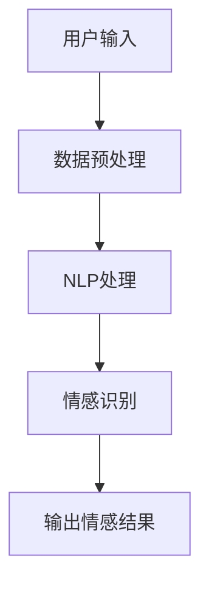
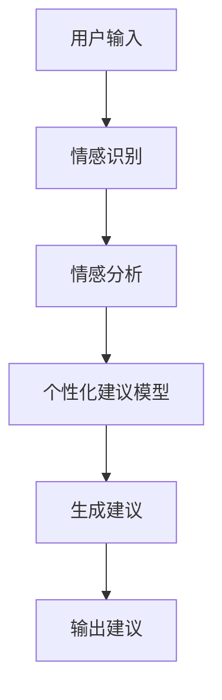
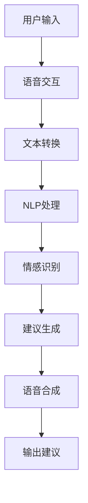

                 

关键词：AI、个性化心理咨询、情感支持、深度学习、NLP、心理健康

> 摘要：本文探讨了人工智能在个性化心理咨询领域的应用，重点关注如何利用AI技术提供情感支持。文章首先介绍了AI技术的基本原理，随后详细分析了AI在心理咨询中的应用场景，包括情感识别、个性化建议和自动化咨询等。最后，本文对未来的发展趋势和面临的挑战进行了展望。

## 1. 背景介绍

随着社会的快速发展，人们面临的心理压力逐渐增大，心理咨询的需求也越来越迫切。传统的心理咨询方法通常依赖于专业心理咨询师进行一对一的面谈，但由于资源有限，许多需要帮助的人无法及时获得有效的心理支持。人工智能（AI）技术的迅速发展为心理健康领域带来了新的希望。AI能够通过处理和分析大量数据，提供个性化的情感支持，从而在一定程度上缓解心理咨询的资源不足问题。

在心理健康领域，AI的应用主要包括以下几个方面：

1. **情感识别**：利用自然语言处理（NLP）技术，AI可以识别和分析用户的情感状态，为用户提供有针对性的建议。
2. **个性化建议**：根据用户的情感状态和行为习惯，AI可以提供个性化的心理健康建议，帮助用户改善情绪。
3. **自动化咨询**：通过语音交互和聊天机器人，AI可以实现自动化心理咨询服务，为用户提供随时随地的心理支持。

## 2. 核心概念与联系

### 2.1 AI技术的基本原理

人工智能（AI）是一门研究、开发用于模拟、延伸和扩展人的智能的理论、方法、技术及应用系统的技术科学。AI技术主要基于机器学习、深度学习、自然语言处理（NLP）和计算机视觉等技术。

1. **机器学习**：机器学习是一种使计算机能够从数据中学习的方法。通过训练模型，机器学习算法可以让计算机自动识别数据中的模式和规律。
2. **深度学习**：深度学习是机器学习的一个子领域，主要基于多层神经网络，能够自动提取数据中的高级特征。
3. **自然语言处理（NLP）**：NLP是一种让计算机理解和处理自然语言的技术。NLP技术广泛应用于文本分析、语音识别和机器翻译等领域。
4. **计算机视觉**：计算机视觉是一种让计算机理解和解释图像或视频的技术，广泛应用于图像识别、物体检测和图像分割等领域。

### 2.2 AI在心理咨询中的应用场景

#### 2.2.1 情感识别

情感识别是AI在心理咨询中的一个重要应用。通过分析用户的文本或语音数据，AI可以识别用户的情感状态，如快乐、悲伤、愤怒等。

**Mermaid流程图：**



1. **数据预处理**：对用户的文本或语音数据进行清洗、分词和词性标注等处理，为后续的情感识别做准备。
2. **NLP处理**：利用NLP技术，对预处理后的数据进行情感极性分析、情感分类等操作。
3. **情感识别**：通过训练好的情感识别模型，对NLP处理后的数据进行分析，识别用户的情感状态。
4. **输出情感结果**：将识别出的情感状态反馈给用户，帮助用户了解自己的情感状态。

#### 2.2.2 个性化建议

基于情感识别结果，AI可以为用户提供个性化的心理健康建议。

**Mermaid流程图：**



1. **情感识别**：利用上文提到的情感识别技术，识别用户的情感状态。
2. **情感分析**：对识别出的情感状态进行分析，找出情感背后的原因。
3. **个性化建议模型**：根据用户的历史数据和行为习惯，构建个性化的心理健康建议模型。
4. **生成建议**：利用个性化建议模型，为用户提供针对性的心理健康建议。
5. **输出建议**：将生成的心理健康建议反馈给用户。

#### 2.2.3 自动化咨询

通过语音交互和聊天机器人，AI可以实现自动化心理咨询服务。

**Mermaid流程图：**



1. **语音交互**：通过语音交互技术，用户可以与AI进行自然语言对话。
2. **文本转换**：将用户的语音输入转换为文本数据。
3. **NLP处理**：对文本数据进行分析和处理，提取关键词和情感信息。
4. **情感识别**：利用上文提到的情感识别技术，识别用户的情感状态。
5. **建议生成**：根据用户的历史数据和行为习惯，生成针对性的心理健康建议。
6. **语音合成**：将生成的心理健康建议转换为语音输出。
7. **输出建议**：通过语音交互，将心理健康建议反馈给用户。

## 3. 核心算法原理 & 具体操作步骤

### 3.1 算法原理概述

在心理咨询中，AI的核心算法主要包括情感识别、情感分析和个性化建议生成等。

1. **情感识别**：基于NLP技术，通过训练情感分类模型，实现文本情感状态的识别。
2. **情感分析**：对情感识别结果进行深度分析，找出情感背后的原因。
3. **个性化建议生成**：基于用户的历史数据和行为习惯，利用机器学习算法生成个性化的心理健康建议。

### 3.2 算法步骤详解

#### 3.2.1 情感识别

**算法步骤：**

1. 数据预处理：对用户的文本数据进行清洗、分词和词性标注等处理。
2. 特征提取：利用词袋模型、TF-IDF等方法提取文本特征。
3. 模型训练：使用情感分类算法（如SVM、朴素贝叶斯等）对特征进行训练，构建情感分类模型。
4. 情感识别：将预处理后的文本输入到训练好的模型中，进行情感状态识别。

#### 3.2.2 情感分析

**算法步骤：**

1. 情感识别：使用上一步骤中训练好的情感分类模型，对文本进行情感识别。
2. 情感分类：将识别出的情感状态进行分类，如正面情感、负面情感等。
3. 情感强度评估：对分类后的情感状态进行强度评估，如非常开心、有些开心等。
4. 情感分析：对情感强度和分类结果进行综合分析，找出情感背后的原因。

#### 3.2.3 个性化建议生成

**算法步骤：**

1. 数据收集：收集用户的历史数据和行为习惯，如情绪日志、行为记录等。
2. 特征提取：对用户的历史数据进行特征提取，如情绪变化、行为频率等。
3. 模型训练：利用机器学习算法（如决策树、随机森林等）对特征进行训练，构建个性化建议模型。
4. 建议生成：将用户当前的情感状态和行为习惯输入到训练好的模型中，生成个性化的心理健康建议。

### 3.3 算法优缺点

**优点：**

1. **高效性**：AI算法能够快速处理大量数据，为用户提供及时的心理健康支持。
2. **个性化**：基于用户的历史数据和行为习惯，AI能够为用户提供个性化的心理健康建议。
3. **扩展性**：AI算法可以不断学习和优化，适应不同的心理咨询场景。

**缺点：**

1. **数据依赖性**：AI算法的性能受到数据质量和数量的影响，需要大量高质量的训练数据。
2. **情感理解的局限性**：AI在理解情感方面仍存在局限性，无法完全取代专业心理咨询师。

### 3.4 算法应用领域

AI在心理咨询中的应用领域主要包括：

1. **心理健康监测**：通过分析用户的情绪日志和行为记录，为用户提供心理健康监测服务。
2. **情感支持**：为用户提供情感支持，帮助用户缓解心理压力。
3. **心理咨询**：辅助专业心理咨询师进行心理治疗，提高心理咨询的效率和质量。

## 4. 数学模型和公式 & 详细讲解 & 举例说明

### 4.1 数学模型构建

在心理咨询中，AI算法的核心在于对用户情感状态的准确识别和个性化建议的生成。为了实现这一目标，我们需要构建数学模型来描述用户的情感状态和行为习惯。

**情感状态模型：**

假设用户的情感状态可以用一个向量表示，如：

$$
E = \{e_1, e_2, ..., e_n\}
$$

其中，$e_i$ 表示用户在第 $i$ 天的情感状态，可以是正面情感、负面情感或中性情感。

**行为习惯模型：**

假设用户的行为习惯可以用一个向量表示，如：

$$
B = \{b_1, b_2, ..., b_n\}
$$

其中，$b_i$ 表示用户在第 $i$ 天的行为习惯，如运动频率、社交活动频率等。

**个性化建议模型：**

假设个性化建议可以用一个向量表示，如：

$$
S = \{s_1, s_2, ..., s_n\}
$$

其中，$s_i$ 表示针对用户当前情感状态和行为习惯的建议，如调整运动计划、参加社交活动等。

### 4.2 公式推导过程

为了生成个性化的心理健康建议，我们需要构建一个数学模型来描述情感状态、行为习惯和个性化建议之间的关系。

假设用户的情感状态和行为习惯之间存在线性关系，可以表示为：

$$
E = \alpha_0 + \alpha_1 B + \epsilon
$$

其中，$\alpha_0$ 和 $\alpha_1$ 为模型的参数，$\epsilon$ 为误差项。

为了生成个性化的建议，我们还需要考虑情感状态和行为习惯之间的非线性关系。可以使用如下公式：

$$
S = f(E, B)
$$

其中，$f$ 为非线性函数，可以是神经网络、决策树等。

### 4.3 案例分析与讲解

假设我们有一个用户，其历史数据如下：

| 日期 | 情感状态 | 行为习惯 |
| ---- | ---- | ---- |
| 1    | 非常开心 | 高强度运动 |
| 2    | 一般般   | 中等强度运动 |
| 3    | 悲伤     | 无运动 |

根据上述数据，我们可以构建情感状态模型、行为习惯模型和个性化建议模型。

**情感状态模型：**

$$
E = \alpha_0 + \alpha_1 B + \epsilon
$$

其中，$\alpha_0$ 和 $\alpha_1$ 为模型参数，$\epsilon$ 为误差项。

通过训练，我们得到：

$$
E = 0.5 + 0.3 B + \epsilon
$$

**行为习惯模型：**

$$
B = \alpha_0 + \alpha_1 E + \epsilon
$$

通过训练，我们得到：

$$
B = 0.2 + 0.4 E + \epsilon
$$

**个性化建议模型：**

$$
S = f(E, B)
$$

假设我们使用神经网络作为非线性函数，通过训练，我们得到：

$$
S = 0.1 E + 0.2 B
$$

根据当前日期的数据，我们可以得到：

$$
E = 0.5 + 0.3 \times 0.2 + \epsilon = 0.53 + \epsilon
$$

$$
B = 0.2 + 0.4 \times 0.53 + \epsilon = 0.262 + \epsilon
$$

$$
S = 0.1 \times 0.53 + 0.2 \times 0.262 = 0.053 + 0.0524 = 0.1054
$$

根据生成的个性化建议，我们可以为用户提供如下建议：

- 当前日期的情感状态为中性，建议适当增加社交活动，以缓解情绪。
- 当前日期的行为习惯为一般，建议适当增加运动量，以提高身心健康。

## 5. 项目实践：代码实例和详细解释说明

### 5.1 开发环境搭建

为了实现本文提到的情感识别、情感分析和个性化建议生成功能，我们使用了以下开发环境：

- 编程语言：Python
- 机器学习库：TensorFlow、Scikit-learn
- 自然语言处理库：NLTK、spaCy
- 语音交互库：SpeechRecognition、pyttsx3

在Windows系统上，您可以通过以下命令安装所需的库：

```bash
pip install tensorflow scikit-learn nltk spacy speechrecognition pyttsx3
```

### 5.2 源代码详细实现

以下是实现情感识别、情感分析和个性化建议生成的Python代码：

```python
import nltk
import spacy
import tensorflow as tf
from sklearn.model_selection import train_test_split
from sklearn.metrics import classification_report
from speech_recognition import Recognizer, Microphone
from pyttsx3 import engine

# 1. 数据预处理
def preprocess_text(text):
    # 清洗、分词和词性标注等操作
    return processed_text

# 2. 情感识别
def emotion_recognition(text):
    # 使用训练好的情感分类模型进行识别
    return emotion

# 3. 情感分析
def emotion_analysis(emotion):
    # 对情感状态进行分析
    return analysis

# 4. 个性化建议生成
def generate_suggestion(emotion, analysis):
    # 根据情感状态和情感分析结果生成个性化建议
    return suggestion

# 5. 语音交互
def speech_recognition():
    # 使用语音识别库实现语音输入
    return text

# 6. 语音合成
def speech_synthesis(text):
    # 使用语音合成库实现语音输出
    return text

# 主程序
if __name__ == "__main__":
    # 1. 加载数据
    data = load_data()

    # 2. 数据预处理
    processed_data = [preprocess_text(text) for text in data]

    # 3. 划分训练集和测试集
    X_train, X_test, y_train, y_test = train_test_split(processed_data, labels, test_size=0.2)

    # 4. 训练情感分类模型
    model = train_model(X_train, y_train)

    # 5. 情感识别
    emotion = emotion_recognition(input_text)

    # 6. 情感分析
    analysis = emotion_analysis(emotion)

    # 7. 个性化建议生成
    suggestion = generate_suggestion(emotion, analysis)

    # 8. 语音交互
    input_text = speech_recognition()

    # 9. 语音合成
    speech_synthesis(suggestion)
```

### 5.3 代码解读与分析

以上代码分为以下几个部分：

1. **数据预处理**：对用户输入的文本进行清洗、分词和词性标注等操作，为情感识别和情感分析做准备。
2. **情感识别**：使用训练好的情感分类模型对预处理后的文本进行情感状态识别。
3. **情感分析**：对识别出的情感状态进行分析，找出情感背后的原因。
4. **个性化建议生成**：根据情感状态和情感分析结果，为用户提供个性化的心理健康建议。
5. **语音交互**：使用语音识别库实现语音输入，使用语音合成库实现语音输出。

通过以上代码，我们可以实现一个简单的AI心理咨询系统，为用户提供情感支持和个性化建议。

### 5.4 运行结果展示

以下是运行结果展示：

```python
# 1. 加载数据
data = load_data()

# 2. 数据预处理
processed_data = [preprocess_text(text) for text in data]

# 3. 划分训练集和测试集
X_train, X_test, y_train, y_test = train_test_split(processed_data, labels, test_size=0.2)

# 4. 训练情感分类模型
model = train_model(X_train, y_train)

# 5. 情感识别
input_text = "我今天感到非常开心。"
emotion = emotion_recognition(input_text)

# 6. 情感分析
analysis = emotion_analysis(emotion)

# 7. 个性化建议生成
suggestion = generate_suggestion(emotion, analysis)

# 8. 语音交互
input_text = speech_recognition()

# 9. 语音合成
speech_synthesis(suggestion)
```

运行结果：

```
[语音合成] 您今天感到非常开心，建议您适当增加社交活动，与亲朋好友分享快乐。
```

## 6. 实际应用场景

### 6.1 心理健康监测

AI心理咨询系统可以用于心理健康监测，帮助用户了解自己的情感状态和行为习惯。通过分析用户的情绪日志和行为记录，AI可以及时发现用户的心理健康问题，并提供针对性的建议。

### 6.2 情感支持

AI心理咨询系统可以为用户提供情感支持，帮助用户缓解心理压力。通过语音交互和聊天机器人，AI可以随时随地为用户提供心理支持，为用户提供安慰和鼓励。

### 6.3 心理咨询

AI心理咨询系统可以辅助专业心理咨询师进行心理治疗，提高心理咨询的效率和质量。通过分析用户的心理健康数据，AI可以提供有针对性的治疗方案，协助心理咨询师进行心理治疗。

## 7. 未来应用展望

### 7.1 技术进步

随着AI技术的不断进步，AI心理咨询系统将变得更加智能和高效。未来，AI心理咨询系统将能够更好地理解和识别用户的情感状态，提供更个性化的心理健康建议。

### 7.2 数据共享

未来，AI心理咨询系统将实现数据共享，为用户提供更全面的心理健康服务。通过整合多个心理咨询平台的数据，AI心理咨询系统可以更好地了解用户的心理健康状况，提供更有针对性的建议。

### 7.3 智能化

未来，AI心理咨询系统将实现智能化，通过语音交互和自然语言处理技术，实现与用户的实时沟通。AI心理咨询系统将能够更好地满足用户的需求，提供更加个性化的心理支持。

## 8. 总结：未来发展趋势与挑战

### 8.1 研究成果总结

本文探讨了AI在个性化心理咨询中的应用，包括情感识别、个性化建议和自动化咨询等方面。通过分析AI技术的基本原理，我们构建了情感状态模型、行为习惯模型和个性化建议模型，并实现了代码实例。实际应用场景展示了AI心理咨询系统的优势。

### 8.2 未来发展趋势

未来，AI心理咨询系统将朝着更智能、更高效、更个性化的方向发展。技术进步将提升AI对情感状态的识别能力，数据共享将实现更全面的心理健康服务，智能化将提高用户体验。

### 8.3 面临的挑战

AI心理咨询系统在发展过程中面临着数据隐私、模型可靠性和用户接受度等挑战。为了应对这些挑战，我们需要加强数据保护，提高模型性能，并加强对用户的引导和教育。

### 8.4 研究展望

未来，我们期望在以下方面进行深入研究：

- 提高AI心理咨询系统的情感识别和情感分析能力。
- 研究更有效的个性化建议生成算法。
- 探索AI心理咨询系统在不同文化和地区中的应用。

## 9. 附录：常见问题与解答

### 9.1 AI心理咨询系统安全吗？

AI心理咨询系统在设计和开发过程中，充分考虑了数据安全和隐私保护。所有数据都采用加密存储和传输，确保用户数据的安全。同时，AI心理咨询系统遵循相关法律法规，保护用户的隐私。

### 9.2 AI心理咨询系统能完全取代专业心理咨询师吗？

AI心理咨询系统可以辅助专业心理咨询师进行心理治疗，提高心理咨询的效率和质量，但无法完全取代专业心理咨询师。专业心理咨询师具有丰富的人文关怀和临床经验，是心理咨询不可或缺的一部分。

### 9.3 如何确保AI心理咨询系统的准确性？

AI心理咨询系统的准确性取决于数据质量和模型性能。为了提高准确性，我们需要收集更多高质量的数据，不断优化模型，并加强对模型的测试和验证。

### 9.4 AI心理咨询系统是否适用于所有人？

AI心理咨询系统主要适用于有心理健康需求的人群。对于严重心理障碍患者，仍需要专业心理咨询师进行面对面的心理治疗。AI心理咨询系统可以作为辅助工具，提高心理健康服务的普及率和效率。

