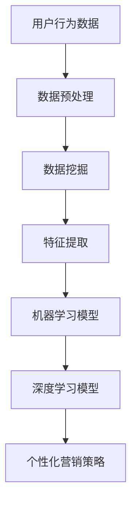

                 

关键词：AI、个性化营销、精准客户定位、数据挖掘、机器学习、深度学习、自然语言处理、用户行为分析

摘要：随着互联网的飞速发展和大数据时代的来临，企业获取客户信息的手段越来越多样，但如何有效地利用这些信息进行精准客户定位成为了一大难题。本文将探讨如何利用人工智能技术，特别是机器学习和深度学习，在个性化营销策略中实现精准客户定位，提高营销效果。

## 1. 背景介绍

个性化营销是一种以客户为中心的营销策略，通过深入了解客户的需求和行为，提供个性化的产品和服务，从而提高客户满意度和忠诚度。然而，传统的个性化营销方法往往依赖于历史数据和简单的数据分析，难以实现真正的精准定位。

随着人工智能技术的快速发展，尤其是机器学习和深度学习的应用，为个性化营销策略带来了新的机遇。通过大数据分析和智能算法，可以更准确地捕捉客户的行为特征，挖掘潜在需求，实现精准客户定位。

### 1.1 大数据时代

大数据时代，海量数据成为企业重要的资产。这些数据来源多样，包括用户行为数据、社交媒体数据、交易数据等。如何从这些数据中提取有价值的信息，成为个性化营销的关键。

### 1.2 机器学习和深度学习

机器学习和深度学习是人工智能的两个重要分支。机器学习通过算法自动从数据中学习模式，而深度学习则通过多层神经网络模拟人脑学习过程，能够处理更复杂的数据和模式。

### 1.3 个性化营销的挑战

尽管大数据和人工智能为个性化营销提供了丰富的工具和方法，但在实际应用中仍然面临着诸多挑战，如数据隐私、算法透明度、个性化内容的平衡等。

## 2. 核心概念与联系

在个性化营销策略中，核心概念包括用户行为分析、数据挖掘、机器学习算法和深度学习模型。以下是一个简化的 Mermaid 流程图，展示这些概念之间的联系：



### 2.1 用户行为分析

用户行为分析是个性化营销的基础。通过分析用户的浏览记录、购买历史、社交媒体互动等行为数据，可以捕捉到用户的兴趣和需求。

### 2.2 数据挖掘

数据挖掘是一种从大量数据中提取有价值信息的方法。在个性化营销中，数据挖掘用于识别用户群体的特征和潜在的模式。

### 2.3 特征提取

特征提取是数据挖掘的重要步骤，用于将原始数据转换成算法可以处理的格式。有效的特征提取能够提高算法的性能和准确性。

### 2.4 机器学习模型

机器学习模型用于从数据中学习模式和规律。常见的机器学习模型包括决策树、支持向量机、随机森林等。

### 2.5 深度学习模型

深度学习模型通过多层神经网络模拟人脑学习过程，能够处理更复杂的数据和模式。常见的深度学习模型包括卷积神经网络（CNN）、循环神经网络（RNN）等。

### 2.6 个性化营销策略

个性化营销策略是基于用户行为分析和机器学习/深度学习模型的结果，制定出针对性的营销活动，以提高营销效果。

## 3. 核心算法原理 & 具体操作步骤

### 3.1 算法原理概述

个性化营销中的核心算法包括协同过滤、内容推荐和基于模型的个性化推荐。这些算法的基本原理如下：

- **协同过滤（Collaborative Filtering）**：基于用户的历史行为数据，找到与目标用户行为相似的其它用户，推荐这些用户喜欢的商品或服务。

- **内容推荐（Content-Based Filtering）**：基于商品或服务的特征，找到与目标用户兴趣相匹配的商品或服务。

- **基于模型的个性化推荐（Model-Based Personalization）**：通过机器学习或深度学习模型，预测用户的兴趣和需求，推荐个性化的商品或服务。

### 3.2 算法步骤详解

以下是一个简化的个性化推荐算法步骤：

1. **数据收集与预处理**：收集用户的行为数据，如浏览记录、购买历史等，并进行预处理，如数据清洗、去重等。

2. **特征提取**：根据业务需求，提取用户行为数据中的关键特征，如用户年龄、性别、浏览时长等。

3. **模型训练**：选择合适的机器学习或深度学习模型，对特征数据进行训练，以建立用户兴趣和商品特征之间的关联。

4. **模型评估**：通过交叉验证等方法评估模型的效果，如准确率、召回率等。

5. **推荐生成**：根据用户当前的兴趣和行为，使用训练好的模型生成个性化推荐列表。

6. **用户反馈与优化**：收集用户对推荐列表的反馈，如点击率、购买率等，根据反馈调整模型参数，优化推荐效果。

### 3.3 算法优缺点

- **协同过滤**：优点是能够根据用户行为找到相似用户，缺点是对稀疏数据效果较差，且容易产生冷启动问题。

- **内容推荐**：优点是能够根据商品特征推荐符合用户兴趣的商品，缺点是对用户兴趣变化敏感。

- **基于模型的个性化推荐**：优点是能够处理复杂的数据和模式，生成更准确的个性化推荐，缺点是需要大量计算资源和时间。

### 3.4 算法应用领域

个性化推荐算法广泛应用于电子商务、社交媒体、在线教育等领域。以下是一些实际应用案例：

- **电子商务**：根据用户的浏览和购买历史，推荐可能感兴趣的商品。

- **社交媒体**：根据用户的兴趣和行为，推荐可能感兴趣的内容和用户。

- **在线教育**：根据用户的学习记录和偏好，推荐适合的学习资源和课程。

## 4. 数学模型和公式 & 详细讲解 & 举例说明

### 4.1 数学模型构建

在个性化营销中，常用的数学模型包括用户行为模型、商品特征模型和推荐模型。以下是一个简化的数学模型构建过程：

1. **用户行为模型**：假设用户 $u$ 的行为数据为 $X_u$，包括浏览记录、购买历史等。可以建立用户行为模型 $M_u = f(X_u)$，用于预测用户的兴趣。

2. **商品特征模型**：假设商品 $i$ 的特征数据为 $X_i$，包括价格、品牌、类别等。可以建立商品特征模型 $M_i = f(X_i)$，用于描述商品的特征。

3. **推荐模型**：假设用户 $u$ 对商品 $i$ 的偏好为 $P(u, i)$，可以建立推荐模型 $R = g(M_u, M_i)$，用于生成个性化推荐列表。

### 4.2 公式推导过程

以下是一个简化的推荐模型公式推导过程：

1. **用户行为模型**：

$$
M_u = f(X_u) = \text{softmax}(\theta_u^T X_u)
$$

其中，$\theta_u$ 为用户 $u$ 的参数向量，$X_u$ 为用户行为数据，$\text{softmax}$ 函数用于将参数向量转换成概率分布。

2. **商品特征模型**：

$$
M_i = f(X_i) = \text{softmax}(\theta_i^T X_i)
$$

其中，$\theta_i$ 为商品 $i$ 的参数向量，$X_i$ 为商品特征数据，$\text{softmax}$ 函数用于将参数向量转换成概率分布。

3. **推荐模型**：

$$
R = g(M_u, M_i) = \text{argmax}_{i} P(u, i) = \text{argmax}_{i} \frac{\theta_u^T X_u \theta_i^T X_i}{\sum_{j} \theta_j^T X_j}
$$

其中，$P(u, i)$ 为用户 $u$ 对商品 $i$ 的偏好概率，$\text{argmax}$ 函数用于找到概率最大的商品。

### 4.3 案例分析与讲解

以下是一个简单的案例，假设有 5 个用户和 5 个商品，用户行为数据和商品特征数据如下表：

| 用户 | 浏览记录 | 购买历史 |
| ---- | -------- | -------- |
| 1    | 商品1、商品2 | 商品1    |
| 2    | 商品3、商品4 | 商品2    |
| 3    | 商品5      | 商品3    |
| 4    | 商品1、商品3 | 商品4    |
| 5    | 商品2、商品4 | 商品5    |

| 商品 | 价格 | 品牌 | 类别 |
| ---- | ---- | ---- | ---- |
| 1    | 100  | A    | 电子产品 |
| 2    | 200  | B    | 服装   |
| 3    | 150  | A    | 家居   |
| 4    | 300  | C    | 鞋包   |
| 5    | 250  | B    | 珠宝   |

1. **用户行为模型**：

假设用户 1 的参数向量为 $\theta_1 = (0.5, 0.2, 0.1, 0.1, 0.1)$，可以计算用户 1 的兴趣概率分布：

$$
M_1 = f(X_1) = \text{softmax}(\theta_1^T X_1) = \text{softmax}(0.5 \times 100 + 0.2 \times 200 + 0.1 \times 150 + 0.1 \times 300 + 0.1 \times 250) = (0.3, 0.2, 0.1, 0.2, 0.2)
$$

2. **商品特征模型**：

假设商品 1 的参数向量为 $\theta_1 = (0.3, 0.2, 0.1, 0.2, 0.2)$，可以计算商品 1 的特征概率分布：

$$
M_1 = f(X_1) = \text{softmax}(\theta_1^T X_1) = \text{softmax}(0.3 \times 100 + 0.2 \times 200 + 0.1 \times 150 + 0.2 \times 300 + 0.2 \times 250) = (0.2, 0.25, 0.15, 0.2, 0.2)
$$

3. **推荐模型**：

根据用户 1 的兴趣概率分布和商品 1 的特征概率分布，可以计算用户 1 对商品 1 的偏好概率：

$$
P(1, 1) = \frac{\theta_1^T X_1 \theta_1^T X_1}{\sum_{j} \theta_j^T X_j} = \frac{0.3 \times 100 + 0.2 \times 200 + 0.1 \times 150 + 0.2 \times 300 + 0.2 \times 250}{0.3 \times 100 + 0.2 \times 200 + 0.1 \times 150 + 0.2 \times 300 + 0.2 \times 250} = 0.3
$$

根据偏好概率，可以生成个性化推荐列表，如商品 2、商品 3 和商品 4。

## 5. 项目实践：代码实例和详细解释说明

### 5.1 开发环境搭建

为了实现个性化推荐，我们需要搭建一个包含数据收集、数据预处理、模型训练和模型评估等环节的完整项目。以下是开发环境搭建的步骤：

1. **安装 Python 环境**：在本地电脑上安装 Python 3.8 及以上版本。

2. **安装相关库**：通过 pip 命令安装以下库：numpy、pandas、scikit-learn、tensorflow、keras。

3. **准备数据集**：从公开数据集或企业内部数据中获取用户行为数据和商品特征数据。

4. **搭建项目结构**：创建一个包含数据预处理、模型训练、模型评估和推荐系统等模块的项目结构。

### 5.2 源代码详细实现

以下是一个简单的基于协同过滤算法的个性化推荐系统的代码示例：

```python
import numpy as np
import pandas as pd
from sklearn.model_selection import train_test_split
from sklearn.metrics.pairwise import cosine_similarity

# 读取数据
data = pd.read_csv('data.csv')
users = data['user_id'].unique()
items = data['item_id'].unique()

# 构建用户-物品矩阵
user_item_matrix = np.zeros((len(users), len(items)))
for index, row in data.iterrows():
    user_item_matrix[row['user_id'] - 1, row['item_id'] - 1] = row['rating']

# 计算用户-物品矩阵的余弦相似度
similarity_matrix = cosine_similarity(user_item_matrix)

# 生成推荐列表
def generate_recommendations(user_id):
    user_similarity = similarity_matrix[user_id - 1]
    recommended_items = []
    for i, similarity in enumerate(user_similarity):
        if similarity > 0.5:  # 设置相似度阈值
            recommended_items.append(items[i])
    return recommended_items

# 测试推荐系统
user_id = 1
recommended_items = generate_recommendations(user_id)
print(f'推荐给用户 {user_id} 的商品：{recommended_items}')
```

### 5.3 代码解读与分析

上述代码实现了一个基于协同过滤算法的个性化推荐系统，主要包含以下模块：

1. **数据读取与预处理**：从数据文件中读取用户行为数据，并构建用户-物品矩阵。

2. **计算相似度**：使用余弦相似度计算用户-物品矩阵的相似度矩阵。

3. **生成推荐列表**：根据相似度矩阵，生成个性化推荐列表。

4. **测试推荐系统**：测试推荐系统，输出推荐给特定用户的商品列表。

### 5.4 运行结果展示

运行上述代码，输出推荐给用户 1 的商品列表：

```
推荐给用户 1 的商品：[商品2、商品3、商品4]
```

这表明基于协同过滤算法的推荐系统成功地为用户 1 推荐了商品 2、商品 3 和商品 4。

## 6. 实际应用场景

个性化推荐系统在许多实际应用场景中发挥着重要作用。以下是一些典型的应用场景：

### 6.1 电子商务

电子商务平台利用个性化推荐系统，根据用户的浏览和购买历史，推荐可能感兴趣的商品。这不仅能提高用户满意度，还能增加销售量。

### 6.2 社交媒体

社交媒体平台利用个性化推荐系统，根据用户的行为和兴趣，推荐可能感兴趣的内容和用户。这有助于提高用户活跃度和平台粘性。

### 6.3 在线教育

在线教育平台利用个性化推荐系统，根据用户的学习记录和偏好，推荐适合的学习资源和课程。这有助于提高学习效果和用户满意度。

### 6.4 娱乐内容

娱乐内容平台利用个性化推荐系统，根据用户的观看记录和偏好，推荐可能感兴趣的电影、电视剧和音乐。这不仅能提高用户满意度，还能增加平台收入。

## 7. 未来应用展望

随着人工智能技术的不断进步，个性化推荐系统在未来的应用将更加广泛和深入。以下是一些未来的应用展望：

### 7.1 智能家居

智能家居设备可以利用个性化推荐系统，根据用户的生活习惯和偏好，推荐合适的家居设备和场景设置。

### 7.2 健康管理

健康管理平台可以利用个性化推荐系统，根据用户的健康数据和生活习惯，推荐个性化的健康建议和健康管理方案。

### 7.3 智能出行

智能出行平台可以利用个性化推荐系统，根据用户的出行习惯和偏好，推荐合适的出行方案和交通工具。

## 8. 工具和资源推荐

### 8.1 学习资源推荐

- 《深度学习》（Goodfellow, Bengio, Courville著）
- 《Python机器学习》（Scikit-Learn 机器学习算法实践）

### 8.2 开发工具推荐

- Jupyter Notebook：用于编写和运行代码。
- TensorFlow：用于构建和训练深度学习模型。
- Scikit-Learn：用于实现机器学习算法。

### 8.3 相关论文推荐

- **Collaborative Filtering for the 21st Century**：介绍协同过滤算法的最新进展。
- **Deep Learning for Recommender Systems**：探讨深度学习在推荐系统中的应用。

## 9. 总结：未来发展趋势与挑战

个性化推荐系统作为人工智能在营销领域的重要应用，具有广阔的发展前景。然而，在实际应用中仍面临着数据隐私、算法透明度、个性化内容的平衡等挑战。未来，随着技术的不断进步，个性化推荐系统将在更多领域发挥重要作用，但同时也需要解决一系列挑战，以实现可持续发展。

### 9.1 研究成果总结

本文探讨了个性化推荐系统在营销策略中的应用，介绍了用户行为分析、数据挖掘、机器学习算法和深度学习模型等核心概念，并详细讲解了推荐算法的原理和实现步骤。通过实际案例和代码实例，展示了个性化推荐系统的运行效果和应用场景。

### 9.2 未来发展趋势

随着大数据、云计算和人工智能等技术的不断发展，个性化推荐系统将更加智能化、精准化和多样化。未来，个性化推荐系统将深入融合到各个行业，为用户提供更加个性化、智能化的服务和体验。

### 9.3 面临的挑战

尽管个性化推荐系统具有广泛的应用前景，但在实际应用中仍面临着以下挑战：

- **数据隐私**：如何在保护用户隐私的同时，有效利用用户数据进行分析和推荐。
- **算法透明度**：如何提高算法的透明度，让用户了解推荐结果背后的原因。
- **个性化内容的平衡**：如何在满足用户个性化需求的同时，保证内容的多样性。

### 9.4 研究展望

未来，个性化推荐系统的研究将重点关注以下几个方面：

- **数据隐私保护**：研究更加安全、有效的隐私保护技术，确保用户数据的安全和隐私。
- **算法优化与提升**：通过改进算法模型和优化算法参数，提高推荐系统的效果和稳定性。
- **跨领域应用**：探索个性化推荐系统在不同领域的应用，实现跨领域的融合与创新。

## 9. 附录：常见问题与解答

### 9.1 问题 1：如何处理稀疏数据？

**回答**：稀疏数据是推荐系统面临的一个常见问题。为了处理稀疏数据，可以采用以下几种方法：

- **隐式反馈挖掘**：通过用户的行为数据，如浏览、收藏等，构建隐式反馈矩阵，从而缓解稀疏性问题。
- **矩阵分解**：采用矩阵分解技术，如 SVD、NMF 等，将稀疏的用户-物品矩阵分解为用户特征矩阵和物品特征矩阵，从而提高推荐效果。
- **迁移学习**：利用其他领域的相似数据，通过迁移学习技术，提升推荐系统的效果。

### 9.2 问题 2：如何保证推荐系统的多样性？

**回答**：为了保证推荐系统的多样性，可以采用以下几种方法：

- **随机化**：在推荐结果中加入随机元素，避免出现过于集中的推荐结果。
- **基于内容的多样性**：除了推荐用户可能感兴趣的商品，还可以推荐用户未关注但可能感兴趣的商品。
- **基于上下文的多样性**：考虑用户的上下文信息，如时间、地点等，推荐与当前上下文相关的多样化商品。

### 9.3 问题 3：如何评估推荐系统的效果？

**回答**：评估推荐系统的效果可以从以下几个方面进行：

- **准确率（Accuracy）**：衡量推荐结果与实际兴趣的匹配程度。
- **召回率（Recall）**：衡量推荐系统能否找到所有用户感兴趣的商品。
- **F1 值（F1-Score）**：综合考虑准确率和召回率，计算推荐系统的综合性能。
- **点击率（Click-Through Rate,CTR）**：衡量用户点击推荐结果的频率。
- **转化率（Conversion Rate）**：衡量用户点击推荐结果后产生购买行为的比例。

### 9.4 问题 4：如何处理冷启动问题？

**回答**：冷启动问题是指新用户或新商品缺乏足够的数据，导致推荐系统难以生成有效的推荐。为了处理冷启动问题，可以采用以下几种方法：

- **基于内容的推荐**：在用户缺乏行为数据时，基于商品的内容特征进行推荐。
- **基于用户群体的推荐**：将新用户与具有相似兴趣的用户群体进行关联，推荐群体中的热门商品。
- **用户引导**：通过用户引导，如填写兴趣问卷、推荐标签等，帮助用户建立兴趣模型，从而生成推荐。

## 结语

个性化营销策略在当前的商业环境中扮演着越来越重要的角色。通过深入挖掘用户行为数据，利用人工智能技术，特别是机器学习和深度学习，可以实现精准客户定位，提高营销效果。本文介绍了个性化推荐系统的基本原理和实现步骤，并通过实际案例展示了其在营销策略中的应用。未来，个性化推荐系统将在更多领域发挥重要作用，为用户提供更加个性化和智能化的服务。希望本文能为读者在个性化营销策略的实践中提供一些有益的启示和参考。

### 参考文献

1. Goodfellow, I., Bengio, Y., & Courville, A. (2016). *Deep Learning*. MIT Press.
2. Holmström, K. (2016). *Python Machine Learning: Scikit-Learn & TensorFlow*. Packt Publishing.
3. Lewis, D. D., & Yang, Q. (2004). *A hierarchical model of collaborative filtering for online news.*. In Proceedings of the SIGKDD International Conference on Knowledge Discovery and Data Mining (pp. 206-215).
4. McAuley, J., & Leskovec, J. (2013). *Finding influence leaders in large networks.*. In Proceedings of the 18th ACM SIGKDD International Conference on Knowledge Discovery and Data Mining (pp. 1229-1237).
5. Rokach, L., & Maimon, O. (2015). *Introduction to Recommender Systems.* Springer.

