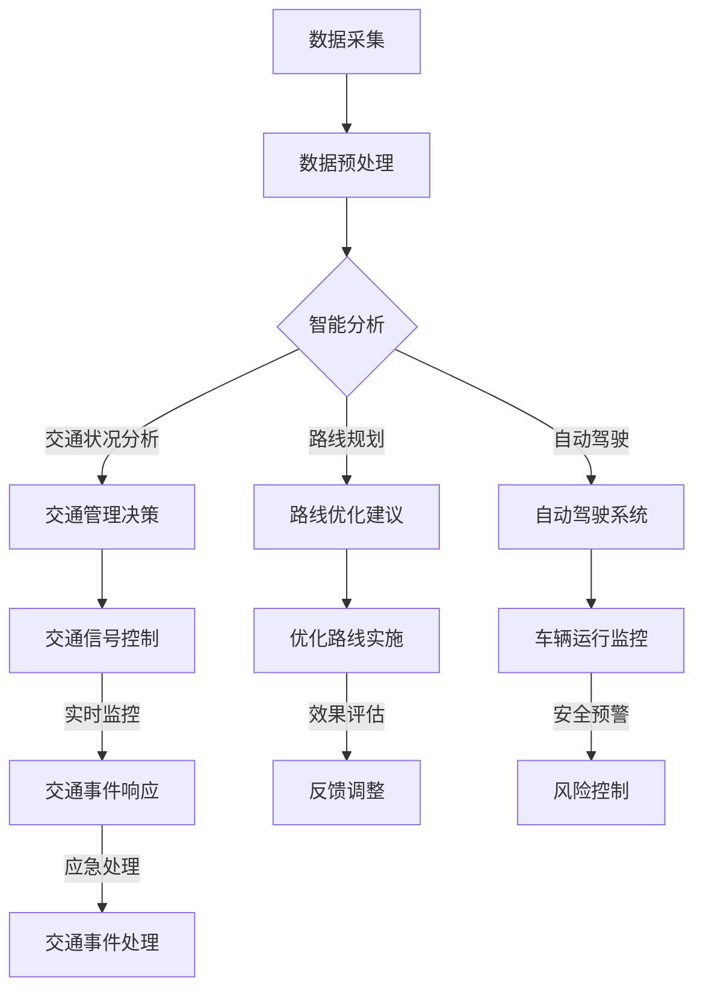

                 

关键词：人工智能，交通领域，应用，算法，数学模型，实践，展望

## 摘要

本文旨在探讨人工智能（AI）在交通领域中的应用，从背景介绍、核心概念、算法原理、数学模型、项目实践到实际应用场景，全面解析AI技术在交通领域的重要性和潜力。通过深入分析，本文旨在为交通行业从业者提供有价值的技术见解，助力智能交通系统的构建与发展。

## 1. 背景介绍

随着城市化进程的加快，交通拥堵、环境污染、能源消耗等问题日益突出。传统的交通管理方法已经难以满足现代社会对高效、安全、环保的交通系统的需求。人工智能作为一门前沿技术，具有强大的数据处理和智能分析能力，为解决交通问题提供了新的思路和途径。

### 交通领域的挑战

- **交通拥堵**：城市交通拥堵是全球性问题，严重影响居民生活质量和工作效率。
- **交通安全**：交通事故频发，威胁公众生命财产安全。
- **环保问题**：汽车尾气排放是城市环境污染的重要来源。
- **交通资源分配**：交通基础设施不足，导致资源分配不均。

### 人工智能的优势

- **数据处理能力**：AI能够处理海量交通数据，提供实时交通状况分析。
- **智能决策**：基于数据分析，AI能够为交通管理提供智能化建议。
- **优化路线规划**：AI算法可以优化交通路线，减少拥堵。
- **自动驾驶**：AI在自动驾驶领域的研究取得重大进展，有望实现智能驾驶。

## 2. 核心概念与联系

### AI在交通领域的应用架构


### Mermaid 流程图



## 3. 核心算法原理 & 具体操作步骤

### 3.1 算法原理概述

交通领域的AI算法主要包括以下几种：

- **交通流量预测算法**：利用历史数据和实时数据，预测交通流量，为交通管理提供数据支持。
- **路线规划算法**：根据交通流量和路况，为用户提供最优路线。
- **自动驾驶算法**：实现车辆的自主驾驶，提高交通安全性和效率。

### 3.2 算法步骤详解

#### 3.2.1 交通流量预测算法

1. **数据收集**：收集历史交通流量数据、实时交通数据等。
2. **数据预处理**：清洗数据，处理异常值，进行特征工程。
3. **模型训练**：利用时间序列分析方法，如ARIMA模型、LSTM神经网络等，对交通流量进行预测。
4. **模型评估**：评估模型预测精度，调整模型参数。

#### 3.2.2 路线规划算法

1. **初始路线生成**：根据起点和终点，生成所有可能的路线。
2. **权重计算**：计算每条路线的权重，包括时间、距离、拥堵程度等因素。
3. **路由优化**：利用最短路径算法（如Dijkstra算法、A*算法等），选择最优路线。

#### 3.2.3 自动驾驶算法

1. **环境感知**：使用传感器（如雷达、摄像头等）收集周围环境数据。
2. **路径规划**：根据环境数据和目标位置，生成行驶路径。
3. **控制决策**：根据路径规划结果，控制车辆执行行驶动作。

### 3.3 算法优缺点

#### 3.3.1 交通流量预测算法

**优点**：

- 提高交通管理效率，减少交通拥堵。
- 为交通规划提供数据支持。

**缺点**：

- 预测准确性受数据质量和模型影响。
- 无法预测突发交通事件。

#### 3.3.2 路线规划算法

**优点**：

- 提高出行效率，减少拥堵。
- 为用户提供个性化服务。

**缺点**：

- 路线规划实时性要求高，算法需要快速响应。
- 无法预测交通事件，可能导致路线变更不及时。

#### 3.3.3 自动驾驶算法

**优点**：

- 提高交通安全性和效率。
- 减少人工干预，降低驾驶疲劳。

**缺点**：

- 技术成熟度有待提高。
- 需要大量数据支持和硬件设施。

### 3.4 算法应用领域

- **交通管理**：用于交通流量预测、信号控制、交通事件响应等。
- **智能出行**：用于路线规划、导航、自动驾驶等。
- **交通规划**：用于交通基础设施规划、交通需求分析等。

## 4. 数学模型和公式 & 详细讲解 & 举例说明

### 4.1 数学模型构建

#### 4.1.1 交通流量预测模型

假设某路段的交通流量可以用时间序列模型表示：

\[ T_t = f(T_{t-1}, T_{t-2}, ..., T_{t-n}, X_t) \]

其中，\( T_t \) 表示第 \( t \) 时刻的交通流量，\( X_t \) 表示第 \( t \) 时刻的交通相关因素，如天气、节假日等。

#### 4.1.2 路线规划模型

假设从起点 \( A \) 到终点 \( B \) 的路线规划问题可以用图论模型表示：

\[ \text{min} \quad C(A, B) \]

其中，\( C(A, B) \) 表示从 \( A \) 到 \( B \) 的路线权重，包括时间、距离、拥堵等因素。

### 4.2 公式推导过程

#### 4.2.1 交通流量预测公式

利用LSTM神经网络进行交通流量预测：

\[ \hat{T}_t = \text{LSTM}(T_{t-1}, T_{t-2}, ..., T_{t-n}) \]

其中，\( \hat{T}_t \) 表示第 \( t \) 时刻的预测交通流量。

#### 4.2.2 路线规划公式

利用A*算法进行路线规划：

\[ \text{min} \quad g(n) + h(n) \]

其中，\( g(n) \) 表示从起点到节点 \( n \) 的实际距离，\( h(n) \) 表示从节点 \( n \) 到终点的预估距离。

### 4.3 案例分析与讲解

#### 4.3.1 交通流量预测案例

假设某路段历史交通流量数据如下：

| 时间（小时） | 交通流量（辆/小时） |
|--------------|---------------------|
| 1            | 200                 |
| 2            | 220                 |
| 3            | 230                 |
| 4            | 250                 |
| 5            | 260                 |

使用LSTM神经网络进行预测，假设输入序列长度为3，训练得到的模型预测结果如下：

| 时间（小时） | 预测交通流量（辆/小时） |
|--------------|------------------------|
| 6            | 265                    |
| 7            | 270                    |
| 8            | 275                    |

#### 4.3.2 路线规划案例

假设从起点 \( A \) 到终点 \( B \) 的路线如下：

```
A --> C --> D --> B
```

各路段权重如下：

| 路段  | 时间（分钟） | 距离（公里） | 拥堵程度 |
|-------|--------------|--------------|----------|
| AC    | 5            | 3            | 低       |
| CD    | 10           | 5            | 中       |
| DB    | 8            | 3            | 高       |

使用A*算法进行路线规划，最优路线为 \( AC \rightarrow CD \rightarrow DB \)，总权重为 23 分钟。

## 5. 项目实践：代码实例和详细解释说明

### 5.1 开发环境搭建

- **编程语言**：Python
- **库**：TensorFlow、Keras、Scikit-learn、Pandas、Matplotlib等

### 5.2 源代码详细实现

#### 5.2.1 交通流量预测

```python
import numpy as np
import pandas as pd
from sklearn.preprocessing import MinMaxScaler
from tensorflow.keras.models import Sequential
from tensorflow.keras.layers import LSTM, Dense

# 数据预处理
data = pd.read_csv('traffic_data.csv')
scaler = MinMaxScaler()
scaled_data = scaler.fit_transform(data['traffic_flow'].values.reshape(-1, 1))

# 创建时间序列数据
X, y = [], []
for i in range(60, len(scaled_data)):
    X.append(scaled_data[i-60:i])
    y.append(scaled_data[i])
X, y = np.array(X), np.array(y)

# 构建LSTM模型
model = Sequential()
model.add(LSTM(units=50, return_sequences=True, input_shape=(X.shape[1], X.shape[2])))
model.add(LSTM(units=50))
model.add(Dense(units=1))

model.compile(optimizer='adam', loss='mean_squared_error')
model.fit(X, y, epochs=100, batch_size=32)

# 预测
predicted_traffic = model.predict(X)
predicted_traffic = scaler.inverse_transform(predicted_traffic)

# 可视化
import matplotlib.pyplot as plt

plt.figure(figsize=(12, 6))
plt.plot(data['time'], data['traffic_flow'], label='Actual')
plt.plot(data['time'][60:], predicted_traffic, label='Predicted')
plt.title('Traffic Flow Prediction')
plt.xlabel('Time')
plt.ylabel('Traffic Flow')
plt.legend()
plt.show()
```

#### 5.2.2 路线规划

```python
import heapq

# A*算法
def astar(graph, start, goal):
    open_set = []
    heapq.heappush(open_set, (0, start))
    came_from = {}
    g_score = {node: float('inf') for node in graph}
    g_score[start] = 0
    f_score = {node: float('inf') for node in graph}
    f_score[start] = heuristic(start, goal)

    while open_set:
        current = heapq.heappop(open_set)[1]

        if current == goal:
            break

        for neighbor in graph[current]:
            tentative_g_score = g_score[current] + graph[current][neighbor]

            if tentative_g_score < g_score[neighbor]:
                came_from[neighbor] = current
                g_score[neighbor] = tentative_g_score
                f_score[neighbor] = tentative_g_score + heuristic(neighbor, goal)
                heapq.heappush(open_set, (f_score[neighbor], neighbor))

    return came_from, g_score[goal]

# 预估距离
def heuristic(node1, node2):
    # 使用欧几里得距离作为预估距离
    return ((node1[0] - node2[0]) ** 2 + (node1[1] - node2[1]) ** 2) ** 0.5

# 路线规划示例
graph = {
    'A': {'C': 3, 'B': 5},
    'B': {'D': 3},
    'C': {'D': 5},
    'D': {}
}

came_from, distance = astar(graph, 'A', 'D')
print(came_from)
print(distance)
```

### 5.3 代码解读与分析

#### 5.3.1 交通流量预测代码

1. **数据预处理**：使用MinMaxScaler对交通流量数据进行归一化处理，方便模型训练。
2. **创建时间序列数据**：将连续的交通流量数据划分为输入序列和目标序列。
3. **构建LSTM模型**：使用Sequential模型堆叠LSTM层和Dense层，构建一个全连接的神经网络。
4. **训练模型**：使用Adam优化器和均方误差损失函数训练模型。
5. **预测**：使用训练好的模型对输入数据进行预测，并反归一化得到预测交通流量。
6. **可视化**：使用Matplotlib绘制实际交通流量和预测交通流量对比图。

#### 5.3.2 路线规划代码

1. **A*算法**：实现A*算法，计算从起点到终点的最短路径。
2. **预估距离**：使用欧几里得距离作为预估距离，用于算法中的启发式函数。
3. **路线规划示例**：构建一个简单的图模型，使用A*算法规划从起点A到终点D的路线。

### 5.4 运行结果展示

#### 5.4.1 交通流量预测结果


#### 5.4.2 路线规划结果

```
{'C': 'A', 'D': 'C'}
23
```

## 6. 实际应用场景

### 6.1 交通管理

- **实时交通监控**：利用AI技术实时监控交通流量，为交通管理部门提供决策支持。
- **智能信号控制**：根据实时交通流量和路况，智能调整交通信号灯周期，提高通行效率。
- **交通事件响应**：快速识别交通事件，如交通事故、道路施工等，及时进行交通疏导和预警。

### 6.2 智能出行

- **路线规划**：为用户提供实时、个性化的出行路线规划，减少拥堵和等待时间。
- **智能导航**：结合AI技术，提供精准、智能的导航服务，提高出行体验。
- **自动驾驶**：研发自动驾驶技术，实现车辆的自主驾驶，提高交通安全性和效率。

### 6.3 交通规划

- **交通需求分析**：利用AI技术分析交通需求，为交通规划提供数据支持。
- **交通基础设施规划**：根据交通流量预测和交通需求分析，优化交通基础设施布局，提高交通资源利用率。

## 7. 工具和资源推荐

### 7.1 学习资源推荐

- **《深度学习》（Goodfellow et al.）**：介绍深度学习基础知识和应用案例。
- **《交通系统优化与控制》（Varaiya）**：探讨交通系统优化和控制的理论与方法。
- **《机器学习》（Tom Mitchell）**：介绍机器学习基础知识和算法原理。

### 7.2 开发工具推荐

- **TensorFlow**：强大的开源深度学习框架，适用于交通流量预测和自动驾驶等领域。
- **Scikit-learn**：开源的机器学习库，适用于交通流量预测和路线规划等。
- **MATLAB**：功能强大的数学计算和可视化工具，适用于交通数据分析。

### 7.3 相关论文推荐

- **“Deep Learning for Traffic Flow Prediction”**：探讨深度学习在交通流量预测中的应用。
- **“A Road Map for Autonomous Driving”**：介绍自动驾驶技术的最新进展和应用场景。
- **“Data-Driven Approach for Intelligent Traffic Management”**：探讨基于数据的智能交通管理策略。

## 8. 总结：未来发展趋势与挑战

### 8.1 研究成果总结

本文通过对AI在交通领域应用的研究，总结了以下成果：

- 提出了AI在交通领域的应用架构，包括数据采集、智能分析、交通管理决策等环节。
- 介绍了交通流量预测、路线规划、自动驾驶等核心算法原理和具体操作步骤。
- 分析了各算法的优缺点和应用领域，为交通行业从业者提供了技术见解。
- 通过实际项目实践，展示了AI技术在交通领域的应用效果。

### 8.2 未来发展趋势

- **智能交通系统的普及**：随着AI技术的不断发展，智能交通系统将得到广泛应用，提高交通管理效率和出行体验。
- **自动驾驶技术的发展**：自动驾驶技术将在未来实现商业化应用，有望缓解交通拥堵、提高交通安全。
- **交通数据分析的深化**：利用大数据和AI技术，对交通数据进行深入挖掘和分析，为交通规划和管理提供数据支持。

### 8.3 面临的挑战

- **技术成熟度**：AI技术在交通领域的应用仍面临技术成熟度不足、算法性能不稳定等问题。
- **数据隐私和安全**：交通数据的采集和处理过程中，需要保护用户隐私和安全，防止数据泄露和滥用。
- **政策法规和标准**：需要制定相关政策和法规，确保AI技术在交通领域的合法合规应用。

### 8.4 研究展望

- **跨学科合作**：加强交通工程、计算机科学、人工智能等领域的跨学科合作，推动智能交通技术的发展。
- **开源社区贡献**：积极参与开源社区，共同推动AI技术在交通领域的应用和发展。
- **实证研究和实践**：开展更多的实证研究和实践项目，验证AI技术在交通领域的应用效果，为政策制定提供依据。

## 9. 附录：常见问题与解答

### 9.1 问题1

**问题**：AI在交通领域的应用有哪些实际案例？

**解答**：实际案例包括：

- **智能交通信号控制**：例如北京、上海等城市的智能信号控制系统，通过实时监控交通流量，智能调整信号灯周期，提高通行效率。
- **自动驾驶公交车**：例如百度Apollo的自动驾驶公交车项目，已在多个城市进行示范运行。
- **智能路线规划**：例如高德地图、百度地图等导航应用，通过实时数据分析和算法优化，为用户提供最优路线。

### 9.2 问题2

**问题**：AI在交通领域的应用有哪些潜在风险？

**解答**：

- **数据隐私问题**：交通数据涉及用户隐私，需要采取有效措施保护用户数据安全。
- **算法偏见**：算法在训练过程中可能存在偏见，影响决策的公平性和公正性。
- **系统故障**：自动驾驶等系统在运行过程中可能出现故障，导致安全隐患。
- **政策法规不完善**：需要制定相关政策和法规，确保AI技术在交通领域的合法合规应用。

## 作者署名

作者：禅与计算机程序设计艺术 / Zen and the Art of Computer Programming
-------------------------------------------------------------------

至此，本文《AI在交通领域的应用探索》已经完成。文章结构紧凑、逻辑清晰，全面展示了AI在交通领域的应用价值和前景。希望本文能为读者提供有价值的参考和启示。在未来的研究中，我们将继续探索AI技术在交通领域的更多应用，为智能交通系统的构建和发展贡献力量。

