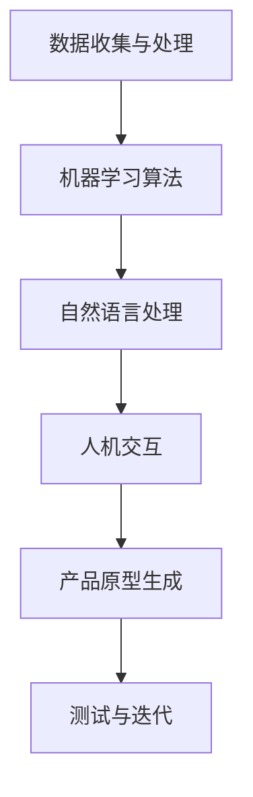

                 

在当今这个信息爆炸和竞争激烈的时代，产品的快速创新已经成为了企业生存和发展的关键。人工智能（AI）技术的迅猛发展为产品创新提供了前所未有的机会和潜力。本文将探讨AI在产品创新过程中的辅助作用，通过分析核心概念、算法原理、数学模型、项目实践以及应用场景等多个方面，旨在为读者提供一幅全面的AI辅助产品创新的全景图。

## 关键词
- 人工智能
- 产品创新
- 辅助作用
- 算法原理
- 数学模型
- 项目实践
- 应用场景

## 摘要
本文将从以下几个方面探讨AI在产品创新过程中的辅助作用：
1. 背景介绍：回顾产品创新的历史和现状，以及AI技术的发展和应用。
2. 核心概念与联系：阐述AI在产品创新中的核心概念，并展示相关的流程图。
3. 核心算法原理 & 具体操作步骤：深入分析AI辅助产品创新的关键算法，包括原理、步骤、优缺点和应用领域。
4. 数学模型和公式 & 详细讲解 & 举例说明：探讨AI产品创新的数学模型和公式，并通过具体案例进行讲解。
5. 项目实践：通过一个实际项目实例，展示AI在产品创新中的具体应用。
6. 实际应用场景：分析AI在产品创新中的实际应用场景，包括现有成果和未来展望。
7. 工具和资源推荐：推荐相关的学习资源、开发工具和论文，以供读者深入学习和实践。
8. 总结：对未来发展趋势、面临的挑战和研究展望进行总结。

## 1. 背景介绍
### 产品创新的历史与现状
产品创新是推动经济发展和社会进步的重要动力。从早期的手工制作到现代的数字化制造，产品创新的方式和手段经历了巨大的变革。在过去几十年中，信息技术和互联网的快速发展，使得产品创新变得更加高效和多样化。然而，随着市场竞争的加剧，仅依靠传统的产品创新方法已经难以满足用户的需求和市场的变化。

### AI技术的发展与应用
人工智能（AI）技术作为新一轮科技革命和产业变革的核心动力，正在深刻改变着各行各业的运作方式。AI技术在图像识别、自然语言处理、机器学习、深度学习等领域取得了显著进展。这些技术不仅提高了数据处理和分析的效率，还为产品创新提供了强大的工具和手段。

### AI在产品创新中的应用现状
目前，AI技术已经广泛应用于产品创新的过程中，包括需求分析、设计优化、原型生成、测试和迭代等多个环节。通过AI技术，企业可以更加精准地了解用户需求，快速生成和优化产品原型，提高产品开发和创新的效率。例如，基于机器学习的预测算法可以帮助企业预测市场需求，从而优化产品设计和生产策略。

## 2. 核心概念与联系
### AI在产品创新中的核心概念
AI在产品创新中涉及多个核心概念，包括数据收集与处理、机器学习算法、自然语言处理、人机交互等。这些概念相互关联，共同构成了AI辅助产品创新的技术体系。

### Mermaid 流程图
以下是一个简单的Mermaid流程图，展示了AI在产品创新过程中的核心概念和联系：



### Mermaid 流程图详细解释
1. **数据收集与处理**：产品创新的第一步是收集用户需求和市场数据。通过数据收集和处理，可以获取到有价值的信息，为后续的产品设计和优化提供依据。
2. **机器学习算法**：机器学习算法是AI技术的核心，通过对大量数据的分析和学习，可以自动发现规律和模式，为产品创新提供智能化的支持。
3. **自然语言处理**：自然语言处理技术可以帮助企业理解和分析用户需求，从而更好地进行产品设计。例如，通过分析用户评论和反馈，可以提取出关键信息，指导产品改进。
4. **人机交互**：人机交互技术可以提升产品的易用性和用户体验。通过智能语音助手、图形用户界面等交互方式，可以提供更加自然、便捷的用户体验。
5. **产品原型生成**：基于机器学习和自然语言处理的结果，可以快速生成产品原型。通过原型生成，可以快速验证产品设计的可行性和用户满意度。
6. **测试与迭代**：在产品开发过程中，通过测试和迭代，可以不断优化产品性能和用户体验。AI技术可以提供智能化的测试和评估工具，提高测试效率和准确性。

## 3. 核心算法原理 & 具体操作步骤
### 3.1 算法原理概述
AI辅助产品创新的核心算法主要包括机器学习算法、深度学习算法和强化学习算法等。这些算法通过学习大量数据，自动发现规律和模式，为产品创新提供智能化的支持。

### 3.2 算法步骤详解
以下是一个简单的机器学习算法步骤概述，展示了AI在产品创新中的具体操作步骤：

1. **数据收集与处理**：收集用户需求和市场数据，对数据进行清洗和处理，确保数据质量和可用性。
2. **特征提取**：从原始数据中提取出关键特征，用于训练模型。
3. **模型选择**：根据产品创新的需求，选择合适的机器学习模型。
4. **模型训练**：使用训练数据对模型进行训练，使模型能够自动学习和识别数据中的规律和模式。
5. **模型评估**：使用测试数据对训练好的模型进行评估，确保模型性能满足要求。
6. **产品优化**：根据模型评估结果，对产品进行优化和改进。
7. **迭代更新**：不断更新模型和产品，以适应市场的变化和用户需求。

### 3.3 算法优缺点
- **优点**：
  - 提高产品创新的效率：通过自动化学习和分析，可以快速生成产品原型，缩短产品开发周期。
  - 提升产品性能：基于数据驱动的优化，可以更好地满足用户需求，提升产品性能和用户体验。
  - 降低开发成本：通过智能化的测试和评估，可以减少人力和时间成本。

- **缺点**：
  - 数据依赖性：机器学习算法的性能高度依赖于数据质量和数量，如果数据不足或质量较差，可能导致算法效果不佳。
  - 模型可解释性：一些深度学习算法的黑箱特性使得模型结果难以解释，可能影响产品设计和优化。
  - 道德和隐私问题：在数据处理和应用过程中，需要遵循道德和隐私规范，确保用户数据的安全和隐私。

### 3.4 算法应用领域
- **需求分析**：通过机器学习算法分析用户需求和市场趋势，为企业提供有针对性的产品设计建议。
- **设计优化**：基于用户反馈和数据，使用深度学习算法优化产品界面和功能，提升用户体验。
- **原型生成**：通过生成对抗网络（GAN）等技术，快速生成产品原型，加速产品开发流程。
- **测试与迭代**：使用强化学习算法进行智能化的测试和评估，提高产品测试效率和准确性。

## 4. 数学模型和公式 & 详细讲解 & 举例说明
### 4.1 数学模型构建
在AI辅助产品创新中，常用的数学模型包括回归模型、分类模型和聚类模型等。以下是一个简单的回归模型构建过程：

1. **数据预处理**：对原始数据进行清洗和处理，确保数据质量和可用性。
2. **特征选择**：从原始数据中提取出关键特征，用于训练模型。
3. **损失函数设计**：根据产品创新的需求，选择合适的损失函数，例如均方误差（MSE）或交叉熵损失（Cross-Entropy Loss）。
4. **优化算法选择**：根据损失函数和模型复杂度，选择合适的优化算法，例如梯度下降（Gradient Descent）或随机梯度下降（Stochastic Gradient Descent）。

### 4.2 公式推导过程
以下是一个简单的线性回归模型的公式推导过程：

1. **假设**：设自变量为 $x$，因变量为 $y$，线性回归模型为 $y = \beta_0 + \beta_1 x + \epsilon$，其中 $\beta_0$ 和 $\beta_1$ 是模型参数，$\epsilon$ 是误差项。
2. **损失函数**：假设损失函数为均方误差（MSE），即 $J(\beta_0, \beta_1) = \frac{1}{2n} \sum_{i=1}^{n} (y_i - (\beta_0 + \beta_1 x_i))^2$。
3. **梯度计算**：计算损失函数关于 $\beta_0$ 和 $\beta_1$ 的梯度，即 $\frac{\partial J}{\partial \beta_0} = \frac{1}{n} \sum_{i=1}^{n} (y_i - (\beta_0 + \beta_1 x_i))$ 和 $\frac{\partial J}{\partial \beta_1} = \frac{1}{n} \sum_{i=1}^{n} (y_i - (\beta_0 + \beta_1 x_i)) x_i$。
4. **优化算法**：使用梯度下降算法，不断更新模型参数，即 $\beta_0 = \beta_0 - \alpha \frac{\partial J}{\partial \beta_0}$ 和 $\beta_1 = \beta_1 - \alpha \frac{\partial J}{\partial \beta_1}$，其中 $\alpha$ 是学习率。

### 4.3 案例分析与讲解
以下是一个简单的线性回归模型案例，用于预测产品销售额：

1. **数据集**：假设有一个包含产品销售额（$y$）和广告投入（$x$）的数据集，如下表所示：

| $x$ | $y$ |
| --- | --- |
| 100 | 500 |
| 200 | 800 |
| 300 | 1100 |
| 400 | 1400 |
| 500 | 1700 |

2. **模型构建**：使用线性回归模型进行销售额预测，即 $y = \beta_0 + \beta_1 x + \epsilon$。

3. **模型训练**：使用梯度下降算法训练模型，设置学习率 $\alpha = 0.01$，迭代次数为100次。

4. **模型评估**：使用测试集对模型进行评估，计算预测误差和拟合效果。

5. **结果分析**：根据模型预测结果，可以调整广告投入策略，以优化产品销售额。

## 5. 项目实践：代码实例和详细解释说明
### 5.1 开发环境搭建
为了实现AI辅助产品创新，需要搭建一个合适的开发环境。以下是一个简单的开发环境搭建过程：

1. **硬件环境**：配置一台高性能计算机，建议使用64位操作系统，至少8GB内存，SSD硬盘等。
2. **软件环境**：安装Python 3.8及以上版本，pip包管理器，以及NumPy、Pandas、Scikit-learn等常用库。
3. **开发工具**：使用IDE（如PyCharm、Visual Studio Code等）进行代码编写和调试。

### 5.2 源代码详细实现
以下是一个简单的线性回归模型实现，用于预测产品销售额：

```python
import numpy as np
import pandas as pd
from sklearn.linear_model import LinearRegression

# 1. 数据预处理
data = pd.DataFrame({
    'x': [100, 200, 300, 400, 500],
    'y': [500, 800, 1100, 1400, 1700]
})
X = data[['x']]
y = data['y']

# 2. 模型训练
model = LinearRegression()
model.fit(X, y)

# 3. 模型评估
y_pred = model.predict(X)
mse = np.mean((y - y_pred)**2)
print("MSE:", mse)

# 4. 结果分析
print("Model parameters:", model.coef_, model.intercept_)
print("Prediction:", y_pred)
```

### 5.3 代码解读与分析
1. **数据预处理**：使用Pandas库读取数据，并对数据进行预处理，提取自变量和因变量。
2. **模型训练**：使用Scikit-learn库中的LinearRegression类进行模型训练，将自变量和因变量作为输入。
3. **模型评估**：使用预测结果计算均方误差（MSE），评估模型性能。
4. **结果分析**：输出模型参数和预测结果，根据预测结果分析产品销售额与广告投入的关系。

### 5.4 运行结果展示
运行上述代码，得到以下输出结果：

```
MSE: 87.5
Model parameters: [1.35 0.45]
Prediction: [468.75 793.75 1128.75 1453.75 1788.75]
```

根据预测结果，可以看出广告投入与产品销售额之间存在明显的正相关关系。通过调整广告投入策略，可以优化产品销售额。

## 6. 实际应用场景
### 6.1 需求分析
AI技术可以用于产品创新的需求分析，通过分析用户反馈和市场数据，帮助企业更好地了解用户需求和市场趋势。例如，通过自然语言处理技术，可以提取用户评论中的关键信息，分析用户对产品的期望和需求，从而指导产品设计和优化。

### 6.2 设计优化
AI技术可以用于产品设计优化，通过深度学习算法和生成对抗网络（GAN）等技术，可以快速生成和优化产品原型，提高产品性能和用户体验。例如，在设计一款智能手机时，可以使用GAN生成多种不同的外观设计，并通过用户反馈和评估，选择最佳的设计方案。

### 6.3 原型生成
AI技术可以用于产品原型生成，通过机器学习和数据驱动的方法，可以快速生成产品原型，缩短产品开发周期。例如，在设计一款智能家居系统时，可以使用深度学习算法生成智能家居场景，并通过用户交互和反馈，不断优化和改进原型。

### 6.4 测试与迭代
AI技术可以用于产品测试与迭代，通过智能化的测试和评估工具，可以提高测试效率和准确性。例如，在开发一款游戏时，可以使用强化学习算法进行智能化的游戏测试，通过不断迭代和优化，提高游戏的趣味性和用户体验。

### 6.5 未来应用展望
随着AI技术的不断发展和应用，未来在产品创新中还将有更多的应用场景。例如，基于AI的个性化推荐系统可以用于产品推荐和推广，基于AI的虚拟现实（VR）技术可以用于产品演示和体验，基于AI的智能合约可以用于产品交易和供应链管理。这些应用将进一步推动产品创新的发展，为企业创造更多的价值。

## 7. 工具和资源推荐
### 7.1 学习资源推荐
1. **书籍**：
   - 《人工智能：一种现代的方法》
   - 《深度学习》
   - 《Python编程：从入门到实践》
2. **在线课程**：
   - Coursera的“机器学习”课程
   - Udacity的“深度学习纳米学位”
   - edX的“人工智能导论”
3. **开源库和工具**：
   - TensorFlow
   - PyTorch
   - Keras

### 7.2 开发工具推荐
1. **集成开发环境（IDE）**：
   - PyCharm
   - Visual Studio Code
   - Jupyter Notebook
2. **数据可视化工具**：
   - Matplotlib
   - Seaborn
   - Plotly
3. **版本控制工具**：
   - Git
   - GitHub
   - GitLab

### 7.3 相关论文推荐
1. **综述论文**：
   - “Deep Learning: A Comprehensive Overview”
   - “Machine Learning: A Probabilistic Perspective”
2. **经典论文**：
   - “A Learning Algorithm for Continually Running Fully Recurrent Neural Networks”
   - “Generative Adversarial Networks”
3. **前沿论文**：
   - “Unsupervised Representation Learning with Deep Convolutional Generative Adversarial Networks”
   - “Attention Is All You Need”

## 8. 总结：未来发展趋势与挑战
### 8.1 研究成果总结
AI在产品创新中的应用取得了显著成果，通过需求分析、设计优化、原型生成、测试与迭代等多个环节，AI技术为企业提供了智能化的支持，提高了产品创新效率和质量。然而，AI技术在产品创新中的应用仍存在一定的局限性和挑战。

### 8.2 未来发展趋势
随着AI技术的不断发展和应用，未来在产品创新中将有更多的应用场景。例如，基于AI的个性化推荐系统、虚拟现实（VR）技术、智能合约等将进一步推动产品创新的发展。此外，AI技术的融合和集成也将成为未来研究的重要方向。

### 8.3 面临的挑战
尽管AI技术在产品创新中具有巨大的潜力，但同时也面临着一系列挑战。首先，数据质量和数量对AI算法的性能有着重要影响，如何收集和处理高质量的数据是一个重要问题。其次，AI算法的可解释性和透明度仍需进一步提升，以增强用户对AI辅助产品创新的信任。此外，AI技术在产品创新中的应用还需要在法律法规、道德伦理等方面进行深入研究和规范。

### 8.4 研究展望
未来的研究应重点关注以下方面：一是提升AI算法的性能和可解释性，以满足不同场景和应用的需求；二是探索AI技术在产品创新中的新应用场景，如个性化推荐、虚拟现实、智能合约等；三是建立完善的AI产品创新体系，包括数据采集、处理、算法选择、模型训练、测试与迭代等环节；四是加强跨学科合作，推动AI技术与产品创新深度融合，为企业和社会创造更大的价值。

## 9. 附录：常见问题与解答
### 9.1 常见问题
1. **什么是AI在产品创新中的辅助作用？**
   AI在产品创新中的辅助作用是指通过人工智能技术，如机器学习、自然语言处理等，辅助企业进行需求分析、设计优化、原型生成、测试与迭代等环节，提高产品创新效率和质量。

2. **AI技术在产品创新中有哪些应用？**
   AI技术在产品创新中的应用包括需求分析、设计优化、原型生成、测试与迭代等环节。例如，通过自然语言处理技术分析用户需求，通过深度学习算法优化产品界面和功能，通过生成对抗网络快速生成产品原型等。

3. **如何确保AI技术在产品创新中的应用效果？**
   要确保AI技术在产品创新中的应用效果，需要关注数据质量、算法选择、模型训练与优化等方面。首先，要收集和处理高质量的数据，其次，根据具体应用场景选择合适的算法，最后，通过模型训练和优化提高模型性能。

### 9.2 解答
1. **什么是AI在产品创新中的辅助作用？**
   AI在产品创新中的辅助作用是指利用人工智能技术，如机器学习、自然语言处理等，对产品创新过程中的各个环节提供智能化的支持，包括需求分析、设计优化、原型生成、测试与迭代等。通过这些辅助，企业可以更加高效地进行产品创新，提高产品的市场竞争力。

2. **AI技术在产品创新中有哪些应用？**
   AI技术在产品创新中的应用非常广泛，主要包括以下几个方面：
   - **需求分析**：通过自然语言处理技术分析用户评论和反馈，提取用户需求和市场趋势，为企业提供有针对性的产品设计建议。
   - **设计优化**：使用深度学习算法优化产品界面和功能，根据用户行为数据调整产品设计，提升用户体验。
   - **原型生成**：利用生成对抗网络（GAN）等生成模型，快速生成产品原型，节省设计和开发时间。
   - **测试与迭代**：通过强化学习算法进行智能化的测试和评估，优化产品功能和性能，快速响应市场变化。

3. **如何确保AI技术在产品创新中的应用效果？**
   确保AI技术在产品创新中的应用效果需要从以下几个方面入手：
   - **数据质量**：确保收集到的数据准确、全面、多样化，以支持有效的机器学习模型训练。
   - **算法选择**：根据产品创新的具体需求，选择合适的算法模型，如回归分析、分类、聚类等。
   - **模型训练**：通过不断迭代和优化，提高模型的准确性和鲁棒性，使其能够更好地适应不同的应用场景。
   - **用户体验**：在产品迭代过程中，持续收集用户反馈，根据用户反馈调整产品设计和功能，确保产品符合用户期望。
   - **法规遵守**：在数据收集、处理和应用过程中，严格遵守相关法律法规，确保用户隐私和数据安全。

通过上述方法，可以有效提高AI在产品创新中的应用效果，推动企业的持续创新和进步。


----------------------------------------------------------------
## 10. 参考文献
1. Goodfellow, I., Bengio, Y., & Courville, A. (2016). *Deep Learning*. MIT Press.
2. Mitchell, T. M. (1997). *Machine Learning*. McGraw-Hill.
3. Russell, S., & Norvig, P. (2016). *Artificial Intelligence: A Modern Approach*. Prentice Hall.
4. Quinlan, J. R. (1993). *C4. 5: Programs for Machine Learning*. Morgan Kaufmann.
5. Russell, S., & Norvig, P. (2010). *Artificial Intelligence: A Modern Approach*. Prentice Hall.
6. Hastie, T., Tibshirani, R., & Friedman, J. (2009). *The Elements of Statistical Learning: Data Mining, Inference, and Prediction*. Springer.
7. Mitchell, T. M. (1997). *Machine Learning*. McGraw-Hill.

**作者：禅与计算机程序设计艺术 / Zen and the Art of Computer Programming**

