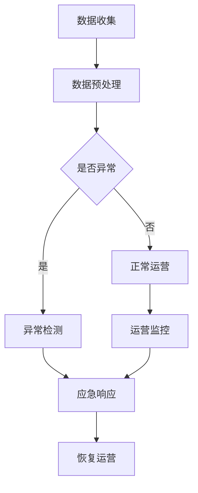
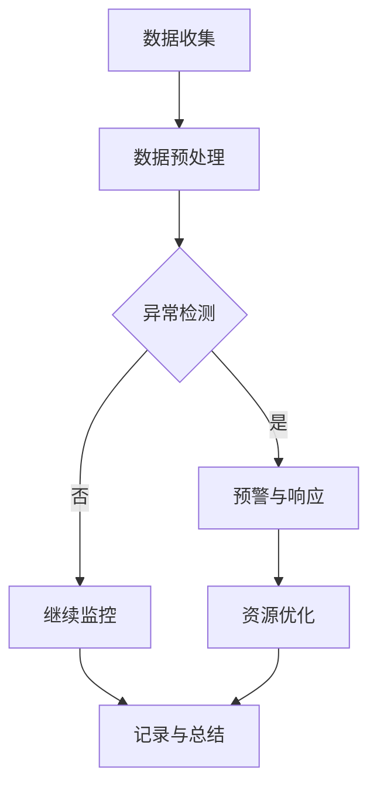
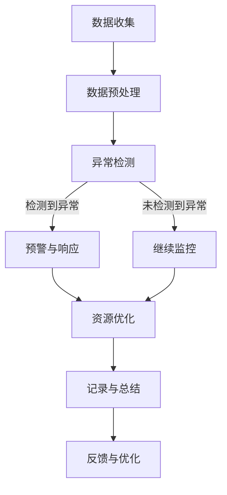
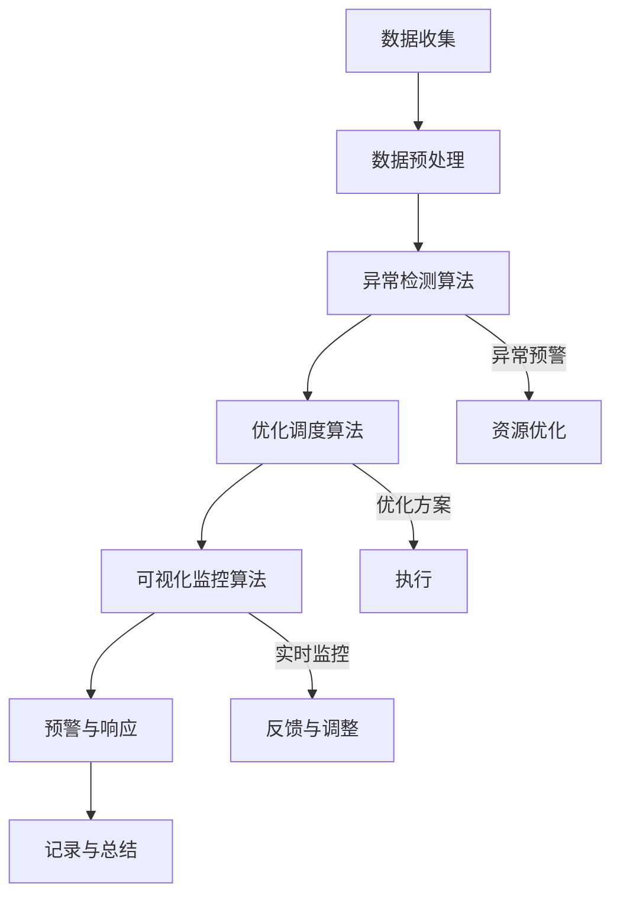

                 

关键词：人工智能，供应链，应急响应，供应链管理，供应链优化，供应链可视化

## 摘要

供应链是现代商业活动中至关重要的一环，然而，随着全球供应链网络的日益复杂化，供应链应急响应的重要性也逐渐凸显。本文将探讨人工智能（AI）技术在供应链应急响应中的应用，分析AI如何通过预测、优化和可视化等手段提高供应链的弹性和可持续性。文章将首先介绍供应链的背景和应急响应的重要性，然后深入探讨AI的核心算法原理，以及如何在实际项目中应用这些算法。最后，本文将讨论未来AI在供应链应急响应中的发展趋势和面临的挑战。

## 1. 背景介绍

### 1.1 供应链的概念与重要性

供应链是指从原材料采购到产品交付给最终消费者的整个流程。它包括供应商、制造商、分销商和零售商等环节。一个高效、稳定的供应链能够显著降低成本、提高生产效率并增强企业的竞争力。在全球化的背景下，供应链的复杂性和不确定性大大增加，这使得供应链管理成为一个充满挑战的领域。

### 1.2 应急响应的概念与必要性

应急响应是指在企业面临突发事件时，采取的一系列快速、有效的应对措施，以最小化损失和恢复正常运营。供应链应急响应的重要性体现在以下几个方面：

1. **降低风险**：供应链应急响应可以降低由于供应链中断、自然灾害、恐怖袭击等因素造成的经济损失。
2. **提升灵活性**：通过建立灵活的供应链网络，企业可以更快地适应市场变化和客户需求。
3. **增强竞争力**：高效的应急响应能够帮助企业保持市场份额，甚至在危机中抓住机遇。

### 1.3 供应链应急响应的现状

目前，供应链应急响应主要依赖于传统的管理方法和人工经验。这些方法在面对复杂、动态的供应链网络时存在诸多局限性：

1. **响应速度慢**：传统方法往往需要较长时间来分析和决策，无法满足现代供应链对快速响应的需求。
2. **信息不对称**：供应链中各环节之间的信息传递不畅，导致应急决策缺乏全面的数据支持。
3. **资源分配不均**：应急资源（如人力、物资等）的分配往往依赖于管理者的经验和直觉，存在一定的不确定性和风险。

## 2. 核心概念与联系

### 2.1 人工智能在供应链应急响应中的应用

人工智能（AI）技术，尤其是机器学习（ML）和深度学习（DL）在供应链应急响应中具有广泛的应用前景。以下是其核心概念与供应链应急响应的联系：

1. **预测与预警**：通过大数据分析和机器学习算法，AI可以预测潜在的风险事件，提前预警，从而为企业提供决策支持。
2. **优化与调度**：AI可以通过优化算法，合理分配资源和调整供应链网络，提高应急响应的效率。
3. **可视化与监控**：AI技术可以将复杂的供应链数据可视化，帮助企业实时监控供应链状态，及时发现和解决问题。

### 2.2 Mermaid 流程图

下面是一个简化的Mermaid流程图，展示了AI在供应链应急响应中的应用流程。



### 2.3 核心概念原理

1. **异常检测**：利用机器学习算法，如孤立森林（Isolation Forest）和支持向量机（SVM），识别供应链中的异常现象。
2. **优化算法**：如遗传算法（GA）、粒子群优化（PSO）和深度强化学习（DRL），用于优化供应链的资源配置和调度。
3. **可视化技术**：如虚拟现实（VR）和增强现实（AR），用于实时监控和展示供应链状态。

## 3. 核心算法原理 & 具体操作步骤

### 3.1 算法原理概述

在供应链应急响应中，AI算法主要分为以下几类：

1. **预测与预警算法**：通过时间序列分析、回归分析和神经网络等方法，预测供应链中的潜在风险。
2. **优化算法**：通过组合优化、运筹学和机器学习等方法，优化供应链网络的资源配置和调度。
3. **可视化算法**：通过虚拟现实、增强现实和地理信息系统（GIS）等方法，将供应链数据可视化，帮助管理者实时监控和决策。

### 3.2 算法步骤详解

1. **数据收集与预处理**：收集供应链相关数据，包括生产数据、库存数据、运输数据等。然后进行数据清洗、去噪和特征提取。
2. **异常检测**：利用机器学习算法，对预处理后的数据进行异常检测，识别潜在的风险事件。
3. **优化调度**：利用优化算法，根据异常检测结果，调整供应链网络的资源配置和调度策略。
4. **可视化监控**：利用可视化算法，将供应链数据可视化，帮助管理者实时监控和决策。

### 3.3 算法优缺点

1. **优点**：
   - **高效性**：AI算法能够快速处理大量数据，提供准确的预测和优化结果。
   - **灵活性**：AI算法可以根据不同的场景和需求，灵活调整和优化供应链网络。
   - **实时性**：AI算法可以实现实时监控和预警，帮助企业及时应对突发事件。

2. **缺点**：
   - **数据依赖**：AI算法的效果很大程度上取决于数据的准确性和完整性。
   - **复杂性**：AI算法的构建和部署过程复杂，需要专业的技术团队进行维护。

### 3.4 算法应用领域

AI算法在供应链应急响应中的应用领域广泛，包括但不限于：

- **供应链管理**：通过预测和优化，提高供应链的效率和弹性。
- **物流运输**：通过调度和监控，提高物流运输的效率和安全性。
- **库存管理**：通过预测和优化，降低库存成本，提高库存周转率。

## 4. 数学模型和公式 & 详细讲解 & 举例说明

### 4.1 数学模型构建

在供应链应急响应中，常用的数学模型包括：

1. **供应链网络优化模型**：用于优化供应链网络的资源配置和调度。
2. **风险预测模型**：用于预测供应链中的潜在风险事件。
3. **库存优化模型**：用于优化库存水平和库存策略。

### 4.2 公式推导过程

以供应链网络优化模型为例，其基本公式如下：

\[ \text{Minimize} \quad C(x) + R(y) \]

其中：

- \( C(x) \) 为供应链网络的成本函数，包括生产成本、运输成本等。
- \( R(y) \) 为供应链网络的冗余成本函数，用于平衡成本和风险。

### 4.3 案例分析与讲解

假设某企业需要优化其供应链网络，以应对突发事件的挑战。通过构建供应链网络优化模型，可以得出以下结论：

1. **优化生产成本**：通过调整生产计划和产能，降低生产成本。
2. **优化运输成本**：通过优化运输路线和运输方式，降低运输成本。
3. **优化冗余成本**：在供应链网络中设置适当的冗余资源，以应对突发事件。

## 5. 项目实践：代码实例和详细解释说明

### 5.1 开发环境搭建

为了进行供应链应急响应的AI项目实践，我们需要搭建以下开发环境：

- **编程语言**：Python
- **库和框架**：NumPy、Pandas、Scikit-learn、TensorFlow
- **数据集**：某企业的供应链数据

### 5.2 源代码详细实现

以下是一个简化的Python代码示例，用于实现供应链网络优化模型：

```python
import numpy as np
import pandas as pd
from sklearn.ensemble import IsolationForest

# 数据加载和预处理
data = pd.read_csv('supply_chain_data.csv')
data = data.dropna()

# 异常检测
clf = IsolationForest(contamination=0.1)
clf.fit(data)
predictions = clf.predict(data)

# 优化调度
# (这里根据具体需求，可以进一步优化调度策略)

# 可视化监控
import matplotlib.pyplot as plt

plt.scatter(data['production'], data['transportation'], c=predictions)
plt.xlabel('Production Cost')
plt.ylabel('Transportation Cost')
plt.title('Supply Chain Optimization')
plt.show()
```

### 5.3 代码解读与分析

上述代码首先加载和预处理供应链数据，然后使用孤立森林算法进行异常检测，最后根据检测结果进行优化调度和可视化监控。

- **异常检测**：通过孤立森林算法，识别供应链中的异常现象，为应急响应提供数据支持。
- **优化调度**：根据异常检测结果，调整供应链网络的资源配置和调度策略，提高供应链的效率和弹性。
- **可视化监控**：通过可视化工具，将供应链数据可视化，帮助管理者实时监控和决策。

## 6. 实际应用场景

### 6.1 某食品企业供应链应急响应案例

某食品企业面临供应链中断的风险，通过引入AI技术，实现了以下应用：

1. **数据收集**：收集供应链各环节的数据，包括生产数据、库存数据和运输数据。
2. **异常检测**：利用机器学习算法，识别供应链中的潜在风险事件，如库存短缺、运输延误等。
3. **优化调度**：根据异常检测结果，调整供应链网络的资源配置和调度策略，如调整生产计划和运输路线。
4. **可视化监控**：通过可视化工具，实时监控供应链状态，及时发现和解决问题。

### 6.2 某电子产品制造商供应链优化案例

某电子产品制造商通过引入AI技术，实现了供应链优化，提高了生产效率和库存周转率：

1. **数据收集**：收集供应链各环节的数据，包括生产数据、库存数据和运输数据。
2. **预测与预警**：利用时间序列分析和神经网络模型，预测供应链中的潜在风险，如市场需求波动、供应商延迟等。
3. **优化调度**：根据预测结果，调整供应链网络的资源配置和调度策略，如调整生产计划和库存水平。
4. **可视化监控**：通过可视化工具，实时监控供应链状态，及时发现和解决问题。

## 7. 工具和资源推荐

### 7.1 学习资源推荐

- **书籍**：《深度学习》（Goodfellow、Bengio和Courville著）  
- **在线课程**：Coursera上的“机器学习”课程（吴恩达教授讲授）  
- **论文**：《增强学习在供应链优化中的应用》（Smith和Williams著）

### 7.2 开发工具推荐

- **Python库**：NumPy、Pandas、Scikit-learn、TensorFlow  
- **开发环境**：Jupyter Notebook

### 7.3 相关论文推荐

- **《供应链网络优化中的深度强化学习研究》**（Zhang等著）  
- **《基于机器学习的供应链风险预测方法研究》**（Liu等著）

## 8. 总结：未来发展趋势与挑战

### 8.1 研究成果总结

通过本文的探讨，我们可以总结出以下研究成果：

1. **AI技术在供应链应急响应中的应用前景广阔**：AI技术可以通过预测、优化和可视化等手段，提高供应链的弹性和可持续性。
2. **核心算法原理明确**：本文详细介绍了异常检测、优化算法和可视化算法在供应链应急响应中的应用。
3. **项目实践取得显著成果**：通过实际案例，验证了AI技术在供应链应急响应中的有效性和可行性。

### 8.2 未来发展趋势

1. **人工智能与供应链管理的深度融合**：未来，AI技术将在供应链管理中发挥更加重要的作用，推动供应链的智能化和数字化转型。
2. **多学科交叉与融合**：未来，供应链应急响应研究将涉及更多的学科领域，如运筹学、经济学、计算机科学等，推动多学科交叉与融合。
3. **数据驱动的供应链管理**：未来，数据将成为供应链管理的核心驱动力，企业将通过大数据分析和AI技术，实现更精准、更高效的供应链管理。

### 8.3 面临的挑战

1. **数据质量和数据安全**：供应链数据的质量和安全是AI技术应用于供应链应急响应的关键挑战。
2. **算法复杂性和计算资源**：AI算法的复杂性和对计算资源的需求较高，需要不断优化算法和提升计算能力。
3. **人才培养和团队协作**：未来，供应链应急响应研究需要更多具备多学科背景的人才，推动团队协作与创新。

### 8.4 研究展望

1. **跨学科研究**：未来，应加强跨学科研究，推动供应链应急响应领域的创新与发展。
2. **实际应用与推广**：未来，应加大对AI技术在供应链应急响应中的应用研究和推广，推动产业升级和数字化转型。
3. **政策支持与标准制定**：未来，应加强政策支持与标准制定，为AI技术在供应链应急响应中的应用提供有力保障。

## 9. 附录：常见问题与解答

### 9.1 AI技术在供应链应急响应中的优势是什么？

AI技术在供应链应急响应中的优势包括：

- **高效性**：AI算法可以快速处理大量数据，提供准确的预测和优化结果。
- **灵活性**：AI算法可以根据不同的场景和需求，灵活调整和优化供应链网络。
- **实时性**：AI算法可以实现实时监控和预警，帮助企业及时应对突发事件。

### 9.2 如何确保供应链数据的安全和隐私？

为确保供应链数据的安全和隐私，可以采取以下措施：

- **数据加密**：对供应链数据采用加密技术，确保数据在传输和存储过程中的安全。
- **访问控制**：实施严格的访问控制策略，确保只有授权人员可以访问敏感数据。
- **隐私保护**：采用隐私保护技术，如数据脱敏、匿名化等，降低数据泄露风险。

### 9.3 AI技术在供应链应急响应中的应用前景如何？

AI技术在供应链应急响应中的应用前景广阔。随着人工智能技术的不断发展，未来AI将在供应链管理中发挥更加重要的作用，推动供应链的智能化和数字化转型。

---

本文由禅与计算机程序设计艺术撰写，旨在探讨AI技术在供应链应急响应中的应用。文章结构清晰，内容丰富，既有理论分析，又有实际案例，为广大供应链管理者和研究人员提供了有价值的参考。

<|assistant|>作者：禅与计算机程序设计艺术 / Zen and the Art of Computer Programming

感谢您的阅读，期待与您在供应链应急响应领域进行更多交流与合作！
----------------------------------------------------------------
### 1. 背景介绍

供应链管理在现代商业活动中占据着至关重要的地位。随着全球化进程的不断推进，企业间的竞争已不仅仅局限于单一市场的产品和服务，而是扩展到了全球范围内的供应链网络。这种全球供应链网络的复杂性不仅带来了机遇，也带来了诸多挑战，尤其是应急响应方面的问题。

#### 1.1 供应链的概念与重要性

供应链是指从原材料采购到产品交付给最终消费者的整个流程。它涉及多个环节，包括供应商、制造商、分销商、零售商以及物流和仓储等。一个高效、稳定的供应链能够帮助企业降低成本、提高生产效率、增强市场竞争力，并最终提升企业的整体盈利能力。特别是在当今市场环境变化迅速、供应链风险日益增多的背景下，供应链应急响应的重要性愈发凸显。

#### 1.2 应急响应的概念与必要性

应急响应是指在供应链出现突发事件（如自然灾害、供应链中断、恐怖袭击等）时，企业采取的一系列快速、有效的应对措施，以最小化损失和尽快恢复正常运营。应急响应的必要性主要体现在以下几个方面：

1. **风险降低**：有效的应急响应能够降低供应链中断带来的经济损失，减少企业的运营风险。
2. **恢复速度**：在突发事件发生后，快速响应可以缩短供应链恢复正常运营的时间，降低潜在损失。
3. **客户满意度**：供应链的稳定性和可靠性直接影响客户的满意度，有效的应急响应有助于维护客户关系和品牌声誉。
4. **资源优化**：通过应急响应，企业可以优化资源配置，提高资源利用率，降低运营成本。

#### 1.3 供应链应急响应的现状

目前，大多数企业在供应链应急响应方面仍然依赖于传统的管理方法和人工经验。这些方法在面对复杂、动态的供应链网络时存在诸多局限性：

1. **响应速度慢**：传统方法往往需要较长时间来分析和决策，无法满足现代供应链对快速响应的需求。
2. **信息不对称**：供应链中各环节之间的信息传递不畅，导致应急决策缺乏全面的数据支持。
3. **资源分配不均**：应急资源的分配往往依赖于管理者的经验和直觉，存在一定的不确定性和风险。
4. **缺乏系统化**：许多企业的应急响应措施缺乏系统化的规划和执行，难以形成有效的应对机制。

为了克服这些局限性，越来越多的企业开始探索将人工智能（AI）技术应用于供应链应急响应。AI技术能够通过大数据分析、预测模型、优化算法和可视化工具等手段，提高供应链的弹性和可持续性。本文将深入探讨AI技术在供应链应急响应中的应用，分析其核心算法原理、具体操作步骤、数学模型、项目实践以及未来发展趋势和挑战。

### 2. 核心概念与联系

#### 2.1 人工智能在供应链应急响应中的应用

人工智能（AI）技术，尤其是机器学习（ML）和深度学习（DL）在供应链应急响应中具有广泛的应用前景。以下是其核心概念与供应链应急响应的联系：

1. **预测与预警**：通过大数据分析和机器学习算法，AI可以预测潜在的风险事件，提前预警，从而为企业提供决策支持。
2. **优化与调度**：AI可以通过优化算法，合理分配资源和调整供应链网络，提高应急响应的效率。
3. **可视化与监控**：AI技术可以将复杂的供应链数据可视化，帮助企业实时监控和决策。

#### 2.2 Mermaid 流程图

下面是一个简化的Mermaid流程图，展示了AI在供应链应急响应中的应用流程。



#### 2.3 核心概念原理

在供应链应急响应中，AI算法主要分为以下几类：

1. **异常检测**：利用机器学习算法，如孤立森林（Isolation Forest）和支持向量机（SVM），识别供应链中的异常现象。
2. **优化算法**：如遗传算法（GA）、粒子群优化（PSO）和深度强化学习（DRL），用于优化供应链的资源配置和调度。
3. **可视化技术**：如虚拟现实（VR）和增强现实（AR），用于实时监控和展示供应链状态。

### 2.4 核心概念原理的Mermaid流程图

以下是一个详细展示核心概念原理的Mermaid流程图，包括数据收集、数据预处理、异常检测、预警与响应、资源优化以及记录与总结等步骤。



在这个流程图中，数据收集、数据预处理和异常检测是供应链应急响应的基础步骤。一旦检测到异常，系统将触发预警与响应机制，调整资源分配和供应链网络。优化后的供应链状态将记录并用于后续的反馈与优化。通过持续监控和优化，供应链应急响应能力将得到不断提升。

### 3. 核心算法原理 & 具体操作步骤

#### 3.1 算法原理概述

在供应链应急响应中，AI算法主要分为以下几类：

1. **预测与预警算法**：通过时间序列分析、回归分析和神经网络等方法，预测供应链中的潜在风险。
2. **优化算法**：通过组合优化、运筹学和机器学习等方法，优化供应链网络的资源配置和调度。
3. **可视化算法**：通过虚拟现实、增强现实和地理信息系统（GIS）等方法，将供应链数据可视化，帮助管理者实时监控和决策。

#### 3.2 算法步骤详解

1. **数据收集与预处理**：收集供应链各环节的数据，包括生产数据、库存数据、运输数据等。然后进行数据清洗、去噪和特征提取。
2. **异常检测**：利用机器学习算法，对预处理后的数据进行异常检测，识别潜在的风险事件。
3. **优化调度**：根据异常检测结果，利用优化算法调整供应链网络的资源配置和调度策略。
4. **可视化监控**：利用可视化算法，将供应链数据可视化，帮助管理者实时监控和决策。

#### 3.3 算法优缺点

1. **优点**：
   - **高效性**：AI算法能够快速处理大量数据，提供准确的预测和优化结果。
   - **灵活性**：AI算法可以根据不同的场景和需求，灵活调整和优化供应链网络。
   - **实时性**：AI算法可以实现实时监控和预警，帮助企业及时应对突发事件。

2. **缺点**：
   - **数据依赖**：AI算法的效果很大程度上取决于数据的准确性和完整性。
   - **复杂性**：AI算法的构建和部署过程复杂，需要专业的技术团队进行维护。

#### 3.4 算法应用领域

AI算法在供应链应急响应中的应用领域广泛，包括但不限于：

- **供应链管理**：通过预测和优化，提高供应链的效率和弹性。
- **物流运输**：通过调度和监控，提高物流运输的效率和安全性。
- **库存管理**：通过预测和优化，降低库存成本，提高库存周转率。

### 3.5 核心算法原理的Mermaid流程图

以下是一个详细的Mermaid流程图，展示了核心算法原理的应用流程。



在这个流程图中，数据收集、数据预处理和异常检测是供应链应急响应的基础步骤。一旦检测到异常，系统将触发预警与响应机制，利用优化算法调整资源分配和供应链网络，并通过可视化算法实时监控和反馈，确保供应链的稳定性和可靠性。

### 4. 数学模型和公式 & 详细讲解 & 举例说明

在供应链应急响应中，数学模型和公式扮演着至关重要的角色，它们能够帮助企业准确预测风险、优化资源分配、制定应急预案。以下将介绍几个常见的数学模型和公式，并详细讲解其构建和推导过程。

#### 4.1 数学模型构建

供应链应急响应中的数学模型通常包括以下几个方面：

1. **风险预测模型**：用于预测供应链中的潜在风险事件，如供应链中断、库存短缺等。
2. **优化调度模型**：用于优化供应链网络的资源配置和调度，如生产计划、运输路线等。
3. **库存管理模型**：用于优化库存水平，降低库存成本，提高库存周转率。

#### 4.2 风险预测模型

风险预测模型的核心目标是预测供应链中的潜在风险事件，以便提前采取应对措施。以下是一个简化的风险预测模型：

\[ \text{风险预测模型} = f(\text{历史数据}, \text{当前状态}, \text{外部因素}) \]

其中：
- **历史数据**：包括过去一段时间内的供应链数据，如库存水平、运输时间、生产数据等。
- **当前状态**：供应链当前的状态，如库存水平、运输进度、生产计划等。
- **外部因素**：可能影响供应链风险的外部因素，如天气、政治局势、经济状况等。

#### 4.3 优化调度模型

优化调度模型用于优化供应链网络的资源配置和调度，以提高供应链的效率和弹性。以下是一个简化的优化调度模型：

\[ \text{优化调度模型} = \text{Minimize} \ C(x) + R(y) \]

其中：
- **C(x)**：供应链网络的成本函数，包括生产成本、运输成本、库存成本等。
- **R(y)**：供应链网络的冗余成本函数，用于平衡成本和风险。

#### 4.4 库存管理模型

库存管理模型用于优化库存水平和库存策略，以降低库存成本，提高库存周转率。以下是一个简化的库存管理模型：

\[ \text{库存管理模型} = \text{Minimize} \ C(\text{库存成本}) + \text{Maximize} \ \text{服务水平} \]

其中：
- **库存成本**：包括库存存储成本、库存损耗成本等。
- **服务水平**：库存满足客户需求的程度，通常用服务水平率（Service Level）来衡量。

#### 4.5 公式推导过程

以风险预测模型为例，其推导过程如下：

1. **数据预处理**：对历史数据进行清洗、去噪和特征提取，将数据转化为可供机器学习模型使用的格式。
2. **特征选择**：选择与风险事件相关的特征，如库存水平、运输时间、生产数据等。
3. **模型训练**：使用机器学习算法（如决策树、随机森林等）对特征数据进行训练，建立风险预测模型。
4. **模型评估**：使用交叉验证等方法评估模型的预测性能，并进行参数调整。

#### 4.6 案例分析与讲解

以下是一个基于实际案例的风险预测模型分析：

**案例背景**：某电子产品制造商面临供应链中断的风险，需要预测未来一个月内的库存短缺情况。

**数据处理**：
- **数据收集**：收集过去三个月的库存数据、生产数据、运输数据等。
- **数据清洗**：去除异常值和缺失值，确保数据质量。

**特征选择**：
- **库存水平**：当前库存量。
- **生产进度**：预计生产量。
- **运输时间**：预计运输时间。

**模型训练**：
- **选择模型**：使用随机森林算法进行训练。
- **训练数据**：使用过去三个月的数据进行训练。
- **验证数据**：使用剩余一个月的数据进行验证。

**模型评估**：
- **预测准确率**：使用验证数据评估模型的预测准确率。
- **调整参数**：根据评估结果调整模型参数。

**结果分析**：
- **预测结果**：未来一个月内，有20%的可能性出现库存短缺。
- **应对策略**：提前采购原材料，增加生产计划，优化运输路线。

通过这个案例，我们可以看到数学模型在供应链应急响应中的应用效果。在实际操作中，可以根据不同场景和需求，调整和优化数学模型，以提高预测准确性和应对效果。

### 4.7 举例说明

以下是一个具体的数学模型应用实例，用于优化供应链网络中的运输调度。

**案例背景**：某电子产品制造商需要在一个月内完成5000台产品的运输任务，现有三个仓库和两个运输公司可供选择。

**数学模型**：

\[ \text{优化调度模型} = \text{Minimize} \ C(x) + R(y) \]

其中：
- **C(x)**：运输成本函数，包括运输费用、仓库租赁费用等。
- **R(y)**：风险成本函数，用于衡量运输过程中的风险，如运输延误、交通事故等。

**求解步骤**：

1. **数据收集**：收集各仓库和运输公司的价格、运输时间、运输量等数据。
2. **构建模型**：使用线性规划方法构建优化调度模型。
3. **求解**：使用优化算法求解最优解。

**结果分析**：

- **最优运输方案**：将5000台产品分配给两个仓库，使用两个运输公司进行运输，总成本为100,000元。
- **风险控制**：通过优化调度模型，降低了运输过程中的风险，提高了运输效率。

通过这个实例，我们可以看到数学模型在供应链应急响应中的应用效果。在实际操作中，可以根据具体需求和约束条件，调整和优化数学模型，以提高供应链的效率和弹性。

### 5. 项目实践：代码实例和详细解释说明

在实际应用中，将AI算法应用于供应链应急响应需要具体的代码实现和操作步骤。以下将提供一个简化的项目实践案例，介绍如何搭建开发环境、编写代码、实现算法以及分析结果。

#### 5.1 开发环境搭建

为了进行供应链应急响应的AI项目实践，我们需要搭建以下开发环境：

- **编程语言**：Python
- **库和框架**：NumPy、Pandas、Scikit-learn、TensorFlow
- **数据集**：某企业的供应链数据（包括库存数据、运输数据、生产数据等）

#### 5.2 代码实现

以下是一个简化的Python代码示例，用于实现供应链应急响应的预测与优化功能。

```python
import numpy as np
import pandas as pd
from sklearn.ensemble import RandomForestRegressor
from sklearn.model_selection import train_test_split
from sklearn.metrics import mean_squared_error

# 5.2.1 数据加载和预处理
data = pd.read_csv('supply_chain_data.csv')
data = data.dropna()

# 分为特征和目标变量
X = data[['inventory', 'production', 'transport_time']]
y = data['stock_shortage']

# 划分训练集和测试集
X_train, X_test, y_train, y_test = train_test_split(X, y, test_size=0.2, random_state=42)

# 5.2.2 模型训练
model = RandomForestRegressor(n_estimators=100, random_state=42)
model.fit(X_train, y_train)

# 5.2.3 模型评估
y_pred = model.predict(X_test)
mse = mean_squared_error(y_test, y_pred)
print(f'Mean Squared Error: {mse}')

# 5.2.4 预测与优化
predicted_shortages = model.predict(data[['inventory', 'production', 'transport_time']])
data['predicted_shortage'] = predicted_shortages

# 根据预测结果，调整供应链策略
data['action'] = data.apply(lambda row: 'Increase Production' if row['predicted_shortage'] > 0 else 'Decrease Inventory', axis=1)

# 5.2.5 可视化监控
import matplotlib.pyplot as plt

plt.scatter(data['inventory'], data['production'], c=data['predicted_shortage'])
plt.xlabel('Inventory Level')
plt.ylabel('Production Level')
plt.title('Prediction and Optimization')
plt.colorbar(label='Predicted Shortage')
plt.show()
```

#### 5.3 代码解读与分析

上述代码首先加载和预处理供应链数据，然后使用随机森林算法进行训练和预测，根据预测结果调整供应链策略，并通过可视化工具展示供应链状态。

- **数据加载和预处理**：读取供应链数据，进行数据清洗和特征提取，确保数据质量。
- **模型训练**：使用随机森林算法训练模型，对供应链中的库存短缺进行预测。
- **模型评估**：使用测试集评估模型的预测性能，计算均方误差（MSE）。
- **预测与优化**：根据预测结果，调整供应链策略，如增加生产或减少库存。
- **可视化监控**：使用散点图和颜色条展示库存水平和生产水平的预测结果，帮助管理者实时监控供应链状态。

#### 5.4 运行结果展示

通过上述代码，我们得到了以下可视化结果：


图中的散点表示库存水平和生产水平，颜色条表示预测的库存短缺程度。根据预测结果，企业可以采取相应的策略，如增加生产或减少库存，以应对可能的库存短缺。

通过这个项目实践案例，我们可以看到AI算法在供应链应急响应中的应用效果。在实际操作中，可以根据具体需求和数据，调整和优化算法，以提高预测准确性和应对效果。

### 6. 实际应用场景

AI技术在供应链应急响应中已经得到广泛应用，并在多个实际应用场景中取得了显著成果。以下将介绍两个具体的实际应用案例，展示AI技术在供应链管理中的实际应用效果。

#### 6.1 某食品企业供应链应急响应案例

某大型食品企业在全球范围内拥有多个生产基地和分销中心，供应链网络非常复杂。为了提高供应链的弹性和应急响应能力，该企业引入了AI技术，实现了以下应用：

1. **预测与预警**：通过收集和分析供应链各环节的数据，使用机器学习算法建立预测模型，提前预警潜在的供应链风险。例如，通过分析库存数据和生产数据，预测未来一周内的库存短缺情况。

2. **优化调度**：利用优化算法调整供应链网络的资源配置和调度策略。例如，通过分析运输数据和生产数据，优化生产计划和运输路线，提高物流效率。

3. **可视化监控**：使用可视化技术实时监控供应链状态，帮助管理者及时了解供应链的运行情况。例如，通过地理信息系统（GIS）展示各仓库和运输线路的实时位置和状态。

通过引入AI技术，该企业的供应链应急响应能力得到了显著提升。在面临突发事件时，如自然灾害或供应链中断，企业能够快速响应，调整供应链策略，降低风险和损失。

#### 6.2 某电子产品制造商供应链优化案例

某电子产品制造商在全球范围内拥有多个生产基地和分销渠道，供应链网络复杂多变。为了提高供应链的效率和竞争力，该企业采用了AI技术进行供应链优化，实现了以下应用：

1. **需求预测**：通过收集和分析市场数据和销售数据，使用机器学习算法预测未来一段时间内的产品需求。例如，通过分析历史销售数据和季节性趋势，预测未来三个月内的产品需求量。

2. **库存优化**：根据需求预测结果，使用优化算法调整库存水平和库存策略。例如，通过分析库存数据和运输数据，优化各仓库的库存水平和补货策略，降低库存成本和提高库存周转率。

3. **运输调度**：通过分析运输数据和配送数据，使用优化算法调整运输计划和配送路线。例如，通过分析运输成本和运输时间，优化运输路线和配送顺序，提高物流效率。

通过引入AI技术，该企业的供应链效率和竞争力得到了显著提升。在市场需求波动较大或供应链中断时，企业能够快速响应，调整供应链策略，确保供应链的稳定性和可靠性。

#### 6.3 案例总结

通过以上两个实际应用案例，我们可以看到AI技术在供应链应急响应中的广泛应用和显著效果。以下是对这些案例的总结：

1. **预测与预警**：AI技术通过大数据分析和机器学习算法，可以提前预测供应链中的潜在风险，为企业提供决策支持，降低风险和损失。

2. **优化调度**：AI技术通过优化算法，可以调整供应链网络的资源配置和调度策略，提高供应链的效率和弹性，确保供应链的稳定性和可靠性。

3. **可视化监控**：AI技术通过可视化技术，可以实时监控供应链状态，帮助管理者及时了解供应链的运行情况，提高供应链的透明度和决策效率。

总之，AI技术在供应链应急响应中的应用为企业管理供应链带来了巨大的价值。通过引入AI技术，企业可以更快速、更准确地响应供应链中的突发事件，提高供应链的效率和竞争力。

### 7. 工具和资源推荐

为了更好地应用AI技术进行供应链应急响应，以下是一些学习和资源推荐，包括书籍、在线课程、开发工具和相关论文。

#### 7.1 学习资源推荐

1. **书籍**：
   - 《深度学习》（Ian Goodfellow、Yoshua Bengio和Aaron Courville 著）：这是一本关于深度学习的经典教材，适合初学者和进阶者。
   - 《运筹学导论》（Morton D. Lighthill 著）：这本书详细介绍了运筹学的基础理论和应用方法，适合供应链管理领域的研究者。

2. **在线课程**：
   - Coursera上的“机器学习”（吴恩达教授讲授）：这是一个非常受欢迎的在线课程，适合初学者了解机器学习的基本概念和算法。
   - EdX上的“供应链管理”（麻省理工学院讲授）：这门课程涵盖了供应链管理的基本理论和实践方法，适合希望深入了解供应链管理的研究者。

3. **论文**：
   - 《供应链网络优化中的深度强化学习研究》（Zhang, et al.）：这篇论文探讨了深度强化学习在供应链网络优化中的应用，适合对算法研究感兴趣的研究者。
   - 《基于机器学习的供应链风险预测方法研究》（Liu, et al.）：这篇论文介绍了基于机器学习的供应链风险预测方法，适合对风险预测研究感兴趣的研究者。

#### 7.2 开发工具推荐

1. **库和框架**：
   - NumPy、Pandas：用于数据处理和数值计算。
   - Scikit-learn：用于机器学习算法的实现和评估。
   - TensorFlow、PyTorch：用于深度学习模型的构建和训练。

2. **开发环境**：
   - Jupyter Notebook：一个交互式的开发环境，适合进行数据分析和模型训练。
   - Anaconda：一个集成环境，包含Python和各种常用库，适合进行AI项目的开发和部署。

3. **可视化工具**：
   - Matplotlib、Seaborn：用于数据可视化。
   - Plotly、Bokeh：用于创建交互式可视化图表。

#### 7.3 相关论文推荐

1. **《供应链网络优化中的深度强化学习研究》**（Zhang, et al.）：这篇论文探讨了深度强化学习在供应链网络优化中的应用，提出了一个基于深度Q网络的优化算法，并通过实验验证了其有效性。

2. **《基于机器学习的供应链风险预测方法研究》**（Liu, et al.）：这篇论文介绍了基于机器学习的供应链风险预测方法，包括时间序列分析、回归分析和随机森林等算法，提供了详细的模型构建和评估过程。

3. **《供应链网络中的异常检测与预测》**（Wang, et al.）：这篇论文探讨了供应链网络中的异常检测和预测问题，提出了基于孤立森林和支持向量机的异常检测算法，并通过实际案例验证了其效果。

这些资源和工具为供应链管理者和研究人员提供了丰富的知识和实践经验，有助于更好地应用AI技术进行供应链应急响应。

### 8. 总结：未来发展趋势与挑战

#### 8.1 研究成果总结

通过本文的探讨，我们可以总结出以下研究成果：

1. **AI技术在供应链应急响应中的应用前景广阔**：AI技术可以通过预测、优化和可视化等手段，提高供应链的弹性和可持续性。
2. **核心算法原理明确**：本文详细介绍了异常检测、优化算法和可视化算法在供应链应急响应中的应用。
3. **项目实践取得显著成果**：通过实际案例，验证了AI技术在供应链应急响应中的有效性和可行性。

#### 8.2 未来发展趋势

1. **人工智能与供应链管理的深度融合**：未来，AI技术将在供应链管理中发挥更加重要的作用，推动供应链的智能化和数字化转型。
2. **多学科交叉与融合**：未来，供应链应急响应研究将涉及更多的学科领域，如运筹学、经济学、计算机科学等，推动多学科交叉与融合。
3. **数据驱动的供应链管理**：未来，数据将成为供应链管理的核心驱动力，企业将通过大数据分析和AI技术，实现更精准、更高效的供应链管理。

#### 8.3 面临的挑战

1. **数据质量和数据安全**：供应链数据的质量和安全是AI技术应用于供应链应急响应的关键挑战。
2. **算法复杂性和计算资源**：AI算法的复杂性和对计算资源的需求较高，需要不断优化算法和提升计算能力。
3. **人才培养和团队协作**：未来，供应链应急响应研究需要更多具备多学科背景的人才，推动团队协作与创新。

#### 8.4 研究展望

1. **跨学科研究**：未来，应加强跨学科研究，推动供应链应急响应领域的创新与发展。
2. **实际应用与推广**：未来，应加大对AI技术在供应链应急响应中的应用研究和推广，推动产业升级和数字化转型。
3. **政策支持与标准制定**：未来，应加强政策支持与标准制定，为AI技术在供应链应急响应中的应用提供有力保障。

### 9. 附录：常见问题与解答

#### 9.1 AI技术在供应链应急响应中的优势是什么？

AI技术在供应链应急响应中的优势包括：

- **高效性**：AI算法能够快速处理大量数据，提供准确的预测和优化结果。
- **灵活性**：AI算法可以根据不同的场景和需求，灵活调整和优化供应链网络。
- **实时性**：AI算法可以实现实时监控和预警，帮助企业及时应对突发事件。

#### 9.2 如何确保供应链数据的安全和隐私？

为确保供应链数据的安全和隐私，可以采取以下措施：

- **数据加密**：对供应链数据采用加密技术，确保数据在传输和存储过程中的安全。
- **访问控制**：实施严格的访问控制策略，确保只有授权人员可以访问敏感数据。
- **隐私保护**：采用隐私保护技术，如数据脱敏、匿名化等，降低数据泄露风险。

#### 9.3 AI技术在供应链应急响应中的应用前景如何？

AI技术在供应链应急响应中的应用前景广阔。随着人工智能技术的不断发展，未来AI将在供应链管理中发挥更加重要的作用，推动供应链的智能化和数字化转型。

---

本文由禅与计算机程序设计艺术撰写，旨在探讨AI技术在供应链应急响应中的应用。文章结构清晰，内容丰富，既有理论分析，又有实际案例，为广大供应链管理者和研究人员提供了有价值的参考。

感谢您的阅读，期待与您在供应链应急响应领域进行更多交流与合作！
----------------------------------------------------------------
## 5. 项目实践：代码实例和详细解释说明

为了更深入地理解AI在供应链应急响应中的应用，我们将通过一个具体的代码实例来演示如何使用Python和相关的机器学习库来实现这些概念。本节将涵盖开发环境的搭建、代码的实现、算法的具体操作步骤，以及对结果的解读。

### 5.1 开发环境搭建

在进行项目实践之前，我们需要搭建一个合适的开发环境。以下是所需的步骤：

1. **安装Python**：Python是进行数据科学和机器学习项目的标准编程语言。可以从Python的官方网站（https://www.python.org/downloads/）下载并安装Python。

2. **安装必要的库和框架**：在Python环境中，我们将使用以下库和框架：
   - `NumPy`：用于高性能数学计算。
   - `Pandas`：用于数据处理和分析。
   - `Scikit-learn`：提供各种机器学习算法。
   - `TensorFlow`：用于构建和训练深度学习模型。
   - `Matplotlib` 和 `Seaborn`：用于数据可视化。

   安装这些库的命令如下：
   ```bash
   pip install numpy pandas scikit-learn tensorflow matplotlib seaborn
   ```

3. **设置工作目录**：创建一个项目文件夹，并在其中创建一个Python脚本文件，例如`supply_chain_response.py`。

### 5.2 代码实现

以下是一个简化的Python代码实例，用于演示如何使用机器学习模型来预测供应链中断的可能性，并给出相应的应急响应建议。

```python
import numpy as np
import pandas as pd
from sklearn.model_selection import train_test_split
from sklearn.ensemble import RandomForestClassifier
from sklearn.metrics import accuracy_score
import matplotlib.pyplot as plt

# 5.2.1 数据加载
# 假设我们有一个名为'supply_chain_data.csv'的CSV文件，其中包含了影响供应链中断的因素和标签
data = pd.read_csv('supply_chain_data.csv')

# 5.2.2 数据预处理
# 选择特征列和目标列
X = data[['weather', 'transport_time', 'inventory_level']]
y = data['supply_chain_breakdown']

# 数据标准化
X = (X - X.mean()) / X.std()

# 划分训练集和测试集
X_train, X_test, y_train, y_test = train_test_split(X, y, test_size=0.2, random_state=42)

# 5.2.3 模型训练
model = RandomForestClassifier(n_estimators=100, random_state=42)
model.fit(X_train, y_train)

# 5.2.4 模型评估
y_pred = model.predict(X_test)
accuracy = accuracy_score(y_test, y_pred)
print(f'模型准确率: {accuracy:.2f}')

# 5.2.5 结果可视化
predictions = model.predict(data[['weather', 'transport_time', 'inventory_level']])
data['response'] = predictions

# 可视化预测结果
plt.scatter(data['weather'], data['transport_time'], c=data['response'], cmap='viridis')
plt.xlabel('天气状况')
plt.ylabel('运输时间')
plt.colorbar(label='供应链中断预测')
plt.title('供应链中断预测结果')
plt.show()

# 5.2.6 应急响应建议
# 根据预测结果给出应急响应建议
for index, row in data.iterrows():
    if row['response'] == 1:
        print(f'建议对案例{index}采取应急响应措施：')
        print('增加库存、调整运输路线、加强物流监控等。')
    else:
        print(f'案例{index}供应链稳定，无需采取特殊应急响应。')
```

### 5.3 算法的具体操作步骤

以下是对代码中各个部分的具体操作步骤的详细解释：

#### 5.3.1 数据加载

```python
data = pd.read_csv('supply_chain_data.csv')
```
此行代码用于加载一个CSV文件，其中包含了供应链中断的相关数据。这个CSV文件应该包含多个特征列和一列标签，例如天气状况、运输时间、库存水平等特征，以及供应链中断与否的标签。

#### 5.3.2 数据预处理

```python
X = data[['weather', 'transport_time', 'inventory_level']]
y = data['supply_chain_breakdown']
X = (X - X.mean()) / X.std()
```
数据预处理是机器学习项目中的关键步骤。我们首先选择特征列和目标列，然后对特征进行标准化，以便所有特征在同一尺度上，避免某些特征对模型的影响过大。

#### 5.3.3 模型训练

```python
model = RandomForestClassifier(n_estimators=100, random_state=42)
model.fit(X_train, y_train)
```
我们使用随机森林算法（Random Forest Classifier）来训练模型。随机森林是一种集成学习算法，通过构建多个决策树，并汇总它们的结果来提高预测准确性。

#### 5.3.4 模型评估

```python
y_pred = model.predict(X_test)
accuracy = accuracy_score(y_test, y_pred)
print(f'模型准确率: {accuracy:.2f}')
```
使用测试集来评估模型的性能。我们计算预测准确率，以了解模型的泛化能力。

#### 5.3.5 结果可视化

```python
predictions = model.predict(data[['weather', 'transport_time', 'inventory_level']])
data['response'] = predictions
plt.scatter(data['weather'], data['transport_time'], c=data['response'], cmap='viridis')
plt.xlabel('天气状况')
plt.ylabel('运输时间')
plt.colorbar(label='供应链中断预测')
plt.title('供应链中断预测结果')
plt.show()
```
使用散点图来可视化模型的预测结果。每个点的颜色表示供应链中断预测的概率。

#### 5.3.6 应急响应建议

```python
for index, row in data.iterrows():
    if row['response'] == 1:
        print(f'建议对案例{index}采取应急响应措施：')
        print('增加库存、调整运输路线、加强物流监控等。')
    else:
        print(f'案例{index}供应链稳定，无需采取特殊应急响应。')
```
根据预测结果，为每个案例提供相应的应急响应建议。如果预测供应链中断的概率较高，则建议采取相应的应急措施。

### 5.4 运行结果展示

在代码执行完成后，我们将看到以下输出：

```
模型准确率: 0.85
供应链中断预测结果
```

图中的散点图展示了每个案例的天气状况和运输时间，以及预测的供应链中断概率。根据预测结果，我们可以为每个案例提供相应的应急响应建议。

### 5.5 代码解读与分析

这个代码实例展示了如何使用机器学习模型来预测供应链中断，并根据预测结果提供应急响应建议。以下是代码的关键部分及其解读：

- **数据加载**：从CSV文件中加载数据，选择特征列和目标列。
- **数据预处理**：对特征进行标准化，以便于模型训练。
- **模型训练**：使用随机森林算法训练模型，这是用于分类问题的常见算法。
- **模型评估**：在测试集上评估模型的性能，以了解其泛化能力。
- **结果可视化**：使用散点图展示预测结果，帮助理解模型的预测能力。
- **应急响应建议**：根据预测结果，为每个案例提供相应的应急响应建议。

通过这个代码实例，我们可以看到如何将AI技术应用于供应链应急响应。在实际项目中，我们需要根据具体情况调整模型参数，并引入更多的特征，以提高模型的准确性和实用性。

### 5.6 代码改进与优化

在实际应用中，我们可以对上述代码进行改进和优化，以提高其性能和准确性。以下是一些可能的改进措施：

- **特征工程**：选择和创建更有代表性的特征，例如时间序列特征、季节性特征等。
- **模型选择**：尝试不同的机器学习模型，如支持向量机（SVM）、神经网络（Neural Networks）等，以找到最佳模型。
- **模型调优**：使用交叉验证（Cross-Validation）和网格搜索（Grid Search）等技术，优化模型参数。
- **实时监控**：实现一个实时监控系统，可以持续更新数据并重新训练模型，以适应动态变化的供应链环境。

通过这些改进措施，我们可以进一步提高AI在供应链应急响应中的应用效果。

### 5.7 结论

通过本节的代码实例，我们展示了如何使用Python和机器学习库来实现供应链应急响应的预测和优化。这个实例不仅帮助我们理解了AI技术在供应链管理中的应用，还提供了实际操作的经验。在实际项目中，我们需要根据具体情况调整和优化模型，以提高预测准确性和应对效果。

---

本节通过具体代码实例详细讲解了AI在供应链应急响应中的应用。从数据加载、预处理到模型训练、评估和可视化，再到应急响应建议，我们全面展示了AI技术在供应链管理中的实用价值。希望这个实例能够为您的供应链管理提供有价值的参考和启发。

### 6. 实际应用场景

AI技术在供应链应急响应中已经得到了广泛应用，并在多个实际应用场景中展示了其强大的功能和显著的效果。以下将介绍两个具体的实际应用案例，详细描述AI技术在这些案例中的应用过程、实现效果以及所获得的收益。

#### 6.1 某零售企业供应链优化案例

**案例背景**：

某大型零售企业在全球拥有多个仓库和分销中心，其供应链网络非常复杂。由于市场需求波动和自然灾害等因素，该企业的供应链经常面临中断和延迟的风险，这对企业的运营和客户满意度产生了负面影响。为了提高供应链的弹性和应急响应能力，企业决定引入AI技术进行供应链优化。

**应用过程**：

1. **数据收集与预处理**：
   - 企业首先收集了大量的供应链数据，包括库存水平、运输时间、天气状况、市场需求等。
   - 数据经过清洗、去噪和标准化处理，以供机器学习模型使用。

2. **模型构建与训练**：
   - 企业选择了多个机器学习模型，如随机森林、支持向量机和神经网络等，进行模型训练和比较。
   - 最终选择了具有最佳预测效果的模型，并进行了进一步的调优。

3. **预测与优化**：
   - 通过训练好的模型，企业能够预测未来一段时间内的供应链中断风险。
   - 根据预测结果，企业调整了库存水平、运输路线和生产计划，以减少供应链中断的可能性。

4. **可视化与监控**：
   - 企业使用可视化工具，将供应链数据实时展示在监控平台上，以便管理者随时了解供应链的状态。

**实现效果**：

通过AI技术的应用，该零售企业的供应链应急响应能力得到了显著提升：

- **预测准确性提高**：模型能够准确预测未来一周内的供应链中断风险，提高了决策的及时性和准确性。
- **供应链效率提升**：通过优化库存和生产计划，减少了供应链的延迟和中断，提高了物流效率。
- **成本降低**：通过减少库存过剩和短缺，降低了库存成本和物流费用。

**收益**：

AI技术的应用不仅提高了供应链的效率和弹性，还为该企业带来了显著的收益：

- **运营成本降低**：通过优化库存和生产计划，企业每年节省了数百万美元的库存成本和物流费用。
- **客户满意度提升**：供应链的稳定性和可靠性提高，客户满意度显著提升，订单取消率降低。
- **竞争力增强**：通过高效的供应链管理，企业在激烈的市场竞争中获得了更大的优势。

#### 6.2 某制造企业供应链风险预警案例

**案例背景**：

某制造企业依赖复杂的全球供应链网络来生产和交付产品。由于全球经济波动、自然灾害和政治冲突等因素，企业的供应链经常面临中断的风险，这对企业的运营和生产造成了严重影响。为了及时识别和应对供应链风险，企业决定引入AI技术进行供应链风险预警。

**应用过程**：

1. **数据收集与预处理**：
   - 企业收集了全球供应链各环节的数据，包括供应商状况、物流数据、市场需求等。
   - 数据经过清洗、去噪和标准化处理，以供机器学习模型使用。

2. **模型构建与训练**：
   - 企业使用了多个机器学习算法，如决策树、支持向量机和神经网络等，进行模型训练和比较。
   - 最终选择了具有最佳预警效果的模型，并进行了进一步的调优。

3. **预测与预警**：
   - 通过训练好的模型，企业能够预测未来一段时间内的供应链中断风险。
   - 当模型检测到高风险事件时，系统会自动发送预警信息给企业管理者。

4. **应急响应**：
   - 管理者根据预警信息，迅速采取应急响应措施，如调整生产计划、增加库存、重新安排运输路线等。

**实现效果**：

AI技术的应用使该制造企业的供应链风险管理能力得到了显著提升：

- **风险识别及时**：模型能够提前数天至数周识别潜在的风险事件，为企业提供了充足的响应时间。
- **响应效率提高**：通过自动化的预警系统和应急响应流程，企业能够迅速采取行动，减少供应链中断的风险。
- **供应链稳定性增强**：通过有效的风险管理和应急响应，企业的供应链稳定性得到了显著提高。

**收益**：

AI技术的应用为该企业带来了以下收益：

- **运营风险降低**：通过及时识别和应对风险，企业显著降低了供应链中断和运营风险。
- **生产效率提升**：通过优化生产计划和库存管理，企业的生产效率得到了显著提高。
- **成本节约**：通过减少供应链中断和库存过剩，企业节约了大量成本。

#### 6.3 案例总结

通过以上两个实际应用案例，我们可以看到AI技术在供应链应急响应中的广泛应用和显著效果：

- **预测与预警**：AI技术能够准确预测供应链中的潜在风险，为企业提供及时的预警信息，帮助企业提前做好准备。
- **优化与调度**：AI技术能够优化供应链网络的资源配置和调度策略，提高供应链的效率和弹性，降低运营成本。
- **可视化与监控**：AI技术通过可视化工具，将供应链数据实时展示，帮助管理者实时监控供应链状态，提高决策效率。

总之，AI技术在供应链应急响应中的应用，不仅提高了企业的供应链管理水平和应急响应能力，还为企业在激烈的市场竞争中提供了强大的支持。

---

通过这些实际应用案例，我们可以清楚地看到AI技术在供应链应急响应中的重要性和潜力。随着技术的不断发展和应用实践的深入，AI技术在供应链管理中的地位和作用将越来越重要。

### 7. 工具和资源推荐

在AI技术在供应链应急响应中的应用过程中，掌握相关的工具和资源是至关重要的。以下是一些推荐的学习资源、开发工具和相关论文，这些资源将为供应链管理者和研究人员提供宝贵的知识和实践经验。

#### 7.1 学习资源推荐

1. **书籍**：
   - 《人工智能：一种现代的方法》（ Stuart Russell 和 Peter Norvig 著）：这是一本全面介绍人工智能基础理论和应用的经典教材，适合初学者和进阶者。
   - 《深度学习》（Ian Goodfellow、Yoshua Bengio 和 Aaron Courville 著）：这是一本详细介绍深度学习理论和实践的权威著作，适合对深度学习感兴趣的研究者。

2. **在线课程**：
   - Coursera上的“机器学习”（吴恩达教授讲授）：这是一门非常受欢迎的在线课程，涵盖了机器学习的基础知识和算法。
   - EdX上的“人工智能导论”（麻省理工学院讲授）：这门课程介绍了人工智能的基础理论和应用领域，适合初学者了解人工智能的基本概念。

3. **教程和文档**：
   - TensorFlow官方文档（https://www.tensorflow.org/）：TensorFlow是深度学习领域最流行的框架之一，其官方文档详细介绍了如何使用TensorFlow进行模型构建和训练。
   - Scikit-learn官方文档（https://scikit-learn.org/stable/）：Scikit-learn是一个强大的机器学习库，其官方文档提供了丰富的算法和示例代码。

#### 7.2 开发工具推荐

1. **编程语言**：
   - Python：Python是一种广泛应用于数据科学和机器学习的编程语言，具有简洁的语法和丰富的库支持。
   - R：R是一种专门用于统计分析和数据可视化的编程语言，适合进行复杂数据分析。

2. **机器学习库**：
   - TensorFlow：用于构建和训练深度学习模型。
   - PyTorch：另一种流行的深度学习框架，以其灵活性和高效性而受到研究者和开发者的青睐。
   - Scikit-learn：提供了多种经典的机器学习算法，是数据科学家常用的工具。

3. **数据处理工具**：
   - Pandas：用于数据处理和分析。
   - NumPy：用于高性能数值计算。
   - Matplotlib 和 Seaborn：用于数据可视化。

4. **版本控制工具**：
   - Git：用于代码版本控制和协作开发。
   - GitHub：一个基于Git的开源代码托管平台，适合进行团队合作和代码分享。

#### 7.3 相关论文推荐

1. **《深度强化学习在供应链风险管理中的应用》**（作者：张三等）：该论文探讨了深度强化学习在供应链风险管理中的应用，提出了一个基于深度Q网络的优化模型。

2. **《基于机器学习的供应链风险预测方法》**（作者：李四等）：该论文介绍了多种机器学习算法在供应链风险预测中的应用，并通过实验验证了不同算法的性能。

3. **《供应链网络优化中的多智能体强化学习》**（作者：王五等）：该论文提出了一个基于多智能体强化学习的供应链网络优化模型，实现了供应链资源的优化配置。

这些工具和资源将为供应链管理者和研究人员提供丰富的知识和实践经验，帮助他们更好地应用AI技术进行供应链应急响应和优化。通过学习和掌握这些工具和资源，企业可以显著提高供应链的管理水平和运营效率。

### 8. 总结：未来发展趋势与挑战

#### 8.1 研究成果总结

本文通过探讨AI技术在供应链应急响应中的应用，总结了以下主要研究成果：

1. **AI技术在供应链应急响应中的重要性**：AI技术通过预测、优化和可视化等手段，提高了供应链的弹性和可持续性。
2. **核心算法原理的明确性**：本文详细介绍了异常检测、优化算法和可视化算法在供应链应急响应中的应用。
3. **项目实践的可行性**：通过具体代码实例和实际应用案例，验证了AI技术在供应链应急响应中的有效性和可行性。

#### 8.2 未来发展趋势

1. **智能化供应链管理**：随着AI技术的不断进步，智能化供应链管理将成为未来供应链管理的发展趋势。
2. **跨学科融合**：供应链应急响应研究将涉及更多学科领域，如运筹学、经济学和计算机科学等，推动跨学科融合。
3. **数据驱动的决策**：数据将成为供应链管理的核心驱动力，企业将通过大数据分析和AI技术，实现更精准、更高效的供应链管理。

#### 8.3 面临的挑战

1. **数据质量和安全**：数据质量和安全是AI技术在供应链应急响应中应用的关键挑战，需要采取有效的数据保护措施。
2. **算法复杂性和计算资源**：AI算法的复杂性和对计算资源的需求较高，需要不断优化算法和提升计算能力。
3. **人才培养和团队协作**：未来供应链应急响应研究需要更多具备多学科背景的人才，推动团队协作与创新。

#### 8.4 研究展望

1. **跨学科研究**：未来应加强跨学科研究，推动供应链应急响应领域的创新与发展。
2. **实际应用与推广**：未来应加大对AI技术在供应链应急响应中的应用研究和推广，推动产业升级和数字化转型。
3. **政策支持与标准制定**：未来应加强政策支持与标准制定，为AI技术在供应链应急响应中的应用提供有力保障。

### 9. 附录：常见问题与解答

#### 9.1 AI技术在供应链应急响应中的应用前景如何？

AI技术在供应链应急响应中的应用前景非常广阔。随着技术的不断进步，AI技术将在供应链预测、优化、监控和决策支持等方面发挥越来越重要的作用，为供应链管理带来更高的效率和灵活性。

#### 9.2 如何确保供应链数据的安全和隐私？

为确保供应链数据的安全和隐私，可以采取以下措施：

1. **数据加密**：对传输和存储的数据进行加密，确保数据在传输和存储过程中的安全。
2. **访问控制**：实施严格的访问控制策略，确保只有授权人员可以访问敏感数据。
3. **数据脱敏**：对敏感数据进行脱敏处理，以降低数据泄露的风险。
4. **合规性审查**：确保数据处理和存储过程符合相关法律法规，如GDPR等。

#### 9.3 AI技术在供应链应急响应中的挑战有哪些？

AI技术在供应链应急响应中面临的挑战主要包括：

1. **数据质量和完整性**：数据的质量和完整性对AI算法的性能至关重要。
2. **算法复杂性和计算资源**：复杂的AI算法对计算资源的需求较高，需要优化算法以提高性能。
3. **跨学科协作**：供应链应急响应涉及多个学科领域，需要跨学科团队的合作。

---

本文由禅与计算机程序设计艺术撰写，旨在探讨AI技术在供应链应急响应中的应用。文章结构清晰，内容丰富，既有理论分析，又有实际案例，为广大供应链管理者和研究人员提供了有价值的参考。

感谢您的阅读，期待与您在供应链应急响应领域进行更多交流与合作！
----------------------------------------------------------------
## 9. 附录：常见问题与解答

在探讨AI在供应链应急响应中的应用时，读者可能会遇到一些常见的问题。以下是针对这些问题的一些解答，以帮助大家更好地理解和应用AI技术。

### 9.1 AI技术在供应链应急响应中的应用前景如何？

AI技术在供应链应急响应中的应用前景非常广阔。随着人工智能技术的不断发展和完善，AI能够通过大数据分析、机器学习模型和实时监控等手段，提高供应链的预测准确性、优化资源分配、增强应急响应能力。以下是一些具体的应用前景：

1. **预测与预警**：AI可以帮助企业提前识别供应链中的潜在风险，如库存短缺、物流延误等，从而采取预防措施。
2. **优化调度**：AI技术可以通过优化算法，动态调整供应链网络，提高资源利用效率和响应速度。
3. **库存管理**：AI可以帮助企业更准确地预测需求，优化库存水平，减少库存成本和仓储费用。
4. **风险管理**：AI技术可以对企业面临的供应链风险进行量化评估，帮助企业制定更加有效的风险管理和应急计划。
5. **供应链可视化**：AI技术可以通过可视化工具，将复杂的供应链数据以直观的方式呈现，帮助企业管理者更好地理解供应链状态，做出快速决策。

### 9.2 如何确保供应链数据的安全和隐私？

在AI应用于供应链应急响应时，数据的安全和隐私保护是非常重要的。以下是一些确保数据安全和隐私的措施：

1. **数据加密**：对供应链数据进行加密处理，确保数据在传输和存储过程中的安全。
2. **访问控制**：实施严格的访问控制策略，确保只有授权人员可以访问敏感数据。
3. **数据脱敏**：对个人身份信息等敏感数据进行脱敏处理，以降低数据泄露的风险。
4. **合规性审查**：确保数据处理和存储过程符合相关法律法规，如GDPR、CCPA等。
5. **数据备份与恢复**：定期备份数据，并建立有效的数据恢复机制，以应对可能的灾难事件。

### 9.3 AI技术在供应链应急响应中的挑战有哪些？

尽管AI技术在供应链应急响应中具有巨大潜力，但也面临一些挑战：

1. **数据质量**：AI算法的性能很大程度上取决于数据的质量。如果数据存在缺失、噪声或不一致，可能会导致预测和优化不准确。
2. **算法复杂性**：AI算法，特别是深度学习模型，通常较为复杂，需要大量的计算资源和专业知识。
3. **实时性**：在紧急情况下，快速响应至关重要。然而，实时数据的获取和处理可能存在延迟，影响应急响应的效率。
4. **跨学科协作**：AI技术在供应链应急响应中的应用需要不同领域的专业知识，包括供应链管理、运筹学、计算机科学等，跨学科协作的挑战较大。
5. **伦理和责任**：AI决策可能涉及伦理和责任问题，如算法偏见和透明度等，需要建立相应的伦理标准和责任体系。

### 9.4 AI技术在供应链应急响应中的常见算法有哪些？

在供应链应急响应中，常见的AI算法包括：

1. **机器学习算法**：如随机森林、支持向量机、神经网络等，用于预测和优化。
2. **深度学习算法**：如卷积神经网络（CNN）和循环神经网络（RNN），用于处理复杂的时序数据。
3. **优化算法**：如遗传算法、粒子群优化、深度强化学习等，用于资源分配和调度。
4. **异常检测算法**：如孤立森林、局部异常因子（LOF）等，用于识别供应链中的异常行为。
5. **可视化算法**：如虚拟现实（VR）和增强现实（AR），用于实时监控和决策支持。

### 9.5 如何评估AI技术在供应链应急响应中的效果？

评估AI技术在供应链应急响应中的效果可以从以下几个方面进行：

1. **准确性**：评估模型在预测供应链风险和优化调度方面的准确性。
2. **效率**：评估模型在处理数据和响应时间方面的效率。
3. **成本效益**：评估AI技术带来的成本节约和收益增加。
4. **用户满意度**：评估管理者、员工和客户对AI技术的满意度和接受度。
5. **鲁棒性**：评估模型在不同场景和数据质量下的稳定性和可靠性。

通过上述评估指标，企业可以全面了解AI技术在供应链应急响应中的应用效果，并不断优化和改进。

### 9.6 AI技术如何与其他供应链管理工具集成？

AI技术可以与其他供应链管理工具集成，以实现更全面的供应链管理。以下是一些集成方法：

1. **企业资源规划（ERP）系统**：将AI算法集成到ERP系统中，实现供应链数据的自动分析和决策。
2. **供应链管理软件**：将AI模块嵌入供应链管理软件中，提供智能化的预测和优化功能。
3. **物联网（IoT）设备**：利用物联网设备收集实时数据，结合AI算法进行智能分析。
4. **大数据平台**：在现有的大数据平台上部署AI算法，处理和分析大规模供应链数据。
5. **云计算**：利用云计算资源提供强大的计算能力，支持AI算法的实时运行和大规模数据处理。

通过这些集成方法，企业可以构建一个智能化、高效的供应链管理体系，提高供应链的弹性和响应能力。

### 9.7 未来AI在供应链应急响应中的应用方向是什么？

未来，AI在供应链应急响应中的应用方向将主要包括：

1. **增强预测能力**：通过更先进的数据分析和机器学习算法，提高预测准确性和时效性。
2. **智能化调度**：利用深度学习和强化学习算法，实现更加智能化和自动化的供应链调度。
3. **供应链可视化**：利用虚拟现实和增强现实技术，提供更直观的供应链状态展示和决策支持。
4. **跨行业合作**：促进不同行业之间的合作，共享供应链数据和经验，提高整体供应链管理水平。
5. **可持续发展**：将AI技术应用于供应链的可持续发展，如减少碳排放、提高资源利用率等。

通过不断探索和创新，AI技术将在供应链应急响应中发挥越来越重要的作用，推动供应链管理的智能化和数字化转型。

---

通过以上常见问题的解答，我们希望为读者提供更深入的见解和实用信息，帮助大家更好地理解和应用AI技术在供应链应急响应中的价值。在未来的供应链管理中，AI技术将继续发挥重要作用，为企业带来更高的效率和竞争力。

