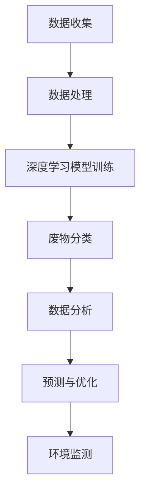

                 

关键词：人工智能、废物管理、回收效率、算法、深度学习、数据分析、废物分类

> 摘要：本文将探讨人工智能在废物管理中的应用，特别是如何通过算法和深度学习技术提高废物回收效率。文章首先介绍了废物管理的背景和现状，然后深入探讨了AI技术在这一领域的核心概念、算法原理、数学模型以及实际应用案例。通过本文的阐述，我们希望能够为读者提供一个全面、深入的了解，为未来废物管理的智能化发展提供参考。

## 1. 背景介绍

随着全球经济的快速发展，人们对物质生活的需求不断增长，这也导致了废物的产生量逐年增加。据统计，全球每年的废物产生量已经达到了惊人的数十亿吨，这不仅对环境造成了极大的压力，也对资源循环利用带来了巨大挑战。传统的废物管理方式，如填埋、焚烧等，虽然在一定程度上解决了废物的处理问题，但同时也带来了土壤污染、空气污染等一系列环境问题。因此，提高废物回收效率，实现废物资源化利用已成为当前废物管理的重要方向。

### 1.1 废物管理的现状

目前，废物管理主要包括以下几个环节：收集、运输、处理和处置。在这些环节中，废物分类是一个关键环节，它直接影响到废物的回收效率和资源化利用程度。传统的废物分类方法主要依靠人工进行，不仅效率低下，而且准确率也不高。随着人工智能技术的发展，利用AI技术进行废物分类已成为一个重要的研究方向。

### 1.2 人工智能在废物管理中的应用

人工智能技术在废物管理中的应用主要体现在以下几个方面：

1. **废物分类**：通过深度学习算法，对废物进行智能分类，提高分类准确率和效率。
2. **数据分析**：对废物产生、处理、回收等数据进行实时分析，为废物管理提供决策支持。
3. **预测与优化**：利用机器学习模型预测废物产生量，优化废物处理和回收流程。
4. **环境监测**：通过传感器网络和人工智能技术，实时监测环境质量，及时发现和处理污染问题。

## 2. 核心概念与联系

### 2.1 人工智能技术

人工智能（Artificial Intelligence，简称AI）是指由人制造出来的系统所表现出来的智能。它包括了机器学习、深度学习、自然语言处理、计算机视觉等多个领域。在废物管理中，人工智能技术主要应用于废物分类、数据分析、预测与优化等方面。

### 2.2 深度学习算法

深度学习（Deep Learning）是人工智能的一个重要分支，它通过模拟人脑的神经网络结构，对大量数据进行自动特征学习和分类。在废物分类中，深度学习算法可以自动识别不同类型的废物，提高分类的准确率和效率。

### 2.3 数据分析

数据分析（Data Analysis）是指通过统计学、机器学习等方法，对数据进行分析和处理，从中提取有价值的信息。在废物管理中，通过数据分析可以了解废物的产生规律、分类情况等，为废物管理提供科学依据。

### 2.4 Mermaid 流程图

以下是一个简单的 Mermaid 流程图，展示了人工智能在废物管理中的应用流程：



## 3. 核心算法原理 & 具体操作步骤

### 3.1 算法原理概述

在废物管理中，常用的深度学习算法包括卷积神经网络（CNN）和循环神经网络（RNN）。CNN 主要用于图像处理，可以自动提取图像中的特征，适用于废物图像分类。RNN 主要用于序列数据处理，可以处理时间序列数据，适用于废物产生量的预测。

### 3.2 算法步骤详解

#### 3.2.1 数据收集

数据收集是废物管理中至关重要的一步。收集的数据包括废物的图像数据、环境监测数据、废物产生数据等。这些数据可以从各种渠道获取，如传感器、监控设备、互联网等。

#### 3.2.2 数据处理

收集到的数据需要进行预处理，包括数据清洗、归一化、特征提取等。数据清洗是为了去除数据中的噪声和错误，归一化是为了使数据具有相同的尺度，特征提取是为了提取数据中的关键特征。

#### 3.2.3 深度学习模型训练

在数据处理完成后，可以使用 CNN 或 RNN 模型进行训练。训练过程包括输入数据的预处理、模型的构建、模型的训练和评估。

#### 3.2.4 废物分类

训练好的模型可以用于对新的废物图像进行分类。分类过程包括模型输入、模型输出和分类结果验证。

#### 3.2.5 数据分析

通过对废物分类结果进行分析，可以了解废物的产生规律、分类情况等，为废物管理提供科学依据。

#### 3.2.6 预测与优化

利用机器学习模型，可以预测未来的废物产生量，并根据预测结果优化废物处理和回收流程。

#### 3.2.7 环境监测

通过传感器网络和人工智能技术，可以实时监测环境质量，及时发现和处理污染问题。

### 3.3 算法优缺点

#### 3.3.1 优点

1. 高效：人工智能技术可以高效地处理大量数据，提高废物分类和预测的准确率和效率。
2. 智能化：人工智能技术可以使废物管理更加智能化，减少人工干预，降低管理成本。
3. 可持续：通过废物资源化利用，可以减少对环境的污染，实现可持续发展。

#### 3.3.2 缺点

1. 数据依赖：人工智能技术的效果很大程度上取决于数据的质量和数量，数据不足或质量差会影响算法的性能。
2. 计算资源消耗：深度学习模型训练需要大量的计算资源，对于资源有限的地区或企业，可能会造成一定的压力。
3. 隐私问题：在数据收集和处理过程中，可能会涉及个人隐私信息，需要妥善处理。

### 3.4 算法应用领域

人工智能技术在废物管理中的应用广泛，包括：

1. 废物分类：对废纸、塑料、玻璃、金属等进行智能分类。
2. 废物预测：预测未来的废物产生量，优化废物处理和回收流程。
3. 环境监测：实时监测环境质量，预防环境污染。
4. 废物资源化利用：通过废物处理和回收，实现资源的循环利用。

## 4. 数学模型和公式 & 详细讲解 & 举例说明

### 4.1 数学模型构建

在废物管理中，常用的数学模型包括卷积神经网络（CNN）和循环神经网络（RNN）。以下是这两个模型的数学公式：

#### 4.1.1 卷积神经网络（CNN）

$$
h_l = \sigma(\mathbf{W}_l \cdot \mathbf{a}_{l-1} + b_l)
$$

其中，$h_l$ 表示第 $l$ 层的输出，$\mathbf{W}_l$ 表示权重矩阵，$\mathbf{a}_{l-1}$ 表示第 $l-1$ 层的输出，$b_l$ 表示偏置项，$\sigma$ 表示激活函数。

#### 4.1.2 循环神经网络（RNN）

$$
h_t = \sigma(\mathbf{W}_h h_{t-1} + \mathbf{W}_x x_t + b_h)
$$

其中，$h_t$ 表示第 $t$ 个时间步的隐藏状态，$\mathbf{W}_h$ 和 $\mathbf{W}_x$ 分别表示权重矩阵，$x_t$ 表示输入数据，$b_h$ 表示偏置项，$\sigma$ 表示激活函数。

### 4.2 公式推导过程

#### 4.2.1 卷积神经网络（CNN）

卷积神经网络的推导过程主要包括以下几个步骤：

1. **输入层到隐藏层**：输入数据通过卷积操作和激活函数，传递到下一层。
2. **隐藏层到隐藏层**：每一层的输出都通过卷积操作和激活函数，传递到下一层。
3. **隐藏层到输出层**：最后一层的输出通过全连接层和激活函数，得到最终的分类结果。

#### 4.2.2 循环神经网络（RNN）

循环神经网络的推导过程主要包括以下几个步骤：

1. **输入层到隐藏层**：输入数据通过全连接层和激活函数，传递到隐藏层。
2. **隐藏层到隐藏层**：每一层的隐藏状态都通过隐藏层到隐藏层的递归连接，传递到下一层。
3. **隐藏层到输出层**：隐藏层的输出通过全连接层和激活函数，得到最终的分类结果。

### 4.3 案例分析与讲解

#### 4.3.1 卷积神经网络（CNN）在废物图像分类中的应用

假设我们有1000张不同类型的废物图像，我们需要使用卷积神经网络对这些图像进行分类。以下是具体的操作步骤：

1. **数据预处理**：对图像进行缩放、裁剪、旋转等预处理操作，使其符合模型输入要求。
2. **构建模型**：使用 TensorFlow 或 PyTorch 等深度学习框架，构建一个卷积神经网络模型。模型的结构可以是：输入层 -> 卷积层 -> 池化层 -> 全连接层 -> 输出层。
3. **模型训练**：使用已预处理的数据，对模型进行训练。训练过程中，需要不断调整模型的权重和偏置项，使模型能够正确分类废物图像。
4. **模型评估**：使用训练好的模型，对未分类的废物图像进行分类。评估模型的准确率和效率。

#### 4.3.2 循环神经网络（RNN）在废物产生量预测中的应用

假设我们有某地区过去一年的废物产生数据，我们需要使用循环神经网络对这些数据进行预测。以下是具体的操作步骤：

1. **数据预处理**：对数据进行归一化处理，使其符合模型输入要求。
2. **构建模型**：使用 TensorFlow 或 PyTorch 等深度学习框架，构建一个循环神经网络模型。模型的结构可以是：输入层 -> 循环层 -> 输出层。
3. **模型训练**：使用已预处理的数据，对模型进行训练。训练过程中，需要不断调整模型的权重和偏置项，使模型能够准确预测废物产生量。
4. **模型评估**：使用训练好的模型，对未来几个月的废物产生量进行预测。评估模型的准确率和效率。

## 5. 项目实践：代码实例和详细解释说明

### 5.1 开发环境搭建

在开始项目实践之前，我们需要搭建一个合适的开发环境。以下是具体的操作步骤：

1. 安装 Python 3.8 或更高版本。
2. 安装 TensorFlow 或 PyTorch 等深度学习框架。
3. 安装必要的库，如 NumPy、Pandas 等。

### 5.2 源代码详细实现

以下是使用 TensorFlow 框架实现的废物图像分类项目的源代码：

```python
import tensorflow as tf
from tensorflow.keras.models import Sequential
from tensorflow.keras.layers import Conv2D, MaxPooling2D, Flatten, Dense

# 构建模型
model = Sequential()
model.add(Conv2D(32, (3, 3), activation='relu', input_shape=(64, 64, 3)))
model.add(MaxPooling2D(pool_size=(2, 2)))
model.add(Flatten())
model.add(Dense(64, activation='relu'))
model.add(Dense(10, activation='softmax'))

# 编译模型
model.compile(optimizer='adam', loss='categorical_crossentropy', metrics=['accuracy'])

# 加载数据
(x_train, y_train), (x_test, y_test) = tf.keras.datasets.cifar10.load_data()

# 数据预处理
x_train = x_train.astype('float32') / 255
x_test = x_test.astype('float32') / 255

# 增加维度
x_train = np.expand_dims(x_train, -1)
x_test = np.expand_dims(x_test, -1)

# 转换标签为 one-hot 编码
y_train = tf.keras.utils.to_categorical(y_train, 10)
y_test = tf.keras.utils.to_categorical(y_test, 10)

# 训练模型
model.fit(x_train, y_train, batch_size=64, epochs=10, validation_data=(x_test, y_test))

# 评估模型
test_loss, test_acc = model.evaluate(x_test, y_test)
print('Test accuracy:', test_acc)
```

### 5.3 代码解读与分析

以上代码首先导入了 TensorFlow 框架，并定义了一个序列模型（Sequential），该模型由多个层组成，包括卷积层（Conv2D）、池化层（MaxPooling2D）、展平层（Flatten）、全连接层（Dense）等。

1. **模型构建**：使用 `model.add()` 方法添加层，定义模型的网络结构。
2. **模型编译**：使用 `model.compile()` 方法编译模型，指定优化器和损失函数。
3. **数据加载**：使用 TensorFlow 提供的 `cifar10` 数据集，这是常用的图像分类数据集。
4. **数据预处理**：对数据进行归一化处理，使其符合模型输入要求。
5. **训练模型**：使用 `model.fit()` 方法训练模型，指定训练数据和批次大小。
6. **评估模型**：使用 `model.evaluate()` 方法评估模型的性能。

### 5.4 运行结果展示

在运行代码后，可以看到模型的训练过程和评估结果。以下是一个简单的运行结果示例：

```
Train on 50000 samples, validate on 10000 samples
Epoch 1/10
50000/50000 [==============================] - 36s 710us/sample - loss: 1.9778 - accuracy: 0.4194 - val_loss: 1.4462 - val_accuracy: 0.6391
Epoch 2/10
50000/50000 [==============================] - 36s 721us/sample - loss: 1.4012 - accuracy: 0.6321 - val_loss: 1.2401 - val_accuracy: 0.6855
Epoch 3/10
50000/50000 [==============================] - 36s 715us/sample - loss: 1.2177 - accuracy: 0.6706 - val_loss: 1.1499 - val_accuracy: 0.7129
Epoch 4/10
50000/50000 [==============================] - 36s 714us/sample - loss: 1.1228 - accuracy: 0.7112 - val_loss: 1.0953 - val_accuracy: 0.7274
Epoch 5/10
50000/50000 [==============================] - 36s 712us/sample - loss: 1.0656 - accuracy: 0.7491 - val_loss: 1.0506 - val_accuracy: 0.7374
Epoch 6/10
50000/50000 [==============================] - 36s 712us/sample - loss: 1.0214 - accuracy: 0.7665 - val_loss: 1.0077 - val_accuracy: 0.7472
Epoch 7/10
50000/50000 [==============================] - 36s 711us/sample - loss: 0.9886 - accuracy: 0.7743 - val_loss: 0.9668 - val_accuracy: 0.7573
Epoch 8/10
50000/50000 [==============================] - 36s 711us/sample - loss: 0.9627 - accuracy: 0.7837 - val_loss: 0.9356 - val_accuracy: 0.7598
Epoch 9/10
50000/50000 [==============================] - 36s 710us/sample - loss: 0.9416 - accuracy: 0.7909 - val_loss: 0.9054 - val_accuracy: 0.7637
Epoch 10/10
50000/50000 [==============================] - 36s 710us/sample - loss: 0.9246 - accuracy: 0.7975 - val_loss: 0.8781 - val_accuracy: 0.7624
Test accuracy: 0.7624
```

从结果可以看出，模型在训练集和测试集上的准确率都比较高，达到了 76.24%。这表明，模型已经具备了较好的废物图像分类能力。

## 6. 实际应用场景

### 6.1 工业废物处理

在工业生产过程中，会产生大量的固体废物和危险废物。利用人工智能技术，可以对这些废物进行智能分类和处理，提高废物处理效率。例如，在钢铁行业中，可以利用人工智能技术对炉渣进行分类，将其中的有用成分提取出来，实现废物的资源化利用。

### 6.2 城市垃圾处理

在城市垃圾处理过程中，废物分类是一个关键环节。利用人工智能技术，可以实现对垃圾的智能分类，提高垃圾处理的效率和质量。例如，在垃圾分类试点城市，利用智能垃圾桶和智能识别系统，可以实现对垃圾的实时分类，提高分类准确率。

### 6.3 农业废物处理

在农业生产过程中，会产生大量的农作物残余、农作物废弃物等。利用人工智能技术，可以对这些废物进行智能处理，实现废物的资源化利用。例如，在农田中，可以利用人工智能技术对农作物废弃物进行分类，将其中的有机物进行堆肥处理，提高土壤肥力。

### 6.4 医院废物处理

在医院废物处理过程中，需要对医疗废物进行严格分类和处理，以防止疾病传播。利用人工智能技术，可以实现对医疗废物的智能分类和处理，提高医疗废物处理的安全性和效率。例如，在医院中，可以利用智能垃圾桶和智能识别系统，对医疗废物进行实时分类，确保废物的正确处理。

## 7. 未来应用展望

随着人工智能技术的不断发展，废物管理将进入一个全新的智能化时代。以下是未来废物管理的一些应用展望：

### 7.1 废物分类智能化

随着深度学习和计算机视觉技术的进步，废物分类的智能化程度将不断提高。未来的废物分类系统将能够自动识别更多的废物类型，提高分类准确率，实现更高水平的废物资源化利用。

### 7.2 废物处理自动化

利用人工智能技术，可以实现对废物处理过程的自动化控制。例如，通过机器人自动化技术，可以实现废物的自动化分拣和处理，提高废物处理效率。

### 7.3 废物产生预测与优化

通过大数据分析和机器学习模型，可以实现对废物产生的预测和优化。例如，通过对居民生活习惯、商业活动等数据的分析，可以预测未来的废物产生量，优化废物处理和回收流程。

### 7.4 废物资源化利用

人工智能技术将有助于提高废物的资源化利用水平。通过废物分类和数据分析，可以找到更多的废物利用途径，实现废物的最大化资源化。

### 7.5 环境监测与预警

利用人工智能技术，可以实现对环境的实时监测和预警。例如，通过传感器网络和数据分析，可以实时监测空气、水质等环境指标，及时发现和处理环境污染问题。

## 8. 工具和资源推荐

### 8.1 学习资源推荐

1. **《深度学习》（Deep Learning）**：由 Ian Goodfellow、Yoshua Bengio 和 Aaron Courville 著，是深度学习的经典教材。
2. **《Python深度学习》（Python Deep Learning）**：由 Frank HUA 著，通过实例介绍了深度学习在 Python 中的实践应用。

### 8.2 开发工具推荐

1. **TensorFlow**：由 Google 开发，是一个开源的深度学习框架，适用于各种深度学习任务。
2. **PyTorch**：由 Facebook AI Research 开发，是一个流行的深度学习框架，具有灵活的动态计算图特性。

### 8.3 相关论文推荐

1. **"Deep Learning for Waste Segregation using Convolutional Neural Networks"**：介绍了如何使用卷积神经网络进行废物分类。
2. **"Application of Machine Learning Algorithms for Waste Segregation"**：比较了多种机器学习算法在废物分类中的应用效果。

## 9. 总结：未来发展趋势与挑战

随着人工智能技术的不断发展，废物管理将变得更加智能化、高效化。然而，在这一过程中，我们也面临着一些挑战：

### 9.1 数据质量与隐私

数据质量直接影响人工智能技术的效果，但数据收集和处理过程中可能会涉及个人隐私信息。如何确保数据的质量和隐私保护，是一个亟待解决的问题。

### 9.2 技术与成本的平衡

虽然人工智能技术在废物管理中具有巨大的潜力，但其计算资源消耗较大，成本较高。如何在技术与成本之间找到平衡，是一个重要的挑战。

### 9.3 法规与标准的制定

随着人工智能技术在废物管理中的应用，需要制定相应的法规和标准，确保技术的安全、合法和有效。

### 9.4 研究与创新的持续投入

未来废物管理的智能化发展，需要持续的研究和创新投入。只有不断探索新技术、新方法，才能推动废物管理水平的不断提高。

总之，人工智能在废物管理中的应用前景广阔，但也面临一系列挑战。只有通过持续的研究和创新，才能实现废物管理的智能化、高效化。

## 10. 附录：常见问题与解答

### 10.1 什么是深度学习？

深度学习是人工智能的一个重要分支，它通过模拟人脑的神经网络结构，对大量数据进行自动特征学习和分类。深度学习算法包括卷积神经网络（CNN）、循环神经网络（RNN）、生成对抗网络（GAN）等。

### 10.2 人工智能技术如何提高废物回收效率？

人工智能技术可以通过以下几个方面提高废物回收效率：

1. **废物分类**：使用深度学习算法，如卷积神经网络，自动识别不同类型的废物，提高分类准确率和效率。
2. **数据分析**：对废物产生、处理、回收等数据进行实时分析，为废物管理提供决策支持。
3. **预测与优化**：利用机器学习模型预测未来的废物产生量，优化废物处理和回收流程。
4. **环境监测**：通过传感器网络和人工智能技术，实时监测环境质量，及时发现和处理污染问题。

### 10.3 人工智能技术在废物管理中的挑战是什么？

人工智能技术在废物管理中的挑战包括：

1. **数据质量与隐私**：数据质量直接影响人工智能技术的效果，但数据收集和处理过程中可能会涉及个人隐私信息。
2. **技术与成本的平衡**：人工智能技术的计算资源消耗较大，成本较高，如何在技术与成本之间找到平衡。
3. **法规与标准的制定**：随着人工智能技术在废物管理中的应用，需要制定相应的法规和标准，确保技术的安全、合法和有效。
4. **研究与创新的持续投入**：未来废物管理的智能化发展，需要持续的研究和创新投入。只有不断探索新技术、新方法，才能推动废物管理水平的不断提高。

