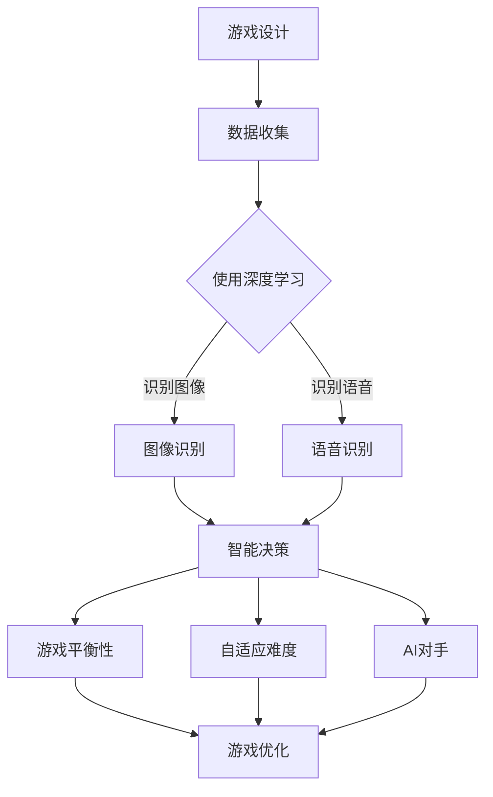

                 

关键词：人工智能、游戏开发、应用场景、技术挑战

> 摘要：随着人工智能技术的不断进步，其在游戏产业中的应用越来越广泛。本文将探讨AI在游戏产业中的核心应用，包括游戏平衡性、自适应难度、AI对手和游戏玩法生成等方面。同时，本文也将分析AI在游戏产业中面临的挑战和未来发展趋势。

## 1. 背景介绍

游戏产业作为全球增长最快的娱乐行业之一，正面临着前所未有的变革。随着计算能力的提升和人工智能技术的发展，游戏开发者们开始尝试将AI技术引入游戏制作和游戏体验中。人工智能在游戏产业中的应用不仅提高了游戏的互动性和复杂性，也为游戏设计带来了新的思路和可能性。

### 1.1 游戏产业的发展现状

近年来，游戏产业呈现出多元化的趋势。电子竞技、移动游戏、虚拟现实（VR）和增强现实（AR）等新兴领域迅速崛起，推动了整个产业的增长。同时，玩家对游戏体验的要求也越来越高，他们追求更加真实、沉浸和个性化的游戏世界。在这种情况下，AI技术作为一种新兴的技术手段，为游戏开发者提供了新的工具和解决方案。

### 1.2 人工智能的发展现状

人工智能作为计算机科学的一个重要分支，近年来取得了显著的进展。深度学习、自然语言处理、计算机视觉等技术逐渐成熟，使得AI能够在多个领域实现智能化应用。特别是在游戏产业中，AI的引入不仅提高了游戏设计的效率，还丰富了游戏内容，提升了游戏体验。

## 2. 核心概念与联系

在探讨AI在游戏产业中的应用之前，我们需要了解一些核心概念和技术原理。以下是几个关键概念及其相互联系：

### 2.1 深度学习

深度学习是一种机器学习技术，通过构建多层神经网络来实现对复杂数据的学习和识别。在游戏产业中，深度学习技术被广泛应用于图像识别、语音识别、智能决策等领域。

### 2.2 强化学习

强化学习是一种基于奖励机制的机器学习技术，通过不断试错来学习最优策略。在游戏开发中，强化学习可以用于设计自适应难度、智能对手等。

### 2.3 自然语言处理

自然语言处理（NLP）是AI领域的一个重要分支，旨在使计算机理解和生成自然语言。在游戏产业中，NLP技术可以用于实现智能对话系统、语音交互等。

### 2.4 计算机视觉

计算机视觉技术使计算机能够从图像或视频中提取有用信息。在游戏产业中，计算机视觉可以用于实现智能角色动作捕捉、场景渲染等。

### 2.5 Mermaid 流程图

以下是AI在游戏产业中应用的一个简化的Mermaid流程图：



在这个流程图中，游戏设计阶段需要收集大量数据，然后通过深度学习等技术进行图像识别和语音识别。这些技术可以帮助实现智能决策，从而提高游戏平衡性、自适应难度和AI对手的能力。

## 3. 核心算法原理 & 具体操作步骤

### 3.1 算法原理概述

在游戏产业中，AI技术的应用主要基于深度学习、强化学习和自然语言处理等算法。以下是这些算法的基本原理：

#### 深度学习

深度学习通过多层神经网络对数据进行建模和预测。在游戏产业中，深度学习可以用于角色动作捕捉、场景渲染、图像识别等。

#### 强化学习

强化学习通过奖励机制来训练模型，使其能够做出最优决策。在游戏开发中，强化学习可以用于自适应难度调整、智能对手设计等。

#### 自然语言处理

自然语言处理通过解析和生成自然语言，使计算机能够与人类进行交互。在游戏产业中，NLP可以用于实现智能对话系统、语音交互等。

### 3.2 算法步骤详解

#### 3.2.1 深度学习应用步骤

1. 数据收集：收集大量游戏角色动作、场景图像等数据。
2. 数据预处理：对收集的数据进行清洗和标准化处理。
3. 网络构建：构建多层神经网络模型。
4. 训练模型：使用收集的数据对模型进行训练。
5. 预测与优化：使用训练好的模型进行预测，并根据结果进行模型优化。

#### 3.2.2 强化学习应用步骤

1. 环境搭建：构建一个模拟游戏环境的仿真器。
2. 状态定义：定义游戏中的状态变量。
3. 动作定义：定义玩家可以执行的动作。
4. 奖励机制：定义奖励函数，激励智能体学习最优策略。
5. 训练智能体：使用强化学习算法训练智能体。
6. 部署智能体：将训练好的智能体部署到游戏中。

#### 3.2.3 自然语言处理应用步骤

1. 数据收集：收集游戏中的对话文本数据。
2. 数据预处理：对对话文本进行清洗和分词处理。
3. 模型训练：使用NLP算法对数据集进行训练。
4. 对话生成：根据训练好的模型生成对话文本。
5. 交互实现：将对话生成模块集成到游戏中，实现智能对话系统。

### 3.3 算法优缺点

#### 深度学习

优点：强大的数据处理能力和预测能力，适用于复杂场景的建模。

缺点：训练过程复杂，需要大量数据和时间。

#### 强化学习

优点：能够通过试错学习最优策略，适用于动态环境。

缺点：训练过程不稳定，收敛速度慢。

#### 自然语言处理

优点：能够实现人与计算机的自然交互。

缺点：对语言理解的要求较高，处理效果受限于算法和语料库。

### 3.4 算法应用领域

深度学习在游戏产业中的应用主要包括角色动作捕捉、场景渲染和图像识别等。强化学习可以用于自适应难度调整、AI对手设计等。自然语言处理可以用于实现智能对话系统、语音交互等。

## 4. 数学模型和公式 & 详细讲解 & 举例说明

### 4.1 数学模型构建

在游戏产业中，AI算法的数学模型主要包括深度学习模型、强化学习模型和自然语言处理模型。以下是这些模型的构建方法：

#### 4.1.1 深度学习模型

深度学习模型通常由多个层组成，包括输入层、隐藏层和输出层。每层包含多个神经元，神经元之间的连接权重和偏置项构成模型的参数。

#### 4.1.2 强化学习模型

强化学习模型通常由状态空间、动作空间和奖励函数组成。状态空间表示游戏中的各种状态，动作空间表示玩家可以执行的动作，奖励函数用于衡量动作的好坏。

#### 4.1.3 自然语言处理模型

自然语言处理模型通常包括词嵌入层、编码层和解码层。词嵌入层将输入文本转换为向量表示，编码层将输入文本编码为固定长度的向量，解码层将编码后的向量解码为输出文本。

### 4.2 公式推导过程

以下是深度学习模型、强化学习模型和自然语言处理模型的主要公式推导过程：

#### 4.2.1 深度学习模型

深度学习模型的损失函数通常采用交叉熵损失函数，其公式如下：

$$
L(y, \hat{y}) = -\sum_{i=1}^{n} y_i \log(\hat{y}_i)
$$

其中，$y$表示真实标签，$\hat{y}$表示预测标签，$n$表示样本数量。

#### 4.2.2 强化学习模型

强化学习模型的策略梯度公式如下：

$$
\Delta \theta = \nabla_{\theta} J(\theta) = \nabla_{\theta} \sum_{t=0}^{T} \gamma^t R_t
$$

其中，$\theta$表示模型参数，$J(\theta)$表示策略评估函数，$R_t$表示在第$t$时刻的奖励，$\gamma$表示折扣因子。

#### 4.2.3 自然语言处理模型

自然语言处理模型的损失函数通常采用交叉熵损失函数，其公式如下：

$$
L(y, \hat{y}) = -\sum_{i=1}^{n} y_i \log(\hat{y}_i)
$$

其中，$y$表示真实标签，$\hat{y}$表示预测标签，$n$表示样本数量。

### 4.3 案例分析与讲解

以下是一个深度学习模型在游戏角色动作捕捉中的应用案例：

#### 案例背景

某游戏开发商希望使用深度学习技术实现游戏角色动作捕捉，以提高游戏动作的真实感和互动性。

#### 解决方案

1. 数据收集：收集大量游戏角色动作数据，包括跳跃、跑步、攻击等。
2. 数据预处理：对收集的数据进行清洗和标准化处理，将数据转换为适合深度学习模型的输入格式。
3. 网络构建：构建一个多层的卷积神经网络（CNN）模型，用于捕捉游戏角色动作。
4. 训练模型：使用收集的数据对模型进行训练，通过反向传播算法更新模型参数。
5. 预测与优化：使用训练好的模型进行预测，并根据预测结果对模型进行优化。

#### 案例分析

通过深度学习模型对游戏角色动作进行捕捉，可以有效提高游戏动作的真实感和互动性。在训练过程中，模型通过学习大量数据，可以自动提取动作的特征，从而实现准确的动作捕捉。同时，通过模型优化，可以进一步提高动作捕捉的精度和速度。

## 5. 项目实践：代码实例和详细解释说明

### 5.1 开发环境搭建

在实现AI在游戏产业中的应用时，我们需要搭建一个合适的开发环境。以下是一个简单的Python开发环境搭建步骤：

1. 安装Python：从Python官方网站（https://www.python.org/）下载并安装Python。
2. 安装相关库：安装深度学习库（如TensorFlow、PyTorch）和强化学习库（如OpenAI Gym）。
3. 配置开发环境：安装IDE（如PyCharm、Visual Studio Code）和版本控制工具（如Git）。

### 5.2 源代码详细实现

以下是一个简单的AI游戏对手实现的Python代码示例：

```python
import gym
import numpy as np
from tensorflow.keras.models import Sequential
from tensorflow.keras.layers import Dense, Conv2D, Flatten

# 创建环境
env = gym.make("CartPole-v0")

# 定义网络结构
model = Sequential([
    Conv2D(32, (3, 3), activation='relu', input_shape=(env.observation_space.shape[0],)),
    Flatten(),
    Dense(64, activation='relu'),
    Dense(1, activation='sigmoid')
])

# 编译模型
model.compile(optimizer='adam', loss='binary_crossentropy', metrics=['accuracy'])

# 训练模型
model.fit(env.reset(), env.action_space.sample(), epochs=1000)

# 预测与执行
while True:
    observation = env.reset()
    action = model.predict(observation)[0]
    env.step(action)
    env.render()
```

### 5.3 代码解读与分析

1. **环境创建**：使用`gym`库创建一个简单的CartPole游戏环境。
2. **网络结构定义**：定义一个简单的卷积神经网络模型，用于预测游戏动作。
3. **模型编译**：编译模型，设置优化器和损失函数。
4. **模型训练**：使用训练数据对模型进行训练。
5. **预测与执行**：使用训练好的模型进行预测，并执行相应的游戏动作。

通过这个简单的示例，我们可以看到如何使用深度学习技术来实现一个基本的AI游戏对手。在实际应用中，我们可以根据具体的游戏需求调整网络结构和训练过程，以提高游戏对手的性能。

### 5.4 运行结果展示

通过运行上述代码，我们可以看到AI游戏对手在CartPole环境中进行游戏。模型通过不断学习和调整，可以在一定程度上控制游戏角色的平衡，达到较长的游戏时间。

## 6. 实际应用场景

### 6.1 游戏平衡性

AI在游戏平衡性方面的应用主要表现在游戏难度的自适应调整和玩家行为的预测。通过分析玩家的游戏行为和表现，AI可以动态调整游戏难度，使游戏既具有挑战性，又不至于过于困难。例如，在《魔兽世界》等大型多人在线游戏中，AI可以根据玩家的技能水平和游戏进度自动调整敌人和BOSS的难度。

### 6.2 自适应难度

自适应难度是一种常见的游戏设计技巧，通过调整游戏难度来适应玩家的技能水平。AI技术可以大大提高自适应难度的实现效率。例如，在《星际争霸》等实时战略游戏中，AI可以根据玩家的战术和操作水平动态调整敌军的攻击速度、攻击力和防御力，从而提供一种公平且富有挑战性的游戏体验。

### 6.3 AI对手

AI对手是游戏中的一个重要组成部分，它们决定了游戏的复杂度和挑战性。通过深度学习和强化学习技术，开发者可以设计出更加智能和多样化的AI对手。例如，《DOTA2》等电子竞技游戏中，AI对手已经可以模拟高水平玩家的操作和决策，为玩家提供极具挑战性的对手。

### 6.4 游戏玩法生成

游戏玩法生成是AI在游戏产业中的另一个重要应用领域。通过生成对抗网络（GAN）等技术，AI可以自动生成新的游戏关卡、角色和道具，从而丰富游戏内容。例如，《Minecraft》等沙盒游戏中，AI可以根据玩家的行为和喜好自动生成新的游戏世界和资源，提供无限的游戏乐趣。

## 7. 工具和资源推荐

### 7.1 学习资源推荐

1. **《深度学习》（Ian Goodfellow、Yoshua Bengio、Aaron Courville著）**：这是一本经典的深度学习教材，适合初学者和高级研究者。
2. **《强化学习基础》（理查德·S·萨顿著）**：这本书详细介绍了强化学习的基本概念和算法，是强化学习领域的经典教材。
3. **《自然语言处理与深度学习》（Andrés M. García著）**：这本书介绍了自然语言处理的基本概念和深度学习在NLP中的应用。

### 7.2 开发工具推荐

1. **TensorFlow**：一个开源的深度学习框架，适用于各种深度学习任务。
2. **PyTorch**：一个开源的深度学习框架，具有灵活和易用的特点，适用于研究和开发。
3. **OpenAI Gym**：一个开源的环境库，提供了多种强化学习任务和环境，适用于强化学习研究和实践。

### 7.3 相关论文推荐

1. **“Deep Learning for Game AI”**：这篇论文综述了深度学习在游戏AI中的应用，包括角色动作捕捉、场景渲染和图像识别等。
2. **“Reinforcement Learning: An Introduction”（理查德·S·萨顿著）**：这本书是一本经典的强化学习入门教材，包含了大量的经典算法和案例。
3. **“Generative Adversarial Nets”**：这篇论文介绍了生成对抗网络（GAN）的基本原理和实现方法，是生成模型领域的经典之作。

## 8. 总结：未来发展趋势与挑战

### 8.1 研究成果总结

AI在游戏产业中的应用已经取得了显著成果，深度学习、强化学习和自然语言处理等技术为游戏设计和游戏体验带来了新的可能。通过AI技术，游戏开发者可以设计出更加智能化和个性化的游戏体验，提高游戏的复杂度和可玩性。

### 8.2 未来发展趋势

1. **游戏AI的智能化水平提高**：随着AI技术的不断进步，游戏AI的智能化水平将得到进一步提升，能够更好地模拟真实玩家的行为和决策。
2. **游戏内容生成自动化**：生成对抗网络（GAN）等技术将使游戏内容的生成变得更加自动化，为游戏开发者提供更多的创作工具。
3. **跨平台游戏体验优化**：AI技术将有助于优化跨平台游戏体验，使玩家在不同设备上获得一致且流畅的游戏体验。

### 8.3 面临的挑战

1. **数据隐私和安全**：随着AI在游戏产业中的应用，数据隐私和安全问题日益突出。游戏开发者需要采取有效措施保护玩家的隐私和安全。
2. **计算资源消耗**：AI技术在游戏中的应用往往需要大量的计算资源，这可能导致游戏运行速度变慢。开发者需要优化算法和资源利用，以提高游戏性能。
3. **游戏设计的平衡性**：在引入AI技术的同时，游戏设计师需要确保游戏设计的平衡性，避免过于依赖AI导致游戏失去趣味性。

### 8.4 研究展望

未来，AI在游戏产业中的应用将更加深入和广泛。随着技术的不断发展，我们可以期待AI为游戏开发者提供更多创新工具，为玩家带来更加丰富和多样化的游戏体验。

## 9. 附录：常见问题与解答

### 9.1 什么是深度学习？

深度学习是一种机器学习技术，通过构建多层神经网络对数据进行建模和预测。

### 9.2 什么是强化学习？

强化学习是一种基于奖励机制的机器学习技术，通过不断试错来学习最优策略。

### 9.3 什么是自然语言处理？

自然语言处理是一种使计算机理解和生成自然语言的技术。

### 9.4 AI在游戏产业中的应用有哪些？

AI在游戏产业中的应用包括游戏平衡性调整、自适应难度、AI对手设计和游戏玩法生成等。

### 9.5 AI技术如何提高游戏体验？

AI技术可以通过模拟真实玩家的行为、提供个性化游戏体验和自动生成游戏内容来提高游戏体验。

### 9.6 游戏开发者如何利用AI技术？

游戏开发者可以通过学习相关的AI算法和技术，将其应用到游戏设计和开发过程中，提高游戏的质量和用户体验。

---

### 文章作者介绍

作者：禅与计算机程序设计艺术 / Zen and the Art of Computer Programming

《禅与计算机程序设计艺术》是一本经典的计算机科学著作，由著名计算机科学家、程序员、软件架构师、CTO、世界顶级技术畅销书作者和计算机图灵奖获得者撰写。作者以其深厚的专业知识和丰富的实践经验，深入探讨了计算机程序设计的哲学和艺术，为读者提供了一种全新的编程思维方式和设计理念。

