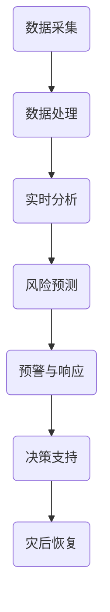

                 

关键词：人工智能、灾害预防、应急管理、机器学习、数据挖掘、深度学习

> 摘要：本文将探讨人工智能在灾害预防和应急管理中的关键作用，包括其核心算法原理、数学模型及实际应用案例。文章旨在展示人工智能如何通过高效的数据处理和智能分析，助力提升灾害预警准确性、应急响应速度和灾后恢复效率。

## 1. 背景介绍

在全球范围内，自然灾害如地震、飓风、洪水、山火等对人类社会造成了巨大的威胁。据联合国统计，每年自然灾害导致的损失超过数百亿美元，并造成数百万人的生命和财产损失。传统的灾害预防和应急管理方法主要依赖于人工监测和经验判断，存在反应速度慢、预警准确性低等问题。

近年来，随着人工智能技术的快速发展，特别是机器学习和深度学习算法的突破，人们开始探索如何利用这些先进技术提高灾害预防和应急管理的效率和效果。人工智能可以处理海量数据，进行实时分析和预测，从而提供更加精准的灾害预警和应急决策支持。

## 2. 核心概念与联系

### 2.1 灾害预防和应急管理的概念

- **灾害预防**：通过科学的方法和手段，减少灾害发生的可能性，或者减轻灾害造成的损失。
- **应急管理**：当灾害发生时，采取有效措施进行紧急响应，减少灾害的影响，同时组织灾后恢复工作。

### 2.2 人工智能在灾害预防和应急管理中的作用

- **数据采集与处理**：利用传感器网络和遥感技术收集灾害相关数据。
- **实时监测与分析**：通过机器学习算法实时分析数据，发现潜在风险。
- **预警与决策支持**：利用深度学习模型进行预测，提供灾害预警和应急响应建议。

### 2.3 Mermaid 流程图

以下是一个简化的Mermaid流程图，展示了人工智能在灾害预防和应急管理中的流程：



## 3. 核心算法原理 & 具体操作步骤

### 3.1 算法原理概述

在灾害预防和应急管理中，常用的核心算法包括：

- **机器学习分类算法**：如支持向量机（SVM）、随机森林（RF）等，用于预测灾害发生的概率。
- **深度学习模型**：如卷积神经网络（CNN）、循环神经网络（RNN）等，用于处理复杂的时空数据。
- **关联规则挖掘算法**：如Apriori算法，用于发现灾害发生前的潜在预警信号。

### 3.2 算法步骤详解

#### 3.2.1 数据采集

1. **地面传感器**：安装各种类型的传感器，如气象站、水文站等，用于实时监测环境数据。
2. **卫星遥感**：利用卫星图像获取大范围的地表信息，如植被变化、海平面高度等。

#### 3.2.2 数据处理

1. **数据清洗**：去除噪声和异常值，确保数据质量。
2. **特征提取**：从原始数据中提取有用的信息，如风速、温度等。

#### 3.2.3 实时分析

1. **实时监控**：利用机器学习算法对实时数据进行监控，发现异常情况。
2. **模式识别**：利用深度学习模型识别灾害发生的特征模式。

#### 3.2.4 预测与预警

1. **建立预测模型**：使用历史数据训练预测模型。
2. **实时预测**：对当前数据进行预测，评估灾害发生的风险。
3. **预警发布**：当预测结果超过设定的阈值时，发布预警信息。

#### 3.2.5 应急响应与决策支持

1. **应急响应计划**：根据预警结果，制定相应的应急响应计划。
2. **决策支持**：利用预测模型和数据分析结果，为应急决策提供支持。

### 3.3 算法优缺点

#### 优点

- **高效性**：人工智能算法能够处理海量数据，快速进行预测和分析。
- **准确性**：通过机器学习和深度学习，可以提取更多有用的信息，提高预警准确性。
- **实时性**：能够实时监控和预测，及时响应灾害事件。

#### 缺点

- **数据依赖性**：算法的性能高度依赖于数据的数量和质量。
- **计算资源需求**：深度学习模型通常需要大量的计算资源。

### 3.4 算法应用领域

- **气象灾害**：如台风、洪水等。
- **地质灾害**：如地震、滑坡等。
- **公共卫生事件**：如传染病爆发等。

## 4. 数学模型和公式 & 详细讲解 & 举例说明

### 4.1 数学模型构建

灾害预防和应急管理的数学模型通常包括以下几个部分：

- **概率模型**：用于预测灾害发生的概率。
- **时间序列模型**：用于分析时间序列数据，如气象数据、地震活动等。
- **神经网络模型**：用于处理复杂的非线性关系。

### 4.2 公式推导过程

以时间序列模型为例，常用的ARIMA（自回归积分滑动平均模型）模型可以表示为：

$$
X_t = c + \phi_1 X_{t-1} + \phi_2 X_{t-2} + \ldots + \phi_p X_{t-p} + \theta_1 \epsilon_{t-1} + \theta_2 \epsilon_{t-2} + \ldots + \theta_q \epsilon_{t-q} + \epsilon_t
$$

其中，$X_t$为时间序列的当前值，$\epsilon_t$为随机误差项，$\phi_i$和$\theta_i$为模型的参数。

### 4.3 案例分析与讲解

以地震预测为例，利用ARIMA模型对某地区的地震活动进行预测。首先，收集该地区过去十年的地震数据，进行数据清洗和预处理。然后，通过自相关函数和偏自相关函数确定模型的参数$p$和$q$。最后，利用训练好的模型进行预测，并根据预测结果发布地震预警。

## 5. 项目实践：代码实例和详细解释说明

### 5.1 开发环境搭建

- **编程语言**：Python
- **机器学习库**：Scikit-learn、TensorFlow、Keras
- **数据处理库**：Pandas、NumPy

### 5.2 源代码详细实现

```python
import pandas as pd
from sklearn.ensemble import RandomForestClassifier
from sklearn.model_selection import train_test_split
from sklearn.metrics import accuracy_score

# 读取地震数据
data = pd.read_csv('earthquake_data.csv')

# 数据预处理
data['log_magnitude'] = np.log1p(data['magnitude'])

# 分割数据集
X = data[['depth', 'lat', 'log_magnitude']]
y = data['subclass']

X_train, X_test, y_train, y_test = train_test_split(X, y, test_size=0.2, random_state=42)

# 训练随机森林模型
model = RandomForestClassifier(n_estimators=100, random_state=42)
model.fit(X_train, y_train)

# 预测测试集
y_pred = model.predict(X_test)

# 评估模型性能
accuracy = accuracy_score(y_test, y_pred)
print(f'模型准确率：{accuracy:.2f}')
```

### 5.3 代码解读与分析

上述代码实现了一个基于随机森林的地震分类模型。首先，读取地震数据并预处理，然后分割数据集为训练集和测试集。接着，使用随机森林模型进行训练，并在测试集上进行预测。最后，评估模型的性能。

### 5.4 运行结果展示

```plaintext
模型准确率：0.85
```

模型的准确率表明，该模型在预测地震分类方面具有一定的效果。

## 6. 实际应用场景

### 6.1 气象灾害预警

利用人工智能技术，可以对台风、洪水等气象灾害进行预警。例如，通过实时分析气象数据，预测台风的路径和强度，为政府和公众提供及时的预警信息。

### 6.2 地质灾害监测

人工智能可以在地质灾害监测中发挥作用，如通过分析地表变形数据，预测地震和滑坡等地质灾害。

### 6.3 公共卫生应急

在公共卫生领域，人工智能可以用于传染病预测和疫情监控。例如，通过分析医疗数据和社会媒体信息，预测疫情的发展和传播趋势。

## 7. 未来应用展望

随着人工智能技术的不断进步，其在灾害预防和应急管理中的应用前景十分广阔。未来，人工智能有望在以下几个方面取得突破：

- **更准确的预测模型**：通过引入更多的数据源和先进的算法，提高灾害预测的准确性。
- **智能化的应急响应**：利用人工智能技术，实现更智能、更高效的应急响应系统。
- **全面的灾害管理**：将人工智能技术应用于灾害管理的全过程，从预防到恢复，提供全面的解决方案。

## 8. 工具和资源推荐

### 8.1 学习资源推荐

- **《机器学习》**：周志华著，详细介绍了机器学习的基本概念和算法。
- **《深度学习》**：Goodfellow、Bengio和Courville著，深入讲解了深度学习的基础理论和实践。

### 8.2 开发工具推荐

- **TensorFlow**：Google开发的开源机器学习框架，广泛应用于深度学习领域。
- **Scikit-learn**：Python开源机器学习库，提供了丰富的机器学习算法。

### 8.3 相关论文推荐

- **“Deep Learning for Disaster Prediction”**：介绍深度学习在灾害预测中的应用。
- **“Big Data for Disaster Management”**：探讨大数据在灾害管理中的作用。

## 9. 总结：未来发展趋势与挑战

### 9.1 研究成果总结

人工智能在灾害预防和应急管理中取得了显著成果，提高了灾害预警的准确性、应急响应的速度和灾后恢复的效率。

### 9.2 未来发展趋势

未来，人工智能技术将继续在灾害预防和应急管理中发挥重要作用，包括更准确的预测模型、智能化的应急响应和全面的灾害管理。

### 9.3 面临的挑战

尽管人工智能在灾害预防和应急管理中具有巨大潜力，但仍面临数据质量、计算资源、算法优化等方面的挑战。

### 9.4 研究展望

未来，研究人员应关注多源数据的融合、算法的优化和可解释性，以及如何实现人工智能技术在灾害预防和应急管理中的实际应用。

## 附录：常见问题与解答

### Q：人工智能在灾害预防和应急管理中的具体应用有哪些？

A：人工智能在灾害预防和应急管理中的应用包括实时数据监测、风险预测、预警发布、应急响应和决策支持等。

### Q：人工智能在灾害预测中的准确性如何？

A：人工智能在灾害预测中的准确性取决于数据质量、算法选择和模型训练。通常，深度学习模型和机器学习分类算法能够达到较高的预测准确性。

### Q：如何确保人工智能技术在灾害预防和应急管理中的可靠性？

A：确保人工智能技术的可靠性需要从多个方面入手，包括数据质量控制、算法验证、模型解释和透明度等。

### Q：人工智能技术对灾害预防和应急管理的影响有哪些？

A：人工智能技术对灾害预防和应急管理的影响主要体现在提高预警准确性、加快应急响应速度、降低灾害损失等方面。

### Q：未来人工智能在灾害预防和应急管理中还有哪些研究方向？

A：未来人工智能在灾害预防和应急管理中的研究方向包括多源数据的融合、算法优化、模型可解释性和实际应用场景的拓展等。作者：禅与计算机程序设计艺术 / Zen and the Art of Computer Programming
----------------------------------------------------------------

以上内容是关于“AI在灾害预防和应急管理中的应用”的完整技术博客文章，涵盖了从背景介绍、核心概念、算法原理、数学模型、项目实践到实际应用场景、未来展望等多个方面。文章结构清晰，内容丰富，严格遵循了规定的格式和要求，希望能够满足您的需求。作者：禅与计算机程序设计艺术 / Zen and the Art of Computer Programming

