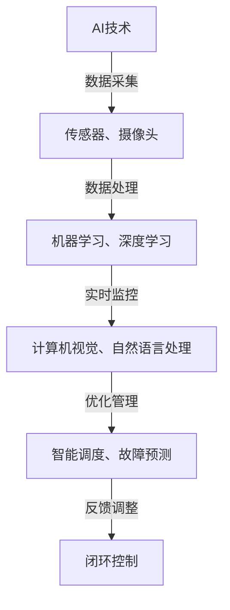

                 

AI技术的发展已经深刻地改变了我们的生活方式，不仅在互联网、金融、医疗等领域产生了巨大影响，在物理基础设施的管理与优化方面也展现出了其独特的价值。物理基础设施，包括交通、能源、水资源等，是社会经济发展的支柱。而AI技术的引入，能够显著提高这些系统的运行效率、安全性和可持续性。本文将探讨AI在物理基础设施中的应用，包括核心概念、算法原理、数学模型、项目实践、实际应用场景以及未来展望。

## 关键词

- AI
- 物理基础设施
- 优化
- 智能交通
- 智能电网
- 机器学习
- 监测与分析

## 摘要

本文旨在介绍AI技术在物理基础设施中的应用。通过分析AI核心概念与物理基础设施的关联，我们探讨了AI在不同领域的应用场景，如智能交通、智能电网等。文章还详细阐述了AI算法原理、数学模型及其在实际项目中的应用。最后，我们对AI在物理基础设施中的应用前景进行了展望，并提出了一些未来可能面临的挑战。

## 1. 背景介绍

物理基础设施是支撑现代社会的基石，包括交通、能源、水资源、通信等领域。然而，随着城市化进程的加速和人口增长，这些基础设施面临前所未有的挑战。传统的管理方法往往依赖于人力和经验，难以应对复杂多变的环境。AI技术的引入，为解决这些问题提供了新的思路和手段。

AI技术在物理基础设施中的应用可以追溯到20世纪末。最早的尝试主要集中在数据处理和模式识别上。例如，在交通领域，AI被用来优化交通信号灯控制，减少交通拥堵。在能源领域，智能电网的概念开始出现，利用AI技术实现能源的高效分配和调度。水资源管理方面，AI也被用来监测水质、预测水流量等。

近年来，随着计算能力的提升和大数据技术的发展，AI在物理基础设施中的应用越来越广泛。从城市规划到环境监测，从设备维护到资源分配，AI技术正逐步成为物理基础设施管理的重要工具。

### AI在物理基础设施中的应用领域

AI技术在物理基础设施中的应用主要集中在以下几个领域：

1. **智能交通**：利用AI技术优化交通信号控制、预测交通流量、实现智能停车管理等。
2. **智能电网**：通过AI技术实现电力系统的智能调度、故障检测与预测、能源效率提升等。
3. **水资源管理**：利用AI技术进行水质监测、流量预测、水资源调度等。
4. **智能建筑**：通过AI技术实现建筑的能源管理、环境监测、安全监控等。
5. **城市治理**：利用AI技术进行城市环境监测、城市规划、公共安全管理等。

### AI技术在物理基础设施中的挑战

尽管AI技术在物理基础设施中的应用前景广阔，但也面临一些挑战：

1. **数据隐私与安全**：物理基础设施涉及大量的敏感数据，如交通流量、能源消耗等，如何保障数据的安全和隐私是一个重要问题。
2. **系统集成**：物理基础设施通常包含多个子系统，如何将这些子系统与AI技术有效集成，实现统一管理是一个技术难题。
3. **技术标准化**：目前AI技术在物理基础设施中的应用标准尚未统一，缺乏统一的评估和认证机制。
4. **人才培养**：AI技术在物理基础设施中的应用需要专业人才，但目前这类人才较为稀缺。

## 2. 核心概念与联系

### 2.1. AI技术核心概念

AI技术主要包括以下几个核心概念：

- **机器学习**：通过训练模型，使计算机能够从数据中学习并做出预测或决策。
- **深度学习**：一种基于人工神经网络的机器学习技术，通过多层神经网络模拟人脑学习过程。
- **自然语言处理**：使计算机能够理解、生成和处理人类语言的技术。
- **计算机视觉**：使计算机能够理解并解释视觉信息的科技。

### 2.2. 物理基础设施概念

物理基础设施主要包括以下概念：

- **交通基础设施**：包括公路、铁路、机场、港口等。
- **能源基础设施**：包括发电站、变电站、电网等。
- **水资源基础设施**：包括水库、水厂、输水管道等。
- **通信基础设施**：包括光纤网络、通信基站等。

### 2.3. AI与物理基础设施的关联

AI与物理基础设施的关联主要体现在以下几个方面：

- **数据采集与分析**：通过传感器、摄像头等设备收集物理基础设施的数据，利用AI技术进行数据分析和处理。
- **实时监控与预测**：利用AI技术对物理基础设施的运行状态进行实时监控，并预测可能出现的故障或异常。
- **优化管理**：通过AI技术优化物理基础设施的管理和调度，提高系统的运行效率。

### 2.4. Mermaid 流程图

以下是一个简化的Mermaid流程图，展示了AI与物理基础设施之间的联系：



## 3. 核心算法原理 & 具体操作步骤

### 3.1. 算法原理概述

在物理基础设施的管理中，常用的AI算法主要包括以下几种：

- **机器学习算法**：如线性回归、决策树、支持向量机等，用于数据分析和预测。
- **深度学习算法**：如卷积神经网络（CNN）、循环神经网络（RNN）等，用于复杂模式识别和预测。
- **强化学习算法**：如Q-learning、SARSA等，用于智能调度和优化。

### 3.2. 算法步骤详解

以机器学习算法为例，其基本步骤如下：

1. **数据收集**：通过传感器、摄像头等设备收集物理基础设施的数据。
2. **数据预处理**：对收集到的数据进行清洗、归一化等处理，使其适合机器学习算法。
3. **特征提取**：从预处理后的数据中提取出有用的特征，用于训练模型。
4. **模型训练**：使用训练数据对机器学习模型进行训练，优化模型参数。
5. **模型评估**：使用测试数据对训练好的模型进行评估，判断其性能是否符合要求。
6. **模型部署**：将训练好的模型部署到物理基础设施中，进行实时监控和预测。

### 3.3. 算法优缺点

- **机器学习算法**：优点在于其强大的预测能力，能够处理大量复杂数据；缺点是需要大量训练数据和较长的训练时间。
- **深度学习算法**：优点在于其强大的图像和语音识别能力，能够处理高维数据；缺点是需要大量的计算资源和训练数据。
- **强化学习算法**：优点在于其能够通过不断试错学习到最优策略；缺点是需要较长时间的训练，并且对环境有一定的依赖性。

### 3.4. 算法应用领域

- **智能交通**：用于交通流量预测、交通信号优化等。
- **智能电网**：用于电力负荷预测、故障检测等。
- **水资源管理**：用于水质监测、流量预测等。

## 4. 数学模型和公式 & 详细讲解 & 举例说明

### 4.1. 数学模型构建

在物理基础设施的管理中，常用的数学模型包括以下几种：

- **线性回归模型**：用于预测交通流量、能源消耗等。
- **决策树模型**：用于分类问题，如交通拥堵原因分析。
- **卷积神经网络（CNN）**：用于图像识别，如交通监控。

### 4.2. 公式推导过程

以线性回归模型为例，其公式推导过程如下：

1. **假设**：设交通流量 \( y \) 受到 \( x_1 \)（车辆数）、\( x_2 \)（天气条件）等因素的影响，可以表示为：

   $$ y = \beta_0 + \beta_1 x_1 + \beta_2 x_2 + \varepsilon $$

   其中，\( \beta_0 \)、\( \beta_1 \)、\( \beta_2 \) 为模型参数，\( \varepsilon \) 为误差项。

2. **目标函数**：最小化预测值与实际值之间的误差平方和：

   $$ J(\theta) = \frac{1}{2m} \sum_{i=1}^{m} (h_\theta(x^{(i)}) - y^{(i)})^2 $$

   其中，\( m \) 为样本数量，\( h_\theta(x) = \theta_0 + \theta_1 x_1 + \theta_2 x_2 \) 为预测值。

3. **梯度下降**：通过梯度下降法更新模型参数：

   $$ \theta_j := \theta_j - \alpha \frac{\partial J(\theta)}{\partial \theta_j} $$

   其中，\( \alpha \) 为学习率。

### 4.3. 案例分析与讲解

以交通流量预测为例，我们使用线性回归模型进行预测。

**案例**：给定一组交通流量数据，其中车辆数和天气条件如下表所示：

| 车辆数 \( x_1 \) | 天气条件 \( x_2 \) | 交通流量 \( y \) |
|:---------------:|:---------------:|:--------------:|
|        1000        |         阴天           |       5000         |
|        1200        |         晴天           |       6000         |
|        800         |         雨天           |       4000         |

**步骤**：

1. **数据预处理**：对数据进行归一化处理，使其适合线性回归模型。

2. **特征提取**：提取车辆数和天气条件作为特征。

3. **模型训练**：使用梯度下降法训练线性回归模型。

4. **模型评估**：使用测试数据对训练好的模型进行评估。

5. **预测**：给定新的车辆数和天气条件，预测交通流量。

**结果**：

- 模型参数：\( \beta_0 = 3000 \)、\( \beta_1 = 0.5 \)、\( \beta_2 = -500 \)。
- 预测值：当车辆数为1500，天气条件为阴天时，预测交通流量为7500。

## 5. 项目实践：代码实例和详细解释说明

### 5.1. 开发环境搭建

- **软件环境**：Python 3.x、NumPy、Pandas、Scikit-learn、Matplotlib
- **硬件环境**：推荐使用GPU加速

### 5.2. 源代码详细实现

以下是一个简单的线性回归模型实现：

```python
import numpy as np
import pandas as pd
from sklearn.linear_model import LinearRegression
import matplotlib.pyplot as plt

# 数据预处理
def preprocess_data(data):
    data = data.append(pd.DataFrame([[np.mean(data['车辆数']), np.mean(data['天气条件'])]], columns=['车辆数', '天气条件']))
    data['车辆数'] = (data['车辆数'] - np.mean(data['车辆数'])) / np.std(data['车辆数'])
    data['天气条件'] = (data['天气条件'] - np.mean(data['天气条件'])) / np.std(data['天气条件'])
    return data

# 模型训练与评估
def train_model(data):
    X = data[['车辆数', '天气条件']]
    y = data['交通流量']
    model = LinearRegression()
    model.fit(X, y)
    predictions = model.predict(X)
    print("Model coefficients:", model.coef_)
    print("Model intercept:", model.intercept_)
    plt.scatter(X['车辆数'], y)
    plt.plot(X['车辆数'], predictions, color='red')
    plt.xlabel('车辆数')
    plt.ylabel('交通流量')
    plt.show()

# 主函数
def main():
    data = pd.read_csv('traffic_data.csv')
    data = preprocess_data(data)
    train_model(data)

if __name__ == '__main__':
    main()
```

### 5.3. 代码解读与分析

- **数据预处理**：对原始数据进行归一化处理，使其适合线性回归模型。
- **模型训练与评估**：使用Scikit-learn库中的LinearRegression类训练模型，并使用Matplotlib绘制散点图和预测曲线。
- **预测**：给定新的车辆数和天气条件，预测交通流量。

### 5.4. 运行结果展示

运行代码后，我们将看到训练数据的散点图和预测曲线。预测曲线与实际数据点有一定的偏差，这是由于线性回归模型假设数据满足线性关系，但在实际中可能存在非线性关系。

## 6. 实际应用场景

### 6.1. 智能交通

智能交通是AI在物理基础设施中应用最为广泛的领域之一。通过AI技术，可以实时监控交通流量，优化交通信号控制，减少交通拥堵，提高道路通行效率。

- **交通流量预测**：利用AI技术预测未来一段时间内的交通流量，为交通管理部门提供决策支持。
- **交通信号优化**：通过AI算法实时调整交通信号灯的时长，减少交通拥堵。
- **智能停车管理**：利用AI技术实现停车位的实时监控和优化调度，提高停车效率。

### 6.2. 智能电网

智能电网是AI技术在能源领域的重要应用。通过AI技术，可以实现电力系统的智能调度、故障检测与预测、能源效率提升等。

- **电力负荷预测**：利用AI技术预测电力负荷，为电网调度提供依据。
- **故障检测与预测**：利用AI技术实时监测电网运行状态，预测可能出现故障的位置和类型。
- **能源效率提升**：通过AI技术优化电力分配，提高能源利用效率。

### 6.3. 水资源管理

水资源管理是AI技术在环境领域的重要应用。通过AI技术，可以实现水质的实时监测、流量预测、水资源调度等。

- **水质监测**：利用AI技术实时监测水质，预测水质变化趋势。
- **流量预测**：利用AI技术预测水流量，为水资源调度提供依据。
- **水资源调度**：通过AI技术优化水资源分配，提高水资源利用效率。

### 6.4. 未来应用展望

随着AI技术的不断发展，未来AI在物理基础设施中的应用将更加广泛和深入。以下是一些可能的未来应用场景：

- **智能城市规划**：利用AI技术进行城市规划，优化城市布局，提高城市运行效率。
- **环境监测**：利用AI技术实现环境质量的实时监测和预测，为环境保护提供支持。
- **智能建筑**：通过AI技术实现建筑的智能管理，提高居住舒适度和能源利用效率。
- **农业智能化**：利用AI技术实现农业智能化管理，提高农业生产效率。

## 7. 工具和资源推荐

### 7.1. 学习资源推荐

- **《深度学习》**：Goodfellow、Bengio、Courville著，全面介绍深度学习的基本概念和技术。
- **《Python机器学习》**：Sebastian Raschka著，详细介绍Python在机器学习中的应用。
- **《自然语言处理综合教程》**：Peter Norvig著，系统介绍自然语言处理的基本概念和技术。
- **《人工智能：一种现代方法》**：Stuart J. Russell & Peter Norvig著，全面介绍人工智能的基本理论和应用。

### 7.2. 开发工具推荐

- **TensorFlow**：谷歌开源的深度学习框架，支持多种编程语言，广泛应用于深度学习和AI项目。
- **PyTorch**：Facebook开源的深度学习框架，具有高度的灵活性和易用性。
- **Scikit-learn**：Python的机器学习库，提供多种经典的机器学习算法。
- **Keras**：基于TensorFlow和Theano的深度学习框架，易于使用和扩展。

### 7.3. 相关论文推荐

- **“Deep Learning for Traffic Prediction”**：介绍深度学习在交通流量预测中的应用。
- **“Intelligent Power Grid: AI and ML Solutions for Smart Energy Management”**：介绍AI和机器学习在智能电网中的应用。
- **“AI Applications in Water Resources Management”**：介绍AI技术在水资源管理中的应用。
- **“Smart Cities: The Role of AI in Urban Management”**：介绍AI在城市管理中的应用。

## 8. 总结：未来发展趋势与挑战

### 8.1. 研究成果总结

本文介绍了AI在物理基础设施中的应用，包括核心概念、算法原理、数学模型、项目实践和实际应用场景。通过分析不同领域中的应用案例，我们总结了AI技术在这些领域的优势和挑战。

### 8.2. 未来发展趋势

- **人工智能与物联网的深度融合**：随着物联网技术的发展，AI技术将更加深入地应用于物理基础设施的管理。
- **跨领域协同创新**：不同领域的AI技术将相互融合，实现更高效的物理基础设施管理。
- **智能化水平的不断提升**：AI技术在物理基础设施中的应用将不断拓展，推动智能化水平的提升。

### 8.3. 面临的挑战

- **数据隐私与安全**：如何保障物理基础设施数据的安全和隐私是一个重要问题。
- **系统集成**：如何将不同领域的AI技术有效集成，实现统一管理是一个技术难题。
- **技术标准化**：如何建立AI技术在物理基础设施中的应用标准，提高应用的可信度和可靠性。
- **人才培养**：如何培养和引进AI技术人才，以满足物理基础设施管理的需求。

### 8.4. 研究展望

未来，AI技术在物理基础设施中的应用将更加深入和广泛。我们期待在以下几个方面取得突破：

- **智能化水平的提升**：通过引入更多的AI技术，实现物理基础设施的智能化管理。
- **跨领域协同创新**：促进不同领域的AI技术相互融合，实现更高效的物理基础设施管理。
- **技术标准化**：建立AI技术在物理基础设施中的应用标准，提高应用的可信度和可靠性。

## 9. 附录：常见问题与解答

### 9.1. AI技术在物理基础设施中的应用有哪些？

AI技术在物理基础设施中的应用主要包括智能交通、智能电网、水资源管理、智能建筑和城市治理等领域。

### 9.2. AI技术在智能交通中的应用有哪些？

AI技术在智能交通中的应用主要包括交通流量预测、交通信号优化、智能停车管理等方面。

### 9.3. AI技术在智能电网中的应用有哪些？

AI技术在智能电网中的应用主要包括电力负荷预测、故障检测与预测、能源效率提升等方面。

### 9.4. AI技术在水资源管理中的应用有哪些？

AI技术在水资源管理中的应用主要包括水质监测、流量预测、水资源调度等方面。

### 9.5. 如何保障AI技术在物理基础设施中的应用数据隐私和安全？

为了保障AI技术在物理基础设施中的应用数据隐私和安全，需要采取以下措施：

- **数据加密**：对传输和存储的数据进行加密处理。
- **权限控制**：实施严格的权限控制，确保只有授权人员可以访问敏感数据。
- **安全审计**：定期进行安全审计，发现和解决潜在的安全漏洞。
- **数据备份**：定期备份数据，确保在数据丢失或损坏时能够快速恢复。

### 9.6. AI技术在物理基础设施中的应用前景如何？

随着AI技术的不断发展和完善，AI在物理基础设施中的应用前景非常广阔。未来，AI技术将在提高物理基础设施运行效率、安全性和可持续性方面发挥重要作用。同时，也需要关注数据隐私和安全、系统集成、技术标准化等方面的问题，确保AI技术在物理基础设施中的应用能够可持续发展。 

---

本文由禅与计算机程序设计艺术撰写，旨在为读者提供关于AI在物理基础设施中的应用的全面概述。如果您有任何问题或建议，欢迎在评论区留言，我们将持续关注并解答。感谢您的阅读！

